# TEMA 1. INTRODUCCIÓN A LA ARQUITECTURA DE MICROSERVICIOS

* [TEMA 1. INTRODUCCIÓN A LA ARQUITECTURA DE MICROSERVICIOS](Tema1.md#tema-1-introducción-a-la-arquitectura-de-microservicios)
  * [Objetivos](Tema1.md#objetivos)
  * [1.0 Conceptos Previos](Tema1.md#10-conceptos-previos)
  * [1.1 Evolución de la arquitectura monolítica hacia los microservicios](Tema1.md#11-evolución-de-la-arquitectura-monolítica-hacia-los-microservicios)
  * [1.2 Ventajas y Desventajas Clave de los Microservicios](Tema1.md#12-ventajas-y-desventajas-clave-de-los-microservicios)
  * [1.3 Principios Fundamentales de la Arquitectura de Microservicios](Tema1.md#13-principios-fundamentales-de-la-arquitectura-de-microservicios)
  * [1.4 Casos de Uso Reales donde los Microservicios Aportan Valor](Tema1.md#14-casos-de-uso-reales-donde-los-microservicios-aportan-valor)
  * [1.5 Distinción entre Microservicios y SOA (Service-Oriented Architecture)](Tema1.md#15-distinción-entre-microservicios-y-soa-service-oriented-architecture)
  * [1.6 La Importancia del Diseño Orientado a Dominio (DDD) en este Contexto](Tema1.md#16-la-importancia-del-diseño-orientado-a-dominio-ddd-en-este-contexto)
  * [1.7 Bounded Context y Separación de Responsabilidades](Tema1.md#17-bounded-context-y-separación-de-responsabilidades)
  * [1.8 Distribución de los Equipos en torno a Microservicios](Tema1.md#18-distribución-de-los-equipos-en-torno-a-microservicios)
  * [1.9 Evaluación del Impacto de los Microservicios en la Gestión del Ciclo de Vida del Software (SDLC)](Tema1.md#19-evaluación-del-impacto-de-los-microservicios-en-la-gestión-del-ciclo-de-vida-del-software-sdlc)
  * [1.10 Herramientas Modernas para la Gestión de Arquitecturas Distribuidas](Tema1.md#110-herramientas-modernas-para-la-gestión-de-arquitecturas-distribuidas)
  * [1.11 Introducción a Patrones Clave: API Gateway, Service Registry y Service Discovery](Tema1.md#111-introducción-a-patrones-clave)
  * [Referencias](Tema1.md#referencias)

***

## Objetivos

* Entender la evolución de la arquitectura monolítica hacia los microservicios
* Identificar las ventajas y desventajas clave de los microservicios
* Describir los principios fundamentales de la arquitectura de microservicios
* Analizar casos de uso reales donde los microservicios aportan valor
* Distinguir entre microservicios y SOA (Service-Oriented Architecture)
* Comprender la importancia del diseño orientado a dominio en este contexto
* Introducir los conceptos de bounded context y separación de responsabilidades
* Explorar cómo se distribuyen los equipos en torno a microservicios
* Evaluar el impacto de los microservicios en la gestión del ciclo de vida del software
* Conocer herramientas modernas para la gestión de arquitecturas distribuidas
* Introducción a patrones como API Gateway, Service Discovery, y Service Registry

***

## 1.0 Conceptos Previos

**Arquitectura de Software**

La industria en general ha tenido dificultades para definir con precisión qué es la **arquitectura de software**.

Algunos arquitectos se refieren a ella como el plano del sistema, mientras que otros la definen como la hoja de ruta para desarrollar un sistema.

El problema con estas definiciones comunes es entender qué contiene realmente ese plano o esa hoja de ruta. Por ejemplo, ¿qué se analiza cuando un arquitecto analiza una arquitectura?

> **Definición:** la arquitectura de software consiste en la estructura del sistema (representada por las líneas negras gruesas que sostienen la arquitectura), combinada con las características de la arquitectura que el sistema debe soportar, las decisiones de arquitectura, y, finalmente, los principios de diseño.

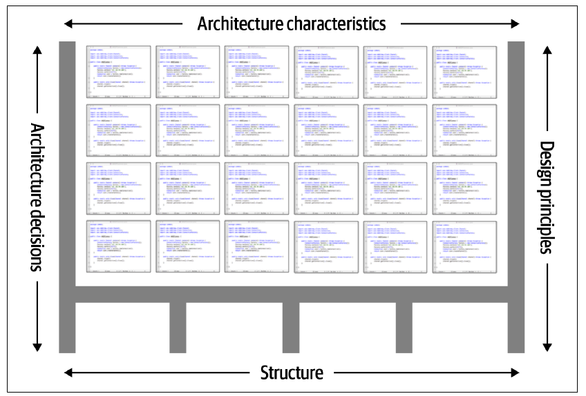

**Estructura:**

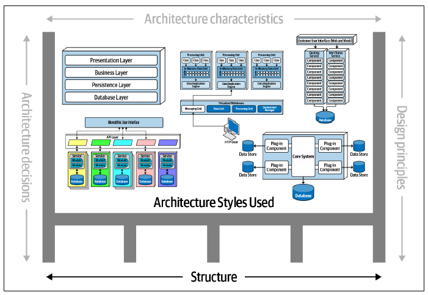

**Características:**

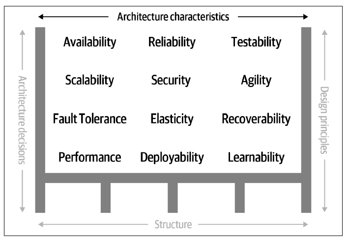

**Decisiones:**

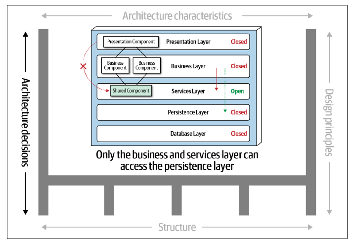

**Principio de diseño**

***

Ejemplos de arquitecturas tenemos:

* **Arquitectura Monolítica:** La aplicación se construye y despliega como una única unidad indivisible. Es sencilla de desarrollar y probar al principio, pero su crecimiento dificulta la escalabilidad, el mantenimiento y la adopción de nuevas tecnologías.
* **Arquitectura Cliente-Servidor:** Separa la aplicación en dos roles: el _cliente_ (generalmente la interfaz, solicita recursos) y el _servidor_ (provee recursos, lógica y datos). Es la base de la mayoría de aplicaciones en red y de la web.
* **Arquitectura en Capas (N-Tier):** Estructura la aplicación en capas horizontales (como Presentación, Negocio y Datos), donde cada capa solo interactúa con la adyacente. Facilita la organización y la sustitución de capas, pero puede ser rígida.
* **Arquitectura Orientada a Servicios (SOA):** Compone aplicaciones a partir de servicios de negocio (a menudo grandes y compartidos) que se comunican a través de protocolos estándar, buscando la reutilización y la integración empresarial.
* **Arquitectura de Microservicios:** Descompone una aplicación en un conjunto de servicios pequeños, autónomos y enfocados en una capacidad de negocio específica. Permite escalabilidad granular, despliegues independientes y flexibilidad tecnológica, pero aumenta la complejidad operativa.
* **Arquitectura Orientada a Eventos (EDA):** Define la comunicación entre componentes a través de la producción y consumo de eventos asíncronos, promoviendo el desacoplamiento. Es ideal para sistemas reactivos, escalables y resilientes que manejan flujos de información complejos.
* **Arquitectura Serverless:** Se apoya en proveedores de nube para ejecutar código en funciones efímeras (FaaS) sin preocuparse por la gestión de servidores. Optimiza costos y escalabilidad para cargas de trabajo variables o impulsadas por eventos.

***

**Patrón de Arquitectura**

> **Definición:** Un **patrón de arquitectura** es una **solución general, reutilizable y probada** para un problema recurrente en la organización de sistemas de software a gran escala. Define **cómo estructurar** y **coordinar** componentes principales de una aplicación.

— _Bass, Clements y Kazman. "Software Architecture in Practice", 3rd ed. (2012)_

> En otras palabras: Mientras un patrón de diseño (como Singleton) soluciona **detalles de clases y objetos** , un **patrón de arquitectura** ofrece una **estructura global** : cómo dividir el sistema, cómo se comunican las partes, cómo fluye la información.

**Ejemplos de patrones de arquitectura:**

* **Modelo-Vista-Controlador (MVC)** → separa datos, lógica y presentación.
* **Puertos-Adaptadores (Hexagonal):** → Este patrón se centra en aislar la lógica de negocio del resto del sistema (infraestructura, interfaces de usuario, bases de datos) mediante el uso de puertos e interfaces. Los "adaptadores" se encargan de la comunicación entre la lógica de negocio y el mundo exterior a través de estos puertos. Esto promueve la testabilidad y la independencia tecnológica.
* **CQRS:** → es un patrón que separa las operaciones de lectura (Queries) de las operaciones de escritura (Commands) en un sistema
* **Tubería y Filtros (Pipes and Filters):** → Este patrón estructura el sistema como una secuencia de componentes de procesamiento (filtros) conectados por canales de transmisión de datos (tuberías). Cada filtro realiza una transformación específica en los datos a medida que fluyen a través de la tubería. Es útil para procesar flujos de datos.
* **Agente-Mensajero (Broker)**: → Se utiliza en sistemas distribuidos para estructurar aplicaciones desacopladas. Un componente central (el broker) media la comunicación entre otros componentes (agentes). Los agentes se comunican enviando mensajes al broker, quien luego los enruta a los destinatarios apropiados. Esto facilita la escalabilidad y la flexibilidad.
* **Microkernel (Plug-in Architecture):** → Este patrón separa la funcionalidad central de la aplicación (el microkernel) de la funcionalidad opcional (los plug-ins o extensiones). El microkernel proporciona los servicios esenciales, mientras que los plug-ins añaden funcionalidades específicas y se integran con el microkernel a través de interfaces bien definidas. Es útil para sistemas extensibles y personalizables.

**Enfoque de Diseño (Approach)**

> **Definición:** Un **enfoque de diseño** de software es una **perspectiva de alto nivel** o una **filosofía** que establece los **principios y prioridades** que guían cómo se concibe y estructura un sistema.

Se centra en un **aspecto clave** (como el dominio del negocio en DDD, los datos, el comportamiento observable, etc.) para **abordar la complejidad y alcanzar los objetivos del software**. Este enfoque influye directamente en las decisiones de arquitectura y en las prácticas de implementación, pero sin ser, necesariamente, un conjunto rígido y detallado de pasos a seguir (como lo sería una metodología).

Aquí vemos algunos ejemplos de enfoques de diseño actuales:

* **Diseño Guiado por el Dominio (DDD - Domain-Driven Design):** Se centra en modelar el software basándose profundamente en el dominio del negocio y su lógica subyacente, especialmente en sistemas complejos. Utiliza un lenguaje común (Lenguaje Ubicuo) compartido por expertos y desarrolladores, y aplica patrones estratégicos y tácticos para manejar esa complejidad y alinear el software con el negocio.
* **Diseño Orientado a Datos (Data-Driven Design):** Prioriza la estructura, el almacenamiento y el flujo de los datos como el principal motor del diseño. La aplicación se construye a menudo alrededor del modelo de base de datos.
* **Diseño Guiado por Casos de Uso (Use Case Driven Design):** Se centra en modelar el sistema basándose en las interacciones específicas (casos de uso) que los usuarios tendrán para alcanzar sus objetivos. La funcionalidad se organiza para satisfacer estos flujos.
* **Diseño Guiado por el Comportamiento (BDD - como Filosofía):** Enfoca el diseño en definir y construir el sistema según su comportamiento observable desde fuera, a menudo usando ejemplos concretos. Busca alinear el software con las expectativas de negocio a través del comportamiento.
* **Diseño Basado en Responsabilidades (RDD - Responsibility-Driven Design):** El diseño emerge de asignar responsabilidades claras ("quién hace qué") a los objetos o componentes. Se enfoca en la colaboración entre elementos para cumplir con sus deberes.
* **Diseño Guiado por la Interfaz (Interface-Driven Design):** Pone énfasis en definir primero los contratos (interfaces) entre los componentes del sistema. Esto promueve el desacoplamiento y permite que las implementaciones se desarrollen y cambien independientemente.

***

**Conceptos en Arquitectura de Software**

| Concepto                 | Categoría                       | Qué define                                                                 | Ejemplos                                                 |
| ------------------------ | ------------------------------- | -------------------------------------------------------------------------- | -------------------------------------------------------- |
| Arquitectura de Software | Organización global del sistema | Cómo dividir y desplegar todo el sistema a gran escala.                    | Monolito, Microservicios, Serverless, SOA                |
| Patrón de Arquitectura   | Organización interna            | Cómo estructurar el interior de cada parte del sistema (servicio, módulo). | Hexagonal, CQRS, MVC, Broker                             |
| Enfoque de Diseño        | Estrategia de modelado          | Cómo pensar y representar el problema real en el modelo de software.       | Domain-Driven Design (DDD), Object-Oriented Design (OOD) |

***

**Tabla Comparativa**

| Concepto               | Nivel / Alcance              | Propósito Principal (La Pregunta que Responde)           | Descripción Breve                                                                  | Ejemplo Principal |
| ---------------------- | ---------------------------- | -------------------------------------------------------- | ---------------------------------------------------------------------------------- | ----------------- |
| **Enfoque de Diseño**  | **Filosófico / Estratégico** | **¿Por qué y en qué nos centramos?** (El _Porqué_)       | Guía la mentalidad, los principios y las prioridades generales del diseño.         | DDD               |
| **Arquitectura de SW** | **Estructural / Alto Nivel** | **¿Cuál es la forma general del sistema?** (El _Qué_)    | Define la estructura fundamental, los componentes principales y sus interacciones. | Microservicios    |
| **Patrón de Arq.**     | **Táctico / Específico**     | **¿Cómo resolvemos este problema concreto?** (El _Cómo_) | Ofrece soluciones probadas y reutilizables a problemas de diseño comunes.          | CQRS              |

***

Este gráfico ilustra cómo un enfoque puede influir en la elección de una arquitectura, y cómo esa arquitectura utiliza patrones específicos para su implementación.

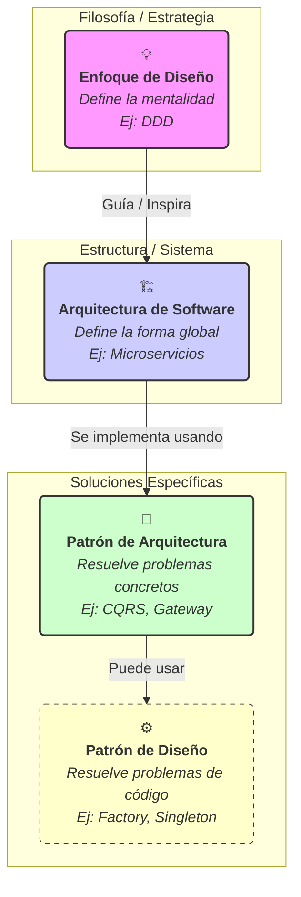

**Explicación del Gráfico:**

1. El **Enfoque de Diseño** (nivel más alto) establece la filosofía.
2. Esta filosofía **guía o inspira** la elección de una **Arquitectura de Software**.
3. La **Arquitectura** se construye y refina utilizando **Patrones de Arquitectura** para resolver problemas estructurales específicos.
4. A su vez, los **Patrones de Arquitectura** (y el código en general) a menudo utilizan **Patrones de Diseño** (un nivel más bajo, enfocado en clases y objetos) para su implementación detallada. (Añadido para mayor contexto).

***

## 1.1 Evolución de la arquitectura monolítica hacia los microservicios

Para entender por qué los microservicios han ganado tanta popularidad, primero debemos viajar un poco al pasado (y al presente de muchas aplicaciones) y hablar de su predecesor: **el Monolito**.

**¿Qué es un Monolito? 🧱**

Imaginad una aplicación construida como un **único bloque**. Todas sus funcionalidades (interfaz de usuario, lógica de negocio para pedidos, gestión de usuarios, procesamiento de pagos, acceso a datos) están empaquetadas y desplegadas juntas como una **sola unidad indivisible**.

Piensen en una aplicación web tradicional de FastAPI (o Django, RoR, Spring, etc.) donde todos los módulos, controladores y modelos residen en la misma base de código y se ejecutan en el mismo proceso.

**Visualicemos un Monolito:**

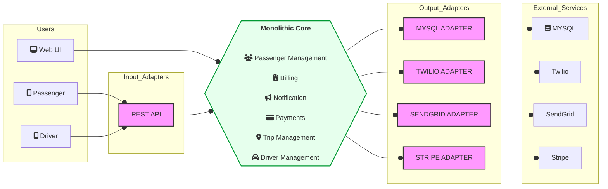

**Los Días Felices del Monolito (¡No todo es malo!)**

Al principio, los monolitos son geniales, especialmente para proyectos pequeños o startups:

* **Simplicidad Inicial:** Todo está en un solo lugar. Es fácil de desarrollar, depurar (dentro de un mismo IDE) y desplegar al principio.
* **Rendimiento (Inicial):** Las llamadas entre componentes son llamadas a funciones internas, muy rápidas, sin latencia de red.
* **Gestión Única:** Un solo repositorio de código, un solo pipeline de despliegue.

**Las Grietas Empiezan a Aparecer... El "Big Ball of Mud" 💩**

A medida que la aplicación crece y el equipo se expande, el monolito comienza a mostrar sus debilidades:

| Característica    | Monolito (Grande)              | El Dolor Asociado 😩                                                                                                           |
| ----------------- | ------------------------------ | ------------------------------------------------------------------------------------------------------------------------------ |
| **Despliegue**    | Todo o nada.                   | Un pequeño cambio requiere volver a desplegar _toda_ la aplicación. Riesgo alto, despliegues lentos y poco frecuentes.         |
| **Escalabilidad** | Escalas _todo_ el bloque.      | Si solo el módulo de "Pedidos" necesita más potencia, tienes que escalar toda la aplicación. Ineficiente y costoso.            |
| **Tecnología**    | Atado a un _stack_ único.      | Difícil adoptar nuevas tecnologías o lenguajes. Quedas atrapado en decisiones tempranas.                                       |
| **Desarrollo**    | Código base enorme y acoplado. | Difícil de entender, mayor tiempo de onboarding, cambios en un módulo pueden romper otros inesperadamente (alto acoplamiento). |
| **Equipos**       | Todos tocan todo.              | Los equipos no pueden trabajar y desplegar de forma independiente, generando cuellos de botella y conflictos.                  |
| **Resiliencia**   | Un fallo puede tumbar _todo_.  | Si el módulo de "Inventario" falla gravemente, puede derribar toda la aplicación.                                              |

Estos dolores llevaron a la industria a buscar una forma de construir sistemas grandes que fueran más **modulares, flexibles, escalables y resilientes**.

**La Evolución Natural: ¡Llegan los Microservicios! ✨**

Los microservicios surgen como una respuesta directa a los problemas del monolito a gran escala. La idea central es: **descomponer esa gran bola de lodo en servicios más pequeños, independientes y enfocados en una capacidad de negocio específica.**

Cada microservicio:

* Tiene su **propia base de código**.
* Se **despliega de forma independiente**.
* A menudo, tiene su **propia base de datos**.
* Se comunica con otros servicios a través de **APIs bien definidas** (generalmente HTTP/REST, gRPC o mensajería asíncrona).
* Puede ser desarrollado, desplegado y escalado **de forma autónoma**.

**Visualicemos los Microservicios:**

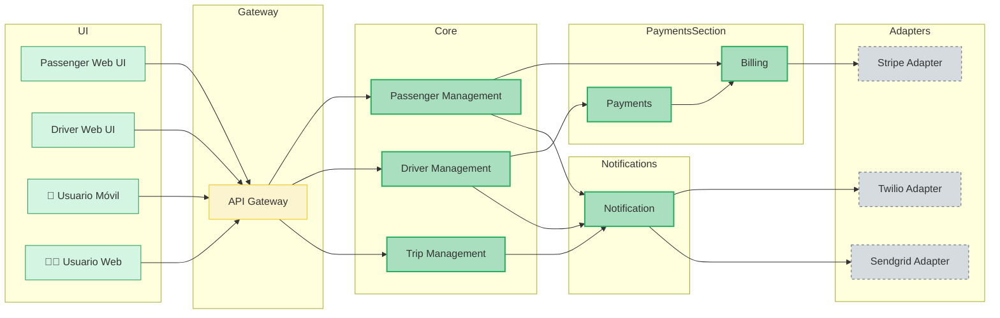

**(Piensa 🤔):** ¿Cómo este nuevo diagrama aborda los "dolores" que mencionamos en la tabla anterior?

* **Despliegue:** ¿Quieres cambiar algo en Pagos? ¡Despliega solo `PaymentSvc`! Rápido y con menos riesgo.
* **Escalabilidad:** ¿Pico de Pedidos? ¡Escala solo `OrderSvc`! Eficiente.
* **Tecnología:** ¿Quieres usar Go para el servicio de Pagos porque es súper eficiente? ¡Adelante! `OrderSvc` puede seguir en Python/FastAPI.
* **Equipos:** Un equipo puede ser dueño de `UserSvc`, otro de `OrderSvc`, trabajando en paralelo.

**En Resumen:**

La transición de monolitos a microservicios no es una moda, sino una **respuesta evolutiva** a los desafíos de construir y mantener aplicaciones complejas y a gran escala en el mundo ágil de hoy. Es un cambio que busca **agilidad, escalabilidad y resiliencia** a costa de introducir una nueva capa de complejidad: la **gestión de sistemas distribuidos**.

En las próximas secciones, exploraremos en detalle las ventajas, desventajas y principios que rigen este nuevo mundo. ¡Continuamos!

***

¡Perfecto! Ya entendemos _cómo_ llegamos aquí. Ahora, vamos a ser pragmáticos. Los microservicios suenan genial, pero como toda decisión arquitectónica, implican un **conjunto de pros y contras**. Conocerlos es vital para decidir si son la opción adecuada para vuestro proyecto y para estar preparados para los desafíos que conllevan.

***

## 1.2 Ventajas y Desventajas Clave de los Microservicios

Adoptar microservicios es como pasar de vivir en un apartamento estudio (monolito) a gestionar un complejo de apartamentos (microservicios). Ganas mucho en flexibilidad y espacio individual, pero la gestión general se vuelve más compleja. ¡Veamos esa balanza!

**Las Grandes Ganancias: Ventajas Clave 👍**

Los microservicios brillan cuando se aplican en el contexto adecuado, ofreciendo beneficios significativos:

| Ventaja                         | Descripción Detallada                                                                                     | Impacto Práctico                                                                                                                     |
| ------------------------------- | --------------------------------------------------------------------------------------------------------- | ------------------------------------------------------------------------------------------------------------------------------------ |
| **Escalabilidad Independiente** | Cada servicio puede escalar horizontal o verticalmente por sí solo, según sus necesidades específicas.    | ⚙️ **Optimización de costes y recursos**. Si solo las búsquedas son populares, escalas solo el servicio de búsqueda.                 |
| **Flexibilidad Tecnológica**    | Permite usar el _stack_ tecnológico (lenguaje, base de datos, librerías) más adecuado para cada servicio. | 🐍 **Innovación y Eficiencia**. Usa Python/FastAPI para servicios web rápidos, Go para procesamiento intensivo, Node.js para I/O.    |
| **Resiliencia y Aislamiento**   | Un fallo en un microservicio (si está bien diseñado) no debería derribar toda la aplicación.              | 🛡️ **Mayor disponibilidad**. El servicio de pagos puede caer, pero los usuarios aún pueden navegar por el catálogo.                 |
| **Despliegues Frecuentes**      | Los equipos pueden desplegar sus servicios de forma independiente y con mayor frecuencia.                 | 🚀 **Agilidad y Time-to-Market**. Lanza nuevas funcionalidades o corrige errores en un servicio sin esperar al ciclo de toda la app. |
| **Autonomía de Equipos**        | Los equipos pueden organizarse en torno a capacidades de negocio, siendo dueños de sus servicios.         | 🧑‍💻 **Paralelismo y Ownership**. Equipos más pequeños, enfocados y responsables, que avanzan más rápido.                           |
| **Mantenibilidad y Código**     | Bases de código más pequeñas y enfocadas son más fáciles de entender, modificar y mantener.               | 🧠 **Menor carga cognitiva**. Es más sencillo entender un servicio de 5k líneas que un monolito de 500k.                             |
| **Reemplazo Gradual**           | Es más fácil refactorizar o incluso reescribir un microservicio que una gran parte de un monolito.        | 🔄 **Evolución Sostenible**. Puedes actualizar o cambiar componentes sin detener el mundo.                                           |

**Los Desafíos y Costes: Desventajas Clave 👎**

No todo es color de rosa. La naturaleza distribuida de los microservicios introduce su propio conjunto de desafíos importantes:

| Desventaja                   | Descripción Detallada                                                                             | El Dolor Asociado 🤯                                                                                                               |
| ---------------------------- | ------------------------------------------------------------------------------------------------- | ---------------------------------------------------------------------------------------------------------------------------------- |
| **Complejidad Distribuida**  | Gestionar un sistema distribuido es inherentemente más complejo que un monolito.                  | 🌐 **Dificultad en depuración y trazabilidad**. Un _bug_ puede cruzar múltiples servicios. ¿Dónde falló?                           |
| **Sobrecarga Operacional**   | Necesitas desplegar, monitorizar, escalar y gestionar _muchos_ servicios.                         | 📈 **Mayor esfuerzo en DevOps**. Requiere CI/CD robusto, monitorización avanzada, logging centralizado, orquestación (Kubernetes). |
| **Latencia de Red**          | Las llamadas entre servicios viajan por la red, introduciendo latencia y posibles fallos.         | ⏳ **Rendimiento y Fiabilidad**. Hay que diseñar para fallos de red y optimizar las comunicaciones.                                 |
| **Consistencia de Datos**    | Mantener la consistencia transaccional a través de múltiples bases de datos es un reto.           | 🗄️ **Sagas y consistencia eventual**. Adiós a las transacciones ACID globales. Hola a patrones complejos.                         |
| **Complejidad en Pruebas**   | Probar interacciones entre servicios es más difícil que probar un monolito.                       | 🧪 **Tests de integración más caros**. Requiere entornos de prueba complejos o estrategias de _contract testing_.                  |
| **Descubrimiento y Config.** | Los servicios necesitan encontrarse entre sí y gestionar configuraciones distribuidas.            | 🗺️ **Infraestructura adicional**. Necesitas Service Discovery, Service Registry, Config Servers.                                  |
| **Costes Iniciales**         | Establecer la infraestructura y las prácticas para microservicios puede ser costoso al principio. | 💰 **Inversión inicial**. No es la opción más barata o rápida para empezar un proyecto pequeño.                                    |
| **"Monolito Distribuido"**   | Si no se diseñan bien (alto acoplamiento), puedes acabar con lo peor de ambos mundos.             | 🔗 **El peor escenario**. La complejidad de lo distribuido sin la independencia real.                                              |

**Visualicemos la Balanza (Conceptual):**

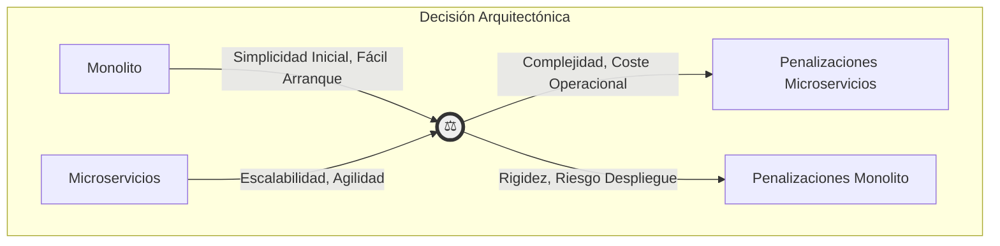

_(Este diagrama simple ilustra que la elección implica sopesar los beneficios frente a las penalizaciones de cada enfoque)._

**En Resumen:**

Los microservicios son una **herramienta poderosa**, pero no una bala de plata. Ofrecen enormes ventajas en **escalabilidad, flexibilidad y agilidad**, especialmente para aplicaciones grandes y complejas con equipos distribuidos. Sin embargo, estas ventajas vienen con un coste significativo en **complejidad operativa y de desarrollo**.

La clave es **evaluar vuestro contexto específico**: el tamaño del equipo, la complejidad del dominio, los requisitos de escalabilidad y vuestra madurez en prácticas DevOps. ¿Estáis preparados para gestionar la complejidad distribuida a cambio de la agilidad?

En la siguiente sección, profundizaremos en los principios que deben guiaros si decidís embarcaros en el viaje de los microservicios. ¡Vamos a ello!

***

¡Continuamos nuestro viaje! Ya sabemos de dónde venimos (monolitos) y hemos sopesado las luces y sombras (ventajas y desventajas). Ahora, si decidimos que los microservicios son nuestro camino, ¿cómo nos aseguramos de hacerlo bien? ¿Cómo evitamos construir un "monolito distribuido", que es lo peor de ambos mundos?

La respuesta está en seguir una serie de **principios fundamentales**. No son leyes escritas en piedra, sino guías que nos ayudarán a materializar las promesas de agilidad y escalabilidad.

***

## 1.3 Principios Fundamentales de la Arquitectura de Microservicios

Estos principios son la brújula 🧭 que nos guiará en el diseño y la implementación de nuestro ecosistema de servicios.

**1. Responsabilidad Única y Contexto Delimitado (Bounded Context)**

* **¿Qué es?** Cada microservicio debe ser responsable de **una única capacidad de negocio** y hacerla _muy bien_. Debe tener límites claros y bien definidos. Este es el punto de encuentro más fuerte con el **Diseño Orientado a Dominio (DDD)**, donde un microservicio a menudo implementa uno (o a veces, unos pocos y muy cohesionados) Bounded Contexts.
* **¿Por qué?** Fomenta la **cohesión** (todo lo relacionado está junto) y el **bajo acoplamiento** (cambios en un área no impactan otras), facilitando la comprensión y el mantenimiento.
* **Ejemplo:** Un `ServicioDeUsuarios` se encarga de todo lo relacionado con usuarios (registro, perfil, autenticación), pero _no_ sabe nada de pedidos o pagos.

**2. Autonomía e Independencia**

* **¿Qué es?** Los equipos deben poder **desarrollar, probar, desplegar y escalar** sus servicios de forma independiente, sin necesidad de coordinarse con otros equipos para cada cambio.
* **¿Por qué?** Es la clave para la **agilidad** y la **velocidad**. Permite que los equipos avancen en paralelo.
* **Ejemplo:** El equipo de Pagos puede lanzar 5 versiones nuevas de su servicio en una semana, mientras que el equipo de Inventario solo lanza una, y ninguno bloquea al otro.

**3. Descentralización (¡A Todos los Niveles!)**

Este es un principio con varias caras:

* **a) Descentralización de Datos:**
  * **¿Qué es?** ¡Quizás el más crucial! **Cada microservicio es dueño exclusivo de sus datos y su esquema de base de datos**. Ningún otro servicio puede acceder directamente a su base de datos. La comunicación _siempre_ se hace a través de su API.
  * **¿Por qué?** Garantiza el bajo acoplamiento. Si otros servicios pueden tocar tu tabla, ¡nunca podrás cambiarla sin romper algo! Es la base de la autonomía real.
  * **Visualicemos:**
* **b) Descentralización de Gobernanza:**
  * **¿Qué es?** Los equipos tienen libertad para elegir las **herramientas y tecnologías** que mejor se adapten a su servicio (dentro de unos límites razonables definidos por la organización, claro). No hay un "stack tecnológico único" impuesto desde arriba.
  * **¿Por qué?** Permite usar la **mejor herramienta para el trabajo** y fomenta la **innovación** y la **responsabilidad** del equipo.

**4. Diseño Orientado a Fallos (Resiliencia)**

* **¿Qué es?** En un sistema distribuido, las cosas _van a fallar_. La red puede fallar, los servicios pueden caerse o responder lentamente. Debemos **diseñar nuestros servicios asumiendo que esto ocurrirá** y programar defensivamente.
* **¿Por qué?** Para construir un sistema **robusto y resiliente** que pueda soportar fallos parciales sin colapsar por completo.
* **Ejemplo:** Implementar patrones como **Circuit Breakers** (si un servicio falla repetidamente, dejamos de llamarlo por un tiempo), **Timeouts** (no esperar eternamente una respuesta), **Retries** (reintentar llamadas con cuidado) y **Bulkheads** (aislar recursos para que un fallo no se propague).

**5. Comunicación Vía APIs**

* **¿Qué es?** Los servicios interactúan entre sí a través de **interfaces bien definidas y estables**, generalmente APIs REST, gRPC o colas de mensajes (comunicación síncrona vs. asíncrona). Estas APIs son el **contrato** entre servicios.
* **¿Por qué?** Oculta los detalles de implementación y permite que los servicios evolucionen internamente sin romper a sus consumidores, siempre que el contrato se respete.
* **Ejemplo:** El `ServicioDePedidos` no sabe cómo funciona internamente el `ServicioDePagos`, solo sabe que puede llamar a `POST /payments` con ciertos datos y esperar una respuesta.

**6. Automatización Extrema (Infraestructura como Código y CI/CD)**

* **¿Qué es?** Dado que tenemos _muchos_ servicios, es inviable gestionarlos manualmente. Necesitamos **pipelines de Integración Continua y Despliegue Continuo (CI/CD)** robustos y automatización para provisionar la infraestructura.
* **¿Por qué?** Para gestionar la **complejidad operacional**, asegurar la **consistencia**, reducir errores y permitir **despliegues rápidos y fiables**.
* **Ejemplo:** Un `git push` a la rama principal de un servicio dispara automáticamente las pruebas, la construcción del contenedor Docker y el despliegue a producción (o a un entorno intermedio) sin intervención manual.

**7. Observabilidad (¡No solo Monitorización!)**

* **¿Qué es?** No basta con saber si un servicio está "arriba" o "abajo". Necesitamos poder **entender el estado interno del sistema** a partir de las señales que emite. Esto incluye:
  * **Logs Centralizados:** Recoger logs de todos los servicios en un solo lugar.
  * **Métricas Detalladas:** Métricas de rendimiento, negocio y sistema.
  * **Trazabilidad Distribuida:** Seguir una petición a través de múltiples servicios.
* **¿Por qué?** Para **depurar problemas**, entender el **rendimiento** y obtener **insights** en un sistema complejo y distribuido.
* **Ejemplo:** Usar herramientas como ELK/EFK, Prometheus & Grafana, Jaeger o OpenTelemetry.

**Tabla Resumen de Principios:**

| Principio                  | Objetivo Principal           | Implicación Clave                                     |
| -------------------------- | ---------------------------- | ----------------------------------------------------- |
| **Responsabilidad Única**  | Cohesión, Bajo Acoplamiento  | Servicios pequeños y enfocados (alineados con DDD).   |
| **Autonomía**              | Agilidad, Velocidad          | Equipos y servicios despliegan independientemente.    |
| **Datos Descentralizados** | Bajo Acoplamiento, Autonomía | **¡NO COMPARTIR BASES DE DATOS!**                     |
| **Gobernanza Descentral.** | Innovación, Eficiencia       | Elige la herramienta adecuada (con cabeza).           |
| **Diseño para Fallos**     | Resiliencia, Robustez        | Implementa Circuit Breakers, Timeouts, Retries...     |
| **Comunicación Vía APIs**  | Contratos Claros, Desacople  | Define y versiona tus APIs cuidadosamente.            |
| **Automatización**         | Gestión, Fiabilidad          | Invierte masivamente en DevOps y CI/CD.               |
| **Observabilidad**         | Visibilidad, Depuración      | Implementa Logging, Métricas y Trazas desde el día 1. |

***

¡Muy bien! Hemos visto la teoría, los pros, los contras y los principios. Pero, ¿dónde aterriza todo esto? ¿Cuándo realmente _vale la pena_ pagar el precio de la complejidad distribuida? No todas las aplicaciones necesitan ser una constelación de microservicios.

Veamos algunos **escenarios del mundo real** donde la arquitectura de microservicios no solo tiene sentido, sino que a menudo es la clave del éxito.

***

## 1.4 Casos de Uso Reales donde los Microservicios Aportan Valor

Aquí es donde la goma se encuentra con el camino. Analicemos situaciones donde las ventajas de los microservicios superan con creces sus desventajas.

**1. Plataformas de E-commerce a Gran Escala (Ej: Amazon, Netflix, Zalando)**

* **El Desafío:** Estas plataformas son gigantes. Tienen un catálogo enorme, millones de usuarios, picos de demanda (Black Friday, estrenos), sistemas de recomendación complejos, gestión de inventario, logística, pagos... ¡y todo debe funcionar 24/7 y evolucionar rápidamente!
* **¿Por qué Microservicios?**
  * **Escalabilidad Granular:** El servicio de "Búsqueda" o "Recomendaciones" puede necesitar 1000 instancias, mientras que el de "Facturación" solo 10. Un monolito haría esto imposible o carísimo.
  * **Resiliencia:** Si el servicio de "Opiniones de Usuarios" cae, ¡la gente _aún debe poder comprar_!
  * **Equipos Independientes:** Tienen cientos de equipos trabajando en paralelo. Cada equipo puede ser dueño de su servicio (Catálogo, Cesta de Compra, Pagos) y desplegar sin pisar a los demás.
  * **Innovación Tecnológica:** Pueden usar bases de datos NoSQL para el catálogo, motores de búsqueda especializados, y lenguajes de ML para recomendaciones.
* **Referencia Clave:** Netflix es uno de los pioneros y más vocales proponentes de los microservicios. Su blog tecnológico está lleno de ejemplos . Amazon, aunque empezó como monolito, tuvo que evolucionar hacia servicios para poder escalar.

**2. Aplicaciones con Módulos de Diferente Carga y Requisitos (Ej: Redes Sociales, Plataformas de Streaming)**

* **El Desafío:** Piensa en una plataforma como YouTube o TikTok. El servicio que ingiere y procesa videos tiene requisitos de CPU y almacenamiento _muy_ diferentes al servicio que gestiona los perfiles de usuario o el que sirve los comentarios.
* **¿Por qué Microservicios?**
  * **Optimización de Recursos:** Puedes desplegar los servicios de _transcoding_ de vídeo en máquinas optimizadas para CPU, mientras que los servicios de API web corren en instancias más ligeras.
  * **Escalabilidad Enfocada:** Permite escalar masivamente solo las partes que lo necesitan (ej: el _feed_ de noticias, la entrega de vídeo).
  * **Tecnología Específica:** Usar herramientas especializadas para procesamiento de vídeo o análisis de grafos sociales, sin impactar el resto.

**3. Sistemas Empresariales Complejos y de Rápida Evolución (Ej: FinTech, SaaS)**

* **El Desafío:** Las empresas de tecnología financiera (FinTech) o las plataformas Software-as-a-Service (SaaS) necesitan innovar _constantemente_ para competir. Sus dominios suelen ser complejos (regulaciones, cálculos financieros, múltiples integraciones) y requieren alta fiabilidad.
* **¿Por qué Microservicios?**
  * **Agilidad (Time-to-Market):** La capacidad de desplegar pequeñas funcionalidades de forma rápida e independiente es vital.
  * **Gestión de Complejidad:** Descomponer un dominio complejo en servicios más manejables (Gestión de Cuentas, Préstamos, Transferencias, Cumplimiento Normativo) ayuda a razonar sobre el sistema.
  * **Seguridad y Aislamiento:** Puedes aplicar medidas de seguridad más estrictas en servicios críticos (ej: Pagos) sin sobrecargar otros.

**4. Modernización de Sistemas Legados (El Patrón "Strangler Fig")**

* **El Desafío:** Tienes un monolito enorme, antiguo, frágil y difícil de cambiar. Reescribirlo todo de golpe es demasiado arriesgado y costoso.
* **¿Por qué Microservicios?** El **Patrón Strangler Fig** (Figura Estranguladora), acuñado por Martin Fowler , propone "estrangular" gradualmente el monolito. Creas nuevos microservicios alrededor del monolito, interceptando llamadas y redirigiéndolas. Poco a poco, la funcionalidad se migra a los nuevos servicios hasta que el monolito original puede ser "apagado".
* **Visualicemos el Strangler Fig:**

**Tabla Resumen de Casos de Uso:**

| Caso de Uso              | Desafío Principal                                     | Beneficio Clave de Microservicios                            |
| ------------------------ | ----------------------------------------------------- | ------------------------------------------------------------ |
| **E-commerce Grande**    | Escalabilidad masiva, complejidad, equipos grandes.   | **Escalabilidad**, **Resiliencia**, **Autonomía**.           |
| **Cargas Mixtas**        | Diferentes necesidades de recursos por módulo.        | **Optimización de Recursos**, **Escalabilidad Enfocada**.    |
| **FinTech / SaaS**       | Rápida evolución, complejidad de dominio, fiabilidad. | **Agilidad**, **Mantenibilidad**, **Aislamiento**.           |
| **Modernización Legado** | Riesgo y coste de migrar monolitos antiguos.          | **Migración Gradual** (Strangler Fig), **Reducción Riesgo**. |

***

¡Genial! Hemos hablado de la evolución, las ventajas/desventajas y hemos aclarado la diferencia con SOA. Ahora llegamos a un punto crucial que conecta directamente con el corazón de este curso: **¿Qué pinta el Diseño Orientado a Dominio (DDD) en todo este universo de microservicios?** La respuesta es: ¡Pinta, y mucho! Es, de hecho, una de las herramientas más potentes para diseñar microservicios _correctamente_.

***

## 1.5 Distinción entre Microservicios y SOA (Service-Oriented Architecture)

SOA fue un precursor importante, buscando romper los monolitos empresariales y promover la reutilización. Sin embargo, sus implementaciones a menudo llevaron a sus propios problemas, que los microservicios intentan evitar.

**¿Qué era (es) SOA? 🤔**

SOA buscaba integrar aplicaciones empresariales heterogéneas exponiendo sus funcionalidades como **servicios reutilizables** a nivel de toda la empresa. La idea era que pudieras combinar estos servicios para crear nuevos procesos de negocio. Un componente clave y a menudo central en SOA era el **Enterprise Service Bus (ESB)**.

* **ESB (Bus de Servicios Empresarial):** Actuaba como un "cerebro" centralizado. Se encargaba del enrutamiento de mensajes, la transformación de protocolos, la orquestación de servicios y, a menudo, contenía lógica de negocio.

**Las Diferencias Clave: Microservicios vs. SOA ⚔️**

La mejor manera de entenderlo es comparando sus características y filosofías:

| Característica     | Arquitectura Orientada a Servicios (SOA)                                  | Arquitectura de Microservicios                                                                            |
| ------------------ | ------------------------------------------------------------------------- | --------------------------------------------------------------------------------------------------------- |
| **Alcance**        | **Empresarial** (Integrar _múltiples_ aplicaciones).                      | **Aplicación** (Construir _una_ aplicación como suite de servicios).                                      |
| **Granularidad**   | Generalmente **grande** (servicios "gruesos").                            | **Pequeña y Fina** (servicios muy enfocados).                                                             |
| **Comunicación**   | A menudo **ESB**, SOAP, WS-\*, estándares complejos.                      | **"Pipes tontos, Endpoints inteligentes"**, REST, gRPC, Mensajería.                                       |
| **ESB**            | **Central y "listo"** (orquestación, lógica).                             | **Evitado**. Se prefiere la orquestación/coreografía descentralizada.                                     |
| **Almacenamiento** | A menudo **permite/fomenta bases de datos compartidas**.                  | **Estrictamente descentralizado**. Cada servicio posee sus datos.                                         |
| **Despliegue**     | A menudo en **bloques más grandes**, ciclo más lento.                     | **Independiente** por servicio, ciclo rápido.                                                             |
| **Gobernanza**     | **Centralizada**, fuerte énfasis en estándares.                           | **Descentralizada**, más libertad para los equipos.                                                       |
| **Reutilización**  | Foco en la **reutilización técnica** (a menudo a costa del acoplamiento). | Foco en la **reutilización como librerías/código** o por API, no compartiendo lógica de negocio compleja. |

**Visualizando la Diferencia en Comunicación:**

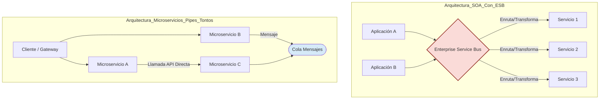

**La metáfora clave:**

* **SOA (a menudo):** "Endpoints tontos, **Pipes inteligentes**". La inteligencia (enrutamiento, transformación, orquestación) reside en el bus (ESB). Esto puede crear un cuello de botella y un punto central de fallo y complejidad.
* **Microservicios:** "**Endpoints inteligentes**, Pipes tontos". Cada microservicio contiene su propia lógica. La comunicación (la "tubería") es lo más simple posible (HTTP, colas de mensajes básicas). La inteligencia está en los extremos, no en el medio.

**¿Significa esto que SOA está "mal"?** No necesariamente. Cumplió un propósito en su momento y algunos de sus principios son válidos. Sin embargo, muchas implementaciones de SOA se volvieron tan complejas y rígidas como los monolitos que intentaban reemplazar. Los microservicios aprenden de esa experiencia, priorizando la **agilidad, la independencia de despliegue y la descentralización radical**, especialmente en lo que respecta a los datos y la lógica de comunicación.

***

## 1.6 La Importancia del Diseño Orientado a Dominio (DDD) en este Contexto

Construir microservicios sin una guía clara sobre _dónde_ trazar las líneas divisorias es una receta para el desastre. Podríamos acabar con servicios demasiado grandes, demasiado pequeños, o peor aún, acoplados de formas extrañas (el temido "monolito distribuido"). Aquí es donde DDD se convierte en nuestro mejor amigo.

**Recordatorio Rápido: ¿Qué es DDD? 🧠**

Como ya sabéis de nuestro curso, DDD es un enfoque para el desarrollo de software que se centra en **comprender profundamente el dominio del negocio** para el que estamos construyendo. Sus pilares incluyen:

* **Lenguaje Ubicuo (Ubiquitous Language):** Un lenguaje común y compartido entre desarrolladores y expertos del dominio para hablar sobre el sistema.
* **Contexto Delimitado (Bounded Context):** Límites claros dentro del dominio donde un modelo de negocio específico (y su lenguaje) es consistente y válido.
* **Modelado Estratégico y Táctico:** Herramientas para identificar esos contextos y para diseñar los modelos dentro de ellos.

**El "Match" Perfecto: Bounded Contexts ❤️ Microservices**

La conexión más fuerte y vital entre DDD y los microservicios es el concepto de **Bounded Context**. \[^5^]

> **Un Bounded Context es, a menudo, el candidato ideal para convertirse en un microservicio.**

¿Por qué?

1. **Límites Lógicos y de Negocio:** Un Bounded Context define una frontera _basada en el negocio_, no en la tecnología. Agrupa funcionalidades y datos que tienen sentido _juntos_ desde la perspectiva del dominio. Esto nos da una guía natural y lógica para decidir qué debe contener un microservicio.
2. **Modelo Consistente:** Dentro de un Bounded Context, el modelo es consistente. Al mapearlo a un microservicio, aseguramos que ese servicio tenga una **responsabilidad clara** y un **modelo interno coherente**. Un `Cliente` en el contexto de "Ventas" puede ser muy diferente a un `Cliente` en el contexto de "Soporte Técnico", y está bien que cada microservicio refleje esa diferencia.
3. **Bajo Acoplamiento y Alta Cohesión:** Al diseñar servicios en torno a Bounded Contexts, promovemos:
   * **Alta Cohesión:** Todo lo que necesita cambiar junto _dentro_ de esa capacidad de negocio, está en el mismo servicio.
   * **Bajo Acoplamiento:** Las interacciones _entre_ contextos (y por tanto, entre servicios) se minimizan y se hacen explícitas a través de APIs, reflejando las interacciones naturales del negocio.

**Visualizando la Magia: De Bounded Contexts a Microservicios**

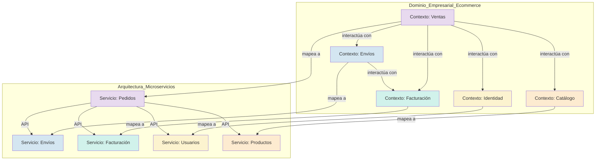

_(Nota: A veces, un Bounded Context puede ser tan complejo que se divide en varios microservicios, o uno muy simple podría combinarse, pero la regla general es una fuerte correlación 1:1 o 1:N)._

**Beneficios Adicionales de Usar DDD:**

* **Lenguaje Ubicuo en las APIs:** Las APIs entre microservicios pueden (y deben) usar términos del Lenguaje Ubicuo, haciendo las interacciones más claras y menos propensas a malentendidos.
* **Autonomía Real:** Al basar los servicios en Bounded Contexts, los equipos pueden tener una _verdadera autonomía_ sobre su parte del dominio, su modelo y su implementación.
* **Enfoque en el Valor:** DDD nos obliga a pensar primero en el _negocio_, asegurando que nuestra arquitectura de microservicios esté alineada con los objetivos de la empresa y no sea solo un ejercicio técnico.

En definitiva, **DDD proporciona el "mapa estratégico" que necesitamos para navegar por la complejidad de diseñar un sistema de microservicios**. Nos da las herramientas para tomar decisiones informadas sobre los límites de nuestros servicios, asegurando que sean lógicos, coherentes y, sobre todo, útiles para el negocio.

***

¡Claro! Aunque ya hemos cubierto el punto 1.5 sobre SOA vs. Microservicios, es posible que quieras revisarlo o quizás te referías al siguiente punto, el **1.7: Bounded context y separación de responsabilidades**.

Dado que acabamos de hablar de la importancia de DDD (1.6), tiene mucho sentido profundizar ahora en el concepto de **Bounded Context**, ya que es la piedra angular para definir nuestros microservicios. ¡Vamos a desgranarlo!

***

## 1.7 Bounded Context y Separación de Responsabilidades

Si DDD nos da el mapa, el **Bounded Context (Contexto Delimitado)** es la forma en que trazamos las fronteras en ese mapa. Entender bien este concepto es _fundamental_ para lograr una buena separación de responsabilidades en nuestra arquitectura de microservicios.

**¿Qué es Exactamente un Bounded Context? 🗺️**

Imagina el vasto territorio del dominio de tu negocio. Un Bounded Context es como **trazar una frontera** alrededor de una región específica de ese territorio. Dentro de esa frontera:

1. **Hay un Modelo Único y Consistente:** Todos los términos, reglas y estructuras de datos tienen un significado preciso y coherente.
2. **Vive un Lenguaje Ubicuo Específico:** El equipo (desarrolladores y expertos) usa un lenguaje particular y sin ambigüedades para hablar de esa parte del dominio.
3. **Se Protege la Integridad:** La frontera actúa como una "membrana protectora", evitando que conceptos o reglas de otros contextos "contaminen" o compliquen el modelo interno.

**¡La Clave!** La misma palabra puede significar cosas _diferentes_ en Bounded Contexts distintos. Y eso _está bien_.

* **Ejemplo:**
  * En el `Contexto de Ventas`, un "Producto" puede tener `Precio`, `Descuentos`, `NombreComercial`.
  * En el `Contexto de Almacén`, un "Producto" puede ser `SKU`, `NivelDeStock`, `Ubicacion`, `Peso`.
  * En el `Contexto de Soporte`, un "Producto" puede tener `ManualDeUsuario`, `FAQs`, `HistorialDeTickets`.

Son conceptualmente "lo mismo", pero en la práctica, sus modelos y atributos son diferentes porque sirven a propósitos distintos. Un Bounded Context nos permite **modelar cada versión sin conflictos**.

**Bounded Context como Motor de la Separación de Responsabilidades**

Aquí es donde se une con el Principio de Responsabilidad Única (SRP), pero a un nivel más alto (estratégico):

* **Un Microservicio = Un Bounded Context (Idealmente):** Al alinear un microservicio con un Bounded Context, le estamos asignando una **responsabilidad de negocio clara y bien definida**.
* **Responsabilidad sobre el Modelo:** El microservicio es el _único_ responsable de mantener la consistencia y la lógica de su modelo interno. Nadie más puede meter mano.
* **Responsabilidad sobre los Datos:** Es el _único_ responsable de sus datos. (¡Recordad la descentralización de datos!).
* **Responsabilidad sobre su Lenguaje:** Expone su funcionalidad a través de APIs que (idealmente) hablan su Lenguaje Ubicuo.

**Visualicemos las Responsabilidades Claras:**

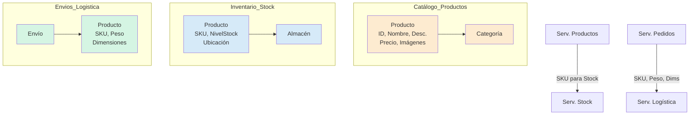

En este diagrama, vemos cómo cada contexto/servicio tiene _su propia visión_ del "Producto" y es responsable _solo_ de esa visión. El `Servicio de Productos` no sabe ni le importa dónde está almacenado un producto; solo le importa cómo presentarlo al cliente. El `Servicio de Stock` no sabe el precio; solo le importa cuántos hay. Esta es la **separación de responsabilidades en acción**, impulsada por los Bounded Contexts.

**¿Cómo Identificarlos? (Pistas Rápidas)**

Identificar Bounded Contexts es un arte y una ciencia (y un taller de DDD completo), pero algunas pistas son:

* **Busca Diferencias Lingüísticas:** ¿Cuándo los expertos usan la misma palabra pero quieren decir cosas distintas? ¡Ahí hay una frontera!
* **Analiza Procesos de Negocio:** ¿Qué departamentos o roles intervienen? ¿Qué información maneja cada uno?
* **Observa las Dependencias:** ¿Qué partes del sistema necesitan cambiar juntas con frecuencia?
* **Usa Talleres Colaborativos:** Técnicas como **Event Storming** \[^9^] son extremadamente útiles para visualizar el dominio y descubrir estos contextos de forma colaborativa.

Al usar los Bounded Contexts como guía para definir nuestros microservicios, no solo logramos una separación técnica, sino una **separación alineada con el negocio**, lo que resulta en sistemas más robustos, mantenibles y evolutivos.

***

¡Vamos a por ello! Hemos hablado de tecnología, arquitectura y diseño, pero los microservicios tienen un impacto profundo en algo igual o más importante: **las personas y cómo se organizan**. Si intentas implementar microservicios sin adaptar la estructura de tus equipos, te encontrarás con muchos obstáculos.

***

## 1.8 Distribución de los Equipos en torno a Microservicios

Existe una observación muy famosa en el mundo del software conocida como la **Ley de Conway** \[^10^]. En esencia, dice:

> "Las organizaciones que diseñan sistemas (...) están destinadas a producir diseños que son copias de las estructuras de comunicación de estas organizaciones."

¿Qué significa esto para nosotros? Que **tu arquitectura de software tenderá a reflejar cómo están organizados tus equipos (y viceversa)**. Si quieres una arquitectura de microservicios exitosa (modular, independiente), necesitas equipos que trabajen de forma modular e independiente.

**El Modelo Tradicional (Orientado a Monolitos/Capas): горизонтальный**

En muchas organizaciones tradicionales, los equipos se estructuran por _capas tecnológicas_:

* Equipo de Frontend (UI)
* Equipo de Backend (Lógica de Negocio)
* Equipo de Base de Datos (DBAs)
* Equipo de QA
* Equipo de Operaciones (Ops)

**Visualicemos esto:**

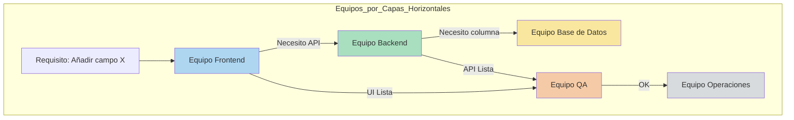

* **El Problema:** Para implementar cualquier funcionalidad _completa_, necesitas coordinar a **múltiples equipos**. Esto crea:
  * **Dependencias y Handoffs:** Un equipo tiene que esperar a otro.
  * **Cuellos de Botella:** Si el equipo de DBAs está sobrecargado, todo se detiene.
  * **Falta de Ownership:** ¿Quién es _realmente_ dueño de la funcionalidad "Gestión de Pedidos" de principio a fin? Nadie.
  * **Comunicación Lenta:** Las decisiones cruzan barreras organizativas.

Este modelo _refuerza_ la arquitectura monolítica.

**El Modelo Microservicios (Orientado a Capacidades): Вертикальный**

La arquitectura de microservicios promueve (y se beneficia enormemente) de una estructura de equipos **vertical**, alineada con las **capacidades de negocio** (¡nuestros Bounded Contexts!).

* Cada equipo es **multifuncional** (cross-functional).
* Contiene (o tiene acceso directo a) todas las habilidades necesarias: Frontend, Backend, Datos, QA, Ops.
* Es **dueño de uno o varios microservicios** de principio a fin (You Build It, You Run It!).
* A menudo se les llama "Equipos de Flujo" (Stream-Aligned Teams \[^11^]) o, popularmente, "Equipos de Dos Pizzas" (suficientemente pequeños para ser alimentados con dos pizzas).

**Visualicemos esto:**

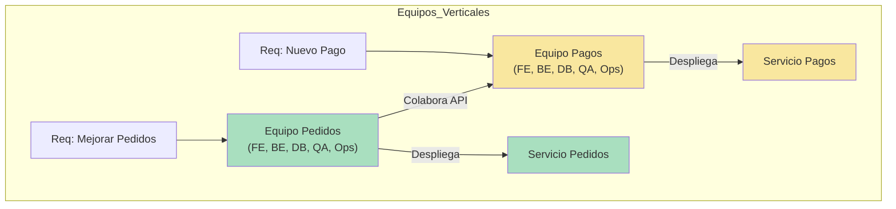

* **Las Ventajas:**
  * **Autonomía Real:** El Equipo de Pedidos puede desarrollar, probar y desplegar cambios en su servicio sin esperar al Equipo de Pagos.
  * **Velocidad y Agilidad:** Ciclos de desarrollo mucho más rápidos.
  * **Ownership Claro:** El equipo es responsable de la salud, rendimiento y éxito de su servicio.
  * **Conocimiento Profundo del Dominio:** El equipo se convierte en experto en su área de negocio.
  * **Comunicación Eficiente:** La mayoría de la comunicación ocurre _dentro_ del equipo.

**Tabla Comparativa de Estructuras de Equipo:**

| Característica   | Equipos Horizontales (Capas) | Equipos Verticales (Capacidad)        |
| ---------------- | ---------------------------- | ------------------------------------- |
| **Alineación**   | Capa Tecnológica             | Capacidad de Negocio / Microservicio  |
| **Composición**  | Habilidades Homogéneas       | **Multifuncional**                    |
| **Ownership**    | Fragmentado (por capa)       | **De Extremo a Extremo** (End-to-End) |
| **Dependencias** | Altas (entre equipos)        | **Bajas** (entre equipos)             |
| **Velocidad**    | Lenta (muchos handoffs)      | **Rápida** (autonomía)                |
| **Ideal Para**   | Monolitos                    | **Microservicios**                    |

**No es Gratis: Los Desafíos y Nuevas Necesidades**

Este modelo no elimina la necesidad de coordinación, la transforma:

* **Coordinación entre Equipos:** Se necesita definir bien las APIs y contratos entre servicios.
* **Plataforma Común:** Para evitar que cada equipo reinvente la rueda, suelen surgir **Equipos de Plataforma** que proporcionan herramientas comunes (CI/CD, monitorización, infraestructura base).
* **Gremios (Guilds):** Comunidades de práctica (ej: Gremio de Frontend, Gremio de Python) para compartir conocimientos y establecer buenas prácticas a través de los equipos verticales.

Adoptar microservicios es tanto un **viaje organizacional como tecnológico**. Requiere un cambio cultural hacia la **autonomía, la confianza y la responsabilidad distribuida**. Ignorar el factor humano y organizativo es uno de los mayores riesgos al adoptar esta arquitectura.

***

## 1.9 Evaluación del Impacto de los Microservicios en la Gestión del Ciclo de Vida del Software (SDLC)

La adopción de una arquitectura de microservicios no es una simple decisión técnica; es una **transformación fundamental** que reverbera a través de _todo_ el Ciclo de Vida del Desarrollo de Software (SDLC). Afecta no solo a las herramientas, sino a los procesos, la cultura y las habilidades requeridas. Ignorar este impacto es una receta para el fracaso.

Analicemos cada fase del SDLC, destacando cómo los microservicios cambian las reglas del juego.

**Diagrama General del SDLC en Microservicios**

Este diagrama ilustra el flujo, pero también la **naturaleza cíclica e interconectada** y la **complejidad añadida** en las fases de prueba y operación.

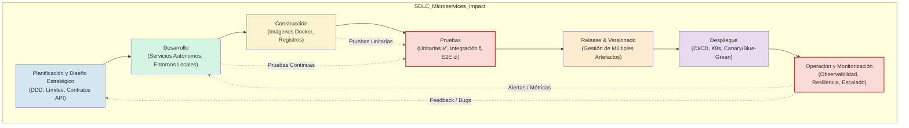

**Análisis Detallado por Fases**

| Fase SDLC                      | Descripción del Impacto y Consideraciones Clave                                                                                                                                                                                        | Implicaciones Positivas (+)                                                                                              | Implicaciones Negativas / Desafíos (-)                                                                   | Prácticas Clave Requeridas                                                              |
| ------------------------------ | -------------------------------------------------------------------------------------------------------------------------------------------------------------------------------------------------------------------------------------- | ------------------------------------------------------------------------------------------------------------------------ | -------------------------------------------------------------------------------------------------------- | --------------------------------------------------------------------------------------- |
| **Planificación y Diseño**     | **Cambio:** De diseñar una aplicación a diseñar un _sistema_ de aplicaciones. El foco se mueve al diseño _estratégico_. **DDD es vital** para definir límites. Se debe pensar en _contratos de API_ y _resiliencia_ desde el día cero. | ✅ Alineación con Negocio.\ ✅ Entregas incrementales.\ ✅ Claridad en responsabilidades.                             | ❌ Mayor esfuerzo inicial.\ ❌ Requiere visión arquitectónica.\ ❌ Complejidad de interacciones.      | **DDD**, **Event Storming**, Diseño de APIs (OpenAPI), Planificación de Resiliencia.    |
| **Desarrollo**                 | **Cambio:** Equipos desarrollan servicios autónomos. Se potencia el _poliglotismo_, pero requiere disciplina. La configuración del _entorno local_ se vuelve un reto mayor.                                                            | ✅ Autonomía de equipos.\ ✅ Velocidad (paralelo).\ ✅ Flexibilidad tecnológica.                                      | ❌ Complejidad Entornos Dev.\ ❌ Necesidad de Mocks/Stubs.\ ❌ Fragmentación conocimiento.            | **Docker/Compose**, Telepresence/Gefyra, Mocks (Pact), IDEs potentes.                   |
| **Construcción (Build)**       | **Cambio:** De un _build_ a _muchos builds_. El foco está en la **estandarización y automatización** de la creación de artefactos (imágenes Docker).                                                                                   | ✅ Builds más rápidos/pequeños.\ ✅ Aislamiento dependencias.                                                           | ❌ Multiplicidad de pipelines.\ ❌ Gestión de registros.\ ❌ Estandarización necesaria.               | **Dockerfiles** optimizados, Registros de Contenedores (ECR, GCR, Harbor), BuildPacks.  |
| **Pruebas (Testing)**          | **Cambio:** **¡El talón de Aquiles!** Las pruebas unitarias son fáciles, pero las de integración y E2E se vuelven un _infierno_ si no se planifican. Se requiere un cambio hacia _pruebas en producción_ y _Contract Testing_.         | ✅ Tests unitarios rápidos.\ ✅ Aislamiento de bugs unitarios.                                                          | 🔥 **Complejidad extrema**.\ 🔥 Necesidad de entornos.\ 🔥 Datos de prueba.\ 🔥 Fragilidad E2E. | **Contract Testing** (Pact), Mocks, Pruebas de Componente, Pruebas en Producción.       |
| **Release & Versionado**       | **Cambio:** Gestionar el versionado y la compatibilidad de _múltiples_ artefactos desplegables. Las APIs son _contratos públicos_ que deben gestionarse con cuidado (Semantic Versioning).                                             | ✅ Releases independientes.\ ✅ Menor riesgo por release.                                                               | ❌ Gestión de dependencias.\ ❌ Versionado de APIs.\ ❌ Coordinación (ocasional).                     | **Semantic Versioning**, Registros de Artefactos, Gestión de Features Flags.            |
| **Despliegue (Deployment)**    | **Cambio:** El despliegue se vuelve una _capacidad estratégica_. Requiere **automatización total (CI/CD)** y plataformas de orquestación. Permite patrones avanzados.                                                                  | ✅ **Agilidad sin precedentes**.\ ✅ Despliegues frecuentes.\ ✅ Rollbacks rápidos/aislados.\ ✅ Canary/Blue-Green. | ⚙️ **CI/CD es VITAL**.\ ⚙️ Requiere Orquestación (K8s).\ ⚙️ Complejidad Configuración.             | **Kubernetes**, **CI/CD** (GitLab, Actions), **GitOps** (ArgoCD, Flux), Helm/Kustomize. |
| **Operación y Monitorización** | **Cambio:** De monitorizar _una_ cosa a monitorizar _un sistema distribuido_. La **Observabilidad** (Logs, Métricas, Trazas) pasa de ser "deseable" a "absolutamente crítica".                                                         | ✅ Resiliencia (aislamiento).\ ✅ Escalabilidad granular.                                                               | 🚨 **Complejidad operacional**.\ 🚨 Dificultad depuración.\ 🚨 Visibilidad es un reto.             | **Observabilidad** (Prometheus, Grafana, Jaeger, ELK/Loki), SRE, Gestión de Alertas.    |

**Conclusión del Impacto en SDLC:**

Los microservicios **optimizan para la velocidad y la escalabilidad a largo plazo**, pero lo hacen **aumentando la complejidad inherente del sistema**, especialmente en las fases de **pruebas y operaciones**. Requieren una **inversión significativa en automatización, herramientas y, sobre todo, en la cultura y habilidades DevOps/SRE**. No son una solución mágica; son una elección estratégica con profundas implicaciones en todo el ciclo de vida.

***

## 1.10 Herramientas Modernas para la Gestión de Arquitecturas Distribuidas

Para navegar la complejidad descrita en el punto 1.9, necesitamos un arsenal de herramientas especializadas. Estas herramientas forman lo que a menudo se denomina una **Plataforma Nativa de la Nube (Cloud Native Platform)**. No se trata solo de elegir herramientas individuales, sino de **integrarlas en un ecosistema coherente**.

**Las Capas de la Plataforma de Microservicios**

Podemos visualizar estas herramientas como capas que se construyen unas sobre otras:

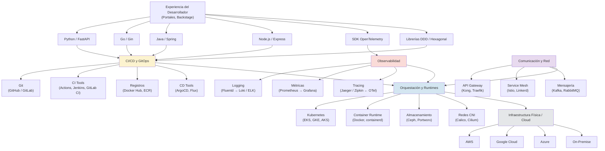

**Análisis Detallado por Categoría de Herramientas**

| Categoría          | ¿Por qué es Crucial?                                                                                                          | Herramientas Clave y Sus Roles                                                                                                                                                                                    | Consideraciones / Trade-offs                                                                                                                                                              |
| ------------------ | ----------------------------------------------------------------------------------------------------------------------------- | ----------------------------------------------------------------------------------------------------------------------------------------------------------------------------------------------------------------- | ----------------------------------------------------------------------------------------------------------------------------------------------------------------------------------------- |
| **Orquestación**   | Es el **corazón** que gestiona la vida de los contenedores. Sin ella, no hay microservicios escalables ni resilientes.        | **Kubernetes:** Orquesta despliegues, escalado, red, almacenamiento. **Docker/containerd:** Ejecuta los contenedores. **Helm/Kustomize:** Empaquetan y configuran aplicaciones K8s.                               | **Complejidad:** K8s es potente pero difícil. **Coste:** Requiere recursos y expertise. **Managed vs. Self-hosted:** Los servicios gestionados simplifican, pero cuestan y limitan.       |
| **CI/CD**          | Es la **arteria** que lleva los cambios a producción. En microservicios, debe ser rápida, fiable y _muy_ automatizada.        | **Git:** Fuente de verdad. **Jenkins/GitLab CI/Actions:** Automatizan builds/tests. **ArgoCD/Flux (GitOps):** Sincronizan Git con K8s para despliegues declarativos.                                              | **Multiplicidad:** Gestionar N pipelines. **Velocidad vs. Seguridad:** Encontrar el balance. **GitOps:** Curva de aprendizaje, pero grandes beneficios.                                   |
| **Observabilidad** | Son los **sentidos** del sistema. Sin ellos, vuelas a ciegas en un entorno complejo y distribuido.                            | **Prometheus+Grafana:** Métricas y visualización (pull-based). **ELK/Loki:** Logs centralizados (push-based). **Jaeger/Zipkin+OpenTelemetry:** Trazabilidad distribuida.                                          | **Coste de Almacenamiento:** Logs y métricas generan volumen. **Instrumentación:** Requiere esfuerzo (aunque OTel y Service Meshes ayudan). **Correlación:** Unir Logs+Métricas+Trazas.   |
| **API Gateways**   | Son la **puerta principal**. Protegen, enrutan y simplifican el acceso a tus servicios desde el exterior.                     | **Kong/Traefik:** Flexibles, self-hosted/cloud-native. **AWS/Azure/GCP Gateways:** Integrados en la nube, PaaS.                                                                                                   | **Cuello de Botella:** Deben ser altamente performantes y disponibles. **Complejidad:** No deben convertirse en un monolito de lógica. **Elección:** Edge vs. BFF.                        |
| **Service Mesh**   | Son la **red neuronal interna**. Gestionan la comunicación _entre_ servicios, añadiendo seguridad, resiliencia y visibilidad. | **Istio:** El más completo, pero más complejo (basado en Envoy). **Linkerd:** Enfocado en simplicidad, rendimiento y seguridad (basado en Rust). **Consul:** Integra Registry, Discovery y Mesh.                  | **Latencia:** Añaden un hop (sidecar), aunque suele ser mínimo. **Complejidad:** Otra capa a gestionar y entender. **¿Cuándo?** No siempre necesario al inicio, pero invaluable a escala. |
| **Mensajería**     | Son el **sistema nervioso asíncrono**. Permiten desacoplar servicios, manejar picos de carga y construir sistemas reactivos.  | **Kafka:** Streaming de eventos, alta durabilidad, re-lectura (ideal para Event Sourcing). **RabbitMQ:** Mensajería tradicional, colas, enrutamiento flexible. **NATS:** Ligero, rápido, enfocado en rendimiento. | **Consistencia Eventual:** Requiere manejarla explícitamente. **Complejidad:** Gestión de brokers, duplicados, orden. **Kafka vs. RabbitMQ:** Una elección clave según el caso de uso.    |

**La Clave:** La elección de herramientas debe estar **impulsada por las necesidades y la madurez del equipo/organización**. Empezar simple e ir añadiendo complejidad (como un Service Mesh) cuando los problemas que resuelven se vuelvan reales y dolorosos. La **estandarización** (ej: OpenTelemetry, CloudEvents) es tu amiga para evitar el _vendor lock-in_.

***

***

## 1.11 Introducción a Patrones Clave: API Gateway, Service Registry y Service Discovery

Cuando pasamos de un monolito a múltiples microservicios, surgen nuevos desafíos: ¿Cómo acceden los clientes (navegadores, apps móviles, otros sistemas) a nuestros servicios? ¿Cómo encuentran los servicios la ubicación (IP y puerto) de otros servicios si estas ubicaciones pueden cambiar dinámicamente? Aquí es donde entran estos patrones.

#### 1. Patrón API Gateway 🚪

* **El Problema:** En una arquitectura de microservicios, los clientes tendrían que conocer la ubicación de _cada_ microservicio y manejar múltiples puntos de entrada. Esto complica el código del cliente, lo acopla fuertemente a la estructura interna y dificulta la implementación de funcionalidades transversales (autenticación, logging, rate limiting).
* **La Solución:** El **API Gateway** actúa como un **único punto de entrada** (o unos pocos, según la fachada) para todas las peticiones de los clientes. Es una capa intermedia que se sitúa entre los clientes y los microservicios.
* **Responsabilidades Clave:**
  * **Enrutamiento (Routing):** Dirige las peticiones entrantes al microservicio apropiado.
  * **Composición/Agregación:** Puede combinar resultados de varios microservicios en una única respuesta para el cliente.
  * **Descarga de Tareas (Offloading):** Maneja responsabilidades comunes a muchos servicios, como:
    * Autenticación y Autorización.
    * Terminación SSL.
    * Limitación de Tasa (Rate Limiting).
    * Cacheo.
    * Logging y Monitorización.
    * Transformación de Protocolos (Ej: HTTP a gRPC).
* **Ventajas:** Simplifica los clientes, centraliza funcionalidades transversales, oculta la estructura interna de microservicios, proporciona una capa adicional de seguridad.
* **Desafíos:** Puede convertirse en un cuello de botella o un monolito si no se diseña y escala adecuadamente. Añade latencia.

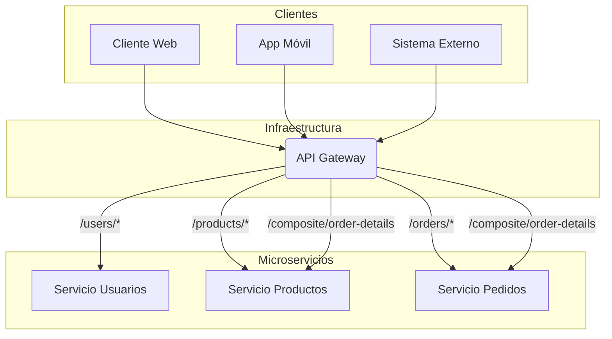

* **¿Y con FastAPI?**
  * Puedes usar FastAPI para _construir_ un API Gateway simple/moderado. Sus capacidades de enrutamiento, middleware y dependencias son muy útiles para esto. Podrías tener endpoints en el Gateway que, internamente, usen `httpx` o `aiohttp` para llamar a otros microservicios (también construidos con FastAPI u otra tecnología).
  * Más comúnmente, tus servicios FastAPI se situarán _detrás_ de un API Gateway dedicado como **Kong**, **Tyk**, **AWS API Gateway**, **Azure API Management**, **Google Cloud Endpoints**, o incluso un **Nginx** o **HAProxy** configurado como proxy inverso. Estos gateways ofrecen funcionalidades avanzadas listas para usar.

#### 2. Patrones Service Registry y Service Discovery 🗺️🔍

* **El Problema:** En entornos modernos (cloud, contenedores), las instancias de microservicios se crean y destruyen dinámicamente. Sus direcciones IP y puertos no son fijos. ¿Cómo sabe el API Gateway (o cualquier otro servicio) a qué dirección IP y puerto enviar una petición para el "Servicio de Productos"?
* **La Solución:** Un sistema de dos partes:
  * **Service Registry (Registro de Servicios):** Es una base de datos (o un sistema distribuido) que actúa como una "guía telefónica" para los microservicios. Cuando una instancia de un servicio se inicia, **se registra** a sí misma en el registro, indicando su nombre, dirección IP y puerto. También debe **desregistrarse** al apagarse o actualizar su estado periódicamente (heartbeats) para que el registro sepa que sigue viva.
  * **Service Discovery (Descubrimiento de Servicios):** Es el proceso mediante el cual un cliente (que puede ser el API Gateway u otro microservicio) **consulta** el Service Registry para encontrar la ubicación actual de un servicio que necesita invocar.
* **Tipos de Service Discovery:**
  * **Descubrimiento del Lado del Cliente (Client-Side Discovery):** El cliente (ej: el API Gateway) consulta directamente el Service Registry para obtener una lista de ubicaciones disponibles para un servicio y luego elige una (a menudo aplicando balanceo de carga) para hacer la llamada.
  * **Descubrimiento del Lado del Servidor (Server-Side Discovery):** El cliente hace una llamada a una dirección "virtual" o a un router/proxy (que a menudo es parte de la infraestructura o el propio API Gateway). Este router consulta el Service Registry y reenvía la petición a una instancia activa del servicio. Kubernetes funciona principalmente de esta manera a través de sus 'Services'.

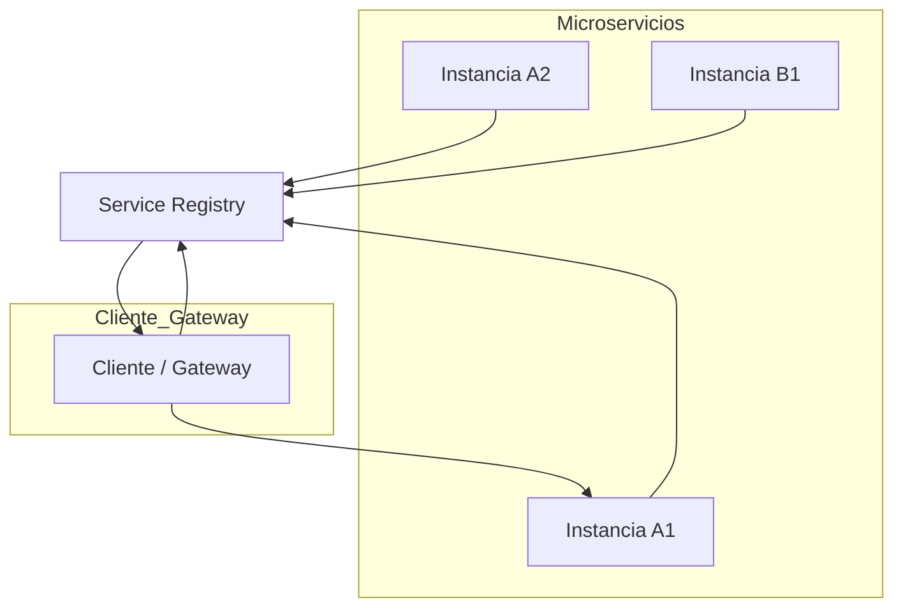

* **¿Y con FastAPI?**
  * Tus servicios FastAPI **no** incluyen un Service Registry/Discovery de forma nativa. Necesitas integrarlos con herramientas externas.
  * **Registro:** Podrías usar los [eventos de ciclo de vida (`startup` y `shutdown`)](https://www.google.com/search?q=%5Bhttps://fastapi.tiangolo.com/advanced/events/%5D\(https://fastapi.tiangolo.com/advanced/events/\)) de FastAPI para que, al arrancar, tu servicio haga una llamada a la API de un Service Registry (como **Consul**, **Eureka**, **etcd**, o el API de Kubernetes si estás en ese entorno) para registrarse, y al apagarse, para desregistrarse. También necesitarías implementar _heartbeats_ si el registro lo requiere (por ejemplo, un endpoint `/health` que el registro consulte, o que el servicio llame periódicamente al registro).
  * **Descubrimiento:**
    * **Lado Cliente:** Si tu servicio FastAPI necesita llamar a otro, usarías una librería cliente para el Service Registry elegido, consultarías la ubicación y luego usarías `httpx` para hacer la llamada. Existen librerías que pueden combinar estos pasos.
    * **Lado Servidor:** Si estás en Kubernetes, simplemente llamarías al nombre del 'Service' de Kubernetes (ej: `http://servicio-productos/`), y Kubernetes se encargaría de la consulta al registro y el enrutamiento/balanceo. Si usas un API Gateway, este se encargaría del descubrimiento.

***

## Referencias

***
