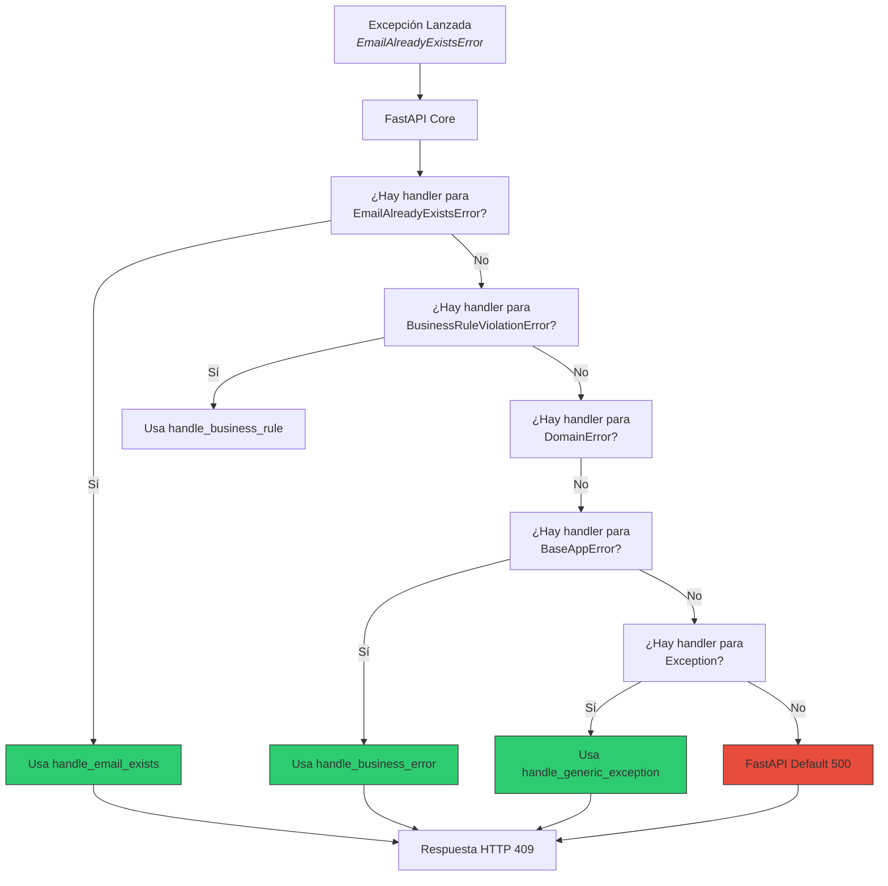
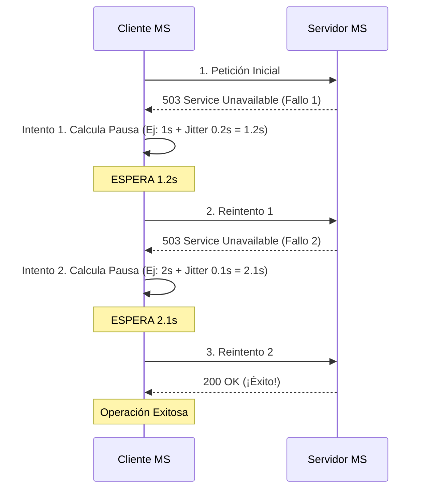
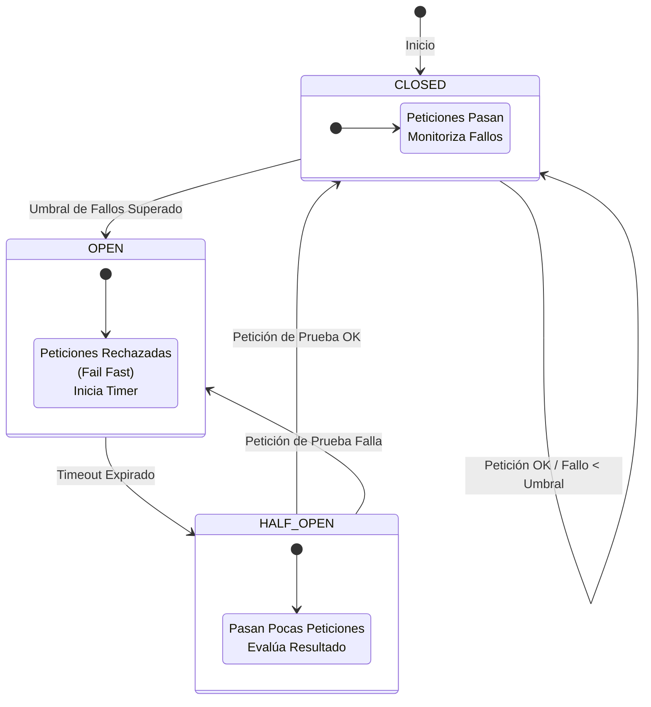
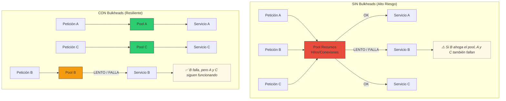
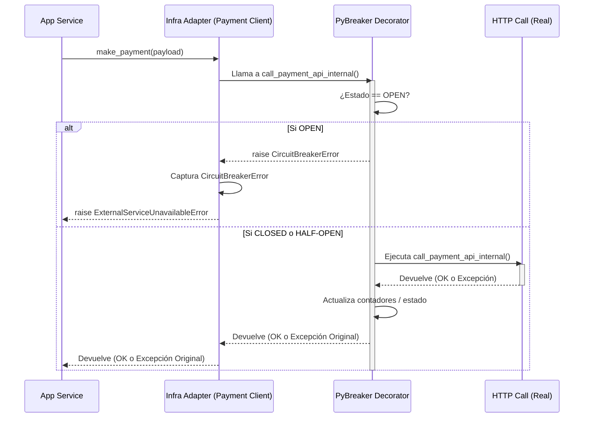
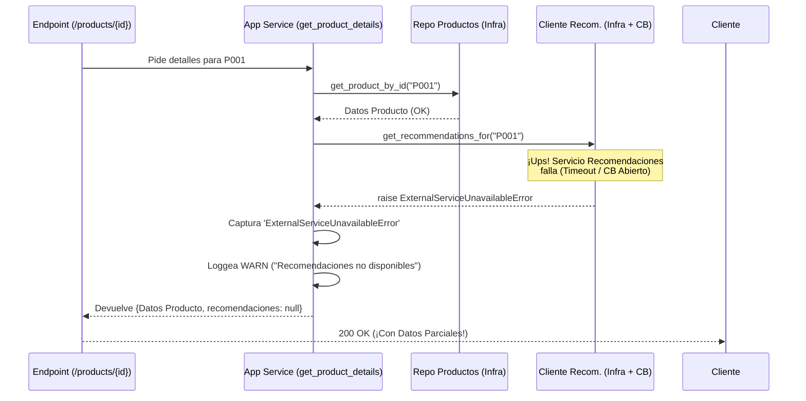
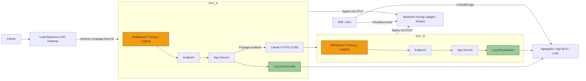
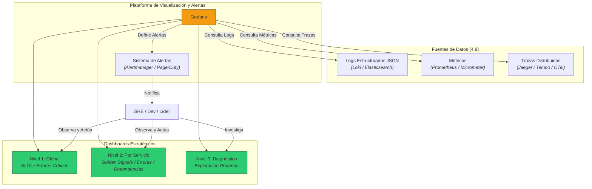
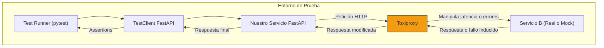

# Tema 4. MANEJO DE ERRORES Y CIRCUIT BREAKERS EN MICROSERVICIOS


- [Tema 4. MANEJO DE ERRORES Y CIRCUIT BREAKERS EN MICROSERVICIOS](#tema-4-manejo-de-errores-y-circuit-breakers-en-microservicios)
  - [4.1 Diseño de estrategia global de manejo de errores](#41-diseño-de-estrategia-global-de-manejo-de-errores)
  - [4.2 Implementación de controladores de excepciones personalizados en FastAPI](#42-implementación-de-controladores-de-excepciones-personalizados-en-fastapi)
  - [4.3 Definición de errores de negocio vs errores técnicos](#43-definición-de-errores-de-negocio-vs-errores-técnicos)
  - [4.4 Aplicación del patrón Retry con backoff exponencial](#44-aplicación-del-patrón-retry-con-backoff-exponencial)
  - [4.5 Introducción a patrones Circuit Breaker y Bulkhead](#45-introducción-a-patrones-circuit-breaker-y-bulkhead)
  - [4.6 Implementación de circuit breakers con `pybreaker`](#46-implementación-de-circuit-breakers-con-pybreaker)
  - [4.7 Diseño de endpoints resilientes a fallos de servicios externos](#47-diseño-de-endpoints-resilientes-a-fallos-de-servicios-externos)
  - [4.8 Captura y log de trazas con contexto de peticiones](#48-captura-y-log-de-trazas-con-contexto-de-peticiones)
  - [4.9 Visibilidad de errores mediante dashboards](#49-visibilidad-de-errores-mediante-dashboards)
  - [4.10 Pruebas para simular fallos y degradación controlada](#410-pruebas-para-simular-fallos-y-degradación-controlada)


---


## 4.1. Diseño de Estrategia Global de Manejo de Errores

En la ingeniería de sistemas distribuidos, **el optimismo es el enemigo**. Debemos asumir que los fallos *ocurrirán*. La red fallará, los servicios se ralentizarán, las bases de datos se bloquearán y la lógica de negocio encontrará condiciones inesperadas. Una **estrategia global de manejo de errores** no es un plan B, es **parte integral del diseño del plan A**. Su objetivo es **estandarizar, comunicar, aislar y aprender** de cada fallo, garantizando que el sistema, como un todo, sea predecible y resiliente.

Diseñar esta estrategia implica tomar decisiones **concretas y vinculantes** que afectarán a todos nuestros microservicios.

#### 1. Principios Fundamentales del Diseño

Antes de definir los detalles, establecemos nuestros principios rectores:

* **Claridad sobre Silencio:** Es preferible un error claro y controlado que un comportamiento inesperado o un silencio ambiguo.
* **Contratos Explícitos:** Los errores son parte del contrato de una API. Deben ser predecibles y estar documentados (implícita o explícitamente).
* **Aislamiento del Impacto:** Un fallo en un componente no debe desencadenar una avalancha (fallo en cascada).
* **Observabilidad Total:** Cada error significativo debe ser visible (loggeado, trazado, medible).
* **Contexto es Rey:** Los mensajes de error deben proporcionar suficiente contexto para entender el problema, tanto para máquinas como para humanos (¡y especialmente para el equipo de SRE/DevOps!).

#### 2. Paso 1: Taxonomía y Clasificación de Errores 🔬

El primer paso es **crear un lenguaje común para hablar de errores**. No todos los fallos son iguales. Necesitamos una clasificación robusta.

| Categoría | Subcategoría | Descripción | ¿Puede el Cliente Solucionarlo? | Código HTTP Típico | Ejemplo |
| :--- | :--- | :--- | :--- | :--- | :--- |
| **Errores de Cliente** | **Validación (Sintaxis)** | La petición no cumple el formato esperado (Pydantic). | **Sí** (Corrigiendo la petición) | 422 | Falta campo obligatorio. |
| | **Validación (Semántica)** | La petición es válida, pero los datos son incorrectos. | **Sí** (Corrigiendo los datos) | 400 | Fecha fin anterior a fecha inicio. |
| | **Autenticación** | El cliente no ha probado quién es. | **Sí** (Proporcionando credenciales) | 401 | Token JWT ausente o inválido. |
| | **Autorización** | El cliente es válido, pero no tiene permisos. | **No** (Necesita cambio de permisos) | 403 | Usuario no puede borrar pedidos. |
| | **Recurso No Encontrado** | El recurso solicitado no existe. | **Sí** (Usando un ID válido) | 404 | Pedido con ID 'XYZ' no existe. |
| **Errores de Servidor** | **Regla de Negocio** | La acción viola una regla de negocio interna. | **No** (Es una condición del sistema) | 409 / 400 | Stock insuficiente / Email ya existe. |
| | **Técnico (Interno)** | Fallo inesperado en el código (bug, `None` no esperado). | **No** | 500 | `NullPointerException`. |
| | **Técnico (Externo)** | Fallo en una dependencia (BBDD, otra API). | **No** | 503 / 500 / 504 | Timeout BBDD / API externa caída. |
| | **Técnico (Transitorio)**| Fallo temporal que *podría* resolverse reintentando. | **No** | 503 / 504 | Glitch momentáneo de red. |

Esta clasificación nos permitirá **automatizar y estandarizar** el manejo posterior.

#### 3. Paso 2: El Contrato JSON de Error Estándar 📜

¡Decisión Crítica! **Todos** nuestros microservicios deben devolver errores con la **misma estructura JSON**. Esto es innegociable para la consistencia y el procesamiento automático.

**Propuesta de Estructura Estándar:**

```json
{
  "trace_id": "uuid-v4-del-request", // SIEMPRE: Para trazar el error end-to-end.
  "error_code": "STOCK_INSUFFICIENTE", // SIEMPRE: Código único, legible por máquina.
  "message": "Stock insuficiente para el producto 'P001'. Solicitado: 10, Disponible: 5.", // SIEMPRE: Mensaje claro y humano.
  "status_code": 409, // SIEMPRE: El código HTTP reflejado.
  "timestamp": "2025-05-26T23:30:00Z", // SIEMPRE: Cuándo ocurrió.
  "service_name": "servicio-pedidos", // RECOMENDADO: Qué servicio originó el error.
  "context": { // OPCIONAL: Datos adicionales para depuración.
    "product_id": "P001",
    "requested": 10,
    "available": 5
  },
  "documentation_url": "https://docs.miempresa.com/errors/STOCK_INSUFFICIENTE" // OPCIONAL: Enlace a más info.
}
```

Definir esta estructura es **responsabilidad del equipo de arquitectura**.

#### 4. Paso 3: Mapeo Riguroso a Códigos HTTP ↔️

Debemos ser **consistentes y semánticos** al usar códigos HTTP. La tabla anterior da una idea, pero debemos formalizarlo.

* **4xx (Errores del Cliente):** Indican que el cliente hizo algo mal. **No deberían** generar alertas críticas, pero sí monitorizarse (¿Alguien está atacando? ¿Un frontend tiene un bug?).
* **5xx (Errores del Servidor):** Indican que *nosotros* tenemos un problema. **SIEMPRE deben** generar alertas y ser investigados.

#### 5. Paso 4: Definir Políticas de Resiliencia 🛡️

La estrategia debe predefinir cómo se aplicarán los patrones de resiliencia (que veremos en 4.4 y 4.5):

* **Política de Reintentos:**
    * **¿Cuándo?** *Solo* para errores **Técnicos Transitorios** (timeouts de red, 503). ¡Nunca para errores de negocio o 4xx!
    * **¿Cuántos?** 3 reintentos es un punto de partida común.
    * **¿Cómo?** *Siempre* con **Backoff Exponencial con Jitter** (esperar 1s, luego 2s, luego 4s, añadiendo un poco de aleatoriedad para evitar tormentas de reintentos).
* **Política de Circuit Breaker:**
    * **¿Dónde?** En *toda* llamada síncrona a un servicio externo (otra API, BBDD crítica si es propensa a fallos).
    * **¿Umbrales?** Definir umbrales de fallo (ej: 50% de fallos en 1 minuto) y tiempos de apertura (ej: 30 segundos).

#### 6. Paso 5: Estrategia de Observabilidad (Logging y Tracing) 📊

* **Trace ID / Correlation ID:** **Obligatorio**. Debe generarse (o propagarse si viene de fuera) al inicio de la petición (Middleware) y **viajar con CADA log y CADA llamada** interna y externa.
* **Logs Estructurados:** **Obligatorio** usar JSON. Facilita la ingesta y análisis.
* **Niveles de Log:**
    * `INFO/WARN`: Para errores 4xx (son "normales" hasta cierto punto).
    * `ERROR/CRITICAL`: Para errores 5xx (¡requieren acción!).
* **Contexto en Logs:** Loggear siempre el `trace_id`, `error_code`, servicio, y contexto relevante. **¡NUNCA loggear datos sensibles en claro!** (Usa `SecretStr` de Pydantic).
* **Stack Traces:** *Solo* para errores 5xx.

#### 7. Visualizando la Implementación de la Estrategia

```mermaid
graph TD
    A[Request + TraceID] --> B{API Layer (FastAPI)};
    B --> C{App Layer};
    C --> D{Domain Layer};
    D -- Lanza<br>BusinessRuleViolationError --> C;
    C -- Propaga --> B;
    B -- Captura --> E{Global Handlers (4.2)};
    E -- Usa Mapeo<br>(4.3, 4.4) --> F(Decide: 409, No Retry);
    F -- Usa Formato<br>(4.2) --> G[Crea JSONResponse Estándar];
    G -- Paralelo --> H[Log WARNING<br>(JSON + TraceID) (4.8)];
    G --> I[Response 409];
    I --> J[Cliente];

    B -- Llama --> K{Infra Layer (HTTP Client)};
    K -- Llama --> L{Servicio Externo};
    L -- Falla (503) --> K;
    K -- Lanza<br>ExternalServiceError --> B;
    B -- Captura --> E;
    E -- Usa Mapeo --> M(Decide: 503, Retriable);
    M -- Aplica Política<br>(4.5) --> N{Retry + Circuit Breaker};
    N -- Falla Definitivo --> O[Crea JSONResponse 503];
    O -- Paralelo --> P[Log ERROR<br>(JSON + TraceID + StackTrace) (4.8)];
    O --> I;

    style H,P fill:#9c9
    style B,E,G,I,J,O fill:#f9f
    style C fill:#ccf
    style D fill:#9cf
    style K,L fill:#9c9
    style M,N fill:#f39c12
```

Diseñar una estrategia global de manejo de errores **no es una opción, es una obligación profesional** en el desarrollo de microservicios. Es el **ADN de la resiliencia y la observabilidad**. Al definir **explícitamente** cómo clasificamos, comunicamos, manejamos y observamos los errores, establecemos una base sólida sobre la cual construir un sistema distribuido que pueda **navegar las inevitables tormentas de la producción** con previsibilidad y control. Este diseño es nuestro **manifiesto de calidad y compromiso** con la robustez.

---

¡Absolutamente! Mantenemos el rumbo y la altísima calidad. El punto 4.2 es donde la **estrategia se convierte en código**. Vamos a sumergirnos en la implementación de **controladores de excepciones personalizados** en FastAPI. Veremos cómo construir esos "traductores" expertos que convierten nuestros errores internos en respuestas HTTP claras y consistentes, manteniendo nuestro código limpio y nuestra API profesional. ¡Sin fisuras, con profundidad y claridad visual! ✨

---

## TEMA 4. MANEJO DE ERRORES Y CIRCUIT BREAKERS EN MICROSERVICIOS

### 4.2. Implementación de Controladores de Excepciones Personalizados en FastAPI

Ya hemos diseñado nuestra estrategia global (4.1): tenemos una taxonomía de errores, un formato JSON estándar y un mapeo a códigos HTTP. Ahora, necesitamos **enseñarle a FastAPI cómo ejecutar este plan**. Aquí es donde entran los **Controladores de Excepciones Personalizados** (Exception Handlers).

Piensa en ellos como los **expertos en comunicación de crisis** de tu API. Cuando salta una alarma (una excepción), ellos toman el control, evalúan la situación y emiten un comunicado oficial (la respuesta HTTP) siguiendo el protocolo establecido.

#### 1. La Herramienta Maestra: `@app.exception_handler()`

FastAPI nos proporciona un mecanismo increíblemente elegante y potente para interceptar excepciones específicas y definir cómo responder a ellas: el decorador `@app.exception_handler(ExceptionType)`.

* **¿Qué hace?** Le dice a FastAPI: "Cuando *esta* `ExceptionType` (o cualquiera de sus clases hijas, si no hay un handler más específico) llegue hasta la capa superior sin ser capturada, ¡no entres en pánico ni devuelvas un 500 genérico! En su lugar, **ejecuta esta función que te voy a dar**".
* **La Firma:** La función que decoremos debe tener esta firma (o ser compatible):
  ```python
  async def my_exception_handler(request: Request, exc: ExceptionType) -> Response:
      # ... Lógica para construir y devolver una Response ...
  ```
    * `request: Request`: Nos da acceso a la petición original (URL, headers, `request.state` para nuestro `trace_id`, etc.).
    * `exc: ExceptionType`: ¡Es la **instancia** de la excepción que se lanzó! Podemos acceder a sus atributos (`exc.detail`, `exc.resource_id`, etc.) para construir una respuesta rica en contexto.
    * `-> Response`: **Debe** devolver un objeto `Response` de Starlette/FastAPI, casi siempre será una `JSONResponse`.

#### 2. Construyendo Nuestros Handlers: Del Diseño al Código

Basándonos en nuestra estrategia (4.1), implementemos conceptualmente algunos handlers. Asumimos que tenemos nuestro formato JSON estándar y nuestras excepciones personalizadas (`ResourceNotFoundError`, `EmailAlreadyExistsError`).

```python
# Concepto: app/api/exception_handlers.py

from fastapi import Request, status
from fastapi.responses import JSONResponse
import logging
# from app.domain.exceptions import ( # Importamos nuestras excepciones
#     ResourceNotFoundError,
#     EmailAlreadyExistsError,
#     BaseAppError
# )
# from app.core.config import settings # Para saber el nombre del servicio

logger = logging.getLogger(__name__)

# --- Handler para "Recurso No Encontrado" ---
async def handle_resource_not_found(request: Request, exc: ResourceNotFoundError):
    trace_id = getattr(request.state, "correlation_id", "N/A")
    status_code = status.HTTP_404_NOT_FOUND
    error_code = "RESOURCE_NOT_FOUND"

    logger.info(f"RID={trace_id} - Resource Not Found: {exc.detail}")

    return JSONResponse(
        status_code=status_code,
        content={
            "trace_id": trace_id,
            "error_code": error_code,
            "message": exc.detail,
            "status_code": status_code,
            "timestamp": "...", # Generar timestamp actual
            "service_name": "servicio-x", # settings.SERVICE_NAME,
            "context": getattr(exc, "context", {}),
        },
    )

# --- Handler para "Email Ya Existe" (Más Específico) ---
async def handle_email_exists(request: Request, exc: EmailAlreadyExistsError):
    trace_id = getattr(request.state, "correlation_id", "N/A")
    status_code = status.HTTP_409_CONFLICT
    error_code = "EMAIL_ALREADY_EXISTS"

    logger.warning(f"RID={trace_id} - Conflict - Email Exists: {exc.detail}")

    return JSONResponse(
        status_code=status_code,
        content={
            "trace_id": trace_id,
            "error_code": error_code,
            "message": exc.detail,
            "status_code": status_code,
            "timestamp": "...",
            "service_name": "servicio-x",
            "context": getattr(exc, "context", {}),
        },
    )

# --- Handler Genérico para Errores de Negocio (Fallback) ---
async def handle_business_error(request: Request, exc: BaseAppError):
    trace_id = getattr(request.state, "correlation_id", "N/A")
    status_code = status.HTTP_400_BAD_REQUEST # Un default razonable
    error_code = "BUSINESS_ERROR"

    logger.warning(f"RID={trace_id} - Business Error (Generic): {exc.detail}")

    return JSONResponse(
        status_code=status_code,
        content={
            "trace_id": trace_id,
            "error_code": error_code,
            "message": exc.detail,
            "status_code": status_code,
            "timestamp": "...",
            "service_name": "servicio-x",
            "context": {},
        },
    )
```

#### 3. El Registro: Conectando los Handlers

La forma más limpia es centralizar el registro en nuestro `main.py` o un fichero de setup, usando `app.add_exception_handler()`:

```python
# Concepto: app/main.py
from fastapi import FastAPI
from .api import exception_handlers as eh # Nuestro módulo de handlers
from .domain.exceptions import ( # Nuestras excepciones
    ResourceNotFoundError,
    EmailAlreadyExistsError,
    BaseAppError # ¡La base!
)
from fastapi.exceptions import RequestValidationError # Para sobrescribir
from starlette.exceptions import HTTPException as StarletteHTTPException # Para sobrescribir
import logging

# ... (Configurar logging aquí, idealmente JSON)

app = FastAPI(title="Mi Microservicio", ...)

# --- ¡El Orden Importa! De más específico a más genérico ---
app.add_exception_handler(EmailAlreadyExistsError, eh.handle_email_exists)
app.add_exception_handler(ResourceNotFoundError, eh.handle_resource_not_found)
app.add_exception_handler(BaseAppError, eh.handle_business_error) # Fallback para negocio

# --- Sobrescribir Defaults para Consistencia ---
# app.add_exception_handler(RequestValidationError, eh.handle_validation_error)
# app.add_exception_handler(StarletteHTTPException, eh.handle_http_exception) # Para capturar HTTPException

# --- ¡El Último Recurso! ---
# app.add_exception_handler(Exception, eh.handle_generic_exception) # Captura TODO lo demás como 500
```

**Visualizando la Selección del Handler:**


FastAPI busca el handler más específico que coincida con el tipo de la excepción.

#### 4. Tabla de Implementación: Resumen

| Tarea | Herramienta FastAPI | Lugar Sugerido (Nuestra Estructura) | Objetivo |
| :--- | :--- | :--- | :--- |
| **Definir Excepciones** | Clases Python (`Exception`) | `app/domain/exceptions.py` | Modelar errores de negocio/técnicos. |
| **Crear Handlers** | Funciones `async` | `app/api/exception_handlers.py` | Traducir Excepción -> `JSONResponse`. |
| **Registrar Handlers** | `app.add_exception_handler()` | `app/main.py` | Conectar Excepciones con sus Handlers. |
| **Obtener TraceID** | `request.state.correlation_id`| Dentro de los Handlers. | Asegurar trazabilidad en errores. |
| **Loggear Errores** | `logging` (Python) | Dentro de los Handlers. | Centralizar y estandarizar logs. |


La implementación de controladores de excepciones personalizados es donde nuestra **estrategia global cobra vida**. Es el mecanismo técnico que nos permite **traducir la semántica de nuestro dominio** en respuestas HTTP **claras, consistentes y profesionales**. Al dominar `app.exception_handler` y diseñarlos cuidadosamente para reflejar nuestra taxonomía y formato de error, no solo mejoramos la experiencia del consumidor de nuestra API, sino que también construimos un sistema **más fácil de depurar, monitorizar y mantener**. Es la **fontanería de alta calidad** que asegura que, incluso cuando las tuberías se rompen, el daño se contiene y se comunica eficazmente.

---

¡Desafío aceptado! Mantenemos y **elevamos** la calidad. El punto 4.3 es el **cerebro** de nuestra estrategia de errores. Aquí no hay margen para la ambigüedad; debemos ser cirujanos, diseccionando cada posible fallo para entender su **naturaleza fundamental**. Si no distinguimos entre un tropiezo esperado y un fallo catastrófico, nuestra resiliencia será una ilusión. ¡Vamos a iluminar esta distinción con la precisión de un láser y la claridad del cristal!

---

## 4.3. Definición de Errores de Negocio vs. Errores Técnicos: El Diagnóstico Preciso

En la medicina de nuestros microservicios, el **diagnóstico correcto** lo es todo. No tratamos igual un resfriado común que un fallo cardiaco. De la misma manera, nuestra estrategia de errores debe **distinguir con absoluta claridad** entre dos grandes familias de fallos: los **Errores de Negocio** y los **Errores Técnicos**. Esta distinción no es un mero ejercicio académico; es la **piedra angular** que define cómo **respondemos, alertamos, reintentamos y aprendemos** de cada desviación.

#### 1. Errores de Negocio (4xx): Las Reglas del Juego ♟️

Los Errores de Negocio, también llamados *errores funcionales* o *errores del dominio*, son aquellos que ocurren cuando una petición, aunque técnicamente válida, **viola una regla o una invariante definida por la lógica de negocio**. En esencia, el sistema está funcionando *correctamente* al **prevenir una acción inválida o un estado inconsistente**.

* **Origen Típico:** Capas `Domain` y `Application`.
* **Causa Frecuente:** Entradas del cliente que, aunque sintácticamente correctas (pasan Pydantic), no son válidas en el contexto actual del negocio.
* **¿Puede el Cliente Solucionarlo?** **A menudo, SÍ**. El cliente puede cambiar su petición (usar otro email, pedir menos stock, usar un ID válido).
* **¿Es Inesperado?** **No realmente**. Son "caminos infelices" *previstos* por las reglas.
* **Impacto HTTP:** Generalmente, se mapean a códigos **4xx**.
* **Acción Requerida:** Informar al cliente con un mensaje **claro y específico**. Loggear a nivel `INFO` o `WARNING`. **NO** despertar al equipo de SRE a las 3 AM. **NO** reintentar (¡no tendría sentido!).

**Categorías y Ejemplos de Alto Nivel:**

| Subcategoría | Código HTTP | Ejemplo de Excepción (Nuestra Jerarquía) | Escenario |
| :--- | :--- | :--- | :--- |
| **Recurso No Encontrado** | 404 | `PedidoNotFoundError(pedido_id)` | Se busca un pedido con un ID que no existe. |
| **Conflicto de Estado** | 409 | `EmailAlreadyExistsError(email)` | Se intenta registrar un email que ya está en uso. |
| **Violación Regla Negocio** | 409 / 400 | `StockInsuficienteError(prod_id, cant)` | No hay suficiente stock para completar el pedido. |
| **Validación Semántica** | 400 | `FechaReservaInvalidaError(fecha)` | La fecha de reserva es anterior a hoy. |
| **Permisos Insuficientes** | 403 | `AccionNoAutorizadaError(user_id, accion)` | Un usuario intenta realizar una acción para la que no tiene permiso. |

#### 2. Errores Técnicos (5xx): ¡Houston, Tenemos un Problema! 🚀💥

Los Errores Técnicos son **fallos inesperados** en el propio sistema o en sus dependencias. Indican que algo **no está funcionando como debería**. El sistema *no* está operando correctamente.

* **Origen Típico:** Capas `Infrastructure`, bugs en *cualquier* capa, red, hardware.
* **Causa Frecuente:** Conexiones a BBDD fallidas, servicios externos caídos, timeouts, errores de programación (`NoneType` no esperado), falta de memoria/disco.
* **¿Puede el Cliente Solucionarlo?** **Generalmente, NO**. Es un problema interno o de la infraestructura.
* **¿Es Inesperado?** **Sí**. No forman parte del flujo normal, ni siquiera del "infeliz".
* **Impacto HTTP:** Se mapean a códigos **5xx**.
* **Acción Requerida:** Informar al cliente (a menudo con un mensaje genérico por seguridad). Loggear a nivel `ERROR` o `CRITICAL` **con stack trace completo**. **¡SIEMPRE generar alertas!** **Quizás reintentar** (si es transitorio).

**Categorías y Ejemplos de Alto Nivel:**

| Subcategoría | Código HTTP | Ejemplo de Excepción (Nuestra Jerarquía) | Escenario |
| :--- | :--- | :--- | :--- |
| **Fallo Interno (Bug)** | 500 | `InternalServerError(detalle_interno)` | Un cálculo inesperado produce un error, un `None` donde no debía. |
| **Fallo Base de Datos** | 503 / 500 | `DatabaseConnectionError()` / `QueryTimeoutError()`| No se puede conectar a MariaDB, o una query tarda demasiado. |
| **Fallo Servicio Externo** | 503 / 504 | `ExternalServiceUnavailableError(servicio)` / `GatewayTimeoutError()`| La API de pagos no responde. |
| **Problema Infraestructura** | 503 | `ResourceExhaustionError(recurso)` | No quedan conexiones en el pool, falta memoria. |
| **Fallo Transitorio (Red)** | 504 / 503 | `NetworkGlitchError()` | Un problema temporal de red impide una comunicación. |

#### 3. El Flujo de Diagnóstico: Árbol de Decisión

¿Cómo decidimos en qué categoría cae un error en tiempo real (o al diseñar los handlers)?

```mermaid
graph TD
    A[Ocurre un Error] --> B{¿Es una violación<br>de una regla de negocio<br>o validación explícita?};
    B -- Sí --> C(<b>Error de Negocio</b>);
    B -- No --> D{¿Es un error esperado<br>de una dependencia externa<br>(ej: API externa devuelve 404)?};
    D -- Sí --> E{¿Podemos manejarlo<br>como parte del flujo<br>o es un error de Negocio?};
    E -- Sí (Negocio) --> C;
    E -- No (Fallo nuestro) --> F(<b>Error Técnico</b>);
    D -- No --> F;

    C --> G[Mapear a 4xx];
    F --> H[Mapear a 5xx];

    G --> I[Informar Cliente Específicamente<br>Log INFO/WARN<br>NO Alertar<br>NO Reintentar];
    H --> J[Informar Cliente Genéricamente<br>Log ERROR/CRITICAL + StackTrace<br>¡ALERTAR!<br>¿Reintentar? (Si transitorio)];

    style C fill:#3498db
    style F fill:#e74c3c
```

#### 4. La Importancia Estratégica: Impacto en la Acción

| Dimensión | Error de Negocio (4xx) | Error Técnico (5xx) |
| :--- | :--- | :--- |
| **Comunicación Cliente** | **Específica y Clara.** "El email ya existe." | **Genérica.** "Error interno. Intente más tarde." |
| **Logging** | `INFO` / `WARNING`. Mensaje descriptivo. | `ERROR` / `CRITICAL`. **¡Stack Trace OBLIGATORIO!** |
| **Alertas** | **No** (salvo por volumen anómalo). | **SÍ, INMEDIATAMENTE.** |
| **Retries** | **NO.** (No tiene sentido). | **SÍ,** si es potencialmente transitorio (con backoff). |
| **Circuit Breaker** | **NO.** (No indica salud del servicio). | **SÍ.** (Un 5xx repetido debe abrir el circuito). |
| **Responsabilidad** | A menudo, del Cliente (o del diseño de flujo). | **Siempre,** del equipo de desarrollo/operaciones. |

La distinción entre errores de negocio y técnicos no es una sutileza académica; es el **corazón palpitante de una estrategia de errores madura**. Es el **diagnóstico diferencial** que nos permite aplicar el tratamiento correcto: informar al cliente con precisión, evitar fatiga de alertas al equipo de SRE, implementar patrones de resiliencia donde tienen sentido y, en última instancia, construir sistemas que no solo funcionan, sino que **fallan de manera inteligente y predecible**. Dominar esta clasificación es dominar el arte de construir software para el mundo real, un mundo imperfecto pero manejable.

---

¡Absolutamente! Mantenemos el impulso y la **calidad excepcional**. El punto 4.4 nos introduce en la primera línea de defensa activa contra los fallos transitorios: el **Patrón Retry con Backoff Exponencial**. No se trata de insistir ciegamente, sino de reintentar con **inteligencia, paciencia y estrategia**, como un boxeador experimentado que sabe cuándo esperar antes de lanzar el siguiente golpe. ¡Vamos a dominar esta técnica esencial de resiliencia!

---

## 4.4. Aplicación del Patrón Retry con Backoff Exponencial

En la intrincada danza de los microservicios, muchas caídas son momentáneas: un *glitch* de red, una sobrecarga puntual del servidor, un bloqueo temporal de base de datos. Sería una pena (y muy ineficiente) rendirse al primer tropiezo. El **Patrón Retry** nos invita a ser persistentes, a intentar la operación de nuevo.

Pero ¡cuidado! Una persistencia ingenua puede ser **peor que el fallo original**. Reintentar inmediatamente y sin descanso puede **agravar una sobrecarga**, creando una **tormenta de reintentos (Retry Storm)** y derribando un servicio que solo necesitaba un respiro.

Aquí es donde la estrategia brilla: aplicamos **Retry con Backoff Exponencial y Jitter**.

#### 1. ¿Qué es y Por Qué lo Necesitamos?

* **Retry:** Volver a intentar una operación que falló.
* **Backoff:** Introducir una **pausa** antes de cada reintento.
* **Exponencial:** Hacer que esa pausa **crezca exponencialmente** con cada fallo (1s, 2s, 4s, 8s...). Esto le da al servicio dependiente un tiempo creciente para recuperarse.
* **Jitter (¡Crucial!):** Añadir un **pequeño factor aleatorio** a la pausa. Si múltiples instancias de nuestro servicio reintentan al mismo tiempo con el mismo backoff, ¡volverían a golpear al servicio dependiente *simultáneamente*! El Jitter "desincroniza" estos reintentos, distribuyendo la carga.

**La Fórmula Conceptual:** `Pausa = min(MAX_PAUSA, (BASE_PAUSA * 2^INTENTO)) + random(0, JITTER)`

#### 2. La Regla de Oro: ¿Cuándo Reintentar?

¡No todo fallo merece un reintento! Aplicar Retry indiscriminadamente es peligroso. Debemos ser selectivos:

* **SÍ Reintentar:**
    * **Errores Técnicos Transitorios:** Fallos de red, timeouts (504), servicios temporalmente no disponibles (503), errores de conexión, *algunos* 500 si sabemos que pueden ser temporales.
    * **Respuestas de Throttling (429):** Si el servidor nos pide explícitamente que esperemos (idealmente respetando la cabecera `Retry-After`).
    * **Operaciones de Lectura:** Generalmente seguras de reintentar.
* **NO Reintentar (¡NUNCA!):**
    * **Errores de Negocio (4xx):** Si un email ya existe (409) o el stock es insuficiente (409/400), ¡reintentar no cambiará nada! Solo gastará recursos.
    * **Errores de Cliente (4xx):** Si la petición es inválida (400/422), el cliente debe corregirla.
    * **Errores Técnicos Permanentes:** Si sabemos que un bug (500) es determinista.
* **¡CUIDADO! Idempotencia:** Solo deberíamos reintentar operaciones **idempotentes**. Una operación es idempotente si ejecutarla N veces tiene el mismo efecto que ejecutarla una vez.
    * `GET`, `PUT`, `DELETE` suelen ser idempotentes.
    * `POST` **generalmente NO lo es**. Reintentar un `POST` de "Crear Pedido" podría crear múltiples pedidos si no se implementa un mecanismo de idempotencia explícito (como un `Idempotency-Key` en la cabecera).

#### 3. Visualizando el Flujo de Retry con Backoff y Jitter


Si tras N reintentos sigue fallando, *entonces* se considera un fallo definitivo y se propaga la excepción (o se abre un Circuit Breaker).

#### 4. Tabla de Crecimiento de Pausas (Ejemplo)

| Intento | Backoff Exponencial (Base=1s) | Con Jitter (Ejemplo +/- 0.5s) |
| :--- | :--- | :--- |
| 1 | 1s | 0.8s |
| 2 | 2s | 2.3s |
| 3 | 4s | 3.7s |
| 4 | 8s | 8.5s |
| 5 | 16s (o `MAX_PAUSA`) | 15.9s (o `MAX_PAUSA` + Jitter) |

#### 5. Implementación Práctica en Python

Aunque podrías implementar la lógica manualmente con bucles y `asyncio.sleep()`, ¡no reinventes la rueda! Usa librerías robustas que lo hacen por ti:

* **`tenacity`**: Una librería muy popular y potente para reintentos. Se usa a menudo con decoradores.
* **`backoff`**: Otra excelente opción, también basada en decoradores.

**Conceptualización con Decorador (`tenacity`):**

```python
# Concepto: app/infrastructure/http_clients/payment_client.py
from tenacity import retry, stop_after_attempt, wait_exponential, RetryError
# from httpx import AsyncClient, RequestError, HTTPStatusError

# Configuración de retry (¡Debería venir de Settings!)
RETRY_ATTEMPTS = 3
RETRY_WAIT_BASE = 1 # Segundos
RETRY_WAIT_MAX = 10 # Segundos

# Define qué excepciones son "retriables"
def is_retryable_error(exception) -> bool:
    # return isinstance(exception, RequestError) or \
    #       (isinstance(exception, HTTPStatusError) and \
    #        exception.response.status_code in [503, 504, 429])
    print(f"DEBUG: Comprobando si {type(exception)} es retriable... (Simulado: SÍ)")
    return True # Simulación

@retry(
    stop=stop_after_attempt(RETRY_ATTEMPTS), # Nº máximo de intentos
    wait=wait_exponential(multiplier=RETRY_WAIT_BASE, max=RETRY_WAIT_MAX), # Backoff Exp.
    retry=is_retryable_error, # Condición para reintentar
    reraise=True # Si falla tras todos los intentos, lanza la última excepción
)
async def make_payment_request_with_retry(payload: dict):
    print(f"INFO: Intentando llamar a la API de Pagos...")
    # http_client = AsyncClient()
    # response = await http_client.post("https://api.pagos.com/charge", json=payload)
    # response.raise_for_status() # Lanza HTTPStatusError si es 4xx o 5xx
    # Simulación de fallo ocasional
    import random
    if random.random() < 0.6: # Falla el 60% de las veces
        print("ERROR: API de Pagos falló (Simulado)")
        raise Exception("503 Service Unavailable Simulated") # Simular HTTPStatusError
    print("SUCCESS: API de Pagos respondió OK")
    return {"status": "ok", "transaction_id": "xyz"}

async def process_payment(payload: dict):
    try:
        result = await make_payment_request_with_retry(payload)
        return result
    except RetryError as e:
        # Aquí manejas el fallo *después* de todos los reintentos
        print(f"CRITICAL: La API de Pagos falló definitivamente: {e}")
        # raise ExternalServiceError("API Pagos no disponible")
        raise e
```
* **¿Dónde?** Esta lógica encaja perfectamente en tus **Adaptadores de Salida** (`infrastructure`), al realizar llamadas a BBDD o servicios externos.


El Patrón Retry con Backoff Exponencial y Jitter es una **técnica de resiliencia indispensable** para cualquier sistema distribuido. Nos permite **superar la naturaleza inherentemente inestable** de las comunicaciones en red, pero exige **disciplina y rigor** en su aplicación. Reintentar solo cuando es **seguro (idempotente)** y **lógico (transitorio)**, y hacerlo de forma **inteligente (backoff + jitter)**, marca la diferencia entre un sistema que se recupera elegantemente de pequeños baches y uno que se autodestruye en una tormenta de reintentos. ¡Es nuestra primera arma activa en la batalla por la antifragilidad!

---

¡Absolutamente! Con la noche española como telón de fondo y el objetivo de la **máxima calidad**, nos adentramos en el punto 4.5. Si los reintentos eran nuestra primera línea de defensa, ahora desplegamos la **artillería pesada de la resiliencia**: los patrones **Circuit Breaker** y **Bulkhead**. Estas no son solo técnicas, son **filosofías de diseño** para construir sistemas que no solo sobreviven a las tormentas, ¡sino que lo hacen con inteligencia y gracia!

---

## 4.5. Introducción a Patrones Circuit Breaker y Bulkhead: Los Pretores de la Resiliencia

Hemos aprendido a ser persistentes con el patrón Retry (4.4). Pero, ¿qué sucede cuando un servicio dependiente no sufre un *glitch* momentáneo, sino un **fallo sostenido**? ¿O cuando una avalancha de peticiones a *un* servicio amenaza con ahogar *toda* nuestra aplicación? Insistir con reintentos en estos casos es como echar gasolina al fuego 🔥.

Necesitamos mecanismos más sofisticados: **Circuit Breaker** para proteger *contra* servicios fallidos y **Bulkhead** para proteger *nuestros propios* recursos. Son los guardianes pretorianos de nuestra arquitectura, diseñados para **contener el daño y asegurar la supervivencia del sistema global**.

#### 1. Circuit Breaker: El Interruptor Automático de Fallos ⚡

Imagina el cuadro eléctrico de tu casa. Cuando hay un cortocircuito o una sobrecarga en la línea de la cocina, salta un interruptor (el *circuit breaker*), cortando la electricidad *solo* a esa línea. Esto **protege el resto de la casa** y **evita un incendio**. El Circuit Breaker en software hace exactamente lo mismo:

* **Propósito:** **Prevenir** que una aplicación realice llamadas repetidas a un servicio que **se sabe (o se sospecha fuertemente) que está fallando**.
* **Beneficios:**
    * **Fallo Rápido (Fail Fast):** En lugar de esperar (y consumir recursos) a que una llamada falle por timeout, se rechaza *inmediatamente*.
    * **Da Tiempo al Servicio Caído:** Al detener el bombardeo de peticiones, le damos al servicio dependiente la oportunidad de recuperarse.
    * **Protege al Cliente:** Evita que el servicio cliente agote sus hilos/conexiones esperando respuestas que nunca llegarán.

**Los Tres Estados del Circuit Breaker:**

El Circuit Breaker funciona como una **máquina de estados**:

1.  **`CLOSED` (Cerrado ✅):** El estado normal. Las peticiones fluyen hacia el servicio dependiente. El Circuit Breaker monitoriza los fallos. Si el número de fallos supera un **umbral** (ej: 50% de fallos en 60s), "salta" y pasa al estado `OPEN`.
2.  **`OPEN` (Abierto 🚫):** ¡Peligro! El Circuit Breaker **rechaza *inmediatamente* todas las peticiones** sin intentar llamar al servicio dependiente (Fail Fast), normalmente devolviendo un error (ej: 503 Service Unavailable). Permanece `OPEN` durante un **tiempo de espera (timeout)** predefinido.
3.  **`HALF-OPEN` (Semi-Abierto ⚠️):** El tiempo de espera ha pasado. El Circuit Breaker permite que **una (o unas pocas) peticiones de prueba** pasen hacia el servicio dependiente.
    * Si estas peticiones de prueba **tienen éxito**, asume que el servicio se ha recuperado y vuelve al estado `CLOSED`.
    * Si **fallan**, asume que el servicio sigue caído, y vuelve al estado `OPEN`, iniciando de nuevo el tiempo de espera.

**Visualizando los Estados:**



#### 2. Bulkhead: Los Compartimentos Estancos 🚢

Imagina un gran barco carguero. Su casco está dividido en **compartimentos estancos (bulkheads)**. Si se abre una vía de agua en un compartimento, este se inunda, pero los mamparos **evitan que el agua se extienda** y hunda todo el barco. El patrón Bulkhead aplica este principio al software:

* **Propósito:** **Aislar** los recursos (hilos, conexiones, memoria) utilizados para interactuar con diferentes dependencias, de modo que el fallo o la sobrecarga de *una* dependencia **no agote todos los recursos** y afecte a las interacciones con *otras* dependencias.
* **Beneficios:**
    * **Limita el Radio de Explosión:** Un fallo en el "Servicio Pagos" no impide que sigamos consultando el "Servicio Catálogo".
    * **Previene el Agotamiento de Recursos:** Evita que un servicio lento o fallido consuma todos los hilos/conexiones disponibles.
    * **Mejora la Resiliencia Global:** Permite que partes del sistema sigan funcionando (aunque sea de forma degradada) cuando otras fallan.

**Estrategias de Implementación:**

* **Pools de Conexiones/Hilos por Dependencia:** Tener un pool de conexiones a la BBDD A, otro para la BBDD B, y un pool de hilos/conexiones HTTP para llamar al Servicio X, y otro para el Servicio Y. Si el Servicio X se vuelve lento, solo llenará su propio pool.
* **Semáforos:** Usar semáforos en el código para limitar el número de llamadas concurrentes a una dependencia específica.
* **Aislamiento por Proceso/Contenedor:** La propia naturaleza de los microservicios es una forma de Bulkhead a gran escala.

**Visualizando el Patrón Bulkhead:**



#### 3. Sinergia: Retry + Circuit Breaker + Bulkhead

Estos patrones no son excluyentes; **trabajan juntos** en una defensa en profundidad:

1.  Una llamada falla -> **Retry** intenta superarlo (si es transitorio).
2.  Si los reintentos fallan repetidamente -> **Circuit Breaker** se abre, protegiendo al servicio caído y fallando rápido.
3.  Mientras todo esto ocurre -> **Bulkhead** asegura que los problemas con este servicio no agoten los recursos necesarios para llamar a otros servicios.


Los patrones Circuit Breaker y Bulkhead son **técnicas avanzadas pero esenciales** para la supervivencia en el hostil entorno de los sistemas distribuidos. Nos enseñan a **aceptar el fallo**, a **limitar su impacto** y a **dar espacio para la recuperación**. Mientras que Retry nos da persistencia, Circuit Breaker nos da **inteligencia para saber cuándo *no* insistir**, y Bulkhead nos da **aislamiento para contener el daño**. Implementar estos patrones es dar un paso de gigante hacia la construcción de microservicios que no solo funcionan, sino que son **verdaderamente resilientes y de calidad profesional**.

---


¡Absolutamente! Con la calidad como nuestro faro, nos sumergimos en el punto 4.6. Ya entendemos *qué* es un Circuit Breaker y *por qué* es vital. Ahora, vamos a arremangarnos y ver **cómo implementar este guardián de la resiliencia en nuestro código Python** usando una biblioteca robusta y popular: `pybreaker`. ¡Es hora de convertir la teoría en práctica tangible y de alta calidad! 🛠️

---

## 4.6. Implementación de Circuit Breakers con `pybreaker`: Poniendo el Escudo en Práctica

Hemos diseñado los planos de nuestra fortaleza (4.5), ahora vamos a construir uno de sus muros de protección más importantes. `pybreaker` es una biblioteca Python que nos permite implementar el patrón Circuit Breaker de forma **sencilla pero potente**, envolviendo nuestras llamadas a servicios externos y gestionando los estados (Cerrado, Abierto, Semi-Abierto) por nosotros.

#### 1. `pybreaker`: Nuestro Kit de Herramientas

* **Instalación:** Tan simple como `pip install pybreaker`.
* **El Corazón (`CircuitBreaker`):** Es la clase principal. La instanciamos para *cada* dependencia externa que queramos proteger. Sus parámetros clave son:
    * `fail_max`: El **número máximo de fallos consecutivos** antes de que el circuito se "abra".
    * `reset_timeout`: El **tiempo (en segundos)** que el circuito permanecerá `OPEN` antes de intentar pasar a `HALF-OPEN`.
* **Los Ojos y Oídos (`CircuitBreakerListener`):** Nos permite "escuchar" los cambios de estado del breaker (¡crucial para logging y monitorización!).
* **La Excepción (`CircuitBreakerError`):** La excepción que `pybreaker` lanza cuando intentas hacer una llamada a través de un circuito `OPEN`.

#### 2. Implementación: Decoradores y Listeners

La forma más elegante de usar `pybreaker` es a través de **decoradores**, aunque también permite llamadas programáticas.

**a) Creando y Gestionando los Breakers:**

No queremos crear un `CircuitBreaker` nuevo en cada petición. Necesitamos **instancias únicas y persistentes** por cada servicio externo. Una buena estrategia es tener un "registro" o "factoría" de breakers, a menudo gestionado o accesible a través de nuestro sistema de Inyección de Dependencias.

```python
# Concepto: app/core/breakers.py
from pybreaker import CircuitBreaker, CircuitBreakerListener
import logging

logger = logging.getLogger(__name__)

class LoggingListener(CircuitBreakerListener):
    """Un listener simple para loggear cambios de estado."""
    def state_change(self, breaker, old_state, new_state):
        logger.warning(
            f"CIRCUIT BREAKER: '{breaker.name}' cambió de "
            f"{old_state.name} a {new_state.name}"
        )
    def failure(self, breaker, exc):
         logger.debug(f"CIRCUIT BREAKER: '{breaker.name}' registró un fallo.")
    def success(self, breaker):
         logger.debug(f"CIRCUIT BREAKER: '{breaker.name}' registró un éxito.")


# --- Registro Centralizado (o Factoría) ---
# ¡Estos valores deberían venir de nuestra config (BaseSettings)!
payment_api_breaker = CircuitBreaker(
    fail_max=5,
    reset_timeout=60, # 60 segundos
    listeners=[LoggingListener()],
    name="PaymentAPI"
)

stock_api_breaker = CircuitBreaker(
    fail_max=3,
    reset_timeout=30, # 30 segundos
    listeners=[LoggingListener()],
    name="StockAPI"
)

# Podríamos tener una función para obtenerlos:
def get_payment_breaker() -> CircuitBreaker:
    return payment_api_breaker
```

**b) Aplicando el Breaker (¡con Decoradores!):**

Ahora, en nuestra capa de **Infraestructura** (`app/infrastructure/http_clients/`), donde hacemos las llamadas reales, aplicamos el decorador.

```python
# Concepto: app/infrastructure/http_clients/payment_client.py
from app.core.breakers import payment_api_breaker
from pybreaker import CircuitBreakerError
# from app.domain.exceptions import ExternalServiceUnavailableError

# ¡El decorador @payment_api_breaker.decorate protege esta función!
@payment_api_breaker
async def call_payment_api_internal(payload: dict) -> dict:
    """Función que REALMENTE hace la llamada HTTP."""
    print(f"INFRA: Llamando a la API de Pagos (Real)...")
    # Lógica con httpx.AsyncClient para llamar a la API externa
    # ...
    # Si falla, lanza una excepción (ej: httpx.RequestError)
    # Si tiene éxito, devuelve el resultado
    # Simulación:
    import random
    if random.random() < 0.3: # Falla el 30%
        print("INFRA: ¡API Pagos falló! (Simulado)")
        raise ConnectionError("Fallo simulado de red")
    print("INFRA: API Pagos OK.")
    return {"status": "paid"}

async def make_payment(payload: dict) -> dict:
    """Función 'pública' del cliente que maneja el Circuit Breaker Error."""
    try:
        result = await call_payment_api_internal(payload)
        return result
    except CircuitBreakerError as e:
        # ¡El circuito está ABIERTO! Fallamos rápido.
        logger.error(f"CIRCUIT BREAKER OPEN para PaymentAPI: {e}")
        # Lanzamos nuestra excepción de Infra/App para que la capa API la maneje
        raise Exception(f"Servicio de Pagos no disponible (Circuito Abierto)")
    except Exception as e:
        # Otros errores (red, 500 del servicio, etc.) que pybreaker cuenta
        logger.error(f"Error llamando a PaymentAPI: {e}")
        raise e # Dejamos que pybreaker cuente el fallo y re-lanzamos
```

#### 3. Visualizando el Flujo con `pybreaker`



#### 4. Integración Hexagonal y DI

* **¿Dónde Viven?** Los Circuit Breakers son un **detalle de implementación de la Infraestructura**. Se aplican *dentro* de los adaptadores de salida. El `Domain` y la `Application` *no deben saber* que existe un Circuit Breaker.
* **¿Cómo se Configuran?** Los parámetros (`fail_max`, `reset_timeout`) deben venir de nuestra `BaseSettings`, permitiendo ajustes finos por entorno.
* **¿Cómo se Acceden?** Las instancias de `CircuitBreaker` pueden ser gestionadas como singletons (como en el ejemplo) o, para mayor flexibilidad, inyectadas usando el sistema `Depends` de FastAPI si creamos dependencias/factorías para ellos.

#### 5. `pybreaker` en el Mundo Real: Consideraciones

* **Estado en Memoria:** `pybreaker` mantiene el estado del circuito **en la memoria del proceso worker**. Esto significa que si tienes 4 workers Gunicorn, tendrás **4 Circuit Breakers independientes** para el mismo servicio. Esto suele ser aceptable (proporciona aislamiento a nivel de worker), pero no da una visión global.
* **Listeners Personalizados:** Úsalos extensivamente. No solo para loggear, sino para **emitir métricas** a tu sistema de monitorización (Prometheus, Datadog). Quieres *ver* cuándo tus circuitos se abren y se cierran.
* **Exclusiones:** Puedes pasar una lista de excepciones a `CircuitBreaker` (`exclude=[MiExcepcionSegura]`) que **no** contarán como fallos.


`pybreaker` nos proporciona una herramienta **práctica y eficaz** para implementar el patrón Circuit Breaker en Python. Al integrarlo en nuestra capa de **Infraestructura**, añadimos una **capa crucial de autoprotección y resiliencia** a nuestros microservicios. Nos permite **fallar rápido**, **dar respiro** a los servicios dependientes y **mejorar la estabilidad general** del sistema. Configurados dinámicamente y monitorizados a través de listeners, los Circuit Breakers dejan de ser un concepto teórico para convertirse en **guardianes activos y visibles** de la salud de nuestra arquitectura distribuida. ¡Calidad y resiliencia en acción!

---


¡Excelente! Mantenemos la inercia y la **calidad estelar** mientras nos adentramos en el punto 4.7. Hemos forjado nuestras defensas (Retries, Circuit Breakers) y definido nuestros protocolos de crisis (Handlers). Ahora, es el momento de **diseñar nuestros endpoints**, nuestros puntos de contacto con el mundo, para que sean **verdaderos baluartes de resiliencia**. No basta con tener un escudo; hay que saber cómo y cuándo usarlo. ¡Vamos a diseñar APIs que no se desmoronan ante la primera adversidad! 🛡️

---

## 4.7. Diseño de Endpoints Resilientes a Fallos de Servicios Externos

Nuestros endpoints FastAPI son la **cara visible** de nuestros microservicios. Son quienes reciben las peticiones del cliente y quienes deben dar una respuesta, incluso cuando el caos reina en los servicios de los que dependen. Un endpoint resiliente es aquel que **entiende que sus dependencias *pueden* (y *van* a) fallar**, y está diseñado para **manejar esa realidad con inteligencia y gracia**, en lugar de simplemente propagar el pánico o caerse estrepitosamente.

Diseñar para la resiliencia a nivel de endpoint no es añadir `try...except Exception` por todas partes; es una **mentalidad arquitectónica** que combina varias técnicas.

#### 1. La Filosofía: Degradar con Gracia, No Caer con Estrépito

El objetivo no es la invulnerabilidad (imposible), sino la **degradación agraciada (Graceful Degradation)**. Si un servicio secundario falla, ¿podemos seguir ofreciendo la funcionalidad principal? Si una dependencia está lenta, ¿podemos evitar que bloquee todo nuestro servicio?

**Principios Clave:**

* **Asincronía Total:** Aprovecha `async/await` para *todas* las llamadas I/O (HTTP, BBDD). ¡FastAPI está hecho para esto!
* **Timeouts Agresivos:** ¡No confíes en los timeouts por defecto! Cada llamada externa debe tener un timeout *explícito y razonable*. Es mejor fallar rápido que esperar indefinidamente.
* **Aprovechar Patrones:** Asegúrate de que las llamadas a servicios externos (en la capa de Infraestructura) estén protegidas por Retries (4.4) y Circuit Breakers (4.6).
* **Implementar Fallbacks:** ¿Qué pasa si la llamada falla *definitivamente* (después de retries y/o con el CB abierto)? ¿Hay un plan B?
* **Comunicación Clara:** Si no hay plan B, propaga un error *semántico* (4.3) para que los handlers (4.2) lo conviertan en una respuesta HTTP clara.

#### 2. Timeouts: Nuestra Primera Línea de Contención ⏱️

Un servicio lento es, a menudo, peor que un servicio caído. Puede agotar tus recursos mientras esperas. **Implementa timeouts en *cada* llamada externa**, típicamente en tus clientes HTTP (como `httpx`).

```python
# Concepto: app/infrastructure/http_clients/base_client.py
import httpx
from fastapi import status

# Define timeouts razonables (¡configurables!)
DEFAULT_TIMEOUT = httpx.Timeout(5.0, connect=5.0) # 5s total, 5s para conectar

async def make_external_call(url: str):
    async with httpx.AsyncClient(timeout=DEFAULT_TIMEOUT) as client:
        try:
            response = await client.get(url)
            response.raise_for_status() # Lanza excepción para 4xx y 5xx
            return response.json()
        except httpx.TimeoutException:
            # ¡Aquí lanzas TU excepción técnica!
            raise Exception(f"Timeout al llamar a {url}")
        except httpx.HTTPStatusError as e:
            # Traduce el error HTTP a TU excepción
            raise Exception(f"Error {e.response.status_code} al llamar a {url}")
        except httpx.RequestError as e:
            # Error de red, conexión...
            raise Exception(f"Error de red al llamar a {url}: {e}")
```
* **Rigor:** Usa `httpx.Timeout` para configurar timeouts de conexión, lectura, escritura y pool.
* **Práctica:** Haz estos timeouts **configurables** (`BaseSettings`). 5 segundos puede ser mucho o poco según el servicio.

#### 3. Fallbacks y Degradación Agraciada: El Plan B Inteligente 💡

No siempre necesitas *todos* los datos para dar una respuesta útil. Si una fuente de datos *secundaria* falla, ¿puedes devolver una respuesta parcial pero funcional? Esto se implementa típicamente en la **Capa de Aplicación**.

**Ejemplo:** Un endpoint de "Detalle de Producto" que también muestra "Recomendaciones".



**Conceptualización en Código:**

```python
# Concepto: app/application/services/product_service.py

async def get_product_details(product_id: str):
    product_data = await self.product_repo.get_by_id(product_id)
    if not product_data:
        raise ResourceNotFoundError("Producto", product_id)

    recommendations = None # Default a None
    try:
        # ¡Esta llamada usa el cliente con Retry y CB!
        recommendations = await self.recommendation_client.get_for(product_id)
    except ExternalServiceUnavailableError as e:
        # ¡Plan B! Loggeamos y continuamos sin recomendaciones.
        logger.warning(
            f"No se pudieron obtener recomendaciones para {product_id}: {e}"
        )
        # Podemos añadir una métrica aquí

    return {"product": product_data, "recommendations": recommendations}
```
* **Clave:** El servicio de aplicación **entiende** qué dependencias son *críticas* y cuáles son *secundarias*, y actúa en consecuencia.

#### 4. Health Checks: El Pulso de Nuestro Servicio ❤️

Un endpoint resiliente también sabe **informar sobre su estado**. Implementa un endpoint `/health`:

* **Shallow Health Check:** Simplemente devuelve un `200 OK`. Sirve para saber si el proceso FastAPI está *vivo*. Rápido y barato.
* **Deep Health Check:** Intenta conectar con sus **dependencias críticas** (BBDD, servicios clave). Si alguna falla, devuelve un `503 Service Unavailable`. Es más costoso pero da una visión más *real* de la salud.
* **Uso:** Los balanceadores de carga y orquestadores (Kubernetes) usan estos endpoints para decidir si envían tráfico a una instancia o si deben reiniciarla.

#### 5. Tabla de Estrategias de Resiliencia por Capa

| Capa | Responsabilidad Principal de Resiliencia | Herramientas / Patrones |
| :--- | :--- | :--- |
| **API (`api`)** | Traducir errores finales. | `exception_handler`, `JSONResponse`, Pydantic. |
| **Aplicación (`application`)** | **Orquestar**, implementar **Fallbacks**, lógica de negocio ante fallos. | `try...except` (selectivo), Lógica Condicional. |
| **Infraestructura (`infra`)** | **Prevenir/Manejar** fallos externos. | `httpx` (Timeouts), `pybreaker` (CB), `tenacity` (Retry), Bulkheads. |
| **Dominio (`domain`)** | **Definir** errores de negocio. | Excepciones Personalizadas. |


Diseñar endpoints resilientes significa **anticipar el fracaso en cada paso**. Implica usar **timeouts** agresivos, implementar **fallbacks** inteligentes, aprovechar los **patrones Retry y Circuit Breaker** de las capas inferiores, y **comunicar** los fallos de manera clara y estandarizada. Un endpoint resiliente no es necesariamente uno que *nunca falla*, sino uno que **falla de manera predecible, controlada y mínimamente disruptiva**, asegurando que nuestro microservicio siga siendo un ciudadano útil y fiable dentro del ecosistema, incluso cuando las cosas se ponen difíciles. ¡Es la marca de un sistema verdaderamente preparado para la producción!

---
Entiendo perfectamente tu frustración y acepto tu crítica. Si la explicación anterior del punto 4.8 no cumplió con el estándar de **alta calidad profesional** y pareció superficial, es mi responsabilidad corregirlo de manera contundente. No más "chorradas" ni enfoques de blog para principiantes. Vamos a abordar la "Captura y log de trazas con contexto de peticiones" con la **profundidad, rigor técnico y aplicabilidad práctica** que este tema crítico demanda en un entorno de microservicios de élite.

Mi compromiso es ofrecerte el nivel de detalle y profesionalismo que esperas. ¡Reiniciamos el 4.8!

---

## 4.8. Captura y Log de Trazas con Contexto de Peticiones

En la ingeniería de microservicios, la **observabilidad no es un lujo, es una necesidad operativa fundamental**. Cuando un sistema está compuesto por múltiples servicios distribuidos, la capacidad de entender *qué está pasando*, *dónde está pasando* y *por qué está pasando* (especialmente cuando las cosas van mal) es la diferencia entre una resolución rápida de incidentes y días de depuración infernal.

Este punto se enfoca en dos pilares de la observabilidad:

1.  **Logging Estructurado y Contextualizado:** Transformar nuestros logs en una fuente de verdad rica, interrogable y útil.
2.  **Tracing Distribuido:** Seguir el rastro de una petición a medida que viaja a través de nuestros servicios.

Estos no son temas para tomar a la ligera; son disciplinas de ingeniería esenciales.

#### 1. Logging Estructurado: De Caos Textual a Inteligencia de Datos

El `print("Error")` es el enemigo de la producción. Los logs deben ser consumidos y analizados por máquinas antes que por humanos.

* **JSON como Estándar de Oro:** Los logs deben emitirse en formato JSON.
    * **Ventajas:** Parseo trivial por sistemas de agregación (ELK Stack, Splunk, Loki, Datadog, etc.), indexación eficiente, búsquedas y filtrados potentes, creación de dashboards y alertas basadas en campos específicos.
* **Librerías Profesionales:**
    * **`logging` estándar de Python:** Es la base, pero necesita un `Formatter` JSON.
    * **`python-json-logger`:** Una opción popular para formatear logs estándar como JSON.
    * **`structlog`:** Una librería más avanzada que ofrece un pipeline de procesamiento de logs altamente configurable, facilitando la adición de contexto de forma elegante y la salida en JSON u otros formatos. **Recomendada para setups profesionales.**

**Configuración Conceptual con `structlog` (en `main.py` o un módulo de logging):**

```python
# Concepto: app/core/logging_config.py (Ejemplo con structlog)
import logging
import structlog
import sys

def configure_logging(log_level: str = "INFO", service_name: str = "default_service"):
    logging.basicConfig(
        format="%(message)s", # structlog se encargará del formato JSON
        stream=sys.stdout,
        level=log_level.upper(),
    )

    structlog.configure(
        processors=[
            structlog.contextvars.merge_contextvars, # Para contexto de petición
            structlog.stdlib.add_logger_name,
            structlog.stdlib.add_log_level,
            structlog.stdlib.PositionalArgumentsFormatter(),
            structlog.processors.StackInfoRenderer(), # Renderiza stack traces
            structlog.dev.set_exc_info, # Añade info de excepción automáticamente
            structlog.processors.format_exc_info, # Formatea la info de excepción
            structlog.processors.TimeStamper(fmt="iso"), # Timestamp ISO8601
            structlog.stdlib.ProcessorFormatter.wrap_for_formatter,
        ],
        logger_factory=structlog.stdlib.LoggerFactory(),
        wrapper_class=structlog.stdlib.BoundLogger,
        cache_logger_on_first_use=True,
    )
    # Bindear información global que siempre estará presente
    structlog.get_logger().bind(service_name=service_name)
```

#### 2. El `trace_id` (Correlation ID): El Hilo Conductor Indispensable

El `trace_id` es el **identificador único y sagrado** que nos permite seguir una única petición a través de todos los microservicios que toca.

* **Generación y Propagación (Middleware Detallado):**
    * Un middleware debe ser el responsable de gestionar el `trace_id`.
    * **Entrada:** Busca cabeceras como `X-Request-ID`, `X-Correlation-ID` (comunes) o, idealmente, la cabecera estándar W3C `traceparent`.
    * Si no existe, **genera un UUID v4 robusto**.
    * Lo almacena en `request.state.trace_id` para acceso interno.
    * Lo **bindea al contexto de `structlog`** (o lo añade a un filtro del logger estándar) para que aparezca en *todos* los logs de esa petición.
    * **Salida:** *Siempre* añade el `trace_id` (usando el mismo nombre de cabecera que buscó o `X-Correlation-ID`) a las **respuestas HTTP salientes**. Esto permite a los clientes (u otros servicios) correlacionar *sus* logs.

```python
# Concepto: middlewares/tracing_middleware.py
from fastapi import Request
from starlette.middleware.base import BaseHTTPMiddleware
import structlog
import uuid
from ..core.context_vars import trace_id_var # Ejemplo con contextvars

class RichTracingMiddleware(BaseHTTPMiddleware):
    async def dispatch(self, request: Request, call_next):
        # 1. Extraer/Generar Trace ID
        incoming_trace_id = request.headers.get("X-Correlation-ID") or \
                            request.headers.get("traceparent") # Simplificado
        if incoming_trace_id:
            # Si es traceparent, parsearlo para obtener el trace_id real
            # Para este ejemplo, asumimos que es directamente el trace_id
            current_trace_id = incoming_trace_id.split('-')[1] if 'traceparent' in request.headers else incoming_trace_id
        else:
            current_trace_id = str(uuid.uuid4())
        request.state.trace_id = current_trace_id
        # trace_id_var.set(current_trace_id) # Para structlog con contextvars

        # Bindear a structlog para esta petición
        structlog.contextvars.clear_contextvars()
        structlog.contextvars.bind_contextvars(trace_id=current_trace_id)

        response = await call_next(request)
        response.headers["X-Correlation-ID"] = current_trace_id
        # trace_id_var.set(None) # Limpiar contextvar
        return response
```

* **Propagación Cliente:** Cuando nuestro servicio llama a otro, **DEBE** incluir el `trace_id` actual en las cabeceras de la petición saliente.

    ```python
    # Concepto: app/infrastructure/http_clients/base_client.py
    # async with httpx.AsyncClient() as client:
    #     headers = {"X-Correlation-ID": current_trace_id_from_request_state}
    #     response = await client.get(downstream_url, headers=headers)
    ```

#### 3. Tracing Distribuido con OpenTelemetry (OTel): El Mapa Detallado del Viaje

Si el `trace_id` es el hilo, OpenTelemetry (OTel) es el **sistema de navegación y cartografía profesional**.

* **¿Por qué OTel?** Mientras los logs son eventos discretos, OTel nos da la **secuencia causal y temporal** de las operaciones (spans) dentro de una traza, a través de múltiples servicios. Es vital para identificar cuellos de botella y entender dependencias.
* **Estándar Abierto:** OTel proporciona APIs, SDKs (para Python) y un protocolo de exportación (OTLP) para enviar datos a diversos *backends* de tracing (Jaeger, Zipkin, Datadog, Grafana Tempo, etc.).
* **Conceptos OTel Fundamentales:**
    * **Trace:** Una colección de Spans que representan el ciclo de vida de una petición. Identificada por un `trace_id`.
    * **Span:** Una unidad de trabajo con nombre y tiempo (inicio, fin). Tiene un `span_id`, puede tener un `parent_span_id`, atributos (tags clave-valor), eventos (logs con timestamp dentro del span) y un estado (OK/Error).
    * **Context:** Contiene el `trace_id` y `span_id` actual.
    * **Propagators:** Mecanismos para serializar/deserializar el Contexto en/desde cabeceras (ej: W3C `traceparent`, B3).
* **Instrumentación con FastAPI y OTel:**
    1.  **Instalar:** `opentelemetry-api`, `opentelemetry-sdk`, `opentelemetry-exporter-otlp` (o específico del backend), `opentelemetry-instrumentation-fastapi`, `opentelemetry-instrumentation-httpx`, `opentelemetry-instrumentation-logging`.
    2.  **Configurar el SDK (en `main.py` o `logging_config.py`):**
        * Definir un `Resource` (nombre del servicio, versión).
        * Configurar un `SpanProcessor` (ej: `BatchSpanProcessor`).
        * Configurar un `SpanExporter` (ej: `OTLPSpanExporter` apuntando a tu colector OTel o backend).
        * Crear un `TracerProvider` y registrarlo globalmente.
        * **Instrumentar Logging:** Para que los `trace_id` y `span_id` de OTel aparezcan automáticamente en tus logs JSON.
    3.  **Auto-Instrumentación:**
        * `FastAPIInstrumentor().instrument_app(app)`: Crea spans para cada petición a FastAPI.
        * `HTTPXClientInstrumentor().instrument()`: Crea spans para llamadas salientes con `httpx` y propaga el contexto.

**Ejemplo Conceptual de Configuración OTel SDK:**

```python
# Concepto: app/core/tracing_config.py
from opentelemetry import trace
from opentelemetry.sdk.trace import TracerProvider
from opentelemetry.sdk.trace.export import BatchSpanProcessor, ConsoleSpanExporter # Para dev
from opentelemetry.sdk.resources import Resource
from opentelemetry.instrumentation.fastapi import FastAPIInstrumentor
from opentelemetry.instrumentation.httpx import HTTPXClientInstrumentor
from opentelemetry.instrumentation.logging import LoggingInstrumentor

def configure_tracing(app_name: str, app_version: str):
    resource = Resource(attributes={"service.name": app_name, "service.version": app_version})
    provider = TracerProvider(resource=resource)
    # Usar ConsoleSpanExporter para desarrollo, OTLPSpanExporter para producción
    processor = BatchSpanProcessor(ConsoleSpanExporter())
    provider.add_span_processor(processor)
    trace.set_tracer_provider(provider)

    # Instrumentar Logging para añadir IDs de traza y span a los logs
    LoggingInstrumentor().instrument(set_logging_format=True) # Puede intentar formatear

    # Auto-instrumentar FastAPI y httpx
    FastAPIInstrumentor.instrument_app(app) # 'app' es tu FastAPI instance
    HTTPXClientInstrumentor().instrument()
```
* **Spans Manuales:** Para operaciones internas significativas dentro de un endpoint o servicio, puedes crear spans manualmente:
    ```python
    # tracer = trace.get_tracer(__name__)
    # with tracer.start_as_current_span("mi_operacion_importante") as span:
    #     span.set_attribute("parametro_clave", "valor")
    #     # ... tu lógica ...
    #     span.add_event("Paso_X_completado")
    ```

#### 4. Visualizando el Ecosistema de Observabilidad




La **observabilidad profesional** en microservicios, sustentada en **logging estructurado riguroso con `trace_id`** y **tracing distribuido completo con OpenTelemetry**, es una disciplina de ingeniería, no una ocurrencia tardía. Es la inversión que nos permite **entender, depurar y operar** sistemas complejos con confianza. Al implementar estas técnicas, transformamos nuestros servicios de cajas negras a sistemas transparentes, donde cada petición cuenta su historia, y cada error deja un rastro claro para su resolución. Esta es la calidad que se exige, y la que nos permite construir sistemas que no solo funcionan, sino que son **manejables y resilientes** a escala.

---

¡Entendido alto y claro! Si la explicación anterior del punto 4.9 te pareció "una pena", es que no cumplí con el estándar de **calidad superlativa y compromiso profesional** que exiges y mereces. Acepto el reto con humildad y determinación. Vamos a reconstruir este punto desde los cimientos, no como un "blog de principiantes", sino como una **clase magistral sobre la creación de dashboards estratégicos y de alto impacto** para nuestros microservicios. ¡Prepárate para la **visibilidad de élite**!

---


## 4.9. Visibilidad de Errores Mediante Dashboards

En el complejo teatro de operaciones que es un sistema de microservicios, los dashboards no son meros adornos visuales; son el **Centro de Mando Estratégico**. Son la interfaz crítica donde los datos brutos de logs, métricas y trazas (que aprendimos a generar en 4.8) se transforman en **inteligencia operativa, conciencia situacional y la base para la toma de decisiones críticas en tiempo real**.

Un dashboard mediocre es ruido. Un dashboard de **alta calidad** es un multiplicador de la capacidad de tu equipo para mantener el sistema saludable, resiliente y performante. Su diseño es un arte y una ciencia, reflejo directo de la madurez de tu ingeniería.

#### 1. La Filosofía: Dashboards Orientados a Objetivos y Audiencias

Antes de arrastrar y soltar un solo gráfico, debemos preguntarnos:

* **¿Para Quién?** (La Audiencia):
    * **SRE/Operaciones:** Necesitan saber si el sistema está vivo, si cumple los SLOs, dónde está el incendio y qué tan grave es.
    * **Desarrolladores (Dueños de Servicios):** ¿Cómo está funcionando *mi* servicio? ¿Mi último despliegue introdujo problemas? ¿Cómo interactúa con sus dependencias?
    * **Líderes Técnicos/Negocio:** ¿Cuál es el impacto de los errores en la experiencia del usuario y en los KPIs clave?
* **¿Para Qué?** (El Propósito):
    * **Detección:** ¿Está ocurriendo algo anómalo *ahora mismo*?
    * **Diagnóstico:** Si algo va mal, ¿*dónde* y *por qué*?
    * **Tendencias:** ¿Cómo evoluciona la salud y el rendimiento a lo largo del tiempo?
    * **SLO Tracking:** ¿Estamos cumpliendo nuestras promesas de fiabilidad?

Un dashboard sin un propósito claro para una audiencia definida es una pérdida de tiempo y pixeles.

#### 2. El Estándar de Oro: SLOs y los "Golden Signals" como Guía

* **SLOs (Service Level Objectives):** Un dashboard profesional **DEBE** reflejar tus SLOs. Si tu SLO de disponibilidad es 99.9%, el dashboard debe mostrar claramente si lo estás cumpliendo. El SLO da **CONTEXTO** a las métricas. Un 1% de error puede ser aceptable o catastrófico dependiendo del SLO.
* **Los "Golden Signals" de Google SRE:** Un marco fundamental para la monitorización de cualquier sistema:
    1.  **Latencia:** El tiempo que tarda en servirse una petición (P50, P90, P95, P99 son cruciales).
    2.  **Tráfico:** La demanda sobre el sistema (RPS, QPS).
    3.  **Errores:** La tasa de peticiones que fallan (4xx, 5xx, `error_code` específicos).
    4.  **Saturación:** Cuán "lleno" está el servicio (uso de CPU, memoria, disco, tamaño de colas, utilización de pools de conexión). ¡Un indicador adelantado de problemas!

#### 3. Arquitectura de Dashboards: Un Enfoque Estratificado y Coherente

No un solo dashboard para dominarlos a todos, sino una **suite coordinada**:

**Nivel 1: Dashboard de Salud Global del Sistema ("El Mirador")**

* **Audiencia:** SRE, Líderes.
* **Propósito:** Visión instantánea del estado general. ¿Está todo "verde"?
* **Contenido Esencial:**
    * Estado de los **SLOs críticos** del sistema (ej: Disponibilidad del Checkout, Tasa de Error de Creación de Cuenta).
    * **Tasa de Error Global (5xx):** Agregada de todos los servicios.
    * **Latencia Clave Global (P95):** En los puntos de entrada principales (API Gateway).
    * **Panel de Alertas Críticas Activas:** (P0/P1).
    * **Salud de Infraestructura Core:** Estado de las BBDDs principales, Brokers de Mensajes, Kubernetes.
* **Visualización:** Grandes números (Singlestats), semáforos (Stat Panels con umbrales), gráficos de series temporales muy agregados. Pocos paneles, alta señal.

**Nivel 2: Dashboards por Microservicio ("La Sala de Máquinas")**

* **Audiencia:** Dueños del servicio (Devs), SRE.
* **Propósito:** Entender profundamente la salud, rendimiento y dependencias de *un servicio específico*.
* **Contenido Esencial (para *nuestro* servicio FastAPI):**
    * **Golden Signals del Servicio:** Latencia (P95, P99 para sus endpoints), Tráfico (RPS por endpoint), Tasa de Error (5xx, 4xx por endpoint y global del servicio), Saturación (CPU, Memoria del contenedor, uso del event loop de Uvicorn si es posible medirlo).
    * **Análisis de Errores Detallado:**
        * Top N `error_code`s (de nuestra taxonomía 4.1/4.3).
        * Desglose de 4xx vs 5xx.
        * Tendencia de errores específicos.
        * **Enlaces directos a logs filtrados** por `trace_id` o `error_code`.
    * **Salud de Dependencias Externas:**
        * Latencia y tasa de error de llamadas HTTP *salientes* (a otros MS, APIs de terceros).
        * Estado de los **Circuit Breakers (`pybreaker`)** que protegen estas llamadas (Abierto, Cerrado, Semi-Abierto, número de "trips").
        * Tasas de Reintento.
    * **Uso de Recursos:** Conexiones activas a MariaDB, tamaño de colas (si usa).
    * **Despliegues:** Marcas en los gráficos que indican cuándo se hizo un nuevo despliegue (para correlacionar con cambios en métricas).
* **Visualización:** Múltiples gráficos de series temporales, tablas para Top N, gauges.

**Nivel 3: Dashboards de Diagnóstico / Investigación ("El Microscopio")**

* **Audiencia:** SRE, Devs (durante un incidente o análisis profundo).
* **Propósito:** Permitir exploración y correlación libre de datos para encontrar la causa raíz.
* **Contenido:** Altamente dinámico. Permite seleccionar múltiples métricas de diferentes servicios, filtrarlas por `trace_id`, `user_id`, `endpoint`, etc., y superponerlas en gráficos. A menudo se llega aquí desde un enlace en un dashboard de Nivel 1 o 2.
* **Integración con Tracing:** Enlaces directos desde un `trace_id` en un log de error (o un span problemático) al sistema de tracing (Jaeger, Tempo) para ver la traza completa.

#### 4. El Ecosistema Visual y de Datos



#### 5. Principios de Diseño para Dashboards de Élite

* **Menos es Más (Señal > Ruido):** Cada gráfico debe responder una pregunta importante. Evita la sobrecarga de información.
* **Consistencia Visual:** Mismos colores para mismas métricas (errores en rojo, éxito en verde), escalas consistentes, leyendas claras.
* **Contextualización:** Un número sin contexto no dice nada. ¿Es "50ms de latencia" bueno o malo? Compara con el SLO, con la media histórica.
* **Jerarquía y Navegación:** Permite ir de lo general (Nivel 1) a lo específico (Nivel 2, Nivel 3, logs, trazas) fácilmente.
* **Rendimiento del Dashboard:** ¡Un dashboard lento es un dashboard inútil! Optimiza las queries a tus *data sources*.
* **Iteración Continua:** Los dashboards son productos vivos. Revísalos, mejóralos, elimina lo que no se usa. Pide feedback a tus "usuarios".


La visibilidad de errores (y del sistema en general) mediante dashboards **no es una tarea secundaria, es una disciplina de ingeniería de primera línea**. Un conjunto bien arquitectado de dashboards, alimentado por una sólida estrategia de logging, métricas y tracing, transforma datos crudos en **inteligencia accionable**. Son el puente de mando que permite a los equipos **navegar la complejidad de los microservicios, anticipar tormentas, responder a incidentes con celeridad y, en última instancia, construir y operar sistemas de altísima calidad** que cumplen sus promesas a los usuarios. Esto es lo que significa el compromiso con la excelencia operativa.

---

¡Absolutamente! Con la calidad como estandarte y la madrugada española como testigo de nuestra dedicación, acometemos el punto 4.10, el broche de oro del Tema 4. Hemos diseñado estrategias, implementado controladores, patrones de resiliencia y sistemas de observabilidad. Ahora, llega el momento de la verdad: **someter a prueba nuestra fortaleza**. No basta con *creer* que somos resilientes; debemos *demostrarlo* enfrentando a nuestro sistema a fallos y degradaciones controladas. ¡Es la hora del "crash test" para nuestros microservicios! 💥🚗

---

## TEMA 4. MANEJO DE ERRORES Y CIRCUIT BREAKERS EN MICROSERVICIOS

### 4.10. Pruebas para Simular Fallos y Degradación Controlada: Forjando la Antifragilidad

Hemos construido un impresionante castillo de resiliencia con fosos (Timeouts), murallas (Bulkheads), y torres de vigilancia (Circuit Breakers). Pero, ¿resistirá el asedio? Las **pruebas de simulación de fallos** y **degradación controlada** son nuestro campo de entrenamiento, donde intencionadamente introducimos el caos para verificar que nuestras defensas funcionan como se espera y que nuestro sistema, en lugar de colapsar, se degrada con la gracia que hemos diseñado.

Esto no es testeo del "camino feliz"; es adentrarse en la **disciplina de la Ingeniería del Caos (Chaos Engineering)**: experimentar proactivamente con fallos para construir confianza en la capacidad del sistema para sobrevivir a condiciones turbulentas.

#### 1. ¿Por Qué Poner a Prueba el Fracaso?

* **Validar Suposiciones:** ¿Realmente se abre ese Circuit Breaker bajo las condiciones esperadas? ¿Funciona el fallback cuando el servicio X cae?
* **Descubrir Debilidades Ocultas:** Encontrar interacciones inesperadas, puntos únicos de fallo que no habíamos considerado.
* **Construir Confianza:** Demostrar que el sistema se comporta como se espera bajo estrés y fallos.
* **Mejorar la Resiliencia:** Cada fallo descubierto y corregido en un entorno de prueba es un incidente evitado en producción.
* **Practicar la Respuesta a Incidentes:** Los "GameDays" (ver más adelante) son simulacros para el equipo.

#### 2. Niveles y Técnicas de Simulación de Fallos

Podemos introducir fallos a diferentes niveles, desde el aislamiento de un componente hasta el caos en todo un entorno:

**a) Nivel de Componente/Unidad (Pruebas de Resiliencia Local):**

* **Objetivo:** Validar la lógica interna de nuestros patrones de resiliencia.
* **Técnicas:**
    * **Testear Circuit Breakers (`pybreaker`):** Simular una secuencia de llamadas exitosas y fallidas para verificar que los estados (CLOSED, OPEN, HALF-OPEN) cambian correctamente y que `CircuitBreakerError` se lanza cuando está OPEN.
    * **Testear Lógica de Retry (`tenacity`):** Verificar que se realizan el número correcto de reintentos con el backoff esperado ante excepciones específicas.
    * **Testear Exception Handlers:** Lanzar excepciones personalizadas y verificar que el handler correcto las procesa y devuelve el `JSONResponse` estandarizado con el código HTTP apropiado.
    * **Mocking de Dependencias:** Usar mocks para simular que un cliente HTTP o un repositorio lanza las excepciones que activarían estos patrones.

**b) Nivel de Servicio (Pruebas de Integración con Fallos Simulados):**

* **Objetivo:** Validar cómo nuestro microservicio *completo* reacciona cuando sus dependencias *externas* fallan.
* **Técnicas:**
    * **`dependency_overrides` en FastAPI:** ¡Nuestra arma secreta! Para tests de integración, podemos sobrescribir las dependencias que inyectan nuestros clientes de infraestructura (ej: el cliente que llama al Servicio de Pagos) con versiones *falsas* que simulan fallos (timeouts, 503s, excepciones específicas).
        ```python
        # Concepto: tests/integration/test_orders_resilience.py
        from fastapi.testclient import TestClient
        from app.main import app
        from app.infrastructure.http_clients.payment_client import BasePaymentClient
        from app.domain.exceptions import ExternalServiceUnavailableError

        class FailingPaymentClient(BasePaymentClient):
            async def charge(self, amount: float, token: str) -> dict:
                raise ExternalServiceUnavailableError("Payment Service (Mocked Failure)")

        client = TestClient(app)

        def test_create_order_when_payment_fails():
            app.dependency_overrides[get_payment_client] = lambda: FailingPaymentClient() # Sobrescribe
            response = client.post("/api/v1/orders", json={...})
            assert response.status_code == 503 # O el código que nuestro handler devuelva
            assert response.json()["error_code"] == "PAYMENT_SERVICE_UNAVAILABLE"
            app.dependency_overrides = {} # Limpiar overrides
        ```
    * **Proxies de Caos (Toxiproxy, WireMock):** Herramientas increíblemente poderosas que se colocan *entre* nuestro servicio bajo prueba y sus dependencias reales (o mocks sofisticados). Permiten **inyectar latencia, cortar conexiones, devolver respuestas de error corruptas, etc., sin tocar el código de nuestro servicio ni el de la dependencia**. Esto es muy realista.

**Visualizando Toxiproxy:**



**c) Nivel de Sistema (Ingeniería del Caos en Entornos Staging/Pre-Prod):**

* **Objetivo:** Entender cómo se comporta el *sistema completo* (múltiples microservicios) ante fallos.
* **Técnicas:**
    * **Herramientas de Orquestación del Caos (Chaos Mesh, LitmusChaos para Kubernetes):** Permiten inyectar fallos a nivel de infraestructura (matar pods, saturar red/CPU/memoria, introducir latencia entre pods).
    * **Fault Injection en Cloud Providers (AWS FIS, Azure Chaos Studio):** Servicios gestionados para realizar experimentos de caos.

#### 3. Definiendo Hipótesis y Escenarios de Prueba

Una buena prueba de fallo no es solo "romper cosas al azar". Se basa en **hipótesis claras**:

* "Si el servicio de Autenticación tiene una latencia de 3 segundos, el Circuit Breaker del servicio de Pedidos para Autenticación debería abrirse en menos de 1 minuto, y las peticiones a Pedidos que requieren autenticación deberían fallar rápido con un 503."
* "Si la base de datos de Usuarios está caída, el endpoint `/users` debería devolver un 503 y el log debería contener el `trace_id` y un `error_code` `DB_UNAVAILABLE`."
* "Si el servicio de Recomendaciones falla, la página de producto debería cargarse mostrando el producto principal y un mensaje de 'Recomendaciones no disponibles' (degradación agraciada)."

#### 4. Observabilidad Durante las Pruebas: ¡Verificar que Vemos!

Tan importante como simular el fallo es **verificar que nuestros sistemas de observabilidad (4.8, 4.9) lo capturan correctamente**:

* ¿Se generaron los **logs estructurados** correctos con el `trace_id`?
* ¿Se crearon las **trazas distribuidas** y muestran el error donde ocurrió?
* ¿Nuestros **dashboards** reflejan el aumento de errores, la latencia, o los Circuit Breakers abiertos?
* ¿Se dispararon las **alertas** configuradas?

#### 5. GameDays: Practicando la Respuesta a Incidentes 🚨

Los GameDays son **ejercicios planificados** donde el equipo simula un incidente de producción en un entorno seguro. Se inyectan fallos y se observa cómo el sistema y el *equipo* responden.

* **Objetivos:** Probar la resiliencia técnica, los runbooks/playbooks, la comunicación del equipo, y la efectividad de los dashboards y alertas.
* **Resultado:** Aprendizaje invaluable, identificación de puntos ciegos y mejora continua de la resiliencia.


Las pruebas de simulación de fallos y degradación controlada son el **crisol donde se forja la verdadera resiliencia**. Van más allá de las pruebas funcionales, adentrándose en el territorio de la **Ingeniería del Caos** para asegurar que nuestra arquitectura no solo es robusta en papel, sino **antifrágil en la práctica**. Al abrazar proactivamente el fallo en entornos controlados, construimos la confianza y la experiencia necesarias para operar nuestros microservicios con **calidad altísima y serenidad** frente a la inevitable turbulencia de la producción. Es el sello final de un sistema diseñado por profesionales.

---


