# Tema 7. INTRODUCCIÓN A DOMAIN-DRIVEN DESIGN (DDD)

* [Tema 7. INTRODUCCIÓN A DOMAIN-DRIVEN DESIGN (DDD)](Tema7.md#tema-7-introducción-a-domain-driven-design-ddd)
  * [Contenidos](Tema7.md#7-contenidos)
  * [7.1 Bloques tácticos y estratégicos del DDD](Tema7.md#71-bloques-tácticos-y-estratégicos-del-ddd)
  * [7.2 Rol de Aggregates, Entities y Value Objects](Tema7.md#72-rol-de-aggregates-entities-y-value-objects)
  * [7.3 Definición de Bounded Contexts y sus fronteras](Tema7.md#73-definición-de-bounded-contexts-y-sus-fronteras)
  * [7.4 Diseño de Domain Services](Tema7.md#74-diseño-de-domain-services)
  * [7.5 Repositorios como abstracción de persistencia](Tema7.md#75-repositorios-como-abstracción-de-persistencia)
  * [7.6 Integración de DDD con FastAPI y Pydantic](Tema7.md#76-integración-de-ddd-con-fastapi-y-pydantic)
  * [7.7 Creación de factories para entidades complejas](Tema7.md#77-creación-de-factories-para-entidades-complejas)
  * [7.8 Desarrollo de Ubiquitous Language](Tema7.md#78-desarrollo-de-ubiquitous-language)
  * [7.9 Capa de aplicación sobre la lógica de dominio](Tema7.md#79-capa-de-aplicación-sobre-la-lógica-de-dominio)
  * [7.10 Refactorización de dominio en capas desacopladas](Tema7.md#710-refactorización-de-dominio-en-capas-desacopladas)
  * [Bibliografía](Tema7.md#bibliografía)

## 7. Contenidos

### 7.1 Bloques tácticos y estratégicos del DDD

Domain-Driven Design (DDD) es una metodología para el desarrollo de software que se enfoca en modelar el software para que coincida con un dominio o negocio complejo. Para abordar esta complejidad, DDD se divide en dos conjuntos principales de patrones o "bloques": **Estratégicos** y **Tácticos**.

Comprender ambos es fundamental para aplicar DDD eficazmente, ya que los patrones estratégicos nos ayudan a definir el panorama general y los límites, mientras que los patrones tácticos nos guían en la construcción de los modelos dentro de esos límites.

#### **A. Diseño Estratégico (Strategic Design)**

El Diseño Estratégico se centra en la **visión macro del sistema**. Su objetivo principal es descomponer sistemas grandes y complejos en partes más manejables, definiendo límites claros y las relaciones entre ellas. Es el primer paso y el más crucial para evitar el "Big Ball of Mud" (Gran Bola de Lodo), donde todo está interconectado sin una estructura clara.

Los pilares fundamentales del Diseño Estratégico son:

1. **Bounded Context (Contexto Delimitado):**
   * **Concepto:** Es el núcleo del diseño estratégico. Un Bounded Context define una frontera explícita (lógica o física) dentro de la cual un modelo de dominio particular es consistente y aplicable. Dentro de este contexto, cada término, concepto y regla de negocio tiene un significado único y bien definido.
   * **Importancia:** Permite que diferentes partes del sistema tengan sus propios modelos especializados sin interferencias. Por ejemplo, el concepto de "Cliente" puede tener diferentes atributos y comportamientos en un contexto de "Ventas" versus un contexto de "Soporte Técnico".
   * **Resultado:** Claridad, autonomía de los equipos y reducción de la complejidad cognitiva.
2. **Ubiquitous Language (Lenguaje Ubicuo):**
   * **Concepto:** Un lenguaje común, riguroso y compartido desarrollado por el equipo (desarrolladores, expertos del dominio, stakeholders) _dentro de un Bounded Context específico_. Este lenguaje se utiliza en todas las comunicaciones, discusiones, documentos y, crucialmente, en el código.
   * **Importancia:** Elimina ambigüedades y malentendidos. Si el negocio habla de un "Prospecto" y el código implementa un `Lead`, hay una desconexión. El Lenguaje Ubicuo asegura que el modelo de software refleje fielmente el modelo de negocio.
   * **Resultado:** Comunicación fluida, código más expresivo y alineación entre el negocio y la tecnología.
3. **Context Map (Mapa de Contextos):**
   * **Concepto:** Una representación visual y documental de los diferentes Bounded Contexts y las relaciones entre ellos. Muestra cómo interactúan, se integran y qué tipo de dependencias existen (por ejemplo, Cliente-Proveedor, Shared Kernel, Anticorruption Layer).
   * **Importancia:** Proporciona una visión global de la arquitectura del sistema y ayuda a tomar decisiones informadas sobre la integración y la evolución de los contextos.
   * **Resultado:** Visibilidad de las interdependencias, facilitación de la planificación estratégica y gestión de la integración.

A continuación, un diagrama Mermaid que ilustra un Mapa de Contextos simplificado:

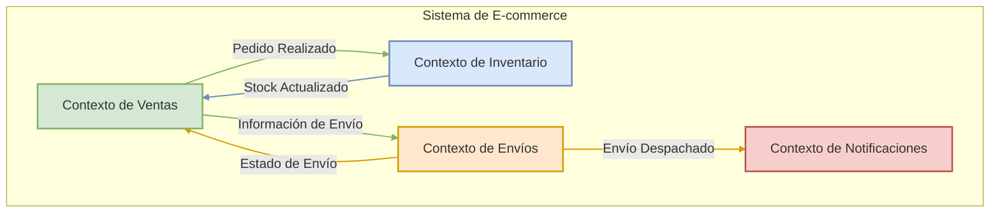

_Este diagrama muestra cuatro Bounded Contexts (Ventas, Inventario, Envíos y Notificaciones) y las interacciones principales entre ellos, representando un Mapa de Contextos básico._

#### **B. Diseño Táctico (Tactical Design)**

Una vez que los Bounded Contexts están definidos estratégicamente, el Diseño Táctico se enfoca en **cómo construir un modelo de dominio rico y expresivo&#x20;**_**dentro**_**&#x20;de cada uno de ellos**. Proporciona un conjunto de bloques de construcción (building blocks) para diseñar objetos de dominio que sean robustos, flexibles y que reflejen fielmente el Lenguaje Ubicuo.

Los elementos clave del Diseño Táctico son:

1. **Entities (Entidades):**
   * **Concepto:** Objetos que no se definen fundamentalmente por sus atributos, sino por un hilo de continuidad e identidad. Tienen un identificador único que perdura a lo largo del tiempo, incluso si sus otros atributos cambian.
   * **Ejemplo:** Un `Usuario` (identificado por `user_id`), un `Pedido` (identificado por `order_id`).
2. **Value Objects (Objetos de Valor):**
   * **Concepto:** Objetos que describen características de un dominio. No tienen una identidad conceptual propia; se definen por sus atributos. Son inmutables y pueden ser compartidos. Dos Value Objects son iguales si todos sus atributos son iguales.
   * **Ejemplo:** Una `Dirección` (compuesta por calle, ciudad, código postal), un `RangoDeFechas`, una `Moneda`.
3. **Aggregates (Agregados):**
   * **Concepto:** Un clúster de Entidades y Value Objects asociados que se tratan como una única unidad para los cambios de datos. Cada Agregado tiene una raíz, conocida como **Aggregate Root**, que es una Entidad específica.
   * **Regla:** El Aggregate Root es el único punto de entrada para cualquier modificación dentro del Agregado. Las referencias externas solo pueden apuntar al Aggregate Root. Esto garantiza la consistencia de las reglas de negocio dentro del Agregado.
   * **Ejemplo:** Un `Pedido` (Aggregate Root) podría contener `LineasDePedido` (Entidades) y una `DireccionDeEnvio` (Value Object). Solo se puede acceder o modificar las `LineasDePedido` a través del `Pedido`.
4. **Domain Services (Servicios de Dominio):**
   * **Concepto:** Operaciones o lógica de negocio significativa que no encajan naturalmente en una Entidad o Value Object. A menudo coordinan la actividad entre múltiples objetos de dominio.
   * **Importancia:** Evitan "anemizar" los objetos de dominio (es decir, convertirlos en meros contenedores de datos sin comportamiento) al extraer lógica que no es responsabilidad de un único objeto.
   * **Ejemplo:** Un servicio para transferir fondos entre dos `CuentasBancarias` (Entidades), que implica reglas de negocio complejas y coordinación.
5. **Repositories (Repositorios):**
   * **Concepto:** Abstracciones que median entre el dominio y las capas de mapeo de datos (persistencia). Proporcionan una interfaz similar a una colección para acceder a los Aggregate Roots.
   * **Importancia:** Desacoplan el modelo de dominio de las preocupaciones de infraestructura (cómo se almacenan y recuperan los datos). Permiten que el dominio ignore los detalles de la base de datos.
   * **Ejemplo:** `PedidoRepository` con métodos como `findById(id)`, `save(pedido)`.
6. **Factories (Fábricas):**
   * **Concepto:** Encapsulan la lógica de creación de objetos complejos (especialmente Aggregates y Entidades) cuando esta creación es en sí misma una operación significativa o cuando se quiere asegurar que el objeto se crea en un estado válido.
   * **Importancia:** Simplifican el cliente que necesita crear el objeto y centralizan la lógica de construcción, asegurando la validez e invarianza del objeto creado.
   * **Ejemplo:** Una `PedidoFactory` que toma información del cliente y productos para construir un nuevo `Pedido` asegurando que todas las reglas de negocio iniciales se cumplan.
7. **Domain Events (Eventos de Dominio):**
   * **Concepto:** Objetos que representan algo significativo que ha ocurrido en el dominio. Son hechos pasados e inmutables.
   * **Importancia:** Permiten comunicar cambios entre diferentes partes del dominio (o incluso diferentes Bounded Contexts de forma asíncrona) de manera desacoplada. Son fundamentales para arquitecturas reactivas y CQRS.
   * **Ejemplo:** `PedidoRealizadoEvent`, `InventarioActualizadoEvent`.

A continuación, un diagrama Mermaid que ilustra las relaciones entre algunos de estos bloques tácticos dentro de un Bounded Context:

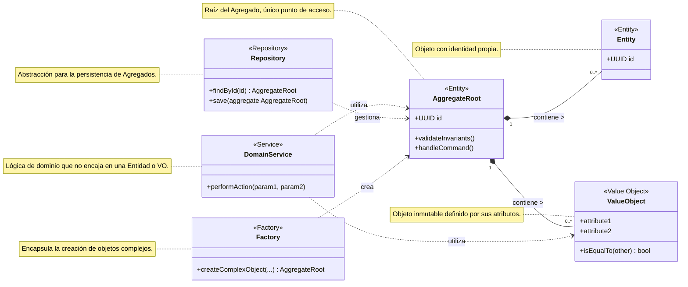

_Este diagrama de clases muestra cómo un Aggregate Root (que es una Entidad) puede contener otras Entidades y Value Objects. Los Domain Services pueden operar sobre estos objetos. Los Repositories se encargan de la persistencia de los Aggregate Roots, y las Factories ayudan en su creación._

#### **Relación entre Diseño Estratégico y Táctico**

Es crucial entender que el Diseño Táctico se aplica _dentro_ de los límites definidos por el Diseño Estratégico. No se puede empezar a modelar Entidades y Value Objects sin antes haber delimitado los Bounded Contexts y entendido el Lenguaje Ubicuo específico de cada uno.

* El **Diseño Estratégico** define el "dónde" y el "por qué" de un modelo de dominio.
* El **Diseño Táctico** define el "cómo" se construye ese modelo dentro de esos límites.

Al dominar ambos conjuntos de patrones, los desarrolladores pueden construir sistemas que no solo son técnicamente sólidos, sino que también están profundamente alineados con las necesidades y la lógica del negocio, lo que resulta en software más mantenible, escalable y valioso. En un entorno de microservicios, cada microservicio a menudo se alinea con un Bounded Context, y dentro de él, se aplican los patrones tácticos para construir su lógica de dominio.

***

### 7.2 Rol de Aggregates, Entities y Value Objects

El Domain-Driven Design (DDD) es un enfoque para el desarrollo de software que se centra en modelar el software para que coincida con un dominio o negocio subyacente. Para lograr esto, DDD se divide en dos conjuntos principales de herramientas o "bloques": los **Bloques Estratégicos** y los **Bloques Tácticos**. Ambos son cruciales para construir aplicaciones complejas, como las que desarrollaréis con FastAPI, que sean mantenibles, escalables y alineadas con las necesidades del negocio.

***

#### Bloques Estratégicos del DDD: La Visión General

Los patrones estratégicos de DDD nos ayudan a lidiar con la complejidad a gran escala. Se enfocan en definir el "espacio del problema" y cómo dividir un sistema grande en partes manejables y autónomas. Son fundamentales antes de sumergirnos en el código detallado.

Los conceptos clave del diseño estratégico son:

1. **Ubiquitous Language (Lenguaje Ubicuo):**
   * **Concepto:** Es un lenguaje compartido y riguroso desarrollado por el equipo (desarrolladores, expertos del dominio, stakeholders) para hablar sobre el dominio del software. Este lenguaje se utiliza en todas las conversaciones, diagramas, código y documentación.
   * **Importancia:** Elimina la ambigüedad y los malentendidos. Asegura que el modelo de software refleje con precisión el modelo de negocio. Por ejemplo, si en el dominio de "envíos" un "Paquete" tiene un significado específico, ese término se usará consistentemente en todas partes.
   * **Relación con FastAPI:** Al definir vuestros modelos con Pydantic o las operaciones en FastAPI, los nombres de las clases, atributos y _path operations_ deben provenir directamente del Lenguaje Ubicuo.
2. **Bounded Context (Contexto Delimitado):**
   * **Concepto:** Define una frontera explícita (lingüística, conceptual y técnica) dentro de la cual un modelo de dominio particular es consistente y válido. Un término del Lenguaje Ubicuo puede tener diferentes significados o implicaciones en diferentes Bounded Contexts.
   * **Importancia:** Permite que los modelos sean más pequeños, cohesivos y precisos. Evita la creación de un único modelo monolítico ("gran bola de barro") que intente abarcarlo todo, lo cual es difícil de mantener y evolucionar. Un "Cliente" en el contexto de "Ventas" puede tener atributos y comportamientos diferentes a un "Cliente" en el contexto de "Soporte Técnico".
   * **Relación con Microservicios y FastAPI:** Cada microservicio idealmente se alinea con uno o varios Bounded Contexts. Vuestras aplicaciones FastAPI que exponen las capacidades de un microservicio operarán dentro de las fronteras de su Bounded Context.
3. **Context Map (Mapa de Contextos):**
   * **Concepto:** Es una representación visual y documental de los diferentes Bounded Contexts y las relaciones entre ellos. Muestra cómo interactúan los equipos y los modelos.
   * **Importancia:** Proporciona una visión global del paisaje del sistema, clarificando las dependencias, los puntos de integración y las estrategias de colaboración entre equipos.
   * **Tipos de Relaciones Comunes (ejemplos):**
     * **Shared Kernel (Núcleo Compartido):** Dos o más contextos comparten una parte del modelo. Requiere alta coordinación.
     * **Customer-Supplier (Cliente-Proveedor):** Un contexto (proveedor) proporciona servicios a otro (cliente).
     * **Conformist (Conformista):** Un contexto se adhiere al modelo de otro sin cuestionarlo.
     * **Anti-Corruption Layer (Capa Anticorrupción):** Un contexto crea una capa de traducción para proteger su modelo de las influencias de un sistema externo o legado.
     * **Open Host Service (Servicio de Host Abierto):** Un contexto expone un conjunto de servicios bien definidos a los que otros pueden acceder.

A continuación, un diagrama Mermaid que ilustra un Mapa de Contextos simple:

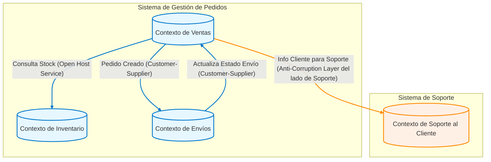

Este diagrama muestra cuatro Bounded Contexts y cómo podrían interactuar. Por ejemplo, el "Contexto de Ventas" consulta el stock al "Contexto de Inventario" (que podría exponer sus servicios como un Open Host Service) y notifica al "Contexto de Envíos" cuando un pedido se crea (una relación Cliente-Proveedor).

***

#### Bloques Tácticos del DDD: Los Cimientos del Modelo

Una vez que hemos definido los Bounded Contexts y cómo se relacionan (diseño estratégico), podemos enfocarnos en construir el modelo _dentro_ de cada Bounded Context utilizando los patrones tácticos. Estos son los "ladrillos" con los que construimos nuestro dominio.

Los principales bloques tácticos son:

1. **Entities (Entidades):**
   * **Concepto:** Objetos que tienen una identidad única que persiste a lo largo del tiempo y a través de diferentes estados. Su identidad no se define por sus atributos, sino por un ID.
   * **Ejemplo:** `Pedido` (identificado por `id_pedido`), `Usuario` (identificado por `id_usuario`).
   * **Se tratarán en detalle en 7.2.**
2. **Value Objects (Objetos de Valor):**
   * **Concepto:** Objetos que describen características o atributos y se definen por la combinación de sus valores. Son inmutables. No tienen una identidad conceptual propia.
   * **Ejemplo:** `Dirección` (compuesta por calle, ciudad, código postal), `Dinero` (compuesto por cantidad y divisa), `RangoDeFechas`.
   * **Se tratarán en detalle en 7.2.**
3. **Aggregates (Agregados):**
   * **Concepto:** Un clúster de Entidades y Value Objects relacionados que se tratan como una única unidad para los cambios de datos. Cada Agregado tiene una raíz (Aggregate Root), que es una Entidad específica. Es el único punto de entrada para acceder y modificar el Agregado.
   * **Importancia:** Garantizan la consistencia de las reglas de negocio (invariantes) dentro de sus límites. Las transacciones y la concurrencia se manejan a nivel de Agregado.
   * **Ejemplo:** Un Agregado `Pedido` podría incluir la Entidad `Pedido` (como Aggregate Root), una lista de Entidades `LineaDePedido` y un Value Object `DireccionEnvio`.
   * **Se tratarán en detalle en 7.2.**
4. **Domain Services (Servicios de Dominio):**
   * **Concepto:** Operaciones o lógica de negocio que no encajan naturalmente en una Entidad o Value Object. Suelen coordinar varias Entidades o realizar cálculos que involucran múltiples objetos de dominio. Son _stateless_.
   * **Ejemplo:** Un servicio que calcula la mejor ruta de envío basándose en varios Pedidos y la disponibilidad de transportistas.
   * **Se tratarán en detalle en 7.4.**
5. **Repositories (Repositorios):**
   * **Concepto:** Abstracciones que encapsulan la lógica de acceso y persistencia de los Agregados. Proveen una interfaz similar a una colección para recuperar y almacenar Agregados, ocultando los detalles de la base de datos.
   * **Importancia:** Desacoplan el modelo de dominio de la infraestructura de persistencia.
   * **Ejemplo:** `PedidoRepository` con métodos como `findById(id_pedido)` o `save(pedido)`.
   * **Se tratarán en detalle en 7.5.**
6. **Factories (Fábricas):**
   * **Concepto:** Encapsulan la lógica de creación de objetos complejos, especialmente Agregados o Entidades, asegurando que se creen en un estado válido y consistente.
   * **Importancia:** Simplifican la creación de objetos y garantizan que se cumplan todas las invariantes al momento de la instanciación.
   * **Ejemplo:** Una `PedidoFactory` que toma los datos necesarios y devuelve un Agregado `Pedido` completamente formado.
   * **Se tratarán en detalle en 7.7.**
7. **Domain Events (Eventos de Dominio):**
   * **Concepto:** Representan algo significativo que ha ocurrido en el dominio. Son hechos pasados e inmutables.
   * **Importancia:** Permiten la comunicación desacoplada entre diferentes partes del sistema, incluyendo distintos Agregados o incluso Bounded Contexts (a menudo usados en arquitecturas orientadas a eventos y CQRS).
   * **Ejemplo:** `PedidoRealizado`, `StockActualizado`, `UsuarioRegistrado`.

A continuación, un diagrama Mermaid que ilustra cómo estos bloques tácticos pueden interactuar dentro de un Bounded Context:

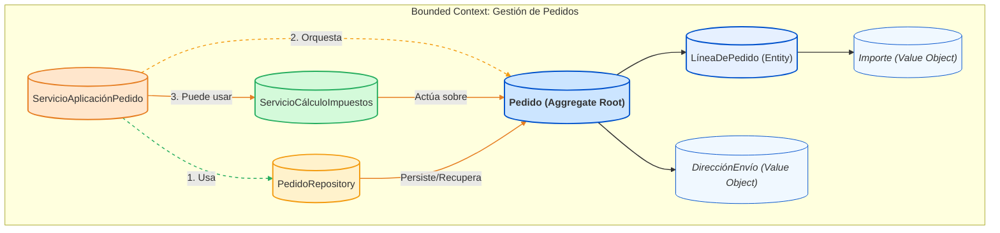

En este diagrama:

* El `ServicioAplicaciónPedido` (que podría ser invocado por un endpoint de FastAPI) utiliza el `PedidoRepository` para obtener un Agregado `Pedido`.
* Luego, orquesta las operaciones sobre el Agregado `Pedido` (el Aggregate Root).
* Si es necesario, puede utilizar un `ServicioCálculoImpuestos` (Domain Service) que opera sobre el Agregado.
* Finalmente, el `PedidoRepository` se encarga de persistir los cambios en el Agregado.

***

#### Relación entre Bloques Estratégicos y Tácticos

Es vital entender que los bloques estratégicos y tácticos no son independientes; se complementan:

* **El Diseño Estratégico establece el escenario:** Define los límites (Bounded Contexts) y las reglas de enfrentamiento (Context Maps). Sin una buena estrategia, los esfuerzos tácticos pueden ser caóticos y redundantes.
* **El Diseño Táctico implementa la obra:** Proporciona las herramientas para construir modelos ricos y expresivos _dentro_ de esos límites.

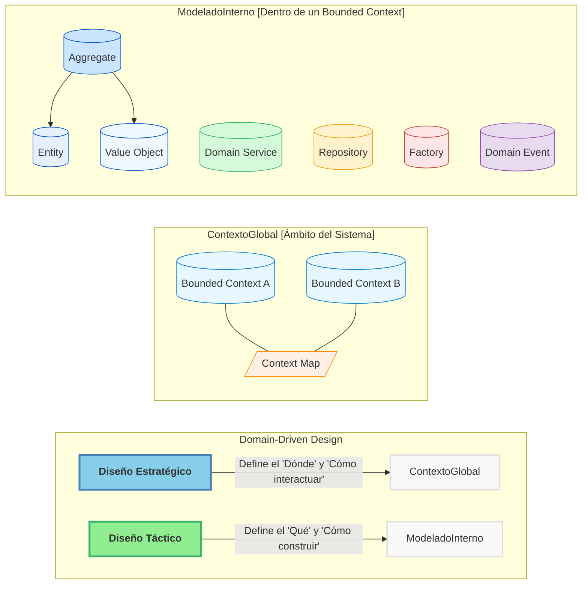

Este diagrama final resume la relación: el Diseño Estratégico sienta las bases para el sistema global con Bounded Contexts y sus interacciones (Context Map), mientras que el Diseño Táctico se enfoca en la implementación detallada del modelo de dominio dentro de cada uno de esos contextos, utilizando elementos como Agregados, Entidades y Value Objects.

***

**En resumen para este punto 7.1:**

* **Estratégico DDD (la gran imagen):** Se centra en identificar y delimitar las diferentes áreas del problema (Bounded Contexts), establecer un lenguaje común (Ubiquitous Language) y mapear cómo estas áreas interactúan (Context Map).
* **Táctico DDD (los detalles):** Proporciona los bloques de construcción (Entities, Value Objects, Aggregates, Services, Repositories, Factories, Domain Events) para crear modelos de dominio ricos y expresivos dentro de cada Bounded Context.

Comprender y aplicar ambos conjuntos de herramientas es esencial para aprovechar al máximo el DDD y construir aplicaciones FastAPI robustas y alineadas con el negocio. Los siguientes puntos del temario profundizarán en varios de estos bloques tácticos.

***

### 7.3 Definición de Bounded Contexts y sus fronteras

En el punto 7.1 introdujimos los Bounded Contexts (Contextos Delimitados) como un pilar del diseño estratégico en DDD. Ahora, profundizaremos en qué son exactamente, por qué son cruciales y, lo más importante, cómo podemos empezar a definir sus fronteras en nuestros sistemas. Esta comprensión es fundamental para estructurar vuestras aplicaciones FastAPI de manera que reflejen y sirvan eficazmente al dominio de negocio.

***

#### ¿Qué es un Bounded Context? El Corazón de la Autonomía del Modelo

Un **Bounded Context** (Contexto Delimitado) es una **frontera explícita** dentro de la cual un modelo de dominio particular es coherente y tiene un significado unívoco. Dentro de esta frontera:

1. **El Lenguaje Ubicuo es Consistente:** Cada término del Lenguaje Ubicuo (Ubiquitous Language) tiene una definición precisa y compartida por todos los miembros del equipo que trabajan dentro de ese contexto.
2. **El Modelo de Dominio es Específico:** Las entidades, objetos de valor y reglas de negocio se diseñan específicamente para resolver los problemas de esa parte particular del dominio.
3. **La Integridad del Modelo está Protegida:** Las influencias externas no corrompen la lógica y el lenguaje del modelo interno.

Imagina un Bounded Context como una habitación con reglas propias. Lo que una palabra significa o cómo se comporta un objeto dentro de esa habitación está claramente definido y es válido allí. Fuera de esa habitación, la misma palabra u objeto podría tener un significado o comportamiento diferente.

**Propósito Fundamental:**

* **Manejar la Complejidad:** Descomponer un sistema grande y complejo en partes más pequeñas y manejables.
* **Permitir la Autonomía del Equipo:** Diferentes equipos pueden trabajar en diferentes Bounded Contexts de forma independiente, cada uno con su propio modelo y ritmo de desarrollo.
* **Claridad y Precisión del Modelo:** Evita la ambigüedad al permitir que un mismo concepto del mundo real (ej. "Cliente") tenga diferentes modelos según las necesidades específicas de cada contexto. Por ejemplo, un "Cliente" en el contexto de "Marketing" es diferente a un "Cliente" en el contexto de "Facturación".
* **Habilitador de Microservicios:** En arquitecturas de microservicios, cada servicio (o un pequeño conjunto de servicios cohesivos) a menudo se alinea con un Bounded Context. Tu aplicación FastAPI podría exponer las funcionalidades de uno de estos contextos.

***

#### Identificando y Definiendo las Fronteras: El Arte y la Ciencia

Definir las fronteras de un Bounded Context es una de las tareas más críticas y, a menudo, desafiantes del DDD estratégico. No siempre hay una respuesta única "correcta", y las fronteras pueden evolucionar con el tiempo a medida que mejora la comprensión del dominio.

**¿Por qué son tan importantes las fronteras?**\
Sin fronteras claras, los modelos tienden a mezclarse, el lenguaje se vuelve ambiguo y el sistema degenera en lo que Eric Evans llama una "Gran Bola de Barro" (Big Ball of Mud): un monolito enredado, difícil de entender, mantener y evolucionar.

**¿Cómo definir estas fronteras?**

1. **El Lenguaje Ubicuo como Guía Principal:**
   * **Escucha las Conversaciones:** Presta atención a cómo los expertos del dominio y los diferentes departamentos hablan sobre conceptos y procesos. ¿Usan los mismos términos de manera diferente? ¿Existen sinónimos que en realidad ocultan conceptos distintos?
   * **Ambigüedades Lingüísticas:** Si un término como "Producto" tiene múltiples significados o atributos dependiendo de quién hable (Ventas, Inventario, Soporte), es una señal fuerte de que podrías necesitar Bounded Contexts separados. Cada contexto refinará el término "Producto" para sus necesidades específicas.
2.  **Alineación con Capacidades de Negocio (Business Capabilities):**

    * Una capacidad de negocio es algo que la empresa hace para generar valor (ej: "Gestión de Catálogo", "Procesamiento de Pedidos", "Gestión de Inventario").
    * A menudo, un Bounded Context se alinea bien con una o varias capacidades de negocio cohesivas. Esto ayuda a asegurar que el software esté estructurado en torno a las funciones clave del negocio.

    _Este diagrama ilustra cómo diferentes capacidades de negocio pueden agruparse naturalmente en Bounded Contexts específicos._
3. **Estructura Organizacional y de Equipos (Ley de Conway):**
   * La Ley de Conway sugiere que las organizaciones diseñan sistemas que reflejan su estructura de comunicación. A veces, las fronteras de los Bounded Contexts pueden (o deben) alinearse con las estructuras de los equipos existentes para minimizar la fricción en la comunicación y maximizar la autonomía.
   * Si un equipo es responsable de un conjunto cohesivo de funcionalidades, ese conjunto podría ser un buen candidato para un Bounded Context.
4. **Cohesión y Acoplamiento:**
   * Busca fronteras que maximicen la **cohesión interna** (los elementos dentro del contexto están fuertemente relacionados y trabajan juntos para un propósito común) y minimicen el **acoplamiento externo** (el contexto depende lo menos posible de otros contextos).
5. **Técnicas de Descubrimiento:**
   * **Event Storming:** Es una técnica de taller colaborativo muy efectiva para explorar dominios complejos, identificar eventos de dominio, comandos, agregados y, crucialmente, las fronteras entre Bounded Contexts a través de la identificación de cambios en el lenguaje o en los procesos.
   * **Análisis de Procesos de Negocio:** Desglosar los flujos de trabajo y procesos clave de la empresa puede revelar costuras naturales donde los modelos y responsabilidades cambian.

***

#### Características de Fronteras Efectivas

* **Explícitas:** Las fronteras no deben ser ambiguas. Deben ser conocidas y respetadas por los equipos. Documentarlas, a menudo a través de un Mapa de Contextos (Context Map), es crucial.
* **Protectoras de la Integridad del Modelo:** Cada Bounded Context debe ser libre de optimizar su modelo y lenguaje para su propósito específico, sin ser forzado a compromisos por las necesidades de otros contextos.
* **Habilitadoras de Autonomía:** Permiten que los equipos tomen decisiones tecnológicas y de modelado dentro de sus fronteras con un impacto mínimo en otros equipos.

***

#### Bounded Contexts en la Práctica: El Ejemplo del "Libro"

Un mismo concepto del mundo real puede (y a menudo debe) ser modelado de manera diferente en distintos Bounded Contexts. Consideremos el concepto de "Libro" en una editorial:

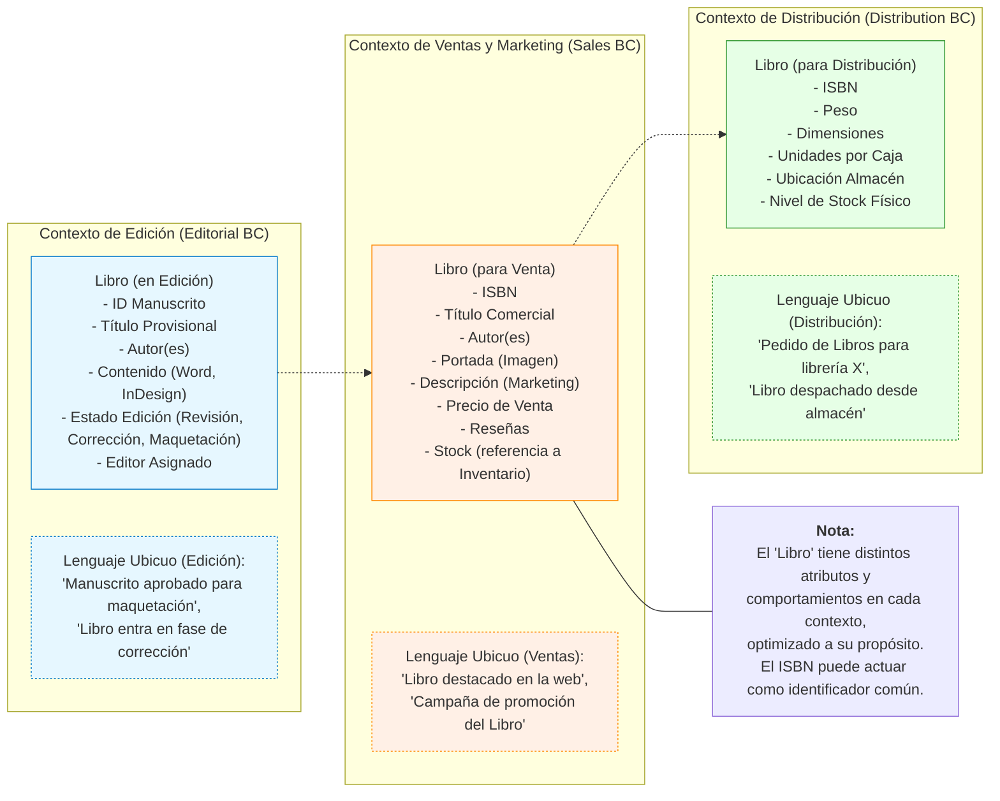

En el diagrama anterior:

* En el **Contexto de Edición**, "Libro" se enfoca en el proceso de creación: manuscrito, revisiones, editor.
* En el **Contexto de Ventas y Marketing**, "Libro" se centra en cómo se presenta y vende al público: portada, descripción comercial, precio, reseñas.
* En el **Contexto de Distribución**, "Libro" se refiere a la unidad física: peso, dimensiones, ubicación en el almacén.

Intentar crear una única clase `Libro` que satisfaga todas estas necesidades resultaría en un objeto hinchado, complejo y lleno de campos opcionales y lógica condicional. Los Bounded Contexts permiten modelos más limpios y enfocados. La frontera entre estos contextos es una **interfaz contractual** que define cómo se comunican (tema que se explora más con los Mapas de Contexto).

***

#### Bounded Contexts y su Aplicación con FastAPI y Microservicios

Como se mencionó, los Bounded Contexts son un precursor natural de los microservicios:

* **Un Microservicio por Bounded Context (generalmente):** Una aplicación FastAPI podría implementar la lógica y exponer la API para un Bounded Context específico. Por ejemplo, `servicio_ventas_fastapi`, `servicio_inventario_fastapi`.
* **Modelo y Lógica Propios:** Cada aplicación FastAPI tendría sus propios modelos Pydantic (reflejando el Lenguaje Ubicuo de su contexto), su lógica de dominio y sus repositorios.
* **Comunicación entre Contextos:** La comunicación entre estos servicios FastAPI (que representan diferentes Bounded Contexts) se gestionaría mediante los patrones definidos en el Mapa de Contextos (APIs RESTful, mensajería asíncrona, etc.).

La definición clara de Bounded Contexts y sus fronteras os permitirá diseñar sistemas FastAPI que no solo son técnicamente sólidos, sino que también están profundamente alineados con la estructura y las necesidades del negocio, facilitando su evolución y mantenimiento a largo plazo.

### 7.4 Diseño de Domain Services

En el modelado de dominios complejos, a veces nos encontramos con operaciones o lógica de negocio que no encajan de forma natural como una responsabilidad de una Entidad o un Objeto de Valor. Cuando una acción significativa del dominio involucra múltiples objetos de dominio, o cuando la operación en sí misma es un concepto central sin un estado propio, recurrimos a los **Servicios de Dominio (Domain Services)**. Estos son un componente esencial de la capa de dominio en DDD.

***

#### ¿Qué es un Servicio de Dominio?

Un Servicio de Dominio encapsula **lógica de negocio del dominio** que no pertenece intrínsecamente a ningún objeto Entidad o Valor Object individual. Son operaciones que representan procesos, transformaciones o cálculos significativos dentro del dominio.

**Características Clave:**

* **Sin Estado (Stateless):** Los Servicios de Dominio no deben tener un estado que persista más allá de una única invocación de método. Su comportamiento depende únicamente de los parámetros de entrada (que suelen ser Entidades, Agregados, Value Objects o sus identificadores) y, potencialmente, de otros servicios o repositorios que puedan necesitar consultar.
* **Operaciones del Dominio:** Su interfaz y sus métodos exponen operaciones que son parte del Lenguaje Ubicuo y representan conceptos de negocio. A menudo, sus nombres derivan de verbos o actividades (ej: `TransferirFondos`, `CalcularRutaOptimaEnvio`, `GenerarInformeConsolidado`).
* **Pertenecen a la Capa de Dominio:** Son ciudadanos de primera clase de la capa de dominio, al igual que las Entidades y los Value Objects. Contienen lógica de negocio pura, libre de preocupaciones de infraestructura o aplicación.

***

#### ¿Cuándo Necesitas un Servicio de Dominio?

Deberías considerar crear un Servicio de Dominio cuando:

1. **La operación involucra múltiples Agregados o Entidades:** Por ejemplo, transferir dinero entre dos `CuentaBancaria` (dos Agregados distintos) es una operación que no pertenece naturalmente a una sola cuenta, sino que las coordina.
2. **La lógica es significativa en el dominio pero no tiene un "hogar" natural:** Si una pieza de lógica de negocio es importante y claramente parte del dominio, pero forzarla dentro de una Entidad haría que esa Entidad perdiera cohesión o asumiera responsabilidades ajenas.
3. **Hay un cálculo o proceso complejo que opera sobre Objetos de Valor:** Por ejemplo, un servicio que compara dos `PolizaDeSeguro` (Value Objects complejos) para determinar su equivalencia según ciertas reglas de negocio.
4. **Se necesita una interfaz para un recurso externo que se comporta como parte del dominio (aunque con cuidado):** A veces, un sistema externo (como un servicio de validación de crédito) se puede modelar como un Servicio de Dominio desde la perspectiva del modelo local, aunque su implementación real delegue en la infraestructura.

**Importante:** No abuses de los Servicios de Dominio. La primera inclinación debe ser siempre tratar de ubicar la lógica de negocio en las Entidades (especialmente Raíces de Agregado) y Objetos de Valor, ya que esto conduce a modelos más ricos y cohesivos. Los Servicios de Dominio son para los casos donde esto no es natural o apropiado.

***

#### Servicios de Dominio vs. Servicios de Aplicación (Distinción Crucial)

Es fundamental distinguir entre Servicios de Dominio y Servicios de Aplicación (que se verán en el punto 7.9). Aunque ambos son "servicios", operan en capas diferentes y tienen responsabilidades distintas:

* **Servicios de Dominio (Domain Services):**
  * **Capa:** Dominio.
  * **Lógica:** Lógica de negocio pura, reglas del dominio.
  * **Estado:** Sin estado.
  * **Entradas/Salidas:** Operan con objetos del dominio (Entidades, Value Objects).
  * **Preocupaciones:** Únicamente el "qué" y "cómo" del negocio. Desconocen la infraestructura, la UI, las transacciones (aunque participan en ellas), la seguridad a nivel de aplicación, etc.
  * **Ejemplo:** Un `ServicioDeCalculoDeImpuestos` que toma un `Pedido` y devuelve el `ImporteDeImpuestos` (un Value Object).
* **Servicios de Aplicación (Application Services):**
  * **Capa:** Aplicación.
  * **Lógica:** Orquestan los casos de uso de la aplicación. Son los clientes directos de la capa de dominio.
  * **Estado:** Generalmente sin estado, pero pueden gestionar el ciclo de vida de las transacciones o unidades de trabajo.
  * **Entradas/Salidas:** Típicamente reciben Data Transfer Objects (DTOs) o datos primitivos de la capa de presentación/API (ej. de un endpoint FastAPI), los traducen para el dominio, invocan lógica en Agregados o Servicios de Dominio, y luego devuelven DTOs o respuestas a la capa superior.
  * **Preocupaciones:** Coordinación de casos de uso, gestión de transacciones, autorización (a nivel de caso de uso), mapeo entre DTOs y objetos de dominio, invocación de Repositorios.
  * **Ejemplo:** Un `ServicioDeGestionDePedidos` con un método `confirmarPedido(pedidoId, datosUsuario)` que recupera un `Pedido` usando un Repositorio, invoca `pedido.confirmar()`, posiblemente usa un `ServicioDeNotificacion` (que podría ser un servicio de infraestructura o una abstracción en el dominio), y guarda el pedido.

El siguiente diagrama ilustra esta relación:

```mermaid
graph TD
    subgraph "Usuario/Cliente Externo (API Call)"
        APICall["POST /transferencias (FastAPI Endpoint)"]
    end

    subgraph "Capa de Aplicación (Application Layer)"
        AppSvc["TransferenciaAppService"]
        DTO_In["SolicitudTransferenciaDTO"]
        DTO_Out["ConfirmacionTransferenciaDTO"]
    end

    subgraph "Capa de Dominio (Domain Layer)"
        DomSvc["ServicioTransferenciaFondos"]
        CuentaOrigen["CuentaOrigen (Aggregate)"]
        CuentaDestino["CuentaDestino (Aggregate)"]
        RepoCuentas["IRepositorioCuentas"]
        Evento["TransferenciaEjecutada (Domain Event)"]
    end

    subgraph "Capa de Infraestructura (Infrastructure Layer)"
        RepoImpl["RepositorioCuentasImpl"]
        UoW["UnitOfWork (Gestor Transacciones)"]
        MessageBroker["Broker de Eventos (ej: Kafka, RabbitMQ)"]
        Notificador["ServicioDeNotificacionExterno"]
    end

    APICall -- "1. Recibe datos (JSON)" --> DTO_In
    DTO_In -- "2. Pasa a" --> AppSvc

    AppSvc -- "3. Inicia Unidad de Trabajo" --> UoW
    AppSvc -- "4. Usa Repositorio para obtener Agregados" --> RepoCuentas
    RepoCuentas -- "implementado por" --> RepoImpl
    RepoImpl -- "accede a BD (no mostrado)" --> implicit_db1[(BD)]

    AppSvc -- "5. Invoca Servicio de Dominio" --> DomSvc
    DomSvc -- "opera con" --> CuentaOrigen
    DomSvc -- "opera con" --> CuentaDestino
    DomSvc -- "puede generar" --> Evento

    AppSvc -- "6. Usa Repositorio para persistir cambios" --> RepoCuentas
    AppSvc -- "7. Publica Evento (si existe)" --> MessageBroker
    MessageBroker -- "envía" --> Evento
    AppSvc -- "8. Envía Notificación (opcional, vía abstracción)" --> Notificador
    AppSvc -- "9. Confirma Unidad de Trabajo" --> UoW
    AppSvc -- "10. Devuelve DTO de resultado" --> DTO_Out
    DTO_Out -- "11. Serializa a JSON" --> APICall

    %% Estilos
    classDef api fill:#D2B4DE,stroke:#8E44AD,stroke-width:2px
    classDef app fill:#AED6F1,stroke:#3498DB,stroke-width:2px
    classDef domain fill:#A9DFBF,stroke:#27AE60,stroke-width:2px
    classDef infra fill:#FADBD8,stroke:#E74C3C,stroke-width:2px

    class APICall api
    class AppSvc app
    class DTO_In app
    class DTO_Out app
    class DomSvc domain
    class CuentaOrigen domain
    class CuentaDestino domain
    class RepoCuentas domain
    class Evento domain
    class RepoImpl infra
    class UoW infra
    class MessageBroker infra
    class Notificador infra
    class implicit_db1 infra

```

_En este diagrama, el `TransferenciaAppService` (Servicio de Aplicación) orquesta el caso de uso de realizar una transferencia. Utiliza el `IRepositorioCuentas` para cargar las cuentas, luego invoca al `ServicioTransferenciaFondos` (Servicio de Dominio) para ejecutar la lógica de negocio central de la transferencia. El Servicio de Aplicación también se encarga de la gestión transaccional (Unit of Work) y de la comunicación con otras partes de la infraestructura (como publicar un evento)._

***

#### Diseñando la Interfaz de un Servicio de Dominio

* **Claridad y Expresividad:** El nombre del servicio y sus métodos deben ser claros y reflejar el Lenguaje Ubicuo.
* **Parámetros:** Los métodos de un Servicio de Dominio suelen aceptar como parámetros:
  * Identificadores de Agregados (ej: `cuentaOrigenId: UUID`, `cuentaDestinoId: UUID`). El servicio podría usar Repositorios para cargar estos agregados.
  * Agregados o Entidades ya cargadas (ej: `cuentaOrigen: Cuenta`, `cuentaDestino: Cuenta`). Esto es a menudo preferible si el Servicio de Aplicación ya los ha cargado, ya que mantiene al Servicio de Dominio más enfocado en la lógica pura.
  * Objetos de Valor (ej: `monto: Dinero`).
* **Valores de Retorno:**
  * Pueden no devolver nada (void) si su propósito es modificar el estado de los Agregados pasados como parámetros.
  * Pueden devolver un Objeto de Valor resultado de un cálculo (ej: `TotalImpuestos`).
  * Pueden generar y devolver (o disparar internamente si se usa un bus de eventos de dominio) un Evento de Dominio.

***

#### Ejemplos Prácticos en un Contexto FastAPI

Imaginemos una aplicación FastAPI para una plataforma de e-commerce:

* **`CalculadoraDeCostosDeEnvioComplejaService` (Servicio de Dominio):**
  * **Responsabilidad:** Calcular el costo de envío basándose en múltiples factores: peso y dimensiones de los productos en un `Carrito`, la `DireccionDestino`, el `TipoDeEnvio` seleccionado por el `Cliente`, y las tarifas de múltiples `ProveedoresDeLogistica`.
  * **Uso:** Un `ServicioDeAplicacionCheckout` lo invocaría pasándole los datos relevantes del carrito y del cliente para obtener el costo de envío antes de finalizar un pedido.
* **`GeneradorDeSugerenciasDeProductosService` (Servicio de Dominio):**
  * **Responsabilidad:** Implementar un algoritmo para sugerir productos a un `Cliente` basándose en su `HistorialDeCompras`, los `ProductosVistosRecientemente`, y las `TendenciasDeProductosPopulares`.
  * **Uso:** Un `ServicioDeAplicacionHome` podría usarlo para obtener una lista de `ProductoId`s sugeridos para mostrar en la página principal del usuario.

En ambos casos, el endpoint FastAPI recibiría la solicitud, la pasaría a un Servicio de Aplicación, y este último orquestaría la interacción, incluyendo la posible llamada a uno o más Servicios de Dominio.

***

**Conclusión:**

Los Servicios de Dominio son una herramienta poderosa para encapsular lógica de negocio que trasciende las responsabilidades de una única Entidad u Objeto de Valor. Ayudan a mantener las Entidades cohesivas y el modelo de dominio limpio y expresivo. La clave es usarlos juiciosamente y distinguirlos claramente de los Servicios de Aplicación, asegurando que cada uno opere en su capa correspondiente y con sus responsabilidades bien definidas.

***

### 7.5 Repositorios como abstracción de persistencia

Dentro de los patrones tácticos de Domain-Driven Design, el **Repositorio (Repository)** juega un papel crucial al actuar como una capa de abstracción entre la lógica de dominio y los mecanismos de persistencia de datos. Su correcta implementación es vital para construir aplicaciones (como las que desarrollaréis con FastAPI) que sean robustas, mantenibles y fáciles de probar, al desacoplar el "qué" del dominio del "cómo" de la infraestructura de datos.

***

#### ¿Qué es un Repositorio en DDD?

Un Repositorio es un objeto que **media entre el dominio y las capas de mapeo de datos**, utilizando una interfaz similar a una colección para acceder a los objetos de dominio (específicamente, a las Raíces de Agregado o _Aggregate Roots_).

Imagina un Repositorio como una colección de objetos de dominio que reside en memoria. Desde la perspectiva del código cliente (como un Servicio de Aplicación), no importa si estos objetos provienen de una base de datos SQL, un almacén NoSQL, un archivo o incluso un servicio externo. El Repositorio oculta estos detalles.

**Propósito Fundamental:**

* **Desacoplar el Dominio de la Infraestructura de Persistencia:** Permite que el modelo de dominio sea ignorante de la tecnología de almacenamiento de datos utilizada. Esto significa que podrías cambiar de PostgreSQL a MongoDB (o viceversa) con un impacto mínimo en tu lógica de negocio principal.
* **Simplificar el Acceso a Datos para el Cliente:** Proporciona métodos claros y con intención (ej: `findById`, `save`, `findByCriteria`) que devuelven Agregados completamente constituidos.
* **Centralizar la Lógica de Acceso a Datos:** Las consultas y la lógica de mapeo entre el modelo de dominio y el esquema de la base de datos se encapsulan dentro de la implementación del Repositorio.
* **Mejorar la Testeabilidad:** Puedes fácilmente sustituir la implementación real del Repositorio por un _mock_ o _fake_ en tus pruebas unitarias o de integración, permitiendo probar la lógica de dominio y de aplicación de forma aislada.

***

#### Principios Clave de Diseño de los Repositorios

1. **Un Repositorio por Raíz de Agregado (Aggregate Root):**
   * Los Repositorios se definen para gestionar Agregados completos. La Raíz del Agregado es el único miembro del Agregado al que los objetos externos (como los Repositorios) pueden hacer referencia directamente.
   * Por ejemplo, si tienes un Agregado `Pedido` (con `LineaDePedido` como entidad interna), tendrás un `IPedidoRepository`, no un `ILineaDePedidoRepository`. Las líneas de pedido se gestionan a través del Agregado `Pedido`.
2. **La Interfaz en el Dominio, la Implementación en la Infraestructura:**
   * La **interfaz** del Repositorio (ej: `IPedidoRepository`) se define en la capa de Dominio. Esto es porque la interfaz define el contrato de cómo el dominio espera recuperar y persistir sus Agregados. Forma parte del vocabulario del dominio.
   * La **implementación concreta** (ej: `PedidoSQLAlchemyRepository` o `PedidoMongoRepository`) reside en la capa de Infraestructura. Esta implementación contiene el código específico para interactuar con la base de datos (SQLAlchemy, PyMongo, etc.).
   * Esto sigue el Principio de Inversión de Dependencias (DIP): las capas de alto nivel (Dominio) no deben depender de las capas de bajo nivel (Infraestructura); ambas deben depender de abstracciones (la interfaz del Repositorio).

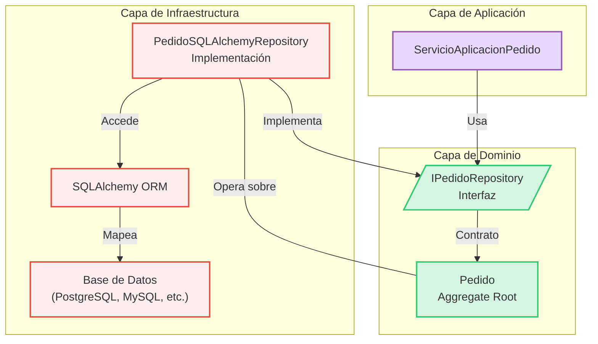

```
*Este diagrama ilustra cómo el Servicio de Aplicación depende de la interfaz del Repositorio definida en el Dominio, mientras que la implementación concreta reside en la Infraestructura, interactuando con la base de datos (a menudo mediante un ORM).*
```

3\. **Interfaz Similar a una Colección (Collection-like Interface):**

```
  * Los métodos comunes incluyen:
      * `add(aggregate: AggregateRoot)`: Añade un nuevo Agregado.
      * `save(aggregate: AggregateRoot)`: Guarda los cambios de un Agregado existente (o lo añade si es nuevo, a veces se distingue de `update`).
      * `findById(id: AggregateId) -> Optional[AggregateRoot]`: Busca un Agregado por su identificador único.
      * `remove(aggregate: AggregateRoot)` o `removeById(id: AggregateId)`: Elimina un Agregado.
      * Métodos de consulta específicos del dominio: `findByClienteId(cliente_id: ClienteId) -> List[AggregateRoot]`, `findPedidosPendientes() -> List[AggregateRoot]`.
  * **Importante:** Las consultas deben devolver Agregados completos y consistentes, listos para ser utilizados por el dominio. No deben devolver DTOs parciales o datos "crudos" de la base de datos directamente a la capa de dominio.
```

4\. **Gestión de Transacciones:**

```
  * Un método del Repositorio (como `save`) a menudo implica una transacción para asegurar la atomicidad al persistir un Agregado.
  * Para operaciones que involucran múltiples Agregados o requieren coordinación transaccional más amplia, se suele utilizar un patrón como **Unit of Work**, que a menudo es gestionado por el Servicio de Aplicación. El Unit of Work rastrea los cambios en los Agregados y los consolida en una única transacción al final de la operación de negocio.
```

***

#### Repositorios en el Contexto de FastAPI

Cuando desarrollas aplicaciones con FastAPI, los Repositorios son tus aliados para mantener tu código organizado y limpio:

* **Servicios de Aplicación y Endpoints:** Tus _endpoints_ de FastAPI (definidos con `@app.get`, `@app.post`, etc.) normalmente invocarán a Servicios de Aplicación. Estos servicios, a su vez, utilizarán las interfaces de los Repositorios para obtener o guardar los Agregados necesarios para cumplir con la solicitud.

```python
# Ejemplo conceptual en un servicio de aplicación
    class PedidoService:
        def __init__(self, pedido_repository: IPedidoRepository):
            self.pedido_repository = pedido_repository

        def crear_nuevo_pedido(self, datos_pedido: PedidoCreateSchema) -> Pedido:
            # ... lógica para crear el Agregado Pedido ...
            nuevo_pedido = Pedido(**datos_pedido.dict()) # Asumiendo Pydantic y creación de Agregado
            self.pedido_repository.add(nuevo_pedido)
            # Podría haber un UnitOfWork.commit() aquí o al final del endpoint
            return nuevo_pedido

        def obtener_pedido(self, pedido_id: UUID) -> Optional[Pedido]:
            return self.pedido_repository.findById(pedido_id)
```

* **Inyección de Dependencias:** En FastAPI, puedes usar el sistema de inyección de dependencias (ej. `Depends`) para proporcionar la implementación concreta del Repositorio a tus Servicios de Aplicación o directamente a tus _path operation functions_ si el servicio es muy simple.
  * **Manteniendo los Endpoints Limpios:** Los _endpoints_ se centran en la lógica HTTP (validación de entrada, serialización de salida, códigos de estado) y delegan la lógica de negocio y el acceso a datos a los servicios y repositorios.

***

#### Lo que NO son los Repositorios (Distinciones Importantes)

* **No son DAOs Genéricos (Data Access Objects):** Aunque ambos patrones tratan con el acceso a datos, los DAOs tradicionales suelen ser más granulares, a menudo mapeando uno a uno con tablas de base de datos o documentos, y pueden devolver datos sin formato o DTOs simples. Los Repositorios operan a nivel de Agregados y devuelven objetos de dominio ricos y completamente constituidos.
* **No son una Simple Fachada sobre un O/RM:** Si bien un O/RM (como SQLAlchemy) es una herramienta común para _implementar_ un Repositorio, el Repositorio no debe exponer directamente las capacidades genéricas del O/RM (como un constructor de consultas genérico) a la capa de dominio. La interfaz del Repositorio debe ser específica del dominio y sus necesidades de consulta sobre los Agregados.

**Conclusión:**

El patrón Repositorio es una piedra angular en DDD para lograr un diseño desacoplado y centrado en el dominio. Al abstraer los detalles de la persistencia, facilita la evolución del sistema, mejora la testeabilidad y permite que la lógica de dominio se mantenga pura y enfocada en las reglas de negocio, lo cual es esencial al construir aplicaciones FastAPI complejas y de alta calidad.

***

### 7.6 Integración de DDD con FastAPI y Pydantic

Hasta ahora, hemos explorado los bloques estratégicos y tácticos de DDD. Ahora veremos cómo estos conceptos se integran de manera efectiva en el desarrollo de aplicaciones web API robustas y mantenibles utilizando el framework FastAPI y la librería de validación de datos Pydantic. Esta combinación ofrece un entorno potente para construir sistemas centrados en el dominio.

***

#### Mapeo de Conceptos DDD a la Arquitectura de FastAPI

Recordemos las capas típicas en una arquitectura influenciada por DDD:

1. **Capa de Presentación (o API en nuestro caso):** Responsable de interactuar con el mundo exterior (clientes HTTP).
2. **Capa de Aplicación:** Orquesta los casos de uso, actuando como intermediaria entre la presentación y el dominio. No contiene lógica de negocio.
3. **Capa de Dominio:** El corazón del software. Contiene las Entidades, Value Objects, Agregados, Servicios de Dominio e Interfaces de Repositorio. Aquí reside la lógica de negocio.
4. **Capa de Infraestructura:** Proporciona las implementaciones técnicas para la persistencia (Repositorios), mensajería, acceso a servicios externos, etc.

**¿Cómo encajan FastAPI y Pydantic?**

* **FastAPI como Capa de Presentación/API:**
  * Maneja las solicitudes HTTP entrantes, el enrutamiento hacia las operaciones correctas.
  * Gestiona la autenticación y autorización en el borde de la aplicación.
  * Define los _endpoints_ que exponen los casos de uso implementados por los Servicios de Aplicación.
  * Su sistema de inyección de dependencias es clave para conectar las capas.
* **Pydantic para el Modelado y Validación de Datos:**
  * **DTOs (Data Transfer Objects):** Ideal para definir los esquemas de las solicitudes (request bodies, query parameters) y las respuestas (response models) en la capa API. Asegura la validación automática de datos de entrada y la serialización de salida.
  * **Value Objects en el Dominio:** Los modelos Pydantic, especialmente con `model_config = {'frozen': True}` (Pydantic V2+) para la inmutabilidad, son excelentes para implementar Value Objects, beneficiándose de sus potentes capacidades de validación.
  * **Atributos de Entidades:** Pydantic puede usarse para definir la estructura y las validaciones de los atributos de las Entidades, aunque la identidad y el ciclo de vida de las Entidades son conceptos de DDD que van más allá de la simple estructura de datos.

***

#### Estructura de Proyecto Sugerida

Una estructura de proyecto típica que facilita la separación de capas podría ser:

```
mi_proyecto_fastapi_ddd/
├── api/                  # Capa de Presentación/API (o routers/)
│   ├── __init__.py
│   ├── endpoints/        # Módulos con los path operations de FastAPI
│   │   ├── __init__.py
│   │   └── pedidos_router.py
│   └── schemas/          # DTOs de Pydantic para requests/responses
│       ├── __init__.py
│       └── pedido_schemas.py
├── application/          # Capa de Aplicación
│   ├── __init__.py
│   └── services/
│       ├── __init__.py
│       └── pedido_service.py  # Servicios de Aplicación
├── domain/               # Capa de Dominio
│   ├── __init__.py
│   ├── models/           # Agregados, Entidades, Value Objects
│   │   ├── __init__.py
│   │   └── pedido.py
│   ├── services/         # Servicios de Dominio
│   │   ├── __init__.py
│   │   └── calculadora_impuestos_service.py
│   └── repositories/     # Interfaces de Repositorio
│       ├── __init__.py
│       └── pedido_repository_interface.py
├── infrastructure/       # Capa de Infraestructura
│   ├── __init__.py
│   ├── persistence/      # Implementaciones de Repositorio, modelos de BBDD (SQLAlchemy)
│   │   ├── __init__.py
│   │   ├── sqlalchemy_pedido_repository.py
│   │   └── database.py   # Configuración de BBDD, sesión, etc.
│   └── external_services/ # Clientes para servicios externos
│       ├── __init__.py
│       └── email_service.py
├── core/                 # Configuraciones, constantes, utilidades transversales (opcional)
│   ├── __init__.py
│   └── config.py
└── main.py               # Archivo principal de la aplicación FastAPI, montaje de routers
```

***

#### El Flujo de una Solicitud en FastAPI con DDD

Veamos cómo una solicitud HTTP se procesa a través de las capas:

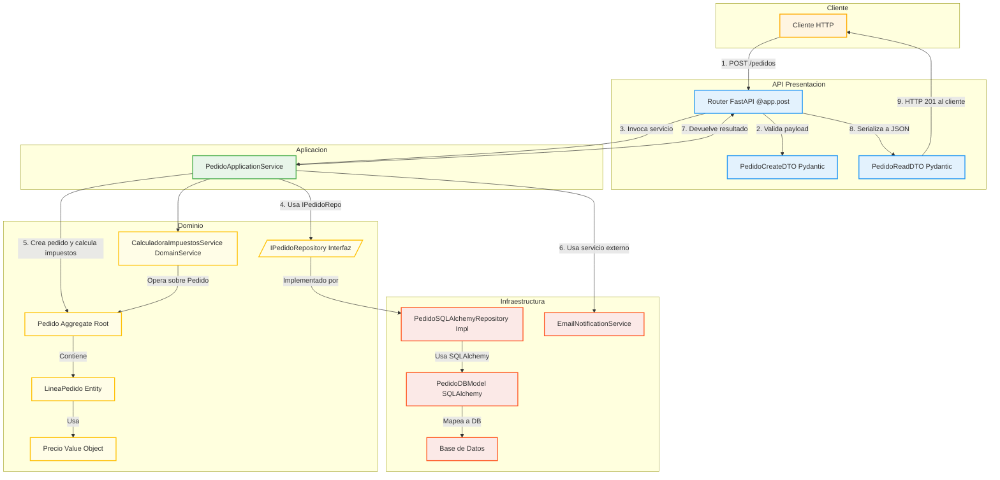

**Pasos del Flujo:**

1. Un **Cliente HTTP** envía una solicitud (ej. `POST /pedidos` con un payload JSON).
2. El **Router de FastAPI** recibe la solicitud. Valida el payload utilizando un modelo Pydantic (`PedidoCreateDTO`).
3. El _path operation function_ del router invoca un método en un **Servicio de Aplicación** (`PedidoApplicationService`), a menudo obtenido mediante inyección de dependencias.
4. El **Servicio de Aplicación** orquesta el caso de uso:
   * Puede transformar el DTO en objetos de dominio (o parámetros para crear Agregados).
   * Utiliza la **interfaz del Repositorio** (`IPedidoRepository`) para cargar Agregados existentes o preparar la persistencia de nuevos.
   * Invoca métodos en los **Agregados** (ej. `pedido.agregar_linea(...)`) o utiliza **Servicios de Dominio** (ej. `CalculadoraImpuestosService.calcular(pedido)`).
   * La lógica dentro de los Agregados y Servicios de Dominio puede involucrar otras Entidades y Value Objects.
5. La **Implementación del Repositorio** (en la capa de infraestructura) se encarga de la interacción real con la base de datos, posiblemente usando un ORM como SQLAlchemy y modelos de base de datos específicos.
6. El Servicio de Aplicación también podría interactuar con otros servicios de infraestructura (ej. para enviar un email de confirmación).
7. El Servicio de Aplicación devuelve un resultado (a menudo el Agregado modificado/creado, o un DTO específico de la aplicación).
8. El Router de FastAPI toma este resultado y lo serializa a una respuesta JSON usando un modelo Pydantic (`PedidoReadDTO`).
9. La **Respuesta HTTP** se envía de vuelta al cliente.

***

#### Pydantic en Profundidad para DDD

* **Value Objects con Pydantic:**
  * Define un modelo Pydantic.
  * Usa `model_config = {'frozen': True}` para asegurar la inmutabilidad (una vez creado, no puede cambiar).
  * Aprovecha los validadores de Pydantic (`@validator` o `field_validator` en V2) para aplicar reglas de negocio intrínsecas al Value Object.
  * Pydantic maneja la igualdad estructural por defecto, lo cual es coherente con la naturaleza de los Value Objects.

```python
from pydantic import BaseModel, field_validator, ConfigDict

    class Dinero(BaseModel):
        model_config = ConfigDict(frozen=True) # Inmutable

        cantidad: float
        divisa: str

        @field_validator('cantidad')
        @classmethod
        def no_negativo(cls, v: float) -> float:
            if v < 0:
                raise ValueError("La cantidad no puede ser negativa")
            return v

        @field_validator('divisa')
        @classmethod
        def divisa_valida(cls, v: str) -> str:
            if len(v) != 3 or not v.isupper():
                raise ValueError("La divisa debe ser un código ISO de 3 letras mayúsculas")
            return v.upper()
```

* **Entidades y Pydantic:**
  * Puedes usar un modelo Pydantic para definir los atributos y sus validaciones de una Entidad.
  * La **identidad** de la Entidad (su ID único) es un atributo clave.
  * El **ciclo de vida** (creación, modificación, borrado) y los comportamientos que cambian el estado son métodos de la clase Entidad, no gestionados directamente por Pydantic (aunque Pydantic valida el estado resultante).
  * Las Entidades son mutables por naturaleza (su estado cambia, pero su identidad no).
* **DTOs vs. Objetos de Dominio:**
  * Es crucial mantener una distinción clara. Los DTOs (definidos con Pydantic en la capa `api/schemas/`) están diseñados para la comunicación externa y la validación de entrada/salida.
  * Los objetos de dominio (Entidades, Value Objects) encapsulan la lógica de negocio.
  * El mapeo entre DTOs y objetos de dominio ocurre típicamente en los límites de la Capa de Aplicación. Un Servicio de Aplicación recibe un DTO, lo usa para crear o actualizar objetos de dominio, y luego puede mapear estos objetos de dominio a DTOs de respuesta.

***

#### Inyección de Dependencias en FastAPI para Componentes DDD

FastAPI (`Depends`) simplifica enormemente la conexión de las capas:

* **Repositorios en Servicios de Aplicación:**

```python
# infrastructure/persistence/database.py
    def get_db_session(): ...
    def get_pedido_repository(session: Session = Depends(get_db_session)):
        return PedidoSQLAlchemyRepository(session)

    # application/services/pedido_service.py
    class PedidoApplicationService:
        def __init__(self, repo: IPedidoRepository): # La interfaz
            self.pedido_repository = repo

    # api/endpoints/pedidos_router.py
    @router.post("/", response_model=PedidoReadDTO)
    def crear_pedido_endpoint(
        pedido_data: PedidoCreateDTO,
        repo: IPedidoRepository = Depends(get_pedido_repository) # Inyecta implementación
    ):
        app_service = PedidoApplicationService(repo)
        # ... llamar a app_service ...
```

(Una forma más avanzada es inyectar el `PedidoApplicationService` directamente si también se define como una dependencia).

***

#### Manejo de Excepciones del Dominio

* Las reglas de negocio en tu dominio (Entidades, Servicios de Dominio) pueden lanzar excepciones personalizadas (ej. `StockInsuficienteError`, `ReglaDeNegocioVioladaError`).
* Estas excepciones deben ser capturadas:
  * Por el **Servicio de Aplicación** para realizar alguna acción compensatoria o lógica específica del caso de uso.
  * O, si no son manejadas por el Servicio de Aplicación, pueden ser capturadas por **manejadores de excepciones globales de FastAPI** (`@app.exception_handler`) para traducirlas en respuestas HTTP apropiadas (ej. un `ReglaDeNegocioVioladaError` podría ser un `400 Bad Request` o `409 Conflict`).

***

**Ventajas de esta Integración:**

* **Claridad y Separación de Responsabilidades:** Cada capa y componente tiene un propósito bien definido.
* **Testeabilidad:** Puedes probar la lógica de dominio de forma aislada (usando repositorios falsos), los servicios de aplicación, y los endpoints de FastAPI independientemente.
* **Mantenibilidad y Escalabilidad:** Los cambios en una capa (ej. cambiar la base de datos) tienen un impacto mínimo en las otras.
* **Alineación con el Negocio:** El foco en el dominio asegura que el software resuelva los problemas de negocio reales.

***

**Conclusión:**

FastAPI, con su moderno sistema de tipos basado en Pydantic y su potente inyección de dependencias, es un aliado formidable para implementar los patrones de Domain-Driven Design. Permite construir APIs que no solo son rápidas y fáciles de desarrollar, sino también robustas, bien estructuradas y alineadas con la complejidad del dominio de negocio. Esta integración os proporcionará una base sólida para vuestros proyectos.

***

### 7.7 Creación de factories para entidades complejas

Cuando nuestras Entidades y, especialmente, nuestros Agregados se vuelven complejos, su proceso de creación puede implicar múltiples pasos, validaciones y la necesidad de asegurar que se cumplan todas las invariantes desde el momento de la instanciación. Simplemente usar un constructor puede llevar a constructores sobrecargados o a que el código cliente se vea obligado a conocer demasiados detalles internos de la creación. Aquí es donde el patrón **Fábrica (Factory)** en DDD nos ofrece una solución elegante y robusta.

***

#### ¿Qué es una Fábrica (Factory) en DDD?

En el contexto de Domain-Driven Design, una **Fábrica** es un objeto o método cuya principal responsabilidad es **encapsular la lógica de creación de otros objetos**, típicamente Entidades complejas o Raíces de Agregado.

**Propósito Fundamental:**

* **Simplificar la Creación para el Cliente:** El código que necesita una instancia del objeto complejo (el "cliente" de la fábrica) no necesita conocer los detalles intrincados de su construcción.
* **Asegurar la Validez y Consistencia:** Garantiza que los objetos se creen en un estado válido, cumpliendo todas sus invariantes (reglas de negocio que deben ser verdaderas en todo momento).
* **Ocultar Lógica de Construcción Compleja:** Si crear un Agregado implica instanciar múltiples Entidades internas, establecer relaciones, realizar cálculos iniciales o consultar otros servicios o repositorios, la Fábrica maneja esta complejidad.
* **Desacoplar el Cliente de la Creación Concreta:** El cliente se desacopla de las clases concretas y de los detalles de su instanciación.

***

#### ¿Por Qué Utilizar Fábricas?

Deberías considerar el uso de Fábricas cuando te enfrentas a alguna de las siguientes situaciones:

1. **Construcción Compleja:** La creación de un objeto no es una simple asignación de parámetros a un constructor. Implica:
   * Múltiples pasos.
   * Lógica condicional.
   * Creación y ensamblaje de objetos internos (ej. Entidades dentro de un Agregado).
   * Necesidad de obtener datos de otras fuentes (ej. otros Agregados, Servicios de Dominio) para completar la creación.
2. **Protección de Invariantes Críticas:** Es vital que el Agregado sea válido desde su nacimiento. Una Fábrica puede asegurar que todas las reglas se cumplan antes de devolver el objeto.
   * Por ejemplo, un Agregado `Pedido` no puede crearse sin un `ClienteId` válido o sin al menos una `LineaDePedido`.
3. **Abstracción de la Representación de Origen:** A veces, necesitas crear un objeto de dominio a partir de diferentes representaciones de datos (ej. un DTO de una solicitud API, datos crudos de una base de datos, un evento). Una Fábrica puede manejar esta traducción.
4. **Simplificación de la Interfaz de Creación:** En lugar de un constructor con muchos parámetros (algunos quizás opcionales o interdependientes), la Fábrica puede ofrecer métodos con nombres más descriptivos y parámetros más manejables.

***

#### Tipos de Fábricas en DDD

Existen principalmente dos formas de implementar Fábricas en DDD:

1. **Métodos Fábrica (Factory Methods):**
   * Son métodos (a menudo estáticos, pero no siempre) que residen dentro de una clase existente, típicamente la Raíz del Agregado que se va a crear o una Entidad estrechamente relacionada.
   * **Ejemplo:** Una clase `PedidoAggregate` podría tener un método estático `PedidoAggregate.crearNuevoPedido(clienteId: UUID, detallesItems: List[ItemData]) -> PedidoAggregate`.
   * Son adecuados cuando la lógica de creación no es excesivamente compleja y está íntimamente ligada al objeto que se crea.
2. **Clases Fábrica Dedicadas (Dedicated Factory Classes):**
   * Son clases separadas cuya única responsabilidad es crear instancias de un tipo específico de Entidad o Agregado.
   * **Ejemplo:** Una clase `PedidoFactory` con un método `crearPedidoDesdeSolicitud(solicitud: PedidoCreateDTO, clienteRepo: IClienteRepository) -> PedidoAggregate`.
   * Son preferibles cuando:
     * La lógica de creación es muy compleja e involucra múltiples dependencias (otros Repositorios, Servicios de Dominio).
     * Se quieren separar claramente las responsabilidades (la clase Agregado se enfoca en su comportamiento una vez creado; la Fábrica se enfoca en el proceso de creación).
     * Se necesita inyectar dependencias en el proceso de creación (como Repositorios).

***

#### Principios de Diseño de Fábricas DDD

* **Creación Atómica:** La Fábrica debe devolver un objeto completamente formado y válido, o fallar (ej. lanzando una excepción) si no puede cumplir con todas las invariantes. No debe dejar objetos en un estado parcialmente construido o inválido.
* **Encapsulación del Conocimiento de Construcción:** Toda la lógica y el conocimiento necesarios para crear el objeto residen dentro de la Fábrica.
* **Interfaz Clara y Significativa:** Los métodos de la Fábrica deben tener nombres que indiquen claramente qué tipo de objeto se está creando y bajo qué condiciones o a partir de qué datos.
* **Dependencias (Manejo Cuidadoso):**
  * Una Fábrica puede necesitar acceder a Repositorios para obtener Entidades existentes (ej. para validar un `ClienteId` o para obtener datos de un `Producto` al crear una `LineaDePedido`).
  * Puede usar Servicios de Dominio si parte de la lógica de creación implica un proceso de negocio complejo.
  * Sin embargo, estas dependencias deben manejarse con cuidado para no acoplar excesivamente la Fábrica. A menudo, se inyectan en la Fábrica (si es una clase dedicada) o se pasan como parámetros a sus métodos.

***

#### Fábricas en Acción: Creando un Agregado `Pedido`

Imaginemos que crear un Agregado `Pedido` es complejo: implica validar al cliente, verificar el stock de productos, crear líneas de pedido y calcular un total inicial. Una `PedidoFactory` dedicada podría verse así:

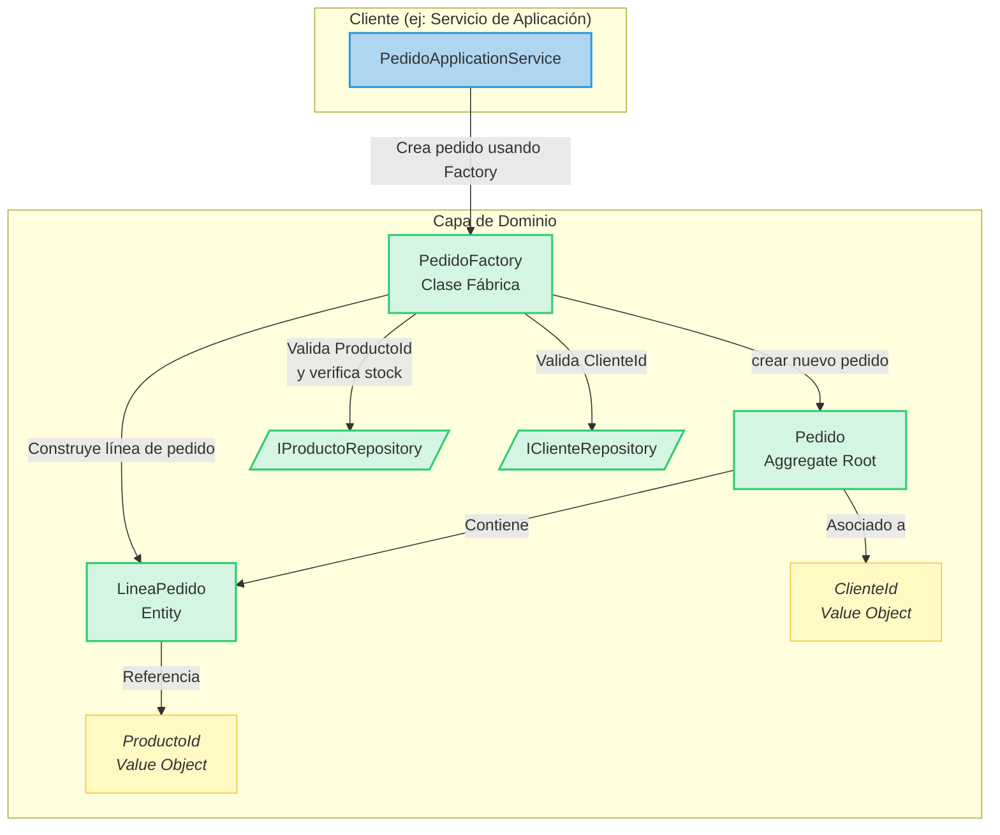

**Explicación del Diagrama:**

1. El `PedidoApplicationService` desea crear un nuevo pedido. En lugar de hacerlo directamente, invoca a `PedidoFactory.crearNuevoPedido(...)`.
2. La `PedidoFactory` recibe los datos necesarios (ej. `ClienteId`, una lista de ítems con `ProductoId` y cantidad).
3. La Fábrica puede usar `IClienteRepository` para validar que el `ClienteId` existe y es válido.
4. Para cada ítem, puede usar `IProductoRepository` para validar el `ProductoId`, obtener su precio, y quizás verificar el stock (o esta lógica podría estar en un Servicio de Dominio que la Fábrica use).
5. La Fábrica instancia las `LineaPedidoEntity` y luego el `PedidoAggregate` raíz, asegurando que todas las invariantes se cumplan (ej. que el total inicial sea correcto, que no haya líneas duplicadas, etc.).
6. Finalmente, la Fábrica devuelve el `PedidoAggregate` completamente formado y válido.

```python
# En domain/models/pedido.py
class PedidoAggregate:
    def __init__(self, id: UUID, cliente_id: ClienteId, lineas: List[LineaPedido], ...) -> None:
        self.id = id
        self.cliente_id = cliente_id
        self._lineas = lineas # Lista de LineaPedido (Entidades)
        # ... otros atributos e invariantes ...

# En domain/factories/pedido_factory.py
class PedidoFactory:
    def __init__(self, producto_repo: IProductoRepository, cliente_repo: IClienteRepository):
        self.producto_repo = producto_repo
        self.cliente_repo = cliente_repo

    def crear_nuevo_pedido(self, cliente_id_vo: ClienteId, items_data: List[Dict]) -> PedidoAggregate:
        # 1. Validar Cliente
        if not self.cliente_repo.existe(cliente_id_vo):
            raise ClienteNotFoundError(f"Cliente {cliente_id_vo} no encontrado.")

        lineas_pedido = []
        for item in items_data:
            producto_id_vo = ProductoId(item['producto_id'])
            producto = self.producto_repo.findById(producto_id_vo)
            if not producto:
                raise ProductoNotFoundError(f"Producto {producto_id_vo} no encontrado.")
            
            # Podría haber más lógica aquí: verificar stock, obtener precio actualizado, etc.
            # Aquí se crearían las LineaPedido Entities
            linea = LineaPedido(producto_id=producto.id, cantidad=item['cantidad'], precio_unitario=producto.precio)
            lineas_pedido.append(linea)

        # 2. Crear el Agregado Pedido asegurando sus invariantes
        # El constructor del PedidoAggregate podría ser simple si la fábrica hace el trabajo pesado,
        # o podría tener validaciones internas que la fábrica debe satisfacer.
        nuevo_pedido_id = uuid.uuid4()
        pedido = PedidoAggregate(id=nuevo_pedido_id, cliente_id=cliente_id_vo, lineas=lineas_pedido)
        
        # Aquí se podrían disparar eventos de dominio como PedidoCreadoEvent
        return pedido
```

***

#### Fábricas vs. Constructores

* **Constructores Simples:** Si la creación de un objeto es sencilla, no tiene lógica compleja, no requiere dependencias externas y las invariantes son fáciles de asegurar con los parámetros del constructor, un constructor es suficiente.
* **Fábricas para Complejidad:** Cuando la creación se vuelve compleja (como se describió antes), las Fábricas son la mejor opción para mantener la cohesión y la claridad. Mueven la responsabilidad de la creación fuera del propio objeto o del cliente.

***

#### Fábricas y la Reconstitución desde Persistencia

Los **Repositorios**, cuando recuperan datos de la persistencia (ej. una base de datos) y crean (o "reconstituyen") los Agregados de dominio, actúan efectivamente como un tipo de Fábrica. Toman datos en un formato (ej. filas de una tabla SQL) y los transforman en objetos de dominio válidos. Este proceso de reconstitución debe también asegurar que los Agregados se carguen en un estado consistente.

***

#### Integración con FastAPI y Pydantic

* Los datos de un DTO Pydantic, validados por FastAPI en un _endpoint_, son una entrada ideal para un método de una Fábrica.

```python
# api/endpoints/pedidos_router.py
    @router.post("/", response_model=PedidoReadDTO)
    def crear_pedido_endpoint(
        pedido_data: PedidoCreateDTO, # DTO de Pydantic
        pedido_factory: PedidoFactory = Depends(get_pedido_factory) # Inyectar la fábrica
    ):
        # El PedidoApplicationService usaría la pedido_factory
        # pasándole datos del pedido_data
        # nuevo_pedido = app_service.crear_pedido(pedido_data.cliente_id, pedido_data.items)
        # return nuevo_pedido 
        pass # Implementación con Servicio de Aplicación omitida por brevedad
```

* La Fábrica se encarga de la lógica de negocio para traducir ese DTO (que es un contenedor de datos) en un Agregado de dominio rico en comportamiento y completamente válido.

***

**Conclusión:**

Las Fábricas son un patrón táctico de DDD invaluable para gestionar la creación de Entidades y Agregados complejos. Al encapsular la lógica de construcción, protegen las invariantes del dominio, simplifican el código cliente y mejoran la cohesión general del modelo. En el contexto de aplicaciones FastAPI, permiten una transición limpia desde los DTOs de Pydantic (datos de entrada) hacia los objetos de dominio con estado y comportamiento.

**Ejemplo Conceptual de Código (Python):**

### 7.8 Desarrollo de Ubiquitous Language

En el corazón de Domain-Driven Design yace un concepto aparentemente simple pero profundamente poderoso: el **Lenguaje Ubicuo (Ubiquitous Language)**. No es solo una colección de términos de negocio, sino el fundamento sobre el cual se construye un entendimiento compartido y un modelo de dominio preciso. Su correcto desarrollo y aplicación son cruciales para el éxito de cualquier proyecto que aspire a reflejar fielmente la complejidad del negocio, incluyendo vuestras aplicaciones FastAPI.

***

#### ¿Qué es el Lenguaje Ubicuo?

El Lenguaje Ubicuo es un **lenguaje compartido, riguroso y deliberadamente estructurado**, desarrollado colaborativamente por todo el equipo involucrado en el proyecto:

* **Desarrolladores**
* **Expertos del Dominio** (usuarios clave, analistas de negocio, stakeholders)
* **Product Owners**
* **QA Testers**
* Cualquier otra persona que participe en la definición y construcción del software.

Este lenguaje se utiliza para describir todos los aspectos del dominio del software. Su característica principal es, como su nombre indica, su **ubicuidad**: debe permear _todos_ los artefactos y comunicaciones del proyecto.

**Principios Clave:**

1. **Compartido y Acordado:** No es impuesto por un grupo, sino co-creado y aceptado por todos.
2. **Preciso y Sin Ambigüedades:** Cada término tiene una definición clara y única dentro de su contexto. Se eliminan sinónimos confusos y se aclaran los homónimos.
3. **Evolutivo:** El lenguaje no es estático. Crece, se refina y se adapta a medida que el equipo profundiza su comprensión del dominio.
4. **Directamente Reflejado en el Código:** Este es el aspecto más crítico para los desarrolladores. Los nombres de clases, métodos, variables, módulos, e incluso los esquemas de Pydantic en FastAPI, deben derivar directamente del Lenguaje Ubicuo.

***

#### La Importancia de ser "Ubicuo"

Que el lenguaje sea ubicuo significa que no hay "traducción" entre cómo habla el negocio y cómo se estructura el código. Esto conlleva beneficios inmensos:

* **Reduce Drásticamente la Ambigüedad:** Elimina la clásica brecha de comunicación donde los desarrolladores interpretan de una manera lo que los expertos del dominio expresan de otra. Si todos usan los mismos términos con el mismo significado, los malentendidos disminuyen.
* **Conecta el Software con la Realidad del Negocio:** El código se convierte en una expresión directa del modelo de dominio. Al leer el código, se debería poder entender la lógica y los conceptos del negocio.
* **Mejora la Colaboración y Eficiencia:** Las conversaciones son más fluidas, las especificaciones más claras y el desarrollo más ágil porque todos parten de una base común.
* **Impulsa el Descubrimiento y Refinamiento del Modelo:** El propio proceso de forjar el Lenguaje Ubicuo obliga al equipo a discutir, cuestionar y profundizar en los conceptos del dominio. Esto a menudo revela aspectos ocultos o mal entendidos del modelo, llevando a un diseño más robusto.
* **Facilita el Mantenimiento y la Incorporación:** Nuevo personal (tanto técnico como de negocio) puede entender el sistema más rápidamente si el código y la documentación hablan el lenguaje del dominio.

***

#### Proceso de Desarrollo y Cultivo del Lenguaje Ubicuo

Desarrollar un Lenguaje Ubicuo es un proceso continuo y colaborativo, no un evento único.

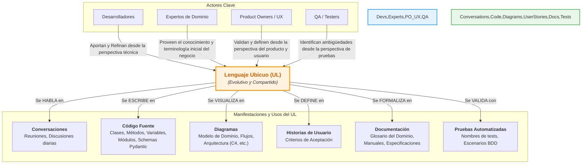

**Pasos y Prácticas para Cultivar el Lenguaje Ubicuo:**

1. **Colaboración Intensiva:** Organizar sesiones regulares (talleres, reuniones) donde desarrolladores y expertos del dominio trabajen juntos.
2. **Escucha Activa:** Los desarrolladores deben escuchar atentamente cómo los expertos describen el dominio, sus procesos, entidades y reglas.
3. **Cuestionar y Aclarar:** No asumir significados. Preguntar constantemente "Cuando dices X, ¿te refieres a Y o Z?", "¿Cuál es la diferencia entre A y B?". Esto ayuda a descubrir matices.
4. **Modelado Conjunto:** Dibujar diagramas simples en una pizarra o herramienta digital mientras se discuten los conceptos ayuda a visualizar y solidificar el lenguaje.
5. **Crear un Glosario del Dominio:** Mantener un documento vivo y accesible (wiki, Notion, Confluence, etc.) donde se definan los términos clave del Lenguaje Ubicuo, sus significados, reglas asociadas y ejemplos. Este glosario es especialmente útil en dominios complejos o con múltiples Bounded Contexts.
6. **Reflejarlo en el Código Inmediatamente:**
   * Nombres de clases, interfaces, enums.
   * Nombres de métodos y funciones.
   * Nombres de variables y parámetros.
   * Nombres de módulos y paquetes.
   * En FastAPI, esto se extiende a los nombres de los _path operations_, los modelos Pydantic para DTOs, y los atributos dentro de esos modelos.
7. **Ser Consistente:** Una vez que se acuerda un término, usarlo consistentemente en todas partes. Evitar sinónimos no autorizados.
8. **Refactorizar hacia un Lenguaje Más Profundo:** A medida que el equipo aprende más sobre el dominio, pueden surgir términos más precisos o se pueden descubrir ambigüedades. No hay que temer refactorizar el código (renombrar clases, métodos) para alinearlo con esta comprensión más profunda.
9. **Utilizar Técnicas de Descubrimiento:**
   * **Event Storming:** Un taller colaborativo muy visual que ayuda a descubrir eventos de dominio, comandos, políticas y, crucialmente, el lenguaje que los rodea. Es excelente para identificar los límites de los Bounded Contexts y el lenguaje específico de cada uno.
   * **Domain Storytelling:** Una técnica que utiliza pictogramas y narrativas para explorar los procesos de negocio y el lenguaje utilizado por los actores del dominio.

***

#### El Lenguaje Ubicuo en el Código: Ejemplos Prácticos

* Si en el dominio de seguros se habla de una "Póliza de Vida Universal Indexada", la clase no debería llamarse `SeguroTipoA` o `RecordPolizaAvanzada`, sino algo como `PolizaVidaUniversalIndexada` o `IndexedUniversalLifePolicy`.
* Si el proceso de negocio es "Validar Siniestro por Fraude", el método correspondiente podría ser `validar_siniestro_por_fraude(siniestro: Siniestro) -> ResultadoValidacionFraude`.
* En FastAPI, un endpoint para registrar un nuevo "Suscriptor" a un "Boletín Informativo" podría ser:

```python
from pydantic import BaseModel, EmailStr

    class SolicitudSuscripcionBoletin(BaseModel):
        email_suscriptor: EmailStr
        nombre_boletin: str

    @app.post("/suscripciones-boletin/")
    async def registrar_suscripcion_boletin(solicitud: SolicitudSuscripcionBoletin):
        # Lógica usando términos del UL: "suscriptor", "boletín"
        pass
```

***

#### Relación Indisoluble con los Bounded Contexts

Es fundamental recordar (como vimos en 7.3) que el **Lenguaje Ubicuo es específico de un Bounded Context**.

* Dentro de un Bounded Context, el lenguaje es consistente y unívoco.
* Un mismo término puede tener un significado completamente diferente (o no existir) en otro Bounded Context. Por ejemplo, "Cuenta" puede significar "Cuenta de Usuario" en un contexto de Identidad, y "Cuenta Bancaria" en un contexto de Pagos.
* El Mapa de Contextos ayuda a visualizar estas diferencias y las relaciones de traducción necesarias si los contextos deben interactuar.

***

#### Desafíos Comunes en el Desarrollo del Lenguaje Ubicuo

* **Superar la "Maldición del Conocimiento":** Tanto los expertos de dominio (que asumen que todos entienden su jerga) como los desarrolladores (que pueden tender a usar términos técnicos) deben esforzarse por encontrar un terreno común.
* **Inercia y Resistencia al Cambio:** Cambiar terminología establecida puede ser difícil, pero es necesario si los términos antiguos son imprecisos o confusos.
* **Mantener la Consistencia y el Compromiso:** Requiere disciplina y esfuerzo continuo de todo el equipo.
* **Sobrecarga de Sinónimos/Homónimos:** Identificar y resolver estos casos, especialmente al definir Bounded Contexts.
* **"Traductores":** Evitar la situación donde una persona (o un pequeño grupo) actúa como "traductor" entre el negocio y los desarrolladores. El objetivo es que todos hablen el mismo idioma.

***

**Conclusión:**

El desarrollo y mantenimiento de un Lenguaje Ubicuo es una inversión, no un costo. Es la base para construir software que no solo funciona, sino que también es comprensible, mantenible y verdaderamente alineado con las necesidades y la realidad del negocio. Para los profesionales que desarrollan aplicaciones FastAPI con un enfoque DDD, dominar el arte de cultivar este lenguaje es una habilidad esencial que diferenciará la calidad y la longevidad de sus soluciones.

### 7.9 Capa de aplicación sobre la lógica de dominio

En una arquitectura DDD bien estructurada, la **Capa de Aplicación (Application Layer)** actúa como un director de orquesta. No toca los instrumentos (es decir, no contiene la lógica de negocio en sí misma), pero dirige a los músicos (los objetos de dominio) para interpretar una melodía completa (un caso de uso de la aplicación). Esta capa es esencial para mantener el Modelo de Dominio puro y enfocado, y para exponer de manera clara las capacidades del software.

***

#### ¿Qué es la Capa de Aplicación?

La Capa de Aplicación es la capa de software que **define los trabajos que el software debe realizar y dirige los objetos de dominio para que resuelvan los problemas**. En esencia, implementa y orquesta los **casos de uso** del sistema.

**Características Principales:**

* **Delgada (Thin):** Idealmente, no contiene lógica de negocio. Esa lógica reside en la Capa de Dominio (Agregados, Entidades, Value Objects y Servicios de Dominio).
* **Orquestadora:** Su principal tarea es coordinar las acciones. Obtiene los objetos de dominio necesarios (a través de Repositorios), invoca sus métodos y/o utiliza Servicios de Dominio, y luego persiste los resultados.
* **Intermediaria:** Se sitúa entre la Capa de Presentación (ej. los endpoints de vuestra API FastAPI) y la Capa de Dominio.

Los componentes principales de la Capa de Aplicación suelen ser los **Servicios de Aplicación (Application Services)**.

***

#### Responsabilidades Clave de la Capa de Aplicación

Los Servicios de Aplicación tienen responsabilidades bien definidas:

1. **Orquestación de Casos de Uso:**
   * Cada método público de un Servicio de Aplicación típicamente corresponde a un caso de uso o una funcionalidad específica que el sistema ofrece (ej. "Crear un Pedido", "Registrar un Usuario", "Actualizar Perfil de Cliente").
   * Controla el flujo de la operación, decidiendo qué objetos de dominio y qué repositorios se necesitan y en qué orden.
2. **Gestión de Transacciones:**
   * Es responsable de delimitar las unidades de trabajo transaccionales. Inicia una transacción al comienzo de un caso de uso y la confirma (commit) al final si todo ha ido bien, o la deshace (rollback) en caso de error. Esto asegura la atomicidad de las operaciones de negocio que pueden implicar cambios en múltiples Agregados.
3. **Coordinación del Acceso a Datos:**
   * Utiliza las interfaces de los Repositorios (definidas en la Capa de Dominio) para recuperar Agregados y para persistir los cambios realizados en ellos.
4. **Mapeo de Datos (DTOs <-> Dominio):**
   * Recibe datos de la Capa de Presentación, a menudo en forma de Data Transfer Objects (DTOs) – por ejemplo, modelos Pydantic validados por FastAPI.
   * Traduce estos DTOs a parámetros o comandos que la Capa de Dominio entiende (ej. para crear o actualizar Agregados).
   * Toma los resultados de la Capa de Dominio (Agregados, Value Objects, o valores simples) y los mapea a DTOs que la Capa de Presentación puede consumir.
5. **Coordinación de Seguridad (Autorización):**
   * Puede verificar si el usuario actual tiene los permisos necesarios para ejecutar un caso de uso particular. La autenticación (quién es el usuario) suele manejarse en la Capa de Presentación o en un middleware.
6. **Coordinación de Notificaciones y Publicación de Eventos:**
   * Después de completar un caso de uso, puede ser responsable de disparar notificaciones (ej. enviar un email) o de publicar Eventos de Dominio (si estos no se publican directamente desde los Agregados) para que otros sistemas o partes de la aplicación puedan reaccionar.

***

#### Lo que la Capa de Aplicación NO Hace

Es crucial entender qué _no_ es responsabilidad de la Capa de Aplicación para mantener las fronteras claras:

* **NO contiene lógica de negocio ni reglas de dominio:** Toda la lógica intrínseca al problema de negocio reside en la Capa de Dominio. Si un Servicio de Aplicación empieza a tomar decisiones basadas en el estado de los objetos de dominio o a implementar reglas, esa lógica probablemente debería moverse a un Agregado o a un Servicio de Dominio.
* **NO maneja detalles de la interfaz de usuario o de la API HTTP:** No se preocupa por cómo se presentan los datos, el formato JSON, los códigos de estado HTTP, etc. Eso es tarea de la Capa de Presentación (FastAPI y sus routers en vuestro caso).
* **NO interactúa directamente con la base de datos con SQL crudo (generalmente):** Accede a la persistencia a través de las abstracciones de los Repositorios.

***

#### Diseño de Servicios de Aplicación

* **Granularidad:** A menudo se diseña un Servicio de Aplicación por cada conjunto de casos de uso relacionados o por cada tipo principal de Agregado que gestiona (ej. `PedidoApplicationService`, `UsuarioApplicationService`).
* **Nomenclatura de Métodos:** Los nombres de los métodos deben ser imperativos y describir claramente el caso de uso (ej. `crear_pedido`, `confirmar_entrega_pedido`).
* **Estado:** Los Servicios de Aplicación son típicamente sin estado. Cualquier estado necesario se obtiene de los Repositorios o se pasa como parámetro.

***

#### Interacciones y Flujo de Trabajo

El siguiente diagrama ilustra cómo un Servicio de Aplicación orquesta un caso de uso típico:

```mermaid
graph TD
    subgraph "Capa de Presentación (FastAPI API)"
        Client["Cliente HTTP"]
        APIEndpoint["Endpoint FastAPI<br><i>(ej: POST /ordenes)</i>"]
        RequestDTO["SolicitudCrearOrdenDTO<br>(Pydantic)"]
        ResponseDTO["ConfirmacionOrdenDTO<br>(Pydantic)"]
    end

    subgraph "Capa de Aplicación"
        AppService["OrdenApplicationService"]
    end

    subgraph "Capa de Dominio"
        OrdenRepo[/"IOrdenRepository (Interfaz)"/]
        ClienteRepo[/"IClienteRepository (Interfaz)"/]
        ProductoRepo[/"IProductoRepository (Interfaz)"/]
        Orden[("Orden (Aggregate Root)")]
        ServicioValidacionStock[("ServicioValidacionStock (Domain Service)")]
        EventoOrdenCreada[("OrdenCreadaEvent")]
    end

    subgraph "Capa de Infraestructura"
        OrdenRepoImpl["OrdenRepositoryImpl"]
        UoW["UnitOfWork / Gestor de Transacciones"]
        ServicioNotificacion[("ServicioNotificacionEmailImpl")]
        MessageBus[("Bus de Mensajes / Eventos")]
        DB[(Base de Datos)]
    end

    Client -- "1. HTTP Request (JSON)" --> APIEndpoint
    APIEndpoint -- "2. Valida y pasa RequestDTO" --> AppService

    AppService -- "3. Inicia Transacción (UoW)" --> UoW
    AppService -- "4. Carga datos necesarios<br>(ej: Cliente desde ClienteRepo,<br>Productos desde ProductoRepo)" --> ClienteRepo
    AppService -- " " --> ProductoRepo
    AppService -- "5. Usa Servicio de Dominio<br>(ej: para validar stock)" --> ServicioValidacionStock
    AppService -- "6. Crea/Modifica Agregado Orden" --> Orden
    Orden -- "Puede generar" --> EventoOrdenCreada
    AppService -- "7. Persiste Agregado Orden<br>(vía IOrdenRepository)" --> OrdenRepo
    OrdenRepo -- "Implementado por" --> OrdenRepoImpl
    OrdenRepoImpl -- "Accede a" --> DB
    
    AppService -- "8. Publica Evento de Dominio<br>(opcionalmente, si no lo hace el Agregado)" --> MessageBus
    MessageBus -- "Distribuye" --> EventoOrdenCreada

    AppService -- "9. Envía Notificación Externa<br>(ej: email de confirmación)" --> ServicioNotificacion
    AppService -- "10. Confirma Transacción (UoW)" --> UoW
    AppService -- "11. Mapea resultado a ResponseDTO" --> ResponseDTO
    ResponseDTO -- "12. HTTP Response (JSON)" --> APIEndpoint
    APIEndpoint -- " " --> Client


    classDef presentation fill:#E3F2FD,stroke:#2196F3,stroke-width:2px;
    classDef application fill:#E8F5E9,stroke:#4CAF50,stroke-width:2px;
    classDef domain fill:#FFFDE7,stroke:#FFC107,stroke-width:2px;
    classDef infrastructure fill:#FBE9E7,stroke:#FF5722,stroke-width:2px;

    class Client, APIEndpoint, RequestDTO, ResponseDTO presentation;
    class AppService application;
    class OrdenRepo, ClienteRepo, ProductoRepo, Orden, ServicioValidacionStock, EventoOrdenCreada domain;
    class OrdenRepoImpl, UoW, ServicioNotificacion, MessageBus, DB infrastructure;
```

**Flujo Detallado:**

1. El **Cliente** envía una solicitud a un **Endpoint de FastAPI**.
2. FastAPI valida los datos de entrada contra un **DTO Pydantic** (`RequestDTO`) y llama al método correspondiente del **Servicio de Aplicación** (`AppService`), a menudo inyectado.
3. El `AppService` **inicia una transacción** (utilizando un `UnitOfWork` o un gestor de transacciones).
4. Carga los Agregados o datos necesarios de la Capa de Dominio utilizando **Repositorios** (ej. `ClienteRepo`, `ProductoRepo`).
5. Puede invocar **Servicios de Dominio** para lógica de negocio compleja que involucra múltiples objetos (ej. `ServicioValidacionStock`).
6. Invoca métodos en los **Agregados** para ejecutar la lógica de negocio principal (ej. `Orden.agregar_linea(...)`, `Orden.confirmar_pago(...)`). El Agregado puede generar Eventos de Dominio internamente.
7. Utiliza el **Repositorio** del Agregado principal para persistir los cambios (ej. `OrdenRepo.guardar(orden)`).
8. Opcionalmente, publica los **Eventos de Dominio** generados a un bus de mensajes.
9. Puede invocar servicios de infraestructura para tareas colaterales como enviar **notificaciones**.
10. Si todas las operaciones son exitosas, el `AppService` **confirma la transacción**. En caso de error, la deshace.
11. Mapea el resultado (si lo hay) a un **DTO de respuesta** (`ResponseDTO`).
12. El DTO de respuesta se devuelve a FastAPI, que lo serializa y envía la **respuesta HTTP** al cliente.

***

#### Implementación en un Contexto FastAPI

* **Clases Python Simples:** Los Servicios de Aplicación son generalmente clases Python simples.

```python
# application/services/orden_service.py
    from domain.repositories import IOrdenRepository, IClienteRepository # Interfaces
    from domain.models import Orden, ClienteId # Modelos de Dominio
    from .dtos import OrdenCreateDTO, OrdenViewDTO # DTOs específicos de la aplicación

    class OrdenApplicationService:
        def __init__(self, orden_repo: IOrdenRepository, cliente_repo: IClienteRepository):
            self.orden_repo = orden_repo
            self.cliente_repo = cliente_repo
            # Idealmente, aquí también se inyectaría un UnitOfWork

        def crear_nueva_orden(self, datos_orden: OrdenCreateDTO, usuario_actual_id: str) -> OrdenViewDTO:
            # Iniciar transacción (conceptual)
            # unit_of_work.begin()
            try:
                cliente_id = ClienteId(datos_orden.cliente_id)
                cliente = self.cliente_repo.findById(cliente_id)
                if not cliente:
                    raise ValueError("Cliente no encontrado") # O una excepción de dominio/aplicación

                # Aquí se usaría una Fábrica de Orden o la lógica de creación del Agregado Orden
                # Simplificación:
                nueva_orden = Orden.crear(cliente_id=cliente_id, items=datos_orden.items)
                
                # Lógica adicional, quizás invocar Servicio de Dominio
                # ej: servicio_descuento.aplicar_descuentos(nueva_orden, cliente)

                self.orden_repo.add(nueva_orden)
                # unit_of_work.commit()
                
                # Mapear a DTO de respuesta
                return OrdenViewDTO.from_domain(nueva_orden)
            except Exception as e:
                # unit_of_work.rollback()
                raise # Re-lanzar para manejo superior o logging
```

* **Inyección de Dependencias:** FastAPI facilita la inyección de las implementaciones de Repositorio (y otros servicios de infraestructura o dominio) en los constructores de los Servicios de Aplicación. Estos servicios, a su vez, pueden ser inyectados en los _path operation functions_ de FastAPI.

***

#### Beneficios de una Capa de Aplicación Bien Definida

* **Claridad en la Arquitectura:** Separa claramente las preocupaciones de la aplicación de la lógica de negocio central.
* **Dominio Puro:** Permite que la Capa de Dominio se mantenga libre de dependencias de infraestructura o de la lógica de orquestación de casos de uso.
* **Casos de Uso Explícitos:** Hace que las funcionalidades del sistema sean fáciles de identificar y entender.
* **Mayor Testeabilidad:**
  * Los Servicios de Aplicación se pueden probar unitariamente _mockeando_ los Repositorios y Servicios de Dominio.
  * La Capa de Dominio se puede probar de forma completamente aislada.
* **Reutilización:** La misma lógica de aplicación puede ser expuesta a través de diferentes interfaces (una API REST, una CLI, una aplicación de escritorio) sin duplicar código.

***

**Conclusión:**

La Capa de Aplicación es el pegamento que une la interfaz de usuario/API con la lógica de negocio subyacente. Al asumir la responsabilidad de orquestar los casos de uso, gestionar transacciones y coordinar la interacción con el dominio y la infraestructura, permite que el Modelo de Dominio se mantenga enfocado, puro y altamente cohesivo. En vuestras aplicaciones FastAPI, una Capa de Aplicación bien diseñada será fundamental para construir sistemas DDD robustos y mantenibles.

***

### 7.10 Refactorización de dominio en capas desacopladas

A lo largo de este tema, hemos explorado los bloques de construcción y los principios estratégicos de Domain-Driven Design. Sin embargo, aplicar estos conceptos a un sistema nuevo es una cosa, y refactorizar un sistema existente (o uno que ha crecido orgánicamente sin una arquitectura clara) hacia un diseño en capas desacopladas es otra. Este punto se centra en las estrategias y técnicas para llevar a cabo esta refactorización, transformando el código en una estructura más mantenible, testeable y alineada con el dominio.

***

#### La Motivación: ¿Por Qué Refactorizar hacia Capas Desacopladas?

Muchos sistemas, especialmente si no se diseñaron con una arquitectura clara desde el inicio, tienden a convertirse en lo que se conoce como una "Gran Bola de Barro" (Big Ball of Mud):

* **Lógica de negocio dispersa:** Reglas de negocio mezcladas en controladores de API, código de UI, o directamente en consultas a base de datos.
* **Acoplamiento Elevado:** Cambios en una parte del sistema provocan efectos inesperados en otras.
* **Baja Testeabilidad:** Dificultad para probar la lógica de negocio de forma aislada.
* **Difícil de Entender y Mantener:** Incorporar nuevos desarrolladores o añadir funcionalidades se vuelve una tarea ardua y propensa a errores.

Refactorizar hacia capas desacopladas, siguiendo los principios de DDD, busca solucionar estos problemas, ofreciendo:

* **Claridad:** La lógica de negocio se concentra en la capa de dominio.
* **Mantenibilidad:** Las capas bien definidas son más fáciles de entender y modificar.
* **Testeabilidad:** Cada capa puede ser probada de forma independiente.
* **Flexibilidad:** Permite cambiar implementaciones (ej. la base de datos) con menor impacto.
* **Alineación con el Negocio:** El dominio se convierte en el corazón explícito del sistema.

***

#### El Objetivo: Una Arquitectura en Capas Claras

El objetivo es evolucionar hacia una arquitectura donde las responsabilidades estén claramente separadas, típicamente en las capas que hemos discutido:

1. **Capa de Presentación (o API):** Interfaz con el usuario/cliente (ej. Endpoints FastAPI).
2. **Capa de Aplicación:** Orquesta los casos de uso (Servicios de Aplicación).
3. **Capa de Dominio:** Contiene la lógica de negocio (Agregados, Entidades, Value Objects, Servicios de Dominio, Interfaces de Repositorio).
4. **Capa de Infraestructura:** Implementaciones técnicas (persistencia, mensajería, servicios externos).

Visualicemos la transformación:

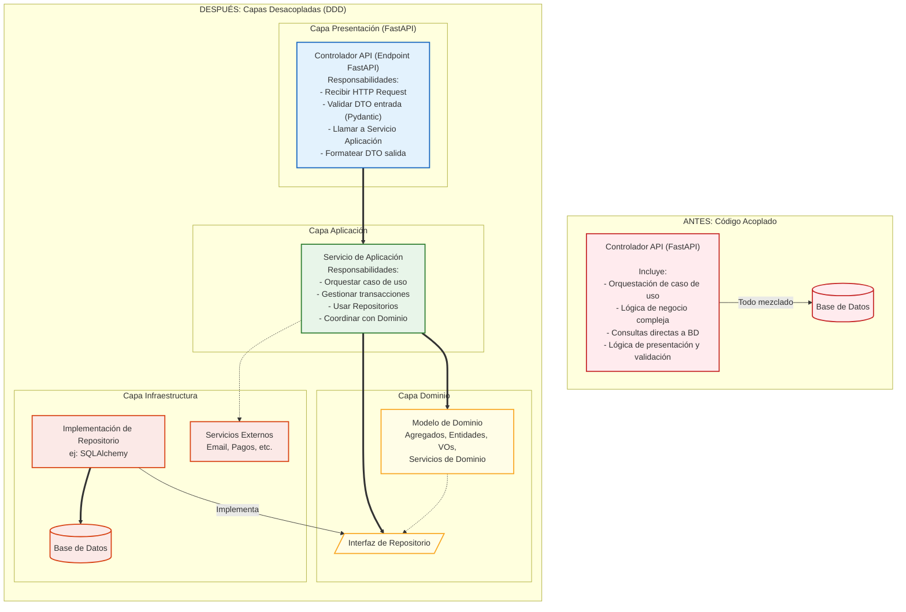

***

#### Principios Guía para la Refactorización

Al refactorizar, nos guiaremos por principios de diseño que promueven el desacoplamiento:

* **Principio de Responsabilidad Única (SRP):** Cada clase o módulo debe tener una única razón para cambiar. Esto ayuda a decidir qué lógica pertenece a qué capa.
* **Principio de Inversión de Dependencias (DIP):** Los módulos de alto nivel (Dominio, Aplicación) no deben depender de módulos de bajo nivel (Infraestructura). Ambos deben depender de abstracciones (interfaces). Las interfaces de Repositorio definidas en el Dominio son un ejemplo clave.
* **Cohesión Alta:** Los elementos dentro de una capa (o un módulo dentro de una capa) deben estar fuertemente relacionados y enfocados en una responsabilidad común.
* **Acoplamiento Bajo:** Las dependencias entre capas deben ser mínimas y, idealmente, a través de interfaces bien definidas.
* **Encapsulación:** Ocultar los detalles internos de implementación de cada capa y exponer solo lo necesario a través de sus interfaces públicas.

***

#### Pasos y Estrategias Clave en la Refactorización del Dominio

La refactorización es un proceso, no un evento. Aquí algunas estrategias:

1. **Identificar y Aislar la Lógica de Dominio Pura:**
   * **Buscar Reglas de Negocio:** Examina tu código actual (controladores, servicios "manager" genéricos, helpers) en busca de lógica que defina _qué es_ el negocio y _cómo funciona_, independientemente de la tecnología.
   * **Mover a Entidades y Agregados:** Si esta lógica opera sobre datos que tienen identidad y ciclo de vida, muévela a métodos de Entidades o Raíces de Agregado.
   * **Crear Value Objects:** Para conceptos que describen atributos y no tienen identidad (ej. `Dinero`, `Direccion`, `RangoDeFechas`), encapsúlalos en Value Objects inmutables (Pydantic es ideal para esto).
   * **Extraer Servicios de Dominio:** Si la lógica de negocio involucra múltiples Agregados o no encaja naturalmente en un solo objeto, créala como un Servicio de Dominio sin estado.
2. **Introducir la Capa de Aplicación (Servicios de Aplicación):**
   * **Identificar Casos de Uso:** Define explícitamente los casos de uso que tu aplicación soporta.
   * **Extraer Orquestación:** Mueve la lógica que coordina los pasos de un caso de uso desde los controladores API (endpoints FastAPI) o manejadores de eventos hacia clases dedicadas: los Servicios de Aplicación.
   * **Responsabilidades del Servicio de Aplicación:** Gestionar transacciones, usar Repositorios para obtener/guardar Agregados, llamar a métodos de Agregados o Servicios de Dominio, y mapear DTOs.
3. **Abstraer la Persistencia con Repositorios:**
   * **Definir Interfaces en el Dominio:** Por cada Agregado que necesite ser persistido, define una interfaz de Repositorio en la capa de Dominio (ej. `IOrdenRepository`). Esta interfaz dictará cómo el dominio espera interactuar con la persistencia (ej. `findById`, `save`, `findAllByCriteria`).
   * **Implementar en Infraestructura:** Mueve el código de acceso a datos real (ej. lógica de SQLAlchemy, consultas SQL/NoSQL) a clases concretas que implementen estas interfaces dentro de la capa de Infraestructura (ej. `OrdenSQLAlchemyRepository`).
   * **Inyectar Dependencias:** Los Servicios de Aplicación dependerán de las interfaces de Repositorio, no de sus implementaciones concretas. FastAPI (`Depends`) puede facilitar esta inyección.
4. **Separar Completamente la Infraestructura:**
   * **Aislar Código Externo:** Todo el código que interactúa con sistemas externos (bases de datos, servicios de email, pasarelas de pago, APIs de terceros, brokers de mensajes) debe residir en la capa de Infraestructura.
   * **Adaptadores:** Estas implementaciones de infraestructura actúan como "adaptadores" entre el mundo exterior y las abstracciones definidas por las capas de Aplicación o Dominio.
5. **Utilizar DTOs (Data Transfer Objects) en los Límites de las Capas:**
   * **Entrada/Salida de API:** Usa modelos Pydantic como DTOs para validar las solicitudes entrantes a tus endpoints FastAPI y para formatear las respuestas. Estos DTOs son específicos de la API.
   * **Entre Aplicación y Dominio:** Evita pasar DTOs de la API directamente al dominio profundo si no coinciden con lo que el dominio espera. El Servicio de Aplicación puede hacer la traducción necesaria. De manera similar, el Servicio de Aplicación mapea los resultados del dominio a DTOs de respuesta.
   * **Proteger el Dominio:** Esto evita que los objetos de dominio se expongan innecesariamente y que los cambios en la API afecten directamente al modelo de dominio (y viceversa).

***

#### Enfoque Iterativo y Prácticas de Apoyo

* **Empezar Pequeño (Slice Vertical):** No intentes refactorizar todo el sistema de una vez. Elige un caso de uso o un Bounded Context (si ya están identificados) y aplica las capas allí. Esto proporciona retroalimentación rápida y victorias tempranas.
* **Pruebas Automatizadas ¡CRUCIALES!:**
  * **Antes de Refactorizar:** Asegúrate de tener una buena cobertura de pruebas (especialmente de integración o funcionales) para el código que vas a cambiar. Estas pruebas actúan como una red de seguridad.
  * **Durante la Refactorización:** Escribe pruebas unitarias para los nuevos componentes de dominio y aplicación a medida que los extraes.
  * **Después de Refactorizar:** Ejecuta todas las pruebas para verificar que no se ha roto la funcionalidad.
* **Refactorización Incremental:** Realiza cambios pequeños y verificables. Evita grandes reescrituras "big bang".
* **Revisión de Código y Colaboración:** Discute los cambios con el equipo. DDD y la refactorización se benefician enormemente de la perspectiva colectiva.

***

#### Desafíos Comunes en la Refactorización

* **Deuda Técnica Acumulada:** Cuanto más enredado esté el código, más difícil será la refactorización.
* **Resistencia al Cambio:** Algunos miembros del equipo pueden estar acostumbrados a la forma antigua de trabajar.
* **Presión de Tiempo:** La refactorización requiere tiempo y puede ser vista (erróneamente) como algo que no añade "nuevas funcionalidades". Es crucial comunicar su valor a largo plazo.
* **Riesgo de Regresiones:** Si no se cuenta con buenas pruebas, es fácil introducir errores.

***

#### Refactorización en un Contexto FastAPI

* **Endpoints más Delgados:** Tus _path operation functions_ en FastAPI se volverán mucho más simples. Su principal responsabilidad será recibir la solicitud, validarla con Pydantic, delegar al Servicio de Aplicación apropiado y devolver la respuesta.
* **Uso de `Depends`:** El sistema de inyección de dependencias de FastAPI (`Depends`) será fundamental para proporcionar a los endpoints los Servicios de Aplicación, y a estos últimos, las implementaciones de Repositorio y otras dependencias.

***

**Conclusión:**

Refactorizar un dominio hacia capas desacopladas es una inversión estratégica en la calidad, mantenibilidad y longevidad de vuestro software. Aunque puede presentar desafíos, los beneficios de tener un Modelo de Dominio claro y protegido, una lógica de aplicación explícita y una infraestructura intercambiable son inmensos. Este proceso no solo mejora la estructura del código, sino que también profundiza la comprensión del dominio por parte del equipo, reforzando los principios de DDD en la práctica. Es un viaje continuo de mejora y adaptación.

### Bibliografía

## Libros Fundamentales y de Referencia

1. **Evans, Eric.** _Domain-Driven Design: Tackling Complexity in the Heart of Software_. Addison-Wesley Professional, 2003.
   * Este es el libro fundacional de DDD. Aunque denso, es la fuente principal para entender en profundidad los conceptos estratégicos (Ubiquitous Language, Bounded Contexts, Context Maps) y tácticos (Entities, Value Objects, Aggregates, Repositories, Domain Services, Factories). Cubre prácticamente todos los puntos del temario, excepto la integración específica con FastAPI y Pydantic.
2. **Vernon, Vaughn.** _Implementing Domain-Driven Design_. Addison-Wesley Professional, 2013.
   * Un complemento muy práctico al libro de Evans. Ofrece una guía más concreta sobre cómo implementar los patrones de DDD, con ejemplos y discusiones sobre la arquitectura. Es excelente para entender los bloques tácticos (7.1, 7.2, 7.4, 7.5, 7.7) y estratégicos (7.3, 7.8), así como la capa de aplicación (7.9) y la refactorización (7.10).
3. **Vernon, Vaughn.** _Domain-Driven Design Distilled_. Addison-Wesley Professional, 2016.
   * Una versión más concisa y accesible de DDD, ideal como introducción rápida o resumen de los conceptos clave. Muy útil para tener una visión general antes de profundizar con los libros anteriores.
4. **Khononov, Vlad.** _Learning Domain-Driven Design: Aligning Software Architecture and Business Strategy_. O'Reilly Media, 2021.
   * Un libro más moderno que presenta DDD de una manera muy clara, conectando el diseño del software con la estrategia de negocio. Es muy bueno para entender los patrones estratégicos y tácticos en contextos actuales.

***

## Recursos Adicionales y Específicos

* **Para Patrones Tácticos (7.1, 7.2, 7.4, 7.5, 7.7):**
  * Además de los libros de Evans y Vernon, muchos blogs y artículos online profundizan en Aggregates, Entities, Value Objects, Domain Services y Repositories. Busca en comunidades como DDDCommunity.org o artículos de Martin Fowler.
* **Para Bounded Contexts y Ubiquitous Language (7.3, 7.8):**
  * Los capítulos dedicados en los libros de Evans y Vernon son cruciales. Artículos de autores como Alberto Brandolini sobre EventStorming también pueden ser muy útiles para descubrir y definir Bounded Contexts y el Ubiquitous Language.
* **Para la Integración de DDD con FastAPI y Pydantic (7.6):**
  * Este es un tema más específico y moderno. No encontrarás libros dedicados exclusivamente a esto, pero sí muchos recursos online (artículos de blog, repositorios de GitHub, tutoriales en vídeo).
  * **Búsquedas recomendadas:** "Domain-Driven Design FastAPI", "DDD patterns Python Pydantic", "FastAPI hexagonal architecture DDD".
  * **Conceptos clave a buscar en este contexto:** Arquitectura Hexagonal (Ports and Adapters), Clean Architecture, cómo estructurar los modelos de Pydantic como Value Objects o para representar Entities, cómo usar los repositorios con un ORM como SQLAlchemy junto a FastAPI.
  * Un buen punto de partida podría ser la documentación y ejemplos de proyectos que sigan estos principios en GitHub.
* **Para la Capa de Aplicación y Refactorización (7.9, 7.10):**
  * Los libros de Vernon (_Implementing DDD_) y Khononov (_Learning DDD_) tratan bien estos temas. También los principios de Clean Architecture y Hexagonal Architecture son fundamentales aquí, y hay mucha literatura al respecto (por ejemplo, los escritos de Robert C. Martin - "Uncle Bob").

***

## Comunidades y Sitios Web

* **DDD Community:** [dddcommunity.org](https://dddcommunity.org/) - Un buen lugar para encontrar artículos, discusiones y recursos.
* **Martin Fowler's Blog:** [martinfowler.com](https://martinfowler.com/) - Contiene muchos artículos influyentes sobre diseño de software, patrones arquitectónicos y conceptos relacionados con DDD.
* **InfoQ:** Suele tener presentaciones y artículos sobre DDD y arquitecturas de software.

***
