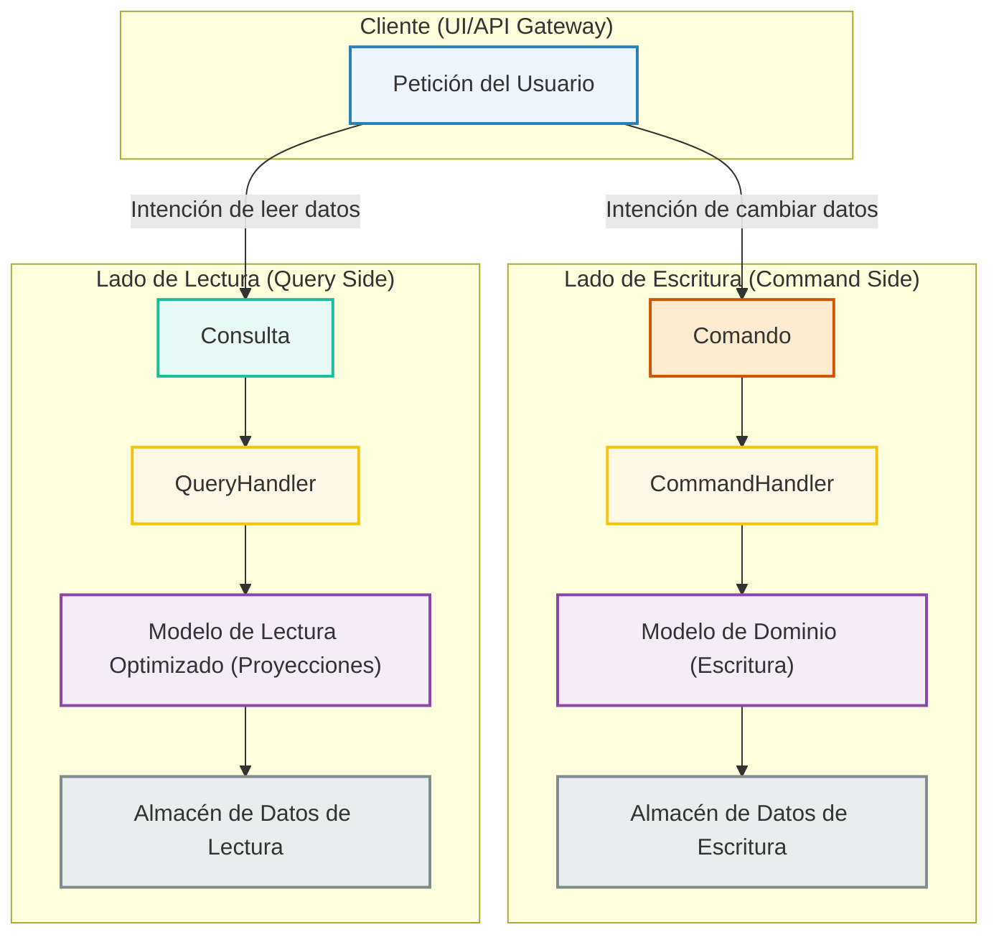
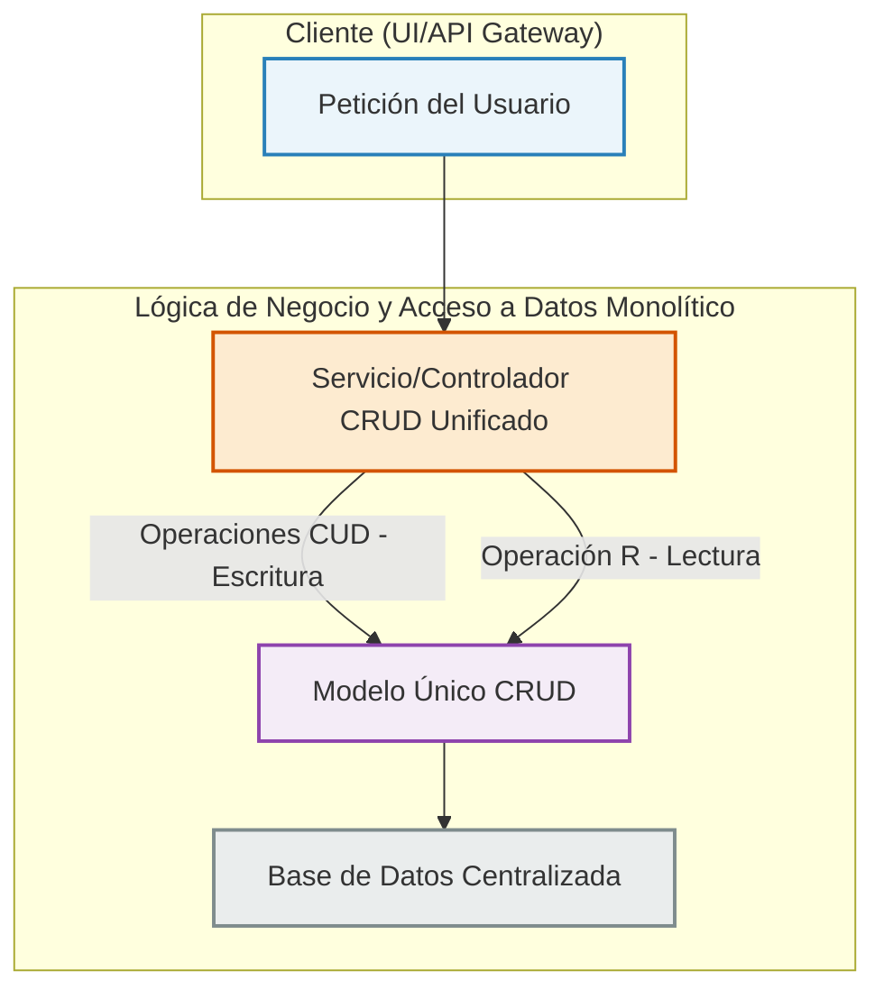
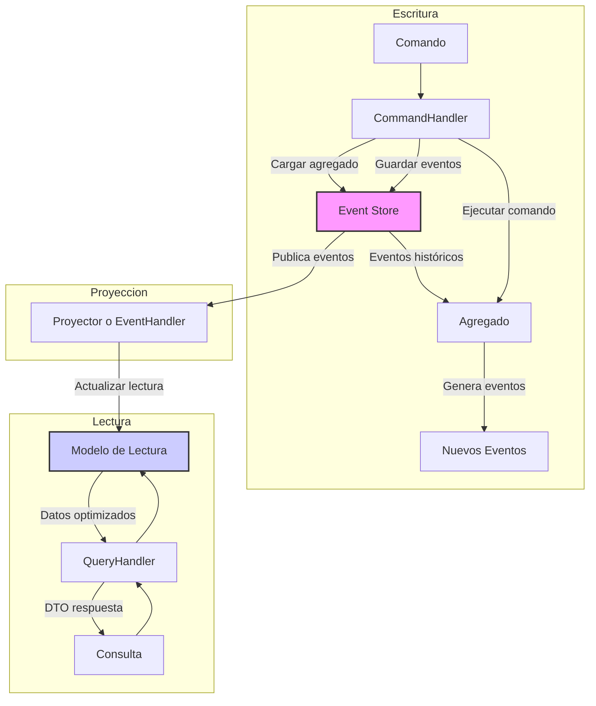

# Tema 8. PATRÓN CQRS EN MICROSERVICIOS

- [Tema 8. PATRÓN CQRS EN MICROSERVICIOS](#tema-8-patrón-cqrs-en-microservicios)
  - [8.1 Explicación del patrón CQRS y diferencias con CRUD tradicional](#81-explicación-del-patrón-cqrs-y-diferencias-con-crud-tradicional)
  - [8.2 Diseño de Comandos y Queries como Elementos Separados: Formalización de la Interacción](#82-diseño-de-comandos-y-queries-como-elementos-separados-formalización-de-la-interacción)
  - [8.3 Implementación de CommandHandlers desacoplados de controladores](#83-implementación-de-commandhandlers-desacoplados-de-controladores)
  - [8.4 Creación de QueryHandlers para operaciones de lectura especializadas](#84-creación-de-queryhandlers-para-operaciones-de-lectura-especializadas)
  - [8.5 Introducción a la persistencia por evento (Event Sourcing)](#85-introducción-a-la-persistencia-por-evento-event-sourcing)
  - [8.6 Aplicación de Validadores de Comandos (Command Validators)](#86-aplicación-de-validadores-de-comandos-command-validators)
  - [8.7 Gestión de la separación entre modelo de escritura y lectura](#87-gestión-de-la-separación-entre-modelo-de-escritura-y-lectura)
  - [8.8 Uso de FastAPI como gateway para coordinar comandos y queries](#88-uso-de-fastapi-como-gateway-para-coordinar-comandos-y-queries)
  - [8.9 Desacoplamiento de Servicios Mediante Colas o Buses de Eventos](#89-desacoplamiento-de-servicios-mediante-colas-o-buses-de-eventos)
  - [8.10 Análisis de Pros y Contras de CQRS en Sistemas Reales](#810-análisis-de-pros-y-contras-de-cqrs-en-sistemas-reales)
  - [Bibliografía](#bibliografía)
  
 


## 8.1 Explicación del patrón CQRS y diferencias con CRUD tradicional

En el desarrollo de software moderno, especialmente al abordar la complejidad inherente a las arquitecturas de microservicios, la gestión eficiente y escalable de los datos se erige como un pilar fundamental. Si bien el patrón **CRUD** (Create, Read, Update, Delete) ha sido una solución tradicional y efectiva para muchos escenarios, su aplicabilidad puede verse limitada ante sistemas de gran envergadura y requisitos de rendimiento diferenciados. Es en este contexto donde el patrón **CQRS** (Command Query Responsibility Segregation) emerge como una alternativa estratégica y poderosa.

**¿Qué es CQRS? El Principio de Separación de Responsabilidades**

CQRS es un patrón arquitectónico que aboga por una **separación explícita entre las operaciones que modifican el estado del sistema (Comandos) y aquellas que lo consultan (Consultas)**. En contraposición a un modelo único para leer y escribir, CQRS propone la implementación de modelos y flujos de datos distintos y optimizados para cada una de estas responsabilidades.

  * **Comandos (Commands):** Representan la intención de cambiar el estado del sistema. Son imperativos (ej. "CrearNuevoPedido", "ActualizarStockProducto"). Fundamentalmente, no devuelven datos como resultado de su ejecución, aunque pueden indicar éxito o fracaso. Su objetivo es la ejecución de una acción y la consistencia de los datos.
  * **Consultas (Queries):** Representan la intención de obtener información del sistema sin alterar su estado. Son interrogativas (ej. "ObtenerDetallesDePedido", "ListarProductosDisponibles"). Devuelven datos (a menudo en forma de DTOs - Data Transfer Objects) y están optimizadas para la eficiencia de la lectura.

**Visualizando la Arquitectura CQRS:**

Podemos concebir CQRS como dos caminos bien diferenciados que se originan a partir de las interacciones del cliente, uno dedicado a las escrituras y otro a las lecturas, cada uno con sus propios modelos y, potencialmente, sus propios almacenes de datos.



En este diagrama:

  * Las **Peticiones del Usuario** se traducen en **Comandos** para modificar datos o **Consultas** para leerlos.
  * Los **CommandHandlers** orquestan la ejecución de los comandos, interactuando con un **Modelo de Dominio** rico y validado, optimizado para la escritura. Los cambios se persisten en un **Almacén de Datos de Escritura** (transaccional).
  * Los **QueryHandlers** gestionan las consultas, utilizando **Modelos de Lectura** (proyecciones o DTOs) diseñados específicamente para las necesidades de cada consulta. Estos pueden leer de un **Almacén de Datos de Lectura** optimizado (que podría ser una réplica, una base de datos NoSQL, una caché, etc.).

**Contraste con el CRUD Tradicional:**

El enfoque CRUD, si bien intuitivo, generalmente opera sobre un modelo de datos unificado y un único almacén para todas las interacciones (Crear, Leer, Actualizar, Eliminar).



En un sistema CRUD típico:

  * Un **Servicio o Controlador** centralizado gestiona todas las operaciones.
  * Se emplea un **Modelo Único** que debe satisfacer tanto las necesidades de validación y lógica de negocio para las escrituras, como los requisitos de formato y presentación para las lecturas.
  * Se interactúa, por lo general, con una **Base de Datos Centralizada**.

**Tabla Comparativa: CQRS vs. CRUD Tradicional**

| Característica        | CRUD Tradicional                                     | CQRS                                                                           |
| :-------------------- | :--------------------------------------------------- | :----------------------------------------------------------------------------- |
| **Modelo de Datos** | Único y compartido para lectura/escritura.         | Modelos distintos y especializados para lectura y escritura.                  |
| **Responsabilidad** | Concentrada en un único objeto/servicio.             | Separación clara: Comandos (modificación) y Consultas (lectura).               |
| **Complejidad** | Menor complejidad inicial, ideal para apps simples.  | Mayor complejidad estructural inicial, justificada en sistemas complejos.       |
| **Escalabilidad** | Escalabilidad conjunta; puede generar cuellos de botella. | Permite escalar los lados de lectura y escritura de forma independiente.       |
| **Optimización** | Optimizaciones generales sobre un modelo único.      | Optimización específica para cada modelo (escritura validada vs. lectura rápida). |
| **Flexibilidad DB** | Usualmente una única tecnología de base de datos.    | Posibilidad de usar diferentes tecnologías de BBDD para escritura y lectura.  |
| **Consistencia** | Típicamente consistencia fuerte e inmediata.         | Puede introducir consistencia eventual si los almacenes están separados y se sincronizan. |
| **Casos de Uso** | Aplicaciones CRUD-intensivas, prototipos, MVPs, lógica de lectura/escritura similar. | Sistemas con alta concurrencia, requisitos de rendimiento diferenciados (ej. muchas lecturas, pocas escrituras o viceversa), dominios complejos. |

**Beneficios Clave de Adoptar CQRS:**

1.  **Escalabilidad Diferenciada:** Permite ajustar los recursos de infraestructura de forma independiente para las cargas de trabajo de lectura y escritura. Esto es vital en sistemas donde, por ejemplo, las lecturas superan masivamente a las escrituras.
2.  **Modelos de Datos Optimizados:** El modelo de escritura puede ser un agregado rico en lógica de negocio (DDD), mientras que el modelo de lectura puede ser una proyección plana y desnormalizada, perfecta para una API o una interfaz de usuario.
3.  **Seguridad y Gobernanza Refinadas:** Facilita la aplicación de políticas de seguridad y permisos más granulares para las operaciones de modificación frente a las de consulta.
4.  **Heterogeneidad Tecnológica:** Abre la puerta al uso de la tecnología de persistencia más adecuada para cada lado. Por ejemplo, una base de datos SQL robusta para la consistencia de las escrituras y Elasticsearch o Redis para la velocidad de las lecturas.
5.  **Rendimiento Optimizado:** Las consultas se benefician de modelos de lectura precalculados o simplificados, evitando la carga de procesar modelos de escritura complejos o realizar joins costosos en tiempo real.

**Consideraciones Importantes (Desventajas Potenciales):**

  * **Incremento de la Complejidad:** La separación introduce más artefactos de código y una mayor complejidad conceptual inicial.
  * **Consistencia Eventual:** Si se opta por almacenes de datos separados, la sincronización entre ellos (necesaria para que las lecturas reflejen las escrituras) puede no ser instantánea, llevando a un modelo de consistencia eventual que debe ser cuidadosamente gestionado y comprendido.
  * **Duplicación de Información (Controlada):** Aunque los modelos son distintos, puede existir cierta redundancia en la representación de los datos, lo cual es una decisión de diseño consciente para lograr la optimización.

-----

**Nota sobre Colaboración y Compartir este Material:**

Para facilitar la colaboración y el estudio en equipo de este material, incluyendo los diagramas Mermaid:

  * **Código de los Diagramas:** El código fuente de los diagramas Mermaid (`graph TD ...`) puede ser copiado directamente.
      * **Editores Online:** Pega este código en editores Mermaid online (como el editor oficial en [mermaid.live](https://mermaid.live) o herramientas como [Mermaid Chart](https://www.mermaidchart.com/), que pueden ofrecer opciones de "collab" o guardado en la nube) para visualizarlo, modificarlo y compartir enlaces al diagrama.
      * **Repositorios y Documentación:** Integra el código Mermaid en vuestros ficheros Markdown (en plataformas como GitHub, GitLab, Gitea, Azure DevOps) o en vuestros sistemas de documentación (Confluence, Notion, etc.) que soporten Mermaid. Esto permite versionar los diagramas junto con el código o la documentación del proyecto.
  * **Contenido del Curso:** Este texto puede ser copiado y pegado en documentos compartidos (Google Docs, Microsoft Office 365, etc.) para discusiones, anotaciones y trabajo colaborativo.
  * **Herramientas de Diseño:** Para una colaboración más visual, pueden recrear estos diagramas en herramientas de diseño colaborativo (Miro, Lucidchart, FigJam) e importar/exportar según sea necesario, aunque el código Mermaid ofrece la ventaja de ser "diagramas como código".

Fomentar la revisión por pares y la discusión sobre estos conceptos y diagramas dentro del equipo es crucial para una comprensión profunda y una aplicación exitosa de CQRS.


En conclusión, si bien CQRS no es una solución universal, su adopción en el contexto de microservicios desarrollados con FastAPI y orientados por DDD puede desbloquear niveles superiores de rendimiento, escalabilidad y mantenibilidad. Supone un cambio de paradigma respecto al CRUD tradicional, enfocándose en la especialización de las operaciones de datos.

En las siguientes secciones, exploraremos cómo diseñar e implementar los componentes específicos de CQRS: los Comandos, las Consultas y sus respectivos Handlers.

-----


## 8.2 Diseño de Comandos y Queries como Elementos Separados: Formalización de la Interacción

En una arquitectura CQRS, los **Comandos (Commands)** y las **Consultas (Queries)** trascienden la mera invocación de métodos. Se constituyen como los artefactos primarios de la interfaz de la capa de aplicación, actuando como **Data Transfer Objects (DTOs)** altamente especializados que formalizan y encapsulan la intención de cada interacción con el sistema. Un diseño meticuloso y riguroso de estos elementos es imperativo para la claridad semántica, la mantenibilidad y la escalabilidad del sistema.

**Diseñando Comandos (Commands): Imperativos de Transformación de Estado**

Los comandos son mensajes que encapsulan la intención inequívoca de ejecutar una operación que modifica el estado del sistema. Representan la materialización de un caso de uso transaccional y deben ser diseñados con precisión para asegurar la integridad y la claridad de las operaciones de escritura.

  * **Definición Formal y Principios de Diseño Clave:**

    1.  **Intencionalidad y Especificidad (Intentionality & Specificity):**
          * Cada comando debe tener un nombre que revele claramente su propósito y la acción de negocio que representa (ej. `ProcesarPagoTarjetaCreditoCommand`, `AsignarIncidenciaSoporteCommand`). Se deben evitar comandos genéricos (anti-patrón: `UpdateEntityCommand` con múltiples flags).
          * Un comando debe corresponder a una única operación lógica o caso de uso a nivel de aplicación.
    2.  **Autocontención y Completitud (Self-Containment & Completeness):**
          * Un comando debe portar toda la información necesaria para que su `CommandHandler` pueda tomar una decisión de ejecución y validación. El handler no debería necesitar consultar estado adicional *solo para validar la estructura o la viabilidad superficial del comando*. La ejecución, por supuesto, interactuará con el estado persistido.
          * Esto minimiza el acoplamiento entre el cliente y el ejecutor del comando.
    3.  **Inmutabilidad (Immutability):**
          * Una vez que una instancia de comando es creada, su estado no debe ser alterable. Esto es crucial para la predictibilidad, la seguridad en entornos concurrentes (thread-safety), la reproducibilidad de las pruebas y la fiabilidad en pipelines de procesamiento (validación, auditoría, encolamiento).
          * En Python, se pueden usar `dataclasses` con `frozen=True` o modelos Pydantic configurados para inmutabilidad.
    4.  **Idempotencia del Receptor (Receiver Idempotency):**
          * Si bien el comando es una solicitud de acción, el sistema (específicamente el `CommandHandler`) debería, idealmente, ser diseñado para manejar reintentos de un mismo comando (con el mismo `command_id`) de forma idempotente, especialmente en arquitecturas distribuidas. Esto previene efectos secundarios no deseados por duplicación de mensajes. Un `command_id` único es esencial para esta capacidad.
    5.  **Granularidad (Granularity):**
          * Se debe encontrar un equilibrio. Comandos demasiado detallados (fine-grained) pueden llevar a un "efecto chatty" y a la necesidad de orquestar múltiples comandos para una sola operación de usuario. Comandos demasiado amplios (coarse-grained) pueden volverse complejos y difíciles de manejar.
          * La granularidad ideal suele alinearse con una transacción de negocio o un caso de uso completo desde la perspectiva del usuario. (Ej. `FinalizarCompraCommand` es preferible a `ActualizarCarritoCommand`, `ProcesarPagoCommand`, `CrearEnvioCommand` ejecutados separadamente por el cliente).
    6.  **Ausencia de Retorno de Datos del Dominio (No Domain Data Return Value):**
          * Los comandos no deben devolver el estado modificado o proyecciones del mismo. Esto es una distinción fundamental de CQRS.
          * Pueden retornar una confirmación de aceptación (síncrona o asíncrona, ej. HTTP 202 Accepted), un identificador único para la transacción o entidad (si se crea), o una indicación de error/fallo específico.

  * **Estructura Detallada y Metadatos Esenciales (Ejemplo con Pydantic):**
    Un comando bien diseñado no solo lleva los datos de la operación, sino también metadatos cruciales para la trazabilidad, auditoría y procesamiento avanzado.

```python
import uuid
    from decimal import Decimal
    from typing import Optional
    from pydantic import BaseModel, Field, condecimal, constr

    class RegistrarNuevoClienteCommand(BaseModel):
        # Metadatos del Comando
        command_id: uuid.UUID = Field(default_factory=uuid.uuid4, description="Identificador único del comando para idempotencia y trazabilidad.")
        correlation_id: Optional[uuid.UUID] = Field(None, description="ID para correlacionar con otros comandos o eventos en un flujo.")
        causation_id: Optional[uuid.UUID] = Field(None, description="ID del comando o evento que originó este comando.")
        # user_id: Optional[str] = Field(None, description="Identificador del usuario que emite el comando.") # Podría provenir de un contexto de seguridad

        # Datos de Negocio (Payload)
        nombre_completo: constr(min_length=2, max_length=150) # type: ignore
        email: constr(pattern=r"^[a-zA-Z0-9_.+-]+@[a-zA-Z0-9-]+\.[a-zA-Z0-9-.]+$") # type: ignore
        fecha_nacimiento: date
        limite_credito_solicitado: Optional[condecimal(gt=0, decimal_places=2)] = None # type: ignore

        class Config:
            frozen = True # Asegurar inmutabilidad
            # or an older Pydantic version:
            # allow_mutation = False
```
* **Versioning de Comandos:**
    A medida que el sistema evoluciona, los comandos pueden cambiar. Se deben considerar estrategias de versionado:

      * **Versionado en el Nombre:** `RegistrarClienteCommand_v1`, `RegistrarClienteCommand_v2`.
      * **Versionado en el Namespace/Módulo:** `app.commands.v1.RegistrarClienteCommand`.
      * **Uso de Transformadores (Upcasters):** Patrón para convertir comandos antiguos a versiones más nuevas antes de su procesamiento.

**Diseñando Consultas (Queries): Solicitudes de Proyecciones de Estado Específicas**

Las consultas son mensajes que formalizan la solicitud de recuperación de datos del sistema, sin inducir efectos secundarios sobre el estado del mismo. Su diseño se centra en la eficiencia de la lectura y en la adecuación de la información devuelta al consumidor.

  * **Definición Formal y Principios de Diseño Clave:**

    1.  **Claridad y Precisión (Clarity & Precision):**
          * El nombre de la consulta debe ser descriptivo de los datos que retorna y los criterios principales (ej. `ObtenerDetallesPedidoQuery`, `ListarFacturasPendientesClienteQuery`, `BuscarArticulosPorEtiquetasQuery`).
    2.  **Parámetros Explícitos (Explicit Parameters):**
          * Debe encapsular todos los parámetros necesarios para la recuperación de datos: identificadores, criterios de filtrado, opciones de paginación, ordenación y, potencialmente, especificación de los campos a retornar (para evitar over-fetching).
    3.  **Idempotencia Garantizada (Guaranteed Idempotency in Read):**
          * La ejecución de una consulta con los mismos parámetros debe ser siempre idempotente en términos de lectura; es decir, no altera el estado y, si el estado subyacente no ha cambiado, debe devolver el mismo resultado.
    4.  **DTOs de Retorno Específicos (Specific Return DTOs / Read Models):**
          * Las consultas devuelven proyecciones de datos (Read Models) optimizadas para el caso de uso del cliente. Estos DTOs pueden ser muy diferentes del modelo de escritura y deben ser "a medida".
          * Es común tener múltiples DTOs de respuesta para una misma entidad de dominio, dependiendo de la consulta (ej. `ProductoResumenDTO`, `ProductoDetalleDTO`).
    5.  **Inmutabilidad (Immutability):**
          * Al igual que los comandos, las instancias de las consultas deben ser inmutables una vez creadas.

  * **Estructura Detallada (Ejemplo con Pydantic):**

```python
from typing import List, Optional
    from pydantic import BaseModel, Field, PositiveInt
    from enum import Enum
    # Suponemos la existencia de ProductoResumenDTO
    # from ..dtos.productos import ProductoResumenDTO

    class OrdenacionProductos(str, Enum):
        PRECIO_ASC = "precio_asc"
        PRECIO_DESC = "precio_desc"
        NOMBRE_ASC = "nombre_asc"

    class ListarProductosDisponiblesQuery(BaseModel):
        # Metadatos de la consulta (opcional, pero puede ser útil para caché o trazabilidad)
        # query_id: uuid.UUID = Field(default_factory=uuid.uuid4)
        
        # Parámetros de Filtrado y Búsqueda
        categoria_id: Optional[str] = None
        precio_maximo: Optional[Decimal] = Field(None, gt=0)
        palabras_clave: Optional[List[str]] = None
        
        # Parámetros de Paginación y Ordenación
        pagina: PositiveInt = 1
        tamano_pagina: PositiveInt = Field(20, le=100) # Limitar tamaño máximo
        ordenar_por: Optional[OrdenacionProductos] = OrdenacionProductos.NOMBRE_ASC

        class Config:
            frozen = True
            # allow_mutation = False
```


* **Versioning de Consultas y DTOs de Respuesta:**
    Análogo a los comandos, las consultas y especialmente sus DTOs de respuesta pueden necesitar versionado para gestionar la evolución de la API de lectura sin romper clientes existentes.

**La Separación como Decisión Arquitectónica Estratégica:**

La distinción rigurosa entre Comandos y Consultas no es meramente una convención de nombrado, sino un pilar estratégico que habilita:

1.  **Optimización Asimétrica:** Modelos de datos, lógica de validación, mecanismos de persistencia y estrategias de rendimiento pueden ser radicalmente diferentes y optimizados independientemente para el camino de escritura y el de lectura.
2.  **Evolución Independiente y Aislamiento de la Complejidad:**
      * La lógica transaccional compleja del dominio (en el lado del comando) se aísla de las necesidades, a menudo más simples y variadas, de la presentación de datos (lado de la consulta).
      * Los modelos de lectura pueden evolucionar (añadir/quitar campos, cambiar estructuras) con menor impacto en el modelo de escritura, y viceversa (siempre considerando la sincronización de datos).
3.  **Escalabilidad Granular y Diferenciada:** Es posible escalar los recursos (CPU, memoria, IOPS, instancias de servicio, tipos de bases de datos) de forma independiente para la carga de comandos y la carga de consultas.
4.  **Seguridad y Auditoría Específicas:** Permite implementar políticas de autorización más finas (ej. roles que solo pueden ejecutar ciertas consultas vs. roles que pueden ejecutar comandos específicos) y mecanismos de auditoría detallados y adaptados a la naturaleza de cada operación.

**Integración y Representación en FastAPI con Rigor Profesional:**

FastAPI, con su fuerte tipado basado en Pydantic y su sistema de inyección de dependencias, es un marco excelente para implementar este patrón:

  * **Contratos de Datos Formales:** Los modelos Pydantic para Comandos y Consultas actúan como contratos de datos explícitos y validados automáticamente en los límites de la API.

  * **Validación en la Frontera:** FastAPI/Pydantic realizan la validación sintáctica y de tipos. Las validaciones de reglas de negocio más profundas residirán en los `CommandHandlers` o en el modelo de dominio.

  * **Inyección de Dependencias Avanzada:** El sistema `Depends` de FastAPI puede utilizarse no solo para inyectar Handlers, sino también para construir o enriquecer Comandos/Consultas con datos del contexto de la petición (ej. `Request` object de Starlette para obtener `user_id` de un token JWT, `correlation_id` de cabeceras HTTP).


```python
# Ejemplo conceptual de enriquecimiento en un endpoint
    from fastapi import APIRouter, Depends, Request, status

    router = APIRouter()

    async def get_current_user_id(request: Request) -> str:
        # Lógica para extraer user_id del token JWT, por ejemplo
        # return request.state.user.id 
        return "user-123" # Placeholder

    @router.post("/clientes", status_code=status.HTTP_202_ACCEPTED)
    async def registrar_cliente_endpoint(
        command_payload: RegistrarNuevoClienteCommand.Config.model_fields.exclude("command_id", "correlation_id", "causation_id", "user_id"), # type: ignore
        # command_payload: Omit[RegistrarNuevoClienteCommand, "command_id" | ...], # Usando typing_extensions.Omit
        request: Request,
        current_user_id: str = Depends(get_current_user_id)
        # command_bus: CommandBus = Depends(get_command_bus) # Se verá más adelante
    ):
        # Enriquecer el comando con metadatos del contexto
        correlation_id_header = request.headers.get("X-Correlation-ID")
        correlation_id = uuid.UUID(correlation_id_header) if correlation_id_header else uuid.uuid4()
        
        # Construcción final del comando
        command = RegistrarNuevoClienteCommand(
            **command_payload.model_dump(),
            correlation_id=correlation_id,
            # causation_id se manejaría si este comando es parte de una cadena más larga
            # user_id=current_user_id 
        )
        # await command_bus.dispatch(command)
        return {"message": "Solicitud de registro de cliente aceptada.", "command_id": command.command_id}
```

---


## 8.3 Implementación de CommandHandlers desacoplados de controladores

Habiendo definido nuestros Comandos como mensajes claros y específicos que encapsulan la intención de cambio, es momento de abordar su procesamiento. Esta responsabilidad recae en los **CommandHandlers**. Un diseño desacoplado de estos handlers respecto a los controladores (endpoints de FastAPI en nuestro caso) es fundamental para lograr una separación de incumbencias efectiva y promover la testabilidad y flexibilidad del sistema.

**El `CommandHandler`: Orquestador de la Lógica de Negocio Transaccional**

Un `CommandHandler` es un componente especializado cuya única responsabilidad es procesar un tipo específico de Comando. Actúa como un orquestador de la lógica de aplicación, coordinando las interacciones entre el modelo de dominio, los servicios de infraestructura y la persistencia.

  * **Definición y Responsabilidades Fundamentales:**

    1.  **Recepción y Procesamiento Específico:** Cada `CommandHandler` está diseñado para manejar un único tipo de Comando. Recibe el objeto Comando como entrada.
    2.  **Orquestación de la Lógica de Aplicación:** No contiene la lógica de negocio *per se* (esta reside en las entidades y agregados del dominio), sino que coordina los pasos necesarios para ejecutar la acción solicitada por el comando. Esto incluye:
          * Validar la aplicabilidad del comando en el contexto actual (reglas de negocio que no son meramente estructurales).
          * Recuperar las entidades o agregados de dominio pertinentes desde la persistencia (usando Repositorios).
          * Invocar los métodos apropiados en dichos agregados para efectuar el cambio de estado.
          * Orquestar la persistencia de los cambios (a través de una Unidad de Trabajo o Repositorios).
          * Potencialmente, interactuar con otros servicios de infraestructura (ej. envío de notificaciones, integración con sistemas externos) o publicar eventos de dominio resultantes.
    3.  **Sin Retorno de Datos del Dominio:** Consistente con el principio CQRS, un `CommandHandler` no devuelve datos del estado del sistema. Su "salida" es el efecto secundario del cambio de estado y, opcionalmente, una confirmación de éxito/fracaso o identificadores.

  * **Características Clave de un `CommandHandler`:**

      * **Especificidad (Single Command Type):** La práctica más común y recomendada es tener una clase `CommandHandler` por cada tipo de Comando. Esto favorece el Principio de Responsabilidad Única (SRP).
      * **Sin Estado (Stateless):** Idealmente, un `CommandHandler` no debería mantener estado entre invocaciones. Todas las dependencias necesarias para su operación son inyectadas.
      * **Dependencias Explícitas:** Las dependencias (Repositorios, Unidad de Trabajo, servicios de dominio, etc.) deben ser explícitamente definidas (ej. en el constructor) para facilitar la inyección y la prueba.

**Desacoplamiento de los Controladores (Endpoints FastAPI): Principios y Técnicas**

Es vital que la lógica de los `CommandHandlers` no resida dentro de los controladores de la API. Los controladores deben ser delgados y enfocarse en las incumbencias de la capa web/HTTP.

  * **La Necesidad Imperante del Desacoplamiento:**

    1.  **SRP para Controladores:** Los controladores (endpoints FastAPI) deben limitarse a:
          * Interpretar la petición HTTP.
          * Deserializar y validar sintácticamente el payload (ej. en un objeto Comando usando Pydantic).
          * Autenticar y autorizar la petición (a nivel de infraestructura).
          * Delegar la ejecución de la lógica de aplicación al `CommandHandler` apropiado.
          * Serializar la respuesta HTTP (confirmación, error).
    2.  **Testabilidad Aislada:** Los `CommandHandlers` encapsulan lógica de aplicación crítica. Desacoplarlos permite probar esta lógica unitariamente, sin la sobrecarga del contexto HTTP ni la necesidad de un servidor web en ejecución.
    3.  **Flexibilidad en la Invocación:** La misma lógica de comando puede ser invocada desde múltiples fuentes: un endpoint HTTP, una tarea en segundo plano (worker), una interfaz de línea de comandos (CLI), o incluso otro microservicio (a través de un bus de mensajes).
    4.  **Mantenibilidad y Claridad:** La separación de incumbencias hace el sistema más fácil de entender, modificar y extender.

  * **Mecanismos de Desacoplamiento:**

    1.  **Inyección de Dependencias (DI):** Es el mecanismo primario. FastAPI sobresale en esto. El `CommandHandler` se define como una dependencia y FastAPI se encarga de instanciarlo e inyectarlo en la función del endpoint.

```python
# En el endpoint de FastAPI
        # from app.application.command_handlers import RegistrarNuevoClienteCommandHandler
        # from app.application.commands import RegistrarNuevoClienteCommand

        @router.post("/clientes")
        async def registrar_cliente_endpoint(
            comando: RegistrarNuevoClienteCommand, # FastAPI/Pydantic deserializa y valida
            handler: RegistrarNuevoClienteCommandHandler = Depends(RegistrarNuevoClienteCommandHandler) # Inyección de dependencia
        ):
            await handler.handle(comando) # Delegación
            return {"message": "Cliente registrado exitosamente."} # O HTTP 202
```  
2.  **Patrón Mediator / Command Bus (Introducción):** Para sistemas con muchos comandos, inyectar cada handler individualmente en los controladores puede volverse tedioso. El patrón Mediator centraliza el despacho de comandos:
          * Se define un `CommandBus` (o `Mediator`).
          * Los `CommandHandlers` se registran en este bus, asociando cada tipo de comando con su handler.
          * El controlador solo depende del `CommandBus`. Envía el comando al bus, y este se encarga de encontrar y ejecutar el handler correcto.
          * **Ventajas:** Reduce el acoplamiento del controlador a un solo punto (el bus), simplifica la adición de nuevos comandos/handlers sin modificar los controladores existentes (Principio Abierto/Cerrado).
          * Se explorará más a fondo en secciones posteriores (ej. 8.8 o 8.9), pero es importante mencionarlo como una técnica de desacoplamiento avanzada.

**Anatomía de un `CommandHandler` Efectivo**

Un `CommandHandler` bien estructurado sigue un patrón predecible.

  * **Interfaz y Contrato (Opcional pero Recomendado):**
    Para promover la consistencia y facilitar el uso de patrones como el Mediator, se puede definir una interfaz genérica para los handlers usando `typing.Protocol` (preferido para duck typing) o `abc.ABC`.

```python
from typing import Protocol, TypeVar
    from app.application.commands import Command # Suponiendo una clase base o marcador para Comandos

    C = TypeVar('C', bound=Command, contravariant=True) # Tipo genérico para el Comando

    class ICommandHandler(Protocol[C]):
        async def handle(self, command: C) -> None: # Opcionalmente puede devolver algo como un ID
            ...
```
* **Implementación Típica:**

```python
from app.application.commands import RegistrarNuevoClienteCommand # Comando específico
    # from .interfaces import ICommandHandler # Interfaz definida arriba
    from app.domain.repositories import IClienteRepository
    from app.domain.entities import Cliente
    from app.domain.services import ValidadorUnicidadEmail # Ejemplo de servicio de dominio
    from app.infrastructure.unit_of_work import IUnitOfWork

    class RegistrarNuevoClienteCommandHandler: # Podría implementar ICommandHandler[RegistrarNuevoClienteCommand]
        def __init__(
            self,
            cliente_repository: IClienteRepository,
            validador_email: ValidadorUnicidadEmail, # Servicio de Dominio
            unit_of_work: IUnitOfWork
        ):
            self._cliente_repository = cliente_repository
            self._validador_email = validador_email
            self._uow = unit_of_work

        async def handle(self, command: RegistrarNuevoClienteCommand) -> uuid.UUID: # Devuelve el ID del nuevo cliente
            async with self._uow: # El UnitOfWork gestiona la transacción
                # 1. Validación de reglas de negocio (puede estar en el dominio o aquí)
                if not await self._validador_email.es_unico(command.email):
                    raise EmailYaRegistradoError(f"El email {command.email} ya está en uso.") # Excepción específica

                # 2. Creación del Agregado/Entidad del Dominio
                nuevo_cliente = Cliente.registrar( # Método factoría estático en la entidad
                    id=uuid.uuid4(), # Podría ser generado por el repositorio o la BD
                    nombre_completo=command.nombre_completo,
                    email=command.email,
                    fecha_nacimiento=command.fecha_nacimiento
                    # otros campos del comando...
                )
                # Aquí, nuevo_cliente podría haber generado eventos de dominio
                # ej. nuevo_cliente.raise_event(ClienteRegistradoEvent(...))

                # 3. Persistencia del Agregado
                await self._cliente_repository.add(nuevo_cliente)

                # 4. Commit de la Unidad de Trabajo
                # (El UoW se encarga de la persistencia de eventos de dominio si está integrado)
                await self._uow.commit() 
            
            return nuevo_cliente.id
```
* **Manejo de Transacciones y Unidad de Trabajo (Unit of Work - UoW):**

      * Las operaciones de comando suelen ser atómicas: o todos los cambios se aplican, o ninguno.
      * El patrón `Unit of Work` es crucial aquí. El `CommandHandler` define el alcance de la UoW (inicio, commit, rollback).
      * La UoW agrupa todas las operaciones de escritura (añadir, actualizar, eliminar entidades) dentro de una única transacción de base de datos. Esto asegura la consistencia.

**Ejemplo Práctico de Integración con FastAPI (Inyección Directa):**

Asumiendo que tienes un sistema de inyección de dependencias configurado para FastAPI (ej. usando `python-dependency-injector` o proveyendo factorías para `Depends`):

```python
# --- En la capa de infraestructura (ej. di_container.py) ---
from dependency_injector import containers, providers
# from app.infrastructure.repositories.sql_cliente_repository import SqlClienteRepository
# from app.infrastructure.database import SessionLocal # SQLAlchemy session factory
# from app.domain.services import ValidadorUnicidadEmail

# class Container(containers.DeclarativeContainer):
#     config = providers.Configuration()
#     db_session_factory = providers.Factory(SessionLocal)

#     cliente_repository_factory = providers.Factory(
#         SqlClienteRepository,
#         session_factory=db_session_factory
#     )
#     # ... otras factorías ...

#     registrar_cliente_handler_factory = providers.Factory(
#         RegistrarNuevoClienteCommandHandler,
#         cliente_repository=cliente_repository_factory,
#         validador_email=providers.Factory(ValidadorUnicidadEmail, cliente_repository=cliente_repository_factory),
#         unit_of_work= #... Factoría para la UoW ...
#     )

# --- En el endpoint de FastAPI (ej. routers/clientes.py) ---
from fastapi import APIRouter, Depends, HTTPException, status
# from app.application.commands import RegistrarNuevoClienteCommand
# from app.application.command_handlers import RegistrarNuevoClienteCommandHandler
# from app.infrastructure.di_container import Container # Suponiendo un contenedor DI
# from app.domain.exceptions import EmailYaRegistradoError # Excepción de dominio

router = APIRouter(prefix="/clientes", tags=["Clientes"])
# container = Container() # Instancia del contenedor

# def get_registrar_cliente_handler(): # Esta función sería llamada por Depends()
#    return container.registrar_cliente_handler_factory()

@router.post("/", status_code=status.HTTP_201_CREATED, response_model=ClienteCreadoResponse) # ClienteCreadoResponse es un DTO
async def registrar_nuevo_cliente_endpoint(
    command: RegistrarNuevoClienteCommand,
    # handler: RegistrarNuevoClienteCommandHandler = Depends(get_registrar_cliente_handler)
    handler: RegistrarNuevoClienteCommandHandler = Depends() # FastAPI podría resolver esto si el handler no tiene dependencias o son resolubles
):
    try:
        cliente_id = await handler.handle(command)
        return ClienteCreadoResponse(id=cliente_id, email=command.email)
    except EmailYaRegistradoError as e:
        raise HTTPException(status_code=status.HTTP_409_CONFLICT, detail=str(e))
    except Exception as e: # Manejo genérico para otras excepciones no esperadas
        # Loggear el error 'e'
        raise HTTPException(status_code=status.HTTP_500_INTERNAL_SERVER_ERROR, detail="Ocurrió un error interno al procesar la solicitud.")
```

*(Nota: La configuración completa de un contenedor DI como `dependency-injector` está fuera del alcance inmediato, pero el concepto es que `Depends` puede invocar una factoría que construya el handler con sus dependencias resueltas).*

**Beneficios Tangibles del Desacoplamiento de `CommandHandlers`:**

1.  **Alta Cohesión y Bajo Acoplamiento:** Los componentes tienen responsabilidades bien definidas y las interdependencias son gestionadas explícitamente.
2.  **Testabilidad Superior:** La lógica de `RegistrarNuevoClienteCommandHandler` puede ser probada unitariamente con mocks para sus dependencias (repositorio, UoW, validador) sin necesidad de un cliente HTTP.
3.  **Mantenibilidad y Evolución Simplificadas:** Los cambios en la lógica de presentación (FastAPI endpoints) o en la lógica de negocio (Handlers, Dominio) están aislados.
4.  **Reusabilidad del Código de Aplicación:** El mismo `CommandHandler` puede ser invocado desde un worker Celery, un script de administración, etc., no solo desde la API web.

Al desacoplar los `CommandHandlers`, se sienta una base sólida para una aplicación que no solo sigue los principios de CQRS, sino que también es inherentemente más modular, robusta y fácil de mantener a lo largo del tiempo. El siguiente paso natural es aplicar una lógica similar para el lado de lectura con los `QueryHandlers`.

-----

## 8.4 Creación de QueryHandlers para operaciones de lectura especializadas

Tras haber establecido cómo los `CommandHandlers` gestionan las operaciones de escritura de forma desacoplada, es el momento de dirigir nuestra atención al lado de la lectura. En CQRS, las **Consultas (Queries)** y sus correspondientes **QueryHandlers** son responsables de recuperar datos y presentarlos de manera eficiente y especializada, sin los efectos secundarios ni la complejidad transaccional inherente al lado de escritura.

**El `QueryHandler`: Proveedor de Proyecciones de Datos Especializadas**

Un `QueryHandler` es un componente dedicado cuya única responsabilidad es procesar un tipo específico de `Query`. Su función es interactuar con el/los almacén/es de datos de lectura para obtener la información solicitada por la `Query` y transformarla en un modelo de datos de lectura (DTO o Read Model) optimizado para el consumidor.

  * **Definición y Responsabilidades Fundamentales:**

    1.  **Procesamiento Específico de Consultas:** Cada `QueryHandler` está diseñado para un único tipo de `Query`.
    2.  **Recuperación de Datos Optimizada:** Accede a los datos necesarios, que pueden residir en la misma base de datos que el lado de escritura, una réplica de lectura, una vista materializada, un almacén NoSQL denormalizado (como Elasticsearch), una caché, o cualquier combinación optimizada para la consulta específica.
    3.  **Construcción de DTOs/Read Models:** Transforma los datos crudos obtenidos en una estructura (DTO) que es precisamente lo que el cliente de la consulta necesita. Esto evita el "over-fetching" (enviar más datos de los necesarios) y el "under-fetching" (requerir múltiples llamadas para obtener toda la información).
    4.  **Estrictamente Sin Efectos Secundarios:** La ejecución de un `QueryHandler` **nunca** debe modificar el estado del sistema. Es una operación idempotente por naturaleza.

  * **Características Clave de un `QueryHandler`:**

      * **Especificidad (Single Query Type):** Al igual que los `CommandHandlers`, se promueve un `QueryHandler` por cada tipo de `Query`.
      * **Optimización para Lectura:** Su diseño interno, las fuentes de datos que utiliza y la forma en que accede a ellas están completamente orientados a la eficiencia de la lectura.
      * **Sin Estado y Dependencias Explícitas:** Son componentes sin estado con dependencias inyectadas (ej. conexiones a bases de datos de lectura, clientes de servicios de búsqueda).

**Lecturas Especializadas: Trascendiendo los Repositorios Genéricos**

Es crucial entender que los `QueryHandlers` no son simples envoltorios de métodos genéricos de un repositorio (como `repository.find_by_id(id)` o `repository.get_all()`). Van un paso más allá:

  * **DTOs a Medida (Tailored DTOs):** El `QueryHandler` es responsable de construir un DTO que puede ser una proyección muy específica de una o varias entidades del dominio, o incluso datos agregados y calculados que no existen directamente en el modelo de escritura. Por ejemplo, `PedidoResumenDTO` para una lista y `PedidoDetalleDTO` con más información para una vista individual.
  * **Denormalización Estratégica:** Para optimizar la velocidad de lectura, los `QueryHandlers` pueden acceder a almacenes de datos de lectura donde la información ya está denormalizada. Esto evita joins costosos en tiempo de consulta, trasladando la complejidad de la composición de datos al momento en que el modelo de lectura se actualiza (posiblemente a través de eventos del lado de escritura).
  * **Fuentes de Datos Heterogéneas:** Un `QueryHandler` puede obtener datos de múltiples fuentes. Parte de la información podría venir de una base de datos SQL de lectura y otra parte de un índice de Elasticsearch para capacidades de búsqueda avanzada, todo ensamblado en un único DTO de respuesta.
  * **Proyecciones Eficientes:** Solo se recuperan los campos estrictamente necesarios para la consulta, reduciendo la carga en la base de datos y el tráfico de red.

**Desacoplamiento de los Controladores (Endpoints FastAPI): Consistencia Arquitectónica**

Al igual que con los `CommandHandlers`, desacoplar los `QueryHandlers` de los controladores de FastAPI es fundamental:

  * **Beneficios:**
      * **Controladores Delgados:** Los endpoints de FastAPI se mantienen ligeros, enfocados en HTTP y la delegación.
      * **Testabilidad Aislada:** La lógica de construcción de DTOs y la interacción con las fuentes de datos de lectura pueden probarse unitariamente.
      * **Reusabilidad:** La misma lógica de consulta puede ser utilizada por diferentes partes del sistema o expuesta a través de distintas interfaces (ej. gRPC además de REST).
      * **Claridad y SRP:** Cada componente tiene una responsabilidad bien definida.
  * **Técnicas de Desacoplamiento:**
      * **Inyección de Dependencias (DI):** FastAPI `Depends` para inyectar instancias de `QueryHandler`.
      * **Patrón Mediator / Query Bus:** Un `QueryBus` centraliza el despacho de `Queries` a sus respectivos `QueryHandlers`. El controlador solo interactúa con el `QueryBus`.

**Anatomía de un `QueryHandler` Efectivo**

  * **Interfaz y Contrato (Recomendado):**
    Definir una interfaz genérica para `QueryHandlers` promueve la consistencia.

```python
from typing import Protocol, TypeVar, Generic
    from app.application.queries import Query # Clase base o marcador para Queries
    # R_co se usa para el tipo de resultado y es covariante, 
    # lo que significa que si T es un subtipo de U, entonces QueryHandler[..., T] es un subtipo de QueryHandler[..., U]
    R_co = TypeVar('R_co', covariant=True) # Tipo genérico para el Resultado (DTO o lista de DTOs)
    Q_contra = TypeVar('Q_contra', bound=Query, contravariant=True) # Tipo genérico para la Query

    class IQueryHandler(Protocol[Q_contra, R_co]):
        async def handle(self, query: Q_contra) -> R_co:
            ...
```

* **Implementación Típica:**

```python
from sqlalchemy.ext.asyncio import AsyncSession # O cualquier otro cliente de BBDD/ORM
    from sqlalchemy.future import select
    from app.application.queries import ListarProductosDisponiblesQuery # Query específica
    from app.application.dtos import ProductoResumenDTO # DTO de respuesta específico
    # from .interfaces import IQueryHandler # Interfaz definida arriba

    # Ejemplo de cómo podría verse una entidad de lectura (simplificada) si se usa SQLAlchemy
    # Esta no es la entidad de dominio de escritura, sino una proyección o tabla optimizada para lectura.
    # from app.infrastructure.read_models import ProductoReadModel 

    class ListarProductosDisponiblesQueryHandler: # Podría implementar IQueryHandler[ListarProductosDisponiblesQuery, List[ProductoResumenDTO]]
        def __init__(self, db_session: AsyncSession): # Inyectar la sesión de BBDD (o cliente específico)
            self._db_session = db_session

        async def handle(self, query: ListarProductosDisponiblesQuery) -> List[ProductoResumenDTO]:
            #stmt = select(ProductoReadModel.id, ProductoReadModel.nombre, ProductoReadModel.precio, ProductoReadModel.categoria_nombre)
            # Ejemplo de construcción de una consulta SQL o ORM
            # Aquí se usarían los parámetros de `query.categoria_id`, `query.precio_maximo`, etc.
            # para filtrar, ordenar (`query.ordenar_por`) y paginar (`query.pagina`, `query.tamano_pagina`).

            # Simulación de la consulta y mapeo (esto sería una consulta real a la BD)
            # Por ejemplo, con SQLAlchemy:
            # result = await self._db_session.execute(stmt)
            # productos_raw = result.mappings().all() # Devuelve una lista de diccionarios (o RowMapping)

            # --- Bloque de simulación ---
            print(f"Ejecutando consulta: {query}")
            productos_raw_simulados = [
                {"id": "prod_1", "nombre": "Laptop Pro X", "precio": 1200.00, "stock_disponible": 10, "categoria_nombre": "Electrónica"},
                {"id": "prod_2", "nombre": "Teclado Mecánico RGB", "precio": 150.00, "stock_disponible": 50, "categoria_nombre": "Accesorios"},
            ]
            if query.categoria_id:
                 productos_raw_simulados = [p for p in productos_raw_simulados if p["categoria_nombre"].lower() == query.categoria_id.lower()]
            # Aplicar paginación y ordenación simulada
            # --- Fin bloque de simulación ---
            
            # Mapeo a DTOs
            dtos_respuesta = []
            for prod_raw in productos_raw_simulados: # Reemplazar con productos_raw
                dtos_respuesta.append(
                    ProductoResumenDTO(
                        id=str(prod_raw["id"]), # Asegurar tipo correcto
                        nombre=prod_raw["nombre"],
                        precio=Decimal(str(prod_raw["precio"])), # Asegurar tipo Decimal
                        # stock_disponible=prod_raw["stock_disponible"], # Si el DTO lo incluye
                        # categoria=prod_raw["categoria_nombre"] # Si el DTO lo incluye
                    )
                )
            return dtos_respuesta
```
* **Ausencia de Unidad de Trabajo (Unit of Work):**
    Dado que los `QueryHandlers` son estrictamente de solo lectura y no deben tener efectos secundarios, no operan dentro del contexto de una `Unit of Work` transaccional. Cada consulta es una operación atómica de lectura.

**Ejemplo Práctico en un Contexto FastAPI:**
```python
# --- En el endpoint de FastAPI (ej. routers/productos.py) ---
from fastapi import APIRouter, Depends, HTTPException, status
from typing import List
# from app.application.queries import ListarProductosDisponiblesQuery # Modelo Pydantic para los parámetros de la query
# from app.application.dtos import ProductoResumenDTO # DTO de respuesta
# from app.application.query_handlers import ListarProductosDisponiblesQueryHandler
# from sqlalchemy.ext.asyncio import AsyncSession
# from app.infrastructure.database import get_db_session # Función para obtener sesión de BBDD

router = APIRouter(prefix="/productos", tags=["Productos"])

# Ejemplo de cómo se podrían pasar parámetros de consulta a un modelo Pydantic
# FastAPI lo hace automáticamente si el modelo Pydantic se declara como dependencia del endpoint.
# def get_list_productos_query_handler(session: AsyncSession = Depends(get_db_session)):
#     return ListarProductosDisponiblesQueryHandler(db_session=session)

@router.get("/", response_model=List[ProductoResumenDTO])
async def listar_productos_endpoint(
    # FastAPI inyectará los parámetros de la URL en este objeto Query
    query_params: ListarProductosDisponiblesQuery = Depends(), 
    # handler: ListarProductosDisponiblesQueryHandler = Depends(get_list_productos_query_handler)
    handler: ListarProductosDisponiblesQueryHandler = Depends() # Asumiendo DI configurada
):
    try:
        # El objeto `query_params` ya es una instancia de ListarProductosDisponiblesQuery
        # gracias a la magia de FastAPI y Pydantic.
        productos = await handler.handle(query_params)
        return productos
    except Exception as e:
        # Loggear el error 'e'
        raise HTTPException(status_code=status.HTTP_500_INTERNAL_SERVER_ERROR, detail="Ocurrió un error al consultar los productos.")

```
**Beneficios Clave de los `QueryHandlers` Especializados:**

1.  **Rendimiento Optimizado para Lecturas:** Las consultas pueden ser afinadas al máximo, utilizando índices específicos, proyecciones directas, o accediendo a almacenes de lectura denormalizados, evitando la sobrecarga del modelo de dominio de escritura.
2.  **DTOs Específicos y Contratos Claros:** Los clientes (frontend, otros servicios) reciben exactamente los datos que necesitan, en la estructura más conveniente, mejorando la eficiencia y reduciendo el acoplamiento.
3.  **Flexibilidad en las Fuentes de Datos:** Permite desacoplar completamente el modelo de lectura del de escritura, pudiendo usar diferentes tecnologías (SQL para escritura, Elasticsearch para búsquedas, Redis para caché) de forma transparente para el cliente.
4.  **Escalabilidad Independiente:** El lado de lectura del sistema puede escalarse (ej. añadiendo más réplicas de lectura) sin afectar al lado de escritura.
5.  **Mantenibilidad Mejorada:** La lógica de consulta para casos de uso específicos está encapsulada y es fácil de encontrar, entender y modificar.

En resumen, los `QueryHandlers` son una pieza esencial en CQRS para construir un camino de lectura que sea rápido, eficiente y flexible, adaptado a las necesidades específicas de los consumidores de datos. Permiten que el lado de escritura se concentre en la lógica de negocio y la consistencia, mientras el lado de lectura se enfoca en la presentación y la velocidad.

-----


## 8.5 Introducción a la persistencia por evento (Event Sourcing)
Hasta ahora, hemos discutido cómo separar las responsabilidades de escritura y lectura (CQRS) y cómo manejar los comandos y las consultas mediante handlers especializados. Sin embargo, no hemos profundizado en *cómo* persistimos el estado en el lado de escritura. La persistencia tradicional suele implicar almacenar el estado actual de una entidad en una base de datos (ej. una fila en una tabla que se actualiza). **Event Sourcing (ES)** propone un paradigma radicalmente diferente y altamente poderoso.

**¿Qué es la Persistencia por Evento (Event Sourcing)?**

El principio fundamental de Event Sourcing es que **cada cambio en el estado de una entidad de aplicación (un Agregado, en terminología DDD) se captura y almacena como una secuencia inmutable de eventos de dominio**. En lugar de guardar el estado *actual* del agregado, se guarda la *historia completa* de los eventos que lo han llevado a ese estado.

  * **Los Eventos como Única Fuente de Verdad (`Single Source of Truth`):** La secuencia de eventos almacenados para un agregado es la representación definitiva y completa de su historia y estado. No hay otra fuente de verdad.
  * **El Estado Actual es una Derivación:** El estado actual de un agregado se obtiene aplicando (reproduciendo o "rehidratando") todos sus eventos históricos en orden cronológico, desde el inicio hasta el último evento. Es una función de "reducción" (`fold` o `reduce`) sobre la secuencia de eventos.

Por ejemplo, para un `Pedido`:

  * En lugar de una tabla `Pedidos` con columnas `estado_pedido`, `total`, etc.
  * Tendríamos un flujo de eventos como: `PedidoCreado`, `ItemAnadidoAlPedido`, `DireccionEnvioActualizada`, `PedidoPagado`, `PedidoEnviado`.

**Conceptos Fundamentales en Event Sourcing:**

1.  **Eventos de Dominio (Revisitados y Centrales):**

      * Son la piedra angular. Representan hechos significativos que han ocurrido en el pasado y son inmutables.
      * Se nombran en tiempo pretérito (ej. `CuentaClienteRegistrada`, `StockProductoIncrementado`, `ContrasenaCambiada`).
      * Contienen todos los datos relevantes sobre lo que sucedió.

2.  **Event Store (Almacén de Eventos):**

      * Es la base de datos o mecanismo especializado diseñado para almacenar los flujos de eventos.
      * **Características clave:**
          * **Append-only (Solo Adición):** Los eventos nunca se modifican ni se eliminan una vez escritos; solo se añaden nuevos eventos al final del flujo de un agregado.
          * **Orden Garantizado:** Los eventos se almacenan y recuperan en el orden exacto en que ocurrieron para un agregado específico.
          * **Identificación de Flujo (Stream ID):** Cada agregado tiene su propio flujo de eventos, identificado unívocamente (ej. por el ID del agregado).
          * **Número de Secuencia (Version/Sequence Number):** Cada evento dentro de un flujo tiene un número de secuencia incremental, crucial para la concurrencia optimista y la reconstrucción del estado.

3.  **Agregados y Eventos:**

      * **Generación de Eventos:** Cuando un Agregado procesa un Comando y su lógica de negocio resulta en un cambio de estado, no modifica su estado directamente. En su lugar, *genera uno o más eventos de dominio* que representan ese cambio.
      * **Reconstrucción del Estado (Hidratación):** Para cargar un Agregado, se recupera su flujo de eventos del Event Store y se aplica cada evento a una instancia nueva del Agregado. El Agregado contiene lógica (típicamente métodos `apply(Evento)`) para modificar su estado interno en respuesta a cada tipo de evento.
  
```python
# Conceptual: Agregado Pedido
        class Pedido:
            def __init__(self, pedido_id: str):
                self.id = pedido_id
                self.items = []
                self.estado = None
                self._eventos_pendientes = [] # Eventos generados pero no persistidos

            # Método de comando que genera eventos
            def anadir_item(self, producto_id: str, cantidad: int, precio: Decimal):
                if self.estado == "COMPLETADO":
                    raise PedidoCompletadoError("No se pueden añadir items a un pedido completado.")
                # Lógica de negocio...
                evento = ItemAnadidoAlPedido(pedido_id=self.id, producto_id=producto_id, cantidad=cantidad, precio=precio)
                self._aplicar_y_registrar(evento)

            def _aplicar_y_registrar(self, evento):
                self.apply(evento) # Aplica el evento al estado actual
                self._eventos_pendientes.append(evento) # Añade a la lista de eventos a persistir

            # Métodos 'apply' para cada tipo de evento (para reconstrucción y aplicación)
            def apply(self, evento: EventoDeDominio): # Dispatcher
                if isinstance(evento, PedidoCreado):
                    self._cuando_pedido_creado(evento)
                elif isinstance(evento, ItemAnadidoAlPedido):
                    self._cuando_item_anadido(evento)
                # ... otros tipos de evento

            def _cuando_pedido_creado(self, evento: PedidoCreado):
                self.estado = "PENDIENTE"
                # ... inicializar otros campos del estado ...

            def _cuando_item_anadido(self, evento: ItemAnadidoAlPedido):
                self.items.append({"producto_id": evento.producto_id, "cantidad": evento.cantidad, "precio": evento.precio})
                # ... actualizar total, etc. ...

            @classmethod
            def reconstruir_desde_eventos(cls, pedido_id: str, eventos: List[EventoDeDominio]):
                pedido = cls(pedido_id)
                for evento in eventos:
                    pedido.apply(evento) # Solo aplica, no registra como pendiente
                return pedido
```

4.  **Snapshots (Instantáneas):**

      * Para agregados con una historia muy larga (miles o millones de eventos), reconstruir el estado desde el primer evento puede ser costoso en términos de rendimiento.
      * Un snapshot es una "fotografía" del estado del agregado en un punto específico del tiempo (es decir, después de un cierto número de secuencia de evento).
      * Para reconstruir, se carga el snapshot más reciente y solo se aplican los eventos ocurridos *después* de ese snapshot.
      * Es una optimización, no cambia la naturaleza fundamental de ES.

**Sinergia Excepcional entre Event Sourcing y CQRS:**

Event Sourcing y CQRS son patrones distintos, pero se complementan de manera muy natural:

  * **ES en el Lado de Escritura (Command Side):**

      * El `CommandHandler` recibe un comando.
      * Carga el Agregado pertinente reconstruyéndolo desde sus eventos (o último snapshot + eventos recientes) obtenidos del Event Store.
      * Ejecuta el método de negocio apropiado en el Agregado.
      * El Agregado valida la operación y, si es exitosa, genera nuevos eventos de dominio.
      * El `CommandHandler` toma estos nuevos eventos y los persiste (añade) al Event Store. Esta persistencia es atómica.

  * **Eventos como Fuente para el Lado de Lectura (Query Side):**

      * Los eventos persistidos en el Event Store son la materia prima perfecta para construir y mantener los modelos de lectura (proyecciones).
      * Componentes llamados **Proyectores (Projectors)** o `EventHandlers` especializados se suscriben al flujo de eventos (o a tipos específicos de eventos) del Event Store.
      * Cuando se publica un nuevo evento, el proyector lo procesa y actualiza el/los almacén/es de datos de lectura correspondientes (ej. una tabla SQL desnormalizada, un documento NoSQL, un índice en Elasticsearch).
      * Esto permite que los modelos de lectura estén optimizados para las consultas, completamente desacoplados del modelo de escritura. La actualización suele ser asíncrona, lo que introduce **consistencia eventual**.




**Beneficios Clave de Event Sourcing:**

1.  **Auditoría Completa e Intrínseca:** Se tiene un registro inmutable de cada cambio, permitiendo saber no solo el estado actual, sino cómo se llegó a él. Es invaluable para auditoría, cumplimiento y análisis forense.
2.  **Capacidades Temporales ("Time Travel"):** Es posible reconstruir el estado de un agregado (o del sistema) en cualquier punto del pasado simplemente reproduciendo los eventos hasta ese momento.
3.  **Depuración y Análisis Causal Mejorados:** Facilita la comprensión de errores o estados inesperados al poder analizar la secuencia exacta de eventos que los precedieron.
4.  **Flexibilidad para Proyecciones Futuras:** Si surgen nuevas necesidades de consulta o vistas de datos, se pueden crear nuevas proyecciones (modelos de lectura) reproduciendo los eventos históricos existentes, sin necesidad de migraciones de datos complejas del estado actual.
5.  **Inteligencia de Negocio y Analítica Avanzada:** El flujo detallado de eventos de negocio es una fuente rica para la analítica, permitiendo identificar tendencias, patrones de comportamiento, etc.
6.  **Potencial para Desacoplamiento y Resiliencia:** Los eventos pueden ser consumidos por múltiples sistemas o servicios interesados, facilitando la integración y la resiliencia.

**Desafíos y Consideraciones Prácticas:**

1.  **Curva de Aprendizaje y Complejidad Inicial:** ES representa un cambio de paradigma significativo respecto a la persistencia tradicional y puede ser más complejo de implementar correctamente.
2.  **Diseño y Evolución de Eventos (Versioning/Schema Management):** Los esquemas de los eventos pueden necesitar evolucionar. Manejar esto (ej. mediante "upcasting" de eventos antiguos a formatos nuevos) es un desafío crítico. Una vez un evento es escrito, es inmutable.
3.  **Consultas sobre el Event Store:** El Event Store está optimizado para escribir eventos y leer flujos de eventos para un agregado. No es eficiente para consultas complejas sobre el estado agregado de muchas entidades (ej. "¿cuántos pedidos tienen el estado X y un total mayor a Y?"). Para esto se usan los modelos de lectura de CQRS.
4.  **Gestión de Snapshots:** Decidir cuándo y cómo tomar snapshots requiere análisis para balancear el rendimiento de la reconstrucción con la sobrecarga de crear y almacenar snapshots.
5.  **Consistencia Eventual:** Si los modelos de lectura se actualizan asincrónicamente a partir de los eventos (lo más común y escalable), habrá un breve lapso de tiempo donde las lecturas podrían no reflejar los cambios más recientes. Esto debe ser aceptable para el caso de uso.
6.  **Infraestructura del Event Store:** Requiere una solución de almacenamiento robusta y fiable. Aunque se puede implementar sobre bases de datos tradicionales, existen soluciones especializadas.

**¿Cuándo Considerar Event Sourcing?**

No es una solución universal. Es más adecuado para:

  * Dominios de negocio complejos donde la historia de los cambios es intrínsecamente valiosa (ej. finanzas, seguros, logística, salud).
  * Sistemas que requieren una auditoría robusta y detallada.
  * Aplicaciones donde la capacidad de analizar el pasado o reconstruir estados anteriores es una funcionalidad clave.
  * Cuando se prevé la necesidad de múltiples y variadas proyecciones de los mismos datos a lo largo del tiempo.
  * Sistemas donde los beneficios de la trazabilidad, flexibilidad de proyecciones y capacidades temporales superan la complejidad adicional.

**Almacenes de Eventos (Event Stores) - Breve Mención:**

  * **Soluciones Dedicadas:** EventStoreDB, Axon Server, Marten (para .NET sobre PostgreSQL). Ofrecen funcionalidades específicas para ES.
  * **Bases de Datos de Propósito General:**
      * **Relacionales (ej. PostgreSQL):** Se puede implementar con tablas cuidadosamente diseñadas para almacenar eventos (stream\_id, sequence\_number, event\_type, payload, timestamp).
      * **NoSQL (ej. Cassandra, DynamoDB):** Adecuadas por su escalabilidad y modelo de datos flexible para almacenar flujos de eventos.
      * **Sistemas de Mensajería (ej. Apache Kafka):** Pueden actuar como un log de eventos duradero y distribuido, aunque se necesitaría una capa adicional para la reconstrucción de agregados y snapshots.


Event Sourcing es un patrón de persistencia avanzado y potente que, especialmente cuando se combina con CQRS, puede ofrecer una arquitectura sumamente flexible, resiliente y rica en información. Requiere una cuidadosa consideración de sus implicaciones y complejidad, pero para los dominios y problemas adecuados, sus beneficios pueden ser transformadores.


## 8.6 Aplicación de Validadores de Comandos (Command Validators)

En una arquitectura robusta, especialmente en sistemas distribuidos o con múltiples puntos de entrada, no podemos asumir que todos los Comandos que llegan al sistema serán válidos. La aplicación explícita de **Validadores de Comandos (Command Validators)** es una práctica esencial para asegurar la integridad, la seguridad y la eficiencia del procesamiento de las operaciones de escritura. Su objetivo principal es implementar el principio "fail fast": rechazar comandos inválidos lo antes posible.

**Propósito y Niveles de Validación de Comandos:**

La validación de un comando puede ocurrir en varias etapas y con diferentes enfoques:

1.  **Validación Sintáctica y Estructural:**

      * **Qué es:** Verifica la correcta formación del comando: tipos de datos adecuados, campos obligatorios presentes, formatos correctos (ej. email, UUID, fechas), longitudes de cadenas, rangos numéricos básicos.
      * **Dónde:** Idealmente, lo más cerca posible del borde de la aplicación. En FastAPI, los modelos Pydantic realizan esta función de manera excepcional al deserializar el cuerpo de la petición HTTP. Si un comando no cumple con su definición Pydantic, FastAPI lo rechazará automáticamente con un error HTTP 422.
      * **Ejemplo (Pydantic):**
  
```python
from pydantic import BaseModel, Field, EmailStr, FutureDate
        from uuid import UUID
        from decimal import PositiveDecimal

        class CrearPedidoCommand(BaseModel):
            pedido_id: UUID
            cliente_id: UUID
            lineas_pedido: list[dict] = Field(..., min_length=1)
            fecha_entrega_deseada: FutureDate # Valida que la fecha sea en el futuro
            email_contacto: EmailStr
            total_previsto: PositiveDecimal # Valida que sea un decimal positivo
```
2.  **Validación Semántica (o de Reglas de Negocio "Superficiales"):**

      * **Qué es:** Comprueba la coherencia interna del comando y el cumplimiento de reglas de negocio que pueden ser verificadas *únicamente con la información contenida en el propio comando*, o con acceso mínimo a datos externos de solo lectura que no impliquen cargar el estado completo de un agregado.
      * **Ejemplos:**
          * Que una `fecha_fin` en un comando sea posterior a una `fecha_inicio`.
          * Que la suma de los subtotales de las líneas de pedido en `CrearPedidoCommand` coincida con el `total_previsto` (si esta es una regla de entrada).
          * Que un `tipo_descuento` sea compatible con los `items_seleccionados` dentro del mismo comando.
      * **Distinción Clave:** Esta validación es *previa* a la lógica de dominio principal que se ejecuta en el `CommandHandler` y el Agregado. No reemplaza la validación de invariantes del Agregado, que depende del estado actual de este.

3.  **Validación de Autorización (Mención Breve pero Importante):**

      * **Qué es:** Verifica si el usuario o sistema que emite el comando tiene los permisos necesarios para realizar dicha acción.
      * **Dónde:** Usualmente se maneja como parte del framework de autenticación/autorización de la aplicación (ej. dependencias de seguridad en FastAPI) y puede ocurrir antes o en paralelo a la validación del contenido del comando. A veces, ciertas reglas de autorización pueden depender de datos dentro del comando.

**Estrategias de Implementación para Validadores de Comandos Semánticos:**

Dado que Pydantic ya maneja excelentemente la validación sintáctica, nos enfocaremos en la semántica.

1.  **Validación Integrada en Modelos Pydantic (Avanzada):**
    Pydantic permite definir validadores a nivel de campo (`@field_validator` en Pydantic V2+) y a nivel de modelo (`@model_validator`) que pueden implementar reglas semánticas.

```python
from pydantic import BaseModel, field_validator, model_validator, PositiveInt
    from datetime import date

    class ProgramarVacacionesCommand(BaseModel):
        empleado_id: str
        fecha_inicio: date
        fecha_fin: date
        dias_solicitados: PositiveInt

        @field_validator('fecha_fin')
        @classmethod
        def fin_despues_de_inicio(cls, v: date, values: dict): # Pydantic V1 style 'values', ahora es 'info: ValidationInfo'
            # En Pydantic V2, el acceso a otros campos es a través de 'info.data' en @field_validator
            # o directamente en @model_validator.
            # Esta validación es mejor con model_validator para acceder a ambos campos de forma segura.
            # Se deja así para ilustrar, pero se recomendaría model_validator.
            fecha_inicio = values.data.get('fecha_inicio')
            if fecha_inicio and v < fecha_inicio:
                raise ValueError("La fecha de fin no puede ser anterior a la fecha de inicio.")
            return v

        @model_validator(mode='after') # 'after' para Pydantic V2
        def validar_duracion_consistente(self) -> 'ProgramarVacacionesCommand':
            if self.fecha_inicio and self.fecha_fin: # Asegurar que ambos campos están presentes
                duracion_calculada = (self.fecha_fin - self.fecha_inicio).days + 1
                if duracion_calculada != self.dias_solicitados:
                    raise ValueError(
                        f"Los días solicitados ({self.dias_solicitados}) no coinciden con "
                        f"la duración calculada ({duracion_calculada}) entre fechas."
                    )
            return self
```

* **Ventajas:** Lógica de validación cercana a la definición del comando.
      * **Limitaciones:** Puede volverse complejo si la lógica de validación requiere dependencias externas (servicios, acceso a base de datos de solo lectura).

2.  **Componentes Validadores Dedicados (Recomendado para Complejidad):**
    Para reglas más complejas o que requieren dependencias, es preferible crear clases validadoras separadas.

      * **Interfaz (Contrato):**

```python
from typing import Protocol, TypeVar, Generic
        from app.application.commands import Command # Clase base marcador

        CommandT = TypeVar('CommandT', bound=Command, contravariant=True)

        class ICommandValidator(Protocol[CommandT]):
            async def validate(self, command: CommandT) -> None:
                """
                Valida el comando. Lanza una excepción específica 
                (ej. ValidationError, InvalidCommandError) si la validación falla.
                Puede agregar múltiples errores si es necesario.
                """
                ...
```
* **Implementación Concreta:**
        Supongamos un `ReservarMesaCommand` que necesita verificar si el número de comensales excede la capacidad máxima para un tipo de mesa (información que podría venir de una configuración o servicio simple).

```python
# --- Comando ---
        class ReservarMesaCommand(Command): # Asumiendo 'Command' como clase base
            restaurante_id: str
            fecha_reserva: datetime
            numero_comensales: PositiveInt
            tipo_mesa_preferido: Optional[str] = None

        # --- Excepción Personalizada ---
        class ValidacionComandoError(ValueError):
            def __init__(self, errors: Union[str, List[str]]):
                self.errors = errors if isinstance(errors, list) else [errors]
                super().__init__(", ".join(self.errors))

        # --- Servicio de Configuración (Ejemplo de dependencia) ---
        class ConfiguracionRestauranteService: # Solo lectura
            async def obtener_capacidad_max_mesa(self, restaurante_id: str, tipo_mesa: Optional[str]) -> int:
                # Lógica para obtener esta info (ej. de BBDD, config)
                if tipo_mesa == "VIP": return 4
                return 8 

        # --- Validador Dedicado ---
        class ReservarMesaCommandValidator(ICommandValidator[ReservarMesaCommand]):
            def __init__(self, config_service: ConfiguracionRestauranteService):
                self._config_service = config_service

            async def validate(self, command: ReservarMesaCommand) -> None:
                errors = []
                if command.fecha_reserva < datetime.now(command.fecha_reserva.tzinfo): # Asumir tz aware
                    errors.append("La fecha de reserva no puede ser en el pasado.")

                capacidad_max = await self._config_service.obtener_capacidad_max_mesa(
                    command.restaurante_id, command.tipo_mesa_preferido
                )
                if command.numero_comensales > capacidad_max:
                    errors.append(
                        f"El número de comensales ({command.numero_comensales}) "
                        f"excede la capacidad máxima ({capacidad_max}) para el tipo de mesa."
                    )
                
                # Otras validaciones...

                if errors:
                    raise ValidacionComandoError(errors)
```     


3.  **Integración en un Pipeline de Procesamiento de Comandos (Mediator/Bus):**
    Si se utiliza un patrón Mediator (Command Bus), los validadores pueden integrarse como "middlewares" o "behaviors" en el pipeline de despacho. El bus invocaría automáticamente los validadores registrados para un tipo de comando antes de pasarlo al `CommandHandler`. Esto centraliza la lógica de validación y la desacopla tanto del controlador como del handler. (Este tema se podría expandir en la sección 8.8 o 8.9).

4.  **Validación en el `CommandHandler` (Como Primera Línea):**
    Es posible incluir la lógica de validación al inicio del método `handle` del `CommandHandler`. Sin embargo, si esta lógica es compleja o reutilizable, extraerla a un componente validador dedicado mejora la cohesión del handler (que se enfocaría solo en la orquestación del dominio).

**Integración en FastAPI:**
Los validadores dedicados pueden ser inyectados como dependencias en los endpoints y llamados explícitamente:

```python
# En el endpoint de FastAPI
@router.post("/reservas", status_code=status.HTTP_202_ACCEPTED)
async def crear_reserva_endpoint(
    command: ReservarMesaCommand,
    # Asumiendo que FastAPI puede inyectar el validador y su dependencia (config_service)
    validator: ReservarMesaCommandValidator = Depends(), 
    handler: ReservarMesaCommandHandler = Depends() # O un CommandBus
):
    try:
        await validator.validate(command) # Paso de validación explícito
    except ValidacionComandoError as e:
        raise HTTPException(status_code=status.HTTP_400_BAD_REQUEST, detail={"errors": e.errors})
    
    # Si la validación pasa, se procede con el handler
    # resultado = await handler.handle(command) 
    # return resultado
    # ... (Lógica de invocación del handler/bus) ...
```
**Diferencia Crucial con la Validación en el Modelo de Dominio (Agregados):**

Es vital no confundir la validación de comandos con la validación que ocurre dentro del Agregado:

  * **Validadores de Comando:**
      * **Foco:** El mensaje de entrada (el comando en sí mismo).
      * **Contexto:** Valida la *intención* y los datos proporcionados *antes* de interactuar con el estado actual del dominio.
      * **Objetivo:** Asegurar que el comando es bien formado, coherente y semánticamente plausible para ser procesado. Es una "guardia de entrada" para el sistema.
  * **Validación en el Agregado (Dominio):**
      * **Foco:** Mantener los invariantes de negocio y la consistencia del estado del Agregado.
      * **Contexto:** Valida la operación *contra el estado actual* del Agregado y las reglas de negocio que rigen sus transiciones de estado.
      * **Objetivo:** Asegurar que el cambio de estado solicitado es válido y que el Agregado permanece en un estado consistente después de la operación.

Ambos tipos de validación son complementarios y necesarios. La validación de comandos reduce la carga sobre el modelo de dominio al filtrar solicitudes incorrectas tempranamente.

**Beneficios de una Estrategia de Validación de Comandos Robusta:**

  * **Principio "Fail Fast":** Identifica y rechaza comandos inválidos en una etapa temprana, ahorrando recursos y previniendo errores aguas abajo.
  * **Protección del Modelo de Dominio:** El núcleo del dominio solo recibe comandos que han pasado un filtro inicial de plausibilidad.
  * **Reducción de Carga en `CommandHandlers`:** Los handlers pueden ser más simples al asumir que el comando ya tiene una estructura y semántica básica correctas.
  * **Claridad en las Responsabilidades (SRP):** La lógica de validación se separa de la lógica de ejecución del comando.
  * **Feedback Específico y Temprano al Cliente:** Permite devolver mensajes de error claros y accionables al emisor del comando.

**Conclusión:**

> La aplicación sistemática de Validadores de Comandos es una práctica de ingeniería de software que contribuye significativamente a la calidad, robustez y mantenibilidad de las aplicaciones basadas en CQRS. Al asegurar que solo los comandos válidos y coherentes ingresan al pipeline de procesamiento principal, se protege la integridad del dominio y se mejora la experiencia del usuario o sistema cliente.
---


## 8.7 Gestión de la separación entre modelo de escritura y lectura

 Abordemos ahora uno de los aspectos más cruciales y a menudo desafiantes de una arquitectura CQRS: la gestión efectiva de la separación entre los modelos de escritura y lectura.

Hemos establecido que en CQRS separamos las responsabilidades de escritura (Comandos) y lectura (Consultas), lo que a menudo conduce a modelos de datos distintos para cada lado. Esta separación es la fuente de muchos de los beneficios de CQRS, como la optimización independiente y la escalabilidad. Sin embargo, introduce el desafío de mantener la coherencia y sincronizar los datos entre estos dos "mundos".

**Recapitulando: ¿Por Qué Modelos Separados?**

* **Modelo de Escritura (Write Model):**
    * Optimizado para la consistencia transaccional y la validación de reglas de negocio.
    * Típicamente representado por Agregados (DDD) que encapsulan lógica de negocio rica.
    * Prioriza la normalización y la integridad de los datos para las operaciones de cambio.
    * Si se usa Event Sourcing, este modelo es el Event Store, que contiene la historia completa de los cambios como eventos.
* **Modelo de Lectura (Read Model / Projections):**
    * Optimizado para consultas rápidas y eficientes.
    * Consiste en DTOs o vistas de datos pre-calculadas, a menudo desnormalizadas, diseñadas para satisfacer las necesidades específicas de las consultas de la aplicación.
    * Puede haber múltiples modelos de lectura para los mismos datos subyacentes, cada uno adaptado a un caso de uso de consulta particular.
    * La elección de la tecnología de almacenamiento puede ser diferente (ej. SQL para escritura, Elasticsearch o Redis para lectura).

La separación puede ser **conceptual** (diferentes objetos/clases accediendo a la misma base de datos) o **física** (diferentes bases de datos, o incluso diferentes tecnologías de bases de datos). La gestión de la sincronización se vuelve más crítica con la separación física.

**Estrategias Clave para la Sincronización de Datos (Del Modelo de Escritura al de Lectura):**

La forma en que los cambios realizados en el modelo de escritura se propagan al modelo de lectura es fundamental.

1.  **Actualizaciones Síncronas (Dual Writes en la Misma Transacción):**
    * **Mecanismo:** Cuando un `CommandHandler` procesa un comando, actualiza tanto el almacén de datos de escritura como el/los almacén/es de datos de lectura dentro de la misma transacción.
    * **Contexto de Aplicación:** Puede considerarse si el modelo de escritura y lectura residen en la misma base de datos y la complejidad no es alta.
    * **Pros:**
        * **Consistencia Fuerte Inmediata:** El modelo de lectura está siempre sincronizado con el de escritura.
    * **Contras:**
        * **Acoplamiento Fuerte:** El `CommandHandler` se acopla a la estructura y tecnología de los modelos de lectura.
        * **Violación del SRP:** El handler tiene múltiples responsabilidades (orquestar lógica de escritura y actualizar proyecciones de lectura).
        * **Complejidad Transaccional:** Las transacciones se vuelven más largas y complejas, potencialmente afectando el rendimiento y aumentando la probabilidad de deadlocks.
        * **Limitaciones Tecnológicas:** Difícil o imposible si los almacenes de escritura y lectura son tecnológicamente heterogéneos (ej. SQL y NoSQL) o están distribuidos.
        * **Escalabilidad Reducida:** La operación de escritura se ve frenada por las actualizaciones de lectura.
    * **Recomendación:** Generalmente **desaconsejado** en implementaciones CQRS puras, especialmente con separación física o modelos de lectura complejos.

2.  **Actualizaciones Asíncronas Basadas en Eventos (Preferido y Más Idiomático en CQRS):**
    * **Mecanismo:** Esta es la estrategia más común y alineada con los principios de CQRS y sistemas distribuidos.
        1.  Un `CommandHandler` procesa un comando. El Agregado de dominio genera eventos que representan los cambios de estado.
        2.  Estos eventos se persisten en el Event Store (si se usa Event Sourcing) o, alternativamente, el `CommandHandler` (o el Agregado a través de la UoW) publica eventos de integración después de confirmar la transacción de escritura principal.
        3.  Uno o más **Proyectores (Projectors)** o `EventHandlers` especializados se suscriben a estos eventos.
        4.  Cada proyector, al recibir un evento, actualiza el modelo de lectura específico del que es responsable.
    * **Tecnologías de Transporte de Eventos:**
        * **Bus de Eventos In-Process:** Para aplicaciones monolíticas donde proyecciones y lógica de escritura conviven en el mismo proceso.
        * **Message Brokers (ej. RabbitMQ, Apache Kafka, Azure Service Bus, Redis Streams):** Esencial para microservicios o cuando los proyectores son servicios separados. Proporcionan durabilidad, enrutamiento y desacoplamiento.
    * **Consistencia Eventual (`Eventual Consistency`):**
        * **Definición:** Implica que habrá un (generalmente pequeño) retraso entre el momento en que se actualiza el modelo de escritura y el momento en que el modelo de lectura refleja esos cambios.
        * **Implicaciones:** Las aplicaciones deben diseñarse teniendo en cuenta esta característica. No todas las partes de una aplicación requieren consistencia inmediata.
        * **Aceptabilidad:** Depende críticamente de los requisitos del negocio para cada caso de uso.

3.  **Procesos de Extracción, Transformación y Carga (ETL) Batch:**
    * **Mecanismo:** Procesos programados (batch) que leen datos del almacén de escritura, los transforman según las necesidades del modelo de lectura, y los cargan en el almacén de lectura.
    * **Contexto de Aplicación:** Adecuado para modelos de lectura que no requieren información en tiempo real, como dashboards de Business Intelligence, informes analíticos, o data warehouses.
    * **Latencia:** La latencia es inherentemente alta (horas, días) y depende de la frecuencia de ejecución del batch.

**Gestión Activa de la Consistencia Eventual:**

Si se opta por la sincronización asíncrona basada en eventos, es crucial gestionar sus implicaciones:

* **Implicaciones para el Cliente (UI/UX):**
    * **Informar al Usuario:** Utilizar indicadores visuales (spinners, mensajes como "actualizando..."), notificaciones optimistas (mostrar el cambio localmente mientras se procesa en backend), o simplemente educar al usuario si el retraso es aceptable y conocido.
    * **Estrategias de "Leer Tus Propias Escrituras" (Read Your Own Writes - RYOW):** Para mitigar la percepción de retraso para el usuario que *inicia* el cambio. Técnicas:
        * Actualizar la UI localmente de forma optimista.
        * El cliente puede esperar un corto periodo y reintentar la lectura.
        * Usar un identificador de versión/timestamp para que el cliente pueda solicitar una proyección que incluya sus cambios.
        * En algunos casos muy específicos, hacer una consulta directa al lado de escritura para esa información puntual (con cuidado de no abusar).
* **Monitoreo del Retraso de Replicación (`Replication Lag`):** Implementar métricas para medir el tiempo que tardan los eventos en ser procesados por los proyectores y reflejados en los modelos de lectura. Establecer alertas si el lag excede umbrales aceptables.
* **Manejo de Errores en Proyectores:**
    * **Reintentos:** Implementar políticas de reintento para errores transitorios (ej. bloqueo de base de datos, problemas de red).
    * **Colas de Mensajes Fallidos (Dead-Letter Queues - DLQ):** Para eventos que no pueden ser procesados después de varios reintentos. Esto permite análisis manual y corrección sin bloquear el procesamiento de otros eventos.
    * **Estrategias de Reconciliación:** Mecanismos para corregir inconsistencias en los modelos de lectura si un proyector falla o procesa incorrectamente un evento.

**Diseño y Mantenimiento de Modelos de Lectura (Proyecciones):**

* **Orientados a la Consulta Específica:** Cada `Query` o grupo de `Queries` puede tener su propio modelo de lectura, optimizado para sus necesidades. Un DTO devuelto por un `QueryHandler` es, en efecto, una instancia de un modelo de lectura.
* **Denormalización Deliberada:** Es común y deseable. Se pre-calculan joins y agregaciones para que las consultas sean lo más simples y rápidas posible (ej. `SELECT * FROM VistaMaterializadaPedidoCliente WHERE ...`).
* **Elección de Tecnología de Almacenamiento para Lectura:**
    * **SQL:** Vistas materializadas, tablas desnormalizadas en la misma BBDD o en réplicas de lectura.
    * **NoSQL Documental (MongoDB, Couchbase):** Excelente para DTOs jerárquicos complejos.
    * **NoSQL Clave-Valor (Redis, Memcached):** Ideal para cachés de DTOs frecuentemente accedidos.
    * **Índices de Búsqueda (Elasticsearch, OpenSearch, Solr):** Para capacidades de búsqueda full-text, geolocalización, y agregaciones complejas.
* **Reconstrucción de Proyecciones (`Replay`):**
    * La capacidad de reconstruir un modelo de lectura desde cero es vital. Esto puede ser necesario si:
        * Se encuentra un bug en la lógica de un proyector.
        * Cambia la lógica de cómo se debe construir una proyección.
        * Se introduce una nueva proyección que necesita procesar datos históricos.
    * Con **Event Sourcing**, la reconstrucción es particularmente elegante: simplemente se re-procesa el flujo completo de eventos relevantes del Event Store a través del proyector. Para otros sistemas, podría implicar un proceso ETL desde el almacén de escritura.

**Evolución de Esquemas y Contratos de Eventos:**

Cuando los eventos (especialmente en ES) o la estructura de los datos en el modelo de escritura cambian:

* Los proyectores pueden necesitar ser actualizados para manejar nuevas versiones de eventos o cambios estructurales.
* Estrategias de versionado de eventos (ej. `PedidoCreadoV1`, `PedidoCreadoV2`) y "upcasting" (transformar eventos antiguos a formatos nuevos al vuelo antes de que el proyector los consuma) son necesarias.
* La reconstrucción de proyecciones puede ser necesaria después de tales cambios.

**Consideraciones Operacionales Adicionales:**

* **Backups y Restauración:** Aunque los modelos de lectura pueden ser reconstruibles, tener backups puede acelerar la recuperación en caso de desastre del almacén de lectura. El Event Store (si se usa ES) debe tener una estrategia de backup robusta, ya que es la fuente de verdad.
* **Escalabilidad de Proyectores:** Los proyectores pueden convertirse en un cuello de botella. Pueden necesitar ser escalados horizontalmente (múltiples instancias procesando eventos en paralelo, si el Message Broker y el diseño del proyector lo permiten).
* **Idempotencia de Proyectores:** Los proyectores deben ser idempotentes, es decir, procesar el mismo evento múltiples veces (debido a reintentos, por ejemplo) no debe resultar en datos incorrectos o duplicados en el modelo de lectura.

**Conclusión: Balanceando Consistencia, Rendimiento y Complejidad**

La gestión de la separación entre el modelo de escritura y lectura es uno de los núcleos de una implementación CQRS exitosa. No existe una solución única; la elección de la estrategia de sincronización (síncrona, asíncrona por eventos, batch) y la gestión de sus implicaciones (como la consistencia eventual) debe basarse en un análisis cuidadoso de los requisitos funcionales y no funcionales (NFRs) de la aplicación, como la latencia aceptable para la propagación de datos, la necesidad de consistencia fuerte vs. eventual, y la complejidad que el equipo está dispuesto a manejar. La sincronización asíncrona basada en eventos es generalmente la más flexible, escalable y alineada con los principios de los sistemas modernos y distribuidos.

---


## 8.8 Uso de FastAPI como gateway para coordinar comandos y queries


En una arquitectura CQRS, el framework web –en nuestro caso, FastAPI– actúa como la **fachada o gateway principal** del sistema. Su rol es crucial: ser el punto de entrada para todas las interacciones externas (generalmente peticiones HTTP), traducir estas interacciones en Comandos o Consultas específicas, despacharlas a la lógica de aplicación correspondiente, y finalmente, transformar los resultados o acuses de recibo en respuestas HTTP comprensibles para el cliente.

**FastAPI y el Flujo de Comandos:**

El lado de escritura del sistema se activa mediante Comandos. FastAPI gestiona este flujo de la siguiente manera:

1.  **Definición de Endpoints de Comando:**

      * Se utilizan verbos HTTP como `POST` (para crear recursos o iniciar acciones), `PUT` (para reemplazar recursos o actualizar estados completos), `PATCH` (para actualizaciones parciales, aunque a menudo se modelan también como comandos específicos), y `DELETE` (para eliminar recursos).
      * Las rutas deben ser intuitivas y reflejar el recurso o la acción (ej. `POST /pedidos`, `PUT /productos/{producto_id}/precio`, `DELETE /usuarios/{user_id}`).

2.  **Recepción y Validación de Comandos:**

      * FastAPI, gracias a su integración nativa con Pydantic, deserializa automáticamente el cuerpo (payload) de la petición HTTP en el modelo Pydantic que define al Comando.
      * Durante esta deserialización, se realiza la validación sintáctica y estructural (tipos de datos, campos obligatorios, formatos, etc.) definida en el modelo Pydantic del Comando. Si falla, FastAPI devuelve una respuesta HTTP 422 Unprocessable Entity con detalles del error.

3.  **Despacho de Comandos desde Endpoints:**

      * **Opción 1: Inyección Directa de `CommandHandlers`:** El endpoint puede declarar una dependencia directa del `CommandHandler` específico.
        ```python
        @router.post("/usuarios", status_code=status.HTTP_201_CREATED)
        async def registrar_usuario_endpoint(
            comando: RegistrarUsuarioCommand, # Deserializado y validado por FastAPI
            handler: RegistrarUsuarioCommandHandler = Depends(get_registrar_usuario_handler) # DI
        ):
            try:
                resultado_handler = await handler.handle(comando) # Podría devolver un ID o nada
                return {"usuario_id": resultado_handler.id, "mensaje": "Usuario registrado"}
            except EmailYaExistenteError as e: # Excepción de dominio/aplicación
                raise HTTPException(status_code=status.HTTP_409_CONFLICT, detail=str(e))
        ```
      * **Opción 2: Uso de un `CommandBus` (Mediator):** Para mayor desacoplamiento, el endpoint depende de un `CommandBus`. El comando se envía al bus, que internamente lo enruta al handler correcto.
        ```python
        @router.post("/usuarios", status_code=status.HTTP_201_CREATED)
        async def registrar_usuario_endpoint(
            comando: RegistrarUsuarioCommand,
            command_bus: ICommandBus = Depends(get_command_bus) # DI del bus
        ):
            try:
                # El bus puede tener validadores en su pipeline antes de llegar al handler
                resultado_bus = await command_bus.dispatch(comando)
                return {"usuario_id": resultado_bus.id, "mensaje": "Usuario registrado"}
            except EmailYaExistenteError as e:
                raise HTTPException(status_code=status.HTTP_409_CONFLICT, detail=str(e))
            except ValidacionComandoError as e: # Si el bus o un validador previo lanza error
                raise HTTPException(status_code=status.HTTP_400_BAD_REQUEST, detail=e.errors)
        ```

4.  **Manejo de Respuestas de Comandos:**

      * **Operaciones Síncronas:** Si el comando se procesa rápidamente, se puede devolver:
          * `HTTP 201 Created` (con la URI del nuevo recurso y/o el recurso mismo, o un ID).
          * `HTTP 200 OK` (si se actualizó un recurso existente y se devuelve el estado actualizado, aunque en CQRS puro no se devuelve estado del comando).
          * `HTTP 204 No Content` (si la operación fue exitosa pero no hay nada que devolver, ej. un `DELETE`).
      * **Operaciones Asíncronas:** Si el procesamiento del comando es largo (ej. involucra sistemas externos, cómputo intensivo):
          * `HTTP 202 Accepted`: Indica que la solicitud ha sido aceptada para procesamiento, pero este no ha finalizado.
          * Se puede devolver una cabecera `Location` apuntando a un endpoint de estado donde el cliente puede consultar el progreso del comando, o el cliente puede suscribirse a notificaciones (ej. WebSockets, Server-Sent Events). Este escenario a menudo implica el uso de colas de mensajes (ver 8.9).

**FastAPI y el Flujo de Consultas:**

El lado de lectura se activa mediante Consultas (Queries).

1.  **Definición de Endpoints de Consulta:**

      * Principalmente se utiliza el verbo HTTP `GET`.
      * Los parámetros de la consulta (filtros, IDs, paginación, ordenación) se pasan a través de parámetros de ruta (ej. `/productos/{producto_id}`) o parámetros de query string (ej. `/productos?categoria=electronica&pagina=2`).

2.  **Construcción de Objetos `Query`:**

      * Los parámetros de la petición HTTP se utilizan para instanciar el objeto `Query` (modelo Pydantic). FastAPI facilita esto enormemente, validando también los tipos y formatos de los parámetros.
        ```python
        # Modelo Pydantic para los parámetros de la query
        class ListarProductosQuery(BaseModel):
            categoria_id: Optional[str] = None
            precio_maximo: Optional[Decimal] = Field(None, gt=0)
            pagina: int = Field(1, ge=1)
            # ... otros parámetros ...
        ```

3.  **Despacho de Consultas desde Endpoints:**

      * Similar a los comandos:
          * **Opción 1: Inyección Directa de `QueryHandlers`**.
          * **Opción 2: Uso de un `QueryBus` (Mediator)**.

    <!-- end list -->

    ```python
    @router.get("/productos", response_model=List[ProductoResumenDTO])
    async def listar_productos_endpoint(
        # FastAPI inyecta y valida los query params en el objeto ListarProductosQuery
        query_params: ListarProductosQuery = Depends(), 
        query_bus: IQueryBus = Depends(get_query_bus)
    ):
        try:
            # El objeto query_params ya es la instancia de ListarProductosQuery
            lista_productos_dto = await query_bus.dispatch(query_params)
            return lista_productos_dto
        except RecursoNoEncontradoError as e: # Excepción específica si aplica
            raise HTTPException(status_code=status.HTTP_404_NOT_FOUND, detail=str(e))
    ```

4.  **Serialización de Resultados (DTOs):**

      * FastAPI convierte automáticamente los DTOs (modelos Pydantic) devueltos por los `QueryHandlers` en respuestas JSON (u otro formato configurado).
      * El atributo `response_model` en el decorador del endpoint asegura la validación y documentación del esquema de respuesta.

**Implementando un `CommandBus` y `QueryBus` (Mediator) Sencillo en FastAPI:**

Un Mediator simplifica los controladores y centraliza el despacho.

  * **Interfaces (repaso):**

    ```python
    # ICommand, ICommandHandler, IQuery, IQueryHandler (definidas previamente)

    class ICommandBus(Protocol):
        async def dispatch(self, command: ICommand) -> Any: # 'Any' o un tipo de resultado más específico
            ...

    class IQueryBus(Protocol):
        async def dispatch(self, query: IQuery) -> Any: # El 'Any' será el tipo de retorno del QueryHandler
            ...
    ```

  * **Implementación Básica del Bus:**

    ```python
    class BasicCommandBus(ICommandBus):
        def __init__(self):
            self._handlers: Dict[Type[ICommand], ICommandHandler] = {}

        def register_handler(self, command_type: Type[ICommand], handler: ICommandHandler):
            self._handlers[command_type] = handler

        async def dispatch(self, command: ICommand) -> Any:
            handler = self._handlers.get(type(command))
            if not handler:
                raise NoHandlerForCommandError(f"No hay handler registrado para {type(command).__name__}")
            # Aquí se podrían añadir "behaviors" (validación, logging) antes del handle
            return await handler.handle(command)

    # Similar implementación para BasicQueryBus
    ```

    *En una aplicación real, el registro de handlers suele ser más dinámico o basado en un contenedor DI.*

  * **Inyección del Bus en Endpoints:**
    Se instancia el bus (generalmente como un singleton gestionado por un contenedor DI) y se provee a través de `Depends`.

**Gestión Centralizada de Errores y Respuestas HTTP:**

  * FastAPI permite definir manejadores de excepciones globales o por router usando `@app.exception_handler(MiExcepcionDeDominio)`. Esto centraliza la lógica de convertir excepciones específicas (ej. `RecursoNoEncontradoError`, `ValidacionComandoError`, `EmailYaExistenteError`) en respuestas HTTP apropiadas (404, 400, 409, etc.) con un formato de error consistente.
  * `HTTPException` de FastAPI es útil para devolver errores HTTP de forma directa desde los endpoints o validadores.

**Consideraciones sobre Versionado de API en el Gateway:**

A medida que la API evoluciona, es crucial gestionar las versiones de los Comandos, Consultas y sus DTOs de respuesta. Estrategias comunes incluyen:

  * **Versionado en la URL:** `/api/v1/recurso`, `/api/v2/recurso`. FastAPI `APIRouter` puede ayudar a organizar esto.
  * **Versionado por Cabeceras:** Usar cabeceras HTTP como `Accept` (con tipos de medio versionados, ej. `application/vnd.myapi.v1+json`) o una cabecera personalizada `X-API-Version`.

**Características de FastAPI que Facilitan el Rol de Gateway:**

  * **Sistema de Inyección de Dependencias (`Depends`):** Fundamental para desacoplar y proveer `Handlers`, `Buses`, `Services`, y `Repositories` a los endpoints.
  * **Integración Nativa con Pydantic:** Para validación automática de payloads de entrada y serialización de respuestas, asegurando contratos de datos robustos.
  * **`APIRouter`:** Permite modularizar la definición de endpoints, facilitando la organización y el versionado.
  * **`BackgroundTasks`:** Para ejecutar operaciones ligeras de post-procesamiento que no necesitan bloquear la respuesta HTTP (ej. enviar una notificación no crítica después de que un comando se ha aceptado). Para tareas más pesadas o desacopladas, se prefieren colas de mensajes (ver 8.9).

**Conclusión: FastAPI como Orquestador Eficaz de la Interfaz CQRS**

FastAPI no es solo un framework web; es una herramienta excepcionalmente adecuada para actuar como el gateway de un sistema CQRS. Su diseño moderno, la integración con Pydantic, y su potente sistema de inyección de dependencias permiten a los desarrolladores construir interfaces API claras, robustas y eficientes que exponen la lógica de Comandos y Consultas de manera elegante, manteniendo la lógica de negocio principal donde pertenece: en los `Handlers` y en el modelo de dominio.

-----

## 8.9 Desacoplamiento de Servicios Mediante Colas o Buses de Eventos

A medida que los sistemas crecen, especialmente en arquitecturas de microservicios o cuando se busca mayor resiliencia y escalabilidad, el acoplamiento directo entre componentes (incluso a través de un Mediator in-process) puede convertirse en una limitación. Aquí es donde las **colas de mensajes (message queues)** y los **buses de eventos (event buses)** basados en infraestructura de mensajería externa juegan un papel vital para el desacoplamiento.

**¿Por Qué Desacoplar con Infraestructura de Mensajería?**

1.  **Asincronismo Real:**
      * Permite que un servicio (productor) envíe un mensaje (Comando o Evento) a una cola y continúe su trabajo sin esperar a que el consumidor lo procese.
      * El consumidor procesa el mensaje a su propio ritmo. Esto es crucial para operaciones de larga duración o para suavizar picos de carga.
2.  **Resiliencia y Tolerancia a Fallos:**
      * Si el servicio consumidor está temporalmente caído o sobrecargado, los mensajes permanecen en la cola hasta que el consumidor pueda procesarlos. Esto evita la pérdida de datos o solicitudes.
      * Las colas suelen ofrecer mecanismos de reintento y dead-letter queues (DLQ) para mensajes problemáticos.
3.  **Escalabilidad Independiente:**
      * Productores y consumidores pueden escalarse horizontalmente de forma independiente. Se pueden añadir más instancias de consumidores para procesar mensajes de una cola más rápidamente si la carga aumenta.
4.  **Desacoplamiento Temporal y de Ubicación:**
      * Productor y consumidor no necesitan estar disponibles al mismo tiempo ni conocer la ubicación de red del otro. Solo necesitan conocer la ubicación de la cola/bus de mensajes.
      * Facilita la evolución independiente de los servicios.
5.  **Distribución de Carga (Load Leveling):**
      * Las colas actúan como un buffer, absorbiendo picos de solicitudes y permitiendo que los servicios consumidores los procesen a una tasa sostenible.
6.  **Comunicación entre Microservicios:**
      * Es un patrón fundamental para la comunicación asíncrona entre microservicios. Un servicio puede publicar un evento, y múltiples otros servicios interesados pueden suscribirse y reaccionar a él.

**Tipos de Mensajes y Casos de Uso en CQRS:**

1.  **Comandos Asíncronos:**

      * **Caso de Uso:** Un endpoint FastAPI recibe una solicitud para una operación que podría ser larga (ej. procesar un video, generar un informe complejo, interactuar con múltiples servicios externos).
      * **Flujo:**
        1.  El endpoint FastAPI recibe la petición HTTP, la valida y la transforma en un objeto `Comando`.
        2.  En lugar de invocar directamente un `CommandHandler` (o un `CommandBus` in-process que lo haga síncronamente), el endpoint (o un servicio de aplicación) **publica el `Comando` en una cola de mensajes dedicada**.
        3.  El endpoint FastAPI devuelve una respuesta inmediata al cliente (ej. HTTP 202 Accepted), posiblemente con un ID de tarea o una URL para consultar el estado.
        4.  Un servicio **trabajador (worker)** separado (que podría ser otra instancia de la aplicación FastAPI o un proceso independiente) escucha en esa cola de comandos.
        5.  Cuando un comando llega, el worker lo toma, instancia el `CommandHandler` apropiado y lo ejecuta.
      * **Beneficios:** Mejora la capacidad de respuesta de la API, aísla operaciones largas, permite reintentos robustos.

2.  **Eventos de Dominio / Eventos de Integración para Proyecciones y Comunicación Inter-Servicio:**

      * **Caso de Uso (Proyecciones):** Después de que un `CommandHandler` (posiblemente invocado síncronamente o a través de una cola de comandos) actualiza el modelo de escritura (ej. persistiendo eventos en un Event Store), se publican los eventos de dominio resultantes.
      * **Caso de Uso (Inter-Servicio):** Un servicio (ej. Servicio de Pedidos) publica un evento (`PedidoRealizadoEvent`) cuando ocurre algo significativo. Otros servicios (ej. Servicio de Notificaciones, Servicio de Inventario) pueden estar interesados en este evento.
      * **Flujo:**
        1.  El evento (de dominio o de integración) se publica en un **bus de eventos** (que puede ser implementado sobre un message broker como RabbitMQ con exchanges de tipo fanout/topic, o Kafka con topics).
        2.  Múltiples **consumidores (Proyectores para actualizar modelos de lectura, otros microservicios)** se suscriben a los tipos de eventos que les interesan.
        3.  Cada consumidor recibe una copia del evento y reacciona según su lógica (ej. un proyector actualiza su base de datos de lectura, el servicio de notificaciones envía un email).
      * **Beneficios:** Desacoplamiento extremo, permite arquitecturas reactivas y basadas en eventos, facilita la evolución y adición de nuevos consumidores sin modificar al productor.

**Tecnologías Comunes de Mensajería:**

  * **RabbitMQ:** Un broker de mensajes maduro y versátil, soporta varios patrones de mensajería (colas punto a punto, publish/subscribe, enrutamiento complejo).
  * **Apache Kafka:** Una plataforma de streaming de eventos distribuida, diseñada para alta ingesta, durabilidad y procesamiento de flujos de eventos a gran escala. Ideal para event sourcing y arquitecturas de microservicios basadas en eventos.
  * **Redis Streams:** Redis puede usarse como un broker de mensajes ligero para ciertos casos de uso, ofreciendo persistencia y grupos de consumidores.
  * **Servicios Cloud (AWS SQS/SNS, Google Pub/Sub, Azure Service Bus):** Soluciones de mensajería gestionadas que simplifican la infraestructura.

**Implementación Conceptual con FastAPI y un Worker:**

  * **Publicación de un Comando a una Cola (Ejemplo con Celery y RabbitMQ/Redis):**
    Celery es un framework popular en Python para tareas distribuidas que se integra bien con brokers como RabbitMQ o Redis.

    ```python
    # tasks.py (donde se definen las tareas Celery)
    from celery import Celery
    # from app.application.commands import ProcesarPedidoComplejoCommand
    # from app.application.command_handlers import ProcesarPedidoComplejoCommandHandler
    # from app.dependencies import get_procesar_pedido_handler # Suponiendo inyección de dependencias

    app_celery = Celery('tasks', broker='pyamqp://guest@localhost//') # o 'redis://localhost:6379/0'

    @app_celery.task(name="procesar_pedido_complejo_task")
    def procesar_pedido_complejo_task(comando_dict: dict):
        # Reconstruir el comando desde el dict
        # comando = ProcesarPedidoComplejoCommand(**comando_dict)
        # handler = get_procesar_pedido_handler() # Obtener el handler
        # handler.handle(comando)
        print(f"Procesando comando (simulado): {comando_dict}")
        # Lógica real del handler aquí
    ```

    ```python
    # routers/pedidos.py (Endpoint FastAPI)
    from fastapi import APIRouter, status, BackgroundTasks
    # from app.application.commands import ProcesarPedidoComplejoCommand
    # from tasks import procesar_pedido_complejo_task # Tarea Celery

    router = APIRouter()

    @router.post("/pedidos-complejos", status_code=status.HTTP_202_ACCEPTED)
    async def crear_pedido_complejo_endpoint(
        comando_payload: ProcesarPedidoComplejoCommand # Pydantic model
    ):
        # Enviar la tarea a Celery. Celery se encarga de serializar/deserializar.
        # El comando_payload.model_dump() convierte el modelo Pydantic a un diccionario.
        procesar_pedido_complejo_task.delay(comando_payload.model_dump())
        return {"mensaje": "Pedido complejo aceptado para procesamiento", "task_id": "simulado"} # Celery devuelve un AsyncResult con un ID
    ```

    *El worker de Celery se ejecutaría en un proceso separado, escuchando la cola.*

  * **Publicación/Consumo de Eventos:**

      * Un servicio publica un evento a un topic de Kafka o un exchange de RabbitMQ.
      * Otros servicios (proyectores, otros microservicios) tienen consumidores que escuchan esos topics/exchanges y reaccionan a los eventos. La implementación específica depende del cliente del broker (ej. `pika` para RabbitMQ, `kafka-python` para Kafka).

**Consideraciones Importantes:**

  * **Serialización de Mensajes:** Los comandos y eventos deben ser serializados (ej. a JSON, Avro, Protobuf) para ser enviados a través de la cola/bus. El consumidor debe poder deserializarlos correctamente. Pydantic puede ayudar en esto.
  * **Idempotencia de Consumidores:** Los consumidores (CommandHandlers en workers, EventHandlers/Proyectores) deben ser idempotentes, ya que los brokers pueden entregar un mensaje más de una vez bajo ciertas condiciones de fallo.
  * **Manejo de Fallos y Retries:** Configurar políticas de reintento en el broker o en el consumidor. Usar DLQs para mensajes que fallan persistentemente.
  * **Orden de Mensajes:** Mientras algunas colas garantizan el orden FIFO (dentro de una cola o partición), la gestión del orden puede ser compleja en sistemas distribuidos, especialmente si el orden es crítico para la lógica de negocio. Kafka ofrece garantías de orden por partición.
  * **Transaccionalidad Distribuida (Outbox Pattern):** Asegurar que un mensaje (comando o evento) se envíe a la cola *si y solo si* la transacción de negocio principal (ej. la actualización del modelo de escritura) tiene éxito es un desafío. El patrón "Transactional Outbox" es una solución común:
    1.  La operación de negocio y el mensaje a enviar se guardan en la misma base de datos y transacción atómica (el mensaje en una tabla "outbox").
    2.  Un proceso separado (o el mismo servicio de forma asíncrona) monitorea la tabla outbox y envía los mensajes al broker. Una vez enviado con éxito, se marca como procesado o se elimina de la tabla outbox.


El uso de colas de mensajes y buses de eventos es un paso natural en la evolución de sistemas CQRS hacia arquitecturas más desacopladas, resilientes y escalables, especialmente en entornos de microservicios. Permiten manejar la asincronía de manera efectiva, mejorar la tolerancia a fallos y facilitar la comunicación reactiva entre diferentes partes del sistema. Si bien introducen complejidad adicional en términos de infraestructura y diseño, los beneficios suelen ser considerables para aplicaciones que lo requieren.


## 8.10 Análisis de Pros y Contras de CQRS en Sistemas Reales

Después de explorar los conceptos y componentes de CQRS, es crucial realizar un análisis equilibrado de sus ventajas y desventajas en el contexto de sistemas reales. CQRS no es una bala de plata; su adopción debe ser una decisión informada basada en las necesidades específicas del proyecto y la capacidad del equipo.

**Pros (Ventajas de Implementar CQRS):**

1.  **Escalabilidad Independiente (Performance Tuning):**
      * Permite escalar el lado de lectura (queries) y el lado de escritura (commands) de forma independiente. Si una aplicación tiene muchas más lecturas que escrituras (un escenario común), se pueden optimizar y escalar los recursos para las lecturas (ej. más réplicas de base de datos de lectura, cachés más agresivas) sin impactar el rendimiento de las escrituras, y viceversa.
2.  **Modelos Optimizados para su Propósito:**
      * **Lado de Escritura:** Puede utilizar un modelo de dominio rico (Agregados DDD) con lógica de negocio compleja, optimizado para la consistencia transaccional y la validación.
      * **Lado de Lectura:** Puede emplear múltiples modelos de lectura (proyecciones) desnormalizados y altamente optimizados para consultas específicas, mejorando drásticamente el rendimiento de las lecturas y simplificando la lógica de la UI.
3.  **Flexibilidad Tecnológica:**
      * Permite elegir diferentes tecnologías de almacenamiento para el lado de escritura y el de lectura si es beneficioso. Por ejemplo, una base de datos relacional transaccional para la escritura, y Elasticsearch o una base de datos NoSQL documental para las lecturas.
4.  **Separación de Incumbencias (SoC) Mejorada:**
      * Se logra una separación más clara entre la lógica que modifica el estado y la que lo consulta. Esto puede llevar a un código más limpio, cohesivo y fácil de mantener en cada lado.
      * Equipos diferentes podrían enfocarse en el lado de escritura y en el de lectura.
5.  **Mejora de la Seguridad:**
      * Se pueden aplicar políticas de seguridad más granulares. Por ejemplo, diferentes roles pueden tener permisos para ejecutar ciertos comandos pero solo acceder a ciertas consultas o proyecciones.
6.  **Alineación Natural con Event Sourcing (ES):**
      * CQRS y ES se complementan muy bien. ES puede ser el motor del lado de escritura, y los eventos generados son una excelente fuente para construir las proyecciones del lado de lectura de forma asíncrona. Esto proporciona beneficios adicionales como auditoría completa y capacidades temporales.
7.  **Testabilidad Mejorada:**
      * Los `CommandHandlers` y `QueryHandlers` pueden ser probados de forma aislada, ya que son componentes más pequeños y enfocados. La lógica de dominio en el modelo de escritura también se puede probar independientemente de las preocupaciones de consulta.

**Contras (Desventajas y Desafíos de Implementar CQRS):**

1.  **Mayor Complejidad Inicial:**
      * CQRS introduce más componentes (Comandos, Consultas, Handlers, Buses, Proyectores, potencialmente almacenes de datos separados) en comparación con una arquitectura CRUD monolítica. Esto puede incrementar la curva de aprendizaje y la complejidad inicial del desarrollo.
      * No es adecuado para aplicaciones simples o CRUD-intensivas donde la lógica de lectura y escritura es muy similar.
2.  **Consistencia Eventual (Eventual Consistency):**
      * Si se utiliza la sincronización asíncrona basada en eventos (la forma más común y escalable de actualizar los modelos de lectura), se introduce la consistencia eventual. Esto significa que puede haber un retraso (usualmente pequeño) entre una escritura y el momento en que esa escritura se refleja en las lecturas.
      * Esto debe ser aceptable para el negocio y la UI/UX debe diseñarse para manejarlo. Para algunos casos de uso, la consistencia fuerte podría ser un requisito no negociable.
3.  **Duplicación de Código/Datos (Controlada):**
      * Aunque los modelos son conceptualmente diferentes, puede haber cierta duplicación en las definiciones de datos (ej. un campo `nombre_producto` podría existir en un evento, en un agregado y en varios DTOs de lectura). Esto es a menudo una duplicación deliberada para la optimización, pero debe gestionarse.
4.  **Infraestructura Adicional:**
      * Si se opta por almacenes de datos separados o se utilizan message brokers para la comunicación asíncrona, se incrementa la complejidad de la infraestructura y las necesidades de DevOps (despliegue, monitoreo, mantenimiento).
5.  **Necesidad de un Equipo con Mayor Madurez Técnica:**
      * El equipo de desarrollo necesita comprender bien los principios de CQRS, DDD (a menudo asociado), mensajería asíncrona, y consistencia eventual. Requiere una disciplina de diseño más rigurosa.
6.  **"Over-engineering" para Proyectos Pequeños:**
      * Aplicar CQRS a proyectos pequeños o con requisitos simples puede ser un caso de "ingeniería excesiva", añadiendo complejidad innecesaria sin aportar beneficios significativos. Es crucial evaluar si la complejidad del dominio y los requisitos no funcionales (escalabilidad, rendimiento) justifican su adopción.
7.  **Dificultad para "Leer Tus Propias Escrituras" (Read Your Own Writes - RYOW):**
      * En un sistema con consistencia eventual, asegurar que un usuario vea inmediatamente los efectos de sus propias escrituras puede requerir soluciones adicionales (ej. actualizar la UI localmente, esperar la proyección, o consultas especiales).

**¿Cuándo Considerar Seriamente la Adopción de CQRS?**

  * **Dominios de Negocio Complejos:** Donde la lógica de escritura (comandos) es significativamente diferente y más compleja que la lógica de lectura.
  * **Altos Requisitos de Rendimiento y Escalabilidad Diferenciados:** Cuando las cargas de lectura y escritura son muy diferentes y necesitan escalarse u optimizarse independientemente.
  * **Múltiples Formas de Consultar los Datos:** Cuando se necesitan diversas proyecciones o vistas de los mismos datos para diferentes consumidores o partes de la aplicación.
  * **Colaboración en Equipos Grandes:** Puede ayudar a dividir el trabajo entre equipos que se centran en el lado de comando o en el lado de consulta.
  * **Cuando se Planea Usar Event Sourcing:** CQRS es casi un prerrequisito para hacer Event Sourcing de manera efectiva, ya que ES por sí solo no es ideal para consultas.
  * **Aplicaciones con Ciclos de Vida Largos:** Donde la mantenibilidad y la capacidad de evolucionar diferentes partes del sistema de forma independiente son importantes.

**Conclusión Final del Tema 8:**

CQRS es un patrón arquitectónico poderoso que ofrece soluciones significativas para problemas de escalabilidad, rendimiento y complejidad en aplicaciones modernas. Sin embargo, no está exento de desafíos y no es la solución adecuada para todos los contextos. La decisión de implementar CQRS debe ser pragmática, basada en una comprensión clara de sus pros y contras, y alineada con los objetivos estratégicos y las restricciones del proyecto.

Para los profesionales que desarrollan aplicaciones FastAPI y se enfrentan a dominios complejos o requisitos de rendimiento exigentes, comprender CQRS (y patrones relacionados como Event Sourcing) amplía su arsenal de herramientas arquitectónicas, permitiéndoles diseñar sistemas más robustos, flexibles y preparados para el futuro. La clave es aplicarlo juiciosamente, comenzando quizás con una separación lógica y evolucionando hacia una separación física y el uso de mensajería asíncrona solo cuando los beneficios superen claramente la complejidad introducida.

-----


## Bibliografía
**Libros Fundamentales y de Referencia**

1.  **Newman, Sam.** *Building Microservices: Designing Fine-Grained Systems*. O'Reilly Media, 2021 (2ª Edición).
    * Aunque no se centra exclusivamente en CQRS, este libro es una referencia esencial para el diseño de microservicios y cubre patrones que a menudo se usan junto con CQRS, como la comunicación basada en eventos y la descentralización de datos. Proporciona el contexto en el que CQRS brilla.

2.  **Vernon, Vaughn.** *Implementing Domain-Driven Design*. Addison-Wesley Professional, 2013.
    * Si bien se enfoca en DDD, Vernon dedica secciones a CQRS y Event Sourcing, mostrando cómo estos patrones pueden complementar un enfoque DDD. Es útil para entender cómo los comandos y eventos se relacionan con el modelo de dominio.

3.  **Richardson, Chris.** *Microservices Patterns: With examples in Java*. Manning Publications, 2018.
    * Este libro es una excelente guía sobre diversos patrones de microservicios, incluyendo CQRS y Event Sourcing. Explica los problemas que estos patrones resuelven y cómo implementarlos.

**Artículos, Blogs y Contribuciones Clave**

* **Greg Young:**
    * Considerado el creador o al menos el principal popularizador del término CQRS. Sus charlas y artículos son fundamentales, aunque a veces difíciles de encontrar centralizados. Buscar "Greg Young CQRS" en YouTube o plataformas de conferencias es muy recomendable.
    * **Artículo de referencia (aunque antiguo, conceptualmente clave):** Young, Greg. "CQRS". (A menudo se encuentra en su blog o citado en otros recursos).
    * **Artículo de Martin Fowler (basado en las ideas de Young):** Fowler, Martin. "CQRS". [martinfowler.com/bliki/CQRS.html](https://martinfowler.com/bliki/CQRS.html) - Una explicación clara y concisa del patrón.

* **Udi Dahan:**
    * Otro experto influyente en arquitecturas de software, DDD y CQRS. Sus artículos de blog y charlas (disponibles en Particular Software y YouTube) ofrecen una visión profunda sobre la implementación de sistemas escalables y mantenibles utilizando CQRS.
    * **Recursos:** Su blog en [udidahan.com](https://udidahan.com/) y el sitio de NServiceBus/Particular Software.

* **Microsoft Docs / Azure Architecture Center:**
    * Ofrecen guías muy prácticas y bien documentadas sobre el patrón CQRS, a menudo en el contexto de arquitecturas de Azure, pero los principios son universalmente aplicables.
    * **Ejemplo:** "CQRS pattern" - [docs.microsoft.com/en-us/azure/architecture/patterns/cqrs](https://docs.microsoft.com/en-us/azure/architecture/patterns/cqrs)

**Recursos Específicos para Subtemas**

* **Para Comandos, Queries, Handlers (8.2, 8.3, 8.4, 8.6):**
    * Los artículos de Fowler, Young y Dahan son la base. Ejemplos de implementación en diversos lenguajes se pueden encontrar en GitHub buscando "CQRS example" o "CQRS implementation". Para validadores, busca "CQRS command validation".

* **Para Event Sourcing (8.5):**
    * **Fowler, Martin.** "Event Sourcing". [martinfowler.com/eaaDev/EventSourcing.html](https://martinfowler.com/eaaDev/EventSourcing.html)
    * **Libro:** *Event Sourcing and CQRS* - Hay varios libros y guías más cortas que se centran específicamente en esta combinación.
    * **Greg Young:** También tiene mucho material sobre Event Sourcing.
    * **Documentación de EventStoreDB:** Una base de datos popular para Event Sourcing.

* **Para Separación de Modelos y FastAPI (8.7, 8.8):**
    * La documentación de CQRS de Microsoft y los artículos de Fowler explican bien la separación.
    * Para FastAPI, busca tutoriales o proyectos de ejemplo que implementen CQRS. "FastAPI CQRS example", "Python CQRS microservice" pueden ser buenos términos de búsqueda. La clave es cómo FastAPI puede enrutar peticiones a diferentes manejadores de comandos y queries.

* **Para Desacoplamiento con Colas/Buses (8.9):**
    * Libros como *Enterprise Integration Patterns* de Gregor Hohpe y Bobby Woolf, aunque más generales, son fundamentales para entender la mensajería.
    * Documentación de tecnologías como RabbitMQ, Apache Kafka, Azure Service Bus, AWS SQS/SNS.

* **Para Pros y Contras (8.10):**
    * La mayoría de los recursos introductorios (Fowler, Microsoft Docs) discuten esto. Busca artículos que analicen "CQRS advantages disadvantages" o "when to use CQRS".

---

**Comunidades y Sitios Web**

* **InfoQ:** Presentaciones y artículos sobre CQRS y arquitecturas de software.
* **Conferences (YouTube Channels):** Canales de conferencias de desarrollo de software (como NDC Conferences, GOTO Conferences, etc.) suelen tener charlas sobre CQRS.
* **Stack Overflow y comunidades específicas de lenguajes/frameworks:** Para preguntas y discusiones sobre implementaciones concretas.
