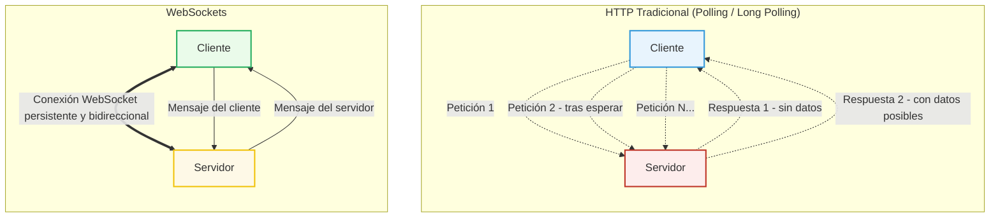
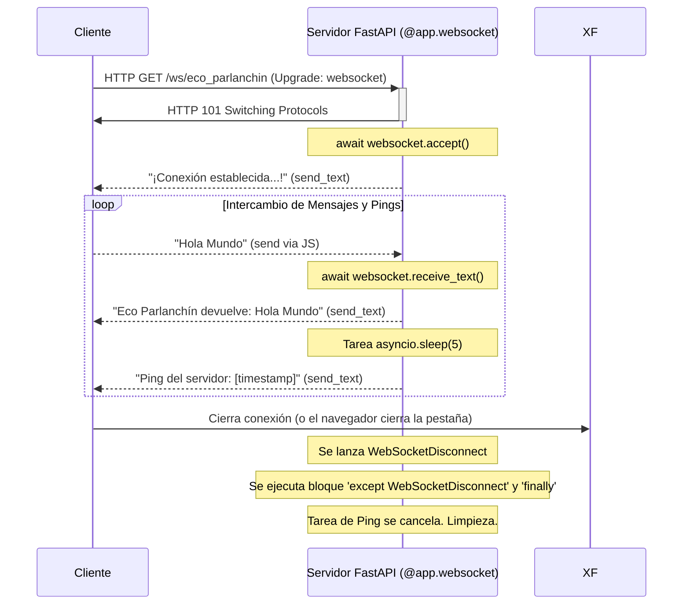
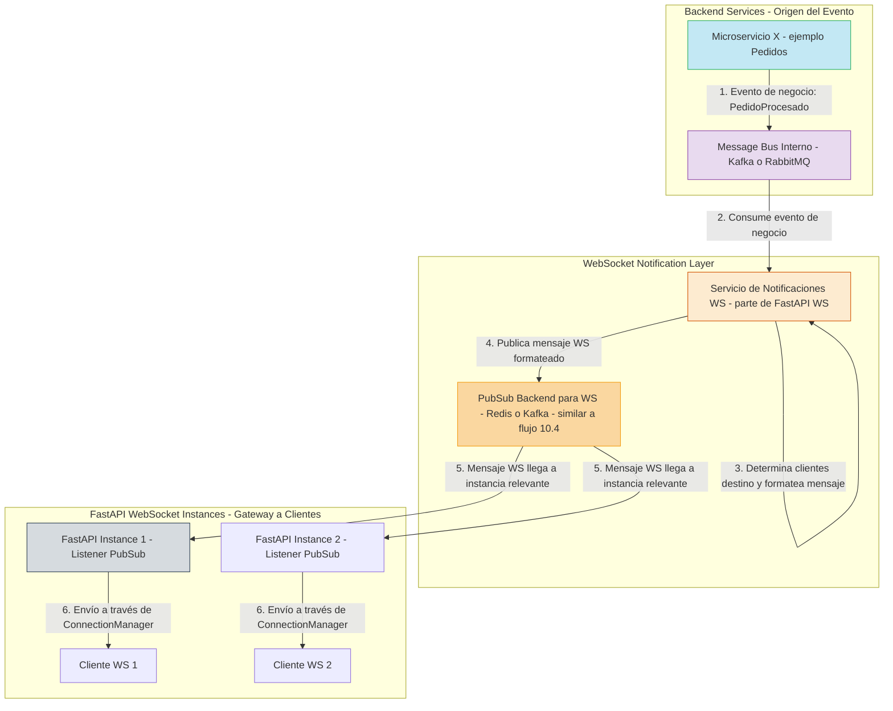
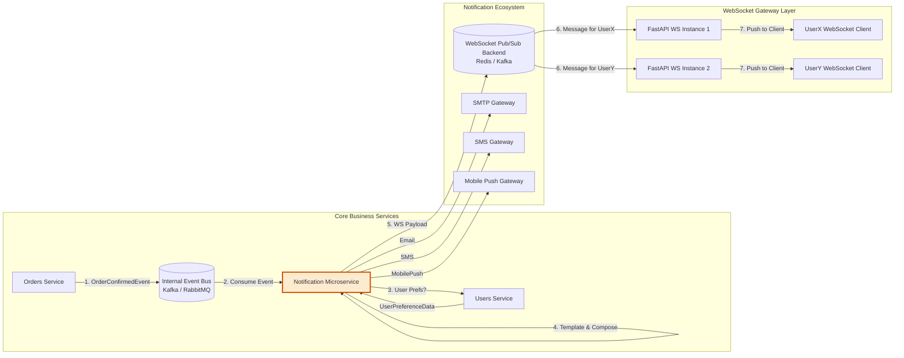

# Tema 10. INTRODUCCIÓN A LOS WEBSOCKETS Y PUB/SUB EN SISTEMAS DISTRIBUIDOS

* [Tema 10. INTRODUCCIÓN A LOS WEBSOCKETS Y PUB/SUB EN SISTEMAS DISTRIBUIDOS](Tema10.md#tema-10-introducción-a-los-websockets-y-pubsub-en-sistemas-distribuidos)
  * [10.1 Casos de uso reales para WebSockets](Tema10.md#101-casos-de-uso-reales-para-websockets)
  * [10.2 Servidor WebSocket con FastAPI](Tema10.md#102-servidor-websocket-con-fastapi)
  * [10.3 Gestión de clientes conectados y salas lógicas](Tema10.md#103-gestión-de-clientes-conectados-y-salas-lógicas)
  * [10.4 Pub/Sub con Redis o Kafka como Backend](Tema10.md#104-pubsub-con-redis-o-kafka-como-backend)
  * [10.5 Push de eventos desde backend a clientes](Tema10.md#105-push-de-eventos-desde-backend-a-clientes)
  * [10.6 Microservicio de notificaciones dedicado](Tema10.md#106-microservicio-de-notificaciones-dedicado)
  * [10.7 Consistencia eventual en eventos enviados](Tema10.md#107-consistencia-eventual-en-eventos-enviados)
  * [10.8 Reconexiones, heartbeats y expiración](Tema10.md#108-reconexiones-heartbeats-y-expiración)
  * [10.9 Seguridad de canales con JWT o API Keys](Tema10.md#109-seguridad-de-canales-con-jwt-o-api-keys)
  * [10.10 Patrones reactivos para tiempo real](Tema10.md#1010-patrones-reactivos-para-tiempo-real)

## 10.1 Casos de uso reales para WebSockets

En el vertiginoso mundo digital de hoy, la inmediatez no es un lujo, es una expectativa. Los usuarios anhelan actualizaciones al instante, colaboración sin fisuras y sistemas que reaccionen en el parpadeo de un ojo. Las arquitecturas tradicionales de petición-respuesta HTTP, aunque fundamentales, a veces se quedan cortas cuando se trata de esta interacción en tiempo real.

Este tema es vuestra iniciación al universo de la comunicación bidireccional y persistente. Exploraremos cómo los **WebSockets** rompen las cadenas del ciclo HTTP clásico y cómo los patrones **Pub/Sub**, a menudo sobrecargados por brokers como Redis o incluso Kafka, pueden alimentar estas experiencias dinámicas.

Antes de sumergirnos en el "cómo", necesitamos inspirarnos con el "por qué" y el "dónde". ¿Qué son exactamente los WebSockets y en qué escenarios se convierten en los héroes indiscutibles de la arquitectura?

**WebSockets: Un Vistazo Rápido al Corazón de la Comunicación Bidireccional** WebSocket no es una petición HTTP que se cierra; es una **conexión persistente y bidireccional (full-duplex)** entre un cliente (normalmente un navegador web, pero también puede ser otro servidor o una app móvil) y un servidor. Se establece inicialmente a través de una "mejora" (upgrade) de una petición HTTP, pero una vez establecida, ambas partes pueden enviar datos en cualquier momento, sin la sobrecarga de nuevas cabeceras HTTP para cada mensaje.

* **La Magia:**
  * **Baja Latencia:** Ideal para cuando cada milisegundo cuenta.
  * **Comunicación Iniciada por el Servidor (Server Push):** El servidor puede enviar datos al cliente sin que este los solicite explícitamente. ¡Adiós al polling incesante!
  * **Eficiencia:** Menos overhead por mensaje en comparación con múltiples peticiones HTTP.



**El Desfile de las Estrellas: Casos de Uso Reales Donde WebSockets Transforman la Experiencia**

Los WebSockets no son una solución para todo, pero donde encajan, brillan con una intensidad que redefine la interacción del usuario y la eficiencia del sistema.

1. **🗣️ Chats y Mensajería Instantánea en Tiempo Real:**
   * **Escenario:** Aplicaciones como Slack, WhatsApp Web, Telegram Web, chats de soporte en vivo.
   * **El Factor WebSocket:** Los mensajes aparecen _instantáneamente_ para todos los participantes. Indicadores de "está escribiendo...", confirmaciones de lectura, presencia de usuarios; todo fluye sin necesidad de recargar la página o esperar a la siguiente encuesta HTTP. La experiencia es fluida y natural.
2. **✍️ Edición Colaborativa de Documentos y Pizarras Virtuales:**
   * **Escenario:** Herramientas como Google Docs, Figma, Miro, donde múltiples usuarios editan el mismo contenido simultáneamente.
   * **El Factor WebSocket:** Cada pulsación de tecla, cada movimiento del cursor, cada nueva forma dibujada por un usuario se transmite inmediatamente a todos los demás colaboradores. WebSockets mantiene la coherencia visual y permite una colaboración sin fricciones, casi como si estuvieran en la misma habitación.
3. **📊 Dashboards de Monitorización y Analíticas en Vivo:**
   * **Escenario:** Paneles de control que muestran métricas de sistemas (CPU, memoria, tráfico de red), logs de aplicaciones en tiempo real, resultados de campañas de marketing que se actualizan al segundo.
   * **El Factor WebSocket:** Los gráficos se actualizan dinámicamente, las nuevas entradas de log aparecen al instante, las alertas críticas se muestran sin demora. Esto permite a los operadores y analistas tomar decisiones basadas en la información más fresca posible.
4. **📍 Seguimiento de Ubicaciones en Vivo (GPS Tracking):**
   * **Escenario:** Aplicaciones de reparto de comida (ver dónde está tu pedido), servicios de transporte compartido (ver la ubicación del conductor), seguimiento de flotas de vehículos o activos.
   * **El Factor WebSocket:** Los iconos en el mapa se mueven suavemente y en tiempo real, reflejando la posición actual sin saltos bruscos ni la necesidad de refrescar constantemente.
5. **🔔 Notificaciones y Alertas Instantáneas en Aplicaciones Web:**
   * **Escenario:** Recibir una notificación de un nuevo email, un "me gusta" en una red social, una alerta de stock para un producto deseado, o una notificación crítica del sistema, todo sin tener que recargar la página.
   * **El Factor WebSocket:** El servidor puede "empujar" estas notificaciones al cliente tan pronto como ocurren, mejorando el engagement y la capacidad de respuesta del usuario.
6. **🎮 Videojuegos Multijugador Online Basados en Navegador:**
   * **Escenario:** Juegos donde las acciones de un jugador deben reflejarse inmediatamente para los demás (juegos de disparos, estrategia en tiempo real, MMOs simples basados en web).
   * **El Factor WebSocket:** Esencial para la baja latencia requerida en el gaming. Las posiciones, acciones y el estado del juego se sincronizan rápidamente entre todos los jugadores.
7. **💹 Plataformas de Trading y Finanzas en Tiempo Real:**
   * **Escenario:** Interfaces web que muestran precios de acciones fluctuantes, gráficos de velas que se actualizan al tick, y permiten la ejecución rápida de órdenes.
   * **El Factor WebSocket:** Los datos del mercado (cotizaciones, volúmenes) se transmiten a los clientes con mínima demora, permitiendo a los traders reaccionar rápidamente a las condiciones cambiantes.
8. **🗳️ Votaciones, Encuestas y Subastas en Vivo:**
   * **Escenario:** Eventos interactivos donde los resultados se actualizan a medida que los usuarios participan, o subastas donde las pujas se reflejan instantáneamente.
   * **El Factor WebSocket:** Crea una experiencia dinámica y emocionante, mostrando el progreso y los cambios en tiempo real a todos los participantes.
9. **🤖 Interacción con Dispositivos IoT (en ciertos contextos):**
   * **Escenario:** Un panel de control web que necesita enviar comandos a un dispositivo conectado (ej. encender una luz, ajustar un termostato) y/o recibir lecturas de sensores en tiempo real de ese dispositivo.
   * **El Factor WebSocket:** Puede servir como un puente eficiente para la comunicación bidireccional entre una interfaz web y dispositivos IoT, especialmente si estos ya tienen capacidad de red y pueden mantener una conexión. (Aunque MQTT suele ser el protocolo dominante para la comunicación IoT-broker).

**Conclusión: Cuando Cada Milisegundo y Cada Interacción Cuentan**

Los WebSockets no son una simple mejora técnica; son un habilitador fundamental para una nueva generación de aplicaciones web interactivas, colaborativas y en tiempo real. Al romper las barreras del ciclo tradicional de petición-respuesta, abren la puerta a experiencias de usuario más ricas, flujos de datos más eficientes y sistemas que se sienten genuinamente "vivos".

En la siguiente sección, veremos cómo FastAPI, nuestro versátil framework, nos permite construir servidores WebSocket y empezar a materializar estos casos de uso. ¡Prepárense para abrir esos canales!

***

## 10.2 Servidor WebSocket con FastAPI

Imagina que eres un mago arcano y FastAPI es tu libro de hechizos. Los WebSockets son un tipo de encantamiento especial que te permite abrir un "portal mágico" persistente entre tu servidor y un cliente. A diferencia de los conjuros HTTP (petición-respuesta-desaparición), este portal permanece abierto, permitiendo un flujo de energía (datos) en ambas direcciones, ¡en tiempo real!

FastAPI, con su elegancia `async` y su integración con Pydantic, hace que este "ritual" de creación de portales WebSocket sea sorprendentemente sencillo y poderoso.

**El Ritual de Conexión: El "Apretón de Manos Mágico" en FastAPI**

Todo comienza con un cliente (un navegador, una app móvil) que desea establecer esta conexión especial.

1.  **Importaciones Esenciales:** Necesitamos las herramientas adecuadas de nuestro libro de hechizos FastAPI.

    ```python
    from fastapi import FastAPI, WebSocket, WebSocketDisconnect
    from typing import List # Aunque no la usemos inmediatamente, es común para gestionar clientes
    import asyncio # Para tareas asíncronas como enviar pings
    ```
2.  **Definiendo el Portal (El Endpoint WebSocket):**\
    Usamos el decorador `@app.websocket("/ruta/del/portal")`. La función decorada recibirá un objeto `WebSocket` como parámetro, que es nuestra interfaz directa con el cliente conectado.

    ```python
    app = FastAPI()

    @app.websocket("/ws/miportal mágico") # ¡Elige una ruta evocadora!
    async def websocket_endpoint_magico(websocket: WebSocket):
        # ... aquí ocurrirá la magia ...
        pass
    ```
3.  **Aceptando la Conexión (El "Pase Usted" del Portal):**\
    Cuando un cliente intenta conectarse a esta ruta, lo primero que _debemos_ hacer en nuestro servidor es aceptar formalmente la conexión. Sin esto, el portal no se abre del todo.

    ```python
    # Dentro de la función websocket_endpoint_magico
    await websocket.accept()
    # ¡El portal está abierto! El cliente ahora está conectado.
    # Podemos enviar un mensaje de bienvenida si queremos.
    await websocket.send_text("¡Bienvenido al Portal Mágico de FastAPI!")
    ```

**La Danza de los Mensajes: Comunicación Bidireccional Fluida**

Una vez abierto el portal, la energía (datos) puede fluir.

1. **El Bucle Infinito de la Conversación:**\
   Para mantener la conexión viva y receptiva, típicamente entramos en un bucle `while True`. Dentro de este bucle, escucharemos los mensajes del cliente y podremos enviarle mensajes de vuelta.
2. **Escuchando al Cliente (El Servidor Atento):**\
   El servidor puede esperar a recibir datos del cliente. FastAPI nos ofrece varios métodos:
   * `data = await websocket.receive_text()`: Para recibir datos como texto.
   * `data = await websocket.receive_bytes()`: Para recibir datos binarios.
   * `data = await websocket.receive_json()`: Para recibir datos y que FastAPI (Pydantic) los parsee automáticamente como JSON a un `dict` o modelo Pydantic.
3. **Hablándole al Cliente (El Servidor Comunicativo):**\
   De igual forma, el servidor puede enviar datos al cliente:
   * `await websocket.send_text("Respuesta del servidor")`
   * `await websocket.send_bytes(b"datos binarios")`
   * `await websocket.send_json({"clave": "valor"})`

**Ejemplo Práctico 1: El Servidor Eco Interactivo y Parlanchín**

Vamos a construir un servidor WebSocket que:

* Acepta la conexión.
* Espera mensajes de texto del cliente.
* Devuelve el mensaje recibido al cliente, prefijado con "Eco: ".
* Adicionalmente, cada 5 segundos, envía un "ping" (un timestamp) al cliente para demostrar la comunicación iniciada por el servidor.

```python
# (Continuación del código anterior)

# ... (importaciones y app = FastAPI() ya definidos) ...

@app.websocket("/ws/eco_parlanchin")
async def websocket_eco_parlanchin(websocket: WebSocket):
    print(f"Cliente intentando conectar a /ws/eco_parlanchin desde {websocket.client.host}:{websocket.client.port}")
    await websocket.accept()
    print(f"Cliente {websocket.client.host}:{websocket.client.port} conectado.")
    await websocket.send_text("¡Conexión establecida con el Eco Parlanchín!")

    async def enviar_ping_periodico():
        """Tarea que envía un 'ping' al cliente cada 5 segundos."""
        while True:
            try:
                await asyncio.sleep(5)
                timestamp = datetime.now(timezone.utc).isoformat() # Asegurar timezone-aware
                await websocket.send_text(f"Ping del servidor: {timestamp}")
                print(f"Ping enviado a {websocket.client.host}:{websocket.client.port}")
            except WebSocketDisconnect:
                print(f"Ping: Cliente {websocket.client.host}:{websocket.client.port} desconectado mientras se esperaba para enviar ping.")
                break # Salir del bucle de ping si el cliente se desconecta
            except Exception as e:
                print(f"Error en enviar_ping_periodico para {websocket.client.host}:{websocket.client.port}: {e}")
                break # Salir en caso de otros errores inesperados con el websocket

    # Crear y ejecutar la tarea de ping en segundo plano
    ping_task = asyncio.create_task(enviar_ping_periodico())

    try:
        while True:
            # Esperar un mensaje del cliente
            datos_recibidos = await websocket.receive_text()
            print(f"Cliente {websocket.client.host}:{websocket.client.port} envió: {datos_recibidos}")
            
            # Responder al cliente
            respuesta = f"Eco Parlanchín devuelve: {datos_recibidos}"
            await websocket.send_text(respuesta)
            print(f"Respuesta enviada a {websocket.client.host}:{websocket.client.port}: {respuesta}")
            
    except WebSocketDisconnect:
        print(f"Cliente {websocket.client.host}:{websocket.client.port} desconectado del Eco Parlanchín.")
    except Exception as e:
        # Otros errores durante receive_text o send_text (ej. si la conexión se cierra abruptamente)
        print(f"Error inesperado con cliente {websocket.client.host}:{websocket.client.port}: {e}")
    finally:
        # Asegurarse de que la tarea de ping se cancele si salimos del bucle principal
        # (por desconexión o error)
        if not ping_task.done():
            ping_task.cancel()
            try:
                await ping_task # Esperar a que la tarea se cancele realmente
            except asyncio.CancelledError:
                print(f"Tarea de ping para {websocket.client.host}:{websocket.client.port} cancelada.")
        print(f"Limpieza finalizada para {websocket.client.host}:{websocket.client.port}.")
        # FastAPI maneja el cierre de la conexión WebSocket si no se ha cerrado ya.
```

_Nótese que para el `timestamp` hemos importado `datetime` y `timezone` de `datetime`._

**La Despedida Elegante: Manejando la Desconexión (`WebSocketDisconnect`)**

Los portales mágicos no permanecen abiertos para siempre. Los clientes pueden desconectarse, o el servidor puede necesitar cerrar la conexión. FastAPI nos notifica de esto lanzando una excepción `WebSocketDisconnect`. Es crucial capturarla para:

* Realizar tareas de limpieza (ej. cancelar tareas en segundo plano asociadas a ese cliente, eliminarlo de listas de clientes activos, etc.).
* Loguear la desconexión.
* Evitar que nuestro servidor crashee si un cliente desaparece abruptamente.

El bloque `try...except WebSocketDisconnect:` en el ejemplo anterior se encarga de esto. El `finally` asegura que la tarea de ping se cancele.

**Código Completo del Servidor WebSocket Básico en FastAPI (para ejecutar):**

```python
# main.py
from fastapi import FastAPI, WebSocket, WebSocketDisconnect
from typing import List
import asyncio
from datetime import datetime, timezone # Importar datetime y timezone

app = FastAPI(title="Servidor WebSocket Mágico")

# (Opcional) Lista para mantener un registro de clientes conectados, útil para 10.3
# active_connections: List[WebSocket] = [] 

@app.websocket("/ws/eco_parlanchin")
async def websocket_eco_parlanchin(websocket: WebSocket):
    client_id = f"{websocket.client.host}:{websocket.client.port}"
    print(f"Cliente intentando conectar: {client_id}")
    await websocket.accept()
    print(f"Cliente conectado: {client_id}")
    # active_connections.append(websocket) # Si gestionamos lista de clientes
    
    await websocket.send_text("¡Conexión establecida con el Eco Parlanchín!")

    async def enviar_ping_periodico():
        while True:
            try:
                # Verificar si el websocket sigue en un estado "conectado" antes de enviar.
                # Esto es una comprobación adicional, ya que send_text fallará si está cerrado.
                if websocket.client_state == websocket.client_state.CONNECTED and \
                   websocket.application_state == websocket.application_state.CONNECTED:
                    await asyncio.sleep(5)
                    timestamp = datetime.now(timezone.utc).isoformat()
                    await websocket.send_text(f"Ping del servidor: {timestamp}")
                    print(f"Ping enviado a {client_id}")
                else:
                    print(f"Ping: Websocket {client_id} no está en estado conectado, deteniendo ping.")
                    break 
            except WebSocketDisconnect:
                print(f"Ping: Cliente {client_id} desconectado (detectado en ping).")
                break
            except Exception as e: # Captura cualquier otro error durante el envío del ping
                print(f"Error en enviar_ping_periodico para {client_id}: {e}. Deteniendo ping.")
                break
                
    ping_task = asyncio.create_task(enviar_ping_periodico())

    try:
        while True:
            datos_recibidos = await websocket.receive_text()
            print(f"Cliente {client_id} envió: {datos_recibidos}")
            
            respuesta = f"Eco Parlanchín devuelve: {datos_recibidos}"
            await websocket.send_text(respuesta)
            print(f"Respuesta enviada a {client_id}: {respuesta}")
            
    except WebSocketDisconnect:
        print(f"Cliente {client_id} desconectado (detectado en bucle principal).")
    except Exception as e:
        print(f"Error inesperado con cliente {client_id}: {e}")
    finally:
        # active_connections.remove(websocket) # Si gestionamos lista de clientes
        if not ping_task.done():
            ping_task.cancel()
            try:
                await ping_task
            except asyncio.CancelledError:
                print(f"Tarea de ping para {client_id} cancelada.")
        print(f"Limpieza finalizada para {client_id}. Conexión cerrada.")
        # No es necesario llamar a websocket.close() explícitamente aquí si la excepción
        # es WebSocketDisconnect o si el contexto del endpoint finaliza.
        # FastAPI se encarga del cierre si el manejador termina.
        # Sin embargo, si sales del bucle por otra razón y quieres cerrar activamente:
        # if websocket.client_state == websocket.client_state.CONNECTED:
        #     await websocket.close()

# Para ejecutar: uvicorn main:app --reload
```

**Probando Tu Creación: Un Vistazo desde el Lado del Cliente**

Para interactuar con este endpoint, puedes usar:

*   **JavaScript en una página HTML simple:**

    ```html
    <!DOCTYPE html>
    <html> <head><title>Test WebSocket</title></head>
    <body>
        <input type="text" id="messageInput" placeholder="Escribe un mensaje..."/>
        <button onclick="sendMessage()">Enviar</button>
        <div id="messages"></div>
        <script>
            const messageDiv = document.getElementById('messages');
            const ws = new WebSocket("ws://localhost:8000/ws/eco_parlanchin"); // Ajusta puerto si es necesario

            ws.onopen = (event) => {
                messageDiv.innerHTML += "<p>Conectado al Eco Parlanchín!</p>";
            };
            ws.onmessage = (event) => {
                messageDiv.innerHTML += `<p>Servidor: ${event.data}</p>`;
            };
            ws.onclose = (event) => {
                messageDiv.innerHTML += "<p>Desconectado del Eco Parlanchín.</p>";
            };
            ws.onerror = (error) => {
                messageDiv.innerHTML += `<p style="color:red;">Error: ${error.message}</p>`;
            };
            function sendMessage() {
                const input = document.getElementById('messageInput');
                ws.send(input.value);
                input.value = '';
            }
        </script>
    </body></html>
    ```

    _(Guarda esto como `test.html` y ábrelo en tu navegador)._
*   **Herramientas de línea de comandos:** `wscat` (instalable con `npm install -g wscat`) o `websocat`.

    ```bash
    wscat -c ws://localhost:8000/ws/eco_parlanchin
    ```
* **Clientes WebSocket en Postman o Insomnia.**

**Diagrama del Ciclo de Vida Simplificado:**



**Consideraciones Clave para Tu Primer Servidor:**

* **Manejo de Errores Más Allá de `WebSocketDisconnect`:** ¿Qué pasa si `websocket.send_text()` falla por una razón que no sea una desconexión limpia (ej. buffer lleno, error de red subyacente)? Aunque `aio-pika` y FastAPI manejan mucho, considera `try-except` adicionales alrededor de las operaciones de envío/recepción si realizas lógica compleja que podría fallar.
* **Tipos de Datos:** Hemos usado `_text`. Recuerda que tienes `_json` (muy útil con Pydantic para enviar/recibir modelos) y `_bytes` para datos binarios.
* **Bloqueo:** Gracias a `async` y `await`, las operaciones de red de WebSocket no bloquean el servidor FastAPI, permitiéndole manejar múltiples clientes concurrentemente. ¡Este es el poder de `asyncio`!

¡Felicidades, artífice de la conexión! Has construido tu primer servidor WebSocket con FastAPI. Has abierto un canal directo, persistente y bidireccional. Este es el ladrillo fundamental sobre el que se construyen las aplicaciones en tiempo real más sofisticadas.

Pero un solo portal, aunque mágico, tiene sus limitaciones. ¿Qué pasa cuando necesitas gestionar docenas, cientos o miles de conexiones? ¿Cómo los organizas? ¿Cómo envías mensajes a grupos específicos? Esas son las preguntas que nos guiarán en la siguiente sección.

***

## 10.3 Gestión de clientes conectados y salas lógicas

En la sección 10.2, abrimos nuestro primer `endpoint` `WebSocket` y establecimos una conexión individual. Ahora, el desafío es gestionar múltiples `clients` conectados concurrentemente y organizarlos en agrupaciones lógicas, comúnmente conocidas como `rooms` (salas) o `channels`. Esto es fundamental para aplicaciones como `chat rooms`, herramientas colaborativas o sistemas de notificación por `topic`.

Piensa en tu servidor FastAPI como el `host` de una gran conferencia. No solo das la bienvenida a cada asistente (`WebSocket connection`), sino que necesitas un registro de quiénes están presentes (`connected clients`), en qué `session` o `track` (nuestras `logical rooms`) están participando, y cómo enviar anuncios generales o mensajes a grupos específicos.

**Bloque de Construcción 1: El `ConnectionManager` – Tu Registro Central de `Clients`**

Necesitamos una entidad que centralice la información de quién está conectado.

* **Responsabilidades del `ConnectionManager`:**
  * **`Connect`:** Cuando un nuevo `client` (`WebSocket`) se conecta, registrarlo.
  * **`Disconnect`:** Cuando un `client` se desconecta (`WebSocketDisconnect`), eliminarlo del registro.
  * **`Broadcast` (General):** Enviar un `message` a todos los `active connections`.

```python
# connection_manager.py
from fastapi import WebSocket
from typing import List, Set, Dict
import logging

logger = logging.getLogger(__name__)

class ConnectionManager:
    def __init__(self):
        self.active_connections: List[WebSocket] = []
        self.rooms: Dict[str, Set[WebSocket]] = {} # room_id -> Set of WebSockets
        logger.info("ConnectionManager initialized.")

    async def connect(self, websocket: WebSocket):
        await websocket.accept()
        self.active_connections.append(websocket)
        client_id = f"{websocket.client.host}:{websocket.client.port}"
        logger.info(f"New client connected: {client_id}. Total active: {len(self.active_connections)}")

    def disconnect(self, websocket: WebSocket):
        client_id = f"{websocket.client.host}:{websocket.client.port}"
        if websocket in self.active_connections:
            self.active_connections.remove(websocket)
            logger.info(f"Client disconnected: {client_id}. Total active: {len(self.active_connections)}")
        
        rooms_to_clean = []
        for room_id, members in self.rooms.items():
            if websocket in members:
                members.remove(websocket)
                logger.info(f"Client {client_id} removed from room '{room_id}'.")
                if not members:
                    rooms_to_clean.append(room_id)
        
        for room_id in rooms_to_clean:
            del self.rooms[room_id]
            logger.info(f"Room '{room_id}' empty and deleted.")

    async def broadcast_to_all(self, message: str):
        logger.info(f"Broadcasting to all ({len(self.active_connections)} clients): '{message}'")
        for connection in list(self.active_connections): 
            try:
                await connection.send_text(message)
            except Exception as e:
                logger.error(f"Error broadcasting to {connection.client.host}:{connection.client.port}: {e}. Disconnecting.")
                self.disconnect(connection)
```

**Usando el `ConnectionManager` en FastAPI:**\
Se crea una `instance` del `ConnectionManager`.

```python
# main.py
from fastapi import FastAPI, WebSocket, WebSocketDisconnect, Path
# from connection_manager import ConnectionManager (if in a separate file)
import logging

logging.basicConfig(level=logging.INFO)
app = FastAPI()
manager = ConnectionManager() # Global instance

@app.websocket("/ws/global_feed")
async def websocket_global_feed(websocket: WebSocket):
    await manager.connect(websocket)
    try:
        while True:
            data = await websocket.receive_text()
            broadcast_message = f"Global Feed from {websocket.client.host}:{websocket.client.port}: {data}"
            await manager.broadcast_to_all(broadcast_message)
    except WebSocketDisconnect:
        manager.disconnect(websocket)
        await manager.broadcast_to_all(f"Info: Client {websocket.client.host}:{websocket.client.port} left the global feed.")
    except Exception as e:
        logger.error(f"Unexpected error with {websocket.client.host}:{websocket.client.port} in global_feed: {e}")
        manager.disconnect(websocket)
```

**Bloque de Construcción 2: `Logical Rooms` – Espacios Compartidos**

Ahora, extendemos el `ConnectionManager` para que gestione estas `rooms`.

*   **Ampliando el `ConnectionManager` para `Rooms`:**\
    Ya hemos añadido `self.rooms: Dict[str, Set[WebSocket]] = {}`.\
    Métodos para que los `clients` hagan `join` y `leave` de las `rooms`, y para enviar `messages` a `rooms` específicas.

    ```python
    # En la clase ConnectionManager (connection_manager.py)

    async def join_room(self, room_id: str, websocket: WebSocket):
        client_id = f"{websocket.client.host}:{websocket.client.port}"
        if room_id not in self.rooms:
            self.rooms[room_id] = set()
        
        if websocket not in self.rooms[room_id]:
            self.rooms[room_id].add(websocket)
            logger.info(f"Client {client_id} joined room '{room_id}'. Members: {len(self.rooms[room_id])}")
            await self.send_to_room(room_id, f"Info: {client_id} has joined room '{room_id}'.", exclude_sender=None)
        else:
            logger.info(f"Client {client_id} was already in room '{room_id}'.")

    async def leave_room(self, room_id: str, websocket: WebSocket): # Este método puede ser llamado explícitamente o por disconnect
        client_id = f"{websocket.client.host}:{websocket.client.port}"
        if room_id in self.rooms and websocket in self.rooms[room_id]:
            self.rooms[room_id].remove(websocket)
            logger.info(f"Client {client_id} left room '{room_id}'. Remaining members: {len(self.rooms[room_id])}")
            if not self.rooms[room_id]:
                del self.rooms[room_id]
                logger.info(f"Room '{room_id}' empty and deleted.")
            await self.send_to_room(room_id, f"Info: {client_id} has left room '{room_id}'.", exclude_sender=None)

    async def send_to_room(self, room_id: str, message: str, exclude_sender: WebSocket = None):
        if room_id in self.rooms:
            members_in_room = list(self.rooms[room_id])
            logger.info(f"Sending to room '{room_id}' ({len(members_in_room)} members): '{message}'")
            for member_ws in members_in_room:
                if member_ws != exclude_sender:
                    try:
                        await member_ws.send_text(message)
                    except Exception as e:
                        logger.error(f"Error sending to member of room '{room_id}': {e}. Disconnecting.")
                        self.disconnect(member_ws) # Limpia la conexión fallida globalmente
    ```

**Usando `Rooms` en FastAPI: Un `Chat Room` por `Topic`**\
Un `endpoint` donde el `room_name` es parte de la `URL path`.

```python
# main.py (continuación)

@app.websocket("/ws/chat/{room_id}/{client_name}")
async def websocket_chat_room(
    websocket: WebSocket,
    room_id: str = Path(...), 
    client_name: str = Path(...)
):
    await manager.connect(websocket) # Acepta y añade a active_connections
    await manager.join_room(room_id, websocket) # Une a la room específica

    try:
        while True:
            data = await websocket.receive_text()
            formatted_message = f"({room_id}) {client_name}: {data}"
            await manager.send_to_room(room_id, formatted_message, exclude_sender=websocket)
            
    except WebSocketDisconnect:
        logger.info(f"{client_name} disconnected from room '{room_id}'.")
        # La lógica de `manager.disconnect(websocket)` (llamada en el finally) 
        # ya se encarga de removerlo de la sala.
        # Si quisiéramos enviar una notificación de "salida" específica de este `endpoint`:
        # await manager.send_to_room(room_id, f"Info: {client_name} has left.", exclude_sender=websocket)
    except Exception as e:
        logger.error(f"Unexpected error with {client_name} in room '{room_id}': {e}")
    finally:
        manager.disconnect(websocket) # Fundamental para limpiar de active_connections y de todas las rooms.
        logger.info(f"Connection finalized for {client_name} from room '{room_id}'.")
```

**Visualizando la Estructura (igual que antes, pero ahora los términos son los correctos):**

```mermaid
graph LR
    subgraph "FastAPI Server"
        CM[ConnectionManager<br/>active_connections: [WS1,WS2,WS3,WS4]<br/>rooms: {'RoomX': {WS1,WS2}, 'RoomY': {WS3}}]

        EP_Global["/ws/global_feed"] -- Interacts with --> CM
        EP_RoomX["/ws/chat/RoomX/{name}"] -- Interacts with --> CM
        EP_RoomY["/ws/chat/RoomY/{name}"] -- Interacts with --> CM
    end

    WS1[Client 1<br/>(Connected to RoomX)] --> EP_RoomX
    WS2[Client 2<br/>(Connected to RoomX)] --> EP_RoomX
    WS3[Client 3<br/>(Connected to RoomY)] --> EP_RoomY
    WS4[Client 4<br/>(Connected to Global)] --> EP_Global
    
    CM -- broadcast_to_all() --> WS1
    CM -- broadcast_to_all() --> WS2
    CM -- broadcast_to_all() --> WS3
    CM -- broadcast_to_all() --> WS4

    CM -- send_to_room('RoomX', ...) --> WS1
    CM -- send_to_room('RoomX', ...) --> WS2
    CM -- send_to_room('RoomY', ...) -.-> WS3

    style CM fill:#D5F5E3,stroke:#2ECC71
```

**Puntos Clave de este Enfoque (Refinado):**

* **`Centralized Management`:** El `ConnectionManager` es el `single source of truth` (después de la aclaración, evito la traducción directa si el concepto en inglés es fuerte y de uso común, como aquí) sobre quién está conectado y dónde.
* **`Clarity`:** Las responsabilidades están bien definidas: `connect`, `disconnect`, `join_room`, `leave_room`, `broadcast_to_all`, `send_to_room`.
* **`Cleanup`:** Es crucial manejar la eliminación de `WebSockets` de `active_connections` y de `rooms` cuando un `client` se desconecta. El método `disconnect` del `ConnectionManager` es ahora el principal responsable de esta limpieza integral.
* **`Concurrency` (Implícita con FastAPI y `asyncio`):** Cada conexión `WebSocket` es manejada por su propia `asyncio task`. Las operaciones sobre `lists` y `dicts` (o `sets`) del `ConnectionManager` son generalmente `atomic` en Python y seguras para este tipo de uso con `asyncio`. Para escenarios de muy alta `concurrency` o modificaciones complejas, se podrían considerar `asyncio synchronization primitives` (`Lock`), pero para esta gestión suele ser suficiente.
* **`Endpoint Simplicity`:** Los `endpoints` `WebSocket` se mantienen relativamente simples, delegando la lógica de gestión al `ConnectionManager`.

**Próximos Desafíos (que este `in-memory manager` aún no resuelve):**

* **`Horizontal Scaling`:** Múltiples `instances` de este servidor FastAPI no compartirán el estado del `ConnectionManager`.
* **`Persistence`:** Si el servidor FastAPI reinicia, toda la información de `rooms` y `connections` se pierde.

Estos desafíos nos preparan para la sección **10.4**, donde un `backend` de `Pub/Sub` externo (como Redis o Kafka) se vuelve esencial.

**Conclusión (Refinada): Tu Edificio Inteligente Toma Forma**

Ahora tienes las herramientas para construir no solo una puerta de entrada (`endpoint`), sino un edificio completo con `active residents` y `vibrant common areas` (`rooms`). Has aprendido a registrar quién entra y sale (`connect`/`disconnect`), y a dirigir comunicaciones generales (`broadcast`) o específicas a grupos (`send_to_room`). Esta gestión de `connections` y `rooms` es la base para crear aplicaciones `WebSocket` interactivas y `multi-user` verdaderamente ricas con FastAPI.

El siguiente paso es romper las barreras de una única `server instance` y llevar nuestras `rooms` y `notifications` a una escala distribuida.

***

He revisado y ajustado el 10.3 para adherirme más estrictamente al uso de términos técnicos en inglés donde son comunes y estándar en la industria, evitando "castellanizarlos". Espero que esta versión refinada se alinee mejor con tus expectativas para el curso.

Ahora sí, ¿procedemos con el **10.4: Pub/Sub con Redis o Kafka como backend**?

***

## 10.4 Pub/Sub con Redis o Kafka como Backend

En la sección 10.3, construimos un `ConnectionManager` en memoria para gestionar `active WebSocket connections` y `logical rooms`. Este enfoque es funcional y didáctico para una única `server instance` de FastAPI. Sin embargo, en escenarios de producción que demandan alta disponibilidad y escalabilidad horizontal –donde múltiples `instances` de nuestra aplicación FastAPI operan detrás de un `load balancer`– este modelo `in-memory` presenta una limitación fundamental: **el aislamiento de estado**. Cada `instance` tendría su propio `ConnectionManager`, ciego a las `connections` y `room memberships` gestionadas por sus pares.

Para trascender esta limitación y habilitar una comunicación `WebSocket` fluida y consistente a través de un clúster de `application instances`, necesitamos un **`backend` de `Publish/Subscribe (Pub/Sub)` externo**. Este `backend` actuará como una `message bus` o `backplane` compartida, permitiendo que las `instances` se comuniquen indirectamente y coordinen la entrega de mensajes a los `WebSocket clients` correctos, independientemente de a qué `instance` del servidor estén conectados.

Dos candidatos prominentes para este rol son **Redis** (con su funcionalidad `Pub/Sub`) y **Apache Kafka**.

**El Problema Inherente al Escalado Horizontal de `WebSockets` con Estado en Memoria:**

Imaginemos el escenario:

* `Instance A` de FastAPI gestiona la `WebSocket connection` del `User1`, quien está en `room_chat_general`.
* `Instance B` de FastAPI gestiona la `WebSocket connection` del `User2`, quien también está en `room_chat_general`.
* Si `User1` envía un mensaje a `room_chat_general` a través de `Instance A`, el `ConnectionManager` local de `Instance A` no tiene conocimiento de `User2` en `Instance B`. El mensaje no llegaría a `User2`.

**La Solución: Un `Pub/Sub Backend` como Sistema Nervioso Central**

El `Pub/Sub backend` desacopla la transmisión de mensajes entre `server instances`:

1. Una `server instance` (ej. `Instance A`) recibe un mensaje `WebSocket` de un `client`.
2. En lugar de (o además de) intentar un `broadcast` solo a sus `clients` locales, `Instance A` **publica** este mensaje en un `channel` o `topic` específico del `Pub/Sub backend` (ej. `redis_channel_room_chat_general` o `kafka_topic_room_chat_general`).
3. **Todas** las `server instances` (A, B, C...) están **suscritas** a los `channels/topics` relevantes en el `Pub/Sub backend`.
4. Cuando un mensaje es publicado en un `channel/topic` al que están suscritas, todas las `instances` lo reciben.
5. Cada `instance` entonces utiliza su `ConnectionManager` local para retransmitir el mensaje a los `WebSocket clients` que tiene conectados _localmente_ y que pertenecen a la `room` o `target audience` correspondiente.

**Opción 1: Redis `Pub/Sub` – El `Backplane` Ligero y de Alto Rendimiento**

Redis, más allá de su rol como caché y `data store` clave-valor, ofrece un mecanismo `Pub/Sub` nativo.

* **Características y Adecuación:**
  * **Velocidad Extrema:** Las operaciones `PUBLISH` y la entrega a `subscribers` son muy rápidas.
  * **Simplicidad:** La API de `Pub/Sub` en Redis es conceptualmente sencilla.
  * **"Best-Effort Delivery" / Efímero:** En su modo `Pub/Sub` estándar, si un `subscriber` no está conectado y escuchando en el momento de la publicación, el mensaje se pierde para ese `subscriber`. Redis `Pub/Sub` no persiste los mensajes de `Pub/Sub` en colas para entrega posterior a `subscribers` desconectados (a diferencia de Redis Streams, que es una alternativa más robusta para mensajería persistente en Redis).
  * **Ideal para:** Notificaciones en tiempo real donde la pérdida ocasional de un mensaje (si una `instance` de servidor está reiniciando justo en ese momento) podría ser tolerable, o donde la lógica de la aplicación puede manejar la recuperación de estado de otra manera. Perfecto para `broadcasts` de mensajes de `chat` o actualizaciones de estado volátiles.
* **Flujo de Implementación con `aioredis` en FastAPI:**_(Requiere `pip install aioredis`)_
  1. **Inicialización:** Cada `instance` de FastAPI, al arrancar (ej. en un evento `lifespan` o `startup`), establece dos tipos de conexiones con Redis: una para publicar (`publisher`) y otra para suscribirse (`subscriber`). La conexión de `subscriber` debe ser dedicada, ya que entra en un bucle de escucha.
  2.  **Publicación (desde el `WebSocket endpoint` o `RoomManager`):**\
      Cuando una `instance` recibe un mensaje `WebSocket` que necesita ser distribuido:

      ```python
      # En un servicio o el ConnectionManager modificado
      # self.redis_publisher = await aioredis.from_url("redis://localhost:6379")

      async def publish_to_redis_channel(self, room_id: str, message_payload: dict):
          channel_name = f"room:{room_id}" # Define una convención para los nombres de canal
          # El payload podría incluir el mensaje original, quién lo envió, etc.
          # para evitar ecos o para enriquecer el mensaje.
          await self.redis_publisher.publish(channel_name, json.dumps(message_payload))
      ```
  3.  **Suscripción y Escucha (Tarea en Segundo Plano por `Instance`):**\
      Una tarea `asyncio` corre continuamente en cada `instance`, escuchando los canales Redis.

      ```python
      # En el DistributedRoomManager o un componente listener
      # self.redis_subscriber_connection = await aioredis.from_url("redis://localhost:6379")
      # self.pubsub = self.redis_subscriber_connection.pubsub()
      # await self.pubsub.psubscribe(f"room:*") # psubscribe para patrones

      async def _redis_message_listener(self): # self aquí es el DistributedRoomManager
          async for message in self.pubsub.listen():
              if message and message.get("type") == "pmessage": # o "message" si es subscribe normal
                  channel = message["channel"].decode('utf-8')
                  room_id = channel.split(":", 1)[1]
                  data_payload_str = message["data"].decode('utf-8')
                  message_content = json.loads(data_payload_str) # Contiene el mensaje real a enviar

                  # Lógica para evitar el eco al sender original si el payload lo identifica
                  # original_sender_connection_id = message_content.get("original_sender_conn_id")

                  # Usar el ConnectionManager local para enviar a los WebSockets de ESTA instancia
                  await self.local_manager.broadcast_to_local_clients_in_room(
                      room_id, 
                      message_content["actual_message"], # Asumiendo estructura del payload
                      # exclude_conn_id=original_sender_connection_id 
                  )
      ```

      _La `local_manager` es la instancia del `ConnectionManager` (de 10.3) que gestiona los `WebSockets` directamente conectados a esta `instance` de FastAPI.El `broadcast_to_local_clients_in_room` itera sobre los `WebSockets` locales de la sala y envía, posiblemente excluyendo al remitente original si se puede identificar._
* **Diagrama Conceptual:**

**Opción 2: Apache Kafka como `Backend` de `Pub/Sub` – El `Event Streaming Platform` para Máxima Robustez**

Kafka puede usarse de manera similar, pero su naturaleza es diferente.

* **Características y Adecuación:**
  * **Persistencia de Mensajes:** Los mensajes en los `topics` de Kafka son duraderos y pueden ser retenidos por largos periodos. Esto permite "releer" mensajes si una `instance` estuvo caída, o para auditoría (aunque para `WebSockets` efímeros, esto puede ser `overkill` o requerir una gestión de `offsets` cuidadosa).
  * **Alto `Throughput` y Escalabilidad:** Diseñado para volúmenes masivos de eventos.
  * **Complejidad:** Mayor complejidad operativa y de configuración que Redis `Pub/Sub`.
  * **Ideal para:** Sistemas que ya usan Kafka para otros flujos de eventos, cuando la persistencia de estos mensajes inter-servidor es un requisito, o para volúmenes de `broadcast` extremadamente altos.
* **Flujo de Implementación con `aiokafka` en FastAPI:**
  1.  **Publicación:**\
      La `instance` de FastAPI que recibe el `WebSocket message` lo publica en un `topic` Kafka. La `key` del mensaje Kafka podría ser el `room_id` para asegurar que todos los mensajes de una misma `room` vayan a la misma `partition` (si el orden dentro de la `room` es importante a nivel de Kafka, aunque el orden final a los `WebSockets` dependerá de la lógica del consumidor).

      ```python
      # En un servicio o el ConnectionManager modificado
      # self.kafka_producer = AIOKafkaProducer(bootstrap_servers='kafka_broker1:9092')
      # await self.kafka_producer.start()

      async def publish_to_kafka_topic(self, room_id: str, message_payload: dict):
          topic_name = f"websocket_room_messages" # O un topic por room: f"room_feed_{room_id}"
          # El payload podría incluir el mensaje original, quién lo envió, etc.
          await self.kafka_producer.send_and_wait(
              topic_name, 
              key=room_id.encode('utf-8'), 
              value=json.dumps(message_payload).encode('utf-8')
          )
      ```
  2.  **Suscripción y Escucha:**\
      Cada `instance` de FastAPI ejecuta un `AIOKafkaConsumer`. Para asegurar que todas las `instances` reciban todos los mensajes de `room` (y puedan hacer `broadcast` a sus `clients` locales), cada `instance` debe:

      * Suscribirse a los `topics` relevantes.
      * Pertenecer a un **`consumer group` diferente** o consumir todas las `partitions` de un `topic` si están en el mismo `group_id` pero se espera un `broadcast` a todos los servidores. (Si todas las `instances` usan el mismo `group_id`, Kafka balanceará las `partitions` entre ellas, y un mensaje de una `partition` solo irá a una `instance` de ese grupo, lo cual no es lo que queremos para un `broadcast` general a todos los `WebSocket clients` de una `room` a través de todas las `instances`)._La forma más simple para el `broadcast` inter-servidor es que cada `instance` actúe como un `subscriber` independiente (propio `group_id` aleatorio o específico de la `instance`)._

      ```python
      # En el DistributedRoomManager o un componente listener
      # self.kafka_consumer = AIOKafkaConsumer(
      #     "websocket_room_messages", # O una lista de topics/patrón
      #     group_id=f"websocket_server_instance_{unique_instance_id()}", # Grupo único por instancia
      #     bootstrap_servers='kafka_broker1:9092',
      #     value_deserializer=lambda v: json.loads(v.decode('utf-8')),
      #     key_deserializer=lambda k: k.decode('utf-8') if k else None,
      #     enable_auto_commit=False
      # )
      # await self.kafka_consumer.start()

      async def _kafka_message_listener(self): # self aquí es el DistributedRoomManager
          async for msg in self.kafka_consumer:
              try:
                  room_id = msg.key # Asumiendo que la room_id es la clave del mensaje Kafka
                  message_content = msg.value # Ya deserializado
                  
                  # Lógica para evitar eco...
                  # original_sender_connection_id = message_content.get("original_sender_conn_id")

                  await self.local_manager.broadcast_to_local_clients_in_room(
                      room_id, 
                      message_content["actual_message"],
                      # exclude_conn_id=original_sender_connection_id
                  )
                  await self.kafka_consumer.commit() # Commit manual
              except Exception as e:
                  print(f"Error procesando mensaje de Kafka: {e}") # Manejo de errores, DLQ, etc.
      ```

**Consideraciones Adicionales para Ambos Enfoques:**

* **Identificación del Remitente Original (Evitar Eco):** El mensaje publicado al `Pub/Sub backend` debe contener suficiente información (ej. un `WebSocket session ID` único del remitente original o un `server instance ID`) para que la lógica de retransmisión en cada `instance` pueda evitar enviar el mensaje de vuelta al `client` que lo originó, si ese `client` está conectado a la misma `instance` que está procesando el mensaje del `Pub/Sub`.
* **Serialización:** Los mensajes deben ser serializados (JSON es común y simple) antes de publicarlos en Redis/Kafka y deserializados por los `subscribers`.
* **Gestión de Conexiones al `Backend`:** Las conexiones a Redis/Kafka deben ser gestionadas robustamente (reintentos, cierre adecuado al apagar la aplicación FastAPI).
* **`Message Ordering`:** Redis `Pub/Sub` no garantiza el orden. Kafka garantiza el orden _dentro de una `partition`_. Si el orden global de los mensajes `WebSocket` en una `room` es crítico, se debe diseñar cuidadosamente (ej. usando una única `partition` por `room` en Kafka, lo que limita el paralelismo de consumo para esa `room`). Para muchas aplicaciones de `chat` o notificación, un ordenamiento "razonable" suele ser suficiente.

**Conclusión: Escalando la Interactividad Sin Límites (Casi)**

La integración de un `Pub/Sub backend` como Redis o Kafka es el salto cuántico que permite a tus aplicaciones `WebSocket` basadas en FastAPI escalar horizontalmente, manteniendo a todos los usuarios sincronizados a través de múltiples `server instances`.

* **Redis `Pub/Sub`** ofrece una solución ligera y de altísima velocidad, excelente para `broadcasts` efímeros y notificaciones donde la simplicidad y la baja latencia son primordiales.
* **Kafka** provee una plataforma de `streaming` de eventos más robusta, con persistencia y `throughput` masivo, adecuada para escenarios complejos o cuando ya forma parte de tu ecosistema de eventos.

La elección dependerá de tus necesidades específicas de durabilidad, volumen, complejidad y la infraestructura existente. Con esta pieza en su lugar, estás preparado para construir sistemas `WebSocket` verdaderamente distribuidos y de gran escala.

***

He intentado mantener el lenguaje técnico preciso y usar los términos en inglés conforme a tu solicitud, además de estructurar la información para un público profesional. La idea es mostrar no solo el "cómo" sino también el "por qué" de usar estos `backends` para el escalado.

¿Procedemos con el **10.5: Push de eventos desde backend a clientes**?

***

## 10.5 Push de eventos desde backend a clientes

Para el **10.5: Push de eventos desde backend a clientes**, vamos a refinar aún más el enfoque. No solo se trata de _cómo_ el `backend` puede enviar mensajes a través de `WebSockets` (ya lo hemos tocado), sino de _cuándo_, _por qué_, y _cómo orquestar_ este `push` de forma reactiva y eficiente en un sistema distribuido, conectando con los conceptos de `Pub/Sub` que acabamos de ver.

Imagina que tus clientes `WebSocket` no solo están esperando respuestas a sus acciones, sino que están sintonizados a un canal de noticias en vivo donde el `backend` es el presentador estrella, anunciando eventos importantes tan pronto como ocurren en cualquier parte del sistema.

Hasta ahora, hemos visto cómo los `WebSockets` permiten una comunicación bidireccional: el `client` envía un mensaje y el `server` puede responder. Pero la verdadera magia de las aplicaciones en tiempo real a menudo reside en la capacidad del **`server` para iniciar la comunicación y hacer `push` de eventos a los `clients` de forma proactiva**, sin que estos hayan realizado una solicitud inmediata.

Esto es fundamental para notificaciones, actualizaciones en vivo, `broadcasts` de estado, etc. Ya hemos sentado las bases con la gestión de `connections` y `rooms` (10.3) y la comunicación inter-servidor con `Pub/Sub` (10.4). Ahora, vamos a consolidar cómo orquestar este `push` de manera efectiva.

**¿Por Qué el `Server Push` es un Cambio de Juego?**

* **Inmediatez:** Los `clients` reciben información tan pronto como está disponible en el `backend`, sin necesidad de `polling`.
* **Eficiencia:** Reduce el tráfico de red innecesario del `polling` y la carga en el `server`.
* **Experiencia de Usuario Reactiva:** Las UIs se actualizan en tiempo real, creando una sensación de dinamismo y conexión directa con el sistema.
* **Desacoplamiento de Acciones y Notificaciones:** Una acción en una parte del sistema (ej. un `microservice` diferente actualiza un dato) puede desencadenar una notificación `WebSocket` a `clients` interesados, incluso si esos `clients` no iniciaron la acción original.

**El Flujo Arquitectónico del `Server Push` en un Sistema Distribuido:**

Consideremos un escenario donde un evento de negocio ocurre en alguna parte de nuestro `backend` (podría ser en la misma `FastAPI instance` que maneja `WebSockets`, o en un `microservice` completamente separado) y queremos notificar a los `WebSocket clients` relevantes.

1. **Origen del Evento:**
   * Un `microservice` de `Pedidos` procesa un nuevo pedido.
   * Un `worker` en segundo plano completa una tarea de larga duración.
   * Un sistema de monitorización detecta una alerta.
2. **Publicación del Evento de Negocio (Interno al `Backend`):**
   * El servicio donde se origina el evento lo publica en un `message bus` interno o `event stream` (ej. Kafka, RabbitMQ, o incluso Redis `Pub/Sub` si es para comunicación inter-proceso/servicio en el `backend`). **Este no es (necesariamente) el mismo `Pub/Sub` que usamos para el `fan-out` de `WebSocket` en 10.4, aunque podría estar relacionado o ser el mismo.**
   * **Ejemplo de Evento de Negocio:** `{"event_type": "NUEVO_PEDIDO_PROCESADO", "pedido_id": "P12345", "cliente_id": "CUST789", "monto_total": 150.00}`.
3. **El `WebSocket Notification Service` (o un Componente Dedicado):**
   * Un servicio o componente especializado (que podría ser parte de nuestras `FastAPI instances` que manejan `WebSockets`, o un `microservice` dedicado a notificaciones) está suscrito a estos eventos de negocio internos.
   * **Responsabilidad:** Determinar qué `WebSocket clients` necesitan ser notificados sobre este evento de negocio y qué forma debe tomar esa notificación `WebSocket`.
4. **Traducción y Enriquecimiento (Opcional):**
   * El `Notification Service` podría necesitar traducir el evento de negocio interno a un formato específico para los `WebSocket clients`.
   * Podría enriquecer el evento con información adicional si es necesario.
   * **Ejemplo de Mensaje `WebSocket`:** `{"type": "nueva_alerta_pedido", "data": {"id": "P12345", "mensaje": "Tu pedido ha sido procesado exitosamente!"}}`.
5. **`Push` a Través del `Pub/Sub Backend` para `WebSockets` (Como en 10.4):**
   * El `Notification Service` (o la `FastAPI instance` que recibió el evento de negocio y tiene la lógica de notificación) **publica el mensaje `WebSocket` formateado** en el `Pub/Sub backend` dedicado a la distribución `WebSocket` (ej. un canal Redis `room_user_CUST789` o un `topic` Kafka).
   * Este es el mecanismo que describimos en 10.4 para asegurar que el mensaje llegue a la(s) `FastAPI instance(s)` correcta(s) que tienen la `WebSocket connection` del `client` objetivo.
6. **Entrega Final al `Client WebSocket`:**
   * La(s) `FastAPI instance(s)` suscritas al canal/topic del `Pub/Sub backend` reciben el mensaje.
   * Usan su `ConnectionManager` local para encontrar el/los `WebSocket(s)` específico(s) (por `user_id`, `session_id`, o `room_id`) y le envían el mensaje final.

**Diagrama de Flujo de `Server Push`:**



**Estrategias de Implementación del `Push`:**

1. **Desde el Mismo Proceso/`Instance` FastAPI:**
   * Si la lógica de negocio que genera el evento reside en la misma `instance` FastAPI que maneja las `WebSocket connections` (o en un `worker` Celery que tiene acceso al `Pub/Sub backend` de `WebSockets`).
   * Un `endpoint` HTTP (ej. `/procesar_pago`) procesa una solicitud. Al finalizar, en lugar de solo devolver una respuesta HTTP, también necesita notificar a ciertos `clients` `WebSocket`.
   *   **Flujo:**

       ```python
       # En un endpoint FastAPI o servicio de aplicación
       async def procesar_algo_y_notificar(datos_peticion: dict, user_id: str, distributed_ws_manager: DistributedRoomManager):
           # 1. Procesar la lógica de negocio
           resultado_negocio = await logica_de_negocio_compleja(datos_peticion)
           
           # 2. Preparar el mensaje de notificación WebSocket
           mensaje_ws = {
               "type": "actualizacion_proceso",
               "status": "completado",
               "data": resultado_negocio 
           }
           
           # 3. Publicar al backend Pub/Sub para que llegue a la instancia correcta
           #    y luego al WebSocket del usuario específico.
           #    El "room_id" aquí podría ser el user_id para notificaciones personales.
           await distributed_ws_manager.publish_message_to_room_backend(
               room_id=f"user_{user_id}", # Canal específico del usuario
               message_to_send=json.dumps(mensaje_ws),
               # original_sender_websocket=None (ya que es originado por el server)
           )
           
           return {"status": "procesado", "notificacion_enviada": True}
       ```
   * El `DistributedRoomManager` (del 10.4) se encarga de publicar en Redis/Kafka. Luego, la tarea `listener` en la `instance` (o `instances`) donde el `user_id` tiene una `session WebSocket` activa recogerá el mensaje y lo enviará.
2. **Desde un `Microservice` Externo o `Worker` Desacoplado:**
   * El `microservice` externo (ej. un servicio de `fulfillment` de pedidos escrito en otro lenguaje) publica un evento de negocio en un `message bus` general (ej. un `topic` Kafka `pedidos.status.actualizado`).
   * Un componente "puente" o el `Servicio de Notificaciones WS` (como en el diagrama) está suscrito a este `topic` Kafka.
   * Cuando recibe el evento de negocio:
     * Determina a qué `user_id` o `room_id`s `WebSocket` debe ir la notificación.
     * Formatea el mensaje para `WebSocket`.
     * Lo publica en el `Pub/Sub backend` específico de `WebSockets` (Redis/Kafka).
     * Las `FastAPI instances` con los `WebSocket clients` activos lo recogen y lo envían.

**Consideraciones Clave para un `Server Push` Efectivo:**

* **Identificación del Destinatario:** ¿Cómo sabe el `backend` a qué `WebSocket client(s)` específicos enviar el `push`?
  * **`User ID`:** Si un `user` está autenticado, su `WebSocket connection` puede estar asociada a su `user_id`. El `backend` puede entonces dirigir el `push` a `user_channels` (ej. `user:<user_id>` en Redis).
  * **`Room ID`:** Como vimos en 10.3 y 10.4, los `clients` se unen a `rooms`. El `backend` puede hacer `push` a una `room` entera.
  * **`Session ID` del `WebSocket`:** Menos común para `pushes` de negocio, más para interacciones directas.
  * **Suscripciones a `Topics` (Lado del `Client`):** El `client` podría enviar un mensaje `WebSocket` al `server` indicando a qué `topics` de eventos de `backend` está interesado en suscribirse. El `server` mantiene este mapeo.
* **Filtrado y Relevancia:** No todos los `clients` necesitan todos los eventos. El `backend` debe ser inteligente al dirigir los `pushes`.
* **Formato del Mensaje:** Definir un formato de mensaje `WebSocket` claro (ej. usando un campo `type` para distinguir diferentes notificaciones y un `payload` con los datos) es crucial para que el `client` pueda interpretarlos.
* **Seguridad:** Asegurar que solo los `clients` autorizados reciban ciertos `pushes` (ver 10.9).
* **Manejo de Desconexiones:** Si un `client` ya no está conectado cuando el `backend` intenta hacerle un `push`, el sistema debe manejarlo con gracia (el `Pub/Sub backend` ayuda, ya que la `FastAPI instance` que tenía la `connection` simplemente no encontrará un `WebSocket` local al cual enviar).

**Conclusión: Empoderando a Tu `Backend` para Iniciar la Conversación**

La capacidad de hacer `push` de eventos desde el `backend` a los `clients` `WebSocket` transforma tu aplicación de una entidad reactiva a una proactiva. Permite experiencias de usuario dinámicas, notificaciones instantáneas y una sensación de "vivacidad" que es difícil de lograr con arquitecturas puramente basadas en petición-respuesta.

Al combinar la lógica de negocio que genera eventos, un sistema de `Pub/Sub` robusto para la distribución inter-servidor (como vimos en 10.4), y `ConnectionManagers` locales en cada `FastAPI instance` que saben a quién entregar el mensaje final, creas un pipeline de `push` potente y escalable. Esta es la verdadera esencia de las aplicaciones en tiempo real.

***

## 10.6 Microservicio de notificaciones dedicado

Si en el 10.5 exploramos el `server push` de eventos de manera general, ahora en el **10.6** vamos a considerar una estrategia arquitectónica más avanzada y a menudo necesaria en sistemas complejos: la creación de un **Microservicio de Notificaciones Dedicado**. Este es un paso evolutivo crucial cuando la lógica de "cuándo, qué y cómo notificar" se vuelve un dominio en sí mismo.

Imagina que tu aplicación es un imperio vasto con muchas provincias (tus `microservices`). En lugar de que cada provincia gestione sus propios mensajeros y palomas para cada tipo de anuncio, estableces una "Oficina Imperial de Comunicaciones" centralizada.

A medida que un sistema distribuido crece, la tarea de enviar notificaciones a los usuarios –ya sea a través de `WebSockets`, email, SMS, o `push notifications` móviles– puede volverse compleja y repetitiva si cada `microservice` individual intenta gestionar esta lógica por su cuenta. Un **Microservicio de Notificaciones Dedicado** emerge como una solución elegante para centralizar, estandarizar y escalar esta crucial funcionalidad.

**La Razón de Ser: ¿Por Qué Aislar la Lógica de Notificaciones? 🧐**

Delegar la responsabilidad de las notificaciones a un servicio especializado ofrece ventajas arquitectónicas significativas:

1. **Principio de Responsabilidad Única (`Single Responsibility Principle - SRP`) a Nivel de Servicio:** La gestión de notificaciones es una incumbencia transversal que, si se maneja de forma centralizada, permite que otros `microservices` se enfoquen puramente en su lógica de `core business`.
2. **Escalabilidad Independiente:** La carga generada por el envío de notificaciones (especialmente si son masivas o a través de múltiples `channels`) puede escalar de forma muy diferente al resto de los servicios. Un servicio dedicado permite ajustar sus recursos (CPU, memoria, `network bandwidth`) específicamente para esta tarea.
3. **Evolución y Mantenimiento Focalizados:** El equipo puede iterar y mejorar el sistema de notificaciones (añadir nuevos `channels`, optimizar plantillas, mejorar la lógica de entrega) sin necesidad de redesplegar o impactar otros `microservices`.
4. **Gestión Multi-Canal Unificada:** Es el lugar perfecto para orquestar la entrega a través de diversos `channels`:
   * `WebSockets` (nuestro foco actual)
   * Email (vía SMTP `gateways`)
   * SMS (vía SMS `gateways`)
   * `Mobile Push Notifications` (vía FCM para Android, APNS para iOS)
5. **Desacoplamiento Profundo:** Los `microservices` de negocio (ej. `Orders Service`, `Users Service`) simplemente necesitan emitir un evento de negocio genérico (ej. `OrderConfirmedEvent`) o realizar una solicitud abstracta de notificación (ej. "notificar a `UserX` sobre `eventoY`"). No necesitan conocer los detalles de cómo se formatea o entrega esa notificación en cada `channel`.

**Anatomía del Maestro de los Ecos: Responsabilidades Clave de un `Notification Service` 🎯**

Un `Notification Service` bien diseñado se encargaría de:

* **Consumo de Eventos de Negocio y/o Solicitudes de Notificación:**
  * Suscripción a un `internal event bus` (ej. `topics` Kafka o `exchanges` RabbitMQ) donde otros `microservices` publican eventos de dominio significativos.
  * Opcionalmente, exponer una `internal API` para que otros servicios puedan solicitar notificaciones de forma más directa si el modelo de eventos no es suficiente.
* **Determinación de Destinatarios y `Channels`:**
  * Basándose en el evento recibido o la solicitud, y potencialmente consultando otros servicios (ej. `User Preferences Service`), decide:
    * ¿_Quiénes_ deben ser notificados? (IDs de usuario, `segments` de audiencia).
    * ¿A través de _qué `channels`_ prefiere cada usuario recibir este tipo de notificación?
* **Composición y `Templating` de Mensajes:**
  * Transformar la información del evento de negocio en un `payload` adecuado para cada `channel` de notificación. Esto a menudo implica el uso de `templates` (ej. HTML para emails, `JSON` para `WebSockets`, texto plano para SMS).
  * Manejar la internacionalización (i18n) y localización (l10n) de los mensajes.
* **Interacción con `Gateways` de Entrega Específicos de Cada `Channel`:**
  * Para `WebSockets`: Publicar el mensaje formateado en el `Pub/Sub backend` (Redis/Kafka) que usan las `FastAPI WebSocket gateway instances` (como vimos en 10.4). El `Notification Service` actúa aquí como un `publisher` a este `Pub/Sub backend` de `WebSockets`.
  * Para Email: Interactuar con un servidor SMTP o un servicio de email transaccional (SendGrid, Mailgun, AWS SES).
  * Para SMS: Interactuar con un `SMS gateway` (Twilio, Vonage).
  * Para `Mobile Push`: Interactuar con Firebase Cloud Messaging (FCM) o Apple Push Notification service (APNS).
* **Gestión de Estado (Opcional, pero Útil):**
  * Rastrear el estado de las notificaciones enviadas (ej. entregada, fallida, abierta, clickeada – para `channels` que lo permitan).
  * Gestionar listas de supresión o `bounces`.
* **Manejo de Errores, Reintentos y `Rate Limiting` (Específicos de Notificación):**
  * Implementar políticas de reintento para `gateways` externos.
  * Respetar los límites de tasa de los proveedores de servicios (ej. no enviar demasiados emails por segundo).

**El Flujo de Notificación `WebSocket` a Través del Servicio Dedicado 🌊**

Revisitemos el flujo de `server push` del 10.5, ahora con el `Notification Service` como un actor explícito:

1. `Microservice A` (ej. `Orders Service`) completa una operación y publica un `OrderConfirmedEvent {order_id: "123", user_id: "U456", ...}` en el `Internal Event Bus` (ej. un `topic` Kafka).
2. El `Notification Service` está suscrito a `OrderConfirmedEvent`. Lo consume.
3. El `Notification Service` consulta las preferencias del `UserU456`. Determina que el usuario desea notificaciones `WebSocket` para confirmaciones de pedido.
4. El `Notification Service` compone un mensaje `WebSocket` específico: `{"type": "ORDER_CONFIRMED_WS", "payload": {"orderId": "123", "message": "Tu pedido ha sido confirmado."}}`.
5. El `Notification Service` **publica** este mensaje `WebSocket` en el `WebSocket Pub/Sub Backend` (ej. un canal Redis `user_notifications:U456` o un `topic` Kafka).
6. La(s) `FastAPI WebSocket Gateway Instance(s)` que tiene(n) la conexión `WebSocket` activa para `UserU456` está(n) suscrita(s) al `WebSocket Pub/Sub Backend`.
7. La `FastAPI instance` relevante recibe el mensaje y lo **envía** a través de la conexión `WebSocket` específica del `UserU456`.

**Diagrama Arquitectural:**



**Ventajas de la Centralización Estratégica ✅**

* **Coherencia y `Branding`:** Todas las notificaciones salientes (independientemente del `channel`) pueden seguir las mismas guías de estilo, tono y `branding`.
* **Agilidad para Nuevos `Channels`:** Si mañana quieres añadir notificaciones por WhatsApp o Telegram, solo necesitas modificar/extender el `Notification Service` y su lógica de `gateway`. Los servicios de negocio no se enteran.
* **Inteligencia de Notificación Centralizada:** Lógica compleja como "no enviar más de X notificaciones por hora a un usuario", "agrupar notificaciones similares", o "escalar la urgencia por diferentes `channels` si no hay respuesta" se puede implementar en un solo lugar.
* **Reducción de Carga Cognitiva y Responsabilidad en Servicios de Negocio:** Los desarrolladores de los `microservices` de `core business` no tienen que ser expertos en SMTP, APNS, o los detalles del `payload` de `WebSocket`.

**Desafíos y Consideraciones de un Servicio Dedicado ⚠️**

* **Complejidad Arquitectural Adicional:** Es un `microservice` más en tu ecosistema. Requiere su propio ciclo de desarrollo, despliegue, monitorización y mantenimiento.
* **Punto Único de Fallo (Si No Se Diseña para Alta Disponibilidad):** Como cualquier servicio central, el `Notification Service` debe ser resiliente, escalable y altamente disponible. Si falla, las notificaciones se detienen.
* **Latencia Potencial:** Introduce un `hop` de red adicional en el flujo de notificación (evento de negocio -> `Notification Service` -> `Pub/Sub` de `WebSocket` -> `FastAPI instance` -> `client`). Usualmente es manejable, pero a considerar para notificaciones de ultra-baja latencia.
* **Gestión de Contratos de Eventos/API:** Una definición clara y estable de los eventos de negocio que el `Notification Service` consume es crucial.

**Conclusión: Orquestando la Comunicación Externa con Precisión Quirúrgica 🎶**

Un `Notification Microservice` dedicado no es una solución para todas las aplicaciones, pero para sistemas distribuidos de una cierta escala y complejidad, representa una madurez arquitectónica significativa. Transforma la gestión de notificaciones de una tarea dispersa y potencialmente inconsistente en una capacidad centralizada, especializada y evolutiva.

Para las notificaciones `WebSocket`, este servicio actúa como un `publisher` inteligente y discriminador hacia nuestro `WebSocket Pub/Sub backend`, permitiendo que las `FastAPI instances` que gestionan las `connections` `WebSocket` sigan siendo `gateways` relativamente ligeros y enfocados en la comunicación directa con el `client`. Este patrón es fundamental para crear experiencias de usuario ricas y reactivas a escala.

***

## 10.7 Consistencia eventual en eventos enviados

Con nuestro `Notification Service` (o una lógica similar) listo para orquestar `pushes` a través de un `Pub/Sub backend`, ahora debemos enfrentar una realidad inherente a los sistemas distribuidos que se comunican de esta manera: la **Consistencia Eventual (`Eventual Consistency`)**.

Este no es un tema para asustarse, sino para comprender y diseñar con inteligencia. Si la comunicación instantánea fuera perfecta y sin `delays` en un sistema distribuido, ¡la vida sería demasiado fácil!

En el mundo de los `WebSockets`, anhelamos la inmediatez. Queremos que cuando un `event` ocurra en el `backend`, el `client` lo vea reflejado _al instante_. Sin embargo, en arquitecturas distribuidas, especialmente aquellas que involucran múltiples `hops` de red, `message queues`, y `Pub/Sub systems` para escalar (como hemos visto en 10.4, 10.5 y 10.6), la "instantaneidad" se convierte en un concepto relativo. Aquí es donde entra en juego la **`Eventual Consistency`**.

**¿Qué es la `Eventual Consistency` en el Contexto de `Events` Enviados por `WebSocket`? ⏳**

La `Eventual Consistency` significa que, si no ocurren nuevas actualizaciones en el `backend` para un dato específico, **eventualmente todos los `WebSocket clients` suscritos a ese dato (o `event`) convergerán hacia el mismo estado o verán el mismo `event`**. La palabra clave aquí es **"eventualmente"**.

No hay garantía de que todos los `clients` vean la actualización al mismo tiempo, ni de que un `client` individual la vea en el instante exacto en que el `state` cambió en la `source of truth` del `backend`. Existe una ventana de tiempo, un `delay` (retraso), durante el cual el `state` en el `client` puede no ser el más actual.

**Las Fuentes del `Delay`: ¿De Dónde Vienen los Retrasos en la Propagación? 🗺️**

Este `delay` no es magia negra; es la suma de pequeños (o a veces no tan pequeños) tiempos de procesamiento y tránsito a través de las capas de nuestro sistema:

1. **Origen del `Business Event`:** El tiempo que tarda el `microservice` de origen en procesar la lógica de negocio y publicar el `initial business event`.
2. **`Backend Event Bus` (si existe):** Latencia en la publicación y consumo del `business event` interno (ej. Kafka, RabbitMQ).
3. **`Notification Service` (si es dedicado):** Tiempo de procesamiento para consumir el `business event`, determinar `targets`, y componer el `WebSocket message`.
4. **`WebSocket Pub/Sub Backend`:** Latencia en la publicación del `WebSocket message` formateado (ej. a Redis `Pub/Sub` o un `topic` Kafka dedicado a `WebSockets`).
5. **Entrega a la `FastAPI WebSocket Gateway Instance`:** Tiempo para que la `instance` de FastAPI correcta reciba el mensaje del `WebSocket Pub/Sub backend`.
6. **Procesamiento en la `FastAPI Instance`:** Tiempo para que el `ConnectionManager` local identifique el/los `WebSocket connection(s)` destino.
7. **`Network Latency` al `Client`:** El viaje del `message` desde el `server` FastAPI hasta el `browser` o `app` del `client` a través de Internet.
8. **`Client-Side Rendering/Processing`:** Tiempo que tarda el `client` en procesar el `message` `WebSocket` y actualizar la `UI`.

```mermaid
graph TD
    %% FLUJO PRINCIPAL (NODOS)
    A["1. Microservicio X - Origen del Evento"] --> B["2. Event Bus - Kafka, etc."]
    B --> C["3. Notification Service - Procesamiento"]
    C --> D["4. WebSocket PubSub - Redis, etc."]
    D --> E["5. FastAPI Instance - Recepción del mensaje"]
    E --> F["6. Connection Manager - Busca cliente WS"]
    F --> G["7. Red hacia el cliente"]
    G --> H["8. Cliente Web - Procesa y muestra datos"]

    %% LÍNEA DE LATENCIA (sin usar emojis ni <br/>)
    subgraph "Latencias acumuladas"
        direction LR
        A --- B --- C --- D --- E --- F --- G --- H
    end

    %% ESTILOS
    style A fill:#E8DAEF,stroke:#8E44AD,stroke-width:2px
    style B fill:#E8DAEF,stroke:#8E44AD,stroke-width:2px
    style C fill:#FDEBD0,stroke:#D35400,stroke-width:2px
    style D fill:#FAD7A0,stroke:#F39C12,stroke-width:2px
    style E fill:#D6DBDF,stroke:#2C3E50,stroke-width:2px
    style F fill:#D6DBDF,stroke:#2C3E50,stroke-width:2px
    style G fill:#AED6F1,stroke:#3498DB,stroke-width:2px
    style H fill:#ABEBC6,stroke:#1E8449,stroke-width:2px


```



Cada flecha (`-->`) y cada nodo (`~~~`) en este flujo puede introducir milisegundos (o más) de `delay`.

**Impacto en la `User Experience (UX)` y Expectativas del `Client` 📱**

* **Posibles Artefactos Visuales/De Datos:**
  * Un `user` puede ver un `state` que está ligeramente desactualizado por unos instantes.
  * Si dos `users` miran la misma información, podrían ver versiones ligeramente diferentes durante la ventana de propagación.
  * Las `notifications` pueden no sentirse 100% síncronas con la acción que las disparó (ej. haces clic en "comprar", la UI dice "procesando", y la notificación `WebSocket` de "compra exitosa" llega 1-2 segundos después).
* **Gestionando Expectativas:** Es crucial que el `frontend` (y los `users`, si es relevante) esté diseñado teniendo en cuenta esto. No se puede asumir que un `push` `WebSocket` es la única `source of truth` para el `state` inmediato, especialmente si el `client` mismo acaba de iniciar una acción.

**Estrategias para Abrazar (y Mitigar) la `Eventual Consistency` en `WebSocket Events` 🤝**

No podemos eliminar la `eventual consistency` en muchos sistemas distribuidos escalables, pero podemos diseñar para ella:

1. **Diseño para la Idempotencia (Receptor `Client` y `Server-Side Projection`):**\
   Si un `event` (o su efecto) llega tarde, duplicado, o fuera de orden (aunque el orden dentro de un `stream` de `Pub/Sub` suele estar garantizado por `key` o por `channel`), la `UI` del `client` o su lógica interna no debería corromperse. El `server-side logic` que genera `pushes` también debe ser consciente de esto.
2. **`Timestamps` y Números de Versión/Secuencia en los `Events`:**
   * Incluir un `timestamp` (idealmente UTC y con alta precisión) o un número de versión/secuencia en cada `event` que se envía al `client`.
   * El `client` puede usar esta información para:
     * Descartar `events` que son más antiguos que el `state` que ya tiene.
     * Ayudar a reordenar `updates` si es aplicable (aunque esto puede ser complejo).
     * Mostrar la "frescura" de los datos.
3. **Lógica de Reconciliación en el `Client`:**
   * Para aplicaciones complejas (ej. `collaborative editing`), el `client` puede necesitar una lógica de reconciliación más sofisticada para fusionar `updates` concurrentes o `out-of-order`. Algoritmos como los CRDTs (`Conflict-free Replicated Data Types`) pueden ser útiles aquí.
   * En casos más simples, si el `client` detecta un `delay` prolongado o una posible inconsistencia, podría optar por solicitar un `full state refresh` a través de una petición HTTP tradicional.
4. **"Leer Tus Propias Escrituras" (`Read Your Own Writes` - RYOW) en el Contexto `WebSocket`:**
   * **Problema:** Un `user` realiza una acción. El cambio se procesa en el `backend`, se publica un `event`, y este `event` (debido a la `eventual consistency`) tarda un poco en volver al `WebSocket` de ese mismo `user`. Para el `user`, parece que su acción no tuvo un efecto inmediato.
   * **Soluciones:**
     * **`Optimistic UI Updates`:** La `UI` actualiza su `state` localmente _inmediatamente_ después de que el `user` realiza la acción, asumiendo que será exitosa. El `push` `WebSocket` posterior del `server` sirve entonces como una confirmación o para reconciliar cualquier discrepancia.
     * **Confirmación Directa (Canal Rápido):** La `FastAPI instance` que manejó la acción inicial del `user` podría enviar una confirmación directa (o el `state` actualizado) al `WebSocket` específico de ese `user` inmediatamente, _en paralelo_ al flujo de `event` más general que va a través del `Pub/Sub backend`. Esto da una sensación de inmediatez al `user` que originó la acción.
     * **Esperar la Proyección:** El `client` podría mostrar un indicador de "procesando" y esperar activamente (con un `timeout`) el `event` `WebSocket` que confirma su propia acción.
5. **Diseñar la `UI` para la Asincronía:**
   * Usar indicadores de carga (`spinners`), mensajes de "Actualizando...", `skeletons screens`.
   * Deshabilitar botones temporalmente para evitar acciones duplicadas mientras se espera la confirmación de una operación.
   * Clarificar visualmente qué datos son "en vivo" y cuáles podrían tener un pequeño `delay`.
6. **Elegir el Modelo de Consistencia Adecuado por `Feature`:**
   * No todas las partes de tu aplicación necesitan el mismo nivel de consistencia. Un `chat message` que llega con 500ms de `delay` suele ser aceptable. La confirmación de una transacción financiera que se muestra al `user` podría requerir una consistencia percibida más fuerte (quizás usando RYOW).

**¿Cuándo es Aceptable la `Eventual Consistency` para `WebSocket Events`? ✅ vs. ❌**

* **Generalmente Aceptable (con buen diseño de UX):**
  * `Chat applications`
  * `Social media feeds` y `activity streams`
  * `Notifications` informativas (ej. "Nuevo artículo publicado")
  * `Collaborative editing tools` (con algoritmos de `merge` robustos como CRDTs o `operational transformation`)
  * `Live dashboards` donde una ligera desviación no es crítica para la acción inmediata.
  * `Game state updates` en muchos tipos de juegos.
* **Requiere Mayor Cuidado o Mecanismos Adicionales (RYOW, confirmaciones directas, o `WebSockets` solo como capa de notificación para una `source of truth` consultada por HTTP):**
  * Confirmaciones de transacciones financieras críticas que se muestran al `user`.
  * Control de inventario en tiempo real donde las decisiones de compra dependen del `stock` exacto _en ese instante_.
  * Cualquier escenario donde una acción del `user` basada en un `state` ligeramente desactualizado en la `UI` podría tener consecuencias negativas graves e irreversibles.

**Conclusión: Diseñando para la Realidad Fluida de los Sistemas Distribuidos 🧭**

La `Eventual Consistency` no es un "defecto" a erradicar a toda costa, sino una característica fundamental (y a menudo una elección de diseño deliberada para lograr escalabilidad y disponibilidad) en muchos sistemas distribuidos. Para las aplicaciones `WebSocket`, esto significa que el "tiempo real" tiene sus matices.

Aceptar esta realidad y diseñar tanto el `backend` (con flujos de eventos bien pensados, `timestamps`, etc.) como el `frontend` (con `optimistic updates`, manejo de `state` inteligente, y buena UX) es la clave para construir aplicaciones `WebSocket` que se sientan rápidas y receptivas, a la vez que son robustas y escalables. El objetivo es una **convergencia rápida** hacia un `state` consistente y una experiencia de usuario que gestione elegantemente los pequeños `delays` inherentes al viaje de la información.

***

## 10.8 Reconexiones, heartbeats y expiración

Con nuestras `FastAPI instances` listas para comunicarse a través de un `Pub/Sub backend` (10.4) y nuestro `backend` capaz de hacer `push` de `events` (10.5), e incluso con un potencial `Notification Microservice` orquestando (10.6), y habiendo aceptado la `eventual consistency` (10.7), ahora debemos enfocarnos en la salud y la longevidad de las propias `WebSocket connections`.

Las `WebSocket connections` son, por naturaleza, de larga duración. Pero el mundo de las redes es un lugar caótico. Las conexiones pueden caer, los `clients` pueden perder conectividad momentáneamente, los `servers` pueden reiniciarse. ¿Cómo construimos sistemas que no solo establezcan estas conexiones, sino que también las mantengan vivas de forma inteligente y sepan cuándo decir adiós?

Mantener una `WebSocket connection` estable y fiable es un arte que combina estrategias del lado del `client` y del `server`. No basta con establecer la conexión; debemos asegurarnos de que siga "viva", detectar cuándo ha fallado, y permitir que los `clients` se recuperen con elegancia.

**1. El Arte de Volver: Estrategias de Reconexión del `Client` 🔄**

Cuando una `WebSocket connection` se cae (lo que se manifestará como un `event` `onclose` o `onerror` en el `client`), no podemos simplemente rendirnos. Un `client` robusto debe intentar reconectar.

* **¿Por Qué el `Client` Debe Liderar la Reconexión?**
  * El `server` no siempre sabe si un `client` se ha ido "para siempre" o si es una interrupción temporal de red del lado del `client`.
  * El `client` es quien tiene el contexto de la sesión del `user` y la necesidad de volver a estar en línea.
* **El Bucle de Reconexión Inteligente:**\
  Una lógica de reconexión ingenua (reintentar inmediatamente y sin parar) puede ser perjudicial. Necesitamos estrategia:
  1. **Disparador:** El `event` `onclose` del objeto `WebSocket` en el `client` (JavaScript, Python client, etc.) es el punto de partida.
  2. **`Exponential Backoff` (Retirada Exponencial):** En lugar de reintentar cada segundo, aumenta el `delay` entre intentos fallidos (ej. 1s, 2s, 4s, 8s, 16s...). Esto evita sobrecargar al `server` si este está teniendo problemas o si la red está congestionada.
  3. **`Jitter` (Variación Aleatoria):** Añade un pequeño factor aleatorio al `delay` de `backoff`. Si muchos `clients` se desconectan al mismo tiempo (ej. por un reinicio del `server`), el `jitter` evita que todos intenten reconectar exactamente en el mismo instante, previniendo una "estampida de reconexiones" (`thundering herd`).
  4. **Límite de Reintentos (Opcional pero Recomendado):** Después de un número X de intentos fallidos, podría ser sensato dejar de reintentar (o reintentar con una frecuencia mucho menor) e informar al `user` que hay un problema persistente.
  5.  **Ejemplo Conceptual en JavaScript (para un `client` web):**

      ```javascript
      let ws;
      let retryCount = 0;
      const MAX_RETRIES = 10; // O un límite de tiempo

      function connectWebSocket() {
          // ws = new WebSocket("ws://localhost:8000/ws/mi_endpoint_dinamico"); // Tu URL WebSocket
          console.log("Intentando conectar al WebSocket...");

          ws.onopen = () => {
              console.log("¡Conectado al WebSocket!");
              retryCount = 0; // Resetear contador en conexión exitosa
              // Aquí puedes enviar un mensaje para re-unirte a salas, re-autenticar, etc.
              // ws.send(JSON.stringify({ type: "REJOIN_ROOM", room_id: "sala_X" }));
          };

          ws.onmessage = (event) => {
              console.log("Mensaje del servidor:", event.data);
              // Lógica para manejar mensajes entrantes
          };

          ws.onclose = (event) => {
              console.log(`WebSocket cerrado. Código: ${event.code}, Razón: ${event.reason}. Reintentando...`);
              if (retryCount < MAX_RETRIES) {
                  const delay = Math.min(30000, (Math.pow(2, retryCount) * 1000) + (Math.random() * 1000)); // Max 30s
                  console.log(`Reintento ${retryCount + 1} en ${delay / 1000} segundos.`);
                  setTimeout(connectWebSocket, delay);
                  retryCount++;
              } else {
                  console.error("Máximo de reintentos alcanzado. No se intentará más.");
                  // Informar al usuario
              }
          };

          ws.onerror = (error) => {
              console.error("Error en WebSocket:", error);
              // El evento 'onclose' generalmente se dispara después de 'onerror'
              // Si no, puedes forzar el cierre para disparar la lógica de reconexión:
              // ws.close(); 
          };
      }
      // connectWebSocket(); // Llamada inicial para conectar
      ```
* **Consideraciones del `Server` al Reconectar un `Client`:**
  * El `server` verá una nueva conexión. ¿Cómo sabe que es un `client` que _vuelve_?
  * **Re-Autenticación:** Si las `WebSocket connections` están autenticadas (ver 10.9), el `client` necesitará re-autenticarse.
  * **Re-Unirse a `Rooms`:** El `client` probablemente necesitará enviar mensajes para re-unirse a las `rooms` a las que estaba suscrito.
  * **Sincronización de Estado (Avanzado):** Si se perdieron mensajes mientras el `client` estaba desconectado, ¿hay un mecanismo para que el `client` solicite o el `server` envíe los mensajes perdidos? Esto es complejo y depende de si los mensajes son persistentes y si se rastrean `sequence numbers` o `timestamps`. A menudo, se acepta la pérdida de mensajes efímeros durante una desconexión breve o se recarga el `state` completo.

**2. Manteniendo el Pulso: `Heartbeats` para Conexiones Saludables ❤️**

Una `WebSocket connection` puede parecer activa a nivel de TCP, pero la aplicación en el otro extremo podría estar colgada, o un `proxy` o `firewall` intermedio podría decidir cerrar una conexión "inactiva" aunque ambas partes la consideren viva. Los `heartbeats` ayudan a mitigar esto.

* **`PING/PONG` a Nivel de Protocolo `WebSocket`:**
  * El protocolo `WebSocket` (RFC 6455) define `control frames` `PING` y `PONG`.
  * **Funcionamiento:** Una parte envía un `PING frame`; la otra debe responder con un `PONG frame` (a menudo llevando el mismo `payload` que el `PING`).
  * **FastAPI y `Uvicorn/Hypercorn` (usando la librería `websockets`):**
    * Los `servers` como Uvicorn (que usa `python-websockets`) suelen tener configuraciones para enviar `PINGs` automáticamente a intervalos regulares (ej. `ws_ping_interval` en Uvicorn) y esperar `PONGs` dentro de un `timeout` (ej. `ws_ping_timeout`).
    * Si el `server` envía un `PING` y no recibe un `PONG` del `client` dentro del `timeout`, la librería `websockets` considerará la conexión muerta y la cerrará.
    * Esto ayuda a limpiar `connections` zombis y a mantener vivas las `connections` a través de `proxies` que podrían cerrar `TCP connections` inactivas.
    * **Generalmente, esta es la primera línea de defensa y suele ser suficiente para la salud de la conexión a nivel de protocolo.**
* **`Heartbeats` a Nivel de Aplicación (Opcional pero a veces Útil):**
  * **¿Cuándo?**
    * Para verificar que no solo la `connection` `WebSocket` está viva, sino que la _lógica de la aplicación_ en el otro extremo también está respondiendo.
    * Para implementar sistemas de `presence` (saber si un `user` está activamente usando la aplicación).
    * Si se necesita un control más granular sobre el `timeout` o el `payload` del `heartbeat`.
  * **Mecanismo:**
    * El `server` envía un mensaje `JSON` específico (ej. `{"type": "app_ping", "timestamp": ...}`) al `client` periódicamente.
    * El `client` debe responder con un mensaje `JSON` (ej. `{"type": "app_pong", "timestamp_original": ...}`).
    * El `server` mantiene un `timer` por `connection`. Si no recibe un `app_pong` en un tiempo esperado, puede considerar al `client` como no responsivo y cerrar la `connection`.
    * Lo mismo puede implementarse desde el `client` hacia el `server`.
  *   **Implementación Conceptual en FastAPI (Server envía `App-Ping`):**

      ```python
      # Dentro del endpoint WebSocket
      # async def app_level_ping_sender(websocket: WebSocket, client_id: str):
      #     while True:
      #         await asyncio.sleep(APP_PING_INTERVAL_SECONDS)
      #         try:
      #             ping_payload = {"type": "app_ping", "sent_at": datetime.now(timezone.utc).isoformat()}
      #             await websocket.send_json(ping_payload)
      #             # Aquí se necesitaría lógica para rastrear si llega un app_pong
      #             # Por ejemplo, almacenar la última vez que se recibió un pong para este websocket
      #             # y tener otra tarea que verifique esos timestamps.
      #         except WebSocketDisconnect:
      #             break # Client se fue
      #         except Exception as e:
      #             logger.error(f"Error enviando app_ping a {client_id}: {e}")
      #             break
      # # Y en el bucle principal de recepción:
      # # elif data.get("type") == "app_pong":
      # #     logger.info(f"App Pong recibido de {client_id}")
      # #     # Actualizar last_pong_received_time[websocket]
      ```

      _Esta lógica de `tracking` de `app_pongs` y `timeouts` puede volverse compleja de gestionar directamente en cada `handler` de `endpoint`. A menudo, se prefiere confiar en el `PING/PONG` de protocolo bien configurado._

**3. El Adiós Inevitable: Expiración de Conexiones y `Timeouts` ⏳**

Incluso con `heartbeats`, las `connections` pueden necesitar ser cerradas por el `server` si se vuelven no responsivas o si han estado inactivas por demasiado tiempo (según la política de la aplicación).

* **Desde el `Server`:**
  * **Basado en `PING/PONG` de protocolo:** Como se mencionó, si un `client` no responde a los `PINGs` del `server` (enviados por la librería `websockets` subyacente a Uvicorn/Hypercorn), la `connection` se cerrará automáticamente después del `ping_timeout`. **Esta es la forma más común y recomendada para la salud básica de la conexión.**
  * **Basado en `heartbeats` de aplicación:** Si se implementan, y no se recibe un `app_pong` dentro de un `timeout` definido por la aplicación, el `server` puede cerrar la `connection` (`await websocket.close()`).
  *   **Inactividad a Nivel de Aplicación:** Si un `client` no ha enviado ningún mensaje _significativo_ de aplicación (no `heartbeats`) durante un periodo prolongado, el `server` podría decidir cerrar la `connection` para liberar recursos. Esto requiere que el `server` rastree la "última actividad" por `connection`.

      ```python
      # Conceptual: dentro del bucle while True del endpoint WebSocket
      # try:
      #     # Establecer un timeout para receive_text/json
      #     datos_recibidos = await asyncio.wait_for(
      #         websocket.receive_text(), 
      #         timeout=MAX_IDLE_SECONDS
      #     )
      #     # Si se recibe algo, actualizar last_active_time[websocket]
      # except asyncio.TimeoutError:
      #     logger.info(f"Client {client_id} inactivo por mucho tiempo. Cerrando conexión.")
      #     await websocket.close(code=status.WS_1008_POLICY_VIOLATION) # O un código apropiado
      #     raise WebSocketDisconnect # Para salir del bucle y limpiar
      ```

      _Usar `asyncio.wait_for` en cada `receive_*` puede ser una forma de implementar `timeouts` de inactividad._
* **Desde el `Client`:**
  * De manera similar, si el `client` envía `pings` (de protocolo o aplicación) y no recibe `pongs`, o no recibe ningún mensaje del `server` por un tiempo, puede decidir que la `connection` está muerta, cerrarla localmente e iniciar el proceso de reconexión.

**Diagramas Ilustrativos:**

1. **Flujo de Reconexión del `Client` (Simplificado):**
2. **Intercambio de `Heartbeat` (Aplicación):**

**Conclusión: Hacia Conexiones `WebSocket` Antifrágiles 💪**

Una aplicación `WebSocket` verdaderamente robusta no es solo aquella que puede enviar y recibir datos rápidamente, sino aquella que puede **manejar con gracia la naturaleza efímera e imperfecta de las `network connections`**.

* La **lógica de reconexión del `client`** es su primera línea de defensa para recuperarse de interrupciones.
* Los **`heartbeats` (especialmente los `PING/PONG` de protocolo)** son esenciales para mantener las `connections` vivas a través de intermediarios de red y para detectar `connections` que ya no responden.
* Las estrategias de **expiración y `timeout`** ayudan al `server` a limpiar recursos y a asegurar que no se queda esperando indefinidamente a `clients` "fantasma".

Implementar estas técnicas puede parecer un trabajo adicional, pero es una inversión crucial para la estabilidad, la eficiencia de recursos y, en última instancia, la `User Experience` de tus aplicaciones en tiempo real.

***

## 10.9 Seguridad de canales con JWT o API Keys

Ya sabemos cómo mantener nuestras `WebSocket connections` vivas y saludables (10.8). Pero un portal abierto, por muy estable que sea, es una invitación a visitantes no deseados si no tenemos buenos guardianes en la entrada y reglas claras sobre quién puede acceder a qué. Es hora de hablar de **seguridad**.

Las `WebSocket connections`, al ser persistentes, exponen una superficie de interacción continua con nuestro `server`. Asegurar estos canales no es una opción, es una necesidad imperante para proteger datos, prevenir abusos y garantizar que solo los `clients` autorizados puedan participar en la comunicación en tiempo real.

Dos de las herramientas más comunes para proteger estos portales son los **`JSON Web Tokens (JWT)`** y las **`API Keys`**.

**Principios Fundamentales: `Authentication` y `Authorization`**

Antes de sumergirnos en las herramientas, recordemos los dos pilares de la seguridad:

1. **`Authentication` (Autenticación - ¿Quién Eres?):** Es el proceso de verificar la identidad de un `client`. ¿Es este `client` quien dice ser?
2. **`Authorization` (Autorización - ¿Qué Puedes Hacer?):** Una vez que un `client` ha sido autenticado, la autorización determina a qué recursos, `rooms`, o acciones tiene permiso de acceder o ejecutar.

**El `Handshake` Inicial: La Primera Línea de Defensa para la `Authentication` 🛡️**

La petición `HTTP Upgrade` que inicia una `WebSocket connection` es el momento **ideal y más seguro** para realizar la `authentication`. Si un `client` no puede autenticarse en este punto, la `WebSocket connection` simplemente no debería establecerse.

FastAPI nos da acceso a la información de esta petición inicial a través del objeto `websocket: WebSocket`.

1. **Estrategia 1: `Cookies` (El Pasaporte Clásico del `Browser`)**
   * **Cómo Funciona:** Si tu aplicación FastAPI ya tiene un sistema de `login` basado en `session cookies` (común para aplicaciones web tradicionales donde el `frontend` y el `backend` comparten el mismo dominio o subdominios configurados adecuadamente), el `browser` del `client` enviará automáticamente estas `cookies` con la petición `HTTP Upgrade` para el `WebSocket`.
   * **Acceso en FastAPI:** `websocket.cookies.get("session_id")`
   * **Ideal Para:** `Clients` basados en `browser` que ya tienen una `session` activa con tu `backend`.
   * **Consideraciones:**
     * Asegúrate de que las `cookies` estén configuradas con `HttpOnly=False` si necesitas leerlas desde JavaScript para pasarlas de otra manera (aunque para `WebSockets` el `browser` las envía si son del mismo sitio). Para `WebSockets`, el `browser` las enviará si el `handshake` inicial es una petición `cross-origin` permitida y las `cookies` tienen `SameSite=None; Secure`. Para `same-origin`, es más directo.
     * La validación de la `session ID` de la `cookie` se haría contra tu `session store` en el `backend`.
2. **Estrategia 2: `Tokens` (ej. `JWT`) en `Headers` o `Query Parameters` (El Sello Moderno y Versátil)**
   * **JSON Web Tokens (`JWT`):** Son `tokens` `stateless` que contienen `claims` (información) sobre el `user` y están firmados digitalmente. Ideales para `microservices` y `APIs` modernas.
   * **Cómo Pasarlos al `WebSocket Handshake`:**
     * **`Authorization Header`:** `Authorization: Bearer <tu_jwt_aqui>`. Es el método estándar para `APIs` HTTP. **Sin embargo, la API `WebSocket` nativa de JavaScript en los `browsers` no permite establecer `custom headers` directamente para la petición de `upgrade`**. Esto lo hace viable principalmente para `non-browser clients` (otros `servers`, `mobile apps` con clientes `WebSocket` nativos) o si hay un `proxy` inverso que pueda inyectar/leer `headers`.
     * **`Query Parameter`:** `ws://tu-server.com/ws/secure_chat?token=<tu_jwt_aqui>`. Esta es una solución **muy común para `browser clients`** debido a la limitación mencionada.
       * **Seguridad:** Transmitir `tokens` en la URL puede tener implicaciones (logs del servidor, historial del navegador). Siempre usar `WSS` (WebSocket Secure, que es `WebSocket` sobre TLS) para cifrar la URL completa.
     * **`Subprotocol`:** El `client` puede negociar un `subprotocol` con el `server` durante el `handshake` y enviar el `token` como parte de esta negociación o como el primer mensaje sobre el `subprotocol` acordado (más complejo).
   * **Acceso en FastAPI:**
     * `websocket.headers.get("authorization")` (para `Bearer tokens`).
     * `websocket.query_params.get("token")` (para `tokens` en `query params`).
   * **Validación:** Se usaría una dependencia (`Depends`) en el `endpoint` `WebSocket` para validar el `token` y extraer la identidad del `user`.
3. **Estrategia 3: `API Keys` (La Llave Maestra para Servicios o `Devices`)**
   * **Cómo Funciona:** Similar a los `tokens`, pero suelen ser `strings` opacos y de larga duración generados para `clients` específicos (otros servicios, `IoT devices`).
   * **Cómo Pasarlas:** También en `headers` (ej. `X-API-Key: <tu_api_key>`) o `query parameters`.
   * **Validación:** El `server` busca la `API Key` en una base de datos de `keys` válidas y la asocia a un `client` o `tenant`.

**Rechazando Conexiones No Autenticadas:**\
Si la `authentication` falla durante el `handshake`, el `server` debe cerrar la conexión inmediatamente. FastAPI usa códigos de cierre `WebSocket` estándar.

```python
# En tu endpoint WebSocket
# await websocket.close(code=status.WS_1008_POLICY_VIOLATION, reason="Authentication failed")
```

El código `1008 POLICY_VIOLATION` es apropiado.

**Implementando `Authentication` en un `Endpoint`** **`WebSocket` FastAPI (Ejemplo con `JWT` en `Query Parameter`)**

```python
# main.py (necesitarás pip install python-jose[cryptography] passlib[bcrypt])
from fastapi import FastAPI, WebSocket, WebSocketDisconnect, Query, Depends, status, HTTPException
from jose import JWTError, jwt
from datetime import datetime, timedelta, timezone
from typing import Optional, Dict, Any

# --- Configuración JWT (simplificada) ---
SECRET_KEY = "TU_SUPER_SECRETO_DEBE_SER_MUY_FUERTE_Y_NO_ESTAR_AQUI" # ¡Mover a config!
ALGORITHM = "HS256"
ACCESS_TOKEN_EXPIRE_MINUTES = 30

app = FastAPI()
# manager = ConnectionManager() # Asumiendo tu ConnectionManager de 10.3

# (Aquí irían tus funciones para crear tokens, verificar contraseñas, etc.,
#  que no son el foco de esta sección de WebSockets pero son necesarias para generar el JWT)

# --- Dependencia para obtener el usuario actual desde el token WebSocket ---
async def get_current_user_ws(
    token: Optional[str] = Query(None, description="JWT access token pasado como query parameter")
) -> Optional[Dict[str, Any]]: # Devuelve un dict con datos del user o None
    if token is None:
        # Podrías permitir conexiones anónimas aquí si tu lógica lo contempla,
        # o requerir el token siempre. Para este ejemplo, lo hacemos opcional
        # pero el endpoint lo requerirá.
        return None 
    
    credentials_exception = WebSocketDisconnect(
        code=status.WS_1008_POLICY_VIOLATION, 
        reason="Could not validate credentials"
    )
    try:
        payload = jwt.decode(token, SECRET_KEY, algorithms=[ALGORITHM])
        username: str = payload.get("sub")
        if username is None:
            raise credentials_exception # Disparar WebSocketDisconnect si el token es inválido
        # Aquí podrías cargar el objeto User completo desde la BBDD si es necesario
        return {"username": username, "user_id": payload.get("id"), "roles": payload.get("roles", [])}
    except JWTError:
        raise credentials_exception


@app.websocket("/ws/secure_chat/{room_id}")
async def secure_websocket_endpoint(
    websocket: WebSocket,
    room_id: str,
    # La dependencia se ejecuta ANTES de websocket.accept() si se usa correctamente
    # con la validación temprana.
    # Si get_current_user_ws lanza una excepción (como WebSocketDisconnect),
    # FastAPI la manejará y cerrará la conexión antes de 'accept'.
    # Sin embargo, para ser explícitos, a menudo se verifica el resultado.
    current_user_payload: Optional[Dict[str, Any]] = Depends(get_current_user_ws)
):
    if current_user_payload is None:
        # Esto es por si Depends devuelve None en lugar de lanzar la excepción,
        # o si queremos manejar el caso de token no provisto explícitamente.
        print(f"Conexión rechazada para {room_id}: Token no provisto o inválido.")
        await websocket.close(code=status.WS_1008_POLICY_VIOLATION, reason="Not authenticated")
        return

    username = current_user_payload.get("username")
    print(f"Usuario '{username}' intentando conectar a la sala '{room_id}'.")

    # --- Aquí iría la Lógica de AUTORIZACIÓN ---
    # Ejemplo: ¿Tiene 'username' permiso para unirse a 'room_id'?
    # if not await tiene_permiso_para_sala(username, room_id):
    #     print(f"Usuario '{username}' no autorizado para sala '{room_id}'.")
    #     await websocket.close(code=status.WS_1008_POLICY_VIOLATION, reason="Unauthorized room")
    #     return

    await manager.connect(websocket) # Asumiendo que manager.connect llama a websocket.accept()
    await manager.join_room(room_id, websocket) # Unir a la sala
    await manager.send_to_room(room_id, f"System: Usuario '{username}' se ha unido a la sala '{room_id}'.", exclude_sender=websocket)

    try:
        while True:
            data = await websocket.receive_text()
            # Aquí también podrías verificar permisos para enviar ciertos tipos de mensajes
            mensaje_formateado = f"({room_id}) {username}: {data}"
            await manager.send_to_room(room_id, mensaje_formateado, exclude_sender=websocket)
    except WebSocketDisconnect:
        print(f"Usuario '{username}' desconectado de la sala '{room_id}'.")
    except Exception as e:
        print(f"Error inesperado con '{username}' en sala '{room_id}': {e}")
    finally:
        # manager.disconnect se encarga de quitar de active_connections y de la sala
        # también se podría llamar a manager.leave_room explícitamente si es necesario
        manager.disconnect(websocket) 
        await manager.send_to_room(room_id, f"System: Usuario '{username}' ha abandonado la sala '{room_id}'.", exclude_sender=None)
        print(f"Conexión finalizada para '{username}' de la sala '{room_id}'.")
```

**Autorización: Controlando el Acceso a `Rooms` y Acciones 🗝️**

Una vez que un `client` está autenticado, la autorización determina qué puede hacer.

* **Basada en `Roles` o `Claims` del `JWT`:** Si tu `JWT payload` (como en `current_user_payload` del ejemplo) incluye `roles` (ej. `["admin", "chat_moderator"]`) o `permissions` específicas, puedes usar esta información.
* **Lógica de Autorización:**
  * **Al Unirse a una `Room`:** Antes de llamar a `manager.join_room(room_id, websocket)`, verifica si el `user` autenticado tiene permiso para acceder a esa `room_id`. Esto podría implicar una consulta a una base de datos o una lógica de negocio.
  * **Al Enviar/Recibir Ciertos Mensajes:** Podrías tener tipos de mensajes `WebSocket` que solo ciertos `roles` pueden enviar (ej. un mensaje de "ban\_user" solo para `moderators`). El `server` debe validar esto al recibir el mensaje.

**Desafíos de Seguridad con `WebSockets` de Larga Duración:**

* **Expiración de `JWTs`:** Una `WebSocket connection` puede (y a menudo lo hace) durar más que un `JWT` de corta vida (ej. 15-60 minutos).
  * **Estrategias de Renovación (`Refresh`):**
    1. **`Refresh Token` por Mensaje `WebSocket`:** El `client` detecta que su `access token` está por expirar (o ya expiró) y envía un mensaje `WebSocket` especial con un `refresh token` (obtenido durante el `login` inicial). El `server` valida el `refresh token` y devuelve un nuevo `access token` (y quizás un nuevo `refresh token`) a través de un mensaje `WebSocket`. El `client` actualiza su `token` para futuras interacciones o reconexiones.
    2. **Re-autenticación Periódica Forzada:** El `server` podría, después de un tiempo, enviar un mensaje al `client` pidiéndole que se re-autentique (lo que podría implicar que el `client` obtenga un nuevo `token` por HTTP y lo envíe por `WebSocket`, o incluso que la `connection` `WebSocket` se cierre y se fuerce una nueva con el nuevo `token`).
    3. **`Server-Side Token Validation` Continua:** Aunque los `JWTs` son `stateless`, el `server` podría necesitar verificar la validez del `token` (ej. contra una `blacklist` de `tokens` revocados) no solo en el `handshake` inicial, sino también periódicamente o antes de procesar mensajes `WebSocket` sensibles. Esto añade complejidad.
* **`Session Hijacking` (si no se usa TLS/WSS):** **Siempre, siempre, siempre usa `WSS` (WebSocket Secure) en producción.** `WSS` es `WebSocket` sobre TLS (como HTTPS para HTTP), lo que cifra todo el tráfico.
* **`Cross-Site WebSocket Hijacking (CSWSH)`:** Similar al `Cross-Site Request Forgery (CSRF)`. Un sitio malicioso podría intentar iniciar una `WebSocket connection` a tu `server` usando las credenciales (ej. `cookies`) del `browser` de un `user` autenticado.
  * **Mitigación:**
    * Validar el `Origin header` en el `server` durante el `handshake` `WebSocket`. FastAPI/Starlette tienen protecciones integradas para esto, pero es bueno ser consciente.
    * Usar `tokens` (en lugar de solo `cookies`) para la `authentication` `WebSocket`, ya que los `tokens` deben ser enviados explícitamente por el `client JavaScript`.

**Conclusión: `WebSockets` Seguros son `WebSockets` Confiables 🔒**

La seguridad no es una ocurrencia tardía, especialmente con `connections` persistentes como las `WebSockets`.

* La **`authentication` robusta en el `handshake` inicial** es tu primera y más importante línea de defensa. `JWTs` y `API Keys` (pasados de forma segura, preferiblemente no solo en `query params` si hay alternativas para tu tipo de `client`) son herramientas poderosas.
* La **`authorization` granular** asegura que los `clients` autenticados solo accedan a lo que les corresponde.
* Ser consciente de los desafíos de las `connections` de larga duración, como la expiración de `tokens`, y planificar estrategias para manejarlos, es clave para mantener la seguridad a lo largo del ciclo de vida de la `connection`.

Al implementar estas prácticas, construyes no solo portales de comunicación en tiempo real, sino fortalezas seguras para tus usuarios y tus datos.

***

## 10.10 Patrones reactivos para tiempo real

Después de explorar los casos de uso, la implementación de servidores `WebSocket` con FastAPI, la gestión de `clients` y `rooms`, la crucial integración con `Pub/Sub backends` para escalar, el `server push`, los `notification services` dedicados, la `eventual consistency`, los `heartbeats` y la seguridad, es hora de ensamblar todo bajo una filosofía de diseño que realmente haga brillar a nuestras aplicaciones en tiempo real: los **Patrones Reactivos**.

Piensa en esto como la diferencia entre una orquesta donde cada músico toca su partitura de forma aislada y una donde todos los músicos reaccionan dinámicamente al director y entre sí, creando una sinfonía armoniosa y adaptable.

Hemos construido los canales (`WebSockets`), las estaciones de relevo (`Pub/Sub backends`), y los mecanismos de seguridad. Ahora, ¿cómo hacemos que el flujo de información a través de estos canales sea no solo rápido, sino también inteligente, resiliente y verdaderamente adaptativo a las condiciones cambiantes? La respuesta yace en adoptar **patrones y principios reactivos**.

**El Credo Reactivo: ¿Qué Significa "Ser Reactivo" en Sistemas en Tiempo Real? ⚡**

Ser "reactivo" en el contexto de sistemas de software, especialmente aquellos en tiempo real, va más allá de simplemente ser "rápido". Se refiere a un conjunto de principios, popularizados por el [Reactive Manifesto](https://www.reactivemanifesto.org/), que guían el diseño de sistemas que son:

1. **Responsivos (`Responsive`):** El sistema responde de manera oportuna, siempre que sea posible. La responsividad es la piedra angular de la usabilidad y la utilidad. Con `WebSockets`, esto significa que los `clients` reciben `updates` y `feedback` con la mínima latencia perceptible.
2. **Resilientes (`Resilient`):** El sistema se mantiene responsivo frente a fallos. Los fallos se contienen dentro de cada componente, aislando el impacto y permitiendo que partes del sistema se recuperen sin comprometer el todo. Para `WebSockets`, esto implica manejar desconexiones, errores de red, y fallos en el `backend` con gracia.
3. **Elásticos (`Elastic`):** El sistema se mantiene responsivo bajo cargas de trabajo variables. Puede escalar hacia arriba (más `users`, más `messages`) o hacia abajo (menos carga) de forma eficiente. Nuestras discusiones sobre `Pub/Sub backends` (10.4) y `load balancing` de `WebSocket connections` apuntan a esta elasticidad.
4. **Orientado a Mensajes (`Message Driven`):** Los componentes se comunican mediante mensajes asíncronos. Esto establece límites claros entre componentes, permite el desacoplamiento, el aislamiento de fallos y la gestión de carga. Toda nuestra exploración de RabbitMQ, Kafka y el `Pub/Sub` interno para `WebSockets` se alinea directamente con este principio.

Los `WebSockets` son un `fit` natural para los sistemas reactivos porque proporcionan la infraestructura para la comunicación `message-driven` y `responsive` entre el `server` y el `client`.

**Patrones Reactivos Clave para Tus Aplicaciones `WebSocket` con FastAPI 🌊**

Veamos algunos patrones y conceptos que nos ayudan a construir esta reactividad:

1. **El Patrón `Observer` (Implícito en `Pub/Sub` y `WebSockets`):**
   * **Concepto:** Es la base de mucha comunicación en tiempo real. Los `Clients` (los `Observers`) se suscriben a ciertos `data streams` o `events` (los `Subjects` u `Observables`). Cuando el `state` del `Subject` cambia, notifica automáticamente a todos sus `Observers` registrados.
   * **En Nuestro Contexto:**
     * Nuestro `ConnectionManager` con su lógica de `rooms` (10.3) es una forma de implementar el patrón `Observer`. Los `clients` en una `room` son `observers` de los `messages` de esa `room`.
     * El `Pub/Sub backend` (Redis/Kafka) que usamos en 10.4 para la comunicación inter-servidor es una manifestación a gran escala del `Observer pattern`. Las `FastAPI instances` se suscriben a `channels/topics`.
   * **Impacto:** Permite un desacoplamiento limpio y `updates` dinámicos sin que los `clients` tengan que hacer `polling` constantemente.
2. **Procesamiento de `Streams` (`Stream Processing / Dataflow`): Domando el Río de Eventos**
   * **Concepto:** Tratar las secuencias de `events` o `messages` (ya sean `WebSocket messages` entrantes, `events` de `backend`, o `messages` `WebSocket` salientes) como `streams` continuos de datos que pueden ser transformados, filtrados, combinados o enriquecidos en tiempo real.
   * **Aplicación con FastAPI y `WebSockets`:**
     * Imagina un `WebSocket endpoint` que recibe un flujo de datos crudos de sensores de un `IoT device`. Antes de hacer `broadcast` de estos datos a `clients` `dashboard`, podrías tener una serie de `asyncio tasks` o pequeños servicios que actúan como etapas en un `pipeline` de `stream processing`:
       1. Validar y limpiar los datos del sensor.
       2. Calcular una media móvil o detectar anomalías.
       3. Enriquecer los datos con información contextual (ej. ubicación del sensor).
       4. Finalmente, hacer `push` del `stream` procesado y enriquecido a los `WebSocket clients` suscritos.
     * Esto se puede lograr con `asyncio` y colas internas (`asyncio.Queue`) entre etapas de procesamiento, o integrándose con plataformas de `stream processing` más potentes como Kafka Streams, Faust (Python), o Flink si el volumen y la complejidad lo justifican.
   * **Diagrama Conceptual:**
3. **Gestión de `Backpressure`: Evitando Inundaciones de Datos y Sobrecarga**
   * **El Problema:** ¿Qué sucede si un `publisher` (ej. un `backend service` que genera `events` muy rápidamente, o un `client` `WebSocket` que envía `messages` sin parar) produce datos más rápido de lo que un `subscriber` o `consumer` (ej. un `WebSocket client` con una conexión lenta, o tu propio `WebSocket endpoint` si está ocupado) puede procesarlos? Esto puede llevar a consumo excesivo de memoria, `message loss`, o incluso el colapso del sistema.
   * **`Backpressure`** es el mecanismo por el cual un `consumer` puede señalar al `producer` que "vaya más despacio" o que deje de enviar datos temporalmente.
   * **Estrategias (Simplificadas para el Contexto `WebSocket`):**
     * **`Server-Side` (FastAPI):**
       * La librería `websockets` (usada por Starlette/FastAPI) tiene `buffers` internos para `send` y `receive`. Si estos `buffers` se llenan (ej. porque el `client` no está leyendo los `messages` lo suficientemente rápido), `await websocket.send_text(...)` eventualmente bloqueará (en el sentido `async`, esperando que el `buffer` se vacíe) o podría fallar después de un `timeout` si la condición persiste.
       * **`Rate Limiting` en el `Server`:** Puedes implementar un `rate limiting` para los `messages` que un `client` puede enviar, o para los `messages` que el `server` intenta hacer `push`.
       * **`Buffering` con Límites en la Aplicación:** Si estás consumiendo de un `stream` muy rápido (ej. Kafka) para hacer `push` a `WebSockets`, podrías usar una `asyncio.Queue` con un `maxsize` entre tu consumidor Kafka y tu lógica de `push` `WebSocket`. Si la `Queue` se llena, tu consumidor Kafka podría pausar el consumo del `topic` (muchos clientes Kafka soportan esto).
       * **Descarte Selectivo:** Para `data` no crítica (ej. `updates` de posición del cursor muy frecuentes), podrías descartar `updates` intermedios si el `client` está retrasado.
     * **`Client-Side`:**
       * Un `client` `WebSocket` avanzado podría implementar un sistema de "créditos" o `acknowledgements` a nivel de aplicación para indicarle al `server` cuándo está listo para más datos (esto es menos común y más complejo que depender de los `flow control mechanisms` de TCP y los `buffers` de `WebSocket`).
4. **Gestión Reactiva del Estado en el `Client-Side` (Una Mirada al Otro Lado del Portal):**
   * Aunque esto ocurre en el `client`, la forma en que el `server` envía los `events` `WebSocket` impacta directamente.
   * Los `frameworks` modernos de `frontend` (React, Vue, Angular, Svelte, etc.) y sus librerías de `state management` (Redux, Vuex, Zustand, Jotai, Svelte Stores) están diseñados inherentemente para ser reactivos.
   * **Flujo Típico:**
     1. Llega un `message` `WebSocket`.
     2. El `handler` `onmessage` del `client` `parsea` el `message`.
     3. Este `handler` `despacha` una "acción" o actualiza un `observable state` en el `store` del `client`.
     4. La `UI` (que está "suscrita" o "vinculada" a ese `state` en el `store`) "reacciona" automáticamente al cambio en el `store` y se re-renderiza para reflejar el nuevo `state`.
   * **Diseño de `Events` del `Server`:** Envía `events` que sean fáciles de consumir y mapear a acciones o mutaciones de `state` en el `client`. `Events` granulares y bien tipados son preferibles.
5. **Patrones de Resiliencia (Soporte Fundamental a la Reactividad):**
   * **`Retries` y `DLQs` para Mensajes `Backend` (como en 9.8):** Si los `events` que deben alimentar tus `WebSockets` provienen de un `message bus` interno, las estrategias de `retry` y `Dead Letter Queues` aseguran que los fallos transitorios en el procesamiento de esos `events` no impidan que el sistema siga siendo responsivo y eventualmente consistente.
   * **`Circuit Breakers`:** Si tu `WebSocket handler` o un `Notification Service` necesita llamar a otro `microservice` para obtener datos antes de hacer un `push`, y ese `microservice` está fallando, un `Circuit Breaker` puede prevenir llamadas repetidas al servicio fallido, permitiendo que el sistema "falle rápido" y se recupere más grácilmente.

**FastAPI y `asyncio`: Cimientos Naturales para la Reactividad**

* El modelo **`async/await`** de FastAPI y Python es intrínsecamente no bloqueante, lo cual es un pilar para construir sistemas responsivos. Cada `WebSocket connection` es manejada por una `asyncio task`, permitiendo al `server` gestionar miles de `connections` concurrentes eficientemente.
* Las **`asyncio tasks`** (`asyncio.create_task`) son perfectas para ejecutar procesos en segundo plano como `heartbeats`, `stream processing stages`, o `listeners` de `Pub/Sub backends` que alimentan las `WebSocket connections`.

**Conclusión**

Hemos recorrido un largo camino en este Tema 10: desde los casos de uso de `WebSockets`, pasando por la construcción de `servers` con FastAPI, la gestión de `clients` y `rooms`, el escalado con `Pub/Sub backends`, el `server push` de `events`, la arquitectura con `Notification Services` dedicados, la comprensión de la `eventual consistency`, y la importancia de `heartbeats` y reconexiones.

Los **patrones reactivos** no son un conjunto de herramientas específicas que instalas, sino una **filosofía de diseño** para construir sistemas que son inherentemente `event-driven`, adaptables, resilientes y, sobre todo, responsivos a las necesidades de los `users` y a las condiciones del entorno.

Al combinar el poder de `WebSockets` para la comunicación instantánea, la flexibilidad de FastAPI para construir los `endpoints`, la escalabilidad de los `Pub/Sub backends`, y una mentalidad de diseño reactivo, estáis equipados para crear experiencias en tiempo real que no solo funcionen, sino que se sientan vivas y se adapten con elegancia a la naturaleza dinámica del mundo digital.

¡Que vuestros `streams` fluyan y vuestros sistemas reaccionen con gracia y poder! Ha sido un placer explorar estos temas avanzados contigo.

***
