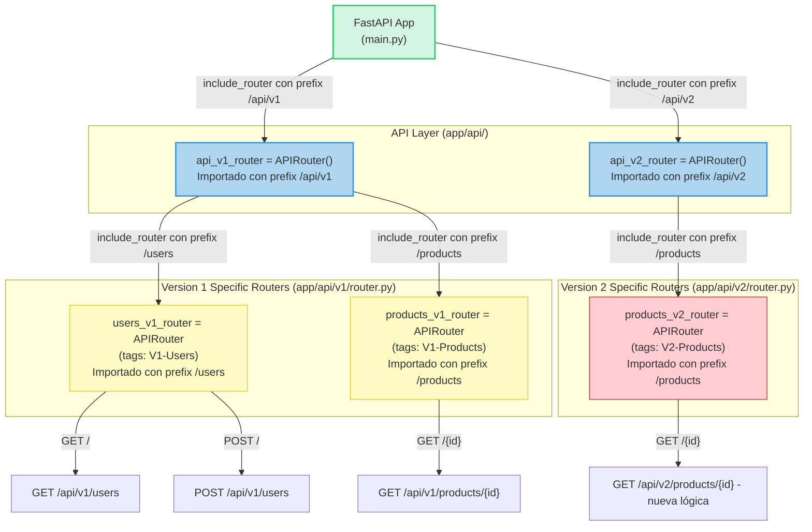
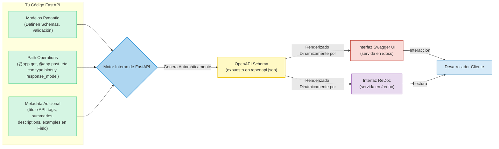
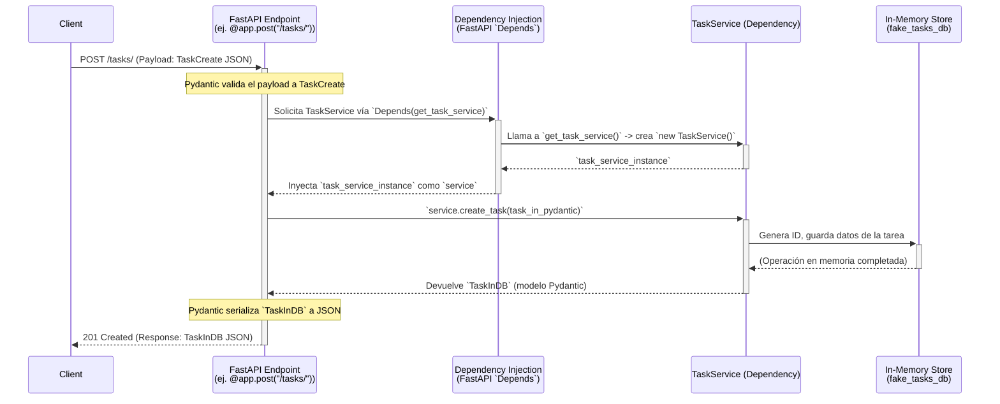

# Tema 11. DISEÑO DE APIS REST Y WEBSOCKETS EN FASTAPI

* [Tema 11. DISEÑO DE APIS REST Y WEBSOCKETS EN FASTAPI](Tema11.md#tema-11-diseño-de-apis-rest-y-websockets-en-fastapi)
  * [11.1 Buenas prácticas para endpoints RESTful](Tema11.md#111-buenas-prácticas-para-endpoints-restful)
  * [11.2 Versionado y organización de APIs](Tema11.md#112-versionado-y-organización-de-apis)
  * [11.3 Validación con Pydantic y modelos anidados](Tema11.md#113-validación-con-pydantic-y-modelos-anidados)
  * [11.4 Documentación con Swagger y Redoc](Tema11.md#114-documentación-con-swagger-y-redoc)
  * [11.5 CRUD con dependencias en FastAPI](Tema11.md#115-crud-con-dependencias-en-fastapi)
  * [11.6 Respuestas personalizadas y status codes](Tema11.md#116-respuestas-personalizadas-y-status-codes)
  * [11.7 Configuración de CORS y headers](Tema11.md#117-configuración-de-cors-y-headers)
  * [11.8 Autenticación en endpoints (JWT/OAuth2)](Tema11.md#118-autenticación-en-endpoints-jwtoauth2)
  * [11.9 Canales WebSocket nativos en FastAPI](Tema11.md#119-canales-websocket-nativos-en-fastapi)
  * [11.10 Handlers WebSocket y gestión de clientes](Tema11.md#1110-handlers-websocket-y-gestión-de-clientes)
  * [11.11 Integración WebSockets con lógica de dominio](Tema11.md#1111-integración-websockets-con-lógica-de-dominio)

## 11.1 Buenas prácticas para endpoints RESTful

Este tema es fundamental, ya que una API bien diseñada es la tarjeta de presentación de vuestros servicios, la interfaz con la que otros desarrolladores (¡o vuestro propio `frontend`!) interactuarán. Una API elegante y predecible es un placer de usar; una confusa, una fuente constante de frustración.

Comenzaremos con el pilar de la comunicación `server-to-server` y `client-server` durante años: REST. Y sí, lo haremos "muy práctico pero con un objetivo claro de enseñar bien la teoría, apoyando con tablas y diagramas `Mermaid` bien claros y sofisticados", y explicando el código con la misma claridad.

Antes de que nuestros `WebSockets` susurren en tiempo real, a menudo necesitamos establecer una base sólida con `endpoints` RESTful. Estos `endpoints` son los caminos bien pavimentados a través de los cuales los `clients` solicitan información o acciones a nuestros `servers`. Diseñarlos correctamente no es solo una cuestión de estética; impacta directamente en la usabilidad, mantenibilidad y escalabilidad de vuestra aplicación.

**Un Rápido Recordatorio: ¿Qué es REST?**

REST (`Representational State Transfer`) es un estilo arquitectural, no un protocolo rígido. Se basa en un conjunto de principios para construir servicios web distribuidos:

* **Recursos (`Resources`):** Todo es un `resource` (un producto, un usuario, un pedido), identificado por una URI única.
* **Representaciones (`Representations`):** Los `clients` interactúan con representaciones de estos `resources` (comúnmente `JSON`, a veces XML).
* **Verbos HTTP (Métodos):** Se usan los métodos estándar de HTTP (`GET`, `POST`, `PUT`, `DELETE`, etc.) para operar sobre estos `resources`.
* **`Statelessness`:** Cada petición del `client` al `server` debe contener toda la información necesaria para ser entendida. El `server` no almacena ningún `client context` entre peticiones.
* **Interfaz Uniforme (`Uniform Interface`):** Un conjunto de convenciones que simplifican y desacoplan la arquitectura.

**Buenas Prácticas Esenciales para Cincelar `Endpoints` RESTful Perfectos:**

1. **Usar Sustantivos para `Resources`, No Verbos en las URIs 🏛️**\
   Las URIs deben identificar `resources` (sustantivos), no acciones (verbos). La acción se define por el método HTTP.
   * ✅ **Bien:** `GET /products`, `POST /users`, `GET /orders/{orderId}`
   * ❌ **Mal:** `GET /getAllProducts`, `POST /createNewUser`, `GET /fetchOrderById/{orderId}`
2.  **Utilizar los Métodos HTTP Correctamente (Verbos para Acciones) 🗣️**\
    Cada método HTTP tiene una semántica específica. Respetarla es crucial.

    | Método HTTP | Acción Principal                                                            | ¿Idempotente? | ¿Seguro (`Safe`)? | Payload en Petición | Payload en Respuesta             |
    | ----------- | --------------------------------------------------------------------------- | ------------- | ----------------- | ------------------- | -------------------------------- |
    | `GET`       | Recuperar un `resource` o una colección de `resources`.                     | Sí            | Sí                | No                  | Sí                               |
    | `POST`      | Crear un nuevo `resource`. A veces para acciones no CRUD.                   | No (general.) | No                | Sí                  | Sí (a menudo el recurso creado)  |
    | `PUT`       | Reemplazar/Actualizar completamente un `resource` existente.                | Sí            | No                | Sí                  | Sí (el recurso actualizado) o No |
    | `PATCH`     | Aplicar una actualización parcial a un `resource` existente.                | No (general.) | No                | Sí                  | Sí (el recurso actualizado) o No |
    | `DELETE`    | Eliminar un `resource` existente.                                           | Sí            | No                | No                  | No (o un mensaje de éxito)       |
    | `HEAD`      | Recuperar solo las cabeceras de un `resource` (como `GET` pero sin cuerpo). | Sí            | Sí                | No                  | No (solo cabeceras)              |
    | `OPTIONS`   | Descubrir los métodos HTTP soportados por un `resource`.                    | Sí            | Sí                | No                  | Sí (cabeceras como `Allow`)      |

    * **Seguro (`Safe`):** No altera el estado del `server` (solo lectura). `GET`, `HEAD`, `OPTIONS` son seguros.
    * **Idempotente (`Idempotent`):** Realizar la misma petición múltiples veces tiene el mismo efecto que realizarla una sola vez (el estado final del `server` es el mismo). `GET`, `PUT`, `DELETE`, `HEAD`, `OPTIONS` son idempotentes. `POST` generalmente no lo es (crear un recurso dos veces resultaría en dos recursos). `PATCH` puede serlo o no, dependiendo de la naturaleza de la actualización parcial.
3. **Usar Sustantivos en Plural para Colecciones de `Resources` 📚**\
   Es una convención ampliamente aceptada y mejora la legibilidad.
   * ✅ **Bien:** `/products`, `/users/{userId}/orders`
   * ❌ **Menos Común/Claro:** `/product`, `/user/{userId}/order_list`
4. **Anidamiento de `Resources` para Relaciones (Con Moderación y Sentido Común) 🔗**\
   Para expresar relaciones jerárquicas o de contención.
   * `GET /users/{userId}/orders`: Obtiene todos los pedidos del `user` con `userId`.
   * `POST /users/{userId}/orders`: Crea un nuevo pedido para el `user` con `userId`.
   * `GET /orders/{orderId}/items/{itemId}`: Obtiene un `item` específico de un pedido.
   * **Precaución:** Evita el anidamiento excesivo (más de 2 o 3 niveles). URIs como `/A/{idA}/B/{idB}/C/{idC}/D/{idD}` se vuelven difíciles de leer y manejar. Considera usar `query parameters` para relaciones más complejas o filtros.
5.  **Filtrado, Ordenación, Paginación y Selección de Campos: Domando Colecciones 🛍️**\
    Para `endpoints` que devuelven colecciones (`GET /resources`), proporciona mecanismos para que los `clients` refinen los resultados usando `query parameters`.

    | Parámetro (Ejemplo)    | Propósito                                   | Ejemplo de URI                                         |
    | ---------------------- | ------------------------------------------- | ------------------------------------------------------ |
    | `status=active`        | Filtrar por un campo específico.            | `GET /products?status=active&category=electronics`     |
    | `sort=-price,name`     | Ordenar resultados ( `-` para descendente). | `GET /products?sort=-createdAt`                        |
    | `page=2&pageSize=20`   | Paginación basada en página y tamaño.       | `GET /products?page=2&pageSize=20`                     |
    | `offset=20&limit=10`   | Paginación basada en `offset` y límite.     | `GET /products?offset=20&limit=10`                     |
    | `fields=id,name,price` | Selección de campos (`Sparse Fieldsets`).   | `GET /products/{productId}?fields=id,name,description` |
6. **Versionado de la API (Un Avance al Futuro - 11.2 Profundizará) V1️⃣ ➡️ V2️⃣**\
   Las APIs evolucionan. Planifica cómo gestionarás los cambios retrocompatibles (`breaking changes`). Las estrategias comunes incluyen:
   * **Versionado en la URI:** `/v1/products`, `/v2/products` (la más común y clara).
   * **Versionado por `Custom Header`:** `X-API-Version: 2`
   * **Versionado por `Accept Header` (Media Type):** `Accept: application/vnd.myapi.v2+json`
7.  **Usar Códigos de Estado HTTP Correctamente: La Respuesta Clara del `Server` 🚦**\
    Los códigos de estado HTTP son una parte fundamental de la comunicación RESTful. Informan al `client` sobre el resultado de su petición de manera estandarizada.

    | Rango | Código Ejemplo              | Significado Común                                                                                                            |
    | ----- | --------------------------- | ---------------------------------------------------------------------------------------------------------------------------- |
    | `2xx` | `200 OK`                    | Petición exitosa. El `payload` depende del método (`GET`, `POST`, `PUT`).                                                    |
    |       | `201 Created`               | Recurso creado exitosamente (usualmente en respuesta a `POST`, a veces `PUT`).                                               |
    |       | `202 Accepted`              | Petición aceptada para procesamiento, pero este no ha finalizado (asíncrono).                                                |
    |       | `204 No Content`            | Petición exitosa, pero no hay `payload` que devolver (ej. `DELETE` exitoso).                                                 |
    | `3xx` | `301 Moved Permanently`     | El `resource` se ha movido permanentemente a una nueva URI.                                                                  |
    |       | `304 Not Modified`          | Para `GET` condicionales; el `resource` no ha cambiado desde la última petición.                                             |
    | `4xx` | `400 Bad Request`           | Error genérico del `client` (ej. `payload` malformado, sintaxis incorrecta).                                                 |
    |       | `401 Unauthorized`          | El `client` no está autenticado; necesita credenciales válidas.                                                              |
    |       | `403 Forbidden`             | El `client` está autenticado, pero no tiene permiso para acceder al `resource`.                                              |
    |       | `404 Not Found`             | El `resource` solicitado no existe.                                                                                          |
    |       | `405 Method Not Allowed`    | El método HTTP usado no está permitido para el `resource` solicitado.                                                        |
    |       | `409 Conflict`              | Conflicto con el estado actual del `resource` (ej. intento de crear un `resource` que ya existe con un identificador único). |
    |       | `422 Unprocessable Entity`  | La petición estaba bien formada, pero contenía errores semánticos (FastAPI la usa para errores de validación de Pydantic).   |
    | `5xx` | `500 Internal Server Error` | Error inesperado en el `server`. No culpar al `client`.                                                                      |
    |       | `503 Service Unavailable`   | El `server` no está disponible temporalmente (ej. por mantenimiento o sobrecarga).                                           |
8. **Manejo de Errores Consistente: El Manual de Crisis de Tu API 🚨**\
   Cuando ocurren errores (especialmente `4xx` y `5xx`), devuelve un `payload` `JSON` consistente que el `client` pueda interpretar.
   *   **Ejemplo de `Payload` de Error:**

       ```json
       {
         "error": {
           "type": "ValidationError", // o "AuthenticationError", "ResourceNotFound", etc.
           "message": "Los datos proporcionados no son válidos.",
           "details": [
             {"field": "email", "issue": "Debe ser un email válido."},
             {"field": "age", "issue": "Debe ser mayor de 18."}
           ],
           "trace_id": "optional-trace-id-for-logging" // Para correlacionar con logs del server
         }
       }
       ```
9. **`Statelessness`: Cada Petición es una Nueva Aventura ✈️**\
   El `server` no debe almacenar ningún estado del `client` entre peticiones. Toda la información necesaria para procesar una petición (como `tokens` de autenticación, identificadores de `resource`) debe ser enviada por el `client` en cada petición. Esto simplifica el diseño del `server` y mejora la escalabilidad (cualquier `instance` del `server` puede manejar cualquier petición).
10. **HATEOAS (`Hypermedia as the Engine of Application State`) – El Siguiente Nivel (Opcional pero Potente) ✨**
    * **Concepto:** Las respuestas de la API no solo contienen datos, sino también `links` (hipermedia) que le indican al `client` qué otras acciones puede realizar o a qué otros `resources` relacionados puede navegar.
    *   **Ejemplo:**

        ```json
        {
          "order_id": "123",
          "status": "pending",
          "total": 50.75,
          "_links": {
            "self": { "href": "/orders/123" },
            "payment": { "href": "/orders/123/payment" }, // Acción para pagar
            "cancel": { "href": "/orders/123/cancel" }   // Acción para cancelar
          }
        }
        ```
    * **Beneficios:** Permite que los `clients` "descubran" la API dinámicamente, reduce el acoplamiento a URIs hardcodeadas, y hace la API más auto-descriptiva. Es un principio avanzado de REST, pero muy poderoso para APIs maduras.

**FastAPI: Tu Aliado en la Implementación de Buenas Prácticas RESTful ✅**

FastAPI está diseñado pensando en estas buenas prácticas:

* Los decoradores de ruta (`@app.get("/items")`, `@app.post("/items")`) mapean directamente los métodos HTTP y las rutas de `resource`.
* La integración con Pydantic para la definición de `request` y `response models` ayuda a crear representaciones claras de los `resources`.
* Maneja automáticamente la validación de datos de entrada y devuelve errores HTTP `422` detallados.
* Facilita la definición de `status codes` de respuesta correctos.
* Su sistema de dependencias (`Depends`) ayuda a gestionar la autenticación y otros aspectos transversales de forma limpia.

**Conclusión: Creando APIs que Invitan a Ser Usadas (y Entendidas) 🤝**

Adoptar estas buenas prácticas RESTful no se trata de seguir reglas ciegamente, sino de construir APIs que sean **intuitivas, predecibles, consistentes y fáciles de usar** tanto para humanos como para máquinas. Una API bien diseñada es una inversión que se amortiza en términos de facilidad de integración, mantenibilidad y la satisfacción de los desarrolladores que la consumen. Con FastAPI, tienes una base excelente para lograrlo.

## 11.2 Versionado y organización de APIs

Continuamos nuestra travesía por el diseño de APIs con el **Tema 11.2**. Si el 11.1 sentó las bases de cómo deben "hablar" nuestros `endpoints` RESTful, ahora nos enfrentaremos a dos realidades ineludibles en el ciclo de vida de cualquier API exitosa: el **cambio** y la necesidad de **organización** a medida que crece.

Una API no es una escultura de mármol tallada para la eternidad; es más bien un jardín que evoluciona, crece y, a veces, necesita una poda o un rediseño de sus senderos.

A medida que tu aplicación FastAPI madura y tus `endpoints` se multiplican, surgen dos desafíos críticos:

1. **Versionado (`Versioning`):** ¿Cómo introduces cambios, especialmente aquellos que no son retrocompatibles (`breaking changes`), sin afectar a los `clients` que ya dependen de la versión actual de tu API?
2. **Organización (`Organization`):** ¿Cómo mantienes tu base de código de API limpia, modular y manejable a medida que añades más `endpoints` y lógica?

Dominar estos dos aspectos es esencial para la salud a largo plazo, la escalabilidad y la usabilidad de tu API.

**El Desafío del Tiempo: Por Qué Versionar Tu API ⏳**

Las APIs, como todo software, evolucionan. Se añaden nuevas funcionalidades, se corrigen errores, y a veces, es necesario refactorizar o cambiar la forma en que los datos se representan o se accede a ellos.

* **¿Qué es un `Breaking Change` (Cambio Rompedor)?**\
  Es una modificación en la API que podría hacer que los `clients` existentes que la consumen dejen de funcionar correctamente. Ejemplos:
  * Eliminar un `field` de un `JSON response payload`.
  * Cambiar el `data type` de un `field` (ej. de `integer` a `string`).
  * Renombrar un `field` en el `request` o `response`.
  * Eliminar un `endpoint` completo.
  * Cambiar la estructura de la URI de un `endpoint` de forma significativa.
  * Añadir un nuevo `field` _requerido_ en un `request payload`.
  * Modificar fundamentalmente el mecanismo de `authentication` o `authorization`.
* **¿Qué es (generalmente) un `Non-Breaking Change` (Cambio No Rompedor)?**\
  Es una modificación que los `clients` existentes deberían poder ignorar o adaptarse a ella sin romperse.
  * Añadir nuevos `endpoints`.
  * Añadir nuevos `fields` _opcionales_ a un `JSON response payload`.
  * Añadir nuevos `query parameters` _opcionales_.
  * Añadir nuevos `fields` _opcionales_ a un `JSON request payload`.
  * Cambiar `status codes` para nuevas condiciones de error, siempre que los antiguos sigan siendo válidos y significativos para los `clients` existentes.

El **objetivo principal del versionado** es permitirte introducir `breaking changes` de forma segura, ofreciendo una nueva versión de la API mientras mantienes la versión anterior disponible para los `clients` que aún no han migrado.

**Estrategias de Versionado de APIs: Eligiendo Tu Camino 🗺️**

Existen varias estrategias comunes para el versionado de APIs. Cada una tiene sus pros y sus contras:

| Estrategia                                     | Ejemplo                                             | Pros                                                                                                | Contras                                                                                                  | Ideal Para...                                                                          |
| ---------------------------------------------- | --------------------------------------------------- | --------------------------------------------------------------------------------------------------- | -------------------------------------------------------------------------------------------------------- | -------------------------------------------------------------------------------------- |
| **1. `URI Path Versioning`**                   | `/api/v1/products` \<br/> `/api/v2/products`        | Muy explícito, fácil de ver para `clients` y en `logs`. Fácil de enrutar en `frameworks` (FastAPI). | "Contamina" las URIs. Algunos puristas REST argumentan que la URI es para el `resource`, no su versión.  | Claridad, simplicidad de implementación y la mayoría de los casos prácticos.           |
| **2. `Query Parameter Versioning`**            | `/api/products?version=1.2`                         | Mantiene las URIs base "limpias".                                                                   | Menos obvio que el `path versioning`. Puede ser olvidado por `clients`. Complejo para `caching proxies`. | APIs donde la limpieza de la URI es primordial y los `clients` pueden manejarlo.       |
| **3. `Custom Header Versioning`**              | `X-API-Version: 2` \<br/> `Api-Version: 2025-05-20` | Mantiene las URIs limpias. Semánticamente puede tener sentido.                                      | Menos descubrible. No todos los `HTTP clients` facilitan el envío de `custom headers`.                   | APIs internas o donde los `clients` tienen control total sobre los `headers`.          |
| **4. `Accept Header Versioning` (Media Type)** | `Accept: application/vnd.example.v1+json`           | Considerado el más "RESTful". Versiona la representación, no el `resource`. URIs limpias.           | Más complejo para los `clients`. Más difícil de probar en `browsers`. `Routing` puede ser más complejo.  | APIs que buscan la pureza REST y cuyos `clients` pueden manejar `content negotiation`. |

* **Recomendación Pragmática:** El **`URI Path Versioning`** (ej. `/api/v1/...`) es a menudo la opción más práctica, clara y ampliamente adoptada debido a su simplicidad de implementación y visibilidad. FastAPI, con `APIRouter`, facilita enormemente esta estrategia.
* **Granularidad del Versionado:**
  * **Major Versions (`v1`, `v2`):** Para `breaking changes`.
  * **Minor Versions (`v1.1`, `v1.2`):** Para `non-breaking changes` y nuevas funcionalidades retrocompatibles. A menudo, los `minor changes` no requieren un cambio de versión explícito si la API está diseñada para ser extensible (ej. `clients` que ignoran `fields` desconocidos en el `response`).
* **Política de Depreciación (`Deprecation Policy`):**\
  Cuando introduces una nueva versión (ej. `v2`), debes tener un plan para la versión antigua (`v1`):
  1. **Anunciar la Depreciación:** Informa a tus `clients` con antelación sobre la fecha en que `v1` dejará de tener soporte.
  2. **Periodo de Transición:** Permite un tiempo razonable para que los `clients` migren a `v2`.
  3. **`Sunset Header`:** Considera usar la cabecera HTTP `Sunset` en las respuestas de la API `v1` para indicar la fecha y hora en que dejará de estar disponible.
  4. **Desactivación:** Finalmente, desactiva la versión antigua.

**Organizando Tu Imperio de `Endpoints`: Estructura y Modularidad con FastAPI 🗂️**

A medida que tu API crece, mantener todo en un solo archivo `main.py` se vuelve insostenible. FastAPI promueve la modularidad a través de `APIRouter`.

1. **El Poder de `APIRouter`:**`APIRouter` funciona como una "mini-aplicación" FastAPI. Puedes agrupar `endpoints` relacionados lógicamente en un `router` y luego incluir ese `router` en tu aplicación principal o en otro `router`.
   *   **Ejemplo (Creando un `router` para `users` en `v1`):**

       ```python
       # api/v1/endpoints/users.py
       from fastapi import APIRouter

       router = APIRouter()

       @router.get("/users", tags=["V1-Users"])
       async def get_users_v1():
           return [{"username": "user1_v1"}, {"username": "user2_v1"}]

       @router.get("/users/{user_id}", tags=["V1-Users"])
       async def get_user_v1(user_id: int):
           return {"username": f"user_{user_id}_v1"}
       ```
   *   **Agregando `routers` de `endpoints` a un `router` de versión:**

       ```python
       # api/v1/router.py
       from fastapi import APIRouter
       from .endpoints import users as users_v1_endpoints
       from .endpoints import items as items_v1_endpoints # Suponiendo que tienes items.py

       api_v1_router = APIRouter()
       api_v1_router.include_router(users_v1_endpoints.router, prefix="/users", tags=["V1-Users"])
       api_v1_router.include_router(items_v1_endpoints.router, prefix="/items", tags=["V1-Items"])
       # No es necesario repetir tags aquí si ya están en los routers de endpoints,
       # pero puedes añadir un tag general para V1 si lo deseas.
       ```
   *   **Incluyendo el `router` de versión en la aplicación FastAPI principal:**

       ```python
       # main.py
       from fastapi import FastAPI
       from app.api.v1.router import api_v1_router
       # from app.api.v2.router import api_v2_router # Si tienes una v2

       app = FastAPI(title="Mi API Evolutiva")

       app.include_router(api_v1_router, prefix="/api/v1") # Todos los endpoints de v1 bajo /api/v1
       # app.include_router(api_v2_router, prefix="/api/v2") # Todos los endpoints de v2 bajo /api/v2
       ```
2.  **Estructura de Directorios Sugerida para un Proyecto FastAPI Escalable:**\
    Una buena organización de directorios es clave. Aquí una sugerencia que facilita el versionado:

    ```
    mi_proyecto_fastapi/
    ├── app/
    │   ├── api/
    │   │   ├── v1/
    │   │   │   ├── endpoints/            # Módulos con APIRouters para cada recurso
    │   │   │   │   ├── users.py
    │   │   │   │   ├── products.py
    │   │   │   │   └── __init__.py
    │   │   │   ├── schemas/              # Modelos Pydantic para v1
    │   │   │   │   ├── user_schemas.py
    │   │   │   │   ├── product_schemas.py
    │   │   │   │   └── __init__.py
    │   │   │   ├── dependencies/         # Dependencias específicas de v1 (opcional)
    │   │   │   └── router.py             # Agrega los routers de endpoints de v1
    │   │   ├── v2/                       # Estructura similar para v2
    │   │   │   ├── endpoints/
    │   │   │   │   └── products.py       # Quizás solo products tiene v2
    │   │   │   ├── schemas/
    │   │   │   │   └── product_schemas_v2.py
    │   │   │   └── router.py
    │   │   └── main_api_router.py        # (Opcional) Agrega api_v1_router, api_v2_router
    │   ├── core/                         # Lógica de negocio, config, db
    │   │   ├── config.py
    │   │   └── db.py
    │   ├── services/                     # Servicios de aplicación/casos de uso
    │   ├── models/                       # Modelos de dominio/ORM (si aplica)
    │   └── main.py                       # Archivo principal de la aplicación FastAPI
    ├── tests/
    └── README.md
    ```
3. **Usando `Tags` para la Documentación OpenAPI:**\
   Los `tags` son metadatos que FastAPI usa para agrupar `endpoints` en la documentación generada automáticamente (Swagger UI / Redoc).
   * Puedes definir `tags` a nivel de `APIRouter`: `APIRouter(tags=["Users Management"])`.
   * O a nivel de `endpoint` individual: `@router.get("/path", tags=["Specific Feature"])`.
   * Es una buena práctica incluir la versión en los `tags` para claridad en la documentación (ej. `tags=["V1 - Users"]`, `tags=["V2 - Products"]`).

**Diagrama de Organización con `APIRouter` y Versionado:**\
Esto ilustra cómo los `routers` se pueden anidar y prefijar para lograr el versionado y la organización.



**Conclusión: Un Diseño API Preparado para el Presente y el Mañana 🏗️**

El versionado y una organización modular no son lujos para cuando una API "crezca mucho"; son prácticas fundamentales que deben considerarse desde las primeras etapas del diseño.

* El **versionado** te da la libertad de evolucionar tu API sin miedo a romper la confianza de tus `clients`.
* Una **buena organización** del código, facilitada por herramientas como `APIRouter` en FastAPI, hace que tu base de código sea más fácil de entender, mantener, probar y escalar por el equipo.

Al adoptar estas estrategias, construyes una API que no solo es funcional hoy, sino que está preparada para adaptarse y prosperar en el futuro.

## 11.3 Validación con Pydantic y modelos anidados

Este es un punto donde FastAPI realmente brilla y donde vuestros profesionales pueden obtener una productividad y robustez enormes: la validación de datos con Pydantic, especialmente cuando trabajamos con estructuras de datos complejas o anidadas. Si las buenas prácticas RESTful (11.1) son el esqueleto de nuestra API, y el versionado/organización (11.2) son su sistema circulatorio y nervioso, entonces Pydantic es el sistema inmunológico y el control de calidad de los datos que fluyen por ella.

En el corazón de cada interacción API robusta y fiable yace una validación de datos implacable. Sin ella, nuestros `endpoints` estarían expuestos a datos incorrectos, malformados o maliciosos, lo que podría llevar a errores inesperados, corrupción de datos o vulnerabilidades de seguridad. FastAPI nos ofrece un aliado de primera categoría para esta tarea: **Pydantic**.

Pydantic no es solo una librería de validación; es una herramienta de **parsing y modelado de datos** que utiliza `type hints` de Python para definir cómo deben ser nuestros datos, validarlos, serializarlos y deserializarlos, y (como veremos en 11.4) generar automáticamente `schemas` para nuestra documentación de API.

**Pydantic: Más que Simple `Type Hinting` – Los Superpoderes Internos ✨**

Cuando defines un modelo Pydantic, estás haciendo mucho más que simplemente declarar tipos:

* **Validación Basada en Tipos:** Los `type hints` (ej. `nombre: str`, `edad: int`, `precio: float`) se convierten en reglas de validación.
* **Conversión Automática de Tipos (`Coercion`):** Pydantic intentará convertir inteligentemente los datos de entrada al tipo esperado si es posible (ej. un `string` `"123"` a un `int` `123`). Esto puede ser muy conveniente, aunque Pydantic también ofrece modos estrictos (`Strict Types`) si se prefiere una validación sin `coercion`.
* **Generación Automática de `JSON Schema`:** FastAPI utiliza los modelos Pydantic para generar los `schemas` que potencian la documentación interactiva de OpenAPI (Swagger UI / Redoc).
* **Errores de Validación Claros y Detallados:** Si los datos de entrada no cumplen con el modelo, FastAPI (usando Pydantic bajo el capó) devuelve automáticamente una respuesta HTTP `422 Unprocessable Entity` con un `JSON body` que detalla exactamente qué campos fallaron y por qué.

**Validación Avanzada con `Field` y Validadores Personalizados ⚙️**

Pydantic va mucho más allá de la validación básica de tipos. La función `Field` y los decoradores de validación nos permiten imponer restricciones mucho más ricas.

1.  **`Field` al Detalle: Definiendo Restricciones Precisas**`Field` se importa de `pydantic` y se usa como valor por defecto para los atributos de un modelo para añadir metadatos y validaciones.

    ```python
    from pydantic import BaseModel, Field, EmailStr, HttpUrl
    from typing import List, Optional, Annotated # Annotated para algunos tipos con constraints
    from decimal import Decimal
    from datetime import date

    class ProductoNuevo(BaseModel):
        nombre: str = Field(
            ..., # El '...' indica que el campo es obligatorio
            title="Nombre del Producto",
            description="El nombre principal y público del producto.",
            min_length=3, 
            max_length=100,
            examples=["Laptop Pro Avanzada"] # Para OpenAPI
        )
        precio: Decimal = Field(
            ..., 
            gt=0, # Greater than 0
            description="Precio de venta al público, debe ser positivo.",
            examples=[999.99]
        )
        tags: Optional[List[str]] = Field(
            default_factory=list, # Si no se provee, será una lista vacía
            min_length=0, # min_items en Pydantic V1, ahora es min_length para listas
            max_length=10, # max_items en Pydantic V1, ahora es max_length para listas
            description="Lista de etiquetas asociadas al producto.",
            examples=[["electronica", "computadora"]]
        )
        url_imagen: Optional[HttpUrl] = Field(
            default=None, 
            description="URL de la imagen principal del producto."
        )
        # Ejemplo de Annotated con constraints para tipos más simples
        stock_disponible: Annotated[int, Field(ge=0, default=0)] # Greater than or equal to 0
    ```

    **Tabla de `Field Constraints` Comunes (Pydantic V2):**

    | Constraint        | Descripción                                        | Ejemplo (`Field(...)`)                        |
    | ----------------- | -------------------------------------------------- | --------------------------------------------- |
    | `default`         | Valor por defecto si no se provee.                 | `default=0`, `default="N/A"`                  |
    | `default_factory` | Función llamada para generar el valor por defecto. | `default_factory=list`                        |
    | `alias`           | Alias del campo para (de)serialización.            | `alias="productId"`                           |
    | `title`           | Título legible para documentación.                 | `title="Identificador Único"`                 |
    | `description`     | Descripción detallada para documentación.          | `description="El ID del producto en BBDD."`   |
    | `examples`        | Lista de ejemplos para documentación.              | `examples=["ejemplo1", "ejemplo2"]`           |
    | `gt`, `ge`        | Mayor que, Mayor o igual que (numéricos).          | `gt=0`, `ge=18`                               |
    | `lt`, `le`        | Menor que, Menor o igual que (numéricos).          | `lt=100`, `le=99`                             |
    | `multiple_of`     | Debe ser múltiplo de (numéricos).                  | `multiple_of=5`                               |
    | `min_length`      | Longitud mínima (`str`, `bytes`, `list`, `set`).   | `min_length=3`                                |
    | `max_length`      | Longitud máxima (`str`, `bytes`, `list`, `set`).   | `max_length=50`                               |
    | `pattern`         | Patrón Regex que debe cumplir un `string`.         | `pattern=r"^\d{5}(?:[-\s]\d{4})?$"` (ej. ZIP) |
    | `frozen`          | Si `True`, el modelo es inmutable tras creación.   | `frozen=True` (en `model_config` o `Field`)   |
2. **Validadores Personalizados (`Custom Validators` - Estilo Pydantic V2):**\
   Para lógica de validación que va más allá de los `constraints` estándar.
   *   **`@field_validator('nombre_campo', mode='before'|'after'|'wrap'|'plain')`:**\
       Valida un campo específico. `mode='after'` (por defecto) opera sobre el valor ya parseado y validado por el tipo. `mode='before'` opera sobre el valor crudo.

       ```python
       from pydantic import field_validator, model_validator

       class EventoProgramado(BaseModel):
           nombre_evento: str
           fecha_inicio: date
           fecha_fin: date

           @field_validator('nombre_evento')
           @classmethod
           def nombre_no_puede_ser_test(cls, v: str) -> str:
               if "test" in v.lower():
                   raise ValueError("El nombre del evento no puede contener 'test'.")
               return v.title() # Ejemplo de transformación además de validación
       ```
   *   **`@model_validator(mode='before'|'after')`:**\
       Valida el modelo completo, útil para reglas que dependen de múltiples campos. `mode='after'` (por defecto) se ejecuta después de que todos los campos individuales han sido validados.

       ```python
       # Continuación de EventoProgramado
       #    @model_validator(mode='after')
       #    def verificar_fechas_consistentes(self) -> 'EventoProgramado':
       #        if self.fecha_inicio and self.fecha_fin and self.fecha_fin < self.fecha_inicio:
       #            raise ValueError("La fecha de fin no puede ser anterior a la fecha de inicio.")
       #        return self
       ```

       _(En Pydantic V2, el acceso a otros campos dentro de un `@field_validator` para validaciones cruzadas es menos directo; `@model_validator` es la forma preferida para validaciones inter-campos.)_

**El Poder de la Composición: `Nested Models` (Modelos Pydantic Anidados) 🧱➡️🏠**

Aquí es donde Pydantic realmente flexiona sus músculos para APIs complejas. Puedes definir modelos que contienen otros modelos Pydantic como tipos de campo, creando así estructuras jerárquicas que FastAPI puede validar y documentar automáticamente.

*   **Definiendo `Nested Models`:**\
    Imagina un sistema de pedidos. Un pedido tiene una dirección de envío y una lista de ítems.

    ```python
    from pydantic import BaseModel, Field, EmailStr, constr, condecimal
    from typing import List, Optional
    from decimal import Decimal # Es mejor usar Decimal para dinero

    class ItemPedido(BaseModel):
        producto_id: str = Field(..., examples=["SKU123"])
        nombre_producto: str = Field(..., min_length=3, examples=["Teclado Mecánico"])
        cantidad: int = Field(..., ge=1, examples=[2])
        precio_unitario: condecimal(gt=Decimal(0), decimal_places=2) # type: ignore

    class DireccionEnvio(BaseModel):
        calle: str = Field(..., examples=["Av. Principal 123"])
        ciudad: str = Field(..., examples=["Ciudad Ejemplo"])
        codigo_postal: constr(pattern=r"^\d{5}$") = Field(..., examples=["28001"]) # type: ignore
        pais: str = Field(..., examples=["ES"])

    class PayloadCrearPedido(BaseModel):
        email_cliente: EmailStr
        direccion_envio: DireccionEnvio       # <-- Nested Model
        items: List[ItemPedido] = Field(..., min_length=1) # <-- Lista de Nested Models
        notas_adicionales: Optional[str] = None

        model_config = { # Pydantic V2 config
            "json_schema_extra": {
                "examples": [
                    {
                        "email_cliente": "comprador@example.com",
                        "direccion_envio": {
                            "calle": "Gran Vía 1",
                            "ciudad": "Madrid",
                            "codigo_postal": "28013",
                            "pais": "ES"
                        },
                        "items": [
                            {"producto_id": "PROD001", "nombre_producto": "Libro FastAPI Pro", "cantidad": 1, "precio_unitario": "29.99"},
                            {"producto_id": "PROD002", "nombre_producto": "Taza Developer", "cantidad": 2, "precio_unitario": "12.50"}
                        ],
                        "notas_adicionales": "Envolver para regalo, por favor."
                    }
                ]
            }
        }
    ```
* **Diagrama `Mermaid` de la Estructura Anidada:**

**`Nested Models` en Acción con FastAPI 🚀**

1.  **Como `Request Body`:**\
    Cuando defines un `endpoint` `POST` o `PUT` y tipas el parámetro del cuerpo con `PayloadCrearPedido`, FastAPI:

    * Espera un `JSON body` con la estructura anidada.
    * Lo deserializa a instancias de tus modelos Pydantic.
    * Valida toda la estructura, incluyendo los campos de los modelos anidados y las listas de modelos anidados.
    * Si hay un error en cualquier nivel de anidamiento, devuelve un HTTP `422` con una ruta detallada al error (ej. `body -> items -> 0 -> cantidad` debe ser `>= 1`).

    ```python
    from fastapi import FastAPI, status

    app = FastAPI() # Asumimos que los modelos Pydantic están definidos arriba

    @app.post("/api/v1/pedidos", status_code=status.HTTP_201_CREATED)
    async def crear_pedido(pedido: PayloadCrearPedido): # FastAPI hace la magia aquí
        # 'pedido' es ahora una instancia de PayloadCrearPedido validada
        # puedes acceder a pedido.direccion_envio.ciudad
        # o iterar sobre pedido.items y acceder a item.nombre_producto
        print(f"Pedido recibido para: {pedido.email_cliente}")
        for item in pedido.items:
            print(f"- Item: {item.nombre_producto}, Cantidad: {item.cantidad}")
        # ... lógica para procesar el pedido ...
        return {"mensaje": "Pedido recibido exitosamente", "id_pedido": "ORD123XYZ"}
    ```
2.  **Como `Response Model`:**\
    De forma similar, puedes usar modelos Pydantic (anidados o no) para definir la estructura de tus respuestas con `response_model`. FastAPI:

    * Filtrará los datos de tu objeto de retorno para que coincidan solo con los campos definidos en el `response_model`.
    * Validará que los datos de retorno se ajusten al `response_model` (útil para asegurar que no expones datos de más).
    * Serializará el objeto a `JSON`.
    * Incluirá el `schema` en la documentación OpenAPI.

    ```python
    class PedidoCreadoResponse(BaseModel): # Un posible modelo de respuesta
        id_pedido: str
        email_cliente: EmailStr
        total_items: int
        # ... otros campos que quieras devolver ...

    # Modificando el endpoint anterior para usar response_model
    # @app.post("/api/v1/pedidos", status_code=status.HTTP_201_CREATED, response_model=PedidoCreadoResponse)
    # async def crear_pedido(pedido: PayloadCrearPedido):
    #     # ... lógica para procesar el pedido y obtener un id_pedido_real ...
    #     id_pedido_real = "ORD123XYZ" # Simulado
    #     return PedidoCreadoResponse(
    #         id_pedido=id_pedido_real, 
    #         email_cliente=pedido.email_cliente, 
    #         total_items=sum(item.cantidad for item in pedido.items)
    #     )
    ```

**Beneficios Concretos de Pydantic y los `Nested Models` en FastAPI 🏆**

* **Claridad y Robustez del Contrato de API:** Tus modelos Pydantic _son_ la definición formal de los datos que tu API espera y devuelve. Sirven como una `source of truth`.
* **Reducción Drástica de `Boilerplate` de Validación:** Olvídate de anidar `if/else` para validar cada campo. Pydantic lo hace de forma declarativa.
* **Errores Tempranos y Extremadamente Descriptivos:** La respuesta HTTP `422` de FastAPI te dice exactamente dónde (`loc`) y por qué (`msg`, `type`) falló la validación, incluso en estructuras profundamente anidadas. Esto es oro puro para los desarrolladores de `clients`.
* **Documentación Automática Enriquecida y Precisa:** Los `schemas` de los modelos, incluyendo los anidados, se reflejan perfectamente en la documentación OpenAPI (Swagger UI / Redoc), que veremos en 11.4.
* **Seguridad Mejorada:** Al definir estrictamente las formas de los datos, reduces la superficie de ataque para la inyección de datos maliciosos o inesperados.

**Conclusión: Pydantic como Tu Aliado Estratégico para APIs de Calidad Profesional 🏅**

Pydantic, especialmente con su capacidad para manejar `nested models`, no es simplemente una librería de "validación de datos" en el ecosistema FastAPI; es una herramienta fundamental para el **diseño de APIs (`API design`)**. Te obliga (en el buen sentido) a pensar cuidadosamente sobre las estructuras de datos de tu API, resultando en interfaces más claras, robustas, auto-documentadas y, en última instancia, más fáciles de usar y mantener.

Dominar Pydantic y sus modelos anidados te permite construir la columna vertebral de datos para APIs complejas con una elegancia y seguridad que antes requerían mucho más esfuerzo manual.

## 11.4 Documentación con Swagger y Redoc

Ya hemos sentado las bases de `endpoints` RESTful bien estructurados (11.1), hemos aprendido a versionarlos y organizarlos (11.2), y hemos dominado la validación de datos con Pydantic y `nested models` (11.3). Ahora, en el **11.4**, vamos a ver uno de los "superpoderes" más celebrados de FastAPI: cómo todo ese trabajo de definición y validación se traduce, casi por arte de magia, en una documentación de API interactiva y de primera clase.

Olvídense de los días de redactar laboriosamente documentos de API manuales que inevitablemente quedaban desactualizados. ¡Bienvenidos a la era de la documentación viva!

Una API, por muy bien diseñada que esté, es de poca utilidad si los desarrolladores (ya sean de tu propio equipo o `third-party consumers`) no pueden entender fácilmente cómo usarla. La documentación es la clave, y FastAPI la trata como una ciudadana de primera clase, automatizando gran parte de su generación.

**OpenAPI: El Esperanto de las APIs Modernas 📜**

Antes de hablar de Swagger UI o ReDoc, debemos mencionar el estándar que los impulsa: **OpenAPI Specification** (anteriormente conocido como Swagger Specification).

* **¿Qué es?** Es un estándar abierto, independiente del lenguaje de programación, para describir, producir, consumir y visualizar APIs RESTful. Define una estructura (`JSON` o `YAML`) para detallar los `endpoints` de una API, sus parámetros, `request bodies`, `response schemas`, mecanismos de `authentication`, `metadata` como `tags`, `summaries`, `descriptions`, etc.
* **¿Por qué es el Estándar de Facto?**
  * **Legible por Máquinas y Humanos:** Permite que tanto herramientas como desarrolladores entiendan la estructura de una API.
  * **Habilita un Ecosistema de Herramientas:** Generadores de código `client` y `server`, herramientas de prueba, `gateways` de API, y, por supuesto, generadores de documentación interactiva.
* **FastAPI y OpenAPI:** FastAPI **genera automáticamente un `schema` OpenAPI** para tu aplicación basándose en:
  * Tus `path operations` (`@app.get`, `@app.post`, etc.).
  * Los `type hints` y modelos Pydantic que usas para `path parameters`, `query parameters`, `request bodies` y `response models`.
  * `Metadata` que proporcionas en los decoradores y en la instancia de `FastAPI`.
* **El `Endpoint` Mágico `/openapi.json`:** Por defecto, FastAPI expone el `schema` OpenAPI generado en la ruta `/openapi.json`. Puedes verlo directamente en tu `browser` (aunque es un `JSON` denso, es la `source of truth` para las herramientas de documentación).

**Swagger UI: Tu API Bajo el Microscopio Interactivo 🔬**

Swagger UI es una de las herramientas más populares para renderizar un `schema` OpenAPI en una interfaz de usuario web interactiva. ¡Y FastAPI te la da gratis!

* **Acceso Automático:** Por defecto, FastAPI sirve Swagger UI en la ruta `/docs`. Simplemente navega a `http://localhost:8000/docs` (o la URL base de tu app + `/docs`) en tu `browser`.
* **Recorrido Guiado por la Interfaz de Swagger UI:**
  1. **Título y Versión de la API:** En la parte superior, verás el título y la versión que configuraste para tu aplicación FastAPI.
  2. **Lista de `Endpoints` Agrupados por `Tags`:** Los `endpoints` se organizan por `tags` (que puedes definir en tus `APIRouters` o `path operations`). Esto hace que la navegación sea mucho más sencilla para APIs grandes.
  3. **Expandiendo un `Endpoint`:** Al hacer clic en un `endpoint`, se expande para mostrar:
     * El **método HTTP** (`GET`, `POST`, etc.) y la **ruta**.
     * Un **`Summary`** (título corto) y una **`Description`** (más detallada, puede incluir `Markdown`).
     * **`Parameters`:** Si el `endpoint` espera `path parameters` o `query parameters`, se listarán aquí con sus tipos, si son requeridos, y sus descripciones (todo inferido de tus `type hints` y `Field` de Pydantic).
     * **`Request body` (para `POST`, `PUT`, `PATCH`):** Muestra el `schema` `JSON` esperado, derivado de tu modelo Pydantic. ¡Incluso muestra ejemplos!
     * **`Responses`:** Lista los posibles `HTTP status codes` de respuesta con sus descripciones y, crucialmente, los `schemas` de los `response bodies` (gracias a `response_model` en FastAPI y tus modelos Pydantic).
  4. **El Botón "Try it out" – La Joya de la Corona:** Esta es la característica estrella. Permite a los desarrolladores (¡y a ti mismo!) **ejecutar peticiones a la API directamente desde la documentación**. Puedes rellenar parámetros, construir el `JSON body` y ver la respuesta real del `server`, incluyendo `headers` y `status code`. Es invaluable para probar y entender la API.
* **La Conexión con Pydantic (11.3):** Toda la riqueza de los `schemas` que ves en Swagger UI (tipos de datos, campos requeridos/opcionales, `constraints`, `nested structures`) proviene directamente de cómo definiste tus modelos Pydantic. ¡Cuanto mejor definas tus modelos, mejor será tu documentación!

**ReDoc: La Elegancia de la Documentación Legible y Estructurada 📖**

ReDoc es otra excelente herramienta para generar documentación a partir de un `schema` OpenAPI. FastAPI también la incluye por defecto.

* **Acceso Automático:** La encontrarás en la ruta `/redoc` (ej. `http://localhost:8000/redoc`).
* **Características Destacadas:**
  * **Diseño de Tres Paneles (usualmente):**
    * Navegación con la lista de `endpoints` y `schemas`.
    * Panel central con la descripción detallada del `endpoint` o `schema` seleccionado.
    * Panel derecho (a menudo) con ejemplos de `request/response` o `schemas`.
  * **Enfoque en la Legibilidad:** ReDoc está optimizado para una presentación limpia y fácil de leer, muy similar a una documentación API tradicional bien formateada.
  * **Excelente para Entender la Estructura:** Es muy bueno para que los `clients` obtengan una comprensión profunda de los `data models` y la estructura general de la API.
  * No tiene la funcionalidad "Try it out" de Swagger UI, su foco es la presentación de la documentación.

**Personalizando Tu Pergamino: Enriqueciendo la Documentación OpenAPI en FastAPI 🎨**

FastAPI te da un control considerable sobre la `metadata` que aparece en tu documentación OpenAPI.

1.  **`Metadata` Global de la API (en la instancia de `FastAPI`):**

    ```python
    from fastapi import FastAPI

    app = FastAPI(
        title="Mi API Asombrosa",
        description="Una descripción detallada de mi API, con **Markdown** soportado. 🚀",
        version="1.0.0", # Tu versión de API
        terms_of_service="http://example.com/terms/",
        contact={
            "name": "Equipo API Asombrosa",
            "url": "http://example.com/contact/",
            "email": "api_support@example.com",
        },
        license_info={
            "name": "Apache 2.0",
            "url": "https://www.apache.org/licenses/LICENSE-2.0.html",
        }
    )
    ```
2.  **`Metadata` de `Endpoints` (`Path Operations`):**\
    En los decoradores de tus `path operations` (`@app.get`, `@app.post`, etc.):

    ```python
    from fastapi import FastAPI, status
    from pydantic import BaseModel

    # ... (app = FastAPI() ...)

    class Item(BaseModel):
        name: str
        description: Optional[str] = None

    @app.post(
        "/items/", 
        response_model=Item, 
        status_code=status.HTTP_201_CREATED,
        tags=["Items", "V1"], # Agrupa el endpoint
        summary="Crear un nuevo ítem.", # Título corto
        description="Crea un nuevo ítem en el sistema con la información proporcionada. Devuelve el ítem creado.",
        response_description="El ítem que fue creado exitosamente." # Descripción de la respuesta 201
    )
    async def create_item(item: Item):
        # ... lógica para crear el ítem ...
        return item

    @app.get("/legacy_items/", deprecated=True, tags=["Legacy"]) # Marcar como obsoleto
    async def get_legacy_items():
        return {"message": "Este endpoint es obsoleto, por favor use /items/."}
    ```
3.  **Definiendo Múltiples `Responses` y `Status Codes` Explícitamente:**\
    El parámetro `responses` en los decoradores te permite definir `schemas` para otros `status codes` además del principal.

    ```python
    from fastapi import HTTPException

    class Message(BaseModel):
        message: str

    # @app.get(
    #     "/items/{item_id}", 
    #     response_model=Item, 
    #     tags=["Items"],
    #     responses={
    #         404: {"model": Message, "description": "El ítem no fue encontrado."},
    #         403: {"model": Message, "description": "Operación no permitida."}
    #     }
    # )
    # async def read_item(item_id: str):
    #     # if item_not_found:
    #     #     raise HTTPException(status_code=404, detail="Ítem no encontrado")
    #     # ...
    #     return {"name": "Mi Item", "description": "Detalles..."}
    ```
4. **Enriqueciendo `Schemas` de Pydantic (como vimos en 11.3):**\
   Usar `Field(title="...", description="...", examples=["..."])` en tus modelos Pydantic y la configuración `json_schema_extra` (en `model_config` para Pydantic V2) enriquece enormemente los `schemas` mostrados en la documentación.

**Diagrama Conceptual: El Flujo de la Auto-Documentación 🪄**



**Los Beneficios Innegables de la Documentación "Viva" ✅**

* **Siempre Sincronizada con el Código:** Como la documentación se deriva de tu código (Pydantic, `type hints`, decoradores), el riesgo de que quede desactualizada es mínimo. "La documentación es el código, el código es la documentación."
* **Ahorro de Tiempo Monumental:** Reduce drásticamente el esfuerzo de escribir y mantener documentación API manualmente.
* **Mejora la Experiencia del Desarrollador (`Developer Experience - DX`):** Tanto para tu propio equipo (especialmente para `frontend` o `mobile developers`) como para `third-party consumers`.
* **Facilita la Colaboración y el `Onboarding`:** Nuevos miembros del equipo pueden entender la API y empezar a usarla mucho más rápido.
* **Plataforma para Pruebas y Exploración Interactiva:** La funcionalidad "Try it out" de Swagger UI es una herramienta de depuración y aprendizaje invaluable.

**Consejos Prácticos Adicionales:**

* **Deshabilitar en Producción (Opcional):** Si por razones de seguridad no quieres exponer `/docs`, `/redoc`, o `/openapi.json` en tu entorno de producción, puedes hacerlo al instanciar `FastAPI`:`app = FastAPI(docs_url=None, redoc_url=None, openapi_url=None)`\
  Aunque a menudo se mantienen, protegidos por `authentication`.
* **Escribe Buenas `Docstrings` y `Descriptions`:** Lo que escribes en las `docstrings` de tus funciones de `path operation` y en los `description` de tus modelos Pydantic y `Fields` aparece directamente en la documentación. ¡Sé descriptivo!

**Conclusión: Tu API se Explica Sola (Con la Orquestación Maestra de FastAPI) 🌟**

FastAPI transforma la documentación de API de una tarea ardua y propensa a errores en una característica integrada, potente y automática. Al definir tus datos con Pydantic y estructurar tus `endpoints` con los decoradores de FastAPI, no solo estás escribiendo código funcional, sino que también estás **escribiendo la documentación de tu API en tiempo real**.

Aprovechar al máximo estas capacidades es un signo de profesionalismo y una inversión directa en la usabilidad y el éxito a largo plazo de tu API.

***

## 11.5 CRUD con dependencias en FastAPI

Este es un punto donde la practicidad de FastAPI se une con principios de diseño de software sólidos para crear `endpoints` robustos y mantenibles. Hablaremos de las operaciones **CRUD (Create, Read, Update, Delete)**, el pan de cada día de muchas APIs, y cómo el sistema de **Inyección de Dependencias (`Dependency Injection`)** de FastAPI las eleva a un nuevo nivel de elegancia y testabilidad.

Imagina que tus `endpoints` son chefs de alta cocina. Las operaciones CRUD son sus recetas base. La inyección de dependencias les proporciona los ingredientes de la más alta calidad y las herramientas especializadas exactamente cuando las necesitan, sin que ellos tengan que ir a buscarlas al almacén.

Las operaciones CRUD son fundamentales: casi toda aplicación necesita crear, leer, actualizar y eliminar `resources`. FastAPI no solo facilita la definición de estos `endpoints` RESTful, sino que su sistema de `Dependency Injection` (DI) permite construirlos de una manera que es modular, limpia y extraordinariamente fácil de probar.

**Recordatorio Rápido: Operaciones CRUD y Métodos HTTP 🔄**

Antes de sumergirnos, un breve mapeo:

* **C**reate (Crear) ➔ `POST` (generalmente a una colección: `/items`)
* **R**ead (Leer) ➔ `GET` (a una colección: `/items`, o a un `resource` específico: `/items/{item_id}`)
* **U**pdate (Actualizar) ➔ `PUT` (reemplazo completo del `resource`: `/items/{item_id}`) o `PATCH` (actualización parcial del `resource`: `/items/{item_id}`)
* **D**elete (Eliminar) ➔ `DELETE` (a un `resource` específico: `/items/{item_id}`)

**El Poder Secreto de FastAPI: Inyección de Dependencias (`Depends`) 🕵️‍♂️**

La inyección de dependencias es una técnica de diseño donde los componentes reciben sus dependencias (otras piezas de código de las que dependen para funcionar) desde una fuente externa, en lugar de crearlas ellos mismos. FastAPI tiene un sistema de DI de primera clase, accesible a través de `Depends`.

*   **¿Qué es `Depends`?**\
    Es un marcador que se usa en los parámetros de tus `path operation functions`. Le dice a FastAPI: "Oye, para ejecutar esta función, necesito una instancia de 'esto'. Por favor, provéemela."

    ```python
    from fastapi import Depends, FastAPI

    app = FastAPI()

    async def get_common_parameters(q: str = None, skip: int = 0, limit: int = 100):
        return {"q": q, "skip": skip, "limit": limit}

    @app.get("/items/")
    async def read_items(commons: dict = Depends(get_common_parameters)): # commons es la dependencia inyectada
        return commons
    ```
* **¿Cómo Funciona?**\
  La "cosa" que `Depends` necesita (llamada `dependency callable`) es usualmente una función (puede ser `async` o `sync`). FastAPI ejecutará esta función por ti y el valor que retorne será inyectado en tu `path operation function`. Si la `dependency callable` es una clase, FastAPI la tratará como si la llamaras (`Clase()`).
* **Beneficios Clave:**
  1. **Reutilización de Código:** Define la lógica para obtener una dependencia una vez (ej. obtener una `session` de base de datos, verificar un `token` de `user`, instanciar un `service class`) y úsala en múltiples `endpoints`.
  2. **Separación de Incumbencias (`SoC - Separation of Concerns`):** Mueve lógica que no es estrictamente del `request/response` HTTP fuera del `endpoint` (ej. lógica de `authentication`, acceso a datos, `business logic` compleja). Esto mantiene tus `endpoints` limpios y enfocados.
  3. **Testabilidad Mejorada:** Durante las pruebas, puedes "sobrescribir" (`override`) las dependencias fácilmente. Esto te permite `mockear` bases de datos, servicios externos, o lógica de `authentication` sin modificar el código de tu `endpoint`.
  4. **Jerarquía y Compartición de Estado (Avanzado):** Las dependencias pueden depender de otras dependencias, creando un grafo. FastAPI resuelve esto. Además, las dependencias pueden compartir estado dentro de una misma petición si se usa `yield` (como en el patrón para sesiones de BBDD).

**CRUD en Acción: Un Ejemplo Práctico con un "Servicio" como Dependencia 🛠️**

Para ilustrar, vamos a crear `endpoints` CRUD para un `resource` "Tarea" (`Task`). En lugar de poner la lógica de almacenamiento directamente en los `endpoints`, la encapsularemos en una clase `TaskService`, y esta clase será nuestra dependencia. Usaremos un `in-memory store` (una simple lista de diccionarios) para mantener el ejemplo enfocado en DI y CRUD, no en la configuración de una base de datos.

1.  **Definiendo el `Resource` y los Modelos Pydantic:**

    ```python
    from fastapi import FastAPI, HTTPException, Depends, status, Response
    from pydantic import BaseModel, Field
    from typing import List, Optional, Dict, Any

    # --- Modelos Pydantic para la Tarea ---
    class TaskBase(BaseModel):
        title: str = Field(..., min_length=3, max_length=50)
        description: Optional[str] = Field(None, max_length=300)
        completed: bool = False

    class TaskCreate(TaskBase):
        pass # Hereda todos los campos para la creación

    class TaskUpdate(BaseModel): # Para PATCH, todos los campos son opcionales
        title: Optional[str] = Field(None, min_length=3, max_length=50)
        description: Optional[str] = Field(None, max_length=300)
        completed: Optional[bool] = None

    class TaskInDB(TaskBase):
        id: int
        
        # Pydantic V2: Configuración del modelo
        model_config = {
            "from_attributes": True # Permite crear desde atributos de objeto (ej. ORM)
                                   # Aunque aquí no usemos ORM, es buena práctica.
        }
    ```
2.  **Creando el `TaskService` y su `Dependency Provider`:**

    ```python
    # --- In-Memory "Database" y Service ---
    # (En una app real, esto sería una base de datos y un repositorio/ORM)
    fake_tasks_db: Dict[int, Dict[str, Any]] = {}
    current_task_id = 0

    class TaskService:
        def __init__(self):
            global fake_tasks_db, current_task_id # Accediendo a nuestro "DB" global
            self.db = fake_tasks_db
            self.current_id_counter = current_task_id 
            # Nota: Esta gestión de ID global es una simplificación para el ejemplo.
            # En producción, la BBDD se encargaría de los IDs.

        def _get_next_id(self) -> int:
            global current_task_id # Modificando la variable global
            current_task_id += 1
            return current_task_id

        def get_tasks(self, skip: int = 0, limit: int = 10) -> List[TaskInDB]:
            tasks_list = list(self.db.values())
            return [TaskInDB(**task) for task in tasks_list[skip : skip + limit]]

        def create_task(self, task_data: TaskCreate) -> TaskInDB:
            new_id = self._get_next_id()
            task_dict = task_data.model_dump() # Convertir Pydantic model a dict
            task_dict["id"] = new_id
            self.db[new_id] = task_dict
            return TaskInDB(**task_dict)

        def get_task_by_id(self, task_id: int) -> Optional[TaskInDB]:
            if task_id in self.db:
                return TaskInDB(**self.db[task_id])
            return None

        def update_task(self, task_id: int, task_data: TaskUpdate) -> Optional[TaskInDB]:
            if task_id not in self.db:
                return None
            
            stored_task_data = self.db[task_id]
            update_data = task_data.model_dump(exclude_unset=True) # Solo campos provistos
            
            updated_task = stored_task_data.copy()
            updated_task.update(update_data)
            self.db[task_id] = updated_task
            return TaskInDB(**updated_task)

        def delete_task(self, task_id: int) -> bool:
            if task_id in self.db:
                del self.db[task_id]
                return True
            return False

    # --- Dependency Provider Function ---
    # Esta función será llamada por FastAPI cada vez que un endpoint necesite TaskService
    def get_task_service(): # Puede ser sync o async
        # Aquí podrías instanciarlo con config, una DB session, etc.
        # Para este ejemplo, es simple.
        return TaskService() 
    ```
3.  **Implementando los `Endpoints` CRUD con el `TaskService` Inyectado:**

    ```python
    app = FastAPI(title="API de Tareas con Dependencias")

    @app.post("/tasks/", response_model=TaskInDB, status_code=status.HTTP_201_CREATED, tags=["Tasks"])
    async def create_new_task(
        task_in: TaskCreate, 
        service: TaskService = Depends(get_task_service) # ¡Inyección!
    ):
        """
        Crea una nueva tarea.
        """
        return service.create_task(task_in)

    @app.get("/tasks/", response_model=List[TaskInDB], tags=["Tasks"])
    async def read_all_tasks(
        skip: int = 0, 
        limit: int = 10, 
        service: TaskService = Depends(get_task_service)
    ):
        """
        Obtiene una lista de tareas, con paginación.
        """
        return service.get_tasks(skip=skip, limit=limit)

    @app.get("/tasks/{task_id}", response_model=TaskInDB, tags=["Tasks"])
    async def read_specific_task(
        task_id: int, 
        service: TaskService = Depends(get_task_service)
    ):
        """
        Obtiene una tarea específica por su ID.
        """
        db_task = service.get_task_by_id(task_id)
        if db_task is None:
            raise HTTPException(status_code=status.HTTP_404_NOT_FOUND, detail="Task not found")
        return db_task

    @app.put("/tasks/{task_id}", response_model=TaskInDB, tags=["Tasks"])
    async def update_specific_task(
        task_id: int, 
        task_in: TaskCreate, # Para PUT, esperamos el resource completo
        service: TaskService = Depends(get_task_service)
    ):
        """
        Actualiza (reemplaza) una tarea existente.
        """
        # Para PUT, la semántica es reemplazar. Si el service.update_task solo hace PATCH,
        # necesitaríamos asegurar que todos los campos se actualicen o usar un modelo TaskBase.
        # Aquí, para simplificar, asumimos que TaskCreate contiene todos los campos para un "reemplazo".
        # En una implementación real de PUT, a menudo se elimina el antiguo y se crea uno nuevo con el ID,
        # o se actualizan todos los campos. Pydantic asegura que todos los campos de TaskCreate estén presentes.
        # Si quisiéramos PATCH, usaríamos TaskUpdate y el service.update_task como está.
        
        # Adaptando para que PUT use la lógica de 'update' que maneja opcionales (como un PATCH)
        # Si TaskCreate tiene todos los campos obligatorios, esto funcionaría como un reemplazo de facto
        # si el service.update_task está diseñado para ello.
        # Para un verdadero PUT, el TaskUpdate debería ser TaskCreate.
        # Vamos a asumir que el cliente envía todos los campos para un PUT con TaskCreate.
        task_to_update = TaskUpdate(**task_in.model_dump()) # Convertir para la lógica de update
        updated_task = service.update_task(task_id, task_to_update)

        if updated_task is None:
            raise HTTPException(status_code=status.HTTP_404_NOT_FOUND, detail="Task not found for update")
        return updated_task

    @app.patch("/tasks/{task_id}", response_model=TaskInDB, tags=["Tasks"])
    async def partially_update_specific_task(
        task_id: int,
        task_in: TaskUpdate, # Modelo específico para PATCH con campos opcionales
        service: TaskService = Depends(get_task_service)
    ):
        """
        Actualiza parcialmente una tarea existente.
        """
        updated_task = service.update_task(task_id, task_in)
        if updated_task is None:
            raise HTTPException(status_code=status.HTTP_404_NOT_FOUND, detail="Task not found for partial update")
        return updated_task

    @app.delete("/tasks/{task_id}", status_code=status.HTTP_204_NO_CONTENT, tags=["Tasks"])
    async def delete_specific_task(
        task_id: int, 
        service: TaskService = Depends(get_task_service)
    ):
        """
        Elimina una tarea específica.
        """
        if not service.delete_task(task_id):
            raise HTTPException(status_code=status.HTTP_404_NOT_FOUND, detail="Task not found for deletion")
        return Response(status_code=status.HTTP_204_NO_CONTENT) # Sin cuerpo en la respuesta
    ```

**Manteniendo los `Endpoints` Delgados: La Filosofía del Controlador Ligero 📜**

Observa cómo los `path operation functions` anteriores son muy concisos:

1. Reciben la petición HTTP (FastAPI maneja la deserialización y validación con Pydantic).
2. Reciben el `TaskService` a través de `Depends`.
3. Llaman al método apropiado del `service`.
4. Manejan casos básicos como "no encontrado" (lanzando `HTTPException`).
5. Devuelven el resultado (FastAPI maneja la serialización con Pydantic).

Toda la lógica de "cómo" se gestionan las tareas (interacción con la "base de datos", generación de IDs) reside en el `TaskService`. Esto hace que los `endpoints` sean fáciles de leer, entender y probar.

**Diagrama `Mermaid`: El Flujo de una Petición CRUD con Dependencias 🌊**



**Conclusión: Dependencias como Cimientos de APIs Robustas y Mantenibles 🏛️**

El sistema de `Dependency Injection` de FastAPI es una de sus características más potentes y elegantes. Cuando se combina con operaciones CRUD, te permite:

* **Escribir código más limpio y modular:** Separando las preocupaciones de la API de la lógica de negocio/datos.
* **Mejorar drásticamente la testabilidad:** Puedes `mockear` fácilmente el `TaskService` en tus pruebas para aislar la lógica del `endpoint`.
* **Gestionar recursos complejos (como `database sessions`) de forma segura y consistente:** Una dependencia puede manejar la apertura y cierre de una `session`.

Al dominar `Depends`, no solo estás implementando CRUD; estás construyendo una base sólida para APIs mucho más complejas, mantenibles y profesionales en FastAPI.

## 11.6 Respuestas personalizadas y status codes

Ya hemos visto cómo definir `endpoints` CRUD robustos con la ayuda de la inyección de dependencias (11.5). Ahora, vamos a refinar aún más la comunicación de nuestra API, explorando cómo FastAPI nos permite personalizar las respuestas HTTP, incluyendo los `status codes`, los `headers`, y la estructura del `response body` más allá de los valores por defecto.

Una API elocuente no solo procesa peticiones, sino que responde con claridad, precisión y la información contextual adecuada. Es como la diferencia entre una respuesta monosilábica y una explicación detallada y útil.

Cuando un `client` interactúa con nuestra API FastAPI, la respuesta que recibe es mucho más que solo el `payload` de datos. El `HTTP status code`, los `response headers` y la estructura del `body` trabajan en conjunto para comunicar el resultado de la operación de manera precisa. FastAPI nos da un control granular sobre todos estos aspectos.

**1. `Status Codes`: La Señal Universal del Resultado de una Petición 🚦**

Ya mencionamos la importancia de los `status codes` en 11.1. FastAPI facilita su uso correcto:

*   **Estableciendo `Status Codes` por Defecto en `Path Operations`:**\
    Puedes definir el `status code` por defecto para una respuesta exitosa directamente en el decorador de tu `path operation`. Esto es especialmente útil para operaciones que no son `GET` (que por defecto es `200 OK`).

    ```python
    from fastapi import FastAPI, status

    app = FastAPI()

    @app.post("/items/", status_code=status.HTTP_201_CREATED) # Indica que un resource fue creado
    async def create_item(name: str):
        # ... lógica para crear el ítem ...
        return {"name": name, "status": "creado"}

    @app.delete("/items/{item_id}", status_code=status.HTTP_204_NO_CONTENT) # Sin contenido que devolver
    async def delete_item(item_id: str):
        # ... lógica para eliminar el ítem ...
        # Para 204, FastAPI no enviará un body, incluso si devuelves algo.
        # Es mejor devolver None o una instancia de Response(status_code=204).
        return None 
    ```

    * **Cuándo Usar Otros Códigos Comunes de Éxito:**
      * `status.HTTP_201_CREATED`: Después de un `POST` exitoso que crea un nuevo `resource`.
      * `status.HTTP_202_ACCEPTED`: La petición ha sido aceptada para procesamiento, pero este no ha finalizado (ideal para tareas asíncronas de larga duración).
      * `status.HTTP_204_NO_CONTENT`: La petición fue exitosa, pero no hay `payload` que devolver (ej. un `DELETE` exitoso).

**2. Dominando el `Response Body`: De Pydantic a Respuestas Totalmente Personalizadas 📦**

FastAPI es flexible en cómo defines el `body` de la respuesta.

* **El Camino Estándar y Preferido: `response_model` con Pydantic:**\
  Como vimos en 11.3 y 11.5, usar `response_model` con un modelo Pydantic es la forma más robusta y recomendada para `JSON responses` estructuradas. FastAPI se encarga de:
  * Filtrar los datos de salida para que coincidan con el `schema` del `response_model`.
  * Validar que los datos de salida se ajusten al `schema`.
  * Serializar a `JSON`.
  * Generar la documentación OpenAPI correcta para el `response schema`.
*   **Flexibilidad: Devolviendo `dict`, `list`, o Tipos Primitivos:**\
    Si devuelves un `dict`, `list`, `str`, `int`, etc., directamente desde tu `path operation function`, FastAPI por defecto los envolverá en una `fastapi.responses.JSONResponse` (para `dict` y `list`) o una `PlainTextResponse` adecuada.

    ```python
    @app.get("/legacy_data")
    async def get_legacy_data():
        return {"id": 1, "data": "información antigua", "isValid": False} # Se convierte en JSONResponse
    ```
*   **Control Total: Devolviendo Instancias de `Response` Directamente:**\
    Para un control absoluto sobre el `status code`, `headers`, y el `media type`, puedes construir y devolver una instancia de una subclase de `fastapi.Response`.

    **Tabla de Subclases de `Response` Comunes en FastAPI:**

    | Clase (`from fastapi.responses import ...`) | Uso Principal                                                                                                         |
    | ------------------------------------------- | --------------------------------------------------------------------------------------------------------------------- |
    | `Response`                                  | Clase base para respuestas. Contenido como `bytes`. Permite `status_code`, `headers`, `media_type`.                   |
    | `JSONResponse`                              | Enviar `payloads` `JSON`. Permite `status_code` y `headers` personalizados.                                           |
    | `HTMLResponse`                              | Enviar contenido HTML (ej. para servir una `single-page application` o páginas simples).                              |
    | `PlainTextResponse`                         | Enviar texto plano.                                                                                                   |
    | `RedirectResponse`                          | Enviar redirecciones HTTP (ej. `status_code=302` o `307`).                                                            |
    | `StreamingResponse`                         | Enviar un flujo de datos (usando un `iterator` o `async generator`). Ideal para `large files` o `server-sent events`. |
    | `FileResponse`                              | Enviar un archivo directamente desde el `filesystem`.                                                                 |

    *   **Ejemplo: `JSONResponse` para `status code` y `headers` dinámicos:**

        ```python
        from fastapi.responses import JSONResponse
        from fastapi import Request

        @app.get("/custom_json_response")
        async def get_custom_json(request: Request):
            content = {"message": "Petición aceptada, procesamiento en curso.", "request_id": str(request.headers.get("X-Request-ID", "N/A"))}
            headers = {"X-Custom-Processing-Status": "PENDING", "Cache-Control": "no-store"}
            return JSONResponse(content=content, status_code=status.HTTP_202_ACCEPTED, headers=headers)
        ```
    *   **Ejemplo: `HTMLResponse`:**

        ```python
        from fastapi.responses import HTMLResponse

        @app.get("/welcome_page", response_class=HTMLResponse) # response_class para documentación
        async def get_welcome_html():
            html_content = """
            <html>
                <head><title>Bienvenido!</title></head>
                <body><h1>Hola desde FastAPI con HTML!</h1></body>
            </html>
            """
            return HTMLResponse(content=html_content, status_code=200)
        ```

**3. Añadiendo Sabor: Personalización de `Response Headers` 🏷️**

Los `headers` de respuesta pueden transmitir `metadata` importante.

* **Método 1: En la Instancia de `Response` (como en `JSONResponse` arriba):**\
  Al crear una instancia de `JSONResponse`, `HTMLResponse`, etc., puedes pasar un `dict` de `headers`.
*   **Método 2: Inyectando el Parámetro `Response` en tu `Path Operation Function`:**\
    FastAPI te permite "inyectar" el objeto `Response` actual en tu función. Luego puedes modificar sus `headers` directamente.

    ```python
    from fastapi import FastAPI, Response, status

    app = FastAPI() # Nueva instancia para este ejemplo

    @app.post("/create_resource", status_code=status.HTTP_201_CREATED)
    async def create_resource_with_location(name: str, response: Response): # Inyectar Response
        new_id = "res_123" # ID del recurso recién creado
        # Establecer el header 'Location' es una práctica RESTful común para 201
        response.headers["Location"] = f"/resources/{new_id}" 
        response.headers["X-Resource-Name"] = name
        return {"id": new_id, "name": name, "message": "Recurso creado"}
    ```

    * **Casos de Uso Comunes para `Custom Headers`:**
      * `Location`: Para respuestas `201 Created`, indica la URI del nuevo `resource`.
      * `ETag`: Para `caching` y `conditional requests`.
      * `Cache-Control`, `Expires`, `Pragma`: Para directivas de `caching`.
      * `WWW-Authenticate`: Para respuestas `401 Unauthorized`, indica cómo autenticarse.
      * `X-RateLimit-Limit`, `X-RateLimit-Remaining`, `X-RateLimit-Reset`: Para informar al `client` sobre los límites de tasa.
      * `Content-Disposition`: Para sugerir cómo un `browser` debe tratar un `FileResponse`.

**4. Manejo de Errores con Respuestas Personalizadas (Refinamiento y Centralización) 🚨**

Ya hemos visto `HTTPException`. Ahora exploremos cómo personalizar aún más y centralizar el manejo.

*   **`HTTPException` con Detalles y `Headers`:**\
    Puedes pasar `headers` al `HTTPException`:

    ```python
    from fastapi import HTTPException

    # raise HTTPException(
    #     status_code=status.HTTP_403_FORBIDDEN,
    #     detail={"message": "No tienes suficientes privilegios", "required_role": "admin"},
    #     headers={"X-Error-Context": "PermissionDenied"}
    # )
    ```
*   **`Exception Handlers` Personalizados (`@app.exception_handler`) – El Nivel Maestro:**\
    Para un control total sobre cómo se transforma una excepción (ya sea una `HTTPException`, una excepción `built-in` de Python, o una `custom exception` de tu dominio) en una respuesta HTTP, usas `exception handlers`.

    ```python
    from fastapi import FastAPI, Request, status
    from fastapi.responses import JSONResponse
    from pydantic import BaseModel

    class InsufficientFundsError(Exception): # Tu excepción de dominio personalizada
        def __init__(self, account_id: str, needed: float, balance: float):
            self.account_id = account_id
            self.needed = needed
            self.balance = balance

    app = FastAPI() # Nueva instancia

    @app.exception_handler(InsufficientFundsError)
    async def insufficient_funds_exception_handler(request: Request, exc: InsufficientFundsError):
        return JSONResponse(
            status_code=status.HTTP_400_BAD_REQUEST, # O quizás un 409 Conflict
            content={
                "error_type": "InsufficientFunds",
                "message": f"Fondos insuficientes en la cuenta '{exc.account_id}'.",
                "details": {
                    "needed_amount": exc.needed,
                    "current_balance": exc.balance,
                    "deficit": exc.needed - exc.balance
                },
                "help_url": "https://example.com/docs/errors/insufficient_funds"
            },
        )

    class TransferPayload(BaseModel):
        from_account: str
        to_account: str
        amount: float

    @app.post("/transfer_funds")
    async def transfer_funds_endpoint(payload: TransferPayload):
        # ... lógica de negocio ...
        # if funds_are_insufficient:
        #     # Simular que tenemos balances y la lógica falla
        #     raise InsufficientFundsError(
        #         account_id=payload.from_account, 
        #         needed=payload.amount, 
        #         balance=10.00 # Saldo simulado
        #     )
        return {"status": "transferencia iniciada"}
    ```

    * **Diagrama Conceptual del `Exception Handler`:**
    * **Beneficios:** Centralizas la lógica de formateo de errores, puedes mapear excepciones de dominio a respuestas HTTP específicas, y mantienes tus `endpoints` más limpios.

**Conclusión**

Las respuestas HTTP son una parte fundamental de la "conversación" de tu API. Una respuesta bien diseñada, con el `status code` correcto, `headers` informativos y un `payload` claro (especialmente para errores), mejora drásticamente la `developer experience` de quienes consumen tu API.

FastAPI te proporciona un conjunto completo de herramientas para pasar de las respuestas por defecto a respuestas totalmente personalizadas y significativas, permitiéndote construir APIs que no solo funcionan, sino que comunican con elocuencia.

## 11.7 Configuración de CORS y headers

Ya hemos visto cómo construir `endpoints` elocuentes y cómo organizar y versionar nuestra API. Ahora, nos adentramos en un aspecto crucial que a menudo se pasa por alto hasta que empiezan los problemas: cómo nuestra API interactúa con el mundo exterior cuando el "exterior" vive en un dominio diferente (el temido `cross-origin`) y qué otros "escudos" (`headers`) podemos levantar para proteger y optimizar nuestra comunicación.

Piensen en esto como el control de aduanas y el protocolo de seguridad de vuestra ciudad-API. Necesitamos reglas claras sobre quién puede entrar y bajo qué condiciones, y también queremos que nuestra ciudad se presente al mundo de forma segura y eficiente.

Cuando tu `backend` FastAPI sirve una API, es muy probable que sea consumida por `clients` que no residen en el mismo `origin` (combinación de protocolo, dominio y puerto). Un `frontend` JavaScript en `https://mi-frontend.com` intentando acceder a tu API en `https://api.mi-backend.com` es un ejemplo clásico de una petición `cross-origin`. Aquí es donde **CORS (`Cross-Origin Resource Sharing`)** entra en juego, junto con otros `HTTP headers` importantes que definen la seguridad y el comportamiento de la comunicación.

**CORS (`Cross-Origin Resource Sharing`): El Guardián de las Fronteras de Tu API 🌐**

1. **El Problema: `Same-Origin Policy (SOP)` del `Browser`**
   * Por razones de seguridad, los `browsers` implementan una `Same-Origin Policy`. Esta política restringe cómo un documento o `script` cargado desde un `origin` puede interactuar con un `resource` de otro `origin`.
   * Por defecto, las peticiones `cross-origin` hechas por `JavaScript` (ej. `XMLHttpRequest` o `Workspace API`) están muy limitadas. No podrían leer la respuesta de una API en otro dominio, por ejemplo, a menos que el `server` de ese otro dominio lo permita explícitamente.
2. **CORS al Rescate: Permitiendo la Colaboración Controlada**
   * CORS es un mecanismo que utiliza `HTTP headers` adicionales para indicarle a un `browser` que permita que una aplicación web ejecutándose en un `origin` A tenga permiso para acceder a `resources` seleccionados de un `server` en un `origin` B.
   * Es el `server` quien decide, a través de estos `headers`, si la petición `cross-origin` es aceptable.
3. **El Baile del `Preflight Request` (`OPTIONS`): La Negociación Previa**\
   Para ciertas peticiones `cross-origin` consideradas "no simples" (ej. aquellas que usan métodos HTTP distintos a `GET`, `HEAD`, `POST` simple, o que incluyen `custom headers`), el `browser` automáticamente envía una **`preflight request`** usando el método `OPTIONS` al `resource` en el otro `origin`.
   * **Objetivo del `Preflight`:** El `browser` pregunta al `server` si la petición real que planea hacer es aceptable.
   * **`Headers` del `Client` en la `Preflight Request`:**
     * `Origin`: El `origin` desde el que se hace la petición.
     * `Access-Control-Request-Method`: El método HTTP que la petición real usará (ej. `PUT`, `DELETE`).
     * `Access-Control-Request-Headers`: Los `headers` que la petición real incluirá (ej. `X-Custom-Header`, `Content-Type`).
   * **`Headers` Esperados del `Server` en la Respuesta al `Preflight` (si se permite):**
     * `Access-Control-Allow-Origin`: El `origin` (o `*` para cualquiera, con implicaciones) que está permitido.
     * `Access-Control-Allow-Methods`: Los métodos HTTP permitidos (ej. `GET, POST, PUT, DELETE`).
     * `Access-Control-Allow-Headers`: Los `headers` permitidos.
     * `Access-Control-Allow-Credentials` (opcional): `true` si se permiten `cookies` o `authentication headers`.
     * `Access-Control-Max-Age` (opcional): Cuánto tiempo (en segundos) el `browser` puede cachear el resultado de esta `preflight request`.
   * Si la respuesta al `OPTIONS request` es satisfactoria, el `browser` procederá con la petición real.
4.  **Configurando CORS en FastAPI con `CORSMiddleware`:**\
    FastAPI hace que configurar CORS sea sencillo a través de su `CORSMiddleware`.

    ```python
    from fastapi import FastAPI
    from fastapi.middleware.cors import CORSMiddleware

    app = FastAPI()

    # Lista de origins permitidos. Puedes usar "*" para permitir todos, 
    # pero sé específico en producción por seguridad.
    origins = [
        "http://localhost",          # Si tu frontend corre en localhost sin puerto específico
        "http://localhost:3000",     # Ejemplo: Frontend React/Vue/Angular en desarrollo
        "https://mi-frontend.com",
        "https://www.mi-frontend.com",
    ]
    # O, para desarrollo, a veces se usa:
    # origins = ["*"] 

    app.add_middleware(
        CORSMiddleware,
        allow_origins=origins,  # Lista de origins que pueden hacer peticiones.
        allow_credentials=True, # Permitir cookies. ¡Cuidado si allow_origins es ["*"]!
        allow_methods=["*"],    # Métodos HTTP permitidos (GET, POST, PUT, etc.). ["*"] para todos.
        allow_headers=["*"],    # Headers HTTP permitidos. ["*"] para todos.
        expose_headers=["X-Total-Count", "X-Custom-Pagination-Info"], # Headers que el browser puede exponer al JS
        max_age=600,            # Tiempo en segundos para cachear preflight responses.
    )

    @app.get("/api/data")
    async def get_data():
        return {"message": "¡Datos servidos con CORS configurado!"}
    ```

    **Parámetros Clave de `CORSMiddleware` y Sus Significados:**

    | Parámetro            | Tipo Ejemplo (`Python list/str/bool/int`)               | Descripción                                                                                                                                                                                         |
    | -------------------- | ------------------------------------------------------- | --------------------------------------------------------------------------------------------------------------------------------------------------------------------------------------------------- |
    | `allow_origins`      | `["https://example.com", "http://localhost:8080"]`      | Lista de `origins` que tienen permiso. `["*"]` permite cualquier `origin`.                                                                                                                          |
    | `allow_origin_regex` | `r"https://.*\.example\.com"`                           | Un patrón `regex` para `origins` permitidos (más flexible que una lista estática).                                                                                                                  |
    | `allow_credentials`  | `True`                                                  | Si es `True`, se permiten `cookies` y `authentication headers` en peticiones `cross-origin`. Si `allow_origins` es `"*"` y esto es `True`, los `browsers` generalmente lo bloquearán por seguridad. |
    | `allow_methods`      | `["GET", "POST", "PUT"]`                                | Lista de métodos HTTP permitidos. `["*"]` para todos.                                                                                                                                               |
    | `allow_headers`      | `["Content-Type", "Authorization", "X-Requested-With"]` | Lista de `headers` HTTP que el `client` puede enviar. `["*"]` para todos.                                                                                                                           |
    | `expose_headers`     | `["Content-Length", "X-Request-ID"]`                    | Lista de `headers` de respuesta que el `browser` debería exponer al código JavaScript del `client`.                                                                                                 |
    | `max_age`            | `3600`                                                  | Tiempo en segundos que los resultados de una `preflight request` pueden ser cacheados por el `browser`.                                                                                             |

    * **Advertencia de Seguridad Crucial:** Usar `allow_origins=["*"]` (permitir cualquier `origin`) junto con `allow_credentials=True` es una configuración de seguridad **muy pobre** y es bloqueada por la mayoría de los `browsers` modernos. Si necesitas credenciales, sé explícito con los `origins` permitidos.

**Más Allá de CORS: `Headers` HTTP Esenciales para Seguridad y Rendimiento 🛡️⚡**

Además de los `headers` CORS, hay otros `HTTP headers` que tu aplicación FastAPI debería considerar enviar para mejorar la seguridad y el comportamiento del `client`.

1.  **`Headers` de Seguridad Comunes:**

    | Header                                        | Propósito Principal                                                                                                                                                                      | Ejemplo de Valor (`string`)           |
    | --------------------------------------------- | ---------------------------------------------------------------------------------------------------------------------------------------------------------------------------------------- | ------------------------------------- |
    | `Strict-Transport-Security (HSTS)`            | Instruye al `browser` para que solo se comunique con el `server` usando HTTPS.                                                                                                           | `max-age=31536000; includeSubDomains` |
    | `X-Content-Type-Options`                      | Previene que el `browser` intente "adivinar" (`sniff`) el `MIME type` de una respuesta, lo que puede llevar a vulnerabilidades XSS.                                                      | `nosniff`                             |
    | `X-Frame-Options`                             | Protege contra ataques de `clickjacking` al controlar si tu sitio puede ser embebido en `<iframe>`, `<frame>`, `<embed>` u `<object>`.                                                   | `DENY` o `SAMEORIGIN`                 |
    | `Content-Security-Policy (CSP)`               | Un `header` potente y complejo que permite definir políticas sobre qué `resources` (scripts, CSS, imágenes, fuentes, etc.) puede cargar el `browser` y desde dónde. Ayuda a mitigar XSS. | (Valores muy variados y específicos)  |
    | `Referrer-Policy`                             | Controla cuánta información de `referrer` se incluye con las peticiones.                                                                                                                 | `strict-origin-when-cross-origin`     |
    | `Permissions-Policy` (antes `Feature-Policy`) | Permite o bloquea el uso de ciertas `features` del `browser` (cámara, micrófono, geolocalización) en tu sitio y en `iframes`.                                                            | `geolocation=(self), microphone=()`   |
2. **`Headers` de `Caching` (Controlando cómo los `clients` y `proxies` cachean respuestas):**
   * `Cache-Control`: El `header` principal para directivas de `caching` (ej. `public`, `private`, `no-cache`, `no-store`, `max-age=<seconds>`, `s-maxage=<seconds>`).
   * `Pragma: no-cache`: (Legado, para compatibilidad con HTTP/1.0).
   * `Expires`: Fecha/hora en la que la respuesta se considera obsoleta (menos flexible que `Cache-Control`).
   * `ETag` y `Last-Modified`: Para validación de caché y peticiones condicionales (`If-None-Match`, `If-Modified-Since`).
3. **Implementando estos `Headers` en FastAPI:**
   *   **Middleware Personalizado (Recomendado para `headers` globales):**\
       Es la forma más limpia de asegurar que ciertos `headers` (especialmente los de seguridad) se apliquen a todas o la mayoría de las respuestas.

       ```python
       from fastapi import FastAPI, Request, Response

       app = FastAPI() # Nueva instancia

       @app.middleware("http")
       async def add_security_and_custom_headers(request: Request, call_next):
           response: Response = await call_next(request)
           response.headers["Strict-Transport-Security"] = "max-age=31536000; includeSubDomains"
           response.headers["X-Content-Type-Options"] = "nosniff"
           response.headers["X-Frame-Options"] = "DENY"
           # Considera añadir Content-Security-Policy aquí, pero es complejo
           # response.headers["Content-Security-Policy"] = "default-src 'self'; img-src https:; child-src 'none';"
           response.headers["Referrer-Policy"] = "strict-origin-when-cross-origin"
           
           # Ejemplo de header personalizado para todas las respuestas
           response.headers["X-Powered-By"] = "FastAPI & Ingenio Profesional" 
           return response
       ```
   * **Directamente en `Response Objects` o usando el Parámetro `response`:**\
     Como vimos en 11.6, puedes establecer `headers` específicos para `endpoints` individuales si es necesario.

**Conclusión: Fortificando Tu API y Optimizando la Entrega Global 🏰**

Una configuración CORS adecuada es la llave que abre tu API al mundo de los `frontend frameworks` modernos y aplicaciones `single-page` que residen en diferentes `origins`. Sin ella, la colaboración `cross-origin` es prácticamente imposible.

Además, el uso inteligente de otros `HTTP headers` te permite reforzar la seguridad de tu aplicación contra ataques comunes (XSS, `clickjacking`, `MIME sniffing`) y optimizar cómo los `clients` y `proxies` manejan el `caching` de tus respuestas.

FastAPI, con su sistema de `middleware` y el control sobre el objeto `Response`, te da las herramientas necesarias para implementar estas configuraciones de manera clara y efectiva, asegurando que tu API no solo sea funcional, sino también segura y bien comportada en el ecosistema web.

***

## 11.8 Autenticación en endpoints (JWT/OAuth2)

El **11.8** es un pilar fundamental: la **Autenticación (`Authentication`)**. Si nuestros `endpoints` son las puertas de nuestra ciudad API, la autenticación es el guardia que verifica la identidad de quien intenta cruzar. Sin esto, cualquiera podría entrar y acceder a `resources` o ejecutar acciones no deseadas.

Vamos a explorar cómo FastAPI, con la ayuda de estándares como `JWT` y conceptos de `OAuth2`, nos permite implementar sistemas de autenticación robustos y profesionales.

Una API expuesta al mundo (o incluso dentro de una red privada) necesita un mecanismo para saber _quién_ está haciendo una petición. Esto no solo es crucial para la seguridad, sino también para la personalización, la auditoría y la aplicación de reglas de negocio específicas por usuario.

**`Authentication` vs. `Authorization` (Una Distinción Clave)**

Antes de sumergirnos, es vital distinguir:

* **`Authentication` (Autenticación - ¿Quién eres?):** Es el proceso de **verificar la identidad** de un `client` o `user`. ¿Eres realmente quien dices ser? Esto se logra típicamente mediante credenciales (como `username` y `password`) o `tokens`.
* **`Authorization` (Autorización - ¿Qué puedes hacer?):** Una vez que un `client` ha sido autenticado, la autorización determina **a qué `resources` o acciones tiene permiso** de acceder o ejecutar. (Ej. un `user` normal puede ver sus pedidos, pero un `admin` puede ver todos los pedidos).

En esta sección, nos centraremos principalmente en la **`Authentication`**, sentando las bases para la `Authorization`.

**1. `JSON Web Tokens (JWT)`: Tu Pasaporte Digital para la API 🛂**

Los `JWTs` (pronunciados "jot") son un estándar abierto (RFC 7519) que define una forma compacta y autocontenida para transmitir información de forma segura entre partes como un objeto `JSON`. Son ampliamente utilizados en la autenticación de APIs por su naturaleza `stateless`.

* **Anatomía de un `JWT`:** Un `JWT` consta de tres partes separadas por puntos (`.`):
  1.  **`Header` (Cabecera):** Típicamente consiste en dos partes: el tipo de `token` (JWT) y el algoritmo de firma utilizado (ej. HMAC SHA256 o RSA).

      ```json
      { "alg": "HS256", "typ": "JWT" }
      ```
  2.  **`Payload` (Carga Útil):** Contiene las "declaraciones" (`claims`). Los `claims` son declaraciones sobre una entidad (típicamente el `user`) y datos adicionales. Hay `claims` registrados (ej. `iss` - emisor, `exp` - tiempo de expiración, `sub` - sujeto/usuario, `iat` - emitido en), públicos y privados.

      ```json
      { "sub": "user123", "name": "Alice Wonderland", "admin": true, "exp": 1716156000 }
      ```
  3. **`Signature` (Firma):** Para verificar que el mensaje no fue alterado y, en el caso de `tokens` firmados con una clave secreta, también verifica quién es el emisor del `JWT`. Se crea tomando el `header` codificado, el `payload` codificado, un secreto, y el algoritmo especificado en el `header`.
  4. **Representación Visual:**
* **El Flujo de Autenticación con `JWT`:**
  1. El `client` envía sus credenciales (ej. `username` y `password`) a un `endpoint` de `login` del `server`.
  2. El `server` valida estas credenciales.
  3. Si son válidas, el `server` crea un `JWT` (el `access_token`) que contiene información sobre el `user` (como su `ID` o `username` en el `claim` `sub`) y una fecha de expiración (`exp`). El `server` firma el `token`.
  4. El `server` devuelve este `JWT` al `client`.
  5. El `client` almacena el `JWT` de forma segura (ver discusión más abajo) y lo incluye en el `header` `Authorization` con el esquema `Bearer` para cada petición subsecuente a `endpoints` protegidos de la API.`Authorization: Bearer <tu_jwt_aqui>`
  6. Para cada petición a un `endpoint` protegido, el `server` extrae el `JWT` del `header`, verifica su firma (para asegurar que no ha sido manipulado y que fue emitido por el `server`), comprueba que no haya expirado, y extrae los `claims` (ej. la identidad del `user`). Si todo es válido, procesa la petición.
* **Pros de `JWTs`:**
  * **`Stateless`:** El `server` no necesita almacenar información de la `session` del `user`. Cada `token` es autocontenido. Esto es genial para la escalabilidad.
  * **Ideal para `Microservices`:** Un `token` emitido por un servicio de autenticación puede ser verificado por otros `microservices` (si comparten el secreto o la clave pública).
  * **Ampliamente Adoptado:** Muchas librerías y herramientas.
* **Contras de `JWTs`:**
  * **Tamaño:** Si incluyes muchos `claims`, el `token` puede volverse grande, aumentando el `overhead` de la petición.
  * **Revocación:** Revocar un `JWT` antes de su expiración puede ser complicado (ya que son `stateless`). Las estrategias comunes incluyen `blacklists` de `tokens` (lo que introduce estado) o usar `tokens` de vida muy corta y depender de `refresh tokens`.

**2. `OAuth2`: El `Framework` de Autorización (y su Uso Común con `JWT Bearer Tokens`) 🛡️**

`OAuth2` es un **`framework` de autorización**, no un protocolo de autenticación en sí mismo (OpenID Connect, o OIDC, se construye sobre OAuth2 para proporcionar autenticación). Su propósito principal es permitir que una aplicación (`client application`) acceda a `resources` en un `resource server` en nombre de un `resource owner` (el `user`).

* **Roles Clave en `OAuth2`:**
  * `Resource Owner`: El `user` que posee los datos.
  * `Client Application`: La aplicación que quiere acceder a los datos del `user`.
  * `Authorization Server`: El servidor que autentica al `Resource Owner` y emite `access tokens` al `Client Application`.
  * `Resource Server`: El servidor que aloja los `resources` protegidos (nuestra API FastAPI).
* **`Bearer Tokens`:** En el contexto de proteger APIs, `OAuth2` a menudo utiliza `Bearer Tokens`. El `client` presenta este `token` al `Resource Server`, que lo valida para conceder acceso. **Los `JWTs` son una opción muy popular para implementar estos `Bearer Tokens`**.
* **FastAPI y `OAuth2PasswordBearer`:**\
  FastAPI proporciona utilidades para facilitar la implementación de algunos flujos de `OAuth2`. La más común para la autenticación directa `username/password` es `OAuth2PasswordBearer`.
  * `oauth2_scheme = OAuth2PasswordBearer(tokenUrl="token")`
    * `tokenUrl="token"`: Le dice a FastAPI (y a la documentación OpenAPI) cuál es el `endpoint` donde los `clients` pueden obtener un `token` (ej. enviando `username` y `password`).
  * Cuando se usa como una dependencia en un `path operation`, `OAuth2PasswordBearer` intentará extraer el `token` del `header` `Authorization: Bearer <token>`.
  * Integra un botón "Authorize" en Swagger UI, permitiendo a los desarrolladores pegar un `token` para probar `endpoints` protegidos.

**3. Implementación Práctica en FastAPI: Autenticación `JWT` con el `OAuth2 Password Flow` 🛠️**

Vamos a construir un ejemplo:

*   **Dependencias:**

    ```bash
    pip install "fastapi[all]" "python-jose[cryptography]" "passlib[bcrypt]"
    ```

    (`python-jose` para `JWTs`, `passlib` para `hashing` de contraseñas).
*   **Modelos Pydantic:**

    ```python
    # auth_models.py (o similar)
    from pydantic import BaseModel, EmailStr
    from typing import Optional

    class UserBase(BaseModel):
        email: EmailStr
        full_name: Optional[str] = None

    class UserCreate(UserBase):
        password: str

    class UserInDB(UserBase):
        id: int
        hashed_password: str
        # Para Pydantic V2, la configuración de from_attributes (antes orm_mode)
        model_config = {"from_attributes": True}


    class Token(BaseModel):
        access_token: str
        token_type: str

    class TokenData(BaseModel): # Para el contenido del payload del JWT
        username: Optional[str] = None # 'username' aquí es el 'sub' (subject) del JWT
    ```
*   **Utilidades de Seguridad (`auth_utils.py`):**

    ```python
    # auth_utils.py
    from datetime import datetime, timedelta, timezone
    from typing import Optional, Any
    from jose import JWTError, jwt
    from passlib.context import CryptContext

    # --- Configuración JWT ---
    SECRET_KEY = "YOUR_VERY_STRONG_SECRET_KEY_HERE_AND_IN_ENV_VAR" # ¡Cambiar y proteger!
    ALGORITHM = "HS256"
    ACCESS_TOKEN_EXPIRE_MINUTES = 30

    # --- Hashing de Contraseñas ---
    pwd_context = CryptContext(schemes=["bcrypt"], deprecated="auto")

    def verify_password(plain_password: str, hashed_password: str) -> bool:
        return pwd_context.verify(plain_password, hashed_password)

    def get_password_hash(password: str) -> str:
        return pwd_context.hash(password)

    # --- Creación de JWT Access Token ---
    def create_access_token(data: dict, expires_delta: Optional[timedelta] = None) -> str:
        to_encode = data.copy()
        if expires_delta:
            expire = datetime.now(timezone.utc) + expires_delta
        else:
            expire = datetime.now(timezone.utc) + timedelta(minutes=ACCESS_TOKEN_EXPIRE_MINUTES)
        to_encode.update({"exp": expire})
        encoded_jwt = jwt.encode(to_encode, SECRET_KEY, algorithm=ALGORITHM)
        return encoded_jwt
    ```
*   **Dependencia para Obtener el `User` Actual:**

    ```python
    # dependencies.py (o en auth_utils.py)
    from fastapi import Depends, HTTPException, status
    from fastapi.security import OAuth2PasswordBearer
    # from .auth_utils import SECRET_KEY, ALGORITHM # (Desde auth_utils.py)
    # from .auth_models import TokenData, UserInDB # (Desde auth_models.py)
    # from .crud_users import get_user_by_email # (Simulación de función CRUD)

    oauth2_scheme = OAuth2PasswordBearer(tokenUrl="/auth/token") # Endpoint para obtener el token

    # Simulación de base de datos de usuarios y función CRUD
    # En una app real, esto interactuaría con tu base de datos
    fake_users_db = {
        "johndoe@example.com": {
            "id": 1,
            "email": "johndoe@example.com",
            "full_name": "John Doe",
            "hashed_password": get_password_hash("secret"), # Hashear una contraseña de ejemplo
            "roles": ["user"]
        },
        "admin@example.com": {
            "id": 2,
            "email": "admin@example.com",
            "full_name": "Admin User",
            "hashed_password": get_password_hash("adminsecret"),
            "roles": ["admin", "user"]
        }
    }
    async def get_user_by_email(email: str) -> Optional[UserInDB]:
        if email in fake_users_db:
            return UserInDB(**fake_users_db[email])
        return None


    async def get_current_active_user(token: str = Depends(oauth2_scheme)) -> UserInDB:
        credentials_exception = HTTPException(
            status_code=status.HTTP_401_UNAUTHORIZED,
            detail="Could not validate credentials",
            headers={"WWW-Authenticate": "Bearer"},
        )
        try:
            payload = jwt.decode(token, SECRET_KEY, algorithms=[ALGORITHM])
            username: str = payload.get("sub") # "sub" es el claim estándar para el subject (username/email)
            if username is None:
                raise credentials_exception
            token_data = TokenData(username=username)
        except JWTError:
            raise credentials_exception
        
        user = await get_user_by_email(email=token_data.username) # Usar el email como username
        if user is None:
            raise credentials_exception
        # Aquí podrías añadir comprobaciones adicionales, como si el usuario está activo.
        return user
    ```
*   **`Endpoint` de `Login` (Generación de `Token`):**

    ```python
    # auth_router.py (o en main.py)
    from fastapi import APIRouter, Depends, HTTPException, status
    from fastapi.security import OAuth2PasswordRequestForm # Para el form de login
    # from .auth_utils import verify_password, create_access_token
    # from .auth_models import Token
    # from .crud_users import get_user_by_email # Simulación

    router = APIRouter(prefix="/auth", tags=["Authentication"])

    @router.post("/token", response_model=Token)
    async def login_for_access_token(form_data: OAuth2PasswordRequestForm = Depends()):
        user = await get_user_by_email(email=form_data.username) # Usamos email como username
        if not user or not verify_password(form_data.password, user.hashed_password):
            raise HTTPException(
                status_code=status.HTTP_401_UNAUTHORIZED,
                detail="Incorrect username or password",
                headers={"WWW-Authenticate": "Bearer"},
            )
        access_token_expires = timedelta(minutes=ACCESS_TOKEN_EXPIRE_MINUTES)
        access_token = create_access_token(
            data={"sub": user.email, "id": user.id, "roles": fake_users_db[user.email].get("roles", [])}, # Incluir datos en el token
            expires_delta=access_token_expires
        )
        return {"access_token": access_token, "token_type": "bearer"}
    ```
*   **`Endpoint` Protegido:**

    ```python
    # users_router.py (o en main.py)
    # from fastapi import APIRouter, Depends
    # from .auth_models import UserInDB # (Renombrar a UserDisplay o similar si no quieres exponer hashed_password)
    # from .dependencies import get_current_active_user

    users_router = APIRouter(prefix="/users", tags=["Users"])

    @users_router.get("/me", response_model=UserInDB) # Idealmente, un UserDisplay sin hashed_password
    async def read_users_me(current_user: UserInDB = Depends(get_current_active_user)):
        """
        Obtiene la información del usuario actualmente autenticado.
        """
        return current_user

    @users_router.get("/admin_only_data", tags=["Admin"])
    async def read_admin_data(current_user: UserInDB = Depends(get_current_active_user)):
        if "admin" not in fake_users_db[current_user.email].get("roles", []): # Simulación de autorización
             raise HTTPException(status_code=status.HTTP_403_FORBIDDEN, detail="Not enough permissions")
        return {"message": "Welcome Admin! This is secret data."}

    # --- Añadir los routers a la app principal ---
    # En main.py:
    # app.include_router(auth_router.router)
    # app.include_router(users_router.router)
    ```
* **Diagrama `Mermaid` del Flujo de Autenticación `JWT`:**

**4. Manejo de `Tokens`: Almacenamiento en el `Client` y Ciclo de Vida**

*   **Opciones de Almacenamiento en `Clients` Web (Tabla Resumen):**

    | Método (`Client-Side`) | Pros                                                                                                                                     | Contras                                                                                                                                                                                                                                     | Consideraciones de Seguridad                      |
    | ---------------------- | ---------------------------------------------------------------------------------------------------------------------------------------- | ------------------------------------------------------------------------------------------------------------------------------------------------------------------------------------------------------------------------------------------- | ------------------------------------------------- |
    | `localStorage`         | Fácil acceso con JavaScript. Persistente entre sesiones del `browser`.                                                                   | Vulnerable a ataques XSS (Cross-Site Scripting). No se envía automáticamente con cada petición.                                                                                                                                             | No recomendado si XSS es un riesgo.               |
    | `sessionStorage`       | Similar a `localStorage`, pero los datos se borran al cerrar la pestaña/`browser`.                                                       | Vulnerable a XSS. No se envía automáticamente.                                                                                                                                                                                              | No recomendado si XSS es un riesgo.               |
    | `HttpOnly Cookie`      | **Más seguro contra XSS** (JavaScript no puede accederlo). Se envía automáticamente por el `browser` con cada petición al mismo dominio. | Vulnerable a ataques CSRF (`Cross-Site Request Forgery`) - requiere mitigaciones CSRF (`SameSite` attribute, `anti-CSRF tokens`). No accesible por JavaScript (dificulta `refresh token flow` si el `refresh token` también es `HttpOnly`). | Preferido para `access_tokens` si se maneja CSRF. |
    | Memoria JavaScript     | No persistente, se pierde al recargar.                                                                                                   | Volátil.                                                                                                                                                                                                                                    | Para `tokens` de muy corta vida.                  |
* **Expiración y Renovación (`Refresh Tokens` - Un Concepto Clave):**
  * Los `access_tokens` deben tener una vida corta (ej. 5-60 minutos) para limitar el daño si son comprometidos.
  * Cuando un `access_token` expira, el `client` no debería pedir al `user` que se loguee de nuevo inmediatamente.
  * **`Refresh Tokens`:** Son `tokens` de vida más larga (ej. días, semanas) que se emiten junto con el `access_token` durante el `login`. El `client` almacena el `refresh token` de forma segura (idealmente como `HttpOnly cookie` o en almacenamiento seguro de `mobile app`).
  * **Flujo de Renovación:** Cuando el `access_token` expira (o está a punto de expirar), el `client` envía su `refresh token` a un `endpoint` especial del `Authorization Server` (ej. `/auth/refresh_token`). Si el `refresh token` es válido, el `server` emite un nuevo `access_token` (y a veces un nuevo `refresh token`).
  * Esto proporciona una buena UX manteniendo una alta seguridad. Su implementación completa es un tema avanzado.

**Conclusión: Asegurando el Acceso, Construyendo Confianza 🗝️**

La `authentication` robusta es la piedra angular de cualquier API segura y profesional. `JWT`, a menudo utilizado como `Bearer Token` en flujos `OAuth2`, proporciona un mecanismo `stateless` y flexible para verificar la identidad de los `clients`. FastAPI, con su sistema de `Dependency Injection` y utilidades de seguridad, hace que la implementación de estos patrones sea considerablemente más sencilla y clara.

Al dominar estas técnicas, no solo proteges tus `resources`, sino que también construyes confianza con los `developers` y `users` que consumen tu API, asegurándoles que sus interacciones son seguras y verificadas.

Esta sección provee una explicación detallada de la autenticación con `JWT` y su relación con `OAuth2PasswordBearer` en FastAPI, incluyendo un ejemplo de código más completo, la estructura del `JWT`, el flujo de autenticación, consideraciones sobre el almacenamiento de `tokens` y una introducción a los `refresh tokens`. Los términos técnicos se han mantenido en inglés.

***

## 11.9 Canales WebSocket nativos en FastAPI

Si en el Tema 10 exploramos el "qué" y el "por qué" de los `WebSockets` y cómo empezar a construir `servers` y gestionar `clients`, ahora en el **11.9** vamos a sumergirnos más profundamente en la **interfaz nativa** que FastAPI nos ofrece para manejar estos "canales" de comunicación directa. Es como pasar de entender el concepto de un coche a examinar en detalle el volante, los pedales y el panel de instrumentos.

Aunque ya hemos usado el objeto `WebSocket` en FastAPI, esta sección se enfoca en dominar sus matices para un control más fino y una comprensión más completa de lo que FastAPI nos brinda "de fábrica".

FastAPI, a través de su base en Starlette, proporciona una manera elegante y directa de trabajar con el protocolo `WebSocket` estándar. Cuando hablamos de "canales `WebSocket` nativos", nos referimos a la forma en que FastAPI expone la `connection` `WebSocket` individual a través de un objeto `WebSocket` bien definido, permitiéndonos interactuar con el flujo de datos de manera `Pythonic` y asíncrona, sin capas de abstracción innecesarias sobre el protocolo en sí.

***

**1. El Objeto `WebSocket` de FastAPI: Tu Interfaz Directa con el `Client` 💬**

Como ya hemos visto, cuando defines un `path operation` con `@app.websocket("/ruta")`, tu función recibe una instancia de `fastapi.WebSocket`:

```python
from fastapi import FastAPI, WebSocket, WebSocketDisconnect

app = FastAPI()

@app.websocket("/ws/mi_canal_directo")
async def mi_canal_websocket(websocket: WebSocket): # Este es nuestro objeto clave
    # ... la magia sucede aquí ...
    pass
```

Este objeto `websocket` es tu `proxy` directo y único a la `persistent connection` con un `client` específico. Cada `client` conectado tendrá su propia instancia de este objeto y su propia `task` `asyncio` manejando su `endpoint function`.

**2. El Ritual del `Accept` (Más a Fondo): Abriendo Formalmente el Canal**

Ya sabemos que `await websocket.accept()` es el primer paso crucial después de que un `client` intenta conectarse. Pero `accept` tiene algunos matices:

* **`await websocket.accept(subprotocol: Optional[str] = None, headers: Optional[List[Tuple[bytes, bytes]]] = None)`**
  *   **`subprotocol`:** Los `WebSockets` permiten la negociación de un `subprotocol` de aplicación. Si el `client` envía una cabecera `Sec-WebSocket-Protocol` con una lista de `subprotocols` que soporta (ej. `my-chat-protocol-v1`, `json-patch`), el `server` puede elegir uno y pasarlo aquí. Este `subprotocol` elegido se enviará de vuelta al `client` en la respuesta del `handshake`. Es útil para versionar o especializar la comunicación sobre el `WebSocket`.

      ```python
      # Ejemplo de aceptación con subprotocolo
      # client_requested_subprotocols = websocket.headers.getlist("sec-websocket-protocol")
      # if "my-chat-protocol-v2" in client_requested_subprotocols:
      #     await websocket.accept(subprotocol="my-chat-protocol-v2")
      # elif "my-chat-protocol-v1" in client_requested_subprotocols:
      #     await websocket.accept(subprotocol="my-chat-protocol-v1")
      # else:
      #     await websocket.accept() # Aceptar sin subprotocolo específico
      ```
  * **`headers`:** Permite enviar `custom HTTP headers` adicionales como parte de la respuesta `HTTP 101 Switching Protocols` del `server` durante el `handshake`. Esto es menos común para `WebSockets` puros, pero disponible si es necesario.

**3. Dominando los Tipos de Mensajes: Texto, `Bytes` y `JSON` 📨**

El objeto `websocket` te da métodos claros para enviar y recibir los tipos de datos fundamentales del protocolo `WebSocket`.

* **Enviando Datos al `Client`:**
  * `await websocket.send_text(str_data: str)`: Envía un `frame` de texto.
  * `await websocket.send_bytes(bytes_data: bytes)`: Envía un `frame` binario.
  * `await websocket.send_json(json_data: Any, mode: str = "text")`: Serializa `json_data` (usando `json.dumps` o el serializador JSON configurado en FastAPI) y lo envía. El `mode` puede ser `"text"` (default) o `"binary"` (envía el `JSON string` como `UTF-8 bytes`).
* **Recibiendo Datos del `Client`:**
  * `received_data: str = await websocket.receive_text()`: Espera y devuelve un `frame` de texto.
  * `received_data: bytes = await websocket.receive_bytes()`: Espera y devuelve un `frame` binario.
  * `received_data: Any = await websocket.receive_json(mode: str = "text")`: Espera un `message` (texto o binario según `mode`), lo `parsea` como `JSON` (usando `json.loads` o el deserializador configurado) y lo devuelve (usualmente un `dict` o `list`).
    * Si el `message` recibido no es `JSON` válido, lanzará un error (que deberías capturar, usualmente resulta en `WebSocketDisconnect` o una excepción que cierra la conexión si no se maneja).
*   **Ejemplo Práctico: Un `Endpoint`** **`WebSocket` Multi-Tipo que Procesa Comandos `JSON`:**

    ```python
    from fastapi import FastAPI, WebSocket, WebSocketDisconnect, status
    from pydantic import BaseModel, ValidationError
    from typing import Any, Dict
    import json

    app = FastAPI()

    class Command(BaseModel):
        action: str
        payload: Dict[str, Any] = {}

    @app.websocket("/ws/comando_central")
    async def websocket_comando_endpoint(websocket: WebSocket):
        await websocket.accept()
        await websocket.send_json({"status": "Conectado a Comando Central"})
        try:
            while True:
                try:
                    # Esperamos un mensaje JSON que se ajuste a nuestro modelo Comando
                    json_data = await websocket.receive_json()
                    print(f"JSON Recibido: {json_data}")
                    
                    cmd = Command(**json_data) # Validar con Pydantic

                    if cmd.action == "PING_APP":
                        await websocket.send_json({"type": "PONG_APP", "timestamp": datetime.now(timezone.utc).isoformat()})
                    elif cmd.action == "ECHO_PAYLOAD":
                        await websocket.send_json({"type": "ECHO_RESPONSE", "original_payload": cmd.payload})
                    elif cmd.action == "SEND_BYTES_DEMO":
                        await websocket.send_bytes(b"Estos son algunos bytes del servidor!")
                    else:
                        await websocket.send_json({"type": "ERROR", "message": "Acción desconocida", "action_received": cmd.action})

                except ValidationError as e: # Error de validación Pydantic
                    await websocket.send_json({"type": "VALIDATION_ERROR", "errors": e.errors()})
                except json.JSONDecodeError:
                    await websocket.send_text("Error: Se esperaba un mensaje JSON válido.")
                except WebSocketDisconnect: # Re-lanzar para que el bloque exterior lo capture
                    raise
                except Exception as e: # Otros errores inesperados
                    await websocket.send_json({"type": "SERVER_ERROR", "message": f"Error inesperado: {str(e)}"})
                    # Considerar cerrar la conexión aquí o loggear más detalles
                    
        except WebSocketDisconnect as e:
            print(f"Cliente {websocket.client.host}:{websocket.client.port} desconectado. Código: {e.code}, Razón: {e.reason}")
        finally:
            print(f"Cerrando conexión para {websocket.client.host}:{websocket.client.port}")
            # FastAPI/Starlette manejan el cierre si la función termina o se lanza WebSocketDisconnect.
            # Un close() explícito es raramente necesario aquí a menos que quieras un código/razón específico
            # no cubierto por la desconexión natural.
    ```

**4. Explorando el Estado y la Información de la Conexión 🕵️‍♀️**

El objeto `websocket` también te da acceso a información útil sobre la conexión:

| Propiedad/Atributo               | Tipo (`Python Type Hint`)              | Descripción                                                                                                                     |
| -------------------------------- | -------------------------------------- | ------------------------------------------------------------------------------------------------------------------------------- |
| `websocket.client`               | `Tuple[str, int]`                      | Una tupla `(host: str, port: int)` del `client`.                                                                                |
| `websocket.application_state`    | `starlette.websockets.WebSocketState`  | El estado de la `connection` desde la perspectiva de la aplicación (`server`). Enum: `CONNECTING`, `CONNECTED`, `DISCONNECTED`. |
| `websocket.client_state`         | `starlette.websockets.WebSocketState`  | El estado de la `connection` percibido por el `client` (según lo que el `server` sabe).                                         |
| `websocket.headers`              | `starlette.datastructures.Headers`     | Un objeto tipo `dict` con los `headers` de la petición `HTTP Upgrade` inicial que estableció la `connection`.                   |
| `websocket.query_params`         | `starlette.datastructures.QueryParams` | Un objeto tipo `dict` con los `query parameters` de la URL `WebSocket`.                                                         |
| `websocket.path_params`          | `Dict[str, Any]`                       | Un `dict` con los `path parameters` capturados de la ruta del `endpoint` `WebSocket`.                                           |
| `websocket.cookies`              | `Dict[str, str]`                       | Un `dict` de las `cookies` enviadas por el `client` con la petición `HTTP Upgrade`.                                             |
| `websocket.scope`                | `Scope (ASGI dict)`                    | El diccionario de `scope` ASGI completo para la `connection`. Para uso avanzado o `middleware`.                                 |
| `websocket.accepted_subprotocol` | `Optional[str]`                        | El `subprotocol` que fue negociado y aceptado por el `server` durante el `websocket.accept()`.                                  |

* **Uso Práctico:** Como vimos en 10.9, `websocket.headers`, `websocket.query_params`, y `websocket.cookies` son cruciales para obtener `tokens` de `authentication` o `API keys` durante el `handshake`. `websocket.path_params` es cómo obtienes valores de la ruta como `{room_id}`.

**5. Cerrando el Canal con Gracia y Propósito 🚪**

Ya hemos visto `WebSocketDisconnect` para manejar cierres iniciados por el `client` (o por la red). El `server` también puede iniciar el cierre:

* **`await websocket.close(code: int = 1000, reason: Optional[str] = None)`**
  * `code`: Un `WebSocket close code` estándar (ver RFC 6455, Sección 7.4).
    * `1000 Normal Closure`: Cierre normal y esperado.
    * `1001 Going Away`: El `server` se está apagando o el `browser` navega fuera de la página.
    * `1002 Protocol Error`
    * `1003 Unsupported Data`
    * `1008 Policy Violation`: Usado comúnmente para fallos de `authentication` o `authorization`.
    * `1011 Internal Error` (Server error)
  * `reason`: Un `string` UTF-8 opcional explicando el cierre (longitud máxima de 123 bytes).
  * **¿Cuándo Usarlo Explícitamente?**
    * Después de un fallo de `authentication` o `authorization` al inicio.
    * Si se detecta un comportamiento anómalo del `client`.
    * Por un `timeout` de inactividad de la aplicación (como discutimos en 10.8).
    * Como parte de un flujo de `logout` iniciado por el `user`.

**6. FastAPI y el Protocolo `WebSocket` Subyacente: La Magia Transparente**

Es importante recordar que FastAPI no reinventa el protocolo `WebSocket`. A través de Starlette, utiliza una implementación robusta del protocolo, por defecto la librería `websockets`. Esta librería se encarga de:

* El `handshake` `HTTP Upgrade` inicial.
* El manejo de `frames` `WebSocket` de bajo nivel (texto, binario, `ping`, `pong`, cierre).
* `Masking` de los `frames` enviados por el `client`.
* Gestión automática de `PING/PONG` a nivel de protocolo para mantener viva la conexión y detectar `zombies` (como vimos en 10.8).

FastAPI te abstrae de esta complejidad, ofreciéndote el objeto `WebSocket` como una interfaz `async` de alto nivel y fácil de usar. Esto es lo que queremos decir con un manejo "nativo" y `Pythonic`: trabajas con conceptos familiares de Python (`async/await`, `try/except`) mientras la maquinaria del protocolo funciona eficientemente por debajo.

**Conclusión: El Objeto `WebSocket` como Tu Puesto de Mando Directo 🎮**

El objeto `WebSocket` que FastAPI inyecta en tus `path operation functions` es tu consola de control directa para cada canal de comunicación individual con tus `clients`. Comprender a fondo sus métodos para enviar y recibir diversos tipos de datos (`text`, `bytes`, `JSON`), acceder a la información crucial del `handshake` (`headers`, `query_params`), y gestionar el ciclo de vida de la conexión ( `accept`, `close`, `WebSocketDisconnect`) es absolutamente esencial.

Este dominio te permite construir aplicaciones `WebSocket` no solo funcionales, sino también robustas, seguras y capaces de manejar interacciones complejas en tiempo real con la elegancia y eficiencia que caracteriza a FastAPI.

Esta sección ha profundizado en el objeto `WebSocket` de FastAPI, sus métodos, propiedades y cómo se relaciona con el protocolo subyacente, con el objetivo de proporcionar una comprensión "nativa" de su funcionamiento. Se han mantenido los términos técnicos en inglés y un enfoque profesional y didáctico.

## 11.10 Handlers WebSocket y gestión de clientes

Este es el punto donde realmente refinamos el arte de manejar las interacciones `WebSocket` en FastAPI. Ya sabemos cómo establecer conexiones (11.9) y cómo gestionar grupos de `clients` y `rooms` a un nivel básico (10.3). Ahora, vamos a explorar patrones y estructuras más avanzados para nuestros **`WebSocket handlers`** y para una **gestión de `clients` más fina y robusta** dentro de cada `FastAPI instance`.

Piensa en esto como pasar de ser un simple operador de un panel de control `WebSocket` a ser el director de una orquesta de conversaciones en tiempo real, donde cada `handler` es un maestro de sección y la gestión de `clients` es la partitura que todos siguen.

A medida que la lógica de tus interacciones `WebSocket` se vuelve más compleja –con múltiples tipos de mensajes, `state` por conexión, o interacciones de negocio sofisticadas– depender de una única y larga función `async def websocket_endpoint(...)` puede volverse engorroso y difícil de mantener. Necesitamos patrones para estructurar mejor nuestros `handlers` y refinar cómo identificamos y gestionamos a los `clients` conectados.

**1. El `Handler`** **`WebSocket`: Tu Orquestador de Conversación Dedicado 🗣️**

* **Más Allá de la Función Única:** Para `WebSockets` con mucha lógica, considera encapsular el manejo de una `connection` individual en una clase. Aunque FastAPI registra la `path operation function` directamente, esta función puede instanciar y delegar a un objeto `handler` específico para esa `connection`.
*   **Patrón de Clase `Handler` (Implementación Conceptual en FastAPI):**\
    Una clase `Handler` podría gestionar el ciclo de vida y los mensajes de una `WebSocket connection` particular.

    ```python
    from fastapi import WebSocket, WebSocketDisconnect, Depends
    from typing import Any, Dict, Optional
    # from .connection_manager import ConnectionManager # Tu gestor de 10.3
    # from .auth_utils import UserInDB # Tu modelo de usuario de 10.9
    # from .dependencies import get_current_active_user_ws # Tu dependencia de auth

    # manager_global = ConnectionManager() # Instancia global o inyectada

    class ChatRoomWebSocketHandler:
        def __init__(
            self, 
            websocket: WebSocket, 
            user: UserInDB, # Usuario autenticado
            room_id: str, 
            manager: ConnectionManager # El gestor de conexiones/salas
        ):
            self.websocket = websocket
            self.user = user
            self.room_id = room_id
            self.manager = manager
            self.client_repr = f"{user.username} ({websocket.client.host}:{websocket.client.port})"
            print(f"Handler inicializado para {self.client_repr} en sala '{self.room_id}'")

        async def on_connect(self):
            """Lógica a ejecutar cuando el WebSocket es aceptado y el handler está listo."""
            await self.manager.join_room(self.room_id, self.websocket)
            # No enviar mensaje de "unido" desde aquí si join_room ya lo hace para evitar duplicados.
            # await self.manager.send_to_room(
            #     self.room_id, 
            #     f"System: {self.user.username} se ha unido a la sala.", 
            #     exclude_sender=self.websocket # No a sí mismo si no es necesario
            # )

        async def on_receive_message(self, data: Any):
            """Lógica para procesar un mensaje recibido del client."""
            # Aquí podrías tener un dispatcher si esperas diferentes tipos de mensajes JSON
            if isinstance(data, dict): # Asumiendo que esperamos JSON
                message_type = data.get("type")
                payload = data.get("payload")

                if message_type == "CHAT_MESSAGE":
                    text_content = payload.get("text", "")
                    if text_content:
                        print(f"CHAT_MESSAGE de {self.client_repr} en '{self.room_id}': {text_content}")
                        await self.manager.send_to_room(
                            self.room_id,
                            f"({self.room_id}) {self.user.username}: {text_content}",
                            exclude_sender=self.websocket
                        )
                elif message_type == "USER_TYPING":
                    print(f"USER_TYPING de {self.client_repr} en '{self.room_id}'")
                    await self.manager.send_to_room(
                        self.room_id,
                        f"System: {self.user.username} está escribiendo...",
                        exclude_sender=self.websocket # Probablemente quieras excluir al sender
                    )
                else:
                    await self.websocket.send_json({"error": "Tipo de mensaje desconocido"})
            else: # Si recibimos texto plano y no JSON
                 await self.manager.send_to_room(
                            self.room_id,
                            f"({self.room_id}) {self.user.username} (texto plano): {str(data)}", # fallback
                            exclude_sender=self.websocket
                        )


        async def on_disconnect(self):
            """Lógica a ejecutar cuando el WebSocket se desconecta."""
            # El manager.disconnect ya se encarga de remover de la sala si está bien implementado
            # pero podemos enviar una notificación de salida si es necesario desde aquí también,
            # o asegurar que el leave_room del manager envíe la notificación.
            print(f"{self.client_repr} desconectándose de la sala '{self.room_id}'.")
            # La limpieza de la sala se maneja en el 'finally' del endpoint o en manager.disconnect
            # Si `manager.disconnect` ya notifica la salida de la sala, no es necesario duplicar aquí.
            # await self.manager.leave_room(self.room_id, self.websocket) # Esto podría ser redundante si disconnect lo hace

    # --- Endpoint FastAPI usando la clase Handler ---
    # @app.websocket("/ws/v2/chat/{room_id}")
    # async def websocket_chat_v2_endpoint(
    #     websocket: WebSocket,
    #     room_id: str,
    #     user: UserInDB = Depends(get_current_active_user_ws) # Autenticación primero
    # ):
    #     if user is None: # Aunque la dependencia debería haber lanzado error o cerrado
    #         await websocket.close(code=status.WS_1008_POLICY_VIOLATION, reason="Not authenticated")
    #         return

    #     # El manager global se pasa al handler de esta conexión específica
    #     handler = ChatRoomWebSocketHandler(websocket, user, room_id, manager_global)
        
    #     await websocket.accept() # Aceptar la conexión
    #     await handler.on_connect() # Lógica post-conexión del handler

    #     try:
    #         while True:
    #             # Usar receive_json para facilitar el dispatcher basado en "type"
    #             data = await websocket.receive_json() 
    #             await handler.on_receive_message(data)
    #     except WebSocketDisconnect:
    #         # El handler puede tener su propia lógica on_disconnect
    #         # que podría ser llamada aquí o en el finally
    #         pass # La limpieza principal se hará en el finally
    #     except Exception as e:
    #         print(f"Error inesperado en WebSocket para {handler.client_repr}: {e}")
    #         # Considerar enviar un mensaje de error al client si la conexión aún está activa
    #         # await websocket.send_json({"type":"ERROR", "detail": "Error interno del servidor"})
    #     finally:
    #         await handler.on_disconnect() # Llama a la lógica de desconexión del handler
    #         manager_global.disconnect(websocket) # Asegurar limpieza global
    #         print(f"Conexión finalizada y limpia para {handler.client_repr}")
    ```

    * **Beneficios:** Código más organizado (SRP), más fácil de testear (puedes testear la clase `Handler` aisladamente), y permite mantener un `state` específico para cada `connection` dentro de la instancia del `handler` si fuese necesario.

**2. Gestión Avanzada de `Clients` en el `ConnectionManager` 👥**

Nuestro `ConnectionManager` de 10.3 era un buen comienzo. Podemos refinarlo:

* **Identificación Única y Robusta de `Clients`:**
  * `websocket.client` (`host:port`) no es un identificador persistente o único a través de reconexiones o entre `users`.
  * **Mejor:** Usar el `user_id` (obtenido de la `authentication` como en 10.9) o un `connection_id` único generado por el `server` al momento del `websocket.accept()`.
  * Si un `user` puede tener múltiples `connections` (ej. varias pestañas del `browser`), necesitas una forma de gestionar esto.
    * `active_connections: Dict[str, WebSocket]` (donde `str` es `connection_id`)
    * `user_connections: Dict[str, Set[str]]` (donde `user_id -> set_of_connection_ids`)
    * `rooms: Dict[str, Set[str]]` (donde `room_id -> set_of_connection_ids`)
* **Limpieza Aún Más Robusta en `disconnect`:**\
  Asegurar que cuando un `WebSocket` se desconecta, se elimine de _todas_ las estructuras donde esté referenciado (lista general, todas las `rooms`, mapeos `user_id` a `connection_id`). El `ConnectionManager` de 10.3 (versión refinada) ya intentaba esto.

**3. Diseñando la Lógica `on_receive`: Parseo, Despacho y Procesamiento ⚙️**

Cuando un `handler` `WebSocket` recibe datos (`on_receive_message` en nuestro ejemplo de clase), a menudo necesita:

*   **Validación del Mensaje Entrante:**\
    Incluso si usas `websocket.receive_json()`, el `JSON` podría no tener la estructura esperada. Define modelos Pydantic para tus mensajes `WebSocket` entrantes y valídalos.

    ```python
    # from pydantic import BaseModel, ValidationError
    # class IncomingChatMessage(BaseModel):
    #     type: str # Debería ser "CHAT_MESSAGE"
    #     payload: Dict[str, str] # ej {"text": "Hola!"}

    # try:
    #     msg_typed = IncomingChatMessage(**data_json_from_websocket)
    # except ValidationError as e:
    #     await websocket.send_json({"type": "ERROR", "detail": "Formato de mensaje inválido", "errors": e.errors()})
    #     return # No procesar más
    ```
* **Despacho Basado en Tipo de Mensaje (`Message Dispatching`):**\
  Si tu `WebSocket connection` se usa para múltiples tipos de interacciones (chat, notificaciones de "escribiendo", cambios de estado, etc.), necesitas una forma de dirigir el mensaje al código correcto.
  * Un `if/elif/else` basado en un campo `type` en el `JSON` (como en el ejemplo `ChatRoomWebSocketHandler`).
  * Para muchos tipos, podrías usar un `dictionary` que mapea tipos de mensaje a funciones/métodos `handler`.
*   **Invocando Lógica de Negocio (`Application Services` / `Use Cases`):Crucial:** El `WebSocket handler` es un **Adaptador** en una Arquitectura Hexagonal. Su trabajo es traducir el `message` `WebSocket` en una llamada a un `service` de aplicación o `use case` en tu `core business logic`. **No debe contener lógica de negocio compleja directamente.**

    * Estos `services` pueden ser inyectados en el `endpoint` `WebSocket` usando `Depends` y luego pasados al constructor de tu clase `Handler`.

    ```python
    # from my_app.services import ChatService, UserPresenceService

    # class ChatRoomWebSocketHandler:
    #     def __init__(self, ..., chat_service: ChatService, presence_service: UserPresenceService):
    #         self.chat_service = chat_service
    #         self.presence_service = presence_service
        
    #     async def on_receive_message(self, data: Any):
    #         # ... validación y despacho ...
    #         if msg_typed.type == "CHAT_MESSAGE":
    #             await self.chat_service.process_new_chat_message(
    #                 user=self.user, 
    #                 room_id=self.room_id, 
    #                 text=msg_typed.payload.get("text")
    #             ) 
    #             # El chat_service internamente podría usar IEventPublisher para que
    #             # otro mecanismo (Pub/Sub backend) distribuya el mensaje a los WebSockets.
    ```

**4. Manejo de Errores Específico del `Handler` y Comunicación al `Client` ⚠️**

* Si la validación del `payload` del `client` falla (Pydantic u otra).
* Si un `service` de negocio llamado por el `handler` lanza una excepción.
* El `handler` debe capturar estos errores y:
  * Enviar un mensaje de error estructurado de vuelta al `client` `WebSocket` que originó el problema (ej. `{"type": "error", "code": "INVALID_INPUT", "message": "..."}`).
  * Decidir si el error es fatal para la `connection` (y cerrarla con `await websocket.close(...)`) o si el `client` puede continuar.
  * Loguear el error adecuadamente en el `server`.

**Conclusión: Hacia `Handlers`** **`WebSocket` Como Componentes de Primera Clase y Ciudadanos Responsables ✨**

Al evolucionar de simples funciones `endpoint` a clases `Handler` más estructuradas, y al refinar la gestión de `clients` con identificadores más robustos y una limpieza cuidadosa, elevamos la calidad y mantenibilidad de nuestra capa `WebSocket`.

Estos `handlers` actúan como orquestadores inteligentes para cada `conversation` `WebSocket`, validando la entrada, despachando a la lógica de negocio apropiada (idealmente a través de `services` desacoplados), y manejando los errores con gracia.

Esta aproximación no solo organiza mejor el código, sino que también facilita las pruebas (la clase `Handler` puede ser instanciada y probada) y sienta las bases para interacciones en tiempo real más complejas y ricas dentro de tus aplicaciones FastAPI. Es la culminación de las técnicas que hemos visto, aplicando principios de buen diseño de software al mundo de las `persistent connections`.

Esta sección se enfoca en patrones de diseño para `WebSocket handlers` (como clases), una gestión de `clients` más detallada, y la interacción con la lógica de negocio, buscando ese nivel "evolucionado y mejor" que solicitaste. He continuado con el uso consistente de términos técnicos en inglés.

## 11.11 Integración WebSockets con lógica de dominio

El **11.11** es donde todas las piezas del rompecabezas –diseño de API, `WebSockets`, lógica de negocio– deben encajar en una armonía arquitectónica. El objetivo es integrar nuestras capacidades de comunicación `WebSocket` en tiempo real con nuestra lógica de dominio central de una manera que sea limpia, desacoplada, testeable y mantenible. Es el arte de permitir que la instantaneidad de los `WebSockets` sirva a la sabiduría de tu dominio, sin que este último se vea contaminado por los detalles de la fontanería de la comunicación.

Hemos construido `endpoints` `WebSocket` (11.9) y hemos explorado cómo gestionar `clients` y `rooms` (11.10). Pero, ¿cómo se conectan estas interacciones en tiempo real con el corazón de nuestra aplicación, la lógica de dominio que define lo que nuestra aplicación _hace_? La respuesta no es simplemente llamar a funciones de base de datos directamente desde nuestros `WebSocket handlers`. Eso conduciría a un acoplamiento estrecho y a un código difícil de mantener.

La clave, como en muchas arquitecturas robustas, es la **separación de incumbencias (`separation of concerns`)**, a menudo guiada por principios como los de la Arquitectura Hexagonal (Puertos y Adaptadores).

**1. El Principio Sagrado: Tu Lógica de Dominio NO Debe Conocer los `WebSockets` 🛡️**

Esto es fundamental:

* Tu **lógica de dominio** (tus `entities`, `aggregates`, `domain services`) solo debe preocuparse por las reglas de negocio, el estado y el comportamiento intrínseco a tu problema de dominio.
* No debe tener ninguna dependencia directa de FastAPI, `WebSockets`, `JSON`, HTTP, o cualquier otro mecanismo de entrega o infraestructura.
* Los `WebSockets` son simplemente un **canal de entrega** a través del cual el mundo exterior puede enviar "comandos" o recibir "notificaciones de eventos" relacionados con el dominio.

**2. Flujo 1: El `Client`** **`WebSocket` Inicia una Acción de Dominio (Comandos vía `WebSocket`) ➡️**

Cuando un `client` envía un `message` a través de un `WebSocket` que implica una acción de negocio (ej. enviar un mensaje de chat, realizar una puja, mover una pieza en un juego).

* **El `WebSocket Handler` como Adaptador de Entrada (`Driving Adapter`):**
  1. **Recepción y Deserialización:** El `handler` `WebSocket` (la función decorada con `@app.websocket` o la clase que esta delega, como vimos en 11.10) recibe el `message` (ej. un `JSON string`).
  2. **Validación y Transformación:** Utiliza modelos Pydantic para validar la estructura y el contenido del `message` entrante. Lo transforma en un Data Transfer Object (DTO) o en parámetros simples que la capa de aplicación/dominio pueda entender, libre de cualquier detalle de `WebSocket`.
  3. **Invocación del `Application Service` (Puerto de Entrada):** El `handler` llama a un método en un `Application Service` (o `Use Case Handler`). Este `service` es parte del núcleo de tu aplicación y se le inyecta al `handler` `WebSocket` (o al `endpoint`) usando el sistema `Depends` de FastAPI.
* **El `Application Service` (Núcleo de la Aplicación):**
  1. **Orquestación:** Recibe los datos del `WebSocket handler`.
  2. **Interacción con el Dominio:** Carga los `aggregates` o `entities` de dominio necesarios desde un repositorio (otro puerto de salida).
  3. **Ejecución de Lógica de Dominio:** Llama a métodos en los `aggregates`. Es aquí donde se aplican las reglas de negocio.
  4. **Generación de `Domain Events`:** Si la acción de dominio resulta en un cambio de estado significativo, el `aggregate` puede generar `Domain Events` (ej. `ChatMessageSentEvent`, `BidPlacedEvent`). Estos `events` son capturados por el `Application Service` o la `Unit of Work`.
* **Respuesta y Notificaciones Subsecuentes:**
  *   **`Acknowledgement` (Ack) Directo (Opcional):** El `Application Service` podría devolver un resultado simple (ej. un ID de confirmación, un `status` de éxito/error) al `WebSocket Handler`. Este, a su vez, podría enviar una respuesta directa _solo al `client` WebSocket original_ para confirmar que su `message` fue recibido y procesado inicialmente.

      ```python
      # Dentro del WebSocket Handler
      # try:
      #     confirmation_id = await chat_service.submit_message(user.id, room_id, client_message.text)
      #     await websocket.send_json({"type": "message_ack", "original_msg_id": client_message.id, "confirmation_id": confirmation_id})
      # except BusinessRuleViolationError as e:
      #     await websocket.send_json({"type": "message_nack", "original_msg_id": client_message.id, "error": str(e)})
      ```
  * **`Updates` a Otros `Clients` (Impulsados por `Domain Events`):** Los `Domain Events` generados son la forma preferida de notificar a _otros_ `clients` (y potencialmente al `client` original también, de forma consistente) sobre el cambio de estado. Esto se maneja en el Flujo 2.
* **Diagrama de Secuencia (Simplificado):**

**3. Flujo 2: El Dominio Genera `Events` que se Propagan a `Clients`** **`WebSocket` (Notificaciones de Dominio) ⬅️**

Este es el flujo para `server-initiated pushes` donde un cambio en el `backend` (iniciado por una petición HTTP, otro `message` `WebSocket`, un `background job`, etc.) necesita ser comunicado a los `WebSocket clients` relevantes.

* **`Domain Events` como `Source of Truth` para Cambios de Estado:**\
  Como se mencionó, cuando la lógica de negocio en un `Aggregate` o `Domain Service` causa un cambio de estado, se publica un `Domain Event`. Este `event` describe lo que sucedió en términos de negocio (ej. `OrderShippedEvent { order_id: "O789", shipping_carrier: "UPS", tracking_number: "1Z..." }`).
* **`Event Handlers` (Escuchando los Ecos del Dominio):**
  * Son componentes (pueden ser funciones o clases) que se suscriben a tipos específicos de `Domain Events`.
  * Cuando un `Domain Event` es despachado (ej. por una `Unit of Work` al hacer `commit`, o por un `event bus` `in-process` o externo si los `event handlers` son `microservices` separados):
    1. **Identificación del `Target`:** El `Event Handler` relevante (ej. uno llamado `WebSocketOrderNotifier`) procesa el `Domain Event`.
    2. **Transformación:** Convierte los datos del `Domain Event` en un `payload` y formato adecuados para un `message` `WebSocket` (ej. un `JSON` con un `type` y `data`).
    3. **Determinación de Destinatarios `WebSocket`:** Decide a qué `room(s)` o `user(s)` específico(s) se debe enviar este `update` `WebSocket`. Podría necesitar consultar otros servicios o datos para esto (ej. "¿Quién está suscrito a `updates` para `order_id O789`?").
    4. **Publicación en el `WebSocket Pub/Sub Backend`:** El `Event Handler` **publica** el `message` `WebSocket` formateado en el `channel` o `topic` apropiado de nuestro `Pub/Sub backend` (Redis/Kafka, como vimos en 10.4 y 10.6). _No interactúa directamente con las `WebSocket connections` individuales si operamos en un entorno distribuido/escalado._
* **Las `FastAPI WebSocket Gateway Instances` Hacen el Trabajo Final:**
  1. Todas las `FastAPI instances` que manejan `WebSockets` están suscritas al `WebSocket Pub/Sub Backend`.
  2. La(s) `instance(s)` relevante(s) recibe(n) el `message` del `Pub/Sub backend`.
  3. Usan su `ConnectionManager` local (de 10.3/10.10) para encontrar los `WebSocket clients` actualmente conectados a _esa `instance`_ que pertenecen a la `room` o son el `target user`.
  4. Hacen `push` del `message` a esos `clients` locales.
* **Diagrama de Secuencia (Simplificado):**

**Diseño de Puertos y Adaptadores para la Integración `WebSocket` 📌**

*   **Puerto de Entrada (`Application Service Interface`):**\
    Cuando un `message` `WebSocket` entrante representa un comando o una solicitud para ejecutar una acción de negocio, el `WebSocket Handler` (Adaptador) invoca un `Application Service` (Puerto).

    ```python
    # app_core/use_cases.py
    # class ISendChatMessageUseCase(Protocol):
    #     async def execute(self, user: AuthenticatedUser, room_id: str, message_content: str) -> MessageSentConfirmation: ...
    ```
*   **El `WebSocket Handler` (Adaptador de Entrada):**

    ```python
    # infrastructure/websocket_adapters.py
    # class FastAPIWebSocketChatAdapter: # (Conceptual, la lógica estaría en el endpoint o una clase handler)
    #     def __init__(self, websocket: WebSocket, send_chat_message_uc: ISendChatMessageUseCase): ...
    #     async def handle_incoming_chat(self, data: dict):
    #         # ... validación ...
    #         await self.send_chat_message_uc.execute(...)
    ```
* **Puerto de Salida (`IEventPublisher` para `Domain Events`):**\
  Como se vio en 9.10, el `Application Service` o la `Unit of Work`, después de que el dominio genera `Domain Events`, los publica usando una interfaz `IEventPublisher`.
* **`WebSocket Event Handler` (Escucha `Domain Events`, es un Productor para el `WebSocket Pub/Sub`):**\
  Este `handler` implementa una interfaz (implícita) de "consumidor de `Domain Events`". Su acción de salida es publicar en el `WebSocket Pub/Sub Backend`. Podría considerarse un `adapter` que traduce `Domain Events` a `WebSocket Pub/Sub messages`.

**Beneficios de Esta Arquitectura de Integración Desacoplada 🌟**

* **Dominio Puro y Aislado:** La lógica de `core business` no tiene ni idea de `WebSockets`, `JSON`, FastAPI, Redis, o Kafka. Es agnóstica a la infraestructura.
* **Máxima Testabilidad:**
  * El dominio se prueba unitariamente.
  * Los `Application Services` se prueban con `mocks` de los repositorios y `event publishers`.
  * Los `WebSocket Handlers` (Adaptadores) se prueban contra `mocks` de los `Application Services`.
  * Los `Domain Event Handlers` que notifican a `WebSockets` se prueban contra un `mock` del `WebSocket Pub/Sub Backend publisher`.
* **Flexibilidad y Mantenibilidad:**
  * Puedes cambiar tu implementación `WebSocket` (ej. de FastAPI a otro `framework`, aunque ¿por qué lo harías? 😉) sin tocar el dominio.
  * Puedes cambiar tu `Pub/Sub backend` (ej. de Redis a Kafka) modificando solo el `adapter` que usan los `Domain Event Handlers` para publicar y el `adapter` que usan las `FastAPI instances` para suscribirse.
  * Añadir nuevos tipos de notificaciones (email, SMS) simplemente implica añadir nuevos `Domain Event Handlers` sin afectar a los existentes ni al dominio.
* **Claridad de Flujo y Responsabilidades:** Cada componente tiene un rol bien definido.

**Conclusión**

¡Hemos llegado al final de un viaje intenso y, espero, revelador! Desde los fundamentos de RESTful API design, pasando por la potencia de Pydantic, la documentación automática, la gestión de dependencias, hasta el dinámico mundo de los `WebSockets` con su gestión de `clients`, `rooms`, escalado con `Pub/Sub`, y ahora, su integración limpia con la lógica de dominio.

La clave para construir sistemas FastAPI robustos, escalables y mantenibles que incorporen comunicación en tiempo real es la **disciplina arquitectónica**. La separación de incumbencias, el diseño basado en `interfaces` (Puertos), y la implementación de `adapters` para interactuar con detalles de infraestructura como `WebSockets` o `message brokers` son esenciales.

Tu lógica de dominio es el activo más valioso; protégela de las complejidades del mundo exterior. Permite que `WebSockets` sea un canal eficiente y bien gestionado para que ese dominio interactúe con tus `users` en tiempo real, pero siempre a través de capas de abstracción bien definidas.

Con las herramientas y principios que hemos explorado, estás más que preparado para diseñar y construir la próxima generación de aplicaciones interactivas y en tiempo real con FastAPI. ¡El lienzo está en blanco, y ahora tienes los pinceles y la paleta de colores!

***
