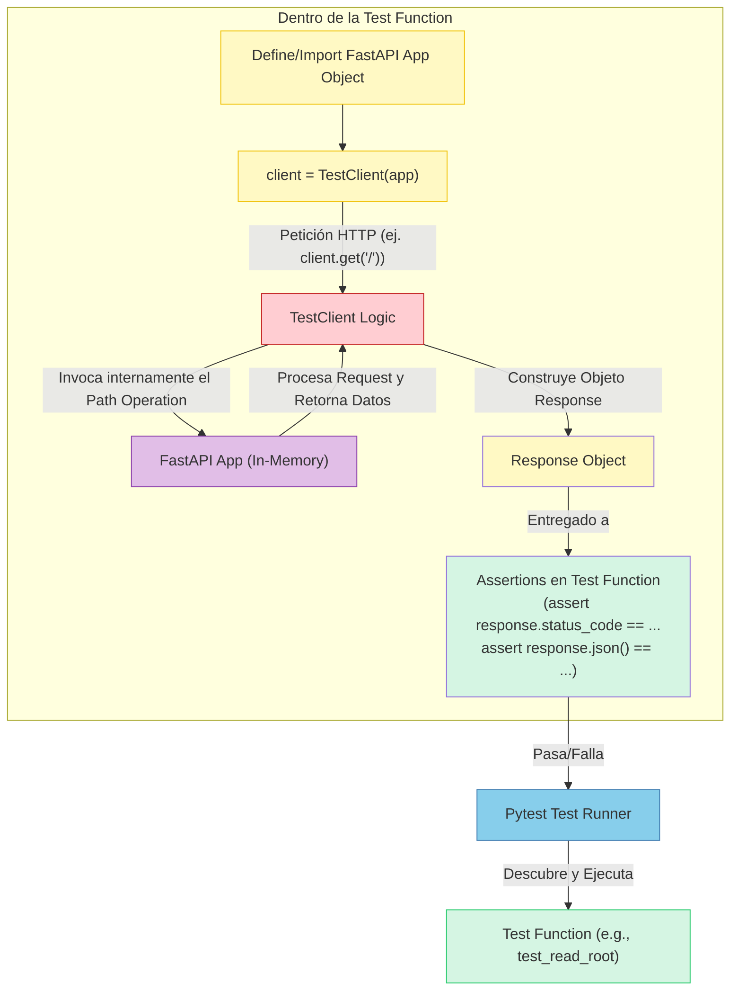
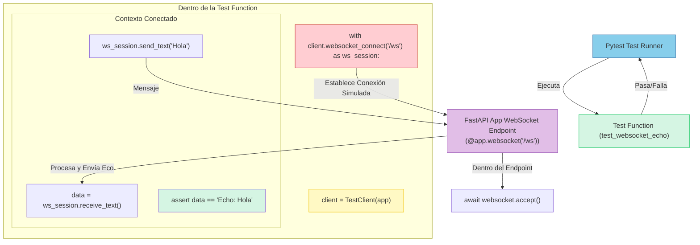
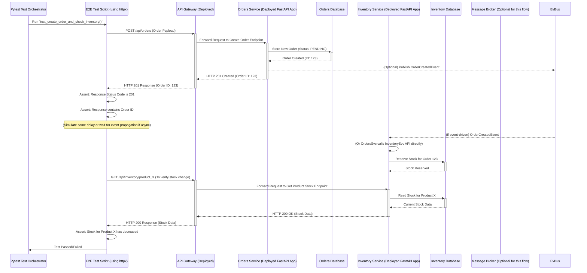
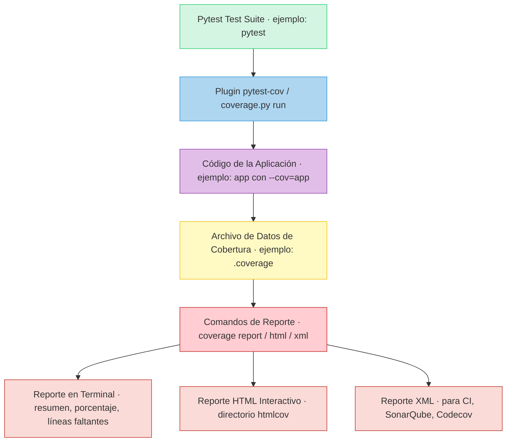
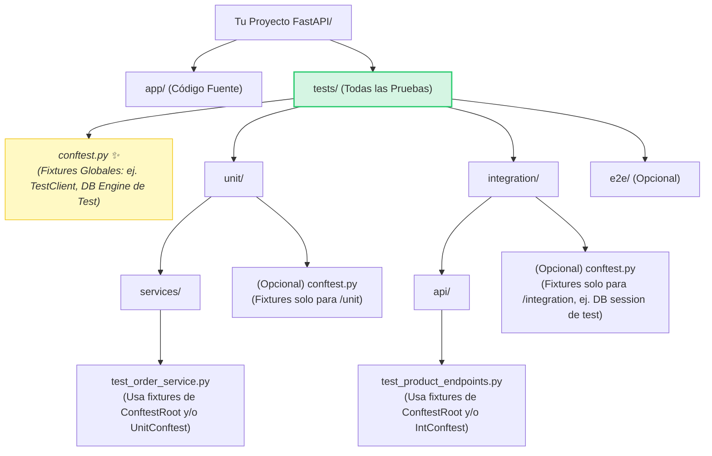

# Tema 14. BREVE INTRODUCCIÓN AL TESTING

* [Tema 14. BREVE INTRODUCCIÓN AL TESTING](Tema14.md#tema-14-breve-introducción-al-testing)
  * [14. Contenidos](Tema14.md#14-contenidos)
    * [14.1 Entorno de pruebas con Pytest en FastAPI](Tema14.md#141-entorno-de-pruebas-con-pytest-en-fastapi)
    * [14.2 Pruebas unitarias para servicios de dominio](Tema14.md#142-pruebas-unitarias-para-servicios-de-dominio)
    * [14.3 Simulación de dependencias con `unittest.mock`](Tema14.md#143-simulación-de-dependencias-con-unittestmock)
    * [14.4 `TestClient` para REST y WebSocket](Tema14.md#144-testclient-para-rest-y-websocket)
    * [14.5 Pruebas de integración con DB temporal](Tema14.md#145-pruebas-de-integración-con-db-temporal)
    * [14.6 Pruebas E2E entre microservicios](Tema14.md#146-pruebas-e2e-entre-microservicios)
    * [14.7 Validación de eventos y colas en tests async](Tema14.md#147-validación-de-eventos-y-colas-en-tests-async)
    * [14.8 Cobertura y calidad con `coverage.py`](Tema14.md#148-cobertura-y-calidad-con-coveragepy)
    * [14.9 Estructura de carpetas y fixtures](Tema14.md#149-estructura-de-carpetas-y-fixtures)
    * [14.10 Automatización en pipelines CI/CD](Tema14.md#1410-automatización-en-pipelines-cicd)
  * [Bibliografía](Tema14.md#bibliografía)

## 14. Contenidos

### 14.1 Entorno de pruebas con Pytest en FastAPI

Este es un tema absolutamente crucial. No importa cuán brillante sea el diseño de tu API, cuán eficientes sean tus `WebSockets` o cuán elegante sea tu lógica de dominio; sin un conjunto robusto de pruebas, estás navegando en aguas turbulentas sin un mapa ni un salvavidas. El `testing` no es una ocurrencia tardía, es una parte integral del desarrollo profesional de software.

Iniciaremos con el **14.1**, sentando las bases de nuestro entorno de pruebas con dos herramientas fundamentales en el ecosistema Python y FastAPI: `Pytest` y el `TestClient` de FastAPI.

***

Construir software es un arte, pero asegurar su calidad y fiabilidad es una ciencia. Las pruebas son el proceso mediante el cual validamos que nuestra aplicación se comporta como esperamos, hoy y después de cada cambio futuro. En este tema, exploraremos diferentes niveles de pruebas:

* **`Unit Tests` (Pruebas Unitarias):** Verifican pequeñas piezas de código aisladas (ej. una función, un método de una clase).
* **`Integration Tests` (Pruebas de Integración):** Verifican la interacción entre varios componentes (ej. tu API con la base de datos).
* **`End-to-End (E2E) Tests` (Pruebas de Extremo a Extremo):** Verifican flujos completos de la aplicación desde la perspectiva del usuario.

Para orquestar todo esto, necesitamos un `test runner` y herramientas que faciliten la interacción con nuestra aplicación FastAPI.

**1. `Pytest`: El Compañero de Pruebas Elegido por Su Simplicidad y Poder 🛡️**

Mientras que Python viene con el módulo `unittest` en su librería estándar, **`pytest`** se ha convertido en el `framework` de pruebas de facto para muchos en la comunidad Python, y por buenas razones:

* **Menos `Boilerplate`:** Escribir pruebas con `pytest` es a menudo más conciso. No necesitas heredar de clases base para la mayoría de los casos.
* **`Fixtures` Potentes:** Un sistema de `dependency injection` para tus pruebas, que permite configurar `setup/teardown` de forma modular y reutilizable (veremos `fixtures` en 14.9).
* **`Assertions` Simples:** Usa el `assert` estándar de Python, lo que hace las pruebas más legibles. `Pytest` proporciona introspección detallada en caso de fallo.
* **Vasto Ecosistema de `Plugins`:** Para `reporting`, `coverage`, pruebas asíncronas, integración con otros `frameworks`, etc.
* **Excelente Integración con FastAPI:** Funciona de maravilla para probar aplicaciones FastAPI, incluyendo sus aspectos asíncronos.

**2. Configurando Tu Laboratorio de Pruebas: Instalación y Convenciones 🧪**

Manos a la obra. Para empezar a probar tu aplicación FastAPI con `pytest`:

*   **Instalación:**\
    Necesitarás `pytest` y, dado que FastAPI es asíncrono, `pytest-asyncio` es indispensable. `httpx` es usado por el `TestClient` de FastAPI.

    ```bash
    pip install pytest pytest-asyncio httpx
    ```
*   **Convenciones Fundamentales de `Pytest`:**`Pytest` usa convenciones para descubrir automáticamente tus pruebas:

    | Elemento                          | Convención de Nombrado (`Naming Convention`) | Ejemplo (`Example`)                  |
    | --------------------------------- | -------------------------------------------- | ------------------------------------ |
    | Archivos de Test (`Test Files`)   | `test_*.py` o `*_test.py`                    | `test_main_api.py`, `auth_test.py`   |
    | Funciones Test (`Test Functions`) | `test_*()`                                   | `test_read_root_success()`           |
    | Clases Test (`Test Classes`)      | `Test*` (si decides agrupar tests en clases) | `TestUserAuthentication`             |
    | `Assertions`                      | `assert <expresión_booleana>`                | `assert response.status_code == 200` |

**3. `TestClient` de FastAPI: Tu Cliente Fantasma para Pruebas HTTP 👻**

FastAPI viene con una herramienta increíblemente útil para probar tus `endpoints` HTTP: `TestClient`.

* **Importación:** `from fastapi.testclient import TestClient`
* **¿Qué es?** Es un cliente que te permite hacer peticiones HTTP (como `GET`, `POST`, etc.) a tu aplicación FastAPI **directamente en memoria, sin necesidad de levantar un servidor HTTP real** (como Uvicorn). Interactúa con tu aplicación a través de la interfaz ASGI.
* **Basado en `httpx`:** Esto significa que soporta operaciones tanto síncronas como asíncronas de forma transparente para tu aplicación FastAPI (que es asíncrona).
*   **Instanciación:** Se crea una instancia pasándole tu objeto de aplicación FastAPI.

    ```python
    from fastapi import FastAPI
    from fastapi.testclient import TestClient

    app = FastAPI() # Tu aplicación FastAPI

    @app.get("/")
    async def read_root():
        return {"message": "Hello, FastAPI!"}

    client = TestClient(app) # Instancia del TestClient asociada a tu app
    ```

**4. Tu Primera Prueba `Pytest` con `TestClient`: ¡El "Hola Mundo" de la Calidad! 🚦**

Vamos a escribir una prueba simple para el `endpoint` `/` que definimos arriba.

*   **Crear un Archivo de Prueba:** Por ejemplo, `test_main.py` en un directorio `tests/` (o en el mismo directorio de tu `app` para empezar).

    ```python
    # tests/test_main.py
    from fastapi import FastAPI
    from fastapi.testclient import TestClient

    # Puedes definir una app simple aquí para probar o importar tu app principal
    # Para este ejemplo, definimos una app simple:
    app_for_testing = FastAPI()

    @app_for_testing.get("/")
    async def read_root_for_testing():
        return {"greeting": "Hello from Test"}

    # Crear un cliente para esta app de prueba
    client = TestClient(app_for_testing)


    def test_read_root_endpoint():
        """
        Prueba el endpoint raíz para verificar el status code y el contenido JSON.
        """
        response = client.get("/") # El TestClient hace la petición
        
        assert response.status_code == 200 # Verificar el status code
        assert response.json() == {"greeting": "Hello from Test"} # Verificar el payload JSON

    def test_non_existent_endpoint():
        response = client.get("/non-existent-path")
        assert response.status_code == 404 # FastAPI devuelve 404 para rutas no encontradas
    ```
*   **Ejecutando `pytest`:**\
    Abre tu terminal en el directorio raíz de tu proyecto (donde está tu directorio `tests/` o tu archivo `test_main.py`) y simplemente ejecuta:

    ```bash
    pytest
    ```

    `Pytest` descubrirá y ejecutará automáticamente tus funciones `test_*`. Deberías ver una salida indicando que las pruebas han pasado.

**5. Probando `Endpoints` Asíncronos (y Pruebas Asíncronas) ⚡**

Tu aplicación FastAPI es asíncrona. El `TestClient` está diseñado para trabajar con esto sin problemas, incluso si tu función de prueba es síncrona (como `test_read_root_endpoint` arriba). El `TestClient` maneja el `event loop` internamente para llamar a tu `path operation function` asíncrona.

Sin embargo, si tu **lógica de prueba en sí misma necesita usar `await`** (por ejemplo, para preparar datos con una dependencia asíncrona antes de la llamada HTTP, o para interactuar con `WebSockets` de forma asíncrona en una prueba), entonces tu función de prueba debe ser `async def` y debes usar el `marker` de `pytest-asyncio`.

*   **Ejemplo (Ilustrativo, no estrictamente necesario para `GET` simple):**

    ```python
    # tests/test_main.py (continuación)
    import pytest # Necesario para el marker @pytest.mark.asyncio

    # ... (app_for_testing y client definidos como antes) ...

    @pytest.mark.asyncio
    async def test_read_root_async_test_function():
        # En este caso particular, la llamada client.get("/") sigue siendo síncrona en su interfaz,
        # pero el TestClient se encarga de ejecutar la app FastAPI asíncrona.
        # Marcar el test como async es útil si necesitas 'await' otras cosas dentro del test.
        
        # async_setup_data = await some_async_setup_function() # Ejemplo de necesidad de await
        
        response = client.get("/") # Esta llamada sigue siendo síncrona desde la perspectiva del test
        
        assert response.status_code == 200
        assert response.json() == {"greeting": "Hello from Test"}
        
        # await some_async_teardown_function(async_setup_data) # Ejemplo de necesidad de await
    ```

    _Para la mayoría de las pruebas de `endpoints` HTTP simples con `TestClient`, no necesitarás marcar tus tests como `@pytest.mark.asyncio` a menos que la lógica de configuración o aserción de tu prueba sea asíncrona. El `TestClient` "puentea" el mundo síncrono de la prueba con el mundo asíncrono de tu `app` FastAPI para las llamadas HTTP._ Cuando probemos `WebSockets` (14.4), veremos un uso más claro de `@pytest.mark.asyncio`.

**Diagrama `Mermaid`: El Flujo de una Prueba con `TestClient` 🌊**



***

### 14.2 Pruebas unitarias para servicios de dominio

Con nuestro entorno de pruebas FastAPI + `Pytest` listo (14.1), es hora de sumergirnos en el corazón de nuestra aplicación: la **lógica de negocio**. El **14.2** se enfoca en las **pruebas unitarias (`unit tests`) para los servicios de dominio o aplicación**. Estas pruebas son fundamentales porque verifican la corrección de la lógica central de tu sistema de forma aislada, rápida y precisa.

Imagina que tus `endpoints` API son la fachada de una fábrica compleja. Las pruebas unitarias de servicios son como inspeccionar cada máquina individual dentro de la fábrica para asegurar que realiza su tarea específica a la perfección, sin depender de que el resto de la línea de ensamblaje esté funcionando.

***

Mientras que las pruebas con `TestClient` (que veremos más en 14.4) verifican el comportamiento de tus `endpoints` HTTP, las pruebas unitarias para `services` se centran en una capa más profunda: la lógica de negocio que orquesta las operaciones, aplica reglas y toma decisiones. Esta capa es a menudo donde reside la complejidad y el valor real de tu aplicación.

**¿Qué Son las Pruebas Unitarias para `Services` de Dominio/Aplicación? 🎯**

* **Definición:** Una prueba unitaria verifica la funcionalidad de una "unidad" de código de forma **aislada**. En este contexto, una "unidad" suele ser una función, un método dentro de una clase de servicio, o la clase de servicio completa si sus métodos colaboran estrechamente para un caso de uso.
* **Objetivos Principales:**
  * Verificar que la lógica interna de la unidad funciona como se espera para diferentes entradas.
  * Asegurar que se manejan correctamente los casos límite (`edge cases`) y los escenarios de error.
  * Validar que la unidad interactúa correctamente con sus dependencias (aunque estas dependencias serán simuladas o `mocked`).
* **El Principio de Aislamiento (CRUCIAL):**\
  Una prueba unitaria **NO** debe interactuar con sistemas externos como:
  * Bases de datos reales.
  * Servicios de red (otras APIs, `message brokers`).
  * El `filesystem`.\
    Cualquier dependencia de este tipo debe ser reemplazada por un **`test double`** (un `mock`, `stub`, o `fake`) durante la prueba.

**Identificando Tus "Unidades" de Prueba: `Services` y Lógica de Negocio 🔎**

En una arquitectura bien estructurada (como la Hexagonal o una arquitectura por capas), los candidatos ideales para pruebas unitarias son:

* **`Application Services` o `Use Case Handlers`:** Clases que orquestan un caso de uso específico, coordinando repositorios, `domain entities`, y otros servicios.
* **`Domain Services`:** Clases que encapsulan lógica de dominio que no encaja naturalmente dentro de una `entity` o `value object`.
* **Métodos Complejos dentro de `Entities` o `Aggregates`:** A veces, la lógica dentro de tus objetos de dominio es lo suficientemente compleja como para justificar sus propias pruebas unitarias.

La clave es identificar piezas de código con lógica de negocio que puedan ser probadas de forma independiente, simulando sus interacciones con el mundo exterior.

**El Arte de la Simulación: `Mocking` y `Stubbing` Dependencias con `unittest.mock` 🎭**

Para lograr el aislamiento, necesitamos simular las dependencias de nuestro servicio bajo prueba. La librería estándar de Python `unittest.mock` (que se integra perfectamente con `pytest`, o puedes usar el `plugin` `pytest-mock` que provee `fixtures` convenientes) es nuestra herramienta para esto.

* **¿Por Qué `Mockear`?**
  * **Aislamiento:** Permite probar la lógica del servicio sin los efectos secundarios o la imprevisibilidad de las dependencias reales.
  * **Velocidad:** Los `mocks` son rápidos; no hay latencia de red o BBDD.
  * **Control:** Puedes configurar los `mocks` para que devuelvan valores específicos o simulen condiciones de error, permitiéndote probar todos los caminos de tu código.
  * **Verificación de Interacciones:** Puedes verificar que tu servicio llamó a los métodos correctos de sus dependencias con los argumentos esperados.
*   **Conceptos Clave de `unittest.mock` (Tabla Resumen):**

    | Atributo/Método del `Mock`                 | Propósito                                                                                                  | Ejemplo de Uso (`mock_obj.attribute`)                               |
    | ------------------------------------------ | ---------------------------------------------------------------------------------------------------------- | ------------------------------------------------------------------- |
    | `return_value`                             | Especifica el valor que un `mock` (o un método `mockeado`) debe devolver cuando se llama.                  | `mock_repo.get_user.return_value = User(...)`                       |
    | `side_effect`                              | Puede ser una función a llamar, una excepción a lanzar, o una lista de valores a devolver secuencialmente. | `mock_api.call.side_effect = NetworkError("Fallo")`                 |
    | `call_count`                               | Entero que indica cuántas veces se ha llamado al `mock` o a uno de sus atributos.                          | `assert mock_logger.log.call_count == 2`                            |
    | `called`                                   | `Boolean` que indica si el `mock` (o un atributo) fue llamado al menos una vez.                            | `assert mock_notifier.send_email.called is True`                    |
    | `assert_called()`                          | Afirma que el `mock` fue llamado al menos una vez. Lanza `AssertionError` si no.                           | `mock_obj.some_method.assert_called()`                              |
    | `assert_called_once()`                     | Afirma que el `mock` fue llamado exactamente una vez.                                                      | `mock_obj.some_method.assert_called_once()`                         |
    | `assert_called_with(*args, **kwargs)`      | Verifica que la última llamada al `mock` fue con los argumentos y `keywords` especificados.                | `mock_repo.save.assert_called_with(user_instance)`                  |
    | `assert_called_once_with(*args, **kwargs)` | Igual, pero asegura que fue llamado exactamente una vez con esos argumentos.                               | `mock_repo.save.assert_called_once_with(user_instance)`             |
    | `assert_any_call(*args, **kwargs)`         | Verifica si el `mock` fue llamado alguna vez con los argumentos especificados.                             | `mock_logger.info.assert_any_call("Proceso iniciado")`              |
    | `call_args`                                | Tupla `(args, kwargs)` de la última llamada. O `None`.                                                     | `args, kwargs = mock_obj.some_method.call_args`                     |
    | `call_args_list`                           | Lista de todas las llamadas hechas al `mock`, cada una una tupla `(args, kwargs)`.                         | `for call_obj in mock_obj.some_method.call_args_list: ...`          |
    | `patch` (de `unittest.mock`)               | Un `context manager` o decorador para reemplazar temporalmente objetos en un módulo con `mocks`.           | `@patch('module.Clase.metodo')` o `with patch(...) as mock_metodo:` |

    * **`AsyncMock`:** Para `mockear` funciones o métodos `async`, `unittest.mock.AsyncMock` es esencial. Se comporta como un `MagicMock` pero sus métodos `mockeados` devuelven `awaitables` y las `assertions` como `assert_awaited_once_with` están disponibles.
* **Diagrama Conceptual: Prueba Unitaria de un Servicio con `Mocks`**

**Escribiendo Pruebas Unitarias para un `Service`: Un Ejemplo Práctico 🧪**

Imaginemos un `PremiumUserService` que decide si un usuario puede acceder a una `feature` premium basándose en su tipo de suscripción y quizás alguna otra lógica.

*   **Definición del `Service` y sus Dependencias (Interfaces):**

    ```python
    # app/services/premium_service.py
    from typing import Protocol, Optional
    from enum import Enum

    class SubscriptionType(str, Enum):
        FREE = "free"
        PREMIUM = "premium"
        VIP = "vip"

    class User(BaseModel): # Asumimos un Pydantic model para User
        id: int
        username: str
        subscription_type: SubscriptionType

    class IUserRepository(Protocol): # Puerto para el repositorio de usuarios
        async def get_user_by_id(self, user_id: int) -> Optional[User]: ...

    class PremiumFeatureAccessError(Exception):
        pass

    class PremiumUserService:
        def __init__(self, user_repo: IUserRepository):
            self.user_repo = user_repo

        async def can_user_access_feature(self, user_id: int, feature_name: str) -> bool:
            if not feature_name:
                raise ValueError("Feature name cannot be empty.")

            user = await self.user_repo.get_user_by_id(user_id)
            if not user:
                raise ValueError(f"User with ID {user_id} not found.")

            if feature_name == "ultra_hd_streaming":
                if user.subscription_type in [SubscriptionType.PREMIUM, SubscriptionType.VIP]:
                    return True
                else:
                    raise PremiumFeatureAccessError("Ultra HD Streaming only for PREMIUM or VIP users.")
            
            if feature_name == "exclusive_content":
                if user.subscription_type == SubscriptionType.VIP:
                    return True
                else:
                    raise PremiumFeatureAccessError("Exclusive Content only for VIP users.")
            
            # Por defecto, otras features no premium podrían ser accesibles
            return True # O lanzar error si la feature no es conocida
    ```
*   **Escribiendo las Pruebas con `pytest` y `AsyncMock`:**\
    (Asegúrate de tener `pip install pytest pytest-asyncio`)

    ```python
    # tests/unit/services/test_premium_service.py
    import pytest
    from unittest.mock import AsyncMock # Para mockear coroutines
    from pydantic import BaseModel # Necesario para definir User en el test o importar

    # Re-definir o importar las clases necesarias para el test si están en otros módulos
    # from app.services.premium_service import (
    #     PremiumUserService, IUserRepository, User, SubscriptionType, PremiumFeatureAccessError
    # )

    # --- Definiciones simplificadas para el test (si no se importan) ---
    from enum import Enum
    from typing import Protocol, Optional

    class SubscriptionType(str, Enum):
        FREE = "free"; PREMIUM = "premium"; VIP = "vip"

    class User(BaseModel): 
        id: int; username: str; subscription_type: SubscriptionType

    class IUserRepository(Protocol):
        async def get_user_by_id(self, user_id: int) -> Optional[User]: ...

    class PremiumFeatureAccessError(Exception): pass

    class PremiumUserService: # Copia de la clase para que el test sea autocontenido
        def __init__(self, user_repo: IUserRepository): self.user_repo = user_repo
        async def can_user_access_feature(self, user_id: int, feature_name: str) -> bool:
            if not feature_name: raise ValueError("Feature name cannot be empty.")
            user = await self.user_repo.get_user_by_id(user_id)
            if not user: raise ValueError(f"User with ID {user_id} not found.")
            if feature_name == "ultra_hd_streaming":
                if user.subscription_type in [SubscriptionType.PREMIUM, SubscriptionType.VIP]: return True
                else: raise PremiumFeatureAccessError("Ultra HD Streaming only for PREMIUM or VIP users.")
            if feature_name == "exclusive_content":
                if user.subscription_type == SubscriptionType.VIP: return True
                else: raise PremiumFeatureAccessError("Exclusive Content only for VIP users.")
            return True 
    # --- Fin Definiciones simplificadas ---


    @pytest.fixture
    def mock_user_repo(self) -> AsyncMock: # Usando pytest-mock 'mocker' también es una opción
        return AsyncMock(spec=IUserRepository)

    @pytest.mark.asyncio
    async def test_vip_user_can_access_ultra_hd(mock_user_repo: AsyncMock):
        # Arrange
        vip_user = User(id=1, username="vip_user", subscription_type=SubscriptionType.VIP)
        mock_user_repo.get_user_by_id.return_value = vip_user # Configurar el mock
        
        service = PremiumUserService(user_repo=mock_user_repo)
        
        # Act
        can_access = await service.can_user_access_feature(user_id=1, feature_name="ultra_hd_streaming")
        
        # Assert
        assert can_access is True
        mock_user_repo.get_user_by_id.assert_awaited_once_with(1) # Verificar llamada al mock

    @pytest.mark.asyncio
    async def test_free_user_cannot_access_ultra_hd(mock_user_repo: AsyncMock):
        # Arrange
        free_user = User(id=2, username="free_user", subscription_type=SubscriptionType.FREE)
        mock_user_repo.get_user_by_id.return_value = free_user
        service = PremiumUserService(user_repo=mock_user_repo)
        
        # Act & Assert
        with pytest.raises(PremiumFeatureAccessError) as exc_info:
            await service.can_user_access_feature(user_id=2, feature_name="ultra_hd_streaming")
        
        assert "only for PREMIUM or VIP users" in str(exc_info.value)
        mock_user_repo.get_user_by_id.assert_awaited_once_with(2)

    @pytest.mark.asyncio
    async def test_access_non_existent_user_raises_error(mock_user_repo: AsyncMock):
        # Arrange
        mock_user_repo.get_user_by_id.return_value = None # Simular usuario no encontrado
        service = PremiumUserService(user_repo=mock_user_repo)
        
        # Act & Assert
        with pytest.raises(ValueError) as exc_info:
            await service.can_user_access_feature(user_id=999, feature_name="any_feature")
        
        assert "User with ID 999 not found" in str(exc_info.value)

    # ... más tests para otros casos (ej. feature_name vacío, otras features) ...
    ```

**Estructura de Pruebas: El Patrón `Arrange, Act, Assert (AAA)`**

Una buena práctica para estructurar tus pruebas unitarias es seguir el patrón AAA:

1. **`Arrange` (Organizar):** Prepara todo lo necesario para la prueba. Esto incluye:
   * Crear instancias de los objetos necesarios.
   * Configurar los `mocks` (establecer `return_value`, `side_effect`, etc.).
   * Definir los `inputs` para la unidad bajo prueba.
2. **`Act` (Actuar):** Ejecuta la unidad de código que estás probando (ej. llamar al método del servicio).
3. **`Assert` (Afirmar):** Verifica que los resultados sean los esperados. Esto incluye:
   * Comprobar el valor de retorno de la unidad.
   * Verificar que los `mocks` fueron llamados como se esperaba (`call_count`, `assert_called_with`).
   * Verificar que se lanzaron las excepciones correctas en casos de error.

Los ejemplos anteriores siguen este patrón.

**Beneficios Concretos de las Pruebas Unitarias de `Services` 🏆**

* **Ejecución Extremadamente Rápida:** Al no depender de BBDD, red, etc., estas pruebas se ejecutan en milisegundos. Esto permite un `feedback loop` muy corto durante el desarrollo.
* **Feedback Preciso y Aislado:** Si una prueba unitaria falla, sabes que el problema está en la lógica de esa unidad específica, no en una dependencia externa.
* **Fomenta el Buen Diseño (SOLID, DI):** Escribir código que sea fácil de probar unitariamente te empuja naturalmente hacia principios de diseño como la `Single Responsibility Principle (SRP)` y la `Dependency Inversion Principle (DIP)` (usando interfaces y `Dependency Injection`).
* **Documentación Viva y Ejecutable:** Tus pruebas unitarias sirven como ejemplos concretos de cómo se espera que se comporte cada parte de tu `service`.
* **Seguridad en la Refactorización:** Puedes cambiar la implementación interna de un `service` con mucha más confianza si tienes una buena `suite` de pruebas unitarias que verifiquen que su comportamiento observable no ha cambiado.

**Conclusión: Construyendo Confianza Desde el Núcleo de Tu Aplicación ❤️‍🩹**

Las pruebas unitarias de tus `services` de dominio y aplicación son la primera y más fundamental línea de defensa contra `bugs` y regresiones. Son el microscopio que te permite examinar y validar la lógica más crítica de tu sistema.`Pytest` y las capacidades de `mocking` de Python (`unittest.mock` o `pytest-mock`) te proporcionan todas las herramientas necesarias para escribir estas pruebas de forma efectiva, aislada y elegante. Esta práctica no solo mejora la calidad de tu `software`, sino que también acelera el desarrollo a largo plazo al proporcionar una red de seguridad para la evolución y refactorización de tu código.

***

### 14.3 Simulación de dependencias con `unittest.mock`

Si en el 14.2 aprendimos _por qué_ y _cómo_ probar nuestros `services` de forma aislada conceptualmente, en este **14.3** nos sumergiremos en las herramientas y técnicas específicas que nos permiten crear esas "simulaciones" o "dobles de acción" para las dependencias de nuestro código. Nos centraremos en la biblioteca estándar de Python **`unittest.mock`**, con una mención especial a su integración con `pytest` a través de `pytest-mock`.

Imagina que eres un director de cine (el `test case`) y tu actor principal es el servicio que estás probando (`Service Under Test - SUT`). Para que tu actor brille, a veces necesitas que los actores secundarios (las dependencias) digan exactamente sus líneas o se comporten de una manera predecible, incluso si en la vida real son impredecibles (como una API externa o una base de datos). Los `mocks` son tus actores secundarios entrenados para la prueba.

***

Para que las pruebas unitarias sean verdaderamente "unitarias", la unidad de código bajo prueba debe estar aislada de sus dependencias externas (bases de datos, APIs de red, `filesystem`, otras clases complejas). La biblioteca `unittest.mock` de Python es el estándar para lograr este aislamiento mediante la creación de objetos simulados, conocidos como **`mocks`**.

**`unittest.mock` Profundizado: Más Allá de `return_value` 🕵️‍♂️**

Ya introdujimos `AsyncMock` (una variante de `MagicMock` para `async`) en 14.2. Exploremos un poco más las capacidades de los objetos `Mock` y `MagicMock` (la diferencia principal es que `MagicMock` implementa la mayoría de los métodos mágicos, haciéndolo más transparente como reemplazo):

* **`spec` y `spec_set`: Creando `Mocks` Más Seguros y Precisos**\
  Cuando creas un `mock`, puedes pasarle el argumento `spec` (o `spec_set`) con una clase o un objeto como plantilla.
  * `spec=MiClaseReal`: El `mock` solo permitirá el acceso a atributos y métodos que existen en `MiClaseReal`. Si intentas acceder a un atributo inexistente en la `spec`, se lanzará un `AttributeError`. Esto ayuda a detectar si tu código bajo prueba está usando incorrectamente la interfaz de una dependencia (ej. por un `typo` o un cambio en la API de la dependencia).
  * `spec_set=MiClaseReal`: Aún más estricto. No solo previene el acceso a atributos no existentes, sino que también previene la _asignación_ a atributos no existentes en la `spec`.
* **`side_effect` Revisited: Simulando Comportamientos Dinámicos**\
  Mientras `return_value` es estático, `side_effect` es increíblemente versátil:
  * **Lanzar Excepciones:** `mock_objeto.metodo.side_effect = MiExcepcion("Error simulado")`. Perfecto para probar cómo tu código maneja errores de sus dependencias.
  * **Devolver Diferentes Valores en Llamadas Sucesivas:** `mock_objeto.metodo.side_effect = [10, 20, ValueError("Se acabaron los valores")]`.
  * **Llamar a Otra Función:** `mock_objeto.metodo.side_effect = mi_funcion_simuladora`. La función `mi_funcion_simuladora` será llamada con los mismos argumentos que el método `mockeado`.
*   **Configurando `Mocks` Jerárquicos (`configure_mock`)**\
    Si necesitas `mockear` un objeto que tiene atributos que a su vez son objetos con métodos, puedes configurarlo todo de una vez:

    ```python
    # from unittest.mock import MagicMock
    # mock_user = MagicMock()
    # mock_user.configure_mock(
    #     name="Alice",
    #     address=MagicMock(street="123 Main St", get_zip_code=MagicMock(return_value="90210"))
    # )
    # print(mock_user.name)  # Alice
    # print(mock_user.address.get_zip_code())  # 90210
    ```

**El Poder de `patch`: Reemplazando Dependencias en el Momento Justo 🎯**

A menudo, la dependencia que quieres `mockear` no es algo que inyectas directamente en el constructor de tu SUT, sino algo que tu SUT importa o accede globalmente (ej. `datetime.now()`, una función de utilidad en el mismo módulo, una clase importada de otra librería). Aquí es donde `unittest.mock.patch` se convierte en tu herramienta más poderosa.

* **¿Qué es `patch`?** Es una función que te permite reemplazar temporalmente objetos en un `namespace` específico con un `Mock` (o `MagicMock`, `AsyncMock`) durante la ejecución de una prueba. Al finalizar la prueba (o el contexto del `patch`), el objeto original se restaura.
* **Formas de Usar `patch`:**
  1.  **Como Decorador (`@patch`):**\
      El `mock object` se inyecta como un argumento en tu función de prueba.

      ```python
      # En tu módulo: my_module.py
      # import datetime
      # def get_current_day_name():
      #     return datetime.datetime.now().strftime('%A')

      # En tu test: tests/test_my_module.py
      from unittest.mock import patch
      # from my_app.my_module import get_current_day_name # Asumiendo que está en my_app
      import datetime # Necesario para crear el objeto datetime simulado

      # @patch('my_app.my_module.datetime') # Parchear 'datetime' DENTRO de my_module
      # def test_get_current_day_name_on_monday(mock_datetime):
      #     # Configurar el mock para que datetime.datetime.now() devuelva un lunes específico
      #     mock_datetime.datetime.now.return_value = datetime.datetime(2025, 5, 19) # Es un lunes
          
      #     day_name = get_current_day_name()
          
      #     assert day_name == "Monday"
      #     mock_datetime.datetime.now.assert_called_once()
      ```

      * **Orden de Decoradores:** Si usas múltiples `@patch`, el orden de los argumentos inyectados es inverso al de los decoradores (el último decorador es el primer argumento).
  2.  **Como `Context Manager` (`with patch(...) as mock_name`):**\
      Útil cuando solo necesitas el `mock` en una porción de tu prueba.

      ```python
      # from unittest.mock import patch
      # from my_app.my_module import some_function_that_uses_external_api
      # import httpx # Suponiendo que la función usa httpx

      # def test_some_function_handles_api_error():
      #     with patch('my_app.my_module.httpx.get') as mock_get: # Parchear httpx.get donde se usa
      #         mock_get.side_effect = httpx.RequestError("Simulated network failure")
              
      #         with pytest.raises(MyApplicationNetworkError): # Asumiendo una excepción custom
      #             some_function_that_uses_external_api("http://example.com/api/data")
              
      #         mock_get.assert_called_once_with("http://example.com/api/data")
      ```
  3.  **`patch.object(target_object, 'attribute_name', ...)`:**\
      Para `mockear` un método o atributo en un objeto _ya existente_ o una clase.

      ```python
      # from unittest.mock import patch
      # class RealService:
      #     def get_data(self): return "real_data"
      # service_instance = RealService()

      # def test_with_patch_object():
      #     with patch.object(service_instance, 'get_data', return_value="mocked_data_for_instance") as mock_method:
      #         result = service_instance.get_data()
      #         assert result == "mocked_data_for_instance"
      #         mock_method.assert_called_once()
          
      #     # Fuera del with, service_instance.get_data() vuelve a ser el método real
      #     assert service_instance.get_data() == "real_data" 
      ```
  4. **"¿Dónde `Patchear`?" (`Where to Patch`) – El Punto Crítico:**\
     Este es el concepto más importante y a menudo confuso de `patch`. Debes `patchear` el objeto **donde es buscado (`looked up`) y usado por tu módulo bajo prueba**, no necesariamente donde está definido originalmente.
     * Si `mi_servicio.py` hace `from utils.calculadora import suma_avanzada`, y quieres probar una función en `mi_servicio.py` que usa `suma_avanzada`, debes parchear `'mi_servicio.suma_avanzada'`, no `'utils.calculadora.suma_avanzada'`. Tu SUT (`mi_servicio`) tiene su propia referencia a `suma_avanzada`.
  5. **Diagrama `Mermaid` Conceptual del `Patch`:**

**`pytest-mock`: Simplificando `unittest.mock` con `Fixtures` (El `mocker` Fixture) ✨**

El `plugin` `pytest-mock` (que se instala con `pip install pytest-mock`) proporciona un `fixture` llamado `mocker` que ofrece una API un poco más concisa y orientada a `pytest` para usar las funcionalidades de `unittest.mock`.

*   **Uso del `Fixture`** **`mocker`:**

    ```python
    # tests/test_another_module.py
    # import pytest # No es necesario para el fixture mocker, pero sí para @pytest.mark.asyncio etc.
    # from another_app.another_module import function_using_os_environ

    # def test_function_with_mocker(mocker): # Inyectar el fixture mocker
    #     # Mockear os.environ.get
    #     mock_getenv = mocker.patch('another_app.another_module.os.environ.get')
    #     mock_getenv.return_value = "mocked_api_key"
        
    #     result = function_using_os_environ("API_KEY")
        
    #     assert result == "mocked_api_key"
    #     mock_getenv.assert_called_once_with("API_KEY", None) # Asumiendo que la función tiene un default=None
    ```
* `mocker.patch(...)`: Funciona de manera muy similar a `unittest.mock.patch`, pero como es un `fixture`, su "des-parcheo" (restauración) se maneja automáticamente al final del `scope` de la prueba (usualmente la función).
* `mocker.spy(objeto, 'nombre_metodo')`: Permite "espiar" las llamadas a un método real sin reemplazar su funcionalidad. Útil para verificar que un método real fue llamado, mientras permites que su lógica original se ejecute.
* `mocker.stub(name='mi_stub')`: Crea un objeto `mock` simple y genérico.

**Tabla Comparativa Rápida: `unittest.mock.patch` vs. `mocker.patch`**

| Característica           | `unittest.mock.patch` (decorador / `context manager`) | `pytest-mock` (`mocker` fixture)                                  |
| ------------------------ | ----------------------------------------------------- | ----------------------------------------------------------------- |
| **Uso Principal**        | Decorador (`@patch`) o `with patch(...)`.             | A través del `fixture` `mocker` (ej. `mocker.patch(...)`).        |
| **Paso del `Mock`**      | Como argumento a la función de test (para decorador). | El método `patch` de `mocker` devuelve el `mock object`.          |
| **`Scope` / Limpieza**   | Controlado por el alcance del decorador o `with`.     | Automático al final del `scope` de la prueba (función).           |
| **API**                  | API estándar de Python, un poco más verbosa.          | API un poco más concisa, estilo `pytest`.                         |
| **Curva de Aprendizaje** | Parte de la librería estándar.                        | Requiere el `plugin` `pytest-mock`, pero muy popular en `pytest`. |

**Conclusión: La Simulación como Herramienta Esencial para el Aislamiento y Control Fino 🔬**

Dominar las técnicas de simulación con `unittest.mock` (y su conveniente envoltorio `pytest-mock`) es absolutamente fundamental para escribir pruebas unitarias efectivas y significativas.

* Te permite **aislar completamente** la unidad de código que estás probando.
* Te da **control total** sobre el comportamiento de sus dependencias, permitiéndote simular una amplia gama de escenarios (casos de éxito, errores, valores límite).
* Resulta en pruebas que son **más rápidas, más fiables y más precisas** en la localización de fallos.

Con estas herramientas, puedes construir una red de seguridad robusta alrededor de tu lógica de negocio, permitiéndote refactorizar y añadir nuevas `features` con mucha mayor confianza.

***

### 14.4 `TestClient` para REST y WebSocket

Ya hemos sentado las bases de nuestro entorno de pruebas con `Pytest` (14.1) y hemos explorado cómo `mockear` dependencias para las pruebas unitarias de nuestros `services` (14.2, 14.3). Ahora, en el **14.4**, volvemos a la "fachada" de nuestra aplicación FastAPI: los `endpoints` HTTP RESTful y los canales `WebSocket`. Vamos a ver cómo el `TestClient` de FastAPI nos permite probar ambos de manera efectiva.

***

El `TestClient` de FastAPI (`from fastapi.testclient import TestClient`) es una herramienta increíblemente versátil. No solo nos permite simular peticiones HTTP a nuestros `endpoints` RESTful (como vimos brevemente en 14.1), sino que también proporciona una forma de interactuar y probar nuestros `endpoints` `WebSocket`.

**1. `TestClient` para `Endpoints` RESTful (Un Repaso Reforzado)**

Recordemos que para probar `endpoints` HTTP, instanciamos el `TestClient` con nuestra `app` FastAPI y luego usamos métodos que se asemejan a los de librerías HTTP como `requests`:

```python
from fastapi import FastAPI
from fastapi.testclient import TestClient
from pydantic import BaseModel

# --- Aplicación FastAPI de Ejemplo ---
class Item(BaseModel):
    id: int
    name: str
    description: Optional[str] = None

fake_db_items = {
    1: {"id": 1, "name": "Manzana", "description": "Roja y jugosa"},
    2: {"id": 2, "name": "Plátano", "description": "Amarillo y curvo"}
}

app = FastAPI()

@app.get("/items/{item_id}", response_model=Item)
async def read_item(item_id: int):
    if item_id not in fake_db_items:
        raise HTTPException(status_code=404, detail="Item not found")
    return fake_db_items[item_id]

@app.post("/items/", response_model=Item, status_code=201)
async def create_item(item: Item): # Asumimos que el ID viene en el payload para este ejemplo simple
    if item.id in fake_db_items:
        raise HTTPException(status_code=400, detail="Item already exists")
    fake_db_items[item.id] = item.model_dump()
    return item

# --- Pruebas con TestClient ---
client = TestClient(app) # Instanciar una vez, puede ser un fixture en pytest

def test_read_existing_item():
    response = client.get("/items/1")
    assert response.status_code == 200
    assert response.json() == {"id": 1, "name": "Manzana", "description": "Roja y jugosa"}

def test_read_non_existing_item():
    response = client.get("/items/99")
    assert response.status_code == 404
    assert response.json() == {"detail": "Item not found"}

def test_create_item_success():
    new_item_data = {"id": 3, "name": "Naranja", "description": "Cítrica y dulce"}
    response = client.post("/items/", json=new_item_data) # Enviar payload JSON
    assert response.status_code == 201
    assert response.json() == new_item_data
    # Verificar que realmente se añadió (opcional, depende de si quieres probar estado)
    assert 3 in fake_db_items 
    assert fake_db_items[3]["name"] == "Naranja"

def test_create_existing_item_fails():
    existing_item_data = {"id": 1, "name": "Manzana Otra Vez", "description": "Ya existe"}
    response = client.post("/items/", json=existing_item_data)
    assert response.status_code == 400 # O 409 Conflict, según tu lógica
    assert response.json() == {"detail": "Item already exists"}
```

* **Puntos Clave para Pruebas REST con `TestClient`:**
  * Usar `client.get()`, `client.post()`, `client.put()`, `client.patch()`, `client.delete()`.
  * Pasar `payloads` JSON con el argumento `json=...`.
  * Pasar `query parameters` con el argumento `params=...`.
  * Pasar `headers` con el argumento `headers=...`.
  * Verificar `response.status_code` y `response.json()` (o `response.text`, `response.content`).

**2. `TestClient` para `Endpoints`** **`WebSocket`: Estableciendo la Conexión de Prueba**

Probar `WebSockets` es un poco diferente porque las conexiones son persistentes y bidireccionales. El `TestClient` de FastAPI nos permite simular este comportamiento.

*   **Entrando en el Contexto `WebSocket`:**\
    El `TestClient` tiene un método `websocket_connect(url, subprotocols=None, ...)` que se usa como un `context manager` (`with` statement). Esto establece la conexión `WebSocket` simulada y te da un objeto `websocket` (similar al que recibes en tu `endpoint` FastAPI) para interactuar.

    ```python
    # from fastapi.testclient import TestClient
    # from fastapi import WebSocket # Solo para type hinting si es necesario

    # app = FastAPI() # Tu app con endpoints WebSocket
    # client = TestClient(app)

    # def test_websocket_connection_and_echo():
    #     with client.websocket_connect("/ws/echo") as websocket: # websocket es un Starlette WebSocketTestSession
    #         # La conexión está establecida aquí (equivalente a await websocket.accept() en el server)
    #         # ... pruebas de envío y recepción ...
    #         pass # Al salir del 'with', la conexión se cierra
    ```

    * **Importante:** Cuando usas `client.websocket_connect()`, el `TestClient` se encarga de simular el `handshake` y llama internamente al `await websocket.accept()` en tu `endpoint` del `server`. No necesitas (y no debes) llamar a `accept()` en el objeto `websocket` que te da `websocket_connect()`.
* **Enviando y Recibiendo Mensajes `WebSocket` en la Prueba:**\
  El objeto `websocket` devuelto por `websocket_connect()` tiene métodos para enviar y recibir datos:
  * `websocket.send_text(data)`
  * `websocket.send_bytes(data)`
  * `websocket.send_json(data)`
  * `websocket.receive_text() -> str`
  * `websocket.receive_bytes() -> bytes`
  * `websocket.receive_json() -> Any`
  * `websocket.close(code=1000)`
*   **Ejemplo Práctico: Probando un `Endpoint`** **`WebSocket` Eco Simple**

    Supongamos este `endpoint` `WebSocket` en nuestra `app` FastAPI:

    ```python
    # En tu main_app.py
    # from fastapi import FastAPI, WebSocket, WebSocketDisconnect

    # app = FastAPI() # Ya definida si es el mismo archivo que los tests REST

    @app.websocket("/ws/simple_echo")
    async def websocket_simple_echo_endpoint(websocket: WebSocket):
        await websocket.accept()
        try:
            while True:
                data = await websocket.receive_text()
                await websocket.send_text(f"Echo: {data}")
        except WebSocketDisconnect:
            print(f"Cliente {websocket.client.host}:{websocket.client.port} desconectado de Simple Echo.")
    ```

    Ahora, la prueba:

    ```python
    # tests/test_websockets.py
    # from fastapi.testclient import TestClient
    # from main_app import app # Importa tu app FastAPI

    # client = TestClient(app) # Puedes definirlo globalmente en el test file o como fixture

    def test_simple_echo_websocket():
        with client.websocket_connect("/ws/simple_echo") as websocket:
            # Enviar un mensaje al server
            test_message = "Hola WebSocket!"
            websocket.send_text(test_message)
            
            # Recibir la respuesta del server
            response_message = websocket.receive_text()
            assert response_message == f"Echo: {test_message}"

            # Enviar otro mensaje
            websocket.send_text("¿Funciona de nuevo?")
            response_message_2 = websocket.receive_text()
            assert response_message_2 == "Echo: ¿Funciona de nuevo?"
            
            # Opcional: cerrar la conexión desde el cliente de prueba
            # websocket.close(code=1000) 
            # Si no se cierra explícitamente, se cierra al salir del 'with'
    ```
*   **Probando `JSON Payloads`:**

    ```python
    # @app.websocket("/ws/json_echo")
    # async def websocket_json_echo(websocket: WebSocket):
    #     await websocket.accept()
    #     try:
    #         while True:
    #             data = await websocket.receive_json()
    #             await websocket.send_json({"response_to": data, "processed": True})
    #     except WebSocketDisconnect:
    #         pass

    # def test_json_echo_websocket():
    #     with client.websocket_connect("/ws/json_echo") as websocket:
    #         test_payload = {"client_id": 123, "message": "Datos en JSON"}
    #         websocket.send_json(test_payload)
            
    #         response_payload = websocket.receive_json()
    #         assert response_payload == {"response_to": test_payload, "processed": True}
    ```

**3. Manejando la Asincronía en Pruebas `WebSocket` con `pytest-asyncio`**

Si bien los métodos del `websocket` del `TestClient` (`send_text`, `receive_text`, etc.) son síncronos en su interfaz, el `endpoint` `WebSocket` de tu `app` FastAPI es asíncrono. El `TestClient` maneja esto.

Sin embargo, si tu lógica de prueba _alrededor_ de la interacción `WebSocket` necesita ser asíncrona (ej. necesitas `await` para configurar algo antes de conectar, o para verificar un efecto secundario asíncrono después de un `message`), tu función de prueba debe ser `async def` y usar `@pytest.mark.asyncio`.

*   **En general, para probar `WebSockets`, donde la interacción es inherentemente un flujo de `messages` que puede necesitar esperas o `delays` simulados, es más natural y a veces necesario escribir las pruebas `WebSocket` como `async`:**

    ```python
    import pytest
    import asyncio # Para asyncio.sleep si es necesario simular delays
    # from fastapi.testclient import TestClient
    # from main_app import app 
    # client = TestClient(app)

    # @pytest.mark.asyncio
    # async def test_websocket_with_server_push_and_async_test_logic(client: TestClient): # Pasando client como fixture
        # Supongamos un endpoint que envía un mensaje después de un delay
        # @app.websocket("/ws/delayed_push")
        # async def ws_delayed_push(websocket: WebSocket):
        #     await websocket.accept()
        #     await websocket.send_text("Conectado. Espera el push...")
        #     await asyncio.sleep(0.1) # Simular trabajo en backend
        #     await websocket.send_text("¡Aquí está tu push!")

        # with client.websocket_connect("/ws/delayed_push") as websocket:
        #     initial_message = websocket.receive_text() # Esto es síncrono
        #     assert initial_message == "Conectado. Espera el push..."
            
        #     # Si el 'TestClient's websocket.receive_text()' tuviera un timeout y
        #     # quisiéramos controlarlo con asyncio.wait_for, o si la lógica de aserción
        #     # dependiera de otros awaitables, el test async sería más claro.
        #     # Starlette's WebSocketTestSession.receive_text() puede tener un timeout.
        #     try:
        #         pushed_message = websocket.receive_text(timeout=0.5) # Usar el timeout del método
        #         assert pushed_message == "¡Aquí está tu push!"
        #     except TimeoutError: # (O la excepción específica que lance por timeout)
        #         pytest.fail("El servidor no hizo push del mensaje a tiempo.")
    ```

    * **Nota Importante sobre `TestClient` y `async` tests:** El `TestClient` en sí mismo no es un cliente `async` que usarías con `await client.get()`. Sus métodos (`.get()`, `.post()`, `.websocket_connect()`) son síncronos. El `TestClient` internamente maneja la ejecución del `event loop` de tu `app` `async` FastAPI. Si tu _test function_ necesita ser `async def` (para usar `await` para otras cosas, como `asyncio.sleep` o `async fixtures`), entonces usas `@pytest.mark.asyncio`. El objeto `websocket` que obtienes de `client.websocket_connect()` también tiene una interfaz síncrona (`websocket.send_text()`, `websocket.receive_text()`).

**4. Diagrama `Mermaid`: Flujo de Prueba `WebSocket` con `TestClient`**



**Conclusión: Simulando Conversaciones en Tiempo Real para una Calidad Asegurada 💬**

El `TestClient` de FastAPI es una herramienta unificada y poderosa que te permite probar rigurosamente tanto tus `endpoints` RESTful como tus canales `WebSocket` sin la complejidad de levantar un servidor real o de `mockear` toda la pila de red.

* Para **REST**, proporciona una interfaz familiar similar a `requests`.
* Para **`WebSockets`**, su `context manager` `websocket_connect()` y los métodos de envío/recepción en la `session` de prueba te dan un control preciso para simular interacciones `client-server` completas.

Al integrar estas pruebas en tu flujo de trabajo, puedes construir aplicaciones FastAPI con interfaces de comunicación en tiempo real que no solo son ricas en `features`, sino también robustas, fiables y menos propensas a regresiones.

***

### 14.5 Pruebas de integración con DB temporal

Hemos sentado las bases con `Pytest` (14.1) y hemos visto cómo aislar y probar nuestra lógica de negocio con `unit tests` y `mocks` (14.2, 14.3). También sabemos cómo probar nuestros `endpoints` HTTP y `WebSocket` usando el `TestClient` (14.4), pero hasta ahora, esas pruebas de `endpoints` no interactuaban con una base de datos real.

Es hora de dar un paso más y realizar **pruebas de integración (`integration tests`)**, donde verificamos que nuestra aplicación FastAPI interactúa correctamente con una base de datos, aunque sea una temporal o de prueba. Esto es "la prueba de fuego" para nuestra capa de persistencia.

***

Las pruebas unitarias son fantásticas para verificar la lógica aislada, pero no nos dicen si nuestro código puede realmente guardar y recuperar datos de una base de datos, si nuestros `mappings` ORM son correctos, o si nuestras `queries` se comportan como esperamos contra un sistema de base de datos real (o casi real). Aquí es donde las **pruebas de integración con una `database` temporal** se vuelven cruciales.

**¿Qué Son las Pruebas de Integración con Base de Datos? 🔗**

* **Foco:** Probar la interacción entre múltiples componentes de tu aplicación, específicamente la capa de aplicación (tus `endpoints` FastAPI, `services`, `repositories`) y la capa de persistencia (SQLAlchemy/`Motor` interactuando con una `database instance`).
* **Objetivo:**
  * Verificar que los datos se persisten correctamente.
  * Asegurar que las `queries` recuperan los datos esperados.
  * Validar que los `ORM mappings` (ej. de tus clases SQLAlchemy a tablas) son correctos.
  * Confirmar que la lógica de negocio que depende de la persistencia funciona como se espera.
* **Clave:** En estas pruebas, **no `mockeamos` la base de datos en sí misma ni el `driver`/ORM a bajo nivel**. Interactuamos con una instancia de base de datos real, aunque sea una creada y destruida específicamente para las pruebas.

**La Arena de Pruebas: Estrategias para `Databases` Temporales/Aisladas 🛡️**

**¡Regla de Oro: NUNCA uses tu base de datos de desarrollo o producción para ejecutar pruebas automatizadas!** Esto puede llevar a la corrupción de datos, resultados de prueba no reproducibles y, en general, al caos. Necesitamos un entorno de base de datos aislado y controlado para nuestras pruebas.

1. **SQLite `In-Memory` (Para SQLAlchemy - Rápido y Fácil para Empezar):**
   * **Configuración:** Simplemente cambias tu `DATABASE_URL` a algo como `"sqlite+aiosqlite:///:memory:"`.
   * **Pros:**
     * Extremadamente rápido para ejecutar pruebas, ya que opera en memoria.
     * No requiere `setup` de un `server` de base de datos externo.
     * Ideal para `CI pipelines` rápidos o desarrollo local.
   * **Cons:**
     * **No es tu `database` de producción:** SQLite tiene su propio dialecto SQL y no soporta todas las `features` o `constraints` de bases de datos más robustas como PostgreSQL o MySQL (ej. ciertos tipos de `ALTER TABLE`, `schemas` complejos, `window functions`, algunos `constraints` avanzados).
     * **Riesgo de Falsos Positivos/Negativos:** Una prueba podría pasar en SQLite pero fallar en PostgreSQL (o viceversa) debido a estas diferencias.
2. **Instancia de `Database` de Prueba en Docker (Máxima Fidelidad):**
   * **Configuración:** Usar Docker para levantar una instancia contenerizada de la misma tecnología de base de datos que usas en producción (ej. una imagen oficial de `postgres`, `mysql`, o `mongo`).
   * **`pytest-docker` o `Fixtures` Personalizados:** `Pytest plugins` como `pytest-docker` o `fixtures` personalizados pueden gestionar el ciclo de vida de estos contenedores (iniciarlos antes de la `test suite`, detenerlos después).
   * **Pros:**
     * **Alta Fidelidad:** Estás probando contra el mismo motor de base de datos que usarás en producción, lo que da mucha más confianza.
   * **Cons:**
     * Más lento de iniciar y configurar que SQLite `in-memory`.
     * Requiere que Docker esté disponible en el entorno de pruebas.
3. **`Database` de Prueba Dedicada o `Schemas` Temporales (En un `Server` Compartido):**
   * **Configuración:** Te conectas a un `server` de base de datos de desarrollo/pruebas existente, pero usas un nombre de base de datos completamente separado para tus pruebas (ej. `mi_app_test_db`) o, si tu BBDD lo soporta bien (como PostgreSQL), creas un `schema` nuevo para cada `test run` (o `test session`) y lo destruyes al final.
   * **Pros:** Puede ser más rápido que levantar un Docker nuevo cada vez si el `server` ya está corriendo. Permite usar `features` completas de la BBDD.
   * **Cons:** Requiere una gestión cuidadosa para asegurar el aislamiento entre `test runs` y para evitar conflictos si múltiples desarrolladores o `CI jobs` comparten el `server`.

**Tabla Comparativa de Estrategias de `Test Database`:**

| Estrategia                 | Pros                                                                                            | Contras                                                                                                 | Ideal Para...                                                                        |
| -------------------------- | ----------------------------------------------------------------------------------------------- | ------------------------------------------------------------------------------------------------------- | ------------------------------------------------------------------------------------ |
| SQLite `In-Memory`         | Muy rápido, sin `setup` externo, bueno para `CI` básicos.                                       | No es igual a BBDD de producción, `feature set` limitado, riesgo de falsos positivos/negativos.         | Pruebas unitarias de `repositories` (si abstraen bien el SQL), `prototyping` rápido. |
| Dockerized `Test DB`       | Máxima fidelidad (misma tecnología que producción), aislamiento total.                          | Más lento de iniciar, requiere Docker, puede consumir más recursos.                                     | Pruebas de integración exhaustivas, `CI pipelines` que buscan la máxima confianza.   |
| `Dedicated Test DB/Schema` | Usa `features` completas de la BBDD, puede ser más rápido que Docker si el `server` está listo. | Requiere gestión cuidadosa del aislamiento y limpieza, puede haber contención en `servers` compartidos. | Entornos de desarrollo controlados, equipos con infraestructura de BBDD de prueba.   |

**`Pytest Fixtures`: Orquestando el Ciclo de Vida de Tu `Test Database` 🪄**

Las `fixtures` de `Pytest` son la herramienta perfecta para gestionar la configuración (`setup`) y limpieza (`teardown`) de tu `test database` y las `sessions`.

1.  **`Fixture` para el `Engine` y Creación de Tablas (SQLAlchemy):**\
    Suele tener un `scope` de `"session"` (se ejecuta una vez por toda la sesión de pruebas) o `"module"`.

    ```python
    # conftest.py (o en tu archivo de test principal)
    import pytest_asyncio # Para fixtures async
    from sqlalchemy.ext.asyncio import create_async_engine, AsyncSession
    from sqlalchemy.orm import sessionmaker
    # from app.db.base_class import Base # Tu Base de SQLAlchemy
    # from app.core.config import settings # Para la URL de la BBDD de test

    # TEST_SQLALCHEMY_DATABASE_URL = "sqlite+aiosqlite:///:memory:" # O tu URL de test Dockerizada

    # @pytest_asyncio.fixture(scope="session") # O "module"
    # async def test_engine():
    #     engine = create_async_engine(TEST_SQLALCHEMY_DATABASE_URL, echo=False, future=True)
    #     async with engine.begin() as conn:
    #         await conn.run_sync(Base.metadata.drop_all) # Limpiar primero
    #         await conn.run_sync(Base.metadata.create_all) # Crear tablas
    #     yield engine # Proveer el engine
    #     await engine.dispose() # Cerrar conexiones del engine al final de la sesión
    ```
2.  **`Fixture` para la `Test Session` (SQLAlchemy):**\
    Usualmente con `scope="function"` (cada función de test obtiene una `session` nueva y limpia). Una estrategia común es envolver cada test en una transacción que se hace `rollback` al final.

    ```python
    # conftest.py (continuación)
    # from sqlalchemy.ext.asyncio import async_sessionmaker # O la factoría que definiste

    # TestAsyncSessionLocal = async_sessionmaker(
    #     autocommit=False, autoflush=False, bind=test_engine, class_=AsyncSession, expire_on_commit=False
    # ) # Asumiendo que test_engine es un fixture

    # @pytest_asyncio.fixture(scope="function")
    # async def db_test_session(test_engine) -> AsyncGenerator[AsyncSession, None]: # Depende del engine fixture
    #     # Crear la factoría de sesiones dentro del fixture si el engine es de sesión también
    #     TestAsyncSessionLocal = async_sessionmaker(bind=test_engine, class_=AsyncSession, expire_on_commit=False)
        
    #     async with TestAsyncSessionLocal() as session:
    #         # Opcional: Iniciar una transacción anidada que se pueda hacer rollback fácilmente
    #         # await session.begin_nested() # O manejar la transacción principal
    #         # Esta es una forma más común de asegurar el aislamiento:
    #         connection = await test_engine.connect()
    #         transaction = await connection.begin()
    #         session_for_test = AsyncSession(bind=connection, expire_on_commit=False)
            
    #         yield session_for_test # Tu test usa esta session

    #         # Limpieza: cerrar sesión y hacer rollback de la transacción
    #         await session_for_test.close()
    #         if transaction.is_active:
    #             await transaction.rollback()
    #         await connection.close()
    ```
3.  **Sobrescribiendo Dependencias de FastAPI (`app.dependency_overrides`):**\
    Este es el pegamento que hace que tu `app` FastAPI use la `test database session` durante las pruebas.

    ```python
    # conftest.py (continuación)
    # from fastapi import FastAPI
    # from app.main import app as main_app # Tu app FastAPI principal
    # from app.api.dependencies import get_session as get_production_session # Tu dep de producción

    # @pytest_asyncio.fixture(scope="module") # O "session"
    # def test_app(test_engine) -> FastAPI: # Asumiendo que test_engine ya crea tablas
    #     # Aquí sobreescribimos la dependencia 'get_session' para que use la BBDD de test
    #     # Es crucial que 'get_test_session_override' sea una factoría que pueda ser llamada por Depends
        
    #     async def get_test_session_override() -> AsyncGenerator[AsyncSession, None]:
    #         TestAsyncSessionLocal = async_sessionmaker(bind=test_engine, class_=AsyncSession, expire_on_commit=False)
    #         async with TestAsyncSessionLocal() as session:
    #             yield session
        
    #     main_app.dependency_overrides[get_production_session] = get_test_session_override
    #     return main_app

    # @pytest_asyncio.fixture(scope="function")
    # async def client(test_app: FastAPI) -> TestClient: # Ahora el TestClient usa la app con la BBDD de test
    #     with TestClient(test_app) as c:
    #         yield c
    ```

    _En tu test, ahora usarías el `fixture`_ _`client` y el `fixture`_ _`db_test_session` (si necesitas hacer `asserts` directamente en la BBDD)._

**Escribiendo Pruebas de Integración: El `TestClient` se Encuentra con la `Database` Real 🤝**

1. **`Arrange` (Organizar):**
   * Las `fixtures` de `Pytest` configuran la `test database` y la `test session`.
   * `app.dependency_overrides` asegura que la `app` usa esta `test session`.
   * (Opcional) Tu test puede insertar datos de pre-condición directamente en la `test database` usando la `test session fixture`.
2. **`Act` (Actuar):**
   * Usas el `TestClient` (que ahora está configurado para usar la `test database`) para hacer una petición HTTP a un `endpoint` FastAPI que realiza operaciones de base deatos.
3. **`Assert` (Afirmar):**
   * Verifica la respuesta HTTP (`status_code`, `json()`).
   * **Y crucialmente:** Usa la `test session fixture` para hacer una `query` directa a la `test database` y verificar que el estado de los datos es el esperado (ej. el `item` fue creado, actualizado, eliminado correctamente).

*   **Ejemplo Práctico (FastAPI + SQLAlchemy, usando los `fixtures` anteriores):**

    ```python
    # tests/integration/test_product_api_integration.py
    # import pytest
    # from fastapi import status
    # from httpx import AsyncClient # TestClient usa httpx
    # from sqlalchemy.ext.asyncio import AsyncSession
    # from sqlalchemy import select

    # from app.models.product_db import ProductDB # Tu modelo ORM
    # from app.schemas.product_api import ProductCreatePydantic # Tu DTO

    # @pytest.mark.asyncio
    # async def test_create_product_integration(client: AsyncClient, db_test_session: AsyncSession): # client ahora es AsyncClient
    #     # Nota: TestClient síncrono también funciona, pero AsyncClient es para cuando el test es async
    #     # Para usar AsyncClient, necesitas instanciarlo con la app y un base_url
    #     # from main_app import app # tu app FastAPI
    #     # async with AsyncClient(app=app, base_url="http://testserver") as ac:
    #     #     response = await ac.post("/products/", json={"name": "Test Product Int", "price": 19.99, "is_available": True})

    #     # Simplificando con el TestClient síncrono que ya configuramos en conftest.py con overrides
    #     # from fastapi.testclient import TestClient
    #     # client_sync = TestClient(test_app_fixture) # test_app_fixture es la app con dependencias sobrescritas
        
    #     product_data = {"name": "Super Test Product", "description": "Integration Test", "price": 99.99, "is_available": True}
        
    #     # Act
    #     response = client.post("/api/v1/products/", json=product_data) # Asumiendo que 'client' es el fixture de TestClient síncrono

    #     # Assert HTTP Response
    #     assert response.status_code == status.HTTP_201_CREATED
    #     response_data = response.json()
    #     assert response_data["name"] == product_data["name"]
    #     assert "id" in response_data
    #     product_id = response_data["id"]

    #     # Assert Database State
    #     # db_test_session es la session que el endpoint usó (debido al override)
    #     # y que podemos usar aquí para verificar, ANTES de que el fixture haga rollback.
    #     # Para verificar que el commit sucedió dentro del endpoint:
    #     # (Esto requiere que el endpoint haga commit y la fixture de sesión no haga rollback inmediato,
    #     # o que uses una sesión separada para verificar si la fixture de sesión hace rollback.)

    #     # Si la fixture db_test_session hace rollback al final, necesitamos consultar *antes* de que termine el test.
    #     # La sesión usada por el endpoint ES la misma que db_test_session.
    #     # El commit se hizo en el endpoint. Ahora verificamos.
    #     persisted_product = await db_test_session.get(ProductDB, product_id)
        
    #     assert persisted_product is not None
    #     assert persisted_product.name == product_data["name"]
    #     assert persisted_product.price == product_data["price"]
        
    #     # La fixture se encargará del rollback después de que este test termine,
    #     # aislando este test de otros.
    ```

**Diagrama `Mermaid`: Flujo de una Prueba de Integración con `Database` Temporal y `Dependency Override`**

```mermaid
graph TD
    PytestRunner["Pytest Runner"]

    subgraph "Test Setup (Pytest Fixtures)"
        F_Engine["Fixture test_engine<br/>(Crea Engine + Tablas una vez)"]
        F_Session["Fixture db_test_session(test_engine)<br/>(Transacción + yield session + Rollback)"]
        F_App["Fixture test_app(test_engine)<br/>(app.dependency_overrides[get_prod_session] = test_session_provider)"]
        F_Client["Fixture client(test_app)<br/>(TestClient con app parcheada)"]
    end
    
    PytestRunner -- Ejecuta --> TestFunc["Test Function(client, db_test_session)"]
    
    TestFunc -- Usa --> F_Client
    TestFunc -- Usa (para asserts en DB) --> F_Session
    
    subgraph "Test Execution"
        TestFunc -- client.post(...) --> TestClientObj[TestClient Instance]
        TestClientObj -- Llama a --> FastAPI_App_Patched["FastAPI App (dependency override activo)"]
        FastAPI_App_Patched -- Usa `session` de `db_test_session` --> Test_DB[(Test Database<br/>(ej. SQLite :memory: o Dockerized PostgreSQL))]
        Test_DB -- Datos --> FastAPI_App_Patched
        FastAPI_App_Patched -- HTTP Response --> TestClientObj
        TestClientObj -- `Response` --> TestFunc
    end

    TestFunc -- `assert response.status_code` --> TestFunc
    TestFunc -- `await db_test_session.get(...)` para verificar --> Test_DB
    Test_DB -- Datos para `assert` --> TestFunc
    TestFunc -- `assert db_state` --> TestFunc
    
    Note over F_Session: Al final del test, `db_test_session` hace `ROLLBACK`

    style F_Engine fill:#E1BEE7,stroke:#8E44AD
    style F_Session fill:#E1BEE7,stroke:#8E44AD
    style F_App fill:#E1BEE7,stroke:#8E44AD
    style F_Client fill:#E1BEE7,stroke:#8E44AD
    style TestFunc fill:#D5F5E3,stroke:#2ECC71
    style Test_DB fill:#AED6F1,stroke:#3498DB
```

**Conclusión: Validando la Danza Completa entre Tu Lógica de Aplicación y Tus Datos 💃🕺**

Las pruebas de integración con una `database` temporal son un paso esencial más allá de los `unit tests`. Te dan la confianza de que:

* Tu lógica de aplicación interactúa correctamente con la capa de persistencia.
* Tus `mappings` ORM y `queries` se comportan como esperas contra un sistema de base de datos real (o uno muy similar).
* Las transacciones básicas (a nivel de `endpoint` o `service`) funcionan.

`Pytest fixtures` son la clave para gestionar elegantemente el ciclo de vida de tu `test database` (creación, `setup` de tablas, provisión de `sessions`, limpieza/`rollback`). La capacidad de FastAPI para sobrescribir dependencias (`app.dependency_overrides`) es lo que permite que tu aplicación utilice esta `test database` de forma transparente durante las pruebas. Aunque son más lentas de ejecutar que los `unit tests`, las pruebas de integración de base de datos son invaluables para detectar una clase diferente de `bugs` y asegurar la integridad de tus flujos de datos.

***

### 14.6 Pruebas E2E entre microservicios

Ya hemos explorado las pruebas unitarias (14.2) y de integración con bases de datos temporales (14.5). Ahora, subimos un peldaño más en la "pirámide de testing" para abordar las **pruebas `End-to-End` (`E2E`) entre `microservices`**. Estas son las pruebas que nos dan la máxima confianza en que nuestro sistema completo, con todas sus piezas móviles interconectadas, funciona como una sinfonía bien orquestada.

Imagina que las pruebas unitarias verifican cada instrumento musical por separado, y las pruebas de integración aseguran que secciones de la orquesta (como los violines y las violas) suenan bien juntas. Las pruebas `E2E` son el ensayo general, con todos los músicos, el director, las luces y el escenario, justo antes de la gran noche del estreno.

***

Las pruebas `End-to-End` en una arquitectura de `microservices` buscan validar un flujo de negocio completo o un `user journey` a través de múltiples servicios desplegados e interconectados, tal como lo harían en un entorno de producción. Son el nivel más alto de prueba en la pirámide y, aunque costosas, son invaluables.

**¿Qué Son las Pruebas `E2E` en un Ecosistema de `Microservices`? 🎶**

* **Definición:** Pruebas que verifican un `feature` o un flujo de usuario completo desde el punto de entrada del sistema (ej. una llamada al `API Gateway` o una interacción simulada en la UI) hasta la verificación de todos los efectos secundarios esperados a través de los diversos `microservices` involucrados.
* **Alcance:** Abarcan múltiples servicios, sus bases de datos, `message brokers`, y cualquier otra infraestructura con la que interactúen.
* **Objetivo:**
  * Asegurar que los `microservices` colaboran correctamente para lograr un resultado de negocio.
  * Validar que los contratos (APIs, formatos de mensajes) entre servicios se respetan y funcionan.
  * Detectar problemas de integración, configuración de red, o despliegue que no se manifiestan en pruebas de menor nivel.
* **Filosofía:** **Minimizar el `mocking`**. Idealmente, se prueba contra instancias reales (o lo más parecidas a producción posible) de todos los servicios involucrados.

**La Importancia de la Visión Holística (y Sus Intríngulis) 🌟**

* **Por Qué Son Necesarias:**
  * **Confianza Máxima:** Son las que más se asemejan a cómo los usuarios reales experimentarán el sistema.
  * **Detección de `Bugs` de Integración:** Descubren problemas en las "costuras" entre servicios (ej. un servicio envía un `event` en un formato que otro no espera, fallos de comunicación en red, inconsistencias de datos que solo se manifiestan en el flujo completo).
  * **Validación de `Business Requirements` Completos:** Aseguran que el sistema como un todo cumple con los objetivos de negocio.
* **Los Desafíos Inherentes (No Son un Paseo por el Parque):**
  1. **Complejidad del Entorno de Pruebas (`Test Environment`):**
     * Replicar un entorno con múltiples `microservices`, sus bases de datos, `brokers` de mensajería, `service discovery`, etc., es complejo y costoso.
     * Requiere una buena estrategia de `Infrastructure as Code (IaC)` y automatización.
  2. **Lentitud (`Slowness`):**
     * Al involucrar múltiples servicios, llamadas de red, y operaciones de BBDD, son significativamente más lentas de ejecutar que los `unit` o `integration tests` locales. Esto impacta el `feedback loop` del desarrollador.
  3. **Fragilidad (`Flakiness`):**
     * Con tantas partes móviles, hay más puntos potenciales de fallo que pueden no estar relacionados directamente con un `bug` en el código (ej. un problema de red temporal, un servicio dependiente lento, un `timeout` esporádico). Esto puede hacer que los tests fallen de forma intermitente y poco fiable.
  4. **Gestión de Datos de Prueba (`Test Data Management`):**
     * Asegurar un estado de datos conocido y consistente _a través de múltiples bases de datos_ antes de cada `test run` es un gran desafío.
     * La limpieza (`teardown`) o el reseteo de datos también es complejo.
  5. **Depuración (`Debugging`):**
     * Cuando un test `E2E` falla, identificar el `microservice` o la interacción específica que causó el problema puede ser como encontrar una aguja en un pajar. Requiere excelente `logging` y `distributed tracing`.
  6. **Coste de Mantenimiento:**
     * Tanto el entorno de pruebas como los `scripts` de prueba `E2E` requieren un esfuerzo de mantenimiento considerable a medida que el sistema evoluciona.

**Estrategias para Abordar las Pruebas `E2E` con Éxito (y Cordura) 🗺️**

Dado los desafíos, se necesita una estrategia inteligente:

1. **El Entorno de Pruebas `E2E`:**
   * **Dedicado y Aislado:** Debe ser un entorno específico para `E2E testing`, lo más parecido posible a producción (`staging` o un entorno `pre-production` a menudo se usan).
   * **Automatización del Despliegue:** Usar herramientas como **Docker Compose** (para entornos locales o `CI` más simples) o **Kubernetes** (para entornos más complejos y representativos de producción) para desplegar todos los `microservices` y su infraestructura de forma reproducible.
2. **Selección de Escenarios Críticos (`Critical User Journeys` / `Happy Paths`):**
   * **La Pirámide de Pruebas:** No intentes cubrir cada pequeño detalle con pruebas `E2E`. Recuerda la pirámide:
     * **Base Ancha:** Muchas pruebas **Unitarias** (rápidas, baratas, aisladas).
     * **Medio:** Un buen número de pruebas de **Integración** (probando la colaboración entre un servicio y sus dependencias directas como su BBDD, o la interacción entre un par de servicios).
     * **Punta Estrecha:** **Pocas, pero muy significativas, pruebas `E2E`** que cubran los flujos de negocio más críticos y de mayor valor.
   * Enfócate en los "caminos felices" (`happy paths`) de tus `user journeys` más importantes y algunos "caminos tristes" (`sad paths`) cruciales.
3. **Gestión de Datos de Prueba (`Test Data Management - TDM`):**
   * **`Seed Data` / Datos de Partida:** Cargar un conjunto de datos base conocidos en las bases de datos de los `microservices` antes de ejecutar la `suite` de pruebas `E2E`.
   * **Aislamiento de Datos por Test:** Idealmente, cada `test case E2E` debería operar sobre su propio conjunto de datos para evitar interferencias. Esto se puede lograr:
     * Creando datos únicos para cada test (ej. `user_test_123@example.com`).
     * Estrategias de limpieza (`teardown`) después de cada test o `suite` (puede ser lento).
     * Restaurando las bases de datos a un `snapshot` conocido.
   * **Evitar Dependencias de Estado Preexistente:** Diseñar tests que creen los datos que necesitan y los limpien si es posible.
4. **Ejecución de la Prueba (Desde una Perspectiva Externa):**
   * Los tests `E2E` se ejecutan simulando un `client` externo.
   * Se usa un cliente HTTP (como `httpx` o `requests` en un `script` `Pytest`) para interactuar con el punto de entrada del sistema (generalmente un `API Gateway`).
   * **Verificación del Resultado:**
     * Comprobar la respuesta final de la API.
     * **Y crucialmente:** Verificar los efectos secundarios esperados en el sistema. Esto puede implicar:
       * Realizar `queries` a las APIs de otros `microservices` para verificar su estado.
       * (Con precaución y como último recurso) Inspeccionar directamente las bases de datos de los servicios (si se tiene acceso controlado en el entorno de E2E).
       * Verificar que ciertos `events` se hayan publicado en `message queues` o `topics`.
5. **FastAPI en el Entorno `E2E`:**
   * Tus `microservices` FastAPI serán componentes desplegados y en ejecución dentro de este entorno de pruebas `E2E`.
   * Los `scripts` de prueba `E2E` harán peticiones HTTP reales a los `endpoints` de tus servicios FastAPI (probablemente a través de un `API Gateway`).
   * **Importante:** El `TestClient` de FastAPI (`from fastapi.testclient import TestClient`) se usa para pruebas de integración _dentro_ de un solo servicio FastAPI (pruebas `in-process`). **NO se usa para las llamadas HTTP entre servicios distintos y desplegados independientemente en un test `E2E`**. Para eso, usas un cliente HTTP estándar como `httpx`.
6. **Herramientas del Oficio (Menciones Breves) 🛠️**
   * **Orquestador de Pruebas:** `pytest` sigue siendo una excelente opción para escribir y ejecutar tus `scripts` de prueba `E2E`.
   * **Clientes HTTP:** `httpx` (asíncrono, ideal si tus `scripts` de prueba son `async`) o `requests` (síncrono).
   * **Gestión de Entorno:** Docker, Docker Compose, Kubernetes.
   * **`Contract Testing` (Ej. Pact, Spring Cloud Contract):** Una técnica complementaria (no un reemplazo total) que puede reducir la necesidad de algunas pruebas `E2E`. Se enfoca en verificar que los "contratos" (formatos de mensajes, signaturas de API) entre servicios se cumplen, sin necesidad de desplegar todos los servicios.

**Diagrama `Mermaid`: Un Flujo de Prueba `E2E` Típico 🌐**

Imaginemos un flujo de creación de un pedido que involucra un `API Gateway`, `Orders Service`, e `Inventory Service`.



**Equilibrio y Estrategia: El Lugar de las Pruebas `E2E` en la Pirámide ⚖️**

Las pruebas `E2E` son la cúspide de la pirámide de pruebas. Son las más costosas de escribir, ejecutar y mantener.

* **No Abusar:** No intentes cubrir todas las variaciones y casos límite con pruebas `E2E`. Eso es trabajo para tus `unit` e `integration tests`.
* **Enfoque en lo Crítico:** Úsalas para validar los flujos de negocio más importantes y los `user journeys` clave que demuestran que tu sistema, como un todo, entrega valor.

**Conclusión: La Prueba de Fuego para la Confianza Total en el Sistema 🔥**

Las pruebas `End-to-End` son el nivel más alto de validación para tu arquitectura de `microservices`. Simulan cómo los usuarios reales o sistemas externos interactuarán con tu ecosistema, ofreciendo una confianza inigualable en que todos los componentes, desde el `API Gateway` hasta las bases de datos más profundas y los `message brokers` intermedios, colaboran armoniosamente.

A pesar de sus inherentes desafíos en complejidad, velocidad y mantenimiento, una `suite` bien diseñada de pruebas `E2E` es una inversión invaluable en la calidad y fiabilidad de tu sistema, actuando como la prueba de fuego final antes de que tus `microservices` enfrenten el mundo real.

***

### 14.7 Validación de eventos y colas en tests async

Este es un punto fascinante y muy relevante en arquitecturas modernas basadas en `microservices`: **la validación de `events` y `queues` (o `topics`) en `tests` asíncronos**. Si nuestros `microservices` se comunican principalmente a través de mensajes asíncronos (como vimos en el Tema 9), necesitamos estrategias robustas para probar que esta comunicación funciona como se espera.

Imagina que tus `events` son mensajes secretos pasados entre agentes encubiertos (tus `microservices`) usando buzones seguros (`queues/topics`). Tus pruebas necesitan ser como contra-espías expertos, capaces de verificar que los mensajes correctos son enviados, que llegan a los buzones adecuados, y que los agentes receptores los interpretan y actúan sobre ellos correctamente.

***

En una arquitectura `event-driven`, donde los servicios reaccionan a `events` en lugar de llamarse directamente de forma síncrona, el `testing` adquiere nuevos matices. No solo probamos la lógica interna de un servicio, sino también su capacidad para:

1. **Producir `Events` Correctamente:** Cuando ocurre una acción de negocio, ¿publica el servicio el `event` esperado, con el `payload` correcto, al `topic` o `exchange` correcto?
2. **Consumir `Events` Correctamente:** Cuando un `event` llega a una `queue` o `topic` que el servicio está escuchando, ¿lo procesa adecuadamente y realiza las acciones subsecuentes esperadas?

**1. El Desafío: Testear Flujos de `Events` Asíncronos 🎯**

La naturaleza asíncrona de la mensajería introduce desafíos para el `testing`:

* **`Timing` No Determinista:** No sabes _exactamente_ cuándo un `event` publicado será consumido y procesado. Tus `tests` no pueden simplemente asumir que la acción ha ocurrido inmediatamente después de la publicación.
* **Interacción con el `Message Broker`:** Para pruebas de integración más realistas, necesitas una forma de que tus `tests` interactúen o al menos observen el `message broker` (RabbitMQ, Kafka).
* **Aislamiento:** ¿Cómo pruebas un `producer` sin un `consumer` real, o un `consumer` sin un `producer` real? ¿Y cómo pruebas el flujo completo?

**2. Probando el Lado del Productor (`Event Publisher`) 📤**

**Objetivo:** Verificar que tu servicio, tras una acción específica, publica el `event` correcto.

* **Estrategia 1: `Mocking` el Cliente del `Message Broker` (Prueba de Unidad / Integración Local)**
  * **Concepto:** En tu `test` para el `service` o `endpoint` que produce el `event`, reemplazas (`mockeas`) el cliente real del `broker` (ej. el objeto `channel` de `aio-pika` o el `AIOKafkaProducer` de `aiokafka`) con un `AsyncMock`.
  * **Verificación:** Después de que tu servicio ejecuta la acción, haces `assert` de que el método `publish` (o `send`) del `mock` fue llamado con los argumentos esperados (`exchange/topic`, `routing_key`, `body` del `message`, `headers`).
  * **Pros:**
    * Rápido y completamente aislado (no se necesita un `broker` real).
    * Control total sobre el entorno.
  * **Cons:**
    * No prueba la configuración real del `broker` (ej. si el `exchange` existe y está bien configurado en RabbitMQ).
    * No prueba la serialización real del `message` tal como iría por el `wire`.
    * Solo prueba la _intención_ de publicar.
  *   **Ejemplo Conceptual (con `pytest-mock` y `AsyncMock` para un productor `aio-pika`):**

      ```python
      # # tests/services/test_order_service_publishes_event.py
      # import pytest
      # from unittest.mock import AsyncMock, ANY # ANY para argumentos que no necesitas verificar en detalle
      # # from app.services.order_service import OrderService
      # # from app.schemas.order_api import OrderCreatePydantic

      # @pytest.mark.asyncio
      # async def test_create_order_publishes_order_created_event(mocker): # mocker es un fixture de pytest-mock
      #     # Arrange
      #     mock_order_repo = AsyncMock() # Mock del repositorio de órdenes
      #     mock_order_repo.save_order.return_value = {"id": "123", "status": "PENDING"} # Simular guardado
          
      #     # Mockear el channel de aio-pika o el exchange directamente
      #     # Si OrderService toma un 'channel' o un 'exchange_publisher'
      #     mock_event_publisher_channel = AsyncMock() 
      #     # Si el método es channel.default_exchange.publish:
      #     # mock_default_exchange = AsyncMock()
      #     # mock_event_publisher_channel.default_exchange = mock_default_exchange

      #     # Asumimos que OrderService recibe algo para publicar, como un objeto exchange
      #     mock_exchange = AsyncMock()

      #     # order_service = OrderService(order_repo=mock_order_repo, event_exchange=mock_exchange)
      #     # order_data = OrderCreatePydantic(customer_id="cust1", items=[...])
          
      #     # Act
      #     # await order_service.create_new_order(order_data)
          
      #     # Assert
      #     # mock_exchange.publish.assert_awaited_once()
      #     # call_args = mock_exchange.publish.call_args
      #     # Verificamos el mensaje y la routing key
      #     # message_published = call_args[0][0] # El primer argumento posicional (aio_pika.Message)
      #     # routing_key_published = call_args[1]['routing_key'] # El argumento keyword 'routing_key'
          
      #     # import json
      #     # event_payload = json.loads(message_published.body.decode())
      #     # assert routing_key_published == "orders.created"
      #     # assert event_payload["order_id"] == "123"
      #     # assert event_payload["type"] == "OrderCreated"
      #     pass # Este es un placeholder, la implementación real depende de cómo se inyecte el publisher
      ```
* **Estrategia 2: Publicar a un `Broker` de Prueba y Verificar el Mensaje en la `Queue/Topic`**
  * **Concepto:** Tu servicio bajo prueba publica a una instancia real (pero de prueba y aislada) de RabbitMQ o Kafka. Tu `test` luego necesita una forma de "espiar" o consumir el `message` de esa `queue/topic` para verificar su contenido.
  * **Implementación:**
    1. Configura un `broker` de prueba (ej. Dockerizado, como vimos para la BBDD en 14.5).
    2. En tu `test`, después de que el servicio productor actúa, usas un **`test utility consumer`**: una pequeña función o clase consumidora dentro de tu `test suite` que se suscribe al `topic/queue` esperado.
    3. Este `utility consumer` recibe el `message` (con un `timeout` para no esperar indefinidamente) y lo pone a disposición del `test` para las `assertions`.
  * **Pros:**
    * Mucha más confianza: prueba la serialización real, la conexión al `broker`, y la configuración básica (ej. que el `exchange/topic` exista y esté ruteando).
  * **Cons:**
    * Más lento que `mocking` puro.
    * Requiere infraestructura de `broker` de prueba.
    * La lógica del `utility consumer` (con `timeouts`, etc.) añade algo de complejidad al `test`.
  * **Diagrama `Mermaid`: Test de Productor con `Broker` Real**

**3. Probando el Lado del Consumidor (`Event Consumer/Handler`) 📥**

**Objetivo:** Verificar que tu `consumer`, cuando un `event` específico llega a la `queue/topic` que escucha, lo procesa correctamente y realiza los efectos secundarios esperados.

* **Estrategia 1: Prueba Unitaria de la Lógica del `Handler` del Mensaje (Aislamiento Total)**
  * **Concepto:** Extraes la lógica de negocio que se ejecuta cuando se recibe un `message` en una función o método separado. En tu `test`, llamas a esta función/método directamente, pasándole un `payload` de `message` simulado (ej. un `dict` o un objeto Pydantic).
  * **`Mocking`:** Todas las dependencias de esta lógica (ej. llamadas a base de datos, a otros `services`) se `mockean`.
  * **Pros y Cons:** Similar al `mocking` del `publisher` (rápido, aislado, pero no prueba la interacción con el `broker` ni la deserialización desde el `wire format`).
  * _(Esto es muy similar a las pruebas unitarias de `services` que vimos en 14.2)._
* **Estrategia 2: Integración del Consumidor con un `Broker` de Prueba**
  * **Concepto:**
    1. En tu `test`, publicas un `message` de prueba directamente en la `queue/topic` que tu consumidor (la instancia bajo prueba, o una instancia de prueba de tu servicio consumidor) está escuchando.
    2. Permites que el consumidor se active y procese el `message` (esto es asíncrono, así que necesitarás `await` o `polling` con `timeout`).
    3. Verificas los efectos secundarios:
       * ¿Cambió el estado en su base de datos (de prueba)?
       * ¿Llamó a otros `services` (que podrían estar `mockeados` para este nivel de `test`)?
       * ¿Publicó nuevos `events` como resultado? (Podrías usar un `test utility consumer` para capturarlos).
  * **Pros:** Prueba la deserialización del `message`, la lógica de consumo, y la interacción con sus dependencias directas (como su BBDD de prueba).
  * **Cons:** Más complejo de configurar que el `unit test` del `handler`. Necesita un `broker` de prueba.
  * **Diagrama `Mermaid`: Test de Consumidor con `Broker` Real**

**4. Pruebas `End-to-End` de Flujos de `Events` (El Ciclo Completo) 🔄**

* **Concepto:** Combinar las pruebas de productor y consumidor.
  1. El `test` desencadena una acción en el `Service A` (Productor) a través de su API (usando `TestClient` o `httpx` si `Service A` es una `app` desplegada).
  2. `Service A` publica un `event` en el `broker` de prueba.
  3. `Service B` (Consumidor, también una `app` desplegada o instancia de prueba) consume el `event`.
  4. El `test` verifica los efectos secundarios en `Service B` (o incluso en servicios posteriores si es una cadena).
* **Complejidad:** Son las más complejas y lentas, pero dan la mayor confianza en el flujo completo. Úsalas con moderación para los `critical paths`. (Esto se alinea con lo visto en 14.6).

**5. Técnicas y Herramientas para Pruebas Asíncronas de `Events` 🛠️**

* **Esperas con `Timeout` y `Polling`:** Dado que la mensajería es asíncrona, tus `tests` necesitarán esperar a que ocurran las cosas.
  * `asyncio.wait_for()`: Para esperar una `coroutine` específica con un `timeout`.
  *   Bucles de `Polling` con `Timeout`: Comprobar repetidamente una condición (ej. un `record` en la BBDD, una llamada a un `mock`) hasta que se cumpla o se agote el `timeout`.

      ```python
      # async def wait_for_condition(condition_func, timeout=5.0, interval=0.1):
      #     start_time = time.monotonic()
      #     while time.monotonic() - start_time < timeout:
      #         if await condition_func():
      #             return True
      #         await asyncio.sleep(interval)
      #     return False

      # # En el test:
      # # assert await wait_for_condition(lambda: mock_service.call_count > 0)
      ```
* **`Test Utility Consumers/Listeners`:** Como se mencionó, son pequeños `consumers` dentro de tu `test suite` que te ayudan a "capturar" `events` para `assertion`. Las librerías cliente (aio-pika, aiokafka) se usan para construirlos.
* **Bibliotecas de Ayuda para `Testing` de `Microservices`:**
  * **`Testcontainers`:** Permite gestionar el ciclo de vida de contenedores Docker (para `brokers`, BBDD) directamente desde tus `tests` Python.
  * `pytest-rabbitmq`, `pytest-kafka`: `Plugins` de `pytest` que pueden ayudar a gestionar `fixtures` para estos `brokers`.

**6. Consideraciones Cruciales: Idempotencia y Reintentos en `Tests`**

* **Probando Idempotencia del Consumidor (ver 9.6):** Diseña `tests` que envíen el mismo `event` dos o más veces a tu consumidor y verifica que el estado final del sistema sea el correcto (como si se hubiera procesado solo una vez).
* **Probando Lógica de Reintentos y `DLQ/DLT` del Consumidor (ver 9.8):**
  * Usa `mocks` para simular fallos transitorios en las dependencias de tu consumidor (ej. `mock_db.update.side_effect = [DBError(), DBError(), success_value]`).
  * Verifica que el consumidor reintenta el número esperado de veces.
  * Simula un fallo permanente y verifica que el `message` termina en la `Dead Letter Queue/Topic` configurada (puedes usar un `test utility consumer` para escuchar en la `DLQ/DLT`).

**Conclusión: Iluminando los Caminos Ocultos de la Mensajería Asíncrona 💡**

Testear arquitecturas `event-driven` requiere un cambio de mentalidad respecto al `testing` de código puramente síncrono y monolítico. La asincronía, la necesidad de interactuar con un `broker` (real o simulado), y la validación de efectos secundarios distribuidos son los principales desafíos.

Sin embargo, al combinar estrategias de `mocking` inteligente, el uso de `brokers` de prueba, la creación de `test utility consumers`, y una gestión cuidadosa de `timeouts` y esperas en tus `scripts` de prueba asíncronos, puedes alcanzar un alto grado de confianza en la robustez y corrección de tus flujos de `events`. Estas pruebas son vitales para asegurar que tus `microservices` desacoplados realmente colaboran como se espera.

***

### 14.8 Cobertura y calidad con `coverage.py`

Después de aprender a escribir diferentes tipos de `tests` (unitarios, de integración), una pregunta natural surge: ¿Qué tan bien están cubriendo nuestro código estos `tests`? ¿Hay partes de nuestra lógica de negocio que se escapan de nuestra red de seguridad de `testing`?

Aquí es donde entra en juego la **medición de la cobertura de pruebas (`test coverage`)**, y la herramienta por excelencia en Python para esto es **`coverage.py`**, a menudo usada en conjunto con `pytest` a través del `plugin` `pytest-cov`.

***

Escribir `tests` es fundamental. Saber qué partes de tu código están siendo ejercitadas por esos `tests` es el siguiente nivel para construir software de alta calidad. La cobertura de pruebas te da una visión cuantitativa de esto, actuando como un mapa que ilumina las áreas de tu código que tus `tests` visitan y, más importante aún, las que dejan en la oscuridad.

**1. `Code Coverage`: El Detective que Revela las Zonas No Exploradas de Tu Aplicación 🕵️‍♀️**

* **¿Qué es `Code Coverage`?**\
  Es una métrica que indica qué porcentaje de tu código fuente (líneas, `statements`, `branches`, etc.) es ejecutado cuando tu `test suite` completa se ejecuta. No mide la calidad de las `assertions` ni si los `tests` son significativos, pero sí te dice qué código _no_ se está ejecutando en absoluto durante tus `tests`.
* **¿Por Qué es Importante?**
  * **Identifica Código No Probado:** Su valor principal es señalar las partes de tu aplicación que no tienen ninguna cobertura de `test`. Estas son áreas de alto riesgo para `bugs` ocultos.
  * **Guía para Escribir Más `Tests`:** Te ayuda a enfocar tus esfuerzos de `testing` en las áreas menos cubiertas o más críticas.
  * **Indicador (con Cautela) de la Minuciosidad:** Un `coverage` alto _puede_ ser un indicador de una `test suite` más completa, pero no es una garantía.
  * **Confianza en `Refactoring`:** Saber que tienes un buen `coverage` te da más confianza al refactorizar código, ya que los `tests` deberían detectar regresiones.
* **La Trampa de la Cobertura del 100% (¡No es el Santo Grial!):**
  * Es crucial entender que **100% de `code coverage` NO significa que tu código esté libre de `bugs` o que tus `tests` sean perfectos.** Puedes tener 100% de `line coverage` y aún así tener `bugs` si tus `assertions` son débiles o no cubren todos los `edge cases` lógicos.
  * Perseguir ciegamente el 100% puede llevar a escribir `tests` de bajo valor solo para "pintar de verde" el `report`.
  * **Sin embargo, un `coverage` bajo (ej. < 70-80%) es casi siempre una señal de alarma** de que hay porciones significativas de tu código sin probar.

**2. `coverage.py`: La Herramienta Estándar de Python para Medir la Cobertura 📏**

* **`coverage.py`** es la herramienta de facto para medir la cobertura de código en Python. Funciona instrumentando tu código (sin modificar tus fuentes) para rastrear qué líneas se ejecutan durante una `test run`.
* **`pytest-cov`:** Para una integración perfecta con `pytest`, se usa el `plugin` `pytest-cov`. Este `plugin` maneja la ejecución de `coverage.py` alrededor de tu `test suite` `pytest`.

**3. Manos a la Obra: Usando `pytest-cov` con Tu Proyecto FastAPI 🛠️**

1.  **Instalación:**

    ```bash
    pip install coverage pytest-cov
    ```
2. **Ejecución Básica para Medir Cobertura:**\
   Cuando ejecutas `pytest`, añades el `flag` `--cov` para especificar qué `package` o `module` quieres medir.
   *   Medir cobertura para tu `package` principal (ej. llamado `app`):

       ```bash
       pytest --cov=app
       ```
   *   Para ver un resumen en la terminal con las líneas faltantes:

       ```bash
       pytest --cov=app --cov-report=term-missing
       ```

       Esto mostrará una tabla con el porcentaje de cobertura por archivo y las líneas exactas que no fueron cubiertas.
3.  **Generando Informes Detallados:**`pytest-cov` (usando `coverage.py`) puede generar varios tipos de informes:

    *   **Informe HTML (El Mapa Interactivo y Más Útil):**\
        Este es el informe más valioso para el análisis visual.

        ```bash
        pytest --cov=app --cov-report=html
        ```

        Esto creará un directorio `htmlcov/` (por defecto). Abre `htmlcov/index.html` en tu `browser`. Verás:

        * Un resumen de cobertura por archivo.
        * Al hacer clic en un archivo, verás tu código fuente coloreado:
          * Líneas verdes: Ejecutadas por los `tests`.
          * Líneas rojas: No ejecutadas.
          * Líneas amarillas/naranjas: `Branches` no tomados (si `branch coverage` está habilitada).\
            Es una herramienta fantástica para identificar exactamente qué necesita más `testing`.
    *   **Informe XML (Para Integración con Herramientas `CI/CD`):**\
        Usado por herramientas como SonarQube, Codecov, Coveralls.

        ```bash
        pytest --cov=app --cov-report=xml:cov.xml 
        # Esto crea un archivo cov.xml (o el nombre que especifiques)
        ```
    *   **Informe en Terminal (Directo de `coverage.py`):**\
        Después de ejecutar `pytest --cov=app` (que crea un archivo `.coverage`), puedes usar la CLI de `coverage`:

        ```bash
        coverage report -m  # Muestra resumen y líneas faltantes (-m)
        coverage html       # Genera informe HTML (en htmlcov/)
        coverage xml        # Genera informe XML (en coverage.xml)
        ```

    **Tabla de Comandos/Opciones Comunes (`pytest-cov` / `coverage`):**

    | Comando/Opción (`pytest` o `coverage CLI`) | Propósito                                                                                                              |
    | ------------------------------------------ | ---------------------------------------------------------------------------------------------------------------------- |
    | `pytest --cov=PACKAGE_NAME`                | Ejecuta `tests` y mide cobertura para `PACKAGE_NAME`.                                                                  |
    | `pytest --cov-report=html`                 | (Además de `--cov`) Genera un informe HTML.                                                                            |
    | `pytest --cov-report=xml`                  | (Además de `--cov`) Genera un informe XML.                                                                             |
    | `pytest --cov-report=term-missing`         | (Además de `--cov`) Muestra un resumen en terminal con las líneas de código exactas que no fueron cubiertas.           |
    | `pytest --cov-branch`                      | (Además de `--cov`) Habilita la medición de `branch coverage` (ver más abajo).                                         |
    | `coverage report`                          | Muestra un resumen de cobertura en la terminal (requiere que `coverage run` o `pytest --cov` se haya ejecutado antes). |
    | `coverage report -m`                       | Similar a `report`, pero también muestra las líneas faltantes.                                                         |
    | `coverage html [-d DIRNAME]`               | Genera un informe HTML (en el `DIRNAME` especificado o `htmlcov/`).                                                    |
    | `coverage xml [-o FILENAME]`               | Genera un informe XML (al `FILENAME` especificado o `coverage.xml`).                                                   |
    | `coverage erase`                           | Borra los datos de cobertura acumulados (el archivo `.coverage`).                                                      |

**4. Configuración Fina con `.coveragerc`: Adaptando la Medición a Tus Necesidades ⚙️**

Para evitar escribir las mismas opciones de `coverage` cada vez y para configuraciones más complejas, puedes usar un archivo `.coveragerc` en la raíz de tu proyecto.

*   **Ejemplo de un Archivo `.coveragerc`:**

    ```ini
    [run]
    source = app  ; Directorio(s) o package(s) a medir, separados por coma
    branch = True ; Habilitar branch coverage por defecto
    omit = 
        */tests/* ; Excluir todos los archivos dentro de cualquier directorio 'tests'
        app/main.py        ; Ejemplo: Excluir el archivo de arranque si es muy simple
        app/core/config.py ; Ejemplo: Excluir archivos de configuración puros
        */migrations/* ; Excluir migraciones de base de datos
        venv/* ; Excluir el entorno virtual
        */__init__.py      ; A menudo los __init__.py no tienen lógica que probar

    [report]
    show_missing = True
    skip_covered = False  ; Mostrar todos los archivos en el resumen, incluso si 100% cubiertos
    fail_under = 80       ; 'coverage report' fallará (exit code > 0) si la cobertura total es < 80%
    precision = 2         ; Número de decimales para los porcentajes

    [html]
    directory = html_coverage_report ; Directorio para el informe HTML

    [xml]
    output = reports/coverage.xml    ; Archivo de salida para el informe XML
    ```

    _Con un `.coveragerc`, simplemente correr `pytest --cov` (sin especificar el `package` si ya está en `source`) o `coverage report` aplicará estas configuraciones._

**5. Interpretando los Resultados y Mejorando la Calidad (No Solo la Cantidad) 💡**

* **Más Allá del Porcentaje Global:** Un 85% de cobertura no te dice _qué_ 15% no está cubierto. El informe HTML es tu mejor herramienta para ver las líneas específicas.
* **`Branch Coverage` (Cobertura de Ramificaciones):**
  * **¿Qué es?** Mide si cada posible rama de una estructura de control (ej. `if/else`, `try/except`, bucles con `break` o `continue`) ha sido tomada durante los `tests`. Una línea con un `if` puede estar cubierta (la línea del `if` se ejecutó), pero si el `test` solo cubre el caso `True` y nunca el `False`, la `branch coverage` lo revelará.
  * **¿Por qué es más significativo?** Una alta `line coverage` con baja `branch coverage` indica que tus `tests` no están explorando todos los caminos lógicos de tu código.
  * `pytest-cov` a menudo habilita la `branch coverage` por defecto si `coverage.py` está configurado para ello (o puedes usar `pytest --cov-branch`).
* **Estrategia de Mejora:**
  1. Ejecuta tus `tests` con `coverage` y genera el informe HTML.
  2. Revisa los archivos con menor cobertura, especialmente aquellos con lógica de negocio crítica.
  3. Analiza las líneas rojas (no cubiertas) y las ramificaciones amarillas (no tomadas).
  4. Escribe **`tests` significativos** que ejerciten esas partes del código y, crucialmente, que **hagan `assertions` sobre el comportamiento esperado** en esos caminos.
  5. No escribas `tests` solo para "aumentar el número". Cada `test` debe tener un propósito claro de validación.

**6. Cobertura en `Pipelines` de Integración Continua (`CI/CD`) (Un Vistazo a 14.10) 🚀**

La medición de cobertura es una práctica estándar en `CI/CD`:

* **Generar Informes:** El `pipeline` de CI ejecuta los `tests` con `coverage` y genera informes (HTML para artefactos, XML para otras herramientas).
* **`Fail Build` por Baja Cobertura:** Usar la opción `fail_under` en `.coveragerc` (o un `flag` similar en el comando `coverage report`) puede hacer que el `build` falle si la cobertura cae por debajo de un umbral establecido, manteniendo un estándar de calidad.
* **Integración con Servicios de Cobertura:** Herramientas como Codecov, Coveralls, o SonarQube pueden consumir los informes XML, mostrar tendencias de cobertura a lo largo del tiempo, integrarse con `Pull Requests` (mostrando si un PR reduce la cobertura), y ofrecer análisis más profundos.

**Diagrama `Mermaid`: El Proceso de Medición de Cobertura ⚙️**



**Conclusión: `Coverage.py` como Tu Linterna en la Oscuridad del Código No Probado 🔦**

La medición de la cobertura de pruebas con `coverage.py` y `pytest-cov` es una herramienta indispensable en el arsenal de un desarrollador profesional. No es la meta final de tus `efforts` de `testing`, pero sí una guía poderosa que te ayuda a:

* **Entender la efectividad** de tu `test suite` para ejercitar tu código.
* **Identificar riesgos** en áreas no probadas.
* **Dirigir tus esfuerzos** para escribir `tests` más significativos.

Úsala sabiamente como un medio para mejorar la calidad y la fiabilidad de tu `software`, no simplemente como un número a perseguir. Una base de código bien probada, con una cobertura razonable y `tests` de calidad, es una base de código en la que puedes confiar para evolucionar y escalar.

***

### 14.9 Estructura de carpetas y fixtures

Ya estamos equipados con `Pytest`, el `TestClient` y sabemos cómo `mockear` y probar diferentes capas. Pero a medida que nuestra `test suite` crece, el orden y la reutilización se vuelven cruciales. ¿Cómo organizamos nuestros archivos de prueba? ¿Cómo evitamos repetir código de `setup` y `teardown` una y otra vez?

Aquí es donde una buena **estructura de carpetas** y el poderoso sistema de **`fixtures` de `Pytest`** entran en juego, transformando nuestro taller de pruebas de un posible caos a un espacio de trabajo eficiente y bien organizado.

***

Una `test suite` bien organizada no solo es más fácil de navegar, sino también más fácil de mantener y extender. `Pytest`, con su sistema de descubrimiento y sus `fixtures`, nos ayuda enormemente en esta tarea.

**1. El Mapa de Tu Territorio de Pruebas: Estructura de Directorios Recomendada 🗺️**

Una estructura de directorios clara y consistente es el primer paso.

*   **El Directorio `tests/` en la Raíz del Proyecto:**\
    Esta es la convención más extendida. `Pytest` buscará automáticamente archivos de prueba (`test_*.py` o `*_test.py`) dentro de este directorio y sus subdirectorios.

    ```
    mi_proyecto_fastapi/
    ├── app/                # Tu código fuente de la aplicación
    │   ├── __init__.py
    │   ├── main.py
    │   ├── api/
    │   ├── services/
    │   ├── models/
    │   └── core/
    ├── tests/              # Directorio raíz para todas las pruebas
    │   ├── __init__.py     # Hace que 'tests' sea un package
    │   ├── conftest.py     # Fixtures globales/compartidas para todo el proyecto
    │   ├── unit/           # Pruebas unitarias
    │   │   ├── conftest.py # Fixtures específicas para pruebas unitarias (opcional)
    │   │   ├── services/
    │   │   │   └── test_order_service.py
    │   │   └── models/
    │   │       └── test_user_model.py
    │   ├── integration/    # Pruebas de integración
    │   │   ├── conftest.py # Fixtures específicas para pruebas de integración (opcional)
    │   │   ├── api/
    │   │   │   └── test_product_endpoints.py
    │   │   └── db/
    │   │       └── test_product_repository.py
    │   └── e2e/            # Pruebas End-to-End (si las tienes)
    │       └── test_full_order_flow.py
    └── pyproject.toml
    ```
* **Reflejando (Opcionalmente) la Estructura de Tu Aplicación:**\
  Dentro de `tests/unit/` o `tests/integration/`, puedes crear subdirectorios que reflejen la estructura de tu `package` `app/`. Esto ayuda a localizar rápidamente las pruebas para un módulo específico.
* **Separación por Tipo de Prueba:**\
  Crear subdirectorios como `unit/`, `integration/`, y `e2e/` es una práctica muy recomendada. Te permite:
  * Ejecutar tipos específicos de pruebas (ej. `pytest tests/unit`).
  * Aplicar configuraciones diferentes (ej. `fixtures` de base de datos solo para `integration tests`).
  * Entender rápidamente el `scope` de un archivo de prueba.
* **El Archivo Mágico: `conftest.py` – El Hogar de las `Fixtures` Compartidas ✨**
  * `Pytest` trata los archivos llamados `conftest.py` de manera especial.
  * Las `fixtures` y `hooks` definidos en un `conftest.py` están **automáticamente disponibles** para todos los `test files` en el mismo directorio y en todos sus subdirectorios, sin necesidad de importarlos.
  * Un `conftest.py` en la raíz del directorio `tests/` es el lugar ideal para `fixtures` que son globales para todo tu proyecto de pruebas (ej. una `fixture` para el `TestClient` de FastAPI, o para el `engine` de la base de datos de prueba).
  * Puedes tener `conftest.py` en subdirectorios para `fixtures` más locales.

**Diagrama `Mermaid` de una Estructura de Directorios de Pruebas Típica:**



**2. `Pytest Fixtures`: Tus Herramientas Pre-Ensambladas para Pruebas Eficientes y Elegantes 🛠️**

Las `fixtures` son una de las características más potentes de `pytest`. Son funciones que configuran un estado o proveen datos/objetos que tus `tests` necesitan. Piensa en ellas como el sistema de `Dependency Injection` para tus pruebas.

* **¿Qué Son Exactamente?**\
  Funciones marcadas con el decorador `@pytest.fixture`. `Pytest` las descubrirá y las ejecutará cuando un `test` las solicite (nombrándolas como un argumento).
*   **Definiendo una `Fixture` Simple:**

    ```python
    # tests/conftest.py
    import pytest

    @pytest.fixture
    def sample_product_data() -> dict:
        """Devuelve un diccionario con datos de un producto de ejemplo."""
        return {"name": "Super Laptop Pro", "price": 1299.99, "category": "electronics"}
    ```
*   **Usando una `Fixture` en un `Test`:**\
    Simplemente incluye el nombre de la `fixture` como un argumento en tu función de `test`. `Pytest` se encargará de ejecutar la `fixture` y pasar su valor de retorno.

    ```python
    # tests/unit/test_some_logic.py
    # def test_product_processing(sample_product_data): # Pytest inyecta el dict aquí
    #     assert sample_product_data["name"] == "Super Laptop Pro"
    #     # ... lógica de prueba que usa sample_product_data ...
    ```
*   **El Poder del `Scope`: Controlando el Ciclo de Vida y la Reutilización de las `Fixtures` (Tabla Clave):**\
    El parámetro `scope` en `@pytest.fixture` define con qué frecuencia se ejecuta el `setup` (y `teardown`) de la `fixture`.

    | `Scope`        | Se Ejecuta (`Setup`/`Teardown`)...                                             | Ideal Para...                                                                                                              |
    | -------------- | ------------------------------------------------------------------------------ | -------------------------------------------------------------------------------------------------------------------------- |
    | **`function`** | Una vez por cada función de `test` que la solicita (este es el **`default`**). | `Setup/teardown` que debe estar completamente aislado por `test`. Ej: `mock objects` frescos, `DB session` con `rollback`. |
    | `class`        | Una vez por cada clase de `test` (para `tests` agrupados en clases).           | `Setup` algo costoso que puede ser compartido por todos los `methods` de una `test class`.                                 |
    | `module`       | Una vez por cada módulo de `test` (archivo `.py`).                             | `Setup` costoso que puede ser compartido por todos los `tests` en un mismo archivo.                                        |
    | `package`      | Una vez por cada `package` (directorio con `__init__.py`).                     | (Menos común) `Setup` para un `package` completo de `tests`.                                                               |
    | **`session`**  | Una vez por toda la sesión de `testing` (todos los `tests` ejecutados).        | `Setup` muy costoso que es seguro compartir globalmente. Ej: `database engine`, instancia del `TestClient` de FastAPI.     |

    ```python
    # tests/conftest.py
    # @pytest.fixture(scope="session")
    # def expensive_resource_setup():
    #     print("\n(SETUP SESSION - Creando recurso caro UNA VEZ)")
    #     resource = {"data": "datos_de_sesion_compartidos"}
    #     yield resource # El recurso se provee a los tests
    #     print("\n(TEARDOWN SESSION - Limpiando recurso caro UNA VEZ)")
    ```
*   **`Yield Fixtures`: `Setup` Antes, `Teardown` Después (El Ciclo de Vida Completo):**\
    Para `fixtures` que necesitan realizar acciones de limpieza (`teardown`) después de que los `tests` las hayan usado (ej. cerrar una `database connection`, borrar archivos temporales), se usa `yield` en lugar de `return`.

    * El código antes de `yield` es el `setup`.
    * El valor `yielded` es lo que se inyecta en el `test`.
    * El código después de `yield` es el `teardown`, y se ejecuta garantizadamente.

    ```python
    # tests/conftest.py (ejemplo de sesión de BBDD de 14.5, refinado)
    # import pytest_asyncio
    # from sqlalchemy.ext.asyncio import AsyncSession, create_async_engine, async_sessionmaker
    # from app.db.base_class import Base # Asumiendo que tienes Base para tus modelos SQLAlchemy

    # TEST_SQLALCHEMY_DATABASE_URL = "sqlite+aiosqlite:///:memory:" # Para pruebas rápidas

    # @pytest_asyncio.fixture(scope="session") # Engine para toda la sesión
    # async def test_engine_global():
    #     engine = create_async_engine(TEST_SQLALCHEMY_DATABASE_URL, echo=False)
    #     async with engine.begin() as conn: # Crear tablas una vez por sesión
    #         await conn.run_sync(Base.metadata.drop_all) # Opcional: asegurar limpieza previa
    #         await conn.run_sync(Base.metadata.create_all)
    #     yield engine
    #     await engine.dispose()

    # @pytest_asyncio.fixture(scope="function") # Sesión por cada test para aislamiento
    # async def db_test_session(test_engine_global) -> AsyncGenerator[AsyncSession, None]:
    #     # La conexión se obtiene del engine de sesión y se maneja por test
    #     async with test_engine_global.connect() as connection:
    #         async with connection.begin() as transaction: # Transacción por test
    #             # Crear una sesión vinculada a esta conexión y transacción
    #             TestAsyncSessionLocal = async_sessionmaker(bind=connection, class_=AsyncSession, expire_on_commit=False)
    #             async with TestAsyncSessionLocal() as session:
    #                 print("\nSETUP: DB Test Session created, transaction started.")
    #                 yield session # La sesión se usa en el test
    #                 print("\nTEARDOWN: Rolling back DB Test Session transaction.")
    #                 # El rollback es automático al salir del 'async with connection.begin()' si no hubo commit
    #                 # o si hubo una excepción. Si el test hace commit, entonces no habrá rollback aquí.
    #                 # Para asegurar rollback y aislamiento total por test:
    #                 await transaction.rollback() # Forzar rollback para aislar el test
    #     # La conexión se cierra al salir del 'async with test_engine_global.connect()'
    ```

    * **Nota:** La estrategia exacta de `transaction` y `rollback` en la `fixture` de `session` puede variar. El objetivo es el aislamiento del `test`.
* **`Autouse Fixtures` (`@pytest.fixture(autouse=True)`):**\
  Si una `fixture` tiene `autouse=True`, se ejecutará automáticamente para cada `test` dentro de su `scope`, sin necesidad de que el `test` la liste como argumento. Úsalas con moderación, ya que pueden hacer las dependencias de un `test` menos explícitas. Útiles para `setup/teardown` global (ej. `mockear` `datetime` para todas las pruebas en un módulo).

**`Fixtures` Comunes para Proyectos FastAPI (Ejemplos en `tests/conftest.py`):**

1.  **`TestClient` para la Aplicación FastAPI (`scope="session"` o `scope="module"`):**

    ```python
    # tests/conftest.py
    import pytest
    from fastapi.testclient import TestClient
    from app.main import app # Asume que tu app FastAPI principal está en app/main.py

    @pytest.fixture(scope="session")
    def client() -> TestClient:
        # El 'with' statement es útil si TestClient implementa __enter__/__exit__ para cleanup,
        # aunque para TestClient básico no es estrictamente necesario para su funcionamiento normal.
        # Devolverlo directamente suele ser suficiente.
        return TestClient(app)
    ```
2. **`Database Session` de Prueba (como el `db_test_session` de arriba, `scope="function"`).**
3. **`Fixtures` para `Mocking` con `pytest-mock`:**\
   El `fixture` `mocker` (del `plugin` `pytest-mock`) ya está disponible globalmente si el `plugin` está instalado, no necesitas definirlo. Lo pides como argumento: `def test_algo(mocker): ...`.
4.  **`Fixtures` para Datos de Prueba Comunes:**

    ```python
    # tests/conftest.py
    # from app.schemas.user_api import UserCreatePydantic # Tu DTO Pydantic

    # @pytest.fixture
    # def valid_user_create_payload() -> UserCreatePydantic:
    #     return UserCreatePydantic(email="test@example.com", password="securepassword123", full_name="Test User")

    # @pytest.fixture
    # def another_user_payload() -> dict: # Puede devolver un dict también
    #     return {"email": "another@example.com", "password": "anotherPassword"}
    ```

    Luego en tu test: `def test_user_creation(client: TestClient, valid_user_create_payload: UserCreatePydantic): ...`

**Conclusión: `Fixtures` y Organización como Tus Aliados para un `Testing` Escalable y Placentero 🧩**

Una buena **estructura de directorios** mantiene tu `test suite` ordenada, predecible y fácil de navegar, especialmente a medida que crece. `Pytest` facilita esto con su descubrimiento basado en convenciones y el uso de `conftest.py`.

Las **`Pytest fixtures`** son una herramienta extraordinariamente poderosa y flexible para:

* **Reducir `boilerplate`:** Escribe lógica de `setup/teardown` una vez y rehúsala.
* **Gestionar dependencias de prueba:** Provee a tus `tests` con los recursos que necesitan (como `TestClient`, `database sessions`, `mock objects`, datos de prueba) de forma limpia.
* **Mejorar la legibilidad:** Los `tests` se enfocan en la lógica de `Act` y `Assert`, ya que el `Arrange` a menudo se delega a las `fixtures`.
* **Controlar el ciclo de vida (`scope`):** Optimiza la ejecución de `setup` costoso.

Invertir tiempo en diseñar una buena estructura de pruebas y `fixtures` bien pensadas (especialmente las compartidas en `conftest.py`) es una de las mejores inversiones que puedes hacer para la salud a largo plazo y la eficiencia de tu proceso de `testing`. ¡Hace que escribir y mantener `tests` sea una tarea mucho más agradable!

***

### 14.10 Automatización en pipelines CI/CD

Llegamos al **14.10**, la culminación de nuestro viaje por el `testing`. Ya sabemos cómo escribir `tests` unitarios, de integración, `E2E`, y cómo medir su efectividad con `coverage`. Ahora, el paso final es hacer que todo este esfuerzo trabaje para nosotros de forma automática, continua y fiable: la **automatización en `pipelines` CI/CD (`Continuous Integration / Continuous Delivery or Deployment`)**.

Y como colofón, te proporcionaré una bibliografía concisa y específica para este Tema 14 de `Testing`.

***

Escribir `tests` es esencial. Ejecutarlos consistentemente y automáticamente con cada cambio en el código es lo que transforma el `testing` de una tarea ocasional en una verdadera red de seguridad y un pilar de la calidad del `software`. Esto se logra a través de los `pipelines` CI/CD.

**1. CI/CD: El Corazón Palpitante del Desarrollo Moderno (Un Vistazo Rápido) ❤️⚙️**

* **`Continuous Integration (CI)` (Integración Continua):**\
  Es la práctica de integrar los cambios de código de múltiples desarrolladores en un repositorio central de forma frecuente (idealmente, varias veces al día). Cada integración se verifica automáticamente mediante un `build` y la ejecución de `tests` automatizados.
  * **Objetivo:** Detectar problemas de integración temprano, mejorar la colaboración y tener una base de código más estable.
* **`Continuous Delivery / Deployment (CD)` (Entrega/Despliegue Continuo):**
  * **`Continuous Delivery`:** Extiende la CI automatizando el `release` del `software` a entornos de prueba (`staging`, `UAT`) después de que el `build` y los `tests` pasen. El despliegue a producción puede requerir una aprobación manual.
  * **`Continuous Deployment`:** Lleva la automatización un paso más allá, desplegando automáticamente cada cambio que pasa todas las etapas del `pipeline` (incluyendo `tests`) a producción.
  * **Objetivo:** Entregar valor a los usuarios de forma más rápida, frecuente y fiable.

**2. Las Pruebas como Guardianes del `Pipeline`: Asegurando la Calidad en Cada Paso 🛡️**

En un `pipeline` CI/CD, los `tests` automatizados son los **guardianes de la calidad**. Actúan como `checkpoints` críticos:

* Se ejecutan automáticamente en respuesta a `triggers` (ej. un `git push` a una `branch`, la creación de un `pull request`).
* Si los `tests` fallan, el `pipeline` se detiene, previniendo que código defectuoso avance a etapas posteriores (como `merge` a la `main branch` o despliegue).
* Proveen `feedback` rápido a los desarrolladores.

**3. Integrando `Pytest` y `Coverage.py` en Tu `CI Pipeline` 🚀**

La mayoría de las herramientas CI/CD permiten ejecutar `scripts` de `shell`. Aquí es donde ejecutarás `pytest` y `coverage`.

* **Comandos Clave en el `Script` de CI (ej. en un archivo `YAML` de GitHub Actions o GitLab CI):**
  1. **`Checkout Code`:** Obtener la última versión del código del repositorio.
  2. **Set up Python Environment:** Configurar la versión de Python.
  3.  **Install Dependencies:**

      ```bash
      pip install -r requirements.txt
      pip install -r requirements-dev.txt # O poetry install --with dev
      ```
  4.  **Run Linters/Formatters (Opcional pero recomendado):**

      ```bash
      flake8 .
      black --check .
      isort --check .
      ```
  5.  **Run Tests with Coverage:**

      ```bash
      pytest \
        --cov=your_app_package_name \ # Reemplaza con el nombre de tu package (ej. 'app')
        --cov-report=xml:coverage.xml \    # Para SonarQube, Codecov, etc.
        --cov-report=html:htmlcov \      # Para revisión manual (guardar como artifact)
        --cov-report=term-missing \      # Resumen en la consola del CI
        --cov-fail-under=80 \            # Ejemplo: fallar si el coverage es < 80%
        --junitxml=test-results.xml      # Reporte de resultados para el CI
      ```

      * `your_app_package_name`: El directorio principal de tu código fuente que quieres medir.
      * `--junitxml`: Muchos sistemas CI pueden parsear este formato para mostrar resultados de `tests`.
      * `--cov-fail-under`: Impone un umbral mínimo de cobertura.
  6. **Upload Artifacts (Opcional):** Guardar los informes HTML de cobertura o los `logs` de `test` para inspección.
  7. **Build Docker Image / Deploy (Si los pasos anteriores son exitosos).**
* **Configuración del Entorno de CI:**
  * **Variables de Entorno:** Para `database URLs` de prueba, `API keys` de servicios de prueba, `secrets` para `tokens`, etc. Los sistemas CI ofrecen formas seguras de gestionar esto.
  * **Servicios Dependientes:** Si tus `integration tests` o `E2E tests` necesitan una base de datos o un `message broker`, puedes:
    * Usar "services" que provee la plataforma CI (ej. GitHub Actions puede levantar contenedores Redis, PostgreSQL).
    * Usar Docker Compose dentro de tu `CI job` para levantar estos servicios: `docker-compose -f docker-compose.test.yml up -d`.

**4. Etapas Típicas de un `CI Pipeline` con `Testing` (Conceptual) 🏭**

Un `pipeline` puede tener varias etapas, ejecutándose secuencialmente o en paralelo:

```mermaid
graph LR
    A[Commit / Pull Request] --> B{Lint & Static Analysis};
    B -- OK --> C{Unit Tests};
    C -- OK --> D{Integration Tests<br>(con DB/Broker de prueba)};
    D -- OK --> E{Build & Security Scans<br>(ej. Docker Image, SAST/DAST)};
    E -- OK --> F((Optional: E2E Tests<br>en Staging));
    F -- OK --> G[Deploy to Staging];
    G -- (Aprobación Manual/Auto) --> H[🚀 Deploy to Production];
    
    B -- Falla --> X[Notificar Fallo / Bloquear Merge];
    C -- Falla --> X;
    D -- Falla --> X;
    E -- Falla --> X;
    F -- Falla --> X;

    style A fill:#D5F5E3,stroke:#2ECC71
    style H fill:#ABEBC6,stroke:#1E8449,font-size:18px
    style X fill:#FFCDD2,stroke:#C62828
```

* **`Lint & Static Analysis`:** `Flake8`, `Black`, `iSort`, `MyPy`. Capturan errores y problemas de estilo temprano.
* **`Unit Tests`:** Deben ser rápidos. Son la primera validación de la lógica.
* **`Integration Tests`:** Más lentos, pueden requerir servicios. Verifican la interacción entre componentes.
* **`Build Artifacts`:** Crear el `Docker image`, `Python package`, etc.
* **`Security Scans`:** `SAST (Static Application Security Testing)`, `DAST (Dynamic...)`, `dependency vulnerability scans`.
* **`End-to-End Tests`:** (Opcional en el `pipeline` principal por su duración, a veces en un `pipeline` separado o nocturno).
* **`Deploy`:** A `staging` para más pruebas, o directamente a producción.

**5. Herramientas Populares de `CI/CD` (Mención Breve) 🌐**

Hay muchas herramientas excelentes, a menudo con generosos `free tiers` para proyectos `open source` o pequeños:

* **GitHub Actions:** Integrado directamente en GitHub. Muy popular y potente.
* **GitLab CI/CD:** Integrado en GitLab. Muy completo.
* **Jenkins:** Un veterano `open-source`, altamente configurable y extensible.
* **CircleCI:** Popular por su velocidad y configuración basada en `Docker`.
* **Bitbucket Pipelines:** Integrado con Bitbucket.
* **Integración con Servicios de Análisis de Código:**
  * **SonarQube:** Para análisis estático avanzado, `code smells`, `security vulnerabilities`, y `tracking` de cobertura.
  * **Codecov / Coveralls:** Para visualizar informes de cobertura, `tracking` histórico y comentarios en `Pull Requests`.

**Conclusión del Tema 14: El Ciclo Virtuoso del `Testing` Automatizado y la Entrega Continua 🌟**

Automatizar tus `tests` dentro de un `pipeline` CI/CD es donde realmente se materializa el valor de todo tu esfuerzo de `testing`. Transforma el `testing` de una actividad manual y esporádica en una **cultura de calidad continua y `feedback` rápido**.

* **Beneficios Inmediatos:**
  * Detección temprana de `bugs` y regresiones.
  * Mayor confianza al hacer `merge` de código o desplegar.
  * `Builds` más estables y predecibles.
  * Ciclos de desarrollo más rápidos.
* **Impacto a Largo Plazo:**
  * Código de mayor calidad y más mantenible.
  * Menos `stress` y "modo bombero" para el equipo.
  * Capacidad para entregar valor a los usuarios de forma más frecuente y segura.

Invertir en un buen `pipeline` CI/CD con `testing` automatizado robusto no es un coste, es una de las mejores inversiones que puedes hacer en la salud y el éxito a largo plazo de tu proyecto `software`.

***

## Bibliografía

Aquí tienes algunas referencias clave y concisas para profundizar en el `testing` con Python y FastAPI:

1. **FastAPI Official Documentation - Testing:**
   * _Enlace:_ [fastapi.tiangolo.com/tutorial/testing/](https://fastapi.tiangolo.com/tutorial/testing/)
   * _Por qué:_ La guía oficial y esencial para probar aplicaciones FastAPI, cubriendo `TestClient` para HTTP y `WebSockets`, `dependency overrides`, y más.
2. **`Pytest` Official Documentation:**
   * _Enlace:_ [docs.pytest.org](https://docs.pytest.org/)
   * _Por qué:_ La referencia completa para `pytest`, incluyendo `fixtures`, `markers`, `plugins`, y sus potentes `features`.
3. **`unittest.mock` - Python Standard Library Documentation:**
   * _Enlace:_ [docs.python.org/3/library/unittest.mock.html](https://docs.python.org/3/library/unittest.mock.html)
   * _Por qué:_ La documentación oficial para la librería de `mocking` estándar de Python, fundamental para `unit testing`.
4. **`pytest-cov` (Coverage.py Plugin for Pytest) Documentation:**
   * _Enlace:_ [pytest-cov.readthedocs.io](https://pytest-cov.readthedocs.io/)
   * _Por qué:_ Para entender cómo integrar `coverage.py` con `pytest` y sus opciones de configuración y `reporting`. (También enlaza a la documentación de `coverage.py`).
5. **Libro: "Python Testing with pytest, Second Edition"** (por Brian Okken)
   * _Editorial:_ The Pragmatic Programmers
   * _Por qué:_ Un libro muy práctico y bien considerado que profundiza en el uso efectivo de `pytest`, desde lo básico hasta `features` avanzadas y `plugins`.

Esta selección te proporciona los recursos fundamentales para dominar el `testing` en el contexto de tus aplicaciones FastAPI. ¡La práctica constante y la exploración de estos recursos te convertirán en un maestro de la calidad del `software`!
