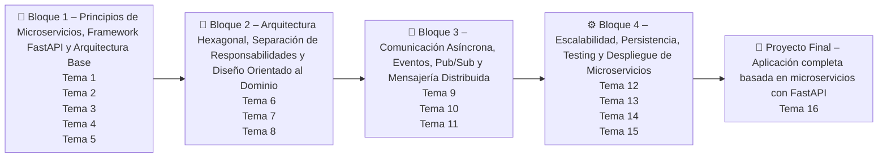

# CURSO: Arquitectura de Microservicios, Hexagonal, DDD y CQRS en FastAPI  

## Impartido por : Iván J.U.

# Introducción

Domina la arquitectura de microservicios con FastAPI, aprendiendo a diseñar APIs REST eficientes, implementar DDD y CQRS, gestionar comunicación síncrona y asíncrona con RabbitMQ y Kafka, aplicar seguridad con OAuth2 y JWT, y desplegar microservicios con Docker, Kubernetes y CI/CD. Un curso práctico para desarrolladores backend que buscan construir sistemas escalables y resilientes.

# ¿A quién va dirigido?

Desarrolladores backend con experiencia en Python que quieran especializarseen microservicios escalables con FastAPI, aplicando DDD, CQRS y comunicación distribuida.

# Objetivos

- Desarrollar microservicios escalables con FastAPI, aplicando arquitectura hexagonal, DDD y CQRS.
- Implementar APIs REST y WebSockets eficientes, con autenticación seguramediante OAuth2 y JWT.
- Gestionar comunicación entre microservicios con RabbitMQ, Kafka y Pub/Sub para sistemas distribuidos.
- Optimizar el rendimiento y la escalabilidad, utilizando caching, balanceo decarga y transacciones distribuidas.
- Automatizar despliegues en Docker y Kubernetes, asegurando CI/CD, monitoreo con Prometheus y logs centralizados.

# Requisitos

- Experiencia previa desarrollando con Python (v3 o superior) y Web Apis con FastAPI.
- Instalados y configurados: Visual Studio Code, Python (v3.11+), GIT, Docker Desktop, Redis 7.0+ o Memcached, Graphviz, Pormetheus, Grafana y Postman. Además de acceso a un clúster Kubernetes o MiniKube.
- Tener RabbitMQ, Kafka, PostgreSQL y Mongo instalados en contenedor Docker.
- Tener permisos de instalación, conexión estable a Internet, mínimo 16GB deRAM, 60GB de espacio libre en disco, procesador Intel Core (i5 o superior) o AMD Ryzen 5 y Unidad SSD.
- Tener Zoom Desktop instalado y configurados: auriculares, micrófono, cámara y 2 pantallas para seguir las sesiones en directo.

# Tabla de Contenidos

- [1. Introducción a la Arquitectura de Microservicios](./T1/Tema1.md)
- [2. FastAPI como Framework para Microservicios](./T2/Tema2.md)
- [3. Introducción a la Comunicación entre Microservicios Síncrona y Asíncrona](./T3/Tema3.md)
- [4. Manejo de Errores y Circuit Breakers en Microservicios](./T4/Tema4.md)
- [5. Seguridad y Buenas Prácticas en Microservicios](./T5/Tema5.md)
- [6. Arquitectura Hexagonal y Aplicación de DDD](./T6/Tema6.md)
- [7. Introducción a Domain-Driven Design (DDD)](./T7/Tema7.md)
- [8. Patrón CQRS en Microservicios](./T8/Tema8.md)
- [9. Introducción a la Mensajería con Kafka, RabbitMQ](./T9/Tema9.md)
- [10. Introducción a los WebSockets y Pub/Sub en Sistemas Distribuidos](./T10/Tema10.md)
- [11. Diseño de APIs REST y WebSockets en FastAPI](./T11/Tema11.md)
- [12. Escalabilidad y Optimización de Microservicios](./T12/Tema12.md)
- [13. Persistencia de Datos en Microservicios](./T13/Tema13.md)
- [14. Breve Introducción al Testing con Pytest](./T14/Tema14.md)
- [15. Buenas Prácticas y Automatización de Despliegues](./T15/Tema15.md)
- [16. Proyecto Final: Aplicación Completa Basada en Microservicios con FastAPI](./T16/Tema16.md)

# Sesiones

🔧 **Reorganización de Bloques**

---

- **Fechas: 4, 5, 6, 9, 10, 11, 12, 13 de junio (8 sesiones)**
- **Horarios: de 08:30 a 12:30 | 4 y 11 de junio: de 08:30 a 11:30**
- **Duración: 30.0 horas**

---

## 📘 Resumen de Bloques, Temas y Contenidos 

---

🔷 **Bloque 1 – Principios de Microservicios, Framework FastAPI y Arquitectura Base:**
 
- Tema 1: Introducción a la arquitectura de microservicios
 
- Tema 2: FastAPI como framework para microservicios
 
- Tema 3: Comunicación entre microservicios síncrona y asíncrona
 
- Tema 4: Manejo de errores y circuit breakers
 
- Tema 5: Seguridad y buenas prácticas en microservicios
  

**Contenidos clave:** 
 
- Evolución del monolito a microservicios, ventajas y riesgos
 
- Comparación técnica entre SOA y microservicios
 
- Uso avanzado de FastAPI: routers, dependencias, middlewares, settings
 
- Documentación OpenAPI y ejecución asincrónica con BackgroundTasks
 
- Estrategias de comunicación: REST, gRPC, eventos
 
- Gestión de errores, patrones resilientes (Retry, Circuit Breaker)
 
- Autenticación JWT, CORS, seguridad en endpoints RESTful

---

🧩 **Bloque 2 – Arquitectura Hexagonal, Separación de Responsabilidades y Diseño Orientado al Dominio:** 

 
- Tema 6: Arquitectura hexagonal y aplicación de DDD
 
- Tema 7: Introducción a Domain-Driven Design (DDD)
 
- Tema 8: Patrón CQRS en microservicios
  

**Contenidos clave:** 
 
- Diseño por capas: dominio, aplicación, infraestructura
 
- Puertos y adaptadores aplicados a FastAPI
 
- Interfaces desacopladas, inyección de dependencias
 
- Bloques tácticos de DDD: entidades, value objects, aggregates
 
- Separación entre modelos de lectura y escritura (CQRS)
 
- Implementación de comandos, queries y validadores
 
- Event sourcing (introducción)

---

🔀 **Bloque 3 – Comunicación Asíncrona, Eventos, Pub/Sub y Mensajería Distribuida:** 

 
- Tema 9: Introducción a la mensajería con Kafka, RabbitMQ
 
- Tema 10: WebSockets y Pub/Sub en sistemas distribuidos
 
- Tema 11: Diseño de APIs REST y WebSockets en FastAPI
  

**Contenidos clave:** 
 
- Brokers de eventos: diferencias entre RabbitMQ y Kafka
 
- Tópicos, colas, exchanges, bindings
 
- Patrones de eventos: notificación, estado transportado, idempotencia
 
- FastAPI con WebSockets: salas, gestión de conexiones, canales seguros
 
- Integración de pub/sub con Redis o Kafka
 
- Versionado y buenas prácticas en APIs REST
 
- Documentación automática, validación compleja con Pydantic

---

⚙️ **Bloque 4 – Escalabilidad, Persistencia, Testing y Despliegue de Microservicios:** 

 
- Tema 12: Escalabilidad y optimización de microservicios
 
- Tema 13: Persistencia de datos en microservicios
 
- Tema 14: Testing con Pytest
 
- Tema 15: CI/CD y monitorización
  

**Contenidos clave:** 
 
- Escalado horizontal/vertical, caching con Redis, balanceadores (Traefik, NGINX)
 
- SQLAlchemy y MongoDB en microservicios independientes
 
- Transacciones distribuidas, patrón saga y outbox
 
- Testing unitario, integración y E2E con Pytest y TestClient
 
- Automatización de despliegues con Docker Compose, GitHub Actions
 
- Logging estructurado (Loguru, structlog), métricas con Prometheus/Grafana

---

🎯 **Proyecto Final – Aplicación completa basada en microservicios con FastAPI:** 

 
- Tema 16: Proyecto final

**Contenidos clave:** 
 
- Desarrollo completo de un sistema distribuido con microservicios FastAPI
 
- Aplicación de todos los patrones y técnicas vistas en el curso
 
- Integración de seguridad, eventos, API Gateway, bases de datos, pruebas y despliegue automatizado
 
- Documentación del sistema y entrega en repositorio

---

### 🗓️ Planificación del curso con bloques temáticos y fechas corregidas 

| Sesión | Fecha | Día | Duración | Bloque temático | Temas tratados | 
| --- | --- | --- | --- | --- | --- | 
| 1️⃣ | 4 junio 2025 | Miércoles | 3h | Bloque 1  | Tema 1 y Tema 2 | 
| 2️⃣ | 5 junio 2025 | Jueves | 4h | Bloque 1 | Tema 3, Tema 4 y Tema 5 | 
| 3️⃣ | 6 junio 2025 | Lunes | 4h | Bloque 2 | Tema 6 | 
| 4️⃣ | 7 junio 2025 | Martes | 4h | Bloque 2 | Tema 7 y Tema 8 | 
| 5️⃣ | 10 junio 2025 | Miércoles | 3h | Bloque 3 | Tema 9 | 
| 6️⃣ | 11 junio 2025 | Jueves | 4h | Bloque 3 | Tema 10 y Tema 11| 
| 7️⃣ | 12 junio 2025 | Lunes | 4h | Bloque 4 | Tema 12 y Tema 13 | 
| 8️⃣ | 13 junio 2025 | Martes | 4h | Bloque 4 + Proyecto Final | Tema 14, Tema 15 y Tema 16 | 

---

# Metodología

## 📐 Aplicación de la regla 70-20-10 

| Proporción | Enfoque | Aplicación en tecnología | 
| --- | --- | --- | 
| 70% | Aprendizaje práctico (learning by doing) | Laboratorios, código real, refactorizaciones, debugging, retos | 
| 20% | Aprendizaje social / por observación | Pair coding, discusiones, revisión de código ajeno, ejemplos guiados | 
| 10% | Teoría / formación estructurada | Exposición de conceptos, presentación de patrones, lectura de estándares | 

---

## 🔍 ¿Cómo aplicar esta regla al **Bloque 1**  (Temas 1 a 5)?
Dado que el Bloque 1 incluye teoría clave (microservicios, FastAPI, REST, errores, seguridad), el **peso de la teoría será ligeramente superior al 10%**  al principio, pero sin perder el enfoque activo.

Esta sería la distribución en las sesiones **Sesión 1 y 2** , tema por tema:

---

🧭 **Sesión 1 – Tema 1 y parte del 2** 
| Tema | % Teoría | Qué hacer | 
| --- | --- | --- | 
| Tema 1 – Introducción a la arquitectura de microservicios | ~25% teoría | Mini-lecture de 20–25 min con esquema visual, casos reales, debate guiado. Exposición los conceptos más críticos: coupling, bounded context, independencia de despliegue. Sin entrar aún en patrones ni herramientas. | 
| Tema 2 – FastAPI como framework... | ~15% teoría | Mostrar con live coding lo que FastAPI resuelve: asincronía, validación, documentación. Después, que el alumno monte su primer microservicio mínimo con Swagger y Pydantic. | 

> **Nota:**  Esta sesión tiene más teoría porque el Tema 1 es fundacional. Pero el cierre debe ser práctico (laboratorio mínimo + monolito explorado).

---

🧭 **Sesión 2 – Tema 2 (continuación), 3, 4, inicio 5** 
| Tema | % Teoría | Qué hacer | 
| --- | --- | --- | 
| Tema 2 (estructura avanzada) | ~10% | Exposición estructura ideal: routers, servicios, settings, app factory. Luego, directo al laboratorio (auth-service). | 
| Tema 3 – Comunicación síncrona/asíncrona | ~10% | Breve exposición con esquema REST vs gRPC vs colas. No implementes aún colas. Código solo con httpx. | 
| Tema 4 – Manejo de errores | ~10% | Explicación con 1–2 diapositivas la diferencia entre errores técnicos y de dominio. Luego crea y lanza excepciones personalizadas en código. | 
| Tema 5 (JWT básico) | ~5% introducción | Exposición sólo qué es un JWT, cómo se usa y qué problemas resuelve. El laboratorio vendrá luego. | 

> Aquí se está mucho más cerca del **70% práctico** , con 3 microservicios en código y comunicación real entre ellos.

---

## 📘 Sesión 1 – 4 de junio (Miércoles) 

**Duración:**  3 horas

**Bloque:**  Principios de Microservicios, Framework FastAPI y Arquitectura Base

**Temas:** 
 
- Tema 1: Introducción a la arquitectura de microservicios
 
- Inicio de Tema 2: FastAPI como framework para microservicios

---

### 🎯 Objetivos de aprendizaje 

 
- Comprender el origen y motivación de los microservicios.
 
- Comparar monolito vs microservicios vs SOA.
 
- Identificar retos reales de escalado y despliegue.
 
- Ejecutar y analizar un monolito (Foodly).
 
- Introducir FastAPI como herramienta moderna y escalable.

---

### 🧭 Estructura de la sesión 

| Tiempo | Actividad | 
| --- | --- | 
| 08:30 – 08:50 | ✅ Introducción al curso: objetivos, bloques, metodología, repositorios | 
| 08:50 – 09:30 | 🧠 Exposición: evolución arquitectónica (monolito → microservicios), ventajas/desventajas, casos reales (Amazon, Netflix), nociones de SOA, ciclo de vida | 
| 09:30 – 10:00 | 💻 Laboratorio 1: ejecutar el monolito foodly/monolith, explorar rutas (/auth, /orders, /products), entender acoplamientos y límites | 
| 10:00 – 10:15 | 🔍 Discusión dirigida: ¿dónde romperías este monolito?, ¿qué problemas escalan mal? | 
| 10:15 – 11:00 | 🎓 Exposición + demo: FastAPI como alternativa a Flask/Django, rendimiento, asincronía, tipado fuerte, documentación automática | 
| 11:00 – 11:30 | 💻 Laboratorio 2: crear proyecto FastAPI mínimo con /ping, /status, usar Pydantic + settings + documentación Swagger | 

---

### 📂 Entregables al final de la sesión 

 
- Monolito ejecutado y entendido
 
- Primer microservicio FastAPI montado
 
- Cuestionario de Autoevaluación

---

## 📘 Sesión 2 – 5 de junio (Jueves) 

**Duración:**  4 horas

**Bloque:**  Principios de Microservicios, Framework FastAPI y Arquitectura Base

**Temas:** 
 
- Final de Tema 2: FastAPI como framework para microservicios
 
- Tema 3: Comunicación síncrona y asíncrona
 
- Tema 4: Manejo de errores
 
- Inicio de Tema 5: Seguridad básica con JWT

---

### 🎯 Objetivos de aprendizaje 

 
- Consolidar arquitectura base de un microservicio FastAPI.
 
- Aprender a usar httpx para comunicación entre servicios.
 
- Controlar errores con `HTTPException` y handlers.
 
- Aplicar BackgroundTasks.
 
- Introducir autenticación con JWT.

---

### 🧭 Estructura de la sesión 

| Tiempo | Actividad | 
| --- | --- | 
| 08:30 – 09:00 | ✅ Repaso y dudas de la sesión anterior. Discusión rápida de conceptos clave del monolito. | 
| 09:00 – 09:30 | 🧠 Exposición: estructura profesional de microservicio (routers, settings, main, db, services, api), middlewares, logging | 
| 09:30 – 10:30 | 💻 Laboratorio 3: construir auth-service real con endpoints /register, /login (sin JWT aún), usando MySQL, SQLAlchemy, settings, routers | 
| 10:30 – 11:00 | 🧠 Exposición: comunicación entre microservicios con httpx, diferencia REST/gRPC, asincronía y latencia | 
| 11:00 – 11:30 | 💻 Laboratorio 4: crear products-service, consultar productos desde orders-service usando httpx | 
| 11:30 – 12:00 | 🧠 Errores controlados: HTTPException, custom handlers, errores de negocio vs técnicos | 
| 12:00 – 12:30 | 💻 Laboratorio 5: integrar BackgroundTask (enviar email falso desde orders-service) + handler de error simulado | 
| --------------| Comienzo de Proyecto Final |

---

### 📂 Entregables al final de la sesión 

 
- `auth-service` y `products-service` funcionando con base de datos propia
 
- Comunicación REST entre servicios con `httpx`
 
- Uso de BackgroundTask y control de errores con FastAPI

